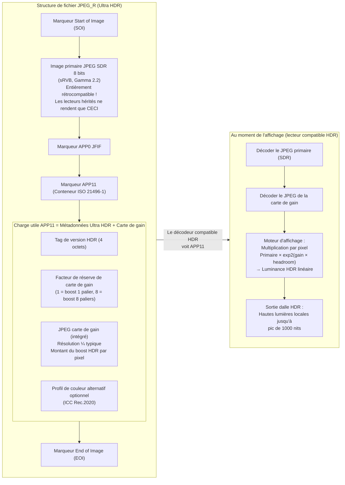

# Chapitre 21 : HDR et Ultra HDR

La photographie Standard Dynamic Range (SDR) — sRVB 8 bits par canal encodé avec une courbe gamma 2.2 et masterisé pour des écrans de 100 nits — a été conçue pour les CRT des années 1990. Les capteurs de smartphones modernes capturent **10 à 14 paliers de plage dynamique** (rapport de contraste de 1024:1 à 16384:1), mais un JPEG SDR 8 bits ne peut en restituer que environ 6 avant de brûler les hautes lumières ou d'écraser les ombres dans le bruit. Les formats **High Dynamic Range (HDR)** résolvent ce problème en stockant la luminance de la scène sur 10 bits ou plus par canal, en utilisant des fonctions de transfert perceptuellement uniformes ou référencées à la scène, et en ciblant des pics de luminosité d'affichage de 1 000 à 10 000 nits au lieu de 100.

Ce chapitre couvre trois standards HDR opérationnels dans Android Camera2 :
- **HDR10** (10 bits, ST.2084 PQ, Rec.2020, métadonnées statiques) pour la vidéo
- **HLG (Hybrid Log-Gamma)** (10 bits, rétrocompatible SDR, ARIB STD-B67) pour la diffusion et la vidéo
- **JPEG_R / Ultra HDR** (Android 14 API 34+, ISO 21496-1) — le format révolutionnaire pour photos fixes qui intègre une "carte de gain" secondaire à l'intérieur d'un JPEG SDR 8 bits standard afin que les lecteurs hérités voient une photo normale, tandis que les écrans HDR boostent localement les hautes lumières jusqu'à 8 paliers.

Tous trois sont documentés dans les sections *Ultra HDR / JPEG_R* et *Dynamic Range* du document de recherche du projet, qui spécifie également le mandat Android CDD (Compatibility Definition Document) Performance Class 15 selon lequel tous les fleurons de 2024+ doivent exposer le JPEG_R comme format de sortie à la taille maximale des images fixes. Vous pouvez vérifier le support de l'HDR10, du HLG et du JPEG_R par ID de caméra dans l'application [Android Camera Parameters](https://github.com/zoozooll/AndroidCameraParameters) sur le [Play Store](https://play.google.com/store/apps/details?id=com.zoozooll.cameraparameters), qui énumère chaque clé `DynamicRangeProfiles` et indique si `ImageFormat.JPEG_R` apparaît dans `getOutputSizes()`.

## Fondamentaux de la plage dynamique : Pourquoi 8 bits ne suffisent pas

Avant de plonger dans les formats spécifiques, définissons ce que "plage dynamique" signifie pour l'affichage par rapport à la capture :

| Métrique | SDR (sRVB/BT.709) | HDR10 (BT.2100) | Vision humaine |
|----------|-------------------|-----------------|----------------|
| **Profondeur de bits** | 8 bits / canal (256 niveaux) | 10 bits / canal (1024 niveaux) | ~4,8 bits perceptuels, mais logarithmique |
| **Luminance de pic** | 100 nits (cd/m²) | 1 000+ nits pic (selon contenu) | ~20 000 nits (soleil+ciel) à ~0,001 nits (pièce sombre) |
| **Fonction de transfert** | Gamma 2.2 ou sRVB par morceaux | ST.2084 Perceptual Quantizer (PQ) | Réponse logarithmique (loi de Weber-Fechner) |
| **Gamme de couleurs** | sRVB / BT.709 (~35 % du visible) | Rec.2020 (~75 % du visible) | Spectre visible complet |
| **Rapport de contraste (utile)** | ~6 paliers (64:1) | ~10 paliers (1024:1) minimum | ~14 paliers (16384:1) dans une seule scène |

La courbe gamma utilisée par le SDR a été conçue pour correspondre à la non-linéarité du canon à électrons des CRT des années 1990, et non au système visuel humain. La courbe PQ (Perceptual Quantizer) utilisée par l'HDR10 a été standardisée en 2014 par Dolby et la BBC sous la norme ST.2084, et s'ajuste mathématiquement au modèle de Barten sur la sensibilité au contraste humain — ainsi chacune des 1 024 valeurs de code en PQ 10 bits représente une différence juste perceptible (JND) de luminosité sur toute la plage de 0 à 10 000 nits.

```mermaid
flowchart TD
    subgraph SDRpath["Pipeline Capture SDR 8 bits → Affichage"]
        S1["RAW 14 bits<br/>linéaire du capteur"] --> S2["Courbe Gamma 2.2<br/>(Détruit détails ombres)"]
        S2 --> S3["Quantification 8 bits<br/>(Seulement 22 codes pour<br/>0–10% de luminance)"]
        S3 --> S4["Écrêtage gamme sRVB<br/>(25% des couleurs perdues)"]
        S4 --> S5["Pic 100 nits<br/>(Ciel/Soleil blancs brûlés)"]
    end

    subgraph HDRpath["Pipeline Capture HDR10 10 bits → Affichage"]
        H1["RAW 14 bits<br/>linéaire du capteur"] --> H2["Courbe ST.2084 PQ<br/>(S'ajuste au modèle JND)"]
        H2 --> H3["Quantification 10 bits<br/>(140 codes pour<br/>0–10% de luminance)"]
        H3 --> H4["Gamme Rec.2020<br/>(75% couleurs visibles)"]
        H4 --> H5["Pic 1000+ nits<br/>(Détails ciel préservés)"]
    end

    style SDRpath fill:#ffeded,stroke:#b91c1c
    style HDRpath fill:#e8fff0,stroke:#15803d
```



Le diagramme Mermaid ci-dessus quantifie les deux différences les plus importantes : le SDR n'utilise que environ 22 codes 8 bits pour les 10 % inférieurs de luminance (provoquant des bandes dans les ombres lorsqu'elles sont remontées), tandis que le PQ alloue 140 codes 10 bits à la même plage. L'uniformité perceptuelle de la courbe PQ est la raison pour laquelle l'HDR 10 bits paraît plus fluide que le SDR 8 bits, même lorsqu'il est sous-échantillonné à 100 nits sur un écran SDR.

## Vidéo HDR10 : PQ 10 bits + Rec.2020 + Métadonnées statiques

L'HDR10 est le format vidéo HDR de référence — chaque smartphone de 2021+ doté d'un écran OLED prend en charge la lecture HDR10, et chaque SoC Snapdragon 865+ / Exynos 2100+ prend en charge l'enregistrement HDR10 via Camera2. Le format spécifie :

- Encodage **HEVC Main10 Profile** (H.265) avec des échantillons de 10 bits
- Fonction de transfert **ST.2084 PQ** à la place du gamma
- Primaires de couleur **Rec.2020 (BT.2100)** (gamme large)
- **Métadonnées statiques** (SMPTE ST 2086 / CTA-861.3) dans le message HEVC SEI :
  - `max_content_light_level` (MaxCLL) : luminance de pic de n'importe quel pixel unique, en nits
  - `max_frame_average_light_level` (MaxFALL) : luminance moyenne de l'image la plus lumineuse
  - `display_primaries` et `white_point` : volume de couleur de l'écran de mastering
  - `max_luminance` / `min_luminance` : pic et niveau de noir de l'écran de mastering

Les métadonnées statiques signifient qu'un seul ensemble de valeurs s'applique à toute la durée de la vidéo. La variante à métadonnées dynamiques (HDR10+, alternative de Samsung au Dolby Vision) n'est pas exposée via Camera2 standard — elle nécessite des extensions constructeur — mais les métadonnées statiques HDR10 sont universellement supportées via `DynamicRangeProfiles`.

### Interroger le support HDR10 et HLG via DynamicRangeProfiles

Android 13 (API 33) a introduit `CameraCharacteristics.REQUEST_AVAILABLE_DYNAMIC_RANGE_PROFILES` comme alternative structurée à la vérification manuelle du support du format 10 bits dans `StreamConfigurationMap`. Chaque surface de sortie possède un profil choisi au moment de la création de la session :

```kotlin
import android.hardware.camera2.CameraCharacteristics
import android.hardware.camera2.params.DynamicRangeProfiles
import android.util.Size

data class HdrVideoProfile(
    val profile: Long, // DynamicRangeProfiles.HDR10, HLG10, etc.
    val supportedSizes: List<Size>,
    val standardSizesFallbacks: List<Size>
)

fun enumerateHdrProfiles(
    characteristics: CameraCharacteristics
): List<HdrVideoProfile> {
    val profiles: DynamicRangeProfiles? =
        characteristics.get(
            CameraCharacteristics.REQUEST_AVAILABLE_DYNAMIC_RANGE_PROFILES
        ) ?: return emptyList()

    val configMap = characteristics.get(
        CameraCharacteristics.SCALER_STREAM_CONFIGURATION_MAP
    ) ?: return emptyList()

    return listOf(
        DynamicRangeProfiles.HDR10,
        DynamicRangeProfiles.HLG,
        DynamicRangeProfiles.HDR10_PLUS, // Souvent null sur les appareils non-Samsung
        DynamicRangeProfiles.DOLBY_VISION_10B_HDR_OEM // Nécessite licence Dolby
    ).mapNotNull { profile ->
        if (!profiles.isProfileSupported(profile)) return@mapNotNull null

        val hdrSizes = profiles.getProfileSupportedSizes(profile)
            ?.toList() ?: emptyList()
        val sdrFallbackSizes = configMap.getOutputSizes(
            android.graphics.ImageFormat.PRIVATE
        )?.toList() ?: emptyList()

        HdrVideoProfile(profile, hdrSizes, sdrFallbackSizes)
    }
}
```

La méthode `DynamicRangeProfiles.getProfileSupportedSizes(profile)` renvoie l'*intersection* des tailles capables de 10 bits et du support du pipeline HDR de l'ISP. Si `Size(3840, 2160)` (4K UHD) n'apparaît pas dans `getProfileSupportedSizes(HDR10)`, alors même si le 4K SDR est supporté, le HAL n'a pas assez de débit ISP pour l'encodage HDR10 4K (généralement une limite de 600 Mpixels/sec sur les Snapdragon série 8). L'application Android Camera Parameters affiche ce tableau d'intersection dans l'onglet HDR afin que vous puissiez vérifier avant d'écrire le code de session.

### Définir HDR10 sur OutputConfiguration pour l'enregistrement

Le profil de plage dynamique doit être défini **avant la création de la session** via `OutputConfiguration.setDynamicRangeProfile()`. Changer de profil en cours de session nécessite de démonter et de recréer la session.

```kotlin
import android.hardware.camera2.params.DynamicRangeProfiles
import android.hardware.camera2.params.OutputConfiguration
import android.media.MediaCodec
import android.media.MediaCodecInfo
import android.view.Surface

fun createHdr10VideoOutput(
    encoderSurface: Surface,
    previewSurface: Surface
): Pair<OutputConfiguration, OutputConfiguration> {
    val encodeOutConfig = OutputConfiguration(encoderSurface).apply {
        setDynamicRangeProfile(DynamicRangeProfiles.HDR10)
    }
    val previewOutConfig = OutputConfiguration(previewSurface).apply {
        setDynamicRangeProfile(DynamicRangeProfiles.HDR10)
    }
    return Pair(encodeOutConfig, previewOutConfig)
}

fun configureHdr10MediaCodec(width: Int, height: Int): MediaCodec {
    val codec = MediaCodec.createEncoderByType("video/hevc")
    val format = android.media.MediaFormat.createVideoFormat(
        "video/hevc", width, height
    ).apply {
        setInteger(MediaFormat.KEY_COLOR_FORMAT,
            MediaCodecInfo.CodecCapabilities.COLOR_FormatSurface)
        setInteger(MediaFormat.KEY_BIT_RATE, 80_000_000) // 80 Mbps pour l'HDR10 4K
        setInteger(MediaFormat.KEY_FRAME_RATE, 30)
        setInteger(MediaFormat.KEY_I_FRAME_INTERVAL, 1)
        setInteger(MediaFormat.KEY_PROFILE,
            MediaCodecInfo.CodecProfileLevel.HEVCProfileMain10)
        setInteger(MediaFormat.KEY_COLOR_STANDARD,
            MediaFormat.COLOR_STANDARD_BT2020)
        setInteger(MediaFormat.KEY_COLOR_TRANSFER,
            MediaFormat.COLOR_TRANSFER_ST2084) // ST.2084 PQ
        setInteger(MediaFormat.KEY_COLOR_RANGE,
            MediaFormat.COLOR_RANGE_LIMITED)
        setFeatureEnabled(MediaCodecInfo.CodecCapabilities.FEATURE_HdrEditing, true)
    }
    codec.configure(format, null, null, MediaCodec.CONFIGURE_FLAG_ENCODE)
    return codec
}
```

Les trois clés `COLOR_*` (`BT2020`, `ST2084`, `LIMITED`) combinées avec `HEVCProfileMain10` créent un flux HDR10 exact au bit près. Si vous omettez `KEY_COLOR_TRANSFER` ou le réglez sur la mauvaise valeur (ex: `COLOR_TRANSFER_GAMMA_2_2`), YouTube et les autres lecteurs interpréteront le flux 10 bits comme du SDR et le liront de manière délavée ou saturée.

## HLG (Hybrid Log-Gamma) : HDR de diffusion rétrocompatible SDR

L'HLG (standardisé sous le nom ARIB STD-B67 par la BBC et la NHK en 2015) a été conçu pour la télévision en direct, où l'on ne peut savoir à l'avance si le téléspectateur possède un écran HDR ou SDR. L'innovation du HLG réside dans une **fonction de transfert hybride par morceaux** :
- Les 50 % inférieurs de la plage de codes sont une courbe gamma standard (correspond exactement au SDR)
- Les 50 % supérieurs sont une courbe logarithmique (stocke les détails des hautes lumières HDR)

Cela signifie qu'une vidéo HLG lue sur un écran SDR paraît identique à une vidéo SDR gamma 2.2 correctement réglée, tandis qu'un écran HDR "débloque" la moitié supérieure logarithmique et restitue les hautes lumières jusqu'à 1 000 nits sans aucun signalement de métadonnées. Aucun mappage de tonalité SDR→HDR explicite n'est requis.

Pour l'usage vidéo, l'HLG diffère de l'HDR10 sur trois points concernant Camera2 :
1. **Aucune métadonnée statique requise** — L'HLG est référencé à la scène, l'écran dérive donc le pic de luminosité du signal lui-même. Cela simplifie la configuration de MediaCodec (pas d'insertion SEI pour MaxCLL/MaxFALL).
2. **Constante de transfert de couleur différente** — utiliser `MediaFormat.COLOR_TRANSFER_HLG` au lieu de `ST2084`.
3. **Vérification `DynamicRangeProfiles.HLG`** au lieu de `HDR10`.

Toute l'autre utilisation de l'API (OutputConfiguration.setDynamicRangeProfile, création de session, CaptureRequest) est identique à l'HDR10. Le document de recherche note que l'HLG est le format préféré pour les vidéos générées par les utilisateurs et partagées sur les réseaux sociaux, car il s'affiche correctement sur les écrans SDR et HDR sans artefacts de mappage de tonalité.

## JPEG_R (Ultra HDR) : SDR ISO 21496-1 + Carte de gain intégrée

La plus grande avancée de la photographie HDR mobile depuis la capture HDR multi-images est le **JPEG_R**, introduit dans Android 14 (API 34) et codifié comme standard international **ISO 21496-1**. Le format est rétrocompatible par construction :

> Un fichier JPEG_R est un JPEG SDR 8 bits standard avec un **JPEG secondaire plus petit (la "carte de gain" ou gain map)** intégré dans le segment de marqueur `APP11` en utilisant le format de conteneur ISO 21496-1. Les décodeurs JPEG hérités ignorent les marqueurs APP non reconnus et ne rendent que le primaire 8 bits. Les décodeurs compatibles HDR lisent à la fois le primaire et la carte de gain, et reconstruisent la luminance originale de la scène HDR linéaire en multipliant les valeurs des pixels primaires par exp2(pixel_carte_gain × facteur_headroom) sur une base par pixel.

Ce "boost par pixel" est ce qui rend l'Ultra HDR *localement* HDR (contrairement aux métadonnées statiques HDR10, qui appliquent une valeur de pic globalement). Une carte de gain ISO 21496-1 à ¼ de résolution (typique) peut encoder jusqu'à **8 paliers de réserve (headroom) de hautes lumières locales** — assez pour récupérer les détails des nuages dans un coucher de soleil tout en gardant les tons moyens à une luminance SDR naturelle.

L'Android CDD Performance Class 15 impose :
- Tous les appareils annonçant CDD PC-15 (fleurons 2024+ selon le tableau des spécifications CDD) **DOIVENT** supporter la sortie `ImageFormat.JPEG_R` à la taille maximale de capture fixe.
- La taille maximale de capture fixe pour le JPEG_R doit être ≥ la taille YUV maximale pour cet ID de caméra.

La section *Ultra HDR / JPEG_R* du document de recherche contient une décomposition complète au niveau de l'octet de la disposition du marqueur APP11, mais pour l'API Camera2, vous n'avez qu'à traiter `ImageFormat.JPEG_R` comme un seul tampon de sortie opaque — le HAL assemble le primaire + la carte de gain en interne.



Détail critique dans le diagramme Mermaid : le JPEG PRIMAIRE est une photo SDR 8 bits tout à fait valide, donc même une bibliothèque JPEG des années 2010 peut afficher une image correcte. Les données HDR sont *additives*, elles ne remplacent pas le fichier primaire — c'est pourquoi les fichiers JPEG_R fonctionnent de manière transparente avec toutes les plateformes de partage de photos existantes (Instagram, Google Photos, Messages) qui n'ont pas encore de décodeurs Ultra HDR.

### Interroger le support JPEG_R et capturer des clichés Ultra HDR

Capturer des clichés Ultra HDR est fonctionnellement identique à la capture d'un JPEG standard, avec deux différences :
1. Interroger `ImageFormat.JPEG_R` dans `StreamConfigurationMap.getOutputSizes()` au lieu de `ImageFormat.JPEG`
2. Si vous utilisez `DynamicRangeProfiles` (recommandé), réglez le profil de la sortie JPEG_R sur `DynamicRangeProfiles.JPEG_R`

```kotlin
import android.graphics.ImageFormat
import android.hardware.camera2.CameraCharacteristics
import android.hardware.camera2.CameraDevice
import android.hardware.camera2.CaptureRequest
import android.hardware.camera2.params.DynamicRangeProfiles
import android.hardware.camera2.params.OutputConfiguration
import android.media.ImageReader
import android.util.Size

var jpegRImageReader: ImageReader? = null

fun queryJpegRSupport(
    characteristics: CameraCharacteristics
): Pair<Boolean, Size?> {
    val caps = characteristics.get(
        CameraCharacteristics.REQUEST_AVAILABLE_CAPABILITIES
    ) ?: intArrayOf()
    val supportsDynamicRange = caps.contains(
        CameraCharacteristics.REQUEST_AVAILABLE_CAPABILITIES_DYNAMIC_RANGE_TEN_BIT
    )
    val drProfiles = characteristics.get(
        CameraCharacteristics.REQUEST_AVAILABLE_DYNAMIC_RANGE_PROFILES
    )
    val supportsJpegRProfile =
        drProfiles?.isProfileSupported(DynamicRangeProfiles.JPEG_R) == true

    val configMap = characteristics.get(
        CameraCharacteristics.SCALER_STREAM_CONFIGURATION_MAP
    ) ?: return Pair(false, null)

    val jpegRSizes = configMap.getOutputSizes(ImageFormat.JPEG_R)
        ?: emptyArray()
    val maxJpegR = jpegRSizes.maxByOrNull { it.width * it.height }

    return Pair(
        supportsDynamicRange && supportsJpegRProfile && jpegRSizes.isNotEmpty(),
        maxJpegR
    )
}

fun setupJpegRCapture(
    cameraDevice: CameraDevice,
    maxJpegRSize: Size,
    previewSurface: Surface
) {
    jpegRImageReader = ImageReader.newInstance(
        maxJpegRSize.width, maxJpegRSize.height,
        ImageFormat.JPEG_R, 2
    )

    val jpegROutput = OutputConfiguration(
        jpegRImageReader!!.surface
    ).apply {
        setDynamicRangeProfile(DynamicRangeProfiles.JPEG_R)
    }
    val previewOutput = OutputConfiguration(previewSurface)

    val outputs = listOf(previewOutput, jpegROutput)
    val sessionConfig = android.hardware.camera2.params.SessionConfiguration(
        android.hardware.camera2.params.SessionConfiguration.SESSION_REGULAR,
        outputs,
        { r -> backgroundHandler.post(r) },
        object : android.hardware.camera2.CameraCaptureSession.StateCallback() {
            override fun onConfigured(
                session: android.hardware.camera2.CameraCaptureSession
            ) {
                val stillBuilder = cameraDevice.createCaptureRequest(
                    CameraDevice.TEMPLATE_STILL_CAPTURE
                ).apply {
                    addTarget(previewSurface)
                    addTarget(jpegRImageReader!!.surface)
                    set(CaptureRequest.CONTROL_MODE,
                        CaptureRequest.CONTROL_MODE_USE_SCENE_MODE)
                    set(CaptureRequest.CONTROL_SCENE_MODE,
                        CaptureRequest.CONTROL_SCENE_MODE_HDR)
                    // Déclenche la fusion HDR multi-images du HAL avant l'encodage JPEG_R
                }

                session.capture(stillBuilder.build(),
                    JpegRCaptureCallback(), backgroundHandler)
            }
            override fun onConfigureFailed(
                s: android.hardware.camera2.CameraCaptureSession
            ) = Log.e(TAG, "Échec session JPEG_R")
        }
    )
    cameraDevice.createCaptureSession(sessionConfig)
}
```

Régler `CONTROL_SCENE_MODE_HDR` parallèlement à `TEMPLATE_STILL_CAPTURE` déclenche le bracketing HDR multi-images et le pipeline de fusion du HAL — généralement 3 images à -2 / 0 / +2 EV, alignées et fusionnées avant d'être séparées en primaire SDR + carte de gain de 8 paliers pour l'encodage ISO 21496-1. Omettre le mode scène produit toujours un fichier JPEG_R valide, mais la réserve de la carte de gain sera limitée à la DR native du capteur (~10 paliers) au lieu de la DR de fusion computationnelle (~14–16 paliers).

### Recevoir et enregistrer l'image JPEG_R

L'`OnImageAvailableListener` pour le JPEG_R est identique au niveau de l'octet à un écouteur JPEG — le HAL a déjà concaténé le primaire + la carte de gain APP11 dans un tampon unique :

```kotlin
import java.io.File
import java.io.FileOutputStream

inner class JpegRCaptureCallback : ImageReader.OnImageAvailableListener {
    override fun onImageAvailable(reader: ImageReader) {
        reader.acquireLatestImage()?.use { image ->
            val buffer = image.planes[0].buffer
            val jpegRBytes = ByteArray(buffer.remaining())
            buffer.get(jpegRBytes)

            val outFile = File(getExternalFilesDir(null),
                "ULTRA_HDR_${System.currentTimeMillis()}.jpg")
            FileOutputStream(outFile).use { it.write(jpegRBytes) }
        }
    }
}
```

L'enregistrement en tant que `.jpg` (et non une extension personnalisée) est critique pour la compatibilité — les visionneuses de photos héritées regardent l'extension du fichier avant d'inspecter son contenu, et une extension `.jpg` garantit qu'elles tenteront de décoder le primaire SDR standard avant même de voir le marqueur APP11.

## Résumé de la comparaison des formats HDR

| Critère | HDR10 (Vidéo) | HLG (Vidéo) | JPEG_R / Ultra HDR (Fixe) |
|---------|---------------|-------------|---------------------------|
| **Profondeur de bits** | HEVC Main10 10 bits | HEVC Main10 10 bits | Primaire 8 bits + carte de gain 8 bits → net ~12 bits équivalent |
| **Pics nits (contenu)** | 1 000–10 000 (métadonnées statiques) | 1 000 nits typique (réf. scène) | ~2 000 nits (8 paliers × 8 bits réserve selon ISO 21496-1) |
| **Rétrocompatible** | Non — la lecture SDR paraît délavée sans mappage de tonalité | **Oui** — les écrans SDR rendent parfaitement la moitié gamma | **Oui** — les lecteurs hérités ne rendent que le primaire SDR 8 bits |
| **Type plage dynamique** | Global (métadonnées statiques par vidéo) | Global (réf. scène, pas de métadonnées) | **Local (carte de gain par pixel)** — peut booster les nuages sans délaver la peau |
| **Points d'entrée API Camera2** | `DynamicRangeProfiles.HDR10` + `MediaFormat.COLOR_TRANSFER_ST2084` | `DynamicRangeProfiles.HLG` + `MediaFormat.COLOR_TRANSFER_HLG` | `ImageFormat.JPEG_R` + `DynamicRangeProfiles.JPEG_R` |
| **Version Android** | API 33+ (DynamicRangeProfiles) | API 33+ | API 34+ (Android 14), mandat CDD PC-15 |
| **Cas d'utilisation** | Vidéo HDR cinématique pour YouTube/Netflix | Diffusion en direct, vidéo sociale générée par utilisateur | Photographie HDR rétrocompatible avec toutes les plateformes photo du monde |

## Résumé

Ce chapitre a couvert les trois technologies HDR fonctionnelles disponibles dans Android Camera2 :

- **Fondamentaux de la plage dynamique** : Le gamma 8 bits et le pic de 100 nits du SDR ne peuvent représenter les 14 paliers capturés par les capteurs modernes. Le PQ (HDR10) et le HLG utilisent des courbes 10 bits perceptuellement optimisées pour s'adapter à toute la DR du capteur.
- **La vidéo HDR10** utilise `DynamicRangeProfiles.HDR10` sur l'OutputConfiguration, l'encodage HEVC Main10 avec `COLOR_TRANSFER_ST2084` (PQ), les primaires `COLOR_STANDARD_BT2020` et les métadonnées statiques SMPTE ST 2086.
- **La vidéo HLG** utilise `DynamicRangeProfiles.HLG`, `COLOR_TRANSFER_HLG` et aucune métadonnée statique. Elle est rétrocompatible SDR par conception, ce qui la rend idéale pour la diffusion et la vidéo générée par l'utilisateur.
- **JPEG_R / Ultra HDR** (API 34+, ISO 21496-1, mandat CDD PC-15) intègre une carte de gain par pixel dans le marqueur APP11 d'un JPEG SDR 8 bits standard. Les décodeurs hérités rendent l'image primaire ; les décodeurs HDR appliquent la carte de gain pour obtenir jusqu'à 8 paliers de réserve de hautes lumières locales.
- Les deux diagrammes Mermaid (pipelines SDR vs HDR, structure de fichier JPEG_R) visualisent les chemins d'encodage et de rendu.

## Et ensuite ?

Dans le **Chapitre 22 : Les extensions de caméra**, nous sortons de la `CameraCaptureSession` standard pour entrer dans le monde de la photographie computationnelle accélérée par l'OEM via `CameraExtensionSession`. Vous apprendrez à interroger `CameraExtensionCharacteristics.getSupportedExtensions()` pour le mode Nuit (fusion multi-images à exposition longue), le Bokeh (flou d'arrière-plan par déduction de profondeur / mode portrait), l'HDR (fusion de bracketing multi-exposition), la Retouche Faciale (lissage de peau par ML) et le mode Automatique (extension choisie par le HAL). Le chapitre inclut un exemple complet de capture de portrait en utilisant EXTENSION_BOKEH, explique `getEstimatedCaptureLatencyRangeMillis()` pour les indicateurs de progression UI, et utilise un diagramme Mermaid pour contraster le pipeline de session standard avec le pipeline de session d'extension qui délègue le travail de ML et de fusion au DSP du constructeur.

Vérifiez quelles extensions de caméra votre appareil supporte par ID de caméra dans l'application [Android Camera Parameters](https://play.google.com/store/apps/details?id=com.zoozooll.cameraparameters) — l'onglet Extensions énumère chaque constante `Extension` et ses tailles de capture supportées. Les nouveaux rapports d'appareils soumis au projet [GitHub](https://github.com/zoozooll/AndroidCameraParameters) aident à construire une base de données publique du support des extensions par les OEM.
