# Chapitre 19 : Vidéo haute vitesse

La vidéo au ralenti capture des moments que l'œil humain ne peut pas résoudre : des gouttelettes d'eau se détachant d'un robinet à 120 fps (ralenti 4×), les ailes d'un colibri battant à 240 fps (ralenti 8×) ou un ballon éclatant à 960 fps (ralenti 32× sur certains fleurons Samsung). L'implémentation de la capture à haute fréquence d'images dans Android Camera2 ne consiste pas simplement à régler `SENSOR_FRAME_DURATION` sur un petit nombre — vous devez utiliser une session dédiée nommée **`CameraConstrainedHighSpeedCaptureSession`**, soumettre des salves d'images pré-validées via **`createHighSpeedRequestList`**, et restreindre vos tailles/résolutions de sortie à une liste de configurations "approuvées haute vitesse" spécifiques à l'appareil, renvoyée par **`SCALER_STREAM_CONFIGURATION_MAP.getHighSpeedVideoSizes`**.

Ce chapitre s'appuie directement sur la section *High-Speed Sessions* du document de recherche du projet, qui compare le coût CPU de la soumission de 240 CaptureRequests individuelles par seconde (prohibitif — jusqu'à 70 % d'utilisation CPU sur un Snapdragon 8 Gen 2, contre < 5 % avec la liste de salve contrainte) et énumère les contraintes exactes que le HAL impose sur le nombre de sorties, les plages de FPS et les modèles de requêtes. Vous pouvez consulter les plages de FPS supportées par votre appareil pour chaque ID de caméra dans l'application [Android Camera Parameters](https://github.com/zoozooll/AndroidCameraParameters) — également disponible sur le [Google Play Store](https://play.google.com/store/apps/details?id=com.zoozooll.cameraparameters) — qui expose les résultats bruts de `getHighSpeedVideoSizes()` et `getHighSpeedVideoFpsRangesFor()` dans son panneau de configuration de flux.

## Pourquoi les sessions standard ne fonctionnent pas à 240 FPS

Avant de plonger dans l'API haute vitesse dédiée, comprenez ce qui différencie fondamentalement une capture à 240 fps d'une capture à 30 fps :

- **Débit** : Une image 1080p en YUV_420_888 8 bits pèse environ 3,0 Mo. À 240 fps, cela représente **720 Mo/s** de données de pixels circulant dans la mémoire — 8 fois la charge de 30 fps, et assez pour saturer une liaison MIPI D-PHY v1.2 à pleine bande passante.
- **Budget de latence** : L'intervalle entre deux images à 240 fps est de **4,167 ms**. Si le service caméra d'Android passe plus de 2 ms juste à préparer (marshal) un paquet CaptureRequest de l'espace utilisateur vers le HAL, vous avez déjà consommé 50 % de votre budget avant même que le capteur ne commence l'exposition.
- **Tolérance à la gigue (jitter)** : Les appels individuels à `capture()` / `setRepeatingRequest()` passent par le pont Framework → CameraService → HAL via l'IPC Binder, ce qui introduit une gigue de ±1 ms sous charge. À 240 fps, même une gigue de ±1 ms provoque des incohérences visibles de durée d'image et un décalage de synchronisation A/V.
- **Surcharge CPU** : Chaque `CaptureRequest` nécessite la construction d'objets, le marshalling du paquet, une transaction binder et une validation côté HAL. Faire cela 240 fois par seconde en espace utilisateur a été mesuré par l'équipe de recherche à **68–74 % d'utilisation CPU soutenue sur un Snapdragon 8 Gen 2** (Cortex-X3 + A715), ce qui tuera la fluidité de l'aperçu, drainera la batterie en 20 minutes et fera planter le HAL thermique bien avant d'enregistrer un clip utilisable.

La **Session de capture haute vitesse contrainte** résout tous ces problèmes en regroupant N CaptureRequests individuelles en **une seule liste de salve pré-validée que l'ordonnanceur matériel du HAL consomme directement**, contournant entièrement la surcharge binder par image.

```mermaid
flowchart TD
    subgraph Standard["Session de capture standard (30/60 FPS)"]
        S1["L'app construit une CaptureRequest<br/>par image via Builder"] --> S2["IPC Binder vers CameraService<br/>(1 appel par image)"]
        S2 --> S3["CameraService valide +<br/>envoie au HAL"]
        S3 --> S4["Le HAL planifie l'image<br/>sur le pipeline ISP du capteur"]
        S4 --> S5["Sortie d'image<br/>→ Surface / MediaCodec"]
    end

    subgraph HighSpeed["CameraConstrainedHighSpeedCaptureSession (120/240 FPS)"]
        H1["L'app appelle createHighSpeedRequestList()<br/>UNE FOIS — construit la liste de salve"] --> H2["Le HAL pré-valide TOUTES les images<br/>de la liste (timings, tailles, FPS)"]
        H2 --> H3["Liste de salve chargée dans<br/>l'ordonnanceur matériel du HAL"]
        H3 --> H4["L'ordonnanceur pilote le capteur + ISP<br/>directement — pas de Binder par image"]
        H4 --> H5["Sortie de 240 images/sec<br/>→ Encodeur vidéo MediaCodec"]
    end
```



Le diagramme explicite la différence architecturale : le chemin standard a une cascade d'IPC binder pour chaque image, tandis que le chemin haute vitesse construit et valide le planning une seule fois, puis laisse le séquenceur matériel dédié du HAL délivrer les images sans interruption.

## Plages de FPS supportées et facteurs de ralenti

L'API Android Camera2 n'expose pas le "ralenti" comme une fonctionnalité — elle expose des paires **`FpsRange`** `[min, max]` où min == max pour une capture à FPS fixe. Le facteur de lecture au ralenti est dérivé en divisant le FPS de capture par le FPS de lecture (qui est presque toujours de 30 fps pour la vidéo grand public) :

| FPS Capture | `FpsRange` fixe | Lecture @ 30 fps → Facteur de ralenti | Résolution minimum typique | Gamme d'appareil typique |
|-------------|-----------------|----------------------------------------|----------------------------|--------------------------|
| 120 | `[120, 120]` | 120 ÷ 30 = **4× plus lent** | 1280×720 (720p) | Milieu de gamme et plus |
| 240 | `[240, 240]` | 240 ÷ 30 = **8× plus lent** | 1280×720 ou 1920×1080 | Fleuron (Snapdragon série 8, Exynos 2xxx) |
| 480 | `[480, 480]` | 480 ÷ 30 = **16× plus lent** | 720p (souvent recadré) | Téléphones de jeu (Black Shark, ROG Phone, RedMagic) |
| 960 | `[960, 960]` | 960 ÷ 30 = **32× plus lent** | 720p (tampon DRAM sur capteur, salves courtes &lt;0.5 s) | Samsung Galaxy S/Ultra, Sony Xperia série 1 |

Crucialement, **les modes 960 fps et 480 fps sont généralement des modes "super-ralenti" qui nécessitent une mise en tampon DRAM sur le capteur** et ne capturent que ~0,33–0,5 seconde de métrage avant de remplir le tampon — ces modes ne sont PAS exposés via `CameraConstrainedHighSpeedCaptureSession` (la session standard ne peut pas suivre) et sont gérés par des extensions spécifiques aux constructeurs ou via le `ExtensionsManager` de CameraX sur les appareils autorisés par l'OEM. Ce chapitre se concentre sur le 120 fps et le 240 fps, qui sont les deux plages que l'API standard haute vitesse contrainte de Camera2 supporte universellement.

## Interroger les tailles haute vitesse et les plages de FPS

La manière correcte d'énumérer les configurations haute vitesse supportées n'est **PAS** `getOutputSizes()` — les tailles de sortie classiques incluent souvent le 1080p, mais le HAL peut refuser le 1080p à 240 fps en raison des limites de bande passante MIPI. Vous devez appeler deux méthodes dédiées sur `StreamConfigurationMap` :

```kotlin
import android.hardware.camera2.CameraCharacteristics
import android.hardware.camera2.params.StreamConfigurationMap
import android.util.Range
import android.util.Size

data class HighSpeedProfile(
    val size: Size,
    val fpsRanges: List<Range<Int>>
)

fun queryHighSpeedProfiles(
    characteristics: CameraCharacteristics
): List<HighSpeedProfile> {
    val configMap: StreamConfigurationMap? =
        characteristics.get(CameraCharacteristics.SCALER_STREAM_CONFIGURATION_MAP)
            ?: return emptyList()

    val highSpeedSizes: Array<Size> =
        configMap.highSpeedVideoSizes ?: return emptyArray()

    return highSpeedSizes.map { size ->
        val fpsRangesForSize =
            configMap.getHighSpeedVideoFpsRangesFor(size)?.toList()
                ?: emptyList()
        HighSpeedProfile(size, fpsRangesForSize)
    }
}
```

La propriété `highSpeedVideoSizes` est la liste faisant autorité. Si une taille 1080p n'apparaît pas ici, alors tenter de créer une session haute vitesse contrainte en 1080p lèvera une `IllegalArgumentException` même si `getOutputSizes(PRAGMA)` la liste. Le document de recherche note que les fleurons 2021–2024 supportent universellement `Size(1920, 1080)` avec à la fois `[120,120]` et `[240,240]`, tandis que les appareils de milieu de gamme ne supportent que `Size(1280, 720)` avec `[120,120]`.

L'application Android Camera Parameters affiche le résultat exact de `highSpeedVideoSizes` et `getHighSpeedVideoFpsRangesFor()` dans l'onglet Config Flux → High-Speed, vous permettant ainsi de confirmer la sortie de votre code par rapport à un énumérateur éprouvé.

## Contraintes imposées par le HAL

La section *High-Speed Sessions* du document de recherche énumère les contraintes d'entrée/sortie exactes que `createCaptureSession` validera avant qu'une `CameraConstrainedHighSpeedCaptureSession` ne soit créée. Violez n'importe quelle contrainte et vous recevrez un rappel `onConfigureFailed()` sans explication :

| ID Contrainte | Exigence |
|---------------|----------|
| **HS-1** | Le nombre de surfaces de sortie doit être ≤ 2. Combinaison typique : `surface d'entrée MediaCodec` + `SurfaceView pour l'aperçu`. Ajouter une 3e surface (ex : `ImageReader` pour les photos fixes) n'est PAS autorisé. |
| **HS-2** | Toutes les surfaces de sortie DOIVENT avoir des tailles listées dans `highSpeedVideoSizes` (même taille pour les deux surfaces, ou une taille de la liste par surface). |
| **HS-3** | La plage de FPS dans chaque CaptureRequest de la salve DOIT provenir de `getHighSpeedVideoFpsRangesFor(size)` pour la taille choisie. Le FPS adaptatif `[30,120]` n'est PAS autorisé — min doit égaler max pour un FPS fixe. |
| **HS-4** | Seuls les modèles `TEMPLATE_RECORD` et `TEMPLATE_PREVIEW` sont autorisés. `TEMPLATE_STILL_CAPTURE`, `TEMPLATE_MANUAL` et `TEMPLATE_VIDEO_SNAPSHOT` sont rejetés par `createHighSpeedRequestList`. |
| **HS-5** | La longueur de la salve provenant de `createHighSpeedRequestList()` doit être ≥ 2 images. L'ordonnanceur du HAL a besoin d'au moins un intervalle d'image complet pour pré-charger le timing. |
| **HS-6** | Le format de sortie est restreint à `PRIVATE` (surface SurfaceView / MediaCodec) ou `YUV_420_888` (ImageReader pour traitement sur l'appareil). `JPEG`, `RAW_SENSOR` et `HEIC` sont interdits. |
| **HS-7** | `CONTROL_AE_TARGET_FPS_RANGE` est verrouillé sur la valeur FPS de la salve une fois la session active. Tenter de le changer dans une salve ultérieure provoquera l'abandon silencieux de cette salve. |

La contrainte **HS-1** est la plus fréquemment violée en pratique — les développeurs essaient d'attacher un ImageReader pour l'analyse YUV par image parallèlement à l'encodage MediaCodec, et le HAL refuse silencieusement la configuration. Si vous avez besoin de l'aperçu simultané + encodage + traitement par image à 240 fps, utilisez la surface de sortie MediaCodec **et** relisez les images YUV depuis le ByteBuffer de sortie de l'encodeur via `MediaCodec.dequeueOutputBuffer()` avec un filtrage `BUFFER_FLAG_KEY_FRAME` — n'attachez jamais deux sorties YUV indépendantes.

## Configuration de la session haute vitesse contrainte et enregistrement

### Étape 1 : Construire l'encodeur MediaRecorder / MediaCodec

Par souci de simplicité, le code ci-dessous utilise `MediaRecorder` (qui gère le multiplexage audio en interne). Pour l'encodage HEVC ou le streaming à faible latence, vous utiliseriez `MediaCodec.createEncoderByType("video/hevc")` directement, mais la Surface alimentant l'un ou l'autre est identique.

```kotlin
import android.hardware.camera2.CameraDevice
import android.hardware.camera2.CameraConstrainedHighSpeedCaptureSession
import android.hardware.camera2.CaptureRequest
import android.media.MediaRecorder
import android.util.Size
import android.view.SurfaceView
import java.io.File

lateinit var cameraDevice: CameraDevice
lateinit var mediaRecorder: MediaRecorder
lateinit var recordingSurface: Surface
lateinit var previewSurface: Surface
var chosenHighSpeedSize: Size = Size(1920, 1080)
var chosenFpsRange: Range<Int> = Range(240, 240)

fun setupMediaRecorder(outputFile: File,
                       size: Size,
                       fps: Int) {
    mediaRecorder = MediaRecorder().apply {
        setAudioSource(MediaRecorder.AudioSource.MIC)
        setVideoSource(MediaRecorder.VideoSource.SURFACE)
        setOutputFormat(MediaRecorder.OutputFormat.MPEG_4)
        setOutputFile(outputFile.absolutePath)

        setVideoEncodingBitRate(40_000_000) // 40 Mbps pour du 240fps 1080p
        setVideoFrameRate(fps)
        setVideoSize(size.width, size.height)
        setVideoEncoder(MediaRecorder.VideoEncoder.HEVC) // H.265 pour une meilleure taille

        setAudioEncodingBitRate(192_000)
        setAudioSamplingRate(48_000)
        setAudioChannels(2)
        setAudioEncoder(MediaRecorder.AudioEncoder.AAC)

        setCaptureRate(fps.toDouble()) // C'EST CE QUI DÉCLENCHE LE RALENTI
        // ^ Capture à un fps variable, mais lecture dans les métadonnées MP4 = 30 fps
        //   résultant en un ralenti de (fps / 30)×

        prepare()
    }
    recordingSurface = mediaRecorder.surface
}
```

La ligne critique qui crée réellement le ralenti (plutôt qu'une simple lecture à haute fréquence d'images) est **`setCaptureRate(fps.toDouble())`**. Cela écrit un bloc MP4 `tkhd` avec une échelle de temps de lecture à 30 fps et une durée par image égale à `1/fps` secondes au moment de la capture. La plupart des lecteurs vidéo (YouTube, Instagram, Google Photos, ExoPlayer) respectent les métadonnées de taux de capture et lisent le clip à 30 fps, offrant ainsi le ralentissement de 4× (120÷30) ou 8× (240÷30) attendu par les utilisateurs.

### Étape 2 : Créer la CameraConstrainedHighSpeedCaptureSession

Le nom du constructeur de session est un signal clair : au lieu de `createCaptureSession`, vous appelez **`createConstrainedHighSpeedCaptureSession`** et fournissez une liste de sorties limitée aux règles de contraintes (≤ 2 surfaces, les deux provenant de highSpeedVideoSizes).

```kotlin
import android.hardware.camera2.CameraCaptureSession
import android.os.Handler
import android.view.Surface

fun createHighSpeedSession(
    previewSurfaceView: SurfaceView,
    backgroundHandler: Handler
) {
    previewSurface = previewSurfaceView.holder.surface

    val outputSurfaces = listOf(previewSurface, recordingSurface)

    cameraDevice.createConstrainedHighSpeedCaptureSession(
        outputSurfaces,
        object : CameraCaptureSession.StateCallback() {
            override fun onConfigured(session: CameraCaptureSession) {
                val highSpeedSession =
                    session as CameraConstrainedHighSpeedCaptureSession

                val recordBuilder = cameraDevice.createCaptureRequest(
                    CameraDevice.TEMPLATE_RECORD
                ).apply {
                    addTarget(previewSurface)
                    addTarget(recordingSurface)
                    set(
                        CaptureRequest.CONTROL_AE_TARGET_FPS_RANGE,
                        chosenFpsRange
                    )
                    set(
                        CaptureRequest.CONTROL_MODE,
                        CaptureRequest.CONTROL_MODE_AUTO
                    )
                }

                val highSpeedRequestList =
                    highSpeedSession.createHighSpeedRequestList(
                        recordBuilder.build()
                    )

                highSpeedSession.setRepeatingBurst(
                    highSpeedRequestList,
                    null, // Ignorer rappels par image à 240fps !
                    backgroundHandler
                )

                // Maintenant démarrer le MediaRecorder quand l'utilisateur appuie sur ENREGISTRER
                mediaRecorder.start()
            }

            override fun onConfigureFailed(session: CameraCaptureSession) {
                Log.e(TAG, "ÉCHEC config session haute vitesse. " +
                      "Vérifiez si les contraintes HS-1..HS-7 sont satisfaites.")
            }
        },
        backgroundHandler
    )
}
```

Chaque ligne ici est délibérée et correspond directement à une contrainte du document de recherche :
- **`TEMPLATE_RECORD`** → satisfait la contrainte HS-4.
- **`CONTROL_AE_TARGET_FPS_RANGE = [240,240]`** → satisfait la contrainte HS-3.
- **Exactement 2 surfaces de sortie** (aperçu + enregistrement) → satisfait la contrainte HS-1.
- **`createHighSpeedRequestList(recordBuilder.build())`** → crée la salve pré-validée de longueur minimale (2 images) que l'ordonnanceur du HAL consomme directement.
- **CaptureCallback par image est `null`** → une autre optimisation de performance. Activer les rappels par image à 240 fps provoque des inondations d'IPC binder d'environ 2 Mo/s de paquets CaptureResult, ce qui est mesurable dans le bridage CPU du HAL thermique. N'activez les rappels que pour de courtes fenêtres de débogage, jamais lors d'un enregistrement en production.

## Architecture : Pipeline Normal vs Pipeline Haute Vitesse (Détail Mermaid)

```mermaid
flowchart LR
    subgraph NormalPipeline["Pipeline d'enregistrement normal 30/60 FPS"]
        NP1[Lecture capteur 30fps] --> NP2[Pipeline ISP complet :<br/>Démosat + NR + Couleur + Ton]
        NP2 --> NP3[File d'attente Framework<br/>chaque CaptureRequest via Binder]
        NP3 --> NP4[Bloc encodeur matériel<br/>JPEG/HEVC]
        NP4 --> NP5[Écriture fichier /<br/>Streaming réseau]
    end

    subgraph HSPipeline["Pipeline haute vitesse contrainte 240 FPS"]
        HP1[Lecture capteur 240fps<br/>via mode Haute Vitesse MIPI D-PHY] --> HP2[ISP minimal / rapide :<br/>Binning + Réduction bruit légère<br/>(Pas de mappage tonal lourd)]
        HP2 --> HP3["Ordonnanceur matériel HAL<br/>Liste de salve (pré-validée)<br/>← PAS de binder par image"]
        HP3 --> HP4["Encodeur HEVC/H.264 dédié<br/>(Mode haut débit)"]
        HP4 --> HP5[MediaRecorder multiplexe<br/>Audio + Conteneur MP4]
    end

    style HSPipeline fill:#fff4dd,stroke:#c58111
    style NormalPipeline fill:#e5f3ff,stroke:#2563eb
```

L'ISP haute vitesse (bloc HP2) est intentionnellement **léger** : la plupart des fleurons divisent la résolution de démosatrisation par 2 via binning, ignorent la réduction de bruit temporelle multi-images (seulement spatiale sur une seule image) et appliquent une courbe de tonalité linéaire au lieu du gamma non linéaire standard, tout cela pour respecter le budget de 4,167 ms/image. C'est pourquoi la vidéo à 240 fps paraît plus douce et plus bruitée qu'une vidéo à 30 fps à la même résolution — ce n'est pas votre imagination, c'est un compromis ISP délibéré imposé par la physique.

## Benchmarks de surcharge CPU (issus du Doc. de Recherche)

La section *High-Speed Sessions* du document de recherche du projet contient les mesures empiriques suivantes sur un Snapdragon 8 Gen 2 (Xiaomi 13) à une résolution de 1920×1080 :

| Configuration | Utilisation CPU (Gros cœurs) | Utilisation CPU (Petits cœurs) | Temps avant bridage thermique | Images perdues/10 min |
|---------------|-----------------------------|-------------------------------|-------------------------------|-----------------------|
| **Session Standard, 60 fps, repeatingRequest** | 8 % | 12 % | > 30 min | 0 |
| **Session Standard, 120 fps, repeatingRequest** | 34 % | 41 % | ~11 min | 218 images |
| **Session Standard, 240 fps, repeatingRequest** | **68–74 %** | **59–62 %** | **~3,5 min** | **4 890 images** |
| **Session HS Contrainte, 120 fps, repeatingBurst** | **< 3 %** | **< 5 %** | **> 30 min** | **0** |
| **Session HS Contrainte, 240 fps, repeatingBurst** | **< 5 %** | **< 7 %** | **> 30 min** | **2 images** |

Les chiffres parlent d'eux-mêmes. La liste de salve contrainte à 240 fps utilise **environ 8 fois moins de CPU** que l'approche par session standard, ne subit jamais de bridage thermique et ne perd que 2 images sur 10 minutes (dues à une unique interruption thermique). C'est pourquoi `CameraConstrainedHighSpeedCaptureSession` est **le seul chemin supporté pour l'enregistrement haute vitesse** — toute autre approche est techniquement fonctionnelle mais pratiquement inutilisable en raison des problèmes thermiques, de batterie et de perte d'images.

## Arrêt de l'enregistrement et libération des ressources

La séquence d'arrêt pour les sessions haute vitesse est sensible à l'ordre : arrêtez le MediaRecorder **avant** d'avorter la salve répétitive, car arrêter la salve en premier vide la surface d'entrée de l'encodeur et peut faire perdre l'image clé finale requise pour l'atome `moov` du MP4.

```kotlin
import android.hardware.camera2.CameraConstrainedHighSpeedCaptureSession

fun stopHighSpeedRecording(
    highSpeedSession: CameraConstrainedHighSpeedCaptureSession
) {
    try {
        // 1. ARRÊTER LE MEDIARECORDER EN PREMIER
        mediaRecorder.stop()
        mediaRecorder.reset()
    } catch (e: RuntimeException) {
        // Aucune image valide enregistrée — pas d'atome MP4 écrit ; ignorer
    }

    // 2. Avorter la salve répétitive
    highSpeedSession.stopRepeating()

    // 3. Avorter toute capture en attente
    highSpeedSession.abortCaptures()

    // 4. Fermer la session
    highSpeedSession.close()

    // 5. Libérer le MediaRecorder EN DERNIER
    mediaRecorder.release()
}
```

## Résumé

Ce chapitre a couvert l'implémentation complète de l'enregistrement au ralenti à 120 fps et 240 fps via le chemin haute vitesse contraint d'Android Camera2 :

- **CameraConstrainedHighSpeedCaptureSession** est la seule API supportée pour les hautes fréquences d'images, car les CaptureRequests individuelles par image via binder provoquent une surcharge CPU prohibitive (plus de 68 % à 240 fps, bridage thermique en 3,5 minutes selon les benchmarks de recherche).
- **`getHighSpeedVideoSizes()` + `getHighSpeedVideoFpsRangesFor(size)`** sont les énumérateurs faisant autorité — les résultats classiques de `getOutputSizes()` peuvent être rejetés par le HAL.
- **Facteur de ralenti** = fps capture ÷ lecture 30 fps : 120 fps → 4× lent, 240 fps → 8× lent. Utilisez `MediaRecorder.setCaptureRate(fps)` pour intégrer les métadonnées de lecture au ralenti correctes dans le conteneur MP4.
- **`createHighSpeedRequestList(builder.build())`** est obligatoire. Cela pré-valide chaque image dans une liste de salve et la charge directement dans l'ordonnanceur matériel du HAL, éliminant l'IPC binder par image.
- **7 contraintes du HAL (HS-1 à HS-7)** sont strictement imposées. Échec le plus courant : plus de 2 surfaces de sortie.
- **Le diagramme Mermaid architectural** montre l'ISP léger/rapide utilisé à 240 fps (binning, NR léger) par rapport à l'ISP complet dans le pipeline 30 fps.

## Et ensuite ?

Dans le **Chapitre 20 : Multi-caméra**, nous entrons dans le monde des caméras logiques d'Android 9+ — des appareils virtuels qui regroupent plusieurs caméras physiques orientées dans la même direction (ultra-grand-angle, large, téléobjectif) et laissent le HAL basculer de manière transparente entre les objectifs aux seuils de zoom. Vous apprendrez à récupérer `getPhysicalCameraIds()`, à différencier la synchronisation des capteurs APPROXIMATE vs CALIBRATED, et à utiliser **`OutputConfiguration.setPhysicalCameraId()`** pour capturer des images provenant SIMULTANÉMENT des capteurs large et téléobjectif dans une seule CaptureRequest pour la correspondance de disparité en photographie computationnelle.

Consultez l'application [Android Camera Parameters](https://play.google.com/store/apps/details?id=com.zoozooll.cameraparameters) pour voir si votre appareil rapporte la capacité `REQUEST_AVAILABLE_CAPABILITIES_LOGICAL_MULTI_CAMERA` et parcourez la liste complète des ID de caméras physiques par appareil logique dans le [dépôt GitHub](https://github.com/zoozooll/AndroidCameraParameters) open-source — les contributions de nouveaux rapports d'appareils sont toujours les bienvenues.
