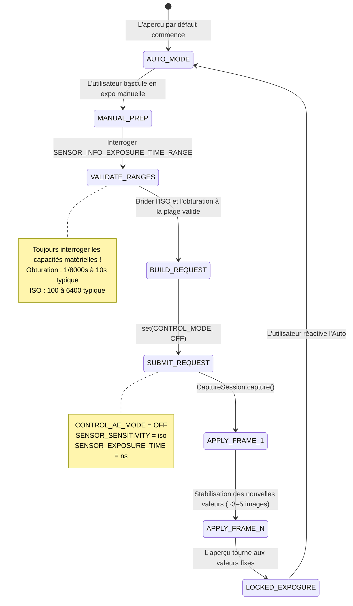

# Chapitre 14 : L'exposition manuelle dans Camera2

Avec la théorie photographique du chapitre 13 en tête, il est temps de traduire les concepts en code. Dans ce chapitre, vous apprendrez comment **prendre totalement le contrôle** du système d'exposition automatique (AE) de la caméra et régler manuellement l'ISO et la vitesse d'obturation avec l'API Camera2.

L'application [Android Camera Parameters](https://github.com/zoozooll/AndroidCameraParameters) illustre chaque technique de ce chapitre — vous pouvez suivre en direct en passant en mode manuel dans l'application et en ajustant les curseurs ISO et Obturation pour voir les résultats en temps réel.

---

## Le grand basculement : De AUTO → MANUEL

Par défaut, chaque `CaptureRequest` que vous soumettez s'exécute sous le pipeline automatique 3A intégré de la caméra (Auto Exposure, Auto Focus, Auto White Balance). Pour passer en manuel, vous devez **explicitement désactiver** ce pipeline.

Il existe deux niveaux de surcharge :

| Niveau | Réglage | Effet |
|--------|---------|-------|
| 1. Désactiver l'AE seulement | `CONTROL_AE_MODE = OFF` | L'ISO + l'obturation deviennent manuels ; l'AF et l'AWB tournent toujours en auto |
| 2. Désactiver tout le 3A | `CONTROL_MODE = OFF` | **Tous** les algorithmes 3A s'arrêtent ; chaque paramètre 3A doit être réglé manuellement |

Pour une exposition manuelle fiable, réglez **les deux**. Désactiver seulement `CONTROL_AE_MODE` sur certains appareils laisse encore le post-traitement de l'OEM "aider" en coulisses. Régler `CONTROL_MODE = OFF` est le chemin le plus propre et le plus prévisible.



**Latence de transition :** Lorsque vous soumettez une requête de capture manuelle, les nouvelles valeurs ISO/obturation n'apparaissent pas sur l'*image suivante*. Les capteurs CMOS ont une latence de pipeline — l'image *actuelle* est déjà en cours d'exposition avec les anciens réglages. Prévoyez **3 à 5 images de transition** avant que les valeurs ne se stabilisent. L'application [Android Camera Parameters](https://play.google.com/store/apps/details?id=com.minininja.cameraparams) attend explicitement que le `CaptureResult` confirme que les valeurs demandées correspondent aux valeurs appliquées avant d'indiquer "verrouillé".

---

## Commandes manuelles dans l'API Camera2

### SENSOR_SENSITIVITY (ISO)

Camera2 exprime l'ISO sous la forme `CaptureRequest.SENSOR_SENSITIVITY` — un entier qui correspond directement à l'échelle arithmétique de l'ISO. Sur la plupart des appareils, il s'agit d'une correspondance 1:1 :

| ISO du photographe | Valeur SENSOR_SENSITIVITY |
|--------------------|---------------------------|
| 100 | 100 |
| 400 | 400 |
| 3200 | 3200 |
| 6400 | 6400 |

**Interrogez toujours la plage valide.** Ne codez pas les valeurs en dur :

```kotlin
val sensorSensitivityRange = characteristics.get(
    CameraCharacteristics.SENSOR_INFO_SENSITIVITY_RANGE
)
val minIso = sensorSensitivityRange?.lower ?: 100
val maxIso = sensorSensitivityRange?.upper ?: 6400
```

Certains téléphones ultra-premium rapportent une plage comme 50–12800, tandis que les appareils budget peuvent vous limiter à 100–3200. Les valeurs hors plage sont bridées par le HAL — ce qui va à l'encontre de votre but de contrôle manuel.

### SENSOR_EXPOSURE_TIME (Obturation en nanosecondes)

Voici le premier piège qui surprend tout nouveau développeur Camera2 : **la vitesse d'obturation est stockée en nanosecondes (ns), pas en secondes.** Les humains pensent en 1/60s ; le HAL pense en 16 666 666 ns.

La conversion entre les deux est une simple opération arithmétique :

```kotlin
// Secondes → Nanosecondes (multiplier par 1 000 000 000)
fun secondsToNs(seconds: Double): Long = (seconds * 1_000_000_000.0).toLong()

// Nanosecondes → Secondes pour l'affichage utilisateur
fun nsToSeconds(ns: Long): Double = ns.toDouble() / 1_000_000_000.0

// Formateur de chaîne convivial (ex: "1/60s" ou "2.5s")
fun formatShutter(ns: Long): String {
    val seconds = nsToSeconds(ns)
    return when {
        seconds >= 1.0 -> String.format("%.1fs", seconds)
        else -> {
            val fraction = (1.0 / seconds).toInt()
            "1/${fraction}s"
        }
    }
}
```

**Conversions courantes pour référence :**

| Obturation humaine | Nanosecondes (ns) |
|---------------------|-------------------|
| 1/8000s | 125 000 |
| 1/1000s | 1 000 000 |
| 1/500s | 2 000 000 |
| 1/120s (règle 180° pour 24fps) | 8 333 333 |
| 1/60s | 16 666 666 |
| 1/30s | 33 333 333 |
| 1/15s | 66 666 666 |
| 1s | 1 000 000 000 |
| 2s | 2 000 000 000 |
| 10s | 10 000 000 000 |
| 30s | 30 000 000 000 |

**Encore une fois, interrogez la plage matérielle :**

```kotlin
val exposureTimeRange = characteristics.get(
    CameraCharacteristics.SENSOR_INFO_EXPOSURE_TIME_RANGE
)
val minShutterNs = exposureTimeRange?.lower ?: 1_000_000L   // plancher 1/1000s
val maxShutterNs = exposureTimeRange?.upper ?: 10_000_000_000L  // plafond 10s
```

Sur les appareils supportant des expositions ultra-longues (ex : certains modèles Sony Xperia et Google Pixel), `SENSOR_INFO_EXPOSURE_TIME_RANGE.upper` peut dépasser 30 000 000 000 ns (30 s). Respectez cette limite — les requêtes au-delà du maximum sont bridées silencieusement.

---

## ⚠️ Critique : Dégradation de la qualité en mode manuel

**C'est l'avertissement le plus important de ce chapitre.** Ne le négligez pas.

Lorsque vous réglez `CONTROL_MODE = OFF` (surcharge manuelle complète), vous ne vous contentez pas de désactiver les *algorithmes* AE/AF/AWB — sur presque tous les appareils Android, vous désactivez également le **post-traitement computationnel propriétaire de l'OEM** qui s'exécute normalement à l'intérieur du pipeline 3A.

Plus précisément, la recherche et l'analyse de HAL3 révèlent que la désactivation du 3A coupe généralement :

| Étape de traitement | Mode AUTO | Mode MANUEL (CONTROL_MODE = OFF) |
|---------------------|-----------|----------------------------------|
| Réduction du bruit multi-images | ✓ Actif — sortie avec bruit réduit | ✗ OFF — bruit du capteur brut visible |
| Mappage tonal adaptatif / fusion HDR | ✓ Actif — hautes lumières + ombres récupérées | ✗ OFF — courbe sur une seule image seulement |
| Amélioration locale du contraste | ✓ Varie selon la scène | ✗ Courbe générique plate |
| Mesure sur les visages / détection scène | ✓ Pondère l'expo sur les visages | ✗ Ignoré |
| Correction ombrage objectif / vignettage | ✓ Calibré par objectif | ✗ Souvent réduite ou coupée |

**Résultat :** Une photo en mode manuel à ISO 3200 et 1/15s sera *visiblement moins bonne* (plus bruitée, contraste plus plat) que la même scène capturée en mode AUTO avec l'ISO et l'obturation *identiques* choisis par le HAL.

**Que pouvez-vous faire ?** Deux options réalistes :

1. **Post-traitez vous-même.** Puisque vous avez désactivé le traitement OEM, vous pouvez appliquer votre propre débruitage (ex : filtre bilatéral OpenCV, débruiteur MediaPipe ou CNN entraîné sur mesure) dans votre pipeline de traitement. La capture RAW (voir chapitres ultérieurs) + le développement RAW personnalisé offrent un contrôle artistique maximal.

2. **Utilisez des surcharges AE manuelles au lieu de CONTROL_MODE = OFF.** Si vous avez seulement besoin de *verrouiller* des valeurs spécifiques tout en gardant le traitement OEM activé, essayez de régler `CONTROL_AE_MODE = ON` mais fixez `SENSOR_SENSITIVITY` et `SENSOR_EXPOSURE_TIME` requête par requête. Le support de ce mode mixte dépend de l'appareil — testez-le soigneusement.

L'application [Android Camera Parameters](https://github.com/zoozooll/AndroidCameraParameters) dispose d'un interrupteur dans le panneau Manuel qui bascule entre les deux approches et vous permet de comparer visuellement la différence de qualité.

---

## Exemple complet 1 : Exposition verrouillée pour timelapse

Un cas d'utilisation classique de l'exposition manuelle est la **photographie en timelapse**. En mode AUTO, la caméra ajuste subtilement l'exposition d'une image à l'autre au gré du mouvement des nuages ou des changements de lumière. La vidéo résultante scintille horriblement. Verrouiller l'ISO + l'obturation élimine cela.

**Objectif :** ISO 100, 1/60s (16 666 666 ns) — verrouillé pour chaque image.

```kotlin
class TimelapseManualExposure(
    private val characteristics: CameraCharacteristics,
    private val captureSession: CameraCaptureSession,
    private val imageReaderSurface: Surface,
    private val previewSurface: Surface
) {
    companion object {
        private const val TARGET_ISO = 100
        private const val TARGET_SHUTTER_NS = 16_666_666L // 1/60s
    }

    fun captureTimelapseFrame(frameCallback: ImageReader.OnImageAvailableListener) {
        try {
            // ---- ÉTAPE 1 : Valider que les valeurs demandées sont dans la plage matérielle ----
            val isoRange = characteristics.get(
                CameraCharacteristics.SENSOR_INFO_SENSITIVITY_RANGE
            )
            val shutterRange = characteristics.get(
                CameraCharacteristics.SENSOR_INFO_EXPOSURE_TIME_RANGE
            )

            val clampedIso = isoRange?.let {
                TARGET_ISO.coerceIn(it.lower, it.upper)
            } ?: TARGET_ISO

            val clampedShutter = shutterRange?.let {
                TARGET_SHUTTER_NS.coerceIn(it.lower, it.upper)
            } ?: TARGET_SHUTTER_NS

            // ---- ÉTAPE 2 : Construire la CaptureRequest avec exposition manuelle ----
            val requestBuilder = captureSession.device.createCaptureRequest(
                CameraDevice.TEMPLATE_STILL_CAPTURE
            ).apply {
                addTarget(previewSurface)
                addTarget(imageReaderSurface)

                // --- LES LIGNES CLÉS : Désactiver le 3A et fixer les valeurs ---
                set(CaptureRequest.CONTROL_MODE, CameraMetadata.CONTROL_MODE_OFF)
                set(CaptureRequest.CONTROL_AE_MODE, CameraMetadata.CONTROL_AE_MODE_OFF)
                set(CaptureRequest.SENSOR_SENSITIVITY, clampedIso)
                set(CaptureRequest.SENSOR_EXPOSURE_TIME, clampedShutter)

                // Facultatif : Fixer aussi l'AWB sur Lumière du jour pour une couleur cohérente
                set(CaptureRequest.CONTROL_AWB_MODE, CameraMetadata.CONTROL_AWB_MODE_DAYLIGHT)

                // Qualité JPEG de la capture fixe
                set(CaptureRequest.JPEG_QUALITY, 95)
            }

            // ---- ÉTAPE 3 : Soumettre la capture fixe ----
            captureSession.capture(
                requestBuilder.build(),
                object : CameraCaptureSession.CaptureCallback() {
                    override fun onCaptureCompleted(
                        session: CameraCaptureSession,
                        request: CaptureRequest,
                        result: TotalCaptureResult
                    ) {
                        // Vérifier que le HAL a bien appliqué nos valeurs (il peut brider !)
                        val appliedIso = result.get(CaptureResult.SENSOR_SENSITIVITY)
                        val appliedShutter = result.get(CaptureResult.SENSOR_EXPOSURE_TIME)
                        Log.d("Timelapse", "Appliqué : ISO=$appliedIso, Obturation=${formatShutter(appliedShutter!!)}")
                    }
                },
                null // Exécuter sur le Handler du thread actuel
            )

        } catch (e: CameraAccessException) {
            Log.e("Timelapse", "Échec de la capture manuelle", e)
        }
    }
}
```

**Points clés :**

- Utilisez toujours `coerceIn()` contre les plages matérielles. Si le min ISO d'un téléphone budget est 120, votre requête pour 100 devient silencieusement 120. `onCaptureCompleted()` confirme ce qui a été *réellement* appliqué.
- Pour un timelapse, soumettez cette requête toutes les N secondes (ex : toutes les 5s pour une accélération 300× avec une sortie à 30fps).
- Fixer `CONTROL_AWB_MODE_DAYLIGHT` est facultatif mais recommandé pour les timelapses — sinon l'AWB peut encore faire varier subtilement la balance des blancs entre les images même si l'exposition est verrouillée.

---

## Exemple complet 2 : Exposition longue pour la photographie de nuit

**Objectif :** ISO 3200, 2 secondes (2 000 000 000 ns) — traînées d'eau lisses, ciel nocturne lumineux.

**Exigence matérielle critique :** L'appareil doit supporter `SENSOR_INFO_EXPOSURE_TIME_RANGE.upper >= 2 000 000 000 ns`. Beaucoup de téléphones de milieu de gamme plafonnent à ~1/8s ou 1s.

```kotlin
class NightLongExposure(
    private val characteristics: CameraCharacteristics,
    private val captureSession: CameraCaptureSession,
    private val previewSurface: Surface,
    private val jpegReaderSurface: Surface,
    private val rawReaderSurface: Surface? // Capture RAW facultative
) {
    fun shootLongExposure(onPhotoSaved: (path: String) -> Unit) {
        val shutterNs = 2_000_000_000L  // 2 secondes
        val targetIso = 3200

        // --- Valider que le matériel peut réellement faire cela ---
        val shutterRange = characteristics.get(
            CameraCharacteristics.SENSOR_INFO_EXPOSURE_TIME_RANGE
        )
        if (shutterRange == null || shutterRange.upper < shutterNs) {
            throw UnsupportedOperationException(
                "L'appareil ne supporte pas une exposition de 2s. Max = " +
                "${shutterRange?.upper?.let { nsToSeconds(it) } ?: "inconnu"}s"
            )
        }

        val requestBuilder = captureSession.device.createCaptureRequest(
            CameraDevice.TEMPLATE_STILL_CAPTURE
        ).apply {
            addTarget(previewSurface)
            addTarget(jpegReaderSurface)
            // Si vous avez configuré une OutputConfiguration compatible RAW plus tôt :
            rawReaderSurface?.let { addTarget(it) }

            // Surcharge de l'exposition manuelle
            set(CaptureRequest.CONTROL_MODE, CameraMetadata.CONTROL_MODE_OFF)
            set(CaptureRequest.CONTROL_AE_MODE, CameraMetadata.CONTROL_AE_MODE_OFF)
            set(CaptureRequest.SENSOR_SENSITIVITY, targetIso)
            set(CaptureRequest.SENSOR_EXPOSURE_TIME, shutterNs)

            // --- Critique pour les expositions longues ---
            // Désactiver la stabilisation vidéo optique/numérique (elles entrent en conflit au-delà de 1s)
            set(CaptureRequest.LENS_OPTICAL_STABILIZATION_MODE,
                CameraMetadata.LENS_OPTICAL_STABILIZATION_MODE_OFF)
            // Pas de flash pour les prises de vue en exposition longue
            set(CaptureRequest.CONTROL_AE_MODE, CameraMetadata.CONTROL_AE_MODE_OFF)
        }

        captureSession.capture(
            requestBuilder.build(),
            object : CameraCaptureSession.CaptureCallback() {
                override fun onCaptureStarted(
                    session: CameraCaptureSession,
                    request: CaptureRequest,
                    timestamp: Long
                ) {
                    super.onCaptureStarted(session, request, timestamp)
                    // Notifier l'UI : "Exposition commencée — ne bougez plus pendant 2 secondes"
                    Log.d("LongExposure", "Exposition commencée @ $timestamp")
                }

                override fun onCaptureCompleted(
                    session: CameraCaptureSession,
                    request: CaptureRequest,
                    result: TotalCaptureResult
                ) {
                    // ImageReader.OnImageAvailableListener se déclenche séparément pour enregistrer le JPEG
                    Log.d("LongExposure", "Capture en exposition longue terminée")
                }
            },
            null
        )
    }
}
```

**Conseils pour l'exposition longue :**

1. **Coupez l'OIS.** La stabilisation optique de l'image dans la plupart des objectifs essaie de compenser le tremblement de la caméra *pendant* l'exposition. Pour les expositions > 0,5s, les actionneurs OIS peuvent saturer et provoquer une dérive visible. Désactivez-la et utilisez un trépied.

2. **Attendez-vous à un gel.** La caméra ne sortira pas d'images d'aperçu pendant qu'une exposition de 2 secondes est en cours. Votre interface utilisateur doit afficher un indicateur explicite "EXPOSITION EN COURS…".

3. **Le RAW est meilleur.** ISO élevé (3200) + exposition longue produit du bruit thermique (le capteur chauffe). Enregistrez une image RAW et utilisez un développeur RAW sur ordinateur avec moyennage d'images — ou implémentez votre propre exposition longue multi-images en moyennant 8 images de 0,25s au lieu d'une image de 2s (réduit considérablement le bruit thermique).

---

## Exemple complet 3 : Bracketing d'exposition sur 3 clichés

**Objectif :** Même ISO, 3 expositions différentes à −1 EV, 0 EV, +1 EV. L'utilisateur les fusionnera plus tard en une photo HDR.

D'après le chapitre 13, nous savons que chaque palier EV double ou divise par deux la lumière. À ISO fixe, chaque palier EV = multiplier/diviser la vitesse d'obturation par 2.

```kotlin
class ExposureBracketing(
    private val characteristics: CameraCharacteristics,
    private val captureSession: CameraCaptureSession,
    private val previewSurface: Surface,
    private val jpegReaderSurface: Surface
) {
    data class BracketFrame(
        val label: String,
        val evShift: Double,  // -1.0, 0.0, +1.0
        val shutterNs: Long,
        val iso: Int
    )

    fun captureBracketSeries(baseIso: Int, baseShutterNs: Long) {
        val isoRange = characteristics.get(
            CameraCharacteristics.SENSOR_INFO_SENSITIVITY_RANGE
        )
        val shutterRange = characteristics.get(
            CameraCharacteristics.SENSOR_INFO_EXPOSURE_TIME_RANGE
        )

        // Construire le plan du bracketing : multiplier l'obturation par 2^(evStep)
        val frames = listOf(-1.0, 0.0, +1.0).map { ev ->
            val multiplier = Math.pow(2.0, ev)
            val rawShutter = (baseShutterNs.toDouble() * multiplier).toLong()
            val clampedShutter = shutterRange?.let {
                rawShutter.coerceIn(it.lower, it.upper)
            } ?: rawShutter
            val clampedIso = isoRange?.let {
                baseIso.coerceIn(it.lower, it.upper)
            } ?: baseIso
            BracketFrame("EV${if (ev > 0) "+" else ""}${ev.toInt()}", ev, clampedShutter, clampedIso)
        }

        Log.d("Bracket", "Plan : ${frames.map { "${it.label} ISO${it.iso} ${formatShutter(it.shutterNs)}" }}")

        // Soumettre chaque image sous forme de rafale en utilisant captureBurst() pour l'atomicité
        val requestList = frames.map { frame ->
            captureSession.device.createCaptureRequest(
                CameraDevice.TEMPLATE_STILL_CAPTURE
            ).apply {
                addTarget(previewSurface)
                addTarget(jpegReaderSurface)

                set(CaptureRequest.CONTROL_MODE, CameraMetadata.CONTROL_MODE_OFF)
                set(CaptureRequest.CONTROL_AE_MODE, CameraMetadata.CONTROL_AE_MODE_OFF)
                set(CaptureRequest.SENSOR_SENSITIVITY, frame.iso)
                set(CaptureRequest.SENSOR_EXPOSURE_TIME, frame.shutterNs)

                // Marquer chaque requête pour pouvoir trier les images dans le rappel
                setTag(frame.label)
            }.build()
        }

        captureSession.captureBurst(
            requestList,
            object : CameraCaptureSession.CaptureCallback() {
                override fun onCaptureCompleted(
                    session: CameraCaptureSession,
                    request: CaptureRequest,
                    result: TotalCaptureResult
                ) {
                    val tag = request.tag as? String ?: "?"
                    Log.d("Bracket", "$tag terminé — prêt pour fusion HDR")
                }
            },
            null
        )
    }
}
```

**Pourquoi `captureBurst()` au lieu de trois appels `capture()` séparés ?** `captureBurst()` soumet toute la liste de manière atomique. Le HAL garantit qu'aucune autre image d'aperçu ne s'intercale, et l'état de la mise au point et de la balance des blancs ne dérivera pas entre les images.

**Vous voulez un bracketing de 5 ou 7 clichés ?** Changez simplement `listOf(-2.0, -1.0, 0.0, +1.0, +2.0)` — le calcul s'adapte. De nombreuses applications HDR professionnelles prennent 9 clichés pour les scènes à plage dynamique extrême.

**Étape de fusion :** Une fois que vous avez les trois images JPEG (ou RAW), vous pouvez les fusionner en utilisant :
- Le pipeline HDR intégré d'Android via `CameraExtensionSession` (voir chapitre HDR)
- Une bibliothèque tierce comme `createMergeDebevec()` / `createMergeRobertson()` d'OpenCV pour une véritable fusion d'exposition
- La bibliothèque Photo Sphere HDR de Google

---

## Dépannage des échecs courants

| Problème | Cause probable | Solution |
|----------|----------------|----------|
| Valeurs manuelles ignorées, semble toujours en auto | `CONTROL_MODE` non réglé sur OFF, ou valeurs bridées | Réglez à la fois CONTROL_MODE et CONTROL_AE_MODE sur OFF ; vérifiez les valeurs appliquées dans `onCaptureCompleted()` |
| Erreur immédiate sur requête d'expo longue de 2s | L'appareil ne peut pas faire 2s d'expo | Vérifiez `SENSOR_INFO_EXPOSURE_TIME_RANGE.upper` ; réduisez le temps ou augmentez l'ISO à la place |
| L'aperçu saccade ou ralentit lors du passage en manuel | Trop d'appels `setRepeatingRequest()` | Utilisez un écouteur de curseur limité (tous les 30–50 ms) ; ne mettez à jour que la requête répétée, pas les captures fixes |
| Photo en expo longue toute noire à ISO 100 2s | La scène nécessite réellement plus de lumière à ISO 100 | Augmentez l'ISO ou allongez l'obturation ; 2s ISO 100 = base EV 0, pas "nuit lumineuse" |
| Clichés manuels plus bruités qu'en Auto à ISO identique | NR OEM désactivé par CONTROL_MODE = OFF | Comportement attendu ! Voir la section "Dégradation de la qualité en mode manuel". Post-traitez, ou utilisez le manuel partiel via AE_LOCK |

---

## Résumé

Vous avez maintenant les outils pour arracher le contrôle total de l'exposition au HAL de Camera2 :

- **Désactivez le pipeline 3A** avec `CONTROL_MODE = OFF` + `CONTROL_AE_MODE = OFF` pour un contrôle entièrement manuel
- **Mappez ISO → `SENSOR_SENSITIVITY`** (correspondance 1:1 sur la plupart des matériels ; interrogez toujours la plage)
- **Mappez secondes ↔ nanosecondes** pour `SENSOR_EXPOSURE_TIME` avec une simple conversion 10⁹
- **Verrouillage timelapse :** ISO 100 fixe + 1/60s répété pour chaque image = zéro scintillement
- **Exposition longue de nuit :** ISO 3200 + 2s avec OIS désactivé = scène nocturne lumineuse et lisse (sur matériel compatible)
- **Bracketing d'exposition :** Même ISO, obturation ×0,5 / ×1 / ×2 via `captureBurst()` = entrée HDR prête à être fusionnée
- **⚠️ Compromis qualité manuel :** Désactiver le 3A coupe la réduction du bruit et le mappage tonal de l'OEM — les photos manuelles paraissent souvent *moins bonnes* à ISO identique qu'en Auto. Prévoyez du post-traitement.

## Et ensuite ?

L'exposition contrôle la *luminosité*. **La mise au point contrôle la netteté.** Dans le **Chapitre 15 : La mise au point**, nous aborderons :

- Les états et modes de mise au point automatique (AF) — comment fonctionne le balayage passif, la différence entre photo et vidéo en continu
- La mise au point manuelle avec `LENS_FOCUS_DISTANCE` en dioptries (0.0 = infini, 10D = 0.1m)
- Code Kotlin pour une séquence de déclenchement-et-capture AF ponctuelle, et un curseur SeekBar de mise au point manuelle
- La machine à états AF — quand `CONTROL_AF_STATE_FOCUSED_LOCKED` se déclenche réellement, et comment l'attendre

Le flou s'arrête ici.
