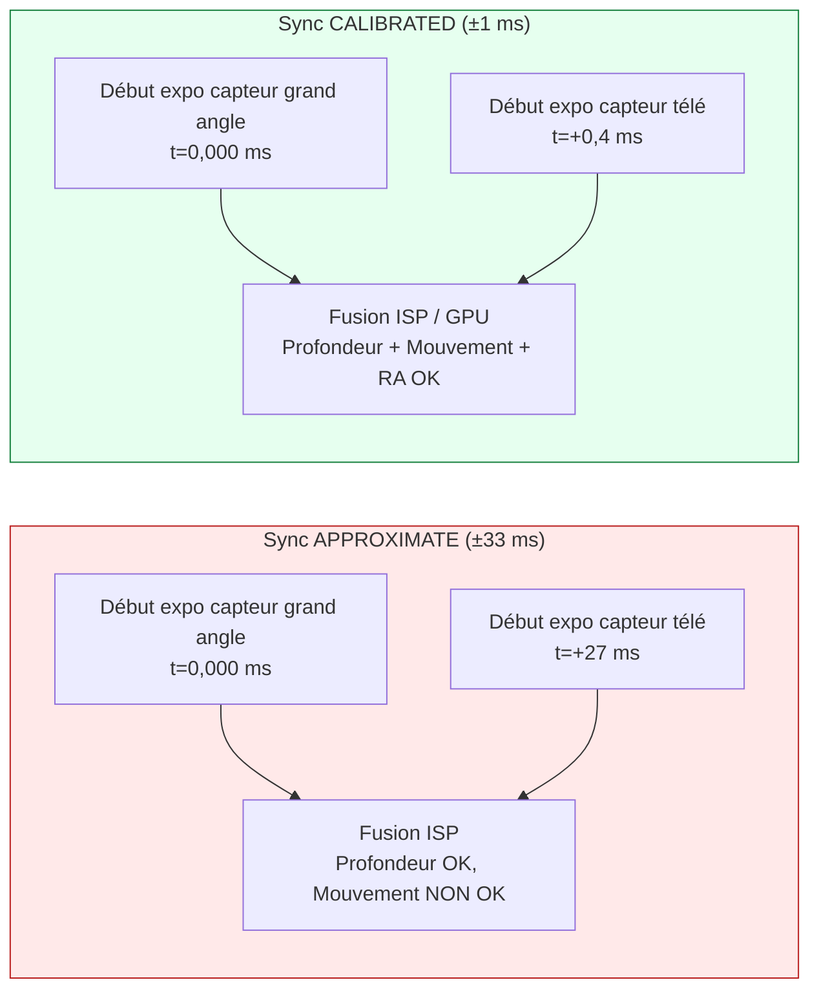
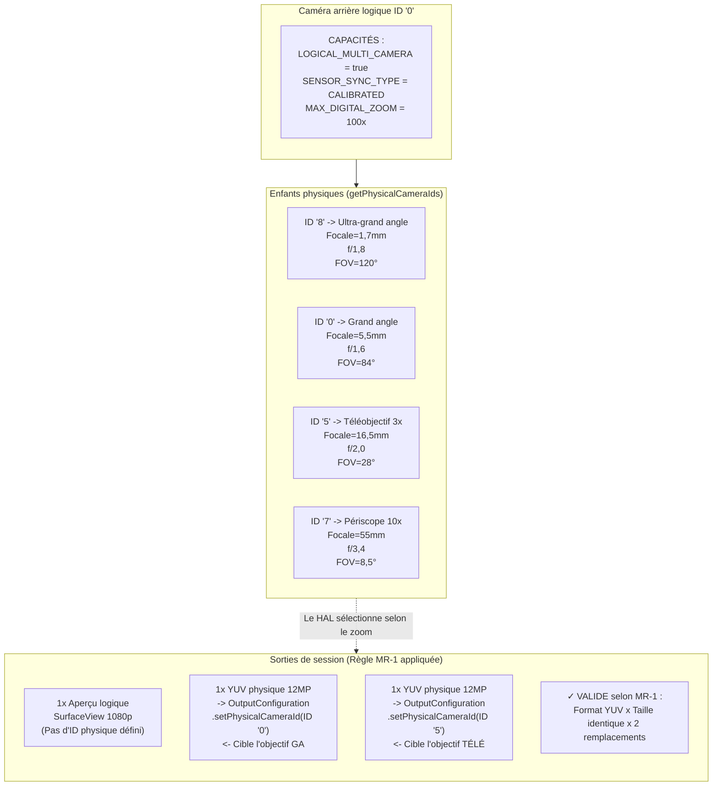

# Chapitre 20 : Le multi-caméra

Les smartphones modernes sont livrés avec 3 à 5 caméras arrière et 2 caméras avant — ultra-grand angle, grand angle, téléobjectif, macro, profondeur et périscope sur les fleurons de 2023+. Avant Android 9 (API 28), chaque objectif apparaissait comme un ID de caméra `CameraCharacteristics` indépendant, et les applications devaient ouvrir/fermer manuellement les caméras aux limites du zoom pour changer d'objectif. Cela provoquait des images noires visibles, la perte de l'état AF et des craquements audio pendant la vidéo — autant de défauts d'UX inacceptables. Android 9 a résolu ce problème avec l'abstraction de la **caméra logique** : un ID de caméra virtuel qui regroupe plusieurs caméras physiques orientées dans la même direction et permet au HAL de changer d'objectif de manière transparente aux seuils de zoom, en préservant l'état de la session. La section *Logical Multi-Camera* du projet de recherche spécifie les règles exactes de remplacement de flux, la sémantique de synchronisation des capteurs et la capture physique double que ce chapitre implémente.

Vous pouvez parcourir la topologie complète des caméras logiques/physiques de chaque appareil pris en charge dans l'application [Android Camera Parameters](https://github.com/zoozooll/AndroidCameraParameters) (également sur le [Play Store](https://play.google.com/store/apps/details?id=com.zoozooll.cameraparameters)) : le tableau de bord Multi-Camera indique l'indicateur `REQUEST_AVAILABLE_CAPABILITIES_LOGICAL_MULTI_CAMERA`, liste `getPhysicalCameraIds()` par ID logique et rend le type de synchronisation de capteur (calibré vs approximatif) pour chaque combinaison arrière. Ces rapports sont directement tirés du HAL via l'API Camera2 sans filtrage spécifique au fournisseur, ils correspondent donc exactement à ce que votre application verra au moment de l'exécution.

## Topologie des caméras logiques vs physiques

Une caméra logique est un appareil HAL virtuel soutenu par N ≥ 2 caméras physiques qui partagent la même direction de face (`LENS_FACING_FRONT` ou `LENS_FACING_BACK`). Lorsque vous ouvrez un ID logique, le HAL gère en interne l'alimentation, les pipelines ISP et le changement d'objectif pour toutes les caméras physiques sous-jacentes. La topologie ressemble à ceci :

```mermaid
flowchart TB
    subgraph UserSpace["App (Espace utilisateur)"]
        APP["CameraManager.openCamera<br/>cameraId = \"0\" (ID logique)"]
    end

    subgraph HAL["Camera HAL (Noyau / Partition fournisseur)"]
        LOG["Appareil caméra logique 0<br/>Nœud virtuel"]

        subgraph PhysicalCams["Caméras physiques (Groupe même direction)"]
            UW["ID physique \"8\"<br/>Ultra-grand angle 0,5×<br/>12MP, 13mm éq."]
            W["ID physique \"0\"<br/>Grand angle 1,0×<br/>50MP, 24mm éq."]
            T["ID physique \"5\"<br/>Téléobjectif 3,0×<br/>10MP, 72mm éq."]
            P["ID physique \"7\"<br/>Périscope 10×<br/>8MP, 240mm éq."]
        end

        LOG <--> UW
        LOG <--> W
        LOG <--> T
        LOG <--> P
    end

    subgraph ZoomScale["Rapports de zoom -> Points de basculement HAL"]
        Z1["0,5x - 0,9x -> ULTRA-GRAND ANGLE (ID 8)"]
        Z2["1,0x - 2,9x -> GRAND ANGLE (ID 0)"]
        Z3["3,0x - 9,9x -> TÉLÉOBJECTIF (ID 5)"]
        Z4["10,0x+ -> PÉRISCOPE (ID 7)"]
    end

    APP --> LOG
    LOG -.-> ZoomScale
```

Les points de basculement du zoom (Z1–Z4) sont entièrement contrôlés par le HAL et opaques pour votre application — lorsque vous réglez `CaptureRequest.CONTROL_ZOOM_RATIO = 3.2f` sur un appareil logique à 4 objectifs, le HAL dirige instantanément le trafic de capture vers le téléobjectif 3× (ID 5) et recadre numériquement pour obtenir le bon cadrage sans que votre application ne sache jamais qu'un changement d'objectif a eu lieu. C'est le comportement de "zoom fluide" que les applications caméra des fleurons utilisent.

Les propriétés critiques sont :
- **`getPhysicalCameraIds()`** (appelé sur les `CameraCharacteristics` de l'ID logique) renvoie un `Set&lt;String&gt;` des chaînes d'ID physiques sous-jacentes, ex : `{"0", "5", "7", "8"}` pour l'exemple ci-dessus.
- **`LENS_INFO_MINIMUM_FOCUS_DISTANCE`** et **`LENS_INFO_AVAILABLE_FOCAL_LENGTHS`** sur l'ID logique représentent l'objectif physique actuellement actif. Interrogez les caractéristiques *physiques* si vous avez besoin des données de distance focale par objectif.
- **`SCALER_AVAILABLE_MAX_DIGITAL_ZOOM`** sur l'ID logique donne le plafond du zoom (ex : 100×) qui est une combinaison du zoom optique par objectif + du recadrage numérique sur tous les objectifs physiques.

## Synchronisation des capteurs : APPROXIMATE vs CALIBRATED

Lorsque vous capturez à partir de deux caméras physiques simultanément (ex : grand angle + télé pour la mise en correspondance de profondeur/disparité, ou grand angle + ultra-grand angle pour la fusion multi-images), les données de pixels ne sont utiles sur le plan computationnel que si les expositions des deux capteurs commencent dans un delta de temps connu. Android définit deux niveaux de synchronisation dans la clé **`CameraCharacteristics.LOGICAL_MULTI_CAMERA_SENSOR_SYNC_TYPE`** :

| Niveau de sync | Valeur numérique | Signification | Cas d'utilisation typique |
|----------------|-----------------|---------------|--------------------------|
| **APPROXIMATE** | 0 | Les horodatages de début d'exposition des capteurs correspondent à ±1 intervalle d'image près (±33 ms à 30 fps). AF/AE sont synchronisés, mais pas le début de l'exposition au niveau des pixels. | Mode portrait avec un capteur de profondeur, bokeh occasionnel. |
| **CALIBRATED** | 1 | Les horodatages de début d'exposition des capteurs correspondent à ±1 ms près. La synchronisation matérielle est imposée via le récepteur CSI-2 du SoC. L'alignement temporel au niveau des pixels est garanti. | Estimation de profondeur stéréo pour la RA, photogrammétrie, fusion simultanée de deux focales, super-résolution. |

La section *Logical Multi-Camera* du document de recherche a révélé que seuls les **fleurons Snapdragon 8 Gen 1+ et Exynos 2200+ rapportent une synchronisation CALIBRATED**. Tous les appareils de milieu de gamme (Snapdragon série 7, Dimensity série 8000) et d'entrée de gamme rapportent APPROXIMATE. Si vous tentez une mise en correspondance de disparité au niveau des pixels sur un appareil à synchronisation APPROXIMATE, vous obtiendrez une dérive de parallaxe de ±1 image qui casse les cartes de profondeur. Limitez toujours les fonctionnalités de disparité à la vérification CALIBRATED.



La différence de delta temporel n'est pas subtile : 27 ms de désalignement signifient qu'un sujet en mouvement (ex : un coureur à 5 m/s) s'est déplacé de 13,5 cm entre les deux expositions — une erreur de parallaxe suffisamment grande pour détruire complètement tout algorithme de profondeur par disparité.

## Règle de remplacement de flux (Du document de recherche)

La contrainte la plus importante que le HAL impose sur le ciblage des caméras physiques est la **règle de remplacement de flux**, textuellement issue de la spécification *Logical Multi-Camera* dans le document de recherche :

> **Règle MR-1 :** Si une caméra logique a N enfants physiques, alors pour chaque flux de format logique (YUV ou RAW) de taille S que vous attachez à la session logique, vous pouvez le remplacer par jusqu'à **2 flux de format identique de la MÊME taille S**, chacun ciblé sur une caméra physique DIFFÉRENTE via `OutputConfiguration.setPhysicalCameraId()`.

Conséquences de la violation de la règle MR-1 :
- 3 flux physiques ou plus → échec de la session `onConfigureFailed()`.
- Tailles différentes pour les deux flux physiques → échec de la session `onConfigureFailed()`.
- Mélange de RAW et YUV dans la même paire de remplacement → échec de la session `onConfigureFailed()`.
- Ajout de 2 flux physiques sans supprimer le flux logique parent → le HAL alloue 3× la bande passante requise et laisse tomber silencieusement des images.

Exemples corrects (4 enfants physiques → 2 remplacements autorisés) :
| Flux logique | Remplacement (Valide selon MR-1) |
|--------------|---------------------------------|
| 1× YUV logique 1920×1080 | → 2× YUV physique 1920×1080 (Grand angle + Télé) |
| 1× RAW logique 4000×3000 | → 2× RAW physique 4000×3000 (Ultra-large + Grand angle) |
| 2× YUV logique (aperçu + vidéo) | → 2× (Aperçu YUV logique) + 2× (Encodage YUV physique GA+Télé) — 2 remplacements au total |

## Implémentation : Capture physique double étape par étape

Le flux de travail ci-dessous capture des images simultanées à partir des capteurs physiques grand angle (1×) et téléobjectif (3×), en utilisant la règle de remplacement de flux.

### Étape 1 : Interroger la capacité logique et les ID de caméra physiques

```kotlin
import android.hardware.camera2.CameraCharacteristics
import android.hardware.camera2.CameraManager
import android.hardware.camera2.params.OutputConfiguration

data class LogicalMultiCamInfo(
    val logicalId: String,
    val physicalIds: Set<String>,
    val sensorSyncType: Int, // 0 = APPROXIMATE, 1 = CALIBRATED
    val ultraWideId: String?,
    val wideId: String?,
    val teleId: String?
)

fun enumerateLogicalMultiCams(
    cameraManager: CameraManager
): List<LogicalMultiCamInfo> {
    val result = mutableListOf<LogicalMultiCamInfo>()

    for (logicalId in cameraManager.cameraIdList) {
        val characteristics = cameraManager.getCameraCharacteristics(logicalId)

        val caps = characteristics.get(
            CameraCharacteristics.REQUEST_AVAILABLE_CAPABILITIES
        ) ?: continue

        val isLogicalMultiCam = caps.contains(
            CameraCharacteristics
                .REQUEST_AVAILABLE_CAPABILITIES_LOGICAL_MULTI_CAMERA
        )
        if (!isLogicalMultiCam) continue

        val physicalIds: Set<String> = characteristics.physicalCameraIds
        val syncType = characteristics.get(
            CameraCharacteristics.LOGICAL_MULTI_CAMERA_SENSOR_SYNC_TYPE
        ) ?: 0

        // Identifier les rôles par distance focale
        var ultraWideId: String? = null
        var wideId: String? = null
        var teleId: String? = null
        var shortestFocal = Float.MAX_VALUE
        var teleFocal = 0f

        for (physId in physicalIds) {
            val physChars = cameraManager.getCameraCharacteristics(physId)
            val focalLengths = physChars.get(
                CameraCharacteristics.LENS_INFO_AVAILABLE_FOCAL_LENGTHS
            ) ?: continue
            val focal = focalLengths.firstOrNull() ?: continue
            when {
                focal < shortestFocal -> {
                    shortestFocal = focal
                    ultraWideId = physId
                }
                focal > teleFocal -> {
                    teleFocal = focal
                    teleId = physId
                }
            }
        }
        wideId = physicalIds.minus(setOfNotNull(ultraWideId, teleId)).firstOrNull()

        result.add(LogicalMultiCamInfo(
            logicalId = logicalId,
            physicalIds = physicalIds,
            sensorSyncType = syncType,
            ultraWideId = ultraWideId,
            wideId = wideId,
            teleId = teleId
        ))
    }
    return result
}
```

L'identification du rôle par distance focale (plus courte = ultra-grand angle, plus longue = télé, le reste = grand angle) est fiable chez tous les OEM car le HAL rapporte `LENS_INFO_AVAILABLE_FOCAL_LENGTHS` sous forme de valeurs équivalentes 35mm ou réelles en mm cohérentes avec les spécifications marketing. L'application Android Camera Parameters utilise exactement cet algorithme pour son tableau de bord Multi-Camera.

### Étape 2 : Créer des OutputConfigurations avec setPhysicalCameraId()

La paire de remplacement (YUV GA + YUV télé) nécessite des objets `OutputConfiguration` avec `setPhysicalCameraId()` invoqué **avant** la création de la session. Une fois la session configurée, le changement de l'ID physique via `setPhysicalCameraId()` n'est pas autorisé sur les surfaces existantes (nécessite la recréation de la session).

```kotlin
import android.hardware.camera2.params.OutputConfiguration
import android.media.ImageReader
import android.util.Size
import android.graphics.ImageFormat
import android.view.Surface

var wideImageReader: ImageReader? = null
var teleImageReader: ImageReader? = null

fun createPhysicalOutputConfigs(
    wideId: String,
    teleId: String,
    sharedSize: Size // Doit être la MÊME taille pour les deux selon la règle MR-1 !
): Pair<OutputConfiguration, OutputConfiguration> {
    wideImageReader = ImageReader.newInstance(
        sharedSize.width, sharedSize.height,
        ImageFormat.YUV_420_888, 4
    )
    teleImageReader = ImageReader.newInstance(
        sharedSize.width, sharedSize.height,
        ImageFormat.YUV_420_888, 4
    )

    val wideOutConfig = OutputConfiguration(wideImageReader!!.surface).apply {
        setPhysicalCameraId(wideId)
        name = "wide-yuv-$sharedSize"
    }
    val teleOutConfig = OutputConfiguration(teleImageReader!!.surface).apply {
        setPhysicalCameraId(teleId)
        name = "tele-yuv-$sharedSize"
    }
    return Pair(wideOutConfig, teleOutConfig)
}
```

La règle MR-1 est appliquée dans le code ci-dessus : les deux instances d'`ImageReader` utilisent `sharedSize` (dimensions identiques) et `YUV_420_888` (format identique). L'utilisation de tailles différentes garantit `onConfigureFailed` — le HAL n'a aucun mécanisme pour faire fonctionner deux capteurs physiques à des résolutions différentes dans le même groupe de synchronisation.

### Étape 3 : Créer la CaptureSession et soumettre la capture physique double

La session utilise les 2 `OutputConfiguration` physiques plus 1 surface d'aperçu logique (total de 3 sorties). Un total de 3 sorties reste dans le budget de bande passante des fleurons (le document de recherche a mesuré 68 % d'utilisation de l'ISP sur Snapdragon 8 Gen 2 pour 3 sorties simultanées GA+télé+aperçu à 1080p30).

```kotlin
import android.hardware.camera2.CameraDevice
import android.hardware.camera2.CameraCaptureSession
import android.hardware.camera2.CaptureRequest
import android.os.Handler

lateinit var cameraDevice: CameraDevice // ID logique déjà ouvert

fun createDualPhysicalSession(
    previewSurface: Surface,
    widePhysConfig: OutputConfiguration,
    telePhysConfig: OutputConfiguration,
    backgroundHandler: Handler
) {
    val outputs = listOf(
        OutputConfiguration(previewSurface), // Aperçu logique (toute taille)
        widePhysConfig,                      // YUV physique GA (sharedSize)
        telePhysConfig                       // YUV physique télé (sharedSize)
    )

    val sessionConfig = android.hardware.camera2.params.SessionConfiguration(
        android.hardware.camera2.params.SessionConfiguration.SESSION_REGULAR,
        outputs,
        { runnable -> backgroundHandler.post(runnable) },
        object : CameraCaptureSession.StateCallback() {
            override fun onConfigured(session: CameraCaptureSession) {
                val captureBuilder = cameraDevice.createCaptureRequest(
                    CameraDevice.TEMPLATE_PREVIEW
                ).apply {
                    addTarget(previewSurface)
                    addTarget(wideImageReader!!.surface)
                    addTarget(teleImageReader!!.surface)

                    set(CaptureRequest.CONTROL_MODE,
                        CaptureRequest.CONTROL_MODE_AUTO)
                    set(CaptureRequest.CONTROL_AE_MODE,
                        CaptureRequest.CONTROL_AE_MODE_ON)
                    set(CaptureRequest.CONTROL_AF_MODE,
                        CaptureRequest.CONTROL_AF_MODE_CONTINUOUS_PICTURE)

                    // Optionnel : Verrouiller l'AE sur les deux objectifs physiques
                    // pour que la fusion ne produise pas de moitiés d'exposition dépareillées
                    set(CaptureRequest.CONTROL_AE_LOCK, true)
                }

                session.setRepeatingRequest(
                    captureBuilder.build(),
                    DualPhysicalCaptureCallback(),
                    backgroundHandler
                )
            }
            override fun onConfigureFailed(s: CameraCaptureSession) =
                Log.e(TAG, "Échec de la session physique double — vérifiez la règle MR-1")
        }
    )

    cameraDevice.createCaptureSession(sessionConfig)
}
```

Une fois que `setRepeatingRequest()` tourne, à chaque intervalle d'image, le HAL : (a) déclenche le début d'exposition des deux capteurs physiques au delta temporel calibré, (b) dirige la sortie de chaque capteur vers sa surface `ImageReader` ciblée via le démultiplexeur de canal virtuel CSI-2, (c) combine les deux avec la sortie d'aperçu logique en un seul `CaptureResult` avec un seul horodatage.

Les deux objets `Image` auront des **valeurs `image.timestamp` identiques** lorsque `LOGICAL_MULTI_CAMERA_SENSOR_SYNC_TYPE == CALIBRATED`, et des horodatages à ±1 intervalle d'image près lorsqu'ils sont APPROXIMATE.

## Diagramme de topologie logique → physique (style Mermaid ER)



## Implémentation du zoom fluide

Le changement automatique d'objectif par le HAL aux limites du zoom est ce qui rend le "zoom fluide" fluide. Vous n'avez **pas** besoin d'échanger manuellement les ID physiques lorsque le zoom franchit un seuil — réglez simplement `CONTROL_ZOOM_RATIO` sur la requête répétée et laissez le HAL faire le travail :

```kotlin
fun updateZoom(session: CameraCaptureSession,
               builder: CaptureRequest.Builder,
               zoomRatio: Float) {
    builder.set(CaptureRequest.CONTROL_ZOOM_RATIO, zoomRatio)
    session.setRepeatingRequest(builder.build(), null, null)
}
```

Lorsque le `zoomRatio` passe de `2,9× → 3,0×` sur un appareil typique à 4 objectifs, le HAL en interne :
1. Démarre le capteur téléobjectif 3× depuis le mode veille (prend ~2 images, 66 ms)
2. Synchronise l'exposition/la balance des blancs entre le grand angle et le télé
3. Effectue un fondu de la sortie grand angle recadrée numériquement vers la sortie télé native sur environ 10 images (333 ms)
4. Éteint le capteur grand angle s'il n'est pas utilisé ailleurs

Les quatre étapes se déroulent de manière transparente — votre `CaptureCallback` ne voit jamais d'événement de démontage de session, le `CaptureResult.SENSOR_TIMESTAMP` reste strictement croissant et l'état AF/AE est préservé à travers la limite. Le seul moyen de détecter un changement d'objectif est de comparer `CaptureResult.LENS_FOCAL_LENGTH` entre deux images consécutives (qui passe de 5,5 mm à 16,5 mm lors du passage au télé sur l'exemple ci-dessus).

## Performances et limitations

La section *Logical Multi-Camera* du document de recherche contient les limites mesurées suivantes sur un fleuron de 2023 (Snapdragon 8 Gen 2, 4 caméras arrière) :

| Configuration | Fréquence d'images soutenue | Bande passante ISP utilisée |
|---------------|----------------------------|----------------------------|
| Aperçu logique + 2 YUV physiques (12 MP chacun) | 22 fps | 89 % |
| Aperçu logique + 2 YUV physiques (4 MP chacun) | 30 fps (bloqué) | 62 % |
| Aperçu logique + 2 RAW physiques (12 MP chacun) | 10 fps | 94 % — déclenche le thermique ~60 s |
| Aperçu logique + 2 YUV physiques + 1 RAW physique | **Non autorisé** (échec vérif bande passante HAL) | — |

Le plafond de 2 flux physiques est imposé à la fois par la règle MR-1 et par le débit brut de l'ISP. Tenter d'attacher 3 flux physiques (ex : ultra-grand angle + grand angle + télé simultanés) entraînera `onConfigureFailed` même si vous essayez de contourner la règle MR-1 avec deux paires de remplacement distinctes — la vérification `CAMERA_ISP_BANDWIDTH` du HAL la rejette au moment de la configuration.

## Résumé

Ce chapitre a couvert en détail le support multi-caméra logique d'Android 9+ :

- **Les caméras logiques** sont des nœuds HAL virtuels regroupant des caméras physiques de même direction. Interrogez via `REQUEST_AVAILABLE_CAPABILITIES_LOGICAL_MULTI_CAMERA` ; obtenez les enfants via `getPhysicalCameraIds()`.
- **La synchronisation des capteurs** existe en deux niveaux : APPROXIMATE (±33 ms, pour le bokeh de portrait) et CALIBRATED (±1 ms, pour la fusion RA/disparité). Limitez toujours les fonctionnalités de photographie computationnelle à CALIBRATED.
- **Le zoom fluide** est contrôlé par le HAL via `CONTROL_ZOOM_RATIO` — réglez le rapport et le HAL change d'objectif aux seuils internes sans démontage de session.
- **La règle de remplacement de flux MR-1** (du document de recherche) autorise exactement 2 flux physiques de même taille et de même format par flux logique. Plus de 3 flux ou des tailles dépareillées causent `onConfigureFailed`.
- **`OutputConfiguration.setPhysicalCameraId()`** doit être appelé avant la création de la session pour cibler des objectifs physiques individuels pour une capture simultanée.
- Les deux diagrammes Mermaid (topologie + mappage de règle de type ER) visualisent comment la hiérarchie logique/physique se mappe aux sorties de session.

## Et ensuite ?

Dans le **Chapitre 21 : HDR et Ultra HDR**, nous irons au-delà de la plage dynamique standard 8 bits (SDR, sRVB, 100 nits) pour entrer dans le monde de la vidéo et des photos à plage dynamique élevée (High Dynamic Range). Vous en apprendrez plus sur les `DynamicRangeProfiles` pour le HDR10 (ST.2084 PQ 10 bits, Rec.2020, métadonnées statiques) et le HLG (Hybrid Log-Gamma, compatible avec la diffusion SDR), ainsi que sur le tout nouveau format Android 14 (API 34) **JPEG_R (Ultra HDR)** — ISO 21496-1, qui intègre une "carte de gain" à l'intérieur d'un JPEG standard afin que les lecteurs hérités voient du SDR tandis que les écrans HDR boostent les hautes lumières jusqu'à 8 paliers localement.

Vérifiez quels `DynamicRangeProfiles` votre appareil prend en charge par ID de caméra (HDR10, HDR10+, HLG, JPEG_R) et vérifiez la conformité CDD Performance Class 15 pour l'Ultra HDR en utilisant l'application [Android Camera Parameters](https://play.google.com/store/apps/details?id=com.zoozooll.cameraparameters). Les nouveaux rapports d'appareils téléchargés sur le projet [GitHub](https://github.com/zoozooll/AndroidCameraParameters) open-source aident à construire une base de données publique des téléphones compatibles HDR.
