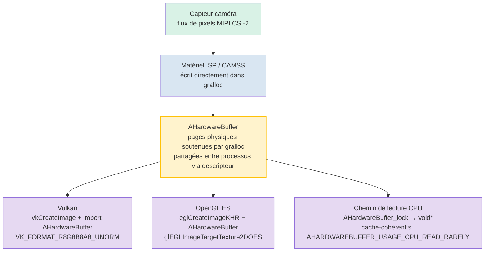

# Chapitre 25 : Développement natif de la caméra

## Résumé

Les chapitres 1 à 24 ont fonctionné en code managé : Kotlin ou Java s'exécutant sur ART, franchissant une limite d'IPC Binder pour chaque `CaptureRequest`, et allouant soit des copies de `ByteBuffer` des images, soit acceptant le surcoût du streaming de textures via `SurfaceTexture`. Pour les applications de caméra sociales, cela suffit largement. Pour les moteurs de RA, les pipelines de vision par ordinateur en temps réel, les caméras de recul embarquées ou les moteurs 3D avec un budget de 16 ms par image — ce n'est pas le cas.

Le développement natif de la caméra déplace toute la boucle d'ouverture/configuration/capture dans le C/C++ en utilisant les en-têtes `<camera/NdkCameraManager.h>` et `<android/hardware_buffer.h>` du NDK. Le gain immédiat est l'absence de surcoût JNI sur le chemin critique et, surtout, la possibilité d'envelopper les objets `AHardwareBuffer` alloués par gralloc directement comme cibles `VkImage` Vulkan ou `EGLImage` OpenGL sans un seul octet de copie mémoire entre la sortie du capteur et l'échantillonnage de la texture par le GPU.

**Android Camera Parameters** vous aide à valider que vos appareils cibles exposent les garanties `INFO_SUPPORTED_HARDWARE_LEVEL_FULL` ou `LEVEL_3` requises pour un fonctionnement natif de bas niveau prévisible. Installez-le depuis [Google Play](https://play.google.com/store/apps/details?id=com.minininja.cameraparams) ou consultez le code source sur [github.com/zoozooll/AndroidCameraParameters](https://github.com/zoozooll/AndroidCameraParameters).

---

## Pourquoi passer en natif ?

Avant de plonger dans le C++, soyons précis sur ce que le natif vous apporte et quand il justifie sa complexité.

### Les avantages du natif

1. **Zéro surcoût JNI sur le chemin critique.** Un pipeline à 60 fps dispose de 16,67 ms par image. Un seul appel JNI `CallVoidMethod` franchissant la frontière ART/C coûte environ 0,5 à 2 µs en micro-benchmark, mais le coût réel réside dans l'appel *par image*, le passage de thread, la gestion des références locales JNI et la pression du GC provenant des proxies `Image` managés. Multipliez cela par quatre caméras alimentant simultanément une session de RA et vous brûlez une milliseconde de budget rien qu'en franchissant les limites de langage. Le natif élimine cela.

2. **Propriété directe de la mémoire avec `AHardwareBuffer`.** En code managé, `Image.getPlanes()[0].getBuffer()` renvoie un `ByteBuffer` qui est une *vue* sur la mémoire gralloc ; le lire force une invalidation du cache CPU et souvent une copie interne pour les formats comme `PRIVATE`. En code natif, `AHardwareBuffer` est le descripteur gralloc lui-même, et le GPU peut le lier comme mémoire de texture sur place.

3. **Intégration de moteur RA/3D.** Unity, Unreal, Ogre et les moteurs internes sont écrits en C++ pour de bonnes raisons. Exécuter la caméra *à l'intérieur* du code C++ de la boucle de rendu élimine l'enchevêtrement des trois processus "ART + JNI + thread de rendu".

4. **Migration EVS (External View System) pour l'automobile.** Avant Android 10, les caméras de recul automobiles utilisaient la pile héritée `EVS` avec son propre HAL. Les migrations OEM de 2020-2024 ont fait converger l'EVS vers les API NDK Camera2 standards, réservant `AID_AUTOMOTIVE_EVS_UID = 1071` pour un accès précoce au matériel pendant le démarrage *avant* même que le CameraService de `system_server` ne soit lancé. Si votre code cible l'automobile, le natif est non négociable.

### Les inconvénients du natif

- Le débogage est plus difficile. Les plantages dans les rappels `ACameraDevice` produisent des traces de type tombstone, et non de belles traces de pile Kotlin.
- La gestion du cycle de vie est entièrement manuelle. `ACameraManager` n'est *pas* respectueux du cycle de vie ; oublier `ACameraCaptureSession_stopRepeating()` + `ACameraDevice_close()` lors de la destruction d'une surface fait fuiter les ressources de la caméra et peut bloquer les autres applications jusqu'au redémarrage.
- Moins de solutions de contournement d'appareils. La base de données de "quirks" de CameraX n'existe pas dans le monde NDK ; vous héritez du comportement brut du HAL tel qu'il est livré.
- Pas de `DngCreator`, pas d'aides `ExifInterface`, pas d'accesseurs pratiques pour `CameraCharacteristics` — vous analysez vous-même les balises de métadonnées via `ACameraMetadata_getConstEntry`.

La décision est simple : si vous ne pouvez pas respecter votre budget d'image en code managé, ou si vous avez besoin d'un accès à la caméra au démarrage de type EVS, passez en natif. Sinon, restez en managé.

---

## ACameraManager : Le pendant NDK du CameraManager Java

La surface de l'API caméra du NDK dans `<camera/NdkCameraManager.h>`, `<camera/NdkCameraDevice.h>` et `<camera/NdkCaptureRequest.h>` correspond presque un pour un à l'API Java que vous connaissez. Chaque classe Java possède une structure native et un ensemble de fonctions libres :

| Java                          | Descripteur NDK / Préfixe de fonction                 |
|-------------------------------|-------------------------------------------------------|
| `CameraManager`               | `ACameraManager` · `ACameraManager_*`                 |
| `CameraCharacteristics`       | `ACameraMetadata` · `ACameraMetadata_*`               |
| `CameraDevice`                | `ACameraDevice` · `ACameraDevice_*`                   |
| `CaptureRequest.Builder`      | `ACaptureRequest` · `ACaptureRequest_setEntry_*`      |
| `CameraCaptureSession`        | `ACameraCaptureSession` · `ACameraCaptureSession_*`   |
| `TotalCaptureResult`          | `ACameraCaptureResult` · `ACaptureResult`             |
| `ImageReader`                 | `AImageReader` (depuis `<media/NdkImageReader.h>`)    |

Le cycle de vie est identique : énumérer les caméras → lire les caractéristiques → ouvrir → créer les surfaces de sortie → créer la session → définir la requête répétée → démonter dans l'ordre inverse.

### Exemple 1 : Énumérer les caméras, lire les caractéristiques, ouvrir un appareil (C++)

```cpp
#include <camera/NdkCameraManager.h>
#include <camera/NdkCameraDevice.h>
#include <camera/NdkCameraMetadata.h>
#include <android/log.h>

#define LOG_TAG "NativeCam"
#define LOGI(...) __android_log_print(ANDROID_LOG_INFO, LOG_TAG, __VA_ARGS__)
#define LOGE(...) __android_log_print(ANDROID_LOG_ERROR, LOG_TAG, __VA_ARGS__)

static ACameraManager* g_cameraManager = nullptr;
static ACameraDevice* g_cameraDevice = nullptr;

void onDeviceDisconnected(void* ctx, ACameraDevice* dev) {
    LOGI("Appareil caméra déconnecté");
}

void onDeviceError(void* ctx, ACameraDevice* dev, int err) {
    LOGE("Erreur appareil caméra : %d", err);
}

static ACameraDevice_stateCallbacks g_deviceCallbacks = {
    .context = nullptr,
    .onDisconnected = onDeviceDisconnected,
    .onError = onDeviceError,
};

bool enumerateAndOpenBackCamera() {
    g_cameraManager = ACameraManager_create();
    if (!g_cameraManager) {
        LOGE("Échec de la création d'ACameraManager");
        return false;
    }

    ACameraIdList* cameraIdList = nullptr;
    camera_status_t status = ACameraManager_getCameraIdList(
        g_cameraManager, &cameraIdList);
    if (status != ACAMERA_OK) {
        LOGE("getCameraIdList a échoué : %d", status);
        return false;
    }

    const char* chosenId = nullptr;

    for (int i = 0; i < cameraIdList->numCameras; ++i) {
        const char* id = cameraIdList->cameraIds[i];
        ACameraMetadata* chars = nullptr;
        status = ACameraManager_getCameraCharacteristics(
            g_cameraManager, id, &chars);
        if (status != ACAMERA_OK) continue;

        ACameraMetadata_const_entry lensFacingEntry{};
        status = ACameraMetadata_getConstEntry(
            chars,
            ACAMERA_LENS_FACING,
            &lensFacingEntry);

        uint8_t facing = 0;
        if (status == ACAMERA_OK && lensFacingEntry.count > 0) {
            facing = lensFacingEntry.data.u8[0];
        }

        if (facing == ACAMERA_LENS_FACING_BACK) {
            chosenId = id;
            // Interroger également le niveau matériel pour la vérification des capacités :
            ACameraMetadata_const_entry hwEntry{};
            if (ACameraMetadata_getConstEntry(
                    chars, ACAMERA_INFO_SUPPORTED_HARDWARE_LEVEL,
                    &hwEntry) == ACAMERA_OK && hwEntry.count > 0) {
                LOGI("Caméra arrière %s niveau matériel = %d (attendu %d=FULL %d=LEVEL3)",
                     id, hwEntry.data.u8[0],
                     (int)ACAMERA_INFO_SUPPORTED_HARDWARE_LEVEL_FULL,
                     (int)ACAMERA_INFO_SUPPORTED_HARDWARE_LEVEL_3);
            }
            ACameraMetadata_free(chars);
            break;
        }
        ACameraMetadata_free(chars);
    }

    ACameraManager_deleteCameraIdList(cameraIdList);

    if (!chosenId) {
        LOGE("Aucune caméra orientée vers l'arrière trouvée");
        return false;
    }

    status = ACameraManager_openCamera(
        g_cameraManager, chosenId,
        &g_deviceCallbacks,
        &g_cameraDevice);

    if (status != ACAMERA_OK) {
        LOGE("openCamera a échoué : %d", status);
        return false;
    }

    LOGI("Caméra %s ouverte avec succès", chosenId);
    return true;
}
```

Notez l'absence d'exceptions. Chaque fonction renvoie un `camera_status_t`, et vous *devez* vérifier chaque retour. `ACAMERA_OK = 0` ; toute valeur non nulle est un code d'échec spécifique (`ACAMERA_ERROR_CAMERA_IN_USE`, `ACAMERA_ERROR_CAMERA_DISCONNECTED`, etc.). Il n'y a pas de `CameraAccessException` à attraper — si vous ignorez le retour, la fonction a simplement laissé silencieusement le pointeur de sortie à `nullptr` et vous plantez trois lignes plus tard.

### Création d'une session de capture et définition d'une requête répétée

Une fois l'appareil ouvert, le modèle reflète la création de session Java. Créez une `ACameraOutputTarget` par surface, emballez-les dans un `ACaptureSessionOutputContainer`, puis appelez `ACameraDevice_createCaptureSession()`. Pour les requêtes répétées, construisez une `ACaptureRequest` à partir d'un modèle, ajoutez votre cible de sortie et appelez `ACameraCaptureSession_setRepeatingRequest()`. Les structures de rappel (`ACameraCaptureSession_stateCallbacks`, `ACameraCaptureSession_captureCallbacks`) sont enregistrées au moment de la création de la session, correspondant exactement à leurs homologues Java.

---

## AHardwareBuffer : Le chemin critique du zéro-copie

C'est la véritable raison de passer en natif. `AHardwareBuffer` (défini dans `<android/hardware_buffer.h>`) est le descripteur NDK de la mémoire allouée par gralloc — la mémoire même dans laquelle le HAL de la caméra écrit les pixels du capteur. Lorsque vous fournissez une surface soutenue par un `AHardwareBuffer` à `ACameraDevice_createCaptureSession` et que vous importez ensuite ce même `AHardwareBuffer` dans Vulkan ou OpenGL, vous obtenez un véritable zéro-copie :



Le nœud `AHardwareBuffer` est la clé de voûte : c'est une allocation unique partagée par le point final d'écriture du HAL de la caméra, l'échantillonneur de texture du GPU et éventuellement le CPU. Pas de memcpy, pas de chargement `glTexImage2D`, pas de `ByteBuffer.wrap()` — la texture GPU pointe littéralement vers les mêmes pages DRAM physiques que celles que la caméra vient d'écrire.

Pour les pipelines de RA à 60 fps sur un flux 4K, il s'agit d'une économie de bande passante d'environ 200 ms par seconde (4K × 60 fps × 4 octets = ~4,7 Go/s économisés) et de la différence entre une expérience fluide et un fouillis saccadé.

### Exemple 2 : De AHardwareBuffer à Vulkan VkImage, étape par étape (C++)

```cpp
#include <android/hardware_buffer.h>
#include <vulkan/vulkan.h>
#include <vulkan/vulkan_android.h>

VkImage createVkImageFromAHardwareBuffer(
    VkDevice device,
    AHardwareBuffer* aBuffer,
    VkFormat format,
    uint32_t width,
    uint32_t height) {

    // Étape 1 : Remplir AndroidHardwareBufferProperties2KHR
    VkAndroidHardwareBufferPropertiesANDROID ahbProps{};
    ahbProps.sType = VK_STRUCTURE_TYPE_ANDROID_HARDWARE_BUFFER_PROPERTIES_ANDROID;
    VkResult res = vkGetAndroidHardwareBufferPropertiesANDROID(
        device, aBuffer, &ahbProps);
    if (res != VK_SUCCESS) {
        LOGE("vkGetAndroidHardwareBufferPropertiesANDROID a échoué : %d", res);
        return VK_NULL_HANDLE;
    }

    // Étape 2 : Décrire l'*importation* de l'image (pas l'allocation)
    VkExternalMemoryImageCreateInfo externalInfo{};
    externalInfo.sType = VK_STRUCTURE_TYPE_EXTERNAL_MEMORY_IMAGE_CREATE_INFO;
    externalInfo.handleTypes =
        VK_EXTERNAL_MEMORY_HANDLE_TYPE_ANDROID_HARDWARE_BUFFER_BIT_ANDROID;

    VkImageCreateInfo imgInfo{};
    imgInfo.sType = VK_STRUCTURE_TYPE_IMAGE_CREATE_INFO;
    imgInfo.pNext = &externalInfo;
    imgInfo.imageType = VK_IMAGE_TYPE_2D;
    imgInfo.format = format;             // ex : VK_FORMAT_R8G8B8A8_UNORM
    imgInfo.extent = { width, height, 1 };
    imgInfo.mipLevels = 1;
    imgInfo.arrayLayers = 1;
    imgInfo.samples = VK_SAMPLE_COUNT_1_BIT;
    imgInfo.tiling = VK_IMAGE_TILING_OPTIMAL;
    imgInfo.usage = VK_IMAGE_USAGE_SAMPLED_BIT |
                    VK_IMAGE_USAGE_TRANSFER_DST_BIT;
    imgInfo.sharingMode = VK_SHARING_MODE_EXCLUSIVE;
    imgInfo.initialLayout = VK_IMAGE_LAYOUT_UNDEFINED;

    VkImage image = VK_NULL_HANDLE;
    res = vkCreateImage(device, &imgInfo, nullptr, &image);
    if (res != VK_SUCCESS) {
        LOGE("vkCreateImage a échoué : %d", res);
        return VK_NULL_HANDLE;
    }

    // Étape 3 : Allouer VkDeviceMemory en *important* l'AHB, pas en allouant une nouvelle
    VkMemoryRequirements memReqs{};
    vkGetImageMemoryRequirements(device, image, &memReqs);

    VkImportAndroidHardwareBufferInfoANDROID importInfo{};
    importInfo.sType =
        VK_STRUCTURE_TYPE_IMPORT_ANDROID_HARDWARE_BUFFER_INFO_ANDROID;
    importInfo.buffer = aBuffer;

    VkMemoryDedicatedAllocateInfo dedicatedInfo{};
    dedicatedInfo.sType = VK_STRUCTURE_TYPE_MEMORY_DEDICATED_ALLOCATE_INFO;
    dedicatedInfo.pNext = &importInfo;
    dedicatedInfo.image = image;

    VkMemoryAllocateInfo allocInfo{};
    allocInfo.sType = VK_STRUCTURE_TYPE_MEMORY_ALLOCATE_INFO;
    allocInfo.pNext = &dedicatedInfo;
    allocInfo.allocationSize = memReqs.size;
    allocInfo.memoryTypeIndex = ahbProps.memoryTypeBits
        // memoryTypeIndex doit être sélectionné à partir de l'intersection de
        // memReqs.memoryTypeBits ET ahbProps.memoryTypeBits. Omis par brièveté.
        ;

    VkDeviceMemory mem = VK_NULL_HANDLE;
    res = vkAllocateMemory(device, &allocInfo, nullptr, &mem);
    if (res != VK_SUCCESS) {
        LOGE("L'importation de vkAllocateMemory a échoué : %d", res);
        vkDestroyImage(device, image, nullptr);
        return VK_NULL_HANDLE;
    }

    // Étape 4 : Lier la mémoire importée à la VkImage
    vkBindImageMemory(device, image, mem, 0);

    // Étape 5 : Transition vers la mise en page SHADER_READ_ONLY_OPTIMAL via le tampon de commande
    // (omis — barrière mémoire d'image standard pour VK_IMAGE_LAYOUT_UNDEFINED
    // → VK_IMAGE_LAYOUT_SHADER_READ_ONLY_OPTIMAL)

    LOGI("AHardwareBuffer importé avec succès en tant que VkImage %p", image);
    return image;
}
```

Le saut conceptuel qui fait trébucher la plupart des nouveaux arrivants est l'Étape 3 : `vkAllocateMemory` avec `VK_STRUCTURE_TYPE_IMPORT_ANDROID_HARDWARE_BUFFER_INFO_ANDROID` n'alloue **pas**. Elle enregistre un `AHardwareBuffer` existant comme un objet `VkDeviceMemory`. Les octets ont déjà été alloués par gralloc lorsque le producteur de la caméra a créé la surface ; Vulkan les adopte simplement dans son modèle mémoire.

Le chemin OpenGL ES est analogue mais plus court : `eglCreateImageKHR(..., EGL_NATIVE_BUFFER_ANDROID, aBuffer, ...)` → `glEGLImageTargetTexture2DOES(GL_TEXTURE_2D, eglImage)`. Un appel et vous échantillonnez.

---

## Résumé de l'interopérabilité OpenGL et Vulkan

Les deux chemins fonctionnent. Lequel choisir :

| Facteur                | OpenGL ES 3.x + EGLImage                    | Vulkan 1.1+ + importation AHB               |
|-----------------------|----------------------------------------------|----------------------------------------------|
| Simplicité            | Configuration plus courte, moins de cérémonie | Plus de code répétitif, synchronisation explicite |
| Synchronisation       | Implicite ; le pilote insère les barrières   | Explicite ; vous écrivez les barrières de pipeline + sémaphores |
| Multi-file/threading  | Lié à un seul EGLContext par thread          | Transferts multi-files de premier ordre      |
| Certif automobile/RA  | Certifié sur la plupart des cibles EVS       | De plus en plus requis pour les nouveaux runtimes de RA |

Si vous vous intégrez à un moteur existant, le moteur choisit pour vous. Si vous partez de zéro et voulez des performances maximales, Vulkan est l'avenir. Si vous voulez un minimum de code, OpenGL ES via EGLImage reste le choix pragmatique et est présent sur tous les appareils dotés d'une caméra.

---

## Contexte EVS automobile : Migration vers Camera2 NDK

Pour être complet, une brève note sur le chemin de migration automobile mentionné dans les notes de recherche. Jusqu'à Android 9, les caméras de recul embarquées utilisaient le HAL `EVS` distinct (`android.hardware.automotive.evs@1.0`), avec son propre pipeline d'énumération et de streaming. À partir d'Android 10 et de manière obligatoire dans Android 12+ pour les nouveaux systèmes IVI, le gestionnaire EVS a été réimplémenté *au-dessus du HAL3 caméra standard + pile de caméra NDK*, avec un nouvel UID réservé `AID_AUTOMOTIVE_EVS_UID = 1071` qui reçoit l'accès au groupe de permissions `CAMERA` dès le `early-boot` — avant même que le `CameraService` de `system_server` ne soit initialisé.

Pratiquement, si vous écrivez du code de caméra de recul pour les voitures :
1. Votre processus s'exécute en tant qu'UID 1071.
2. Vous utilisez *exactement* les API natives de ce chapitre (`ACameraManager_openCamera`, `AImageReader`, `AHardwareBuffer` → importation Vulkan).
3. Vous devez être capable d'ouvrir, de configurer et de sortir une image en moins de 2 secondes à partir d'un démarrage à froid (exigence FMVSS 111). C'est pourquoi la pile EVS nécessite le natif — chaque ms de démarrage d'ART est une ms que vous n'avez pas.

La migration EVS → Camera2 NDK est l'un des plus grands refactorings internes de l'écosystème caméra d'Android au cours des cinq dernières années, et c'est pourquoi les API caméra NDK ont reçu un investissement aussi lourd à partir d'Android 10. Si vous lisez ce chapitre pour livrer un produit de caméra embarqué, vous utilisez exactement le chemin de code imposé par les tests de conformité automobile de Google.

---

## Exemple 3 (Stub de pont JNI Kotlin)

Pour être complet, un point d'entrée JNI Kotlin minimal qui appelle le code C++ ci-dessus :

```kotlin
// NativeBridge.kt
class NativeBridge {

    external fun enumerateAndOpenBackCameraNative(): Boolean

    companion object {
        init {
            System.loadLibrary("native_camera")
        }
    }
}
```

```cpp
// export JNI native_camera.cpp
extern "C" JNIEXPORT jboolean JNICALL
Java_com_example_NativeBridge_enumerateAndOpenBackCameraNative(
    JNIEnv* /*env*/, jobject /*thiz*/) {
    return static_cast<jboolean>(enumerateAndOpenBackCamera() ? JNI_TRUE : JNI_FALSE);
}
```

Et dans `build.gradle` :

```kotlin
android {
    defaultConfig {
        ndk { abiFilters += listOf("arm64-v8a", "armeabi-v7a", "x86_64") }
    }
    externalNativeBuild {
        cmake { path = file("src/main/cpp/CMakeLists.txt") }
    }
}
```

Avec le `CMakeLists.txt` correspondant liant `-lcamera2ndk`, `-lmediandk`, `-landroid` et `-lvulkan`.

---

## Résumé

Le développement natif de la caméra échange l'ergonomie du code managé contre des performances maximales et une propriété directe du matériel. `ACameraManager` et ses structures compagnons reflètent l'API Camera2 Java un pour un, mais avec des retours d'erreurs de style C et un cycle de vie manuel. Le véritable gain est l' `AHardwareBuffer` — le descripteur gralloc qui vous permet d'envoyer la sortie du HAL de la caméra directement dans des textures Vulkan `VkImage` ou OpenGL `EGLImage` avec zéro copie mémoire, économisant des gigaoctets par seconde de bande passante DRAM dans les pipelines de RA à 60 fps. Pour l'automobile, la migration EVS-vers-NDK rend le natif non négociable en raison de l'exigence d'image au démarrage de 2 secondes et de l'accès matériel précoce de `AID_AUTOMOTIVE_EVS_UID`. Utilisez **Android Camera Parameters** pour valider que votre appareil cible possède le niveau `INFO_SUPPORTED_HARDWARE_LEVEL_FULL` ou supérieur avant de vous engager dans une implémentation native.

## Et ensuite ?

Qu'elle soit en Kotlin ou en C++, Camera2 est une API intrinsèquement asynchrone : `StateCallbacks`, `CaptureCallbacks`, `AvailabilityCallbacks`, se déclenchant tous sur des threads d'arrière-plan. Le chapitre 26 dompte ce chaos avec les coroutines Kotlin et Flow, convertissant l'enfer des rappels spaghetti que vous avez écrit dans les premiers chapitres en un pipeline réactif, linéaire et propre.
