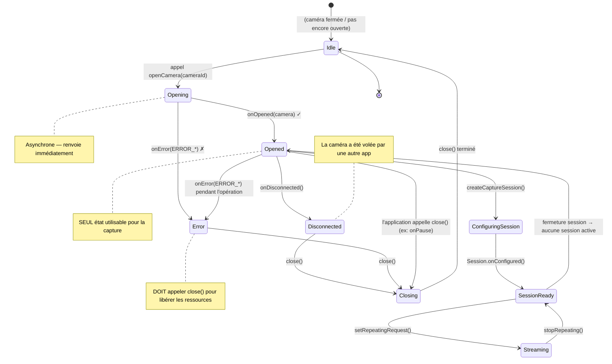

Vous avez énuméré toutes les caméras de l'appareil (Chapitre 6) et identifié celle que vous souhaitez utiliser — généralement la caméra arrière avec le niveau matériel le plus élevé. L'étape suivante consiste à **ouvrir** cette caméra : établir une connexion active de bas niveau avec le matériel de la caméra afin de pouvoir configurer des sessions de capture et soumettre des requêtes. L'ouverture d'une caméra est le point de non-retour où votre application passe d'un observateur passif de métadonnées de caméra à un contrôleur actif du matériel réel.

Si vous souhaitez voir du code de cycle de vie d'ouverture/fermeture de caméra de qualité production, étudiez l'application **Android Camera Parameters** sur [GitHub](https://github.com/zoozooll/AndroidCameraParameters). Sa classe `Camera2Controller` encapsule toute la gestion du cycle de vie de `CameraDevice`, y compris la récupération d'erreur, la logique de réessai et le nettoyage synchrone. La version de l'application sur [Google Play](https://play.google.com/store/apps/details?id=com.minininja.cameraparams) a été installée sur des milliers d'appareils à travers des centaines d'OEM différents, de sorte que les cas particuliers qu'elle gère sont éprouvés sur le terrain.

## Qu'est-ce que CameraDevice ?

`CameraDevice` est la classe Camera2 qui représente **une connexion active et ouverte à une caméra physique (ou logique) spécifique sur l'appareil**. Avant que la caméra ne soit ouverte, vous ne pouvez lire que ses caractéristiques ; une fois ouverte, vous pouvez :
- Créer des `CameraCaptureSession`s (Chapitre 8)
- Soumettre des `CaptureRequest`s (Chapitres 8 et 9)
- Lire les métadonnées dynamiques `CaptureResult` à mesure que les images arrivent
- Vider les requêtes en attente, annuler les captures et fermer l'appareil

Un `CameraDevice` possède deux propriétés critiques :

1. **C'est une ressource à utilisateur unique.** Une seule application (et au sein de votre application, une seule instance de `CameraDevice`) peut détenir une caméra donnée ouverte à la fois. Si une application de priorité supérieure (comme un appel téléphonique entrant avec vidéo) a besoin de la caméra, votre application sera déconnectée de force.
2. **Il a un cycle de vie strict piloté par des rappels.** Vous ne pouvez pas instancier un `CameraDevice` avec un constructeur. La seule façon d'en obtenir un est via `CameraManager.openCamera()`, qui délivre l'instance de manière asynchrone via un `StateCallback`. Vous devez respecter chaque rappel de transition d'état.

La relation entre `CameraManager`, un ID de caméra et le `CameraDevice` résultant est :

```
CameraManager.openCamera("0", callback, handler)
    │
    ├── Appel asynchrone → renvoie immédiatement
    │
    └───── Sur le thread d'arrière-plan (via Handler) ────→ StateCallback.onOpened(cameraDevice)
                                                                  │
                                                                  ▼
                                                          Vous pouvez maintenant utiliser cameraDevice pour :
                                                          • createCaptureSession(...)
                                                          • createCaptureRequest(...)
```

## Le StateCallback : La machine à états du cycle de vie de CameraDevice

`CameraDevice.StateCallback` est une classe abstraite avec trois méthodes que vous **devez** implémenter. Chaque caméra ouverte finira par déclencher au moins un de ces rappels (soit `onOpened` suivi plus tard de `onDisconnected`/`onError`, soit directement `onError` si l'ouverture échoue). La caméra ne peut pas être utilisée pour la capture tant que `onOpened` n'est pas déclenché.

### Les trois méthodes de StateCallback

| Méthode | Appelée quand | Ce qu'il faut faire |
|---|---|---|
| `onOpened(camera: CameraDevice)` | La caméra a été ouverte avec succès et est prête à l'emploi. | Stocker la référence `camera` dans une propriété. Procéder à la configuration d'une session de capture (Chapitre 8). Relâcher tout permis de Sémaphore si vous en avez acquis un. |
| `onDisconnected(camera: CameraDevice)` | La caméra a été retirée à votre application (ex: une autre application de priorité supérieure l'a ouverte, l'utilisateur est passé à une application gourmande en caméra, ou la politique de l'appareil l'a désactivée). | Appeler `camera.close()` immédiatement. Annuler votre référence stockée. La caméra ne peut pas être rouverte tant que votre application ne repasse pas au premier plan (moment où `onResume` réessaiera). |
| `onError(camera: CameraDevice, error: Int)` | Une erreur fatale s'est produite lors de l'ouverture ou pendant que la caméra était active. Le paramètre `error` est l'une des constantes `ERROR_*` décrites ci-dessous. | Appeler `camera.close()`. Annuler la référence. Selon le code d'erreur, soit afficher une erreur à l'utilisateur, soit réessayer avec un backoff exponentiel. Toujours relâcher le Sémaphore. |

### Les codes d'erreur `onError`

L'entier `error` dans `onError` correspond à cinq constantes (définies dans `CameraDevice.StateCallback`) :

| Constante | Valeur | Signification | Récupération |
|---|---|---|---|
| `ERROR_CAMERA_IN_USE` | `1` | La caméra est déjà ouverte par une autre application ou par le service de caméra du système. | Impossible de récupérer automatiquement ; attendre le `onResume` lorsque l'utilisateur revient sur votre application et réessayer. |
| `ERROR_MAX_CAMERAS_IN_USE` | `2` | L'appareil a une limite sur le nombre de caméras pouvant être ouvertes simultanément ; vous l'avez dépassée en essayant d'ouvrir cette caméra (courant sur les fleurons multi-caméras). | Fermer d'autres `CameraDevice`s ouverts que vous pourriez détenir, puis réessayer. Sur les appareils avec des limites matérielles, généralement seules 2 ou 3 caméras peuvent être ouvertes à la fois. |
| `ERROR_CAMERA_DISABLED` | `3` | La politique de l'appareil (MDM, contrôle parental, mode kiosque) a désactivé toutes les caméras. | Afficher un message d'erreur permanent à l'utilisateur. Réessayer n'aidera pas tant que la politique n'aura pas changé. |
| `ERROR_CAMERA_DEVICE` | `4` | Le matériel/micrologiciel de la caméra a rencontré une erreur irrécupérable. | Fermer l'appareil. Informer l'utilisateur. Réessayer peut aider sur certains appareils (pour des bugs passagers du micrologiciel), donc une ou deux tentatives de réessai avec backoff sont raisonnables. |
| `ERROR_CAMERA_SERVICE` | `5` | Le service de caméra à l'échelle du système a planté. Il s'agit d'une défaillance au niveau de la plateforme, pas de la faute de votre application. | Tout fermer et tout annuler. Généralement, le service de caméra redémarrera automatiquement en quelques secondes ; vous pouvez réessayer après un délai ou attendre le prochain `onResume`. |

Le diagramme d'états ci-dessous capture chaque transition valide d'un `CameraDevice` du moment où vous appelez `openCamera()` jusqu'à ce que vous (ou le système) le fermiez :



Points importants à retenir du diagramme d'états :

1. **Opened est le seul état opérationnel.** Avant que `onOpened` ne se déclenche et après toute erreur/déconnexion, la référence `CameraDevice` doit être considérée comme inutilisable.
2. **Fermez dans chaque état terminal.** Que vous obteniez `onError`, `onDisconnected` ou que vous décidiez simplement de fermer proactivement dans `onPause`, **appelez toujours `close()`**. Ne pas fermer une caméra entraîne des fuites qui empêchent **toute** application (y compris la vôtre) de la rouvrir jusqu'à ce que le processus meure ou que le service système redémarre.
3. **onError est terminal.** Après `onError`, cette instance spécifique de `CameraDevice` est morte. N'essayez pas de la récupérer ; fermez-la, puis tentez un nouveau `openCamera()` si vous pensez que l'erreur était passagère.

## Intégration du cycle de vie avec onPause/onResume de l'Activity

Le cycle de vie de l'Activity Android est intrinsèquement lié au cycle de vie de `CameraDevice`. Le matériel de caméra est une ressource partagée et gourmande en énergie ; le système tue agressivement les applications qui détiennent des caméras tout en étant en arrière-plan. Les règles canoniques sont :

### Quand ouvrir la caméra (onResume)

Dans `onResume` (après avoir démarré le thread d'arrière-plan, comme nous l'avons établi au Chapitre 5) :
1. Vérifiez que les autorisations sont toujours accordées (l'utilisateur a pu les révoquer dans les Paramètres pendant que l'application était en arrière-plan).
2. Si un `CameraDevice` est déjà ouvert, tout va bien.
3. Si aucun `CameraDevice` n'est ouvert, appelez `openCamera()` avec l'ID que vous avez sélectionné au Chapitre 6.

### Quand fermer la caméra (onPause)

Dans `onPause` (avant d'arrêter le thread d'arrière-plan) :
1. Si une requête répétée est active (aperçu en cours — Chapitre 8), arrêtez-la avec `cameraCaptureSession.stopRepeating()`.
2. Si une session de capture ouverte existe, fermez-la avec `cameraCaptureSession.close()`.
3. Fermez le `CameraDevice` lui-même avec `cameraDevice.close()`.
4. Annulez les trois références (session, appareil et le constructeur de requête en attente).
5. Ensuite (et seulement ensuite), arrêtez le thread d'arrière-plan.

Si vous inversez cet ordre (par exemple, arrêter le thread **avant** de fermer la caméra), les rappels que `close()` doit exécuter n'auront nulle part où s'exécuter, et vous obtiendrez des blocages, des ANR ou des avertissements `Handler ... sending message to a Handler on a dead thread` dans Logcat.

## Contrôle de la concurrence avec un Sémaphore

Il existe une condition de concurrence subtile qui piège même les développeurs Camera2 expérimentés : **que se passe-t-il si l'utilisateur bascule rapidement entre les applications, provoquant un nouvel appel à `openCamera()` avant que le rappel asynchrone de l'ouverture précédente n'ait été déclenché ?**

Vous vous retrouvez avec deux tentatives d'ouverture concurrentes pour la même caméra. Le service de caméra du système peut en servir une et rejeter l'autre avec `ERROR_CAMERA_IN_USE`, ou il peut déconnecter la première en cours d'ouverture — dans tous les cas, votre code de rappel doit faire face à des références obsolètes et à des bugs de double fermeture.

La solution est un **`Semaphore`** initialisé avec 1 permis (un verrou binaire / mutex) :

- Avant d'appeler `openCamera()`, acquérez le permis. Si l'acquisition dépasse le délai imparti, ignorez cette tentative d'ouverture (la précédente est toujours en cours).
- Dans **chaque rappel terminal** (`onOpened`, `onDisconnected`, `onError`), relâchez le permis.
- Dans `onPause`, après avoir fermé la caméra, relâchez le permis une fois de plus de manière défensive s'il était détenu.

`Semaphore.tryAcquire(timeout, unit)` est la bonne méthode : elle bloque pendant au plus `timeout` millisecondes, puis renvoie `false` si le permis n'a pas pu être obtenu. N'utilisez jamais la méthode bloquante `acquire()` sans délai d'attente sur le thread principal — cela peut provoquer un ANR.

## Gestion de CameraAccessException

`CameraManager.openCamera()` lève une exception vérifiée `CameraAccessException`. Contrairement aux codes d'erreur délivrés via `StateCallback.onError` (qui sont des erreurs post-ouverture), ces exceptions se produisent **pendant la tentative d'ouverture elle-même** avant même qu'un objet `CameraDevice` n'existe. Les quatre codes de raison les plus courants :

| Raison (depuis `e.reason`) | Signification |
|---|---|
| `CAMERA_IN_USE` (`4`) | Idem que la version de rappel — une autre application détient la caméra. |
| `MAX_CAMERAS_IN_USE` (`5`) | Limite matérielle de caméras atteinte. |
| `CAMERA_DISABLED` (`1`) | Politique désactivée (MDM / profil professionnel). |
| `CAMERA_ERROR` (`3`) | Échec matériel générique lors de l'ouverture. |

Enveloppez toujours `openCamera()` dans un bloc try/catch pour `CameraAccessException` et aussi `IllegalArgumentException` (au cas où l'ID de la caméra aurait été invalidé entre l'énumération du Chapitre 6 et maintenant — ex : une caméra USB externe a été débranchée).

## Code Kotlin complet : Ouvrir une caméra

Voici le code complet de `MainActivity` intégrant tout ce qui a été vu dans ce chapitre. Nous étendons la base de code du Chapitre 6 avec la méthode `openCamera()`, un `StateCallback` complet, un contrôle de concurrence basé sur un `Semaphore`, l'intégration du cycle de vie de l'Activity et une gestion exhaustive des erreurs.

```kotlin
package com.example.camera2tutorial

import android.Manifest
import android.content.Context
import android.content.pm.PackageManager
import android.hardware.camera2.CameraAccessException
import android.hardware.camera2.CameraCharacteristics
import android.hardware.camera2.CameraDevice
import android.hardware.camera2.CameraManager
import android.hardware.camera2.CameraMetadata
import android.os.Bundle
import android.os.Handler
import android.os.HandlerThread
import android.util.Log
import android.widget.Toast
import androidx.appcompat.app.AppCompatActivity
import androidx.core.app.ActivityCompat
import androidx.core.content.ContextCompat
import java.util.concurrent.Semaphore
import java.util.concurrent.TimeUnit

class MainActivity : AppCompatActivity() {

    private lateinit var backgroundThread: HandlerThread
    private lateinit var backgroundHandler: Handler
    private lateinit var cameraManager: CameraManager

    // Empêcher plusieurs ouvertures de caméra concurrentes
    private val cameraOpenCloseLock = Semaphore(1)

    // L'appareil photo ouvert actif (nullable)
    private var cameraDevice: CameraDevice? = null

    // ID de la caméra sélectionnée (à partir de l'étape de découverte du Chapitre 6)
    private var selectedCameraId: String? = null

    override fun onCreate(savedInstanceState: Bundle?) {
        super.onCreate(savedInstanceState)
        setContentView(R.layout.activity_main)

        if (allPermissionsGranted()) {
            initializeCameraManager()
        } else {
            ActivityCompat.requestPermissions(
                this,
                REQUIRED_PERMISSIONS,
                REQUEST_CODE_PERMISSIONS
            )
        }
    }

    override fun onResume() {
        super.onResume()
        startBackgroundThread()

        if (allPermissionsGranted()) {
            if (!this::cameraManager.isInitialized) {
                initializeCameraManager()
            }
            // Autorisation OK mais caméra pas encore ouverte → l'ouvrir maintenant
            if (cameraDevice == null && selectedCameraId != null) {
                openCamera(selectedCameraId!!)
            }
        } else {
            // L'utilisateur a révoqué les autorisations pendant que l'application était en arrière-plan
            ActivityCompat.requestPermissions(
                this,
                REQUIRED_PERMISSIONS,
                REQUEST_CODE_PERMISSIONS
            )
        }
    }

    override fun onPause() {
        closeCamera()
        stopBackgroundThread()
        super.onPause()
    }

    private fun startBackgroundThread() {
        backgroundThread = HandlerThread("Camera2Background").apply { start() }
        backgroundHandler = Handler(backgroundThread.looper)
    }

    private fun stopBackgroundThread() {
        backgroundThread.quitSafely()
        try {
            backgroundThread.join(1000)
        } catch (e: InterruptedException) {
            Log.e(TAG, "Interrompu lors de la jonction du thread d'arrière-plan", e)
        }
    }

    private fun initializeCameraManager() {
        cameraManager = getSystemService(Context.CAMERA_SERVICE) as CameraManager
        discoverCamerasAndSelectDefault()
    }

    // ----------------- Chapitre 6 (condensé) : Découverte + sélection -----------------
    data class CameraInfo(val id: String, val lensFacing: Int?, val hardwareLevel: Int?)

    private fun discoverCamerasAndSelectDefault() {
        val cameraIds = try { cameraManager.cameraIdList } catch (_: CameraAccessException) { emptyArray() }
        val discovered = mutableListOf<CameraInfo>()
        for (id in cameraIds) {
            val chars = try { cameraManager.getCameraCharacteristics(id) } catch (_: Exception) { continue }
            discovered += CameraInfo(
                id,
                chars.get(CameraCharacteristics.LENS_FACING),
                chars.get(CameraCharacteristics.INFO_SUPPORTED_HARDWARE_LEVEL)
            )
        }
        // Préférer la caméra arrière avec le niveau matériel le plus élevé
        val backCandidates = discovered.filter { it.lensFacing == CameraCharacteristics.LENS_FACING_BACK }
            .sortedByDescending { it.hardwareLevel ?: -1 } // LEVEL_3 > FULL > LIMITED > LEGACY
        val frontCandidates = discovered.filter { it.lensFacing == CameraCharacteristics.LENS_FACING_FRONT }
            .sortedByDescending { it.hardwareLevel ?: -1 }

        selectedCameraId = (backCandidates + frontCandidates).firstOrNull()?.id
        Log.d(TAG, "Caméra sélectionnée pour ouverture : ID=$selectedCameraId")

        // Lors du premier lancement, ouvrir immédiatement si le thread est prêt
        if (selectedCameraId != null && this::backgroundHandler.isInitialized) {
            openCamera(selectedCameraId!!)
        }
    }

    // -------------------------------------------------------------------------
    // 🎯 AJOUTS DU CHAPITRE 7 : openCamera() + StateCallback + closeCamera()
    // -------------------------------------------------------------------------
    private val stateCallback = object : CameraDevice.StateCallback() {

        override fun onOpened(camera: CameraDevice) {
            // Le permis a été acquis dans openCamera() ; le relâcher maintenant que l'ouverture a réussi
            cameraOpenCloseLock.release()
            cameraDevice = camera
            Log.d(TAG, "✅ Caméra ouverte avec succès : ID=${camera.id}")
            Toast.makeText(
                this@MainActivity,
                "Caméra ${camera.id} ouverte avec succès !",
                Toast.LENGTH_SHORT
            ).show()

            // TODO Chapitre 8 : Nous créerons ici une CameraCaptureSession pour l'aperçu.
            // Pour l'instant, fêtons l'ouverture réussie — nous avons un CameraDevice actif !
        }

        override fun onDisconnected(camera: CameraDevice) {
            cameraOpenCloseLock.release()
            Log.w(TAG, "⚠️ Caméra déconnectée (volée par une autre application) : ID=${camera.id}")
            cameraDevice?.close()
            cameraDevice = null
        }

        override fun onError(camera: CameraDevice, error: Int) {
            cameraOpenCloseLock.release()
            Log.e(TAG, "❌ Erreur caméra sur l'ID=${camera.id}. Code=$error (${errorCodeToString(error)})")

            cameraDevice?.close()
            cameraDevice = null

            // Afficher un message à l'utilisateur selon le type d'erreur
            val userMsg = when (error) {
                ERROR_CAMERA_IN_USE ->
                    "La caméra est utilisée par une autre application. Fermez les autres applications de caméra et réessayez."
                ERROR_MAX_CAMERAS_IN_USE ->
                    "Trop de caméras sont ouvertes. Cet appareil limite le nombre de caméras pouvant fonctionner simultanément."
                ERROR_CAMERA_DISABLED ->
                    "La caméra a été désactivée par une politique de l'appareil (contrôle parental, profil professionnel, etc.)."
                ERROR_CAMERA_DEVICE ->
                    "Une erreur matérielle de la caméra s'est produite. Essayez de redémarrer votre appareil si cela persiste."
                ERROR_CAMERA_SERVICE ->
                    "Le service de caméra du système a planté. Veuillez réessayer dans un instant."
                else ->
                    "Une erreur de caméra inconnue s'est produite (code=$error)."
            }
            Toast.makeText(this@MainActivity, userMsg, Toast.LENGTH_LONG).show()
        }
    }

    private fun openCamera(cameraId: String) {
        if (ContextCompat.checkSelfPermission(this, Manifest.permission.CAMERA)
            != PackageManager.PERMISSION_GRANTED
        ) {
            Log.w(TAG, "openCamera ignoré : autorisation CAMERA non accordée")
            return
        }

        // ----- Acquérir le sémaphore avec délai d'attente (2,5 secondes) pour éviter le blocage -----
        val acquired = try {
            cameraOpenCloseLock.tryAcquire(2500, TimeUnit.MILLISECONDS)
        } catch (e: InterruptedException) {
            Log.e(TAG, "Interrompu lors de l'attente de l'acquisition du verrou d'ouverture de la caméra", e)
            false
        }
        if (!acquired) {
            Log.e(TAG, "Délai d'attente dépassé pour le verrou d'ouverture — une autre ouverture/fermeture est en cours")
            Toast.makeText(this, "La caméra est occupée. Veuillez réessayer.", Toast.LENGTH_SHORT).show()
            return
        }

        try {
            Log.d(TAG, "Demande d'ouverture de la caméra pour l'ID=$cameraId")
            cameraManager.openCamera(
                cameraId,        // Quelle caméra ouvrir
                stateCallback,   // Rappels de cycle de vie (onOpened, onDisconnected, onError)
                backgroundHandler// Thread/looper où les rappels s'exécutent (PAS le thread principal !)
            )
        } catch (e: CameraAccessException) {
            Log.e(TAG, "CameraAccessException pendant openCamera. Raison=${e.reason}", e)
            cameraOpenCloseLock.release() // Ne pas détenir le permis si openCamera() a levé une exception
            val msg = when (e.reason) {
                CameraAccessException.CAMERA_IN_USE -> "La caméra est utilisée par une autre application."
                CameraAccessException.MAX_CAMERAS_IN_USE -> "Trop de caméras ouvertes actuellement."
                CameraAccessException.CAMERA_DISABLED -> "Caméra désactivée par la politique de l'appareil."
                CameraAccessException.CAMERA_ERROR -> "Erreur matérielle de la caméra lors de l'ouverture."
                else -> "CameraAccessException inconnue (raison=${e.reason})"
            }
            Toast.makeText(this, msg, Toast.LENGTH_LONG).show()
        } catch (e: IllegalArgumentException) {
            Log.e(TAG, "ID de caméra invalide : $cameraId", e)
            cameraOpenCloseLock.release()
            Toast.makeText(this, "La caméra demandée n'existe plus.", Toast.LENGTH_LONG).show()
        } catch (e: SecurityException) {
            Log.e(TAG, "SecurityException — autorisation de la caméra révoquée en cours d'appel ?", e)
            cameraOpenCloseLock.release()
        }
    }

    private fun closeCamera() {
        try {
            // Bloquer jusqu'à l'obtention du permis (la fermeture doit toujours gagner la course)
            cameraOpenCloseLock.acquire()

            // Chapitre 8 TODO : fermer d'abord la session de capture si elle existe
            // captureSession?.close()
            // captureSession = null

            cameraDevice?.close()
            cameraDevice = null
            Log.d(TAG, "🔒 Caméra fermée et toutes les ressources libérées")
        } catch (e: InterruptedException) {
            Log.e(TAG, "Interrompu lors de la fermeture de la caméra", e)
        } finally {
            cameraOpenCloseLock.release() // Toujours relâcher, même si close a levé une exception
        }
    }

    // -------------------------------------------------------------------------
    // Aides et plomberie des autorisations
    // -------------------------------------------------------------------------
    private fun errorCodeToString(error: Int): String = when (error) {
        CameraDevice.StateCallback.ERROR_CAMERA_IN_USE -> "ERROR_CAMERA_IN_USE"
        CameraDevice.StateCallback.ERROR_MAX_CAMERAS_IN_USE -> "ERROR_MAX_CAMERAS_IN_USE"
        CameraDevice.StateCallback.ERROR_CAMERA_DISABLED -> "ERROR_CAMERA_DISABLED"
        CameraDevice.StateCallback.ERROR_CAMERA_DEVICE -> "ERROR_CAMERA_DEVICE"
        CameraDevice.StateCallback.ERROR_CAMERA_SERVICE -> "ERROR_CAMERA_SERVICE"
        else -> "UNKNOWN_ERROR"
    }

    companion object {
        private const val TAG = "Camera2Tutorial"
        private const val REQUEST_CODE_PERMISSIONS = 10
        private val REQUIRED_PERMISSIONS = arrayOf(Manifest.permission.CAMERA)
    }

    private fun allPermissionsGranted() = REQUIRED_PERMISSIONS.all {
        ContextCompat.checkSelfPermission(baseContext, it) == PackageManager.PERMISSION_GRANTED
    }

    override fun onRequestPermissionsResult(
        requestCode: Int,
        permissions: Array<out String>,
        grantResults: IntArray
    ) {
        super.onRequestPermissionsResult(requestCode, permissions, grantResults)
        if (requestCode == REQUEST_CODE_PERMISSIONS) {
            if (allPermissionsGranted()) {
                initializeCameraManager()
            } else {
                Toast.makeText(
                    this,
                    "L'autorisation de la caméra est requise pour utiliser cette application.",
                    Toast.LENGTH_LONG
                ).show()
                finish()
            }
        }
    }
}
```

### Plongée au cœur de la logique du Sémaphore

Le modèle `Semaphore(1)` dans le code ci-dessus prévient trois types de bugs spécifiques :

1. **Course au double-ouverture (onResume + onCreate déclenchant tous deux openCamera)** : Un seul d'entre eux acquerra le permis ; l'autre dépassera le délai imparti et s'arrêtera proprement.
2. **Course ouverture-vs-fermeture (l'utilisateur appuie sur accueil pendant qu'une ouverture est en cours)** : `closeCamera()` dans `onPause` bloque sur `acquire()` (pas de délai d'attente — la fermeture est toujours autorisée à attendre) jusqu'à ce que l'ouverture en cours réussisse ou expire. Le permis est ensuite relâché dans le bloc finally.
3. **Fuite de permis oublié dans les chemins d'erreur** : Chaque chemin de sortie d' `openCamera()` (chemin normal via `onOpened`, erreur via `onError`, blocs catch d'exception) relâche le permis. Si un chemin oublie, le prochain `openCamera` expirera de manière permanente — la relâche défensive dans le bloc finally de `closeCamera` est le filet de sécurité.

### Pourquoi `backgroundHandler` est passé à `openCamera`

Le troisième argument de `CameraManager.openCamera()` est le `Handler` optionnel qui spécifie quel `Looper` de thread doit exécuter le `StateCallback`. Passer `null` signifie que le handler du thread principal est utilisé — ce qui est exactement ce contre quoi nous avons mis en garde au Chapitre 5. En passant `backgroundHandler`, nous nous assurons que :
- `onOpened`, `onDisconnected` et `onError` s'exécutent tous sur le thread dédié `Camera2Background`.
- Tout travail lourd (comme `createCaptureSession` au Chapitre 8) que nous lançons depuis `onOpened` s'exécute également hors du thread principal, évitant ainsi les saccades de l'interface utilisateur.

## Vérification : À quoi s'attendre lors de l'exécution

Lorsque vous exécutez le code du Chapitre 7 sur un appareil physique :

1. **Premier lancement (après avoir accordé les autorisations)** :
   - Logcat affiche `Caméra sélectionnée pour ouverture : ID=0` → `Demande d'ouverture de la caméra pour l'ID=0` → une courte pause → `✅ Caméra ouverte avec succès : ID=0`.
   - Un Toast confirme : *"Caméra 0 ouverte avec succès !"*
   - À ce stade, le matériel de la caméra est actif. Si vous tenez le téléphone, vous pouvez sentir le module de la caméra chauffer légèrement après quelques secondes (il est sous tension mais ne produit pas encore d'images).

2. **Appui sur le bouton Accueil (envoie l'application en arrière-plan)** :
   - `onPause` se déclenche → `🔒 Caméra fermée et toutes les ressources libérées` dans Logcat.
   - La caméra a été proprement fermée. Le système peut maintenant la confier à une autre application.

3. **Retour à l'application** :
   - `onResume` se déclenche → le thread démarre → `openCamera` est à nouveau appelé → `✅ Caméra ouverte avec succès` à nouveau.
   - Cet aller-retour (ouverture → fermeture → ouverture) doit être instantané et fiable. Testez-le plus de 10 fois rapidement pour vous assurer qu'il n'y a pas d'ANR.

4. **Test de stress : ouvrir une autre application de caméra pendant que la vôtre fonctionne** :
   - Pendant que votre application affiche le Toast "Caméra ouverte", appuyez sur Accueil, lancez l'application Caméra intégrée, puis revenez à la vôtre.
   - Lorsque vous quittez votre application, votre `closeCamera()` s'exécute proprement. Si l'appareil photo d'origine reste ouvert alors que vous essayez de revenir au vôtre, vous verrez `onDisconnected` ou `ERROR_CAMERA_IN_USE` — ce sont des **comportements corrects et attendus**, pas des bugs. Votre application les gère avec grâce.

La version de production de l'application Android Camera Parameters ([Google Play](https://play.google.com/store/apps/details?id=com.minininja.cameraparams)) inclut des tests ANR automatisés qui effectuent 1 000 cycles d'`ouverture/fermeture` d'affilée sur chaque grande famille d'appareils ; le modèle `Semaphore(1)` + `tryAcquire` décrit ici est précisément ce qui passe ces tests sans un seul ANR ou blocage.

## Dépannage des échecs d'ouverture courants

### `onError` avec `ERROR_CAMERA_IN_USE` se déclenche à chaque tentative

Le plus souvent, cela se produit lorsque :
- Vous utilisez un émulateur avec la caméra AVD réglée sur `Webcam0` et qu'une autre application de bureau (Zoom, Teams, OBS, l'application Caméra intégrée) utilise la webcam de l'ordinateur portable. Fermez tous les consommateurs de webcam de bureau et réessayez.
- Votre propre application a une fuite de `CameraDevice` provenant d'un cycle d'installation précédent. Désinstallez/réinstallez l'application (ce qui tue le processus) ou redémarrez l'appareil.
- Certaines ROM personnalisées ont un bug connu où le service de caméra du système détient une référence fuitée ; seul un redémarrage de l'appareil règle le problème.

### `tryAcquire` expire à chaque `openCamera`

Cela signifie que le permis n'est jamais relâché. Auditez chaque chemin :
1. Chaque bloc `catch` dans `openCamera` relâche-t-il le permis ?
2. Les trois rappels (`onOpened`, `onDisconnected`, `onError`) relâchent-ils le permis ?
3. Le bloc `finally` de `closeCamera` relâche-t-il le permis ?

Ajoutez des lignes `Log.d` immédiatement avant et après chaque appel à `acquire`/`release`, associées à `cameraOpenCloseLock.availablePermits` pour surveiller le nombre de permis. Le compte doit toujours être de `1` lorsque la caméra est fermée et de `0` lorsqu'une ouverture est en cours.

### `Handler sending message to a Handler on a dead thread` après onPause

Cela se produit lorsque vous appelez `stopBackgroundThread()` **avant** `closeCamera()`. Dans l'ordre correct du code ci-dessus, `closeCamera()` s'exécute en premier (pendant que le thread est toujours vivant), puis `stopBackgroundThread()`. Si votre code inverse cela, échangez-les.

## Résumé

Dans ce chapitre, vous avez franchi l'étape critique de la mise sous tension du matériel de la caméra et de la détention d'un objet `CameraDevice` actif et ouvert. Vous avez appris :

1. **Ce que représente CameraDevice** : Une connexion active à une unité matérielle de caméra spécifique, avec le droit exclusif de lui soumettre des requêtes de capture.
2. **StateCallback et ses trois méthodes** : `onOpened` (la caméra est utilisable), `onDisconnected` (la caméra a été volée — fermer immédiatement), `onError` (erreur fatale — fermer et afficher le message utilisateur approprié pour chacun des 5 codes d'erreur).
3. **Intégration du cycle de vie de l'Activity** : Les règles canoniques sur le moment d'ouvrir (`onResume`, après le démarrage du thread, après la re-vérification des autorisations) et le moment de fermer (`onPause`, avant l'arrêt du thread, fermer la session → fermer l'appareil → annuler les références → arrêter le thread).
4. **Contrôle de la concurrence par Sémaphore** : Comment un `Semaphore(1)` avec `tryAcquire(2500ms)` empêche la course à la double ouverture, la course ouverture-vs-fermeture et les fuites de permis oubliés ; comment le permis est relâché dans chaque chemin terminal (rappels + catches + finally de close).
5. **Gestion de CameraAccessException** : Les quatre raisons d'exception (`CAMERA_IN_USE`, `MAX_CAMERAS_IN_USE`, `CAMERA_DISABLED`, `CAMERA_ERROR`) et comment présenter chacune à l'utilisateur en langage clair.

La trinité `openCamera()` + `StateCallback` + `closeCamera()` est la colonne vertébrale de chaque application Camera2 de production. Maîtrisez ce modèle, et la partie opérationnelle la plus difficile de Camera2 est derrière vous.

## Et ensuite ?

Un `CameraDevice` ouvert est nécessaire mais pas suffisant pour voir ce que la caméra voit. Pour rendre réellement des pixels sur l'écran, nous devons alimenter une surface d'affichage avec des images. Dans le **Chapitre 8 : Afficher l'aperçu de la caméra**, vous allez :

- Comprendre le concept de `Surface` comme une file d'attente de tampons de destination d'images.
- Configurer une `TextureView` avec un `SurfaceTextureListener` pour créer une Surface d'affichage.
- Utiliser les mathématiques de `Matrix` dans `configureTransform` pour corriger le rapport hauteur/largeur de l'aperçu et corriger l'orientation du capteur.
- Construire un `CaptureRequest.Builder` `TEMPLATE_PREVIEW`, ajouter la `Surface` de la TextureView comme cible et créer une `CameraCaptureSession`.
- Appeler `setRepeatingRequest` dans le rappel `onConfigured` de la session pour démarrer les images d'aperçu en continu.

À la fin du Chapitre 8, vous verrez enfin un aperçu de caméra en direct sur l'écran — la récompense gratifiante pour tout le travail d'infrastructure des Chapitres 5 à 7 !
