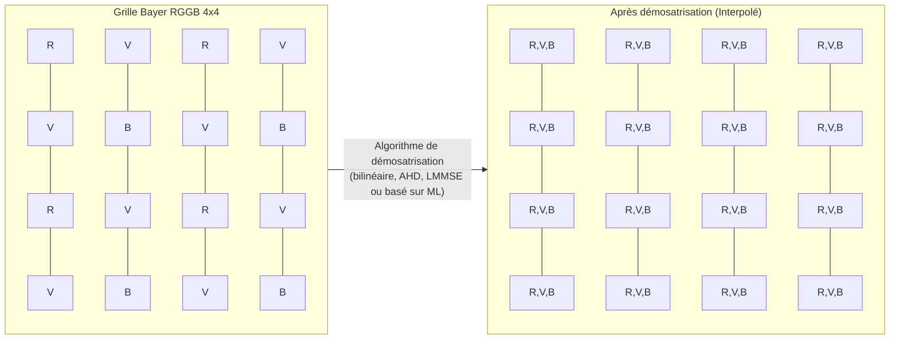
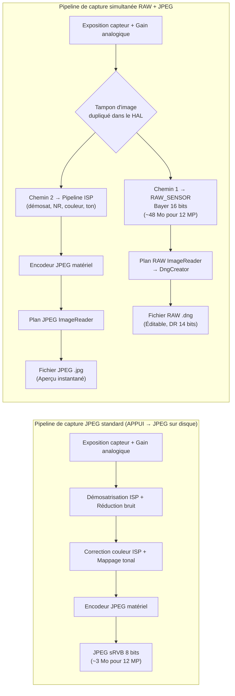

# Chapitre 18 : La photographie RAW

La photographie mobile professionnelle exige plus que les JPEGs traités que l'ISP (Image Signal Processor) d'Android produit par défaut. Lorsque vous capturez un JPEG, les données brutes du capteur ont déjà été filtrées, interpolées, corrigées en couleur, débruitées et mappées en tons — détruisant la majeure partie de la marge de manœuvre de retouche sur laquelle comptent les photographes. L'API Camera2 vous donne un accès direct au format **RAW_SENSOR** : des données de matrice de Bayer non traitées sur 16 bits provenant directement du capteur, avec zéro interférence de l'ISP. Combiné avec **DngCreator**, le framework Android fournit tout ce dont vous avez besoin pour produire des fichiers Adobe DNG (Digital Negative) conformes aux standards qui s'ouvrent directement dans Lightroom, Capture One, Photoshop et tout éditeur RAW professionnel.

Ce chapitre s'appuie sur les recherches documentées dans la section *RAW / DngCreator* de la référence interne du projet, et les étend avec du code pratique que vous pouvez intégrer dans votre propre application. Vous pouvez voir ces capacités énumérées pour chaque appareil supporté dans l'application [Android Camera Parameters](https://github.com/zoozooll/AndroidCameraParameters) — également disponible sur le [Google Play Store](https://play.google.com/store/apps/details?id=com.zoozooll.cameraparameters) — qui rapporte la taille RAW maximale, les variantes RAW disponibles (RAW10, RAW12, RAW14) et si les métadonnées DngCreator sont entièrement renseignées pour chaque ID de caméra.

## Pourquoi le RAW ? Le coût du traitement ISP

Avant de plonger dans les détails de l'API, il est essentiel de comprendre exactement ce que fait l'ISP lorsqu'il produit un JPEG, et pourquoi il est important de le contourner. Un pipeline ISP de smartphone typique applique les étapes suivantes dans l'ordre :

1. **Clamping du niveau de noir** — soustrait la ligne de base du courant d'obscurité du capteur.
2. **Correction de l'ombrage de l'objectif** — supprime le vignettage à l'aide de cartes de gain par pixel.
3. **Démosatrisation (Demosaicing)** — interpole la grille de Bayer à 1 couleur par pixel en une image RVB complète.
4. **Réduction de bruit** — applique un filtrage spatial/temporel qui efface les détails fins en même temps que le bruit.
5. **Correction de couleur** — applique une matrice 3×3 pour mapper l'espace colorimétrique du capteur vers le sRVB.
6. **Gamma / Mappage de tonalité (Tone mapping)** — compresse les 14 paliers linéaires de la scène en une courbe 8 bits non linéaire.
7. **Amélioration des contours** — accentue la netteté pour compenser le filtre passe-bas optique.
8. **Compression JPEG** — applique un sous-échantillonnage de la chrominance avec perte (typiquement 4:2:0) et une quantification.

Le problème de ce pipeline est que chaque étape est **irréversible** et réglée pour les *aperçus* grand public, et non pour le *post-traitement* professionnel. Un JPEG écrête les hautes lumières à des rapports de contraste de 100:1 et enveloppe 14 bits de plage dynamique (DR) du capteur dans 8 bits — ainsi, lorsque vous remontez les ombres de 2 paliers en post-prod, vous obtenez de la postérisation au lieu de détails. Le RAW préserve toute la sortie linéaire du capteur, permettant 4 à 6 paliers de récupération des ombres/hautes lumières et des décalages de balance des blancs personnalisés qui n'introduisent pas d'artefacts colorés.

```mermaid
flowchart TD
    subgraph ISP["Pipeline de traitement ISP (Chemin JPEG)"]
        S1[Données RAW du capteur] --> S2[Clamping niveau noir]
        S2 --> S3[Correction ombrage objectif]
        S3 --> S4[Démosatrisation]
        S4 --> S5[Réduction de bruit]
        S5 --> S6[Correction couleur]
        S6 --> S7[Gamma / Mappage tonalité]
        S7 --> S8[Amélioration contours]
        S8 --> S9[Compression JPEG]
        S9 --> S10["JPEG sRVB 8 bits<br/>(≈6 paliers de DR utilisables)"]
    end

    subgraph RAW["Chemin RAW (Pas de traitement ISP)"]
        R1[Données RAW du capteur] --> R2["Matrice de Bayer linéaire 16 bits<br/>(10–14 paliers de DR utilisables)"]
        R2 --> R3["DngCreator écrit<br/>Métadonnées + Pixels"]
        R3 --> R4["Fichier .dng<br/>Éditable dans Lightroom/PS"]
    end
```



Comparez visuellement les deux chemins ci-dessus : le chemin JPEG dépouille les données à chaque étape, tandis que le chemin RAW préserve l'intégralité de la charge utile du capteur. Le compromis est que les fichiers RAW **ne sont pas directement affichables** — ils nécessitent une passe de rendu séparée (l'étape de "développement" dans Lightroom) pour interpréter la grille de Bayer et la convertir dans un espace colorimétrique comme le sRVB ou le Rec.2020.

## La matrice de filtres colorés de Bayer

Les données RAW ne sont pas RVB. Chaque photosite sur le capteur n'enregistre qu'**une seule couleur** — rouge, vert ou bleu — car une photodiode au silicium est elle-même aveugle aux couleurs et ne peut mesurer que le nombre de photons (luminance). Pour reconstruire la couleur, les fabricants déposent une **matrice de filtres colorés (CFA - Color Filter Array)** sur le capteur, et la grille monocanal résultante porte le nom de son inventeur : la matrice de Bayer.

Quatre dispositions de CFA courantes existent dans les appareils Android, identifiées par l'ordre du pavé 2×2 en haut à gauche :

| Motif | Disposition du pavé | Cas d'utilisation typique |
|-------|---------------------|---------------------------|
| **RGGB** | `R V / V B` | La plupart des smartphones (Défaut Samsung, Sony Exmor RS) |
| **BGGR** | `B V / V R` | Capteurs Sony IMX dans certains appareils Xiaomi/OnePlus |
| **GRBG** | `V R / B V` | Certains capteurs OmniVision |
| **GBRG** | `V B / R V` | Rare ; trouvé dans certains appareils milieu de gamme Motorola |

La caractéristique la plus frappante de la grille de Bayer est que **50 % des pixels sont verts**, tandis que le rouge et le bleu en reçoivent chacun 25 %. Ce n'est pas un choix arbitraire — la réponse de luminance photopique de l'œil humain culmine dans les longueurs d'onde vertes (environ 555 nm), donc consacrer deux fois plus d'échantillons au vert maximise la netteté perçue et les performances en termes de bruit. Le canal de luminance de tout JPEG résultant est dérivé à environ 60 % des photosites verts, donc la densité d'échantillonnage du vert se traduit directement en détails résolus.



Le bloc de démosatrisation ci-dessus (P11–P44) montre comment chaque pixel est reconstruit : un photosite `R` utilise les valeurs `V` et `B` de ses voisins via interpolation, et vice versa. Cette interpolation est la plus grande source d'adoucissement de l'image dans le pipeline JPEG — et c'est exactement pourquoi vous voulez le faire vous-même en post-production, où la démosatrisation moderne par IA (IA Enhance de Lightroom, Topaz DeNoise AI, etc.) peut fournir des résultats plus nets que l'ISP matériel en temps réel du smartphone.

## Format RAW_SENSOR et variantes compactées (RAW10 / RAW12 / RAW14)

L'identifiant de format RAW canonique d'Android est `ImageFormat.RAW_SENSOR`, qui s'énumère comme un tampon de 16 bits par pixel stocké dans le `Plane` renvoyé par `Image.getPlanes()`. Cependant, la profondeur de bits *effective* dépend de l'appareil et est rapportée via `CameraCharacteristics.SENSOR_INFO_BIT_DEPTH` — les bits supérieurs au-delà de la résolution réelle de l'ADC du capteur sont complétés par des zéros.

La plupart des smartphones contemporains utilisent l'une des trois variantes RAW compactées, qui sont exposées via `StreamConfigurationMap.getOutputSizes()` avec des constantes de format dédiées :

| Constante de format | Bits/échantillon | Disposition de stockage | Génération de capteur typique |
|---------------------|------------------|-------------------------|-------------------------------|
| **RAW10** | 10 | Compacté : 4 échantillons pour 5 octets (aligné MSB) | Capteurs milieu de gamme 2019–2022 (ex: IMX586, IMX682) |
| **RAW12** | 12 | Compacté : 2 échantillons pour 3 octets | Fleurons 2021–2024 (ex: IMX800, IMX989 type 1 pouce) |
| **RAW14** | 14 | 16 bits avec padding (aligné MSB) | Capteurs de catégorie professionnelle / 1 pouce+ (IMX989 avec DOL-HDR) |

Les formats compactés sont la raison pour laquelle vous **devez utiliser `Buffer.getByte()` / `Buffer.getShort()` en tenant compte du pas de pixel (pixel stride)**, plutôt que de traiter le tampon RAW comme un simple tableau de `short[]` — les échantillons RAW10 et RAW12 franchissent les limites des octets et nécessitent des décalages de bits pour être extraits. `DngCreator` gère tout ce compactage/décompactage de manière transparente si vous passez directement l'objet `Image`, ce qui est l'approche recommandée.

## DNG : Standard Adobe Digital Negative 1.4

Pourquoi écrire des fichiers `.dng` au lieu d'un format propriétaire comme `.arw` (Sony) ou `.cr3` (Canon) ? Parce que le **DNG est le seul format RAW universel**, publié sous la norme ISO 12234-2 et accepté par toute la chaîne d'outils photo professionnelle. Le DNG v1.4 (la version ciblée par Android) spécifie :

- Un conteneur compatible TIFF/EP (structure IFD little-endian).
- Des balises TIFF obligatoires pour le motif CFA, les niveaux de noir et les matrices de couleur.
- Un `ColorMatrix2` / `CalibrationIlluminant2` optionnel pour les profils à double illuminant.
- Une carte d'ombrage d'objectif optionnelle (balise 0xC618) pour la correction du champ plat par pixel.
- Un IFD "makernotes" optionnel pour les données d'étalonnage spécifiques à l'OEM.

Sans ces métadonnées, un tampon RAW n'est qu'une grille de nombres sans étiquette — aucun éditeur RAW ne pourrait le rendre correctement. La classe `DngCreator` du package `android.hardware.camera2` d'Android est conçue pour remplir **toutes les métadonnées DNG 1.4 requises automatiquement** à partir des `CameraCharacteristics` et du `CaptureResult`, ce qui signifie que votre application n'a pas besoin d'embarquer des données d'étalonnage du capteur pour chaque appareil.

Les champs de métadonnées spécifiques que `DngCreator` écrit incluent :

| Balise DNG | Source | But |
|------------|--------|-----|
| **BlackLevel** (SENSOR_BLACK_LEVEL_PATTERN) | `CameraCharacteristics` | Ligne de base du courant d'obscurité par canal (4 éléments). |
| **ColorMatrix1 / ColorMatrix2** (SENSOR_COLOR_TRANSFORM1 / 2) | `CameraCharacteristics` | Matrices 3×3 mappant le RVB du capteur → XYZ à l'Illuminant A (D65). |
| **CalibrationIlluminant1 / 2** | `CameraCharacteristics` | Enum d'illuminant standard (17 = Standard A, 21 = D65). |
| **ForwardMatrix1 / ForwardMatrix2** (SENSOR_FORWARD_MATRIX1 / 2) | `CameraCharacteristics` | Transformation inverse XYZ → RVB du capteur. |
| **NeutralColorPoint** (SENSOR_NEUTRAL_COLOR_POINT) | `CameraCharacteristics` | Balance des blancs native (ratios r/v, b/v). |
| **LensShadingMap** (STATISTICS_LENS_SHADING_MAP) | `CaptureResult` | Grille de gain par canal (4 canaux) pour la suppression du vignettage. |
| **CFA Pattern 2** | `CameraCharacteristics.SENSOR_INFO_COLOR_FILTER_ARRANGEMENT` | Encodage du pavé de Bayer. |
| **BaselineExposure** | `SENSOR_REFERENCE_ILLUMINANT1` | Décalage d'exposition par défaut à appliquer lors du rendu. |

Cette liste est tirée directement de la spécification *RAW / DngCreator* du document de recherche du projet. Si l'un de ces champs est rapporté comme `null` par l'API Camera2, `DngCreator` produira toujours un DNG valide mais le fichier résultant pourra nécessiter un étalonnage manuel en post-prod. Vous pouvez vérifier quels champs sont renseignés pour chaque ID de caméra en utilisant l'application Android Camera Parameters.

## Configuration de la capture simultanée RAW + JPEG

Le flux de travail correct pour la capture RAW utilise **plusieurs cibles de sortie dans une seule `CaptureRequest`** — cela garantit que le tampon RAW et le JPEG proviennent de la *même image exacte* (horodatage identique, exposition du capteur identique), ce qui est essentiel pour les flux de travail de sauvegarde RAW+JPEG auxquels la plupart des photographes s'attendent. Tenter deux captures séquentielles introduit une variabilité d'une image à l'autre dans l'exposition, l'AF et l'AWB.

### Étape 1 : Interroger les capacités et la taille RAW maximale

```kotlin
import android.hardware.camera2.CameraCharacteristics
import android.hardware.camera2.params.StreamConfigurationMap
import android.util.Size
import android.graphics.ImageFormat

fun getRawCapabilities(cameraId: String,
                       characteristics: CameraCharacteristics): Pair<Boolean, Size?> {
    val caps = characteristics.get(
        CameraCharacteristics.REQUEST_AVAILABLE_CAPABILITIES
    ) ?: intArrayOf()
    val supportsRaw = caps.contains(
        CameraCharacteristics.REQUEST_AVAILABLE_CAPABILITIES_RAW
    )
    if (!supportsRaw) return Pair(false, null)

    val configMap: StreamConfigurationMap? =
        characteristics.get(CameraCharacteristics.SCALER_STREAM_CONFIGURATION_MAP)

    val rawSizes = configMap?.getOutputSizes(ImageFormat.RAW_SENSOR)
        ?: emptyArray()
    val maxRawSize = rawSizes.maxByOrNull { it.width * it.height }

    return Pair(true, maxRawSize)
}
```

`REQUEST_AVAILABLE_CAPABILITIES_RAW` est la porte de sortie obligatoire — si elle n'est pas définie, le HAL refusera toute sortie RAW_SENSOR, et tenter de créer un `ImageReader` avec ce format lèvera une `IllegalArgumentException`. L'application Android Camera Parameters liste cette capacité par ID de caméra sur son tableau de bord principal.

### Étape 2 : Créer deux ImageReaders (RAW + JPEG)

```kotlin
import android.media.ImageReader
import android.graphics.ImageFormat

private var rawImageReader: ImageReader? = null
private var jpegImageReader: ImageReader? = null

fun setupDualImageReaders(rawSize: Size, jpegSize: Size) {
    rawImageReader = ImageReader.newInstance(
        rawSize.width,
        rawSize.height,
        ImageFormat.RAW_SENSOR,
        5 // Profondeur du tampon d'acquisition : >= 2, 5 permet de la marge pour la rafale
    ).apply {
        setOnImageAvailableListener(
            OnRawImageAvailableListener(),
            backgroundHandler
        )
    }

    jpegImageReader = ImageReader.newInstance(
        jpegSize.width,
        jpegSize.height,
        ImageFormat.JPEG,
        2
    ).apply {
        setOnImageAvailableListener(
            OnJpegImageAvailableListener(),
            backgroundHandler
        )
    }
}
```

La profondeur du tampon `maxImages` pour le RAW doit être plus importante (5) car les tampons RAW consomment 2 à 4 fois plus de bande passante que le JPEG, et le HAL peut délivrer 2 à 3 images avant que l'écrivain disque ne rattrape le retard. Manquer d'espace de tampon RAW provoque des pertes d'images silencieuses sans rappel d'erreur.

### Étape 3 : Créer une CaptureSession avec les deux surfaces et émettre une capture multi-cibles

```kotlin
import android.hardware.camera2.CameraDevice
import android.hardware.camera2.CaptureRequest
import android.view.Surface

lateinit var cameraDevice: CameraDevice

fun createCaptureSessionAndCapture(
    rawSurface: Surface,
    jpegSurface: Surface,
    previewSurface: Surface
) {
    val outputSurfaces = listOf(previewSurface, rawSurface, jpegSurface)

    cameraDevice.createCaptureSession(
        outputSurfaces,
        object : CameraCaptureSession.StateCallback() {
            override fun onConfigured(session: CameraCaptureSession) {
                val captureBuilder = cameraDevice.createCaptureRequest(
                    CameraDevice.TEMPLATE_STILL_CAPTURE
                ).apply {
                    addTarget(previewSurface)
                    addTarget(rawSurface)
                    addTarget(jpegSurface)

                    set(CaptureRequest.CONTROL_AF_MODE,
                        CaptureRequest.CONTROL_AF_MODE_CONTINUOUS_PICTURE)
                    set(CaptureRequest.CONTROL_AE_MODE,
                        CaptureRequest.CONTROL_AE_MODE_ON)
                    set(CaptureRequest.CONTROL_AWB_MODE,
                        CaptureRequest.CONTROL_AWB_MODE_OFF) // Verrouiller l'AWB en RAW !
                }

                session.capture(
                    captureBuilder.build(),
                    RawCaptureCallback(),
                    backgroundHandler
                )
            }
            override fun onConfigureFailed(session: CameraCaptureSession) = Unit
        },
        backgroundHandler
    )
}
```

Trois détails ici sont non négociables :

1. **L'AWB doit être verrouillé (`CONTROL_AWB_MODE_OFF`) pour les captures RAW.** Si l'AWB reste activé, le HAL appliquera une rampe de gain RVB en pleine rafale, ce qui signifie que chaque image RAW aura une balance des blancs native différente — ce qui empêche les éditeurs RAW d'appliquer un profil uniforme. Utilisez plutôt `CaptureResult.SENSOR_NEUTRAL_COLOR_POINT` pour dériver la bonne balance des blancs en post-prod.

2. **Utilisez `TEMPLATE_STILL_CAPTURE`** comme modèle de base. Il configure le capteur pour le mode de lecture de la plus haute qualité et désactive la réduction de bruit spécifique à l'aperçu que le HAL pourrait sinon injecter.

3. **Les trois cibles (aperçu, RAW, JPEG) sont dans une seule `CaptureRequest`.** Le HAL garantit une livraison coïncidente dans le temps.

### Étape 4 : Utiliser DngCreator pour écrire le fichier DNG

Le rappel `OnImageAvailableListener` reçoit des objets `Image` à partir desquels les données de pixels RAW sont déjà accessibles. Passez l' `Image` *et* le `CaptureResult` correspondant à `DngCreator`, ainsi que les `CameraCharacteristics` originales utilisées pour ouvrir la caméra — cette combinaison est requise pour remplir correctement toutes les métadonnées DNG 1.4.

```kotlin
import android.hardware.camera2.CameraCharacteristics
import android.hardware.camera2.CaptureResult
import android.hardware.camera2.DngCreator
import android.media.Image
import java.io.File
import java.io.FileOutputStream
import java.io.IOException

inner class OnRawImageAvailableListener : ImageReader.OnImageAvailableListener {
    private val pendingDngWrites =
        HashMap<Long, CaptureResult>() // horodatage → CaptureResult

    fun registerCaptureResult(timestamp: Long, result: CaptureResult) {
        pendingDngWrites[timestamp] = result
    }

    override fun onImageAvailable(reader: ImageReader) {
        var image: Image? = null
        try {
            image = reader.acquireLatestImage() ?: return
            val timestamp = image.timestamp

            val captureResult = pendingDngWrites.remove(timestamp) ?: return
            val characteristics = latestCameraCharacteristics ?: return

            val dngFile = File(
                getExternalFilesDir(null),
                "RAW_${System.currentTimeMillis()}.dng"
            )

            FileOutputStream(dngFile).use { fos ->
                val dngCreator = DngCreator(characteristics, captureResult)
                dngCreator.writeByteBuffer(
                    fos,
                    image.width,
                    image.height,
                    image.planes[0].buffer,
                    0 // padding, toujours 0 pour RAW_SENSOR
                )
            }

        } catch (e: IOException) {
            Log.e(TAG, "Échec de l'écriture du fichier DNG", e)
        } catch (e: IllegalStateException) {
            Log.e(TAG, "DngCreator a rejeté les métadonnées (champ requis manquant)", e)
        } finally {
            image?.close() // CRITIQUE : ne JAMAIS faire fuiter les références d'Image
        }
    }
}
```

Le constructeur de `DngCreator` prend exactement deux arguments :
- **`CameraCharacteristics`** — champs statiques par caméra (niveaux de noir, matrices de couleur, motif CFA, point de couleur neutre, illuminants 1&2).
- **`CaptureResult`** — champs dynamiques par image (exposition du capteur, ISO, carte d'ombrage de l'objectif, position de l'objectif AF).

Si l'un est `null` ou si un champ de métadonnées requis est manquant (ex : certains appareils budget rapportent `null` pour `SENSOR_COLOR_TRANSFORM1`), le constructeur lèvera une `IllegalArgumentException` au moment de la construction (pas lors de `writeByteBuffer`). C'est pourquoi l'application Android Camera Parameters rapporte explicitement chaque champ pertinent pour le DNG : les développeurs peuvent pré-filtrer les appareils pour éviter les plantages sur les appareils ayant des implémentations de HAL incomplètes.

La carte d'horodatage `pendingDngWrites` résout un réel problème de concurrence : `CaptureResult.CaptureCallback.onCaptureCompleted()` se déclenche **avant ou après** `OnImageAvailableListener.onImageAvailable()` (selon le HAL). Faire correspondre par `image.timestamp` == `CaptureResult.SENSOR_TIMESTAMP` garantit que les bonnes métadonnées sont associées au bon tampon de pixels.

## Comparaison des pipelines de traitement (Détail Mermaid)



L'enseignement clé de ce diagramme est le **nœud de duplication d'image G** : le HAL lit une image du capteur, puis envoie une copie non modifiée vers la sortie RAW tout en envoyant la *même* copie dans l'ISP pour l'encodage JPEG. Cela garantit la parité des images sans doubler la bande passante de lecture du capteur.

## Considérations de performance et limites pratiques

L'écriture de fichiers DNG de 12 à 48 Mo sur le stockage flash prend un temps mesurable :
- Stockage UFS 3.1 : ~250 Mo/s en écriture séquentielle → un DNG de 12 MP (~48 Mo) prend environ 190 ms.
- Stockage eMMC 5.1 : ~120 Mo/s en écriture séquentielle → le même fichier prend environ 400 ms.

Cela signifie que vous **ne pouvez pas bloquer le thread UI lors des écritures DNG** — exécutez toujours `writeByteBuffer` sur un thread d'arrière-plan/Handler, et fermez toujours l' `Image` dans un bloc `finally` pour éviter la saturation des tampons du HAL.

Une autre contrainte importante : tous les appareils ne supportent pas le RAW + JPEG dans la même session, même si `CAPABILITIES_RAW` est défini. La manière correcte de vérifier est `StreamConfigurationMap.isOutputSupportedFor(surfaceList)` avec les deux surfaces dans la liste. Si cela renvoie `false`, repliez-vous sur des sessions RAW uniquement.

## Résumé

Ce chapitre a couvert l'intégralité du flux de travail de la photographie RAW dans Android Camera2 :

- **Le format RAW_SENSOR** délivre la grille de Bayer 16 bits non traitée du capteur, en contournant chaque étape de traitement de l'ISP.
- **Les matrices de Bayer** (RGGB, BGGR, GRBG, GBRG) allouent 50 % des photosites au vert pour un échantillonnage de luminance optimisé pour la vision humaine.
- **Les variantes compactées** — RAW10, RAW12, RAW14 — stockent les échantillons à la profondeur de bits native de l'ADC ; `DngCreator` les décompacte de manière transparente.
- **Le DNG v1.4** est le conteneur RAW universel. `DngCreator(characteristics, result).writeByteBuffer(...)` remplit toutes les métadonnées requises : niveaux de noir, matrices de couleur, carte d'ombrage d'objectif, point de couleur neutre et illuminants de calibration 1 & 2.
- **Les CaptureRequests multi-cibles** dirigent la même image vers les ImageReaders RAW et JPEG, garantissant la parité des images pour les flux RAW+JPEG.
- **La correspondance d'horodatage** entre `CaptureResult` et `Image` est requise car les rappels se déclenchent dans un ordre dépendant du HAL.

## Et ensuite ?

Dans le chapitre suivant, nous passons de la photographie fixe à la vidéo avec le **Chapitre 19 : Vidéo haute vitesse**, où nous utilisons `CameraConstrainedHighSpeedCaptureSession` pour réaliser des captures à 120 fps (ralenti 4×) et 240 fps (ralenti 8×). Vous apprendrez pourquoi les sessions haute vitesse nécessitent `createHighSpeedRequestList` au lieu de CaptureRequests individuelles, et comment le pipeline haute vitesse dédié du HAL contourne le chemin d'aperçu normal pour fournir des fréquences d'images qui seraient sinon trop gourmandes en CPU.

Vous pouvez valider les capacités RAW de votre appareil, la taille RAW maximale et l'exhaustivité des métadonnées DngCreator en installant l'application [Android Camera Parameters](https://play.google.com/store/apps/details?id=com.zoozooll.cameraparameters) — et contribuer en envoyant des rapports d'appareils sur le [dépôt GitHub](https://github.com/zoozooll/AndroidCameraParameters) open-source pour aider d'autres développeurs à savoir quels appareils supportent les flux de travail RAW professionnels.
