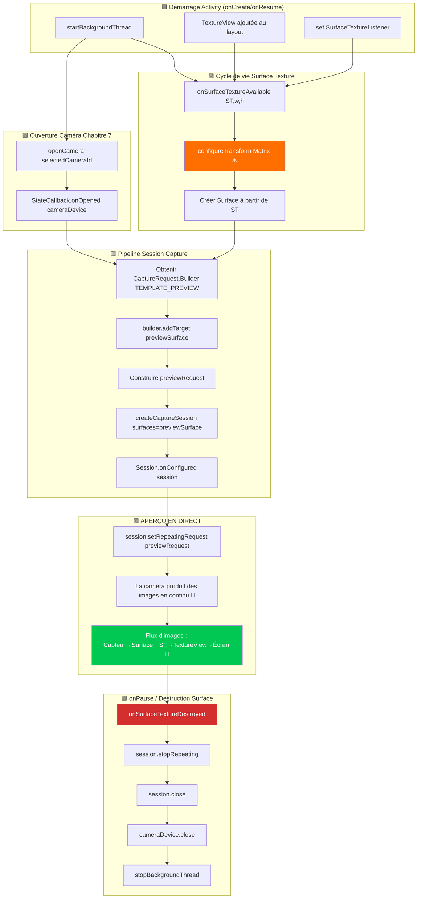

C'est le chapitre que vous attendiez. Après trois chapitres consacrés à la construction de l'échafaudage (autorisations, threading, CameraManager, énumération, cycle de vie d'ouverture/fermeture), vous allez enfin **voir la sortie de la caméra s'afficher en direct sur l'écran de l'appareil Android**. L'aperçu est l'âme d'une application de caméra — c'est ce que l'utilisateur regarde pour cadrer une prise de vue, vérifier la mise au point et l'exposition avant d'appuyer sur l'obturateur. Le réussir fait la différence entre une application saccadée, inutilisable, et une expérience de caméra fluide et réactive.

Pour une implémentation d'aperçu de référence qui gère les cas particuliers sur des centaines d'appareils, consultez l'écran d'aperçu de l'application **Android Camera Parameters** ([GitHub](https://github.com/zoozooll/AndroidCameraParameters) / [Google Play](https://play.google.com/store/apps/details?id=com.minininja.cameraparams)). Son pipeline d'aperçu inclut des transformations respectant l'orientation, des surfaces de sortie multi-résolution et une limitation fluide de la fréquence d'images — le tout construit sur les mêmes composants fondamentaux que nous couvrons ici.

## Le pipeline d'aperçu : Vue d'ensemble des composants

Avant de plonger dans le code, traçons le voyage conceptuel d'une seule image d'aperçu depuis le capteur de la caméra jusqu'à l'écran du téléphone. Chaque image passe par cinq couches :

```
Capteur caméra → Pipeline CameraDevice → Surface (BufferQueue) → SurfaceTexture → TextureView → Écran
```

Chaque couche joue un rôle spécifique et non interchangeable. En sauter ou en court-circuiter une produit des écrans noirs, des rapports hauteur/largeur déformés ou des déchirements d'image. Définissons chaque composant :

### 1. Surface — Le tampon de destination de l'image

Une `Surface` est le concept générique de l'API Camera2 pour **une destination pour les images traitées**. Sous le capot, une Surface enveloppe une `BufferQueue` Android : une file d'attente circulaire de tampons graphiques (généralement de 3 à 5 tampons) gérée par le compositeur du système (SurfaceFlinger). Lorsque Camera2 "rend une image" sur une Surface, il retire un tampon vide de la file d'attente, le remplit avec des données de pixels et l'enfile à nouveau pour que le consommateur puisse l'utiliser.

Tout ce qui peut consommer des tampons graphiques peut exposer une `Surface`. Les consommateurs les plus courants sont :
- **SurfaceTexture** → alimente une `TextureView` (pour l'aperçu à l'écran — ce chapitre)
- **Surface d'un MediaRecorder/MediaCodec** → encodage vidéo (non couvert dans cette série)
- **Surface d'ImageReader** → objets `Image` accessibles par le CPU pour la capture JPEG/RAW (Chapitre 9)

### 2. SurfaceTexture — Le pont GPU-vers-GPU

`SurfaceTexture` est la classe magique qui transforme un flux brut d'images de caméra en une texture que le GPU peut échantillonner et rendre. C'est l'extrémité "consommateur" de la BufferQueue de la Surface, mais au lieu de remettre des tampons au CPU, elle les convertit en une texture OpenGL ES `GL_TEXTURE_EXTERNAL_OES`. Cela permet à `TextureView` de composer l'image de la caméra sur la hiérarchie des vues en utilisant le rendu GPU standard — aucune copie CPU n'est requise, ce qui permet d'atteindre facilement un aperçu de plus de 60 FPS.

Vous obtenez une `Surface` pour une `SurfaceTexture` avec :
```kotlin
val surface = Surface(surfaceTexture)
```

### 3. TextureView — La fenêtre à l'écran

`TextureView` est une sous-classe de `View` qui peut afficher le contenu d'une `SurfaceTexture`. C'est le successeur moderne de l'ancienne `SurfaceView`, et le choix recommandé pour l'aperçu Camera2 pour trois raisons :
- Elle se comporte comme une `View` normale (peut être animée, transformée, mélangée par alpha, placée dans des conteneurs défilants).
- Elle ne force pas l'Activity à utiliser une fenêtre transparente (contrairement à `SurfaceView`, qui perce un "trou" dans la hiérarchie des vues).
- Son `SurfaceTextureListener` nous donne des rappels précis sur le cycle de vie pour savoir quand la surface est créée, détruite ou redimensionnée.

Pour obtenir un accès piloté par des rappels à la `SurfaceTexture` sous-jacente, `TextureView` expose `setSurfaceTextureListener()` avec quatre rappels :
- `onSurfaceTextureAvailable(surfaceTexture, width, height)` — la surface est prête à recevoir des images (déclenché une fois lors de la mise en page de la vue).
- `onSurfaceTextureSizeChanged(surfaceTexture, width, height)` — la taille de la surface a changé (ex: l'appareil a pivoté).
- `onSurfaceTextureDestroyed(surfaceTexture)` — sur le point d'être détruite ; nous devons arrêter l'aperçu avant que cela ne renvoie.
- `onSurfaceTextureUpdated(surfaceTexture)` — déclenché pour **chaque nouvelle image** (peut être utilisé pour piloter des superpositions de suivi de visage, etc.).

### 4. CameraCaptureSession — Le pipeline configuré

Avant qu'un `CameraDevice` puisse produire des images, vous devez créer une `CameraCaptureSession`. Une session est une **configuration de toutes les surfaces de sortie sur lesquelles le pipeline de la caméra va écrire**. Vous pouvez la voir comme la "plomberie" de l'ISP (Processeur de signal d'image) de la caméra pour diriger sa sortie vers un ou plusieurs récepteurs. Pour l'aperçu seul, la session a une seule Surface (celle de la TextureView). Lorsque nous ajouterons la capture photo au Chapitre 9, la session aura deux Surfaces : l'aperçu + l'`ImageReader`.

Règles clés :
- Une session est créée avec `CameraDevice.createCaptureSession(outputSurfaces, stateCallback, handler)`.
- La session n'est utilisable **qu'après** le déclenchement de `StateCallback.onConfigured(session)`.
- Un `CameraDevice` ne peut avoir qu'**une seule session active à la fois**. Créer une nouvelle session ferme la précédente.
- La session possède *toutes* les sorties pendant sa durée de vie ; ajouter une nouvelle surface (ex: décider soudainement d'enregistrer une vidéo) nécessite de démonter l'ancienne session et d'en créer une nouvelle avec toutes les surfaces (aperçu + enregistreur).

### 5. Requête de capture répétée (TEMPLATE_PREVIEW)

Une fois la session configurée, comment l'aperçu continu se produit-il ? Camera2 est une API pilotée par des requêtes — chaque image est une `CaptureRequest` soumise à la session. Pour l'aperçu, nous soumettons **une requête et la marquons comme répétée** : le matériel de la caméra réexécutera cette même requête (avec les mêmes réglages de capteur, cibles et état 3A) en continu, produisant des images aussi vite que le pipeline le permet (généralement 30 à 120 FPS).

Une requête répétée est soumise avec :
```kotlin
session.setRepeatingRequest(previewRequest, captureCallback, backgroundHandler)
```

Le modèle pour l'aperçu est `CameraDevice.TEMPLATE_PREVIEW`. Camera2 fournit plusieurs modèles pré-intégrés qui configurent de manière appropriée des centaines de paramètres de bas niveau (exposition, plage de fréquence d'images, mode 3A, réduction du bruit, etc.) pour le cas d'utilisation. Pour l'aperçu, `TEMPLATE_PREVIEW` optimise pour une **faible latence et une fréquence d'images fluide**, même si cela signifie une plage dynamique du capteur légèrement réduite par rapport à `TEMPLATE_STILL_CAPTURE` (utilisé au Chapitre 9 pour les photos).

## Diagramme du flux d'aperçu de bout en bout

Le diagramme ci-dessous montre comment tous ces composants se connectent. Suivez-le attentivement lors de la lecture du code — chaque bloc correspond à un appel de fonction réel.



Le bloc surligné en orange (`configureTransform`) et le bloc surligné en vert (APERÇU EN DIRECT) sont les deux étapes les plus critiques. Sautez `configureTransform`, et votre aperçu sera étiré, pivoté ou écrasé. Cablez tout le reste correctement mais oubliez d'appeler `setRepeatingRequest`, et l'écran restera noir sans aucune erreur loguée.

## Étape 1 : Ajouter TextureView au layout XML

Tout d'abord, créez ou mettez à jour `app/src/main/res/layout/activity_main.xml` pour inclure une `TextureView` en plein écran. Nous ajouterons également une superposition `TextView` comme indicateur d'état pour voir la taille de l'aperçu.

```xml
<?xml version="1.0" encoding="utf-8"?>
<FrameLayout xmlns:android="http://schemas.android.com/apk/res/android"
    android:layout_width="match_parent"
    android:layout_height="match_parent">

    <TextureView
        android:id="@+id/textureView"
        android:layout_width="match_parent"
        android:layout_height="match_parent"
        android:layout_gravity="center" />

    <TextView
        android:id="@+id/statusTextView"
        android:layout_width="wrap_content"
        android:layout_height="wrap_content"
        android:layout_gravity="top|center_horizontal"
        android:layout_marginTop="16dp"
        android:background="#80000000"
        android:padding="8dp"
        android:textColor="#FFFFFFFF"
        android:textSize="12sp"
        tools:text="Initialisation de la caméra..." />

</FrameLayout>
```

Pourquoi un `FrameLayout` comme racine ? Parce que l'aperçu est une couche plein écran, et que `FrameLayout` empile les enfants selon un ordre Z (les derniers enfants sont dessinés par-dessus). Plus tard, nous ajouterons une superposition de bouton d'obturateur. La `TextureView` utilise `match_parent` sur les deux dimensions — mais ne vous inquiétez pas, nous utiliserons `configureTransform` ci-dessous pour la cadrer correctement, afin que les pixels eux-mêmes ne soient jamais étirés même si la vue remplit l'écran.

## Étape 2 : configureTransform — L'ingrédient secret pour un rapport hauteur/largeur correct

Si vous ne faites rien et que vous envoyez simplement les images dans une `TextureView` plein écran, l'aperçu sera **étiré**. Pourquoi ? Parce que les capteurs de caméra ont un rapport hauteur/largeur fixe (presque toujours 4:3 pour la capture fixe, parfois 16:9 pour les modes vidéo), et que l'écran du téléphone a un rapport hauteur/largeur différent (souvent ~20:9 sur les fleurons modernes). Si la caméra sort une image d'aperçu de 4032×3024 (4:3) et que la `TextureView` l'étire à 1080×2400 (20:9), les visages paraissent minces et allongés.

La solution est **`configureTransform(viewWidth: Int, viewHeight: Int)`** : une méthode qui calcule une `Matrix` (rotation + mise à l'échelle par recadrage central) et l'applique à la `TextureView`. La matrice fait trois choses :
1. **Pivoter** l'image du nombre de degrés de rotation de l'appareil par rapport à l'orientation naturelle du capteur de la caméra.
2. **Mettre à l'échelle** l'image afin qu'elle remplisse entièrement la `TextureView` tout en conservant son rapport hauteur/largeur (style recadrage central, ou bandes noires si vous préférez).
3. **Recentrer** l'image mise à l'échelle/pivotée afin qu'elle se trouve au milieu de la vue.

C'est la fonction la plus copiée des exemples Android Camera2 officiels — chaque développeur en a besoin, et il est facile de se tromper. Voici la version canonique :

```kotlin
/**
 * Configure la transformation Matrix nécessaire pour `textureView`.
 * Cette méthode doit être appelée après que la taille de l'aperçu de la caméra est déterminée
 * et que la taille de `textureView` est fixée.
 *
 * @param viewWidth  La largeur de `textureView`
 * @param viewHeight La hauteur de `textureView`
 * @param previewSize La taille de l'aperçu sélectionnée par la caméra (largeur, hauteur)
 * @param sensorOrientationDegrees La caractéristique SENSOR_ORIENTATION de la caméra
 * @param deviceDisplayRotationDegrees La rotation de l'écran (0/90/180/270) par rapport au naturel
 */
private fun configureTransform(
    viewWidth: Int,
    viewHeight: Int,
    previewSize: android.util.Size,
    sensorOrientationDegrees: Int,
    deviceDisplayRotationDegrees: Int
) {
    val rotation = when (deviceDisplayRotationDegrees) {
        android.view.Surface.ROTATION_0 -> 0
        android.view.Surface.ROTATION_90 -> 90
        android.view.Surface.ROTATION_180 -> 180
        android.view.Surface.ROTATION_270 -> 270
        else -> return
    }

    val matrix = android.graphics.Matrix()
    val viewRect = android.graphics.RectF(0f, 0f, viewWidth.toFloat(), viewHeight.toFloat())
    val bufferRect = android.graphics.RectF(
        0f,
        0f,
        previewSize.height.toFloat(),
        previewSize.width.toFloat()
    )
    val centerX = viewRect.centerX()
    val centerY = viewRect.centerY()

    // Étape 1 : Tenir compte de la rotation de l'appareil par rapport à l'orientation du capteur
    if (Surface.ROTATION_90 == rotation || Surface.ROTATION_270 == rotation) {
        bufferRect.offset(centerX - bufferRect.centerX(), centerY - bufferRect.centerY())
        matrix.setRectToRect(viewRect, bufferRect, android.graphics.Matrix.ScaleToFit.FILL)
        val scale = maxOf(
            viewHeight.toFloat() / previewSize.height,
            viewWidth.toFloat() / previewSize.width
        )
        matrix.postScale(scale, scale, centerX, centerY)
        matrix.postRotate(
            (90 * (rotation - 2)).toFloat(),
            centerX,
            centerY
        )
    } else if (Surface.ROTATION_180 == rotation) {
        matrix.postRotate(180f, centerX, centerY)
    }

    // Étape 2 : Tenir compte également du montage du capteur par rapport à l'appareil
    val relativeRotation = (sensorOrientationDegrees - rotation + 360) % 360
    if (relativeRotation != 0) {
        matrix.postRotate(relativeRotation.toFloat(), centerX, centerY)
    }

    textureView.setTransform(matrix)
}
```

Un détail clé : `previewSize` est la taille de sortie de la caméra, rapportée comme (largeur, hauteur) dans l'**orientation du capteur**. Les dimensions de la `TextureView` sont dans l'**orientation de l'écran**. L'astuce `RectF` avec inversion de largeur/hauteur (`bufferRect` utilise `previewSize.height` pour la largeur et vice versa) tient compte de cette inversion de coordonnées capteur-vs-écran.

Vous aurez besoin de deux informations de `CameraCharacteristics` pour appeler cela :
- `SENSOR_ORIENTATION` — de combien de degrés le capteur est pivoté par rapport à l'orientation naturelle de l'appareil. Pour les caméras arrière, c'est presque toujours 90°. Pour les caméras frontales, c'est généralement 270° (pour que l'image soit correctement inversée). Lisez-le une fois par caméra lors de la phase de découverte.
- Rotation de l'écran — obtenue via `(getSystemService(Context.WINDOW_SERVICE) as WindowManager).defaultDisplay.rotation` (sur les nouvelles API, utilisez `display?.rotation`).

### Étape 3 : Choisir une taille d'aperçu depuis SCALER_STREAM_CONFIGURATION_MAP

Avant de pouvoir écrire `configureTransform` ou créer une session, nous devons savoir quelle taille d'aperçu la caméra peut produire. Pour chaque caméra, `CameraCharacteristics.SCALER_STREAM_CONFIGURATION_MAP` renvoie une `StreamConfigurationMap` contenant toutes les paires (format, taille) valides que la caméra peut produire. Pour l'aperçu sur une `SurfaceTexture`, nous interrogeons les tailles de sortie par rapport à la classe `SurfaceTexture::class.java` :

```kotlin
private fun chooseOptimalPreviewSize(
    characteristics: CameraCharacteristics,
    maxWidth: Int,
    maxHeight: Int,
    targetAspectRatio: Double
): android.util.Size {
    val map = characteristics.get(CameraCharacteristics.SCALER_STREAM_CONFIGURATION_MAP)
        ?: throw IllegalStateException("Aucune carte de configuration de flux disponible")

    // Toutes les tailles supportées pour la sortie SurfaceTexture (classe preview)
    val choices = map.getOutputSizes(SurfaceTexture::class.java).toList()

    // Préférer les tailles qui correspondent au rapport hauteur/largeur, puis celles qui rentrent 
    // dans les dimensions max, puis choisir la plus grande (meilleure qualité) parmi les restantes.
    val acceptable = choices.filter {
        it.width <= maxWidth
            && it.height <= maxHeight
            && Math.abs(it.width.toDouble() / it.height - targetAspectRatio) < 0.02
    }

    val chosen = acceptable.ifEmpty { choices }
        .maxByOrNull { it.width * it.height }!!

    Log.d(TAG, "Taille d'aperçu sélectionnée : ${chosen.width}x${chosen.height} " +
        "(parmi ${choices.size} options, maxAutorisé=${maxWidth}x${maxHeight})")
    return chosen
}
```

Paramètres par défaut de bon sens : `maxWidth = 1920`, `maxHeight = 1080`, `targetAspectRatio = textureView.width.toDouble() / textureView.height`. La surface d'aperçu n'a pas besoin d'être en 4K — le 1080p est suffisant pour le cadrage sur un écran de téléphone, consomme moins d'énergie et maintient la latence du pipeline à un niveau bas.

## Étape 4 : Code complet du Chapitre 8 — Aperçu en direct

Voici le code complet de `MainActivity.kt` intégrant chaque élément de ce chapitre : la `TextureView` basée sur le layout, le `SurfaceTextureListener`, la sélection de la taille, `configureTransform`, la création de la `CameraCaptureSession` et le très important `setRepeatingRequest(TEMPLATE_PREVIEW)`.

```kotlin
package com.example.camera2tutorial

import android.Manifest
import android.content.Context
import android.content.pm.PackageManager
import android.graphics.Matrix
import android.graphics.RectF
import android.graphics.SurfaceTexture
import android.hardware.camera2.CameraAccessException
import android.hardware.camera2.CameraCharacteristics
import android.hardware.camera2.CameraCaptureSession
import android.hardware.camera2.CameraDevice
import android.hardware.camera2.CameraManager
import android.hardware.camera2.CaptureRequest
import android.hardware.camera2.params.StreamConfigurationMap
import android.os.Bundle
import android.os.Handler
import android.os.HandlerThread
import android.util.Log
import android.util.Size
import android.view.Surface
import android.view.TextureView
import android.view.WindowManager
import android.widget.TextView
import android.widget.Toast
import androidx.appcompat.app.AppCompatActivity
import androidx.core.app.ActivityCompat
import androidx.core.content.ContextCompat
import java.util.Collections
import java.util.concurrent.Semaphore
import java.util.concurrent.TimeUnit
import kotlin.math.max
import kotlin.math.min

class MainActivity : AppCompatActivity() {

    // UI
    private lateinit var textureView: TextureView
    private lateinit var statusTextView: TextView

    // Threading
    private lateinit var backgroundThread: HandlerThread
    private lateinit var backgroundHandler: Handler

    // Caméra
    private lateinit var cameraManager: CameraManager
    private var cameraDevice: CameraDevice? = null
    private var captureSession: CameraCaptureSession? = null
    private var previewRequestBuilder: CaptureRequest.Builder? = null
    private var previewRequest: CaptureRequest? = null
    private var selectedCameraId: String? = null
    private var sensorOrientation = 0
    private lateinit var previewSize: Size

    private val cameraOpenCloseLock = Semaphore(1)

    // ------------------------- Cycle de vie -------------------------
    override fun onCreate(savedInstanceState: Bundle?) {
        super.onCreate(savedInstanceState)
        setContentView(R.layout.activity_main)

        textureView = findViewById(R.id.textureView)
        statusTextView = findViewById(R.id.statusTextView)
        statusTextView.text = "Attente de la mise en page de TextureView..."

        if (allPermissionsGranted()) {
            initializeCameraManager()
        } else {
            ActivityCompat.requestPermissions(
                this, REQUIRED_PERMISSIONS, REQUEST_CODE_PERMISSIONS
            )
        }
    }

    override fun onResume() {
        super.onResume()
        startBackgroundThread()

        if (allPermissionsGranted()) {
            if (!this::cameraManager.isInitialized) initializeCameraManager()
            // Si la vue texture est déjà disponible, ouvrir la caméra et créer la session maintenant
            if (textureView.isAvailable) {
                openCameraAndStartPreview(textureView.width, textureView.height)
            }
        } else {
            ActivityCompat.requestPermissions(
                this, REQUIRED_PERMISSIONS, REQUEST_CODE_PERMISSIONS
            )
        }
    }

    override fun onPause() {
        closeCameraAndPreview()
        stopBackgroundThread()
        super.onPause()
    }

    private fun startBackgroundThread() {
        backgroundThread = HandlerThread("Camera2Background").apply { start() }
        backgroundHandler = Handler(backgroundThread.looper)
    }

    private fun stopBackgroundThread() {
        backgroundThread.quitSafely()
        try { backgroundThread.join(1000) } catch (_: InterruptedException) {}
    }

    // ------------------------- Chapitre 6 condensé : Découverte -------------------------
    data class CameraInfo(val id: String, val facing: Int?, val hwLevel: Int?, val chars: CameraCharacteristics)

    private fun initializeCameraManager() {
        cameraManager = getSystemService(Context.CAMERA_SERVICE) as CameraManager
        val discovered = mutableListOf<CameraInfo>()
        for (id in cameraManager.cameraIdList) {
            val chars = try { cameraManager.getCameraCharacteristics(id) } catch (_: Exception) { continue }
            discovered += CameraInfo(
                id,
                chars.get(CameraCharacteristics.LENS_FACING),
                chars.get(CameraCharacteristics.INFO_SUPPORTED_HARDWARE_LEVEL),
                chars
            )
        }
        val chosen = discovered
            .sortedWith(
                compareByDescending<CameraInfo> { it.facing == CameraCharacteristics.LENS_FACING_BACK }
                    .thenByDescending { it.hwLevel ?: -1 }
            )
            .first()
        selectedCameraId = chosen.id
        sensorOrientation = chosen.chars.get(CameraCharacteristics.SENSOR_ORIENTATION) ?: 90

        Log.d(TAG, "Caméra sélectionnée id=$selectedCameraId, sensorOrientation=$sensorOrientation°")

        // Connecter l'écouteur SurfaceTexture — il déclenchera le démarrage réel de l'aperçu
        textureView.surfaceTextureListener = object : TextureView.SurfaceTextureListener {
            override fun onSurfaceTextureAvailable(st: SurfaceTexture, width: Int, height: Int) {
                Log.d(TAG, "✅ SurfaceTexture disponible : ${width}x$height")
                statusTextView.text = "SurfaceTexture prête — ouverture de la caméra..."
                openCameraAndStartPreview(width, height)
            }
            override fun onSurfaceTextureSizeChanged(st: SurfaceTexture, w: Int, h: Int) {
                if (this@MainActivity::previewSize.isInitialized) {
                    configureTransform(w, h)
                }
            }
            override fun onSurfaceTextureDestroyed(st: SurfaceTexture): Boolean {
                Log.d(TAG, "⛔ SurfaceTexture détruite")
                return true
            }
            override fun onSurfaceTextureUpdated(st: SurfaceTexture) {
                // Appelé à CHAQUE image. Garder le travail ici <1ms. Compter les images pour le FPS si souhaité.
            }
        }
    }

    // ------------------------- Chapitre 7 condensé : openCamera -------------------------
    private val deviceStateCallback = object : CameraDevice.StateCallback() {
        override fun onOpened(camera: CameraDevice) {
            cameraOpenCloseLock.release()
            cameraDevice = camera
            Log.d(TAG, "✅ Caméra ${camera.id} ouverte → création de la session de capture")
            statusTextView.text = "Caméra ouverte — création de la session de capture..."

            // ⬇️ Chapitre 8 : Avec la caméra ouverte ET la SurfaceTexture disponible,
            // nous créons maintenant la session de capture
            createCaptureSession()
        }
        override fun onDisconnected(camera: CameraDevice) {
            cameraOpenCloseLock.release()
            cameraDevice?.close()
            cameraDevice = null
            Log.w(TAG, "Caméra ${camera.id} déconnectée")
        }
        override fun onError(camera: CameraDevice, error: Int) {
            cameraOpenCloseLock.release()
            cameraDevice?.close()
            cameraDevice = null
            val msg = when (error) {
                ERROR_CAMERA_IN_USE -> "Caméra utilisée par une autre application"
                else -> "Erreur caméra $error"
            }
            Toast.makeText(this@MainActivity, msg, Toast.LENGTH_LONG).show()
        }
    }

    // ------------------------- 🎯 CHAPITRE 8 : Pipeline d'aperçu -------------------------
    private fun openCameraAndStartPreview(viewWidth: Int, viewHeight: Int) {
        val camId = selectedCameraId ?: return
        if (ContextCompat.checkSelfPermission(this, Manifest.permission.CAMERA)
            != PackageManager.PERMISSION_GRANTED) return
        if (!cameraOpenCloseLock.tryAcquire(2500, TimeUnit.MILLISECONDS)) {
            Toast.makeText(this, "Délai d'attente du verrou de caméra dépassé", Toast.LENGTH_SHORT).show()
            return
        }

        // 1) Décider de la taille de l'aperçu AVANT d'ouvrir la session
        val chars = cameraManager.getCameraCharacteristics(camId)
        previewSize = chooseOptimalPreviewSize(chars, viewWidth, viewHeight)

        // 2) Appliquer la transformation de correction du rapport hauteur/largeur à TextureView
        configureTransform(viewWidth, viewHeight)

        // 3) Configurer la taille du tampon SurfaceTexture pour CORRESPONDRE à la taille d'aperçu choisie
        textureView.surfaceTexture!!.setDefaultBufferSize(previewSize.width, previewSize.height)

        statusTextView.text = "Taille d'aperçu : ${previewSize.width}×${previewSize.height}"

        // 4) Ouvrir la caméra — la création de la session continue dans onOpened → createCaptureSession()
        try {
            cameraManager.openCamera(camId, deviceStateCallback, backgroundHandler)
        } catch (e: CameraAccessException) {
            cameraOpenCloseLock.release()
            Toast.makeText(this, "Échec de l'ouverture de la caméra : ${e.reason}", Toast.LENGTH_LONG).show()
        }
    }

    /**
     * Crée une CameraCaptureSession dont la seule surface de sortie est la surface d'aperçu de la TextureView.
     * Ensuite, construit une requête TEMPLATE_PREVIEW et démarre la répétition.
     */
    private fun createCaptureSession() {
        val camera = cameraDevice ?: return
        val texture = textureView.surfaceTexture ?: return

        val previewSurface = Surface(texture)
        val outputSurfaces = Collections.singletonList(previewSurface)

        try {
            // Construire le CaptureRequest.Builder TEMPLATE_PREVIEW une fois
            previewRequestBuilder =
                camera.createCaptureRequest(CameraDevice.TEMPLATE_PREVIEW).apply {
                    addTarget(previewSurface)
                }

            // Créer la session de capture
            camera.createCaptureSession(
                outputSurfaces,
                object : CameraCaptureSession.StateCallback() {
                    override fun onConfigured(session: CameraCaptureSession) {
                        captureSession = session
                        previewRequest = previewRequestBuilder!!.build()
                        Log.d(TAG, "✅ CaptureSession configurée → démarrage de l'aperçu répétitif")
                        statusTextView.text = "🎥 APERÇU EN DIRECT : ${previewSize.width}×${previewSize.height}"

                        // ⭐ C'EST LA LIGNE MAGIQUE QUI DÉMARRE L'APERÇU :
                        session.setRepeatingRequest(
                            previewRequest!!,
                            null,  // CaptureCallback est null pour l'aperçu — nous n'avons pas besoin de métadonnées par image
                            backgroundHandler
                        )
                    }

                    override fun onConfigureFailed(session: CameraCaptureSession) {
                        Log.e(TAG, "❌ Échec de la configuration de CaptureSession")
                        Toast.makeText(
                            this@MainActivity,
                            "La session de capture a échoué — aperçu indisponible",
                            Toast.LENGTH_LONG
                        ).show()
                    }

                    override fun onClosed(session: CameraCaptureSession) {
                        // Optionnel : crochet de nettoyage symétrique
                        if (captureSession === session) captureSession = null
                    }
                },
                backgroundHandler
            )
        } catch (e: CameraAccessException) {
            Log.e(TAG, "createCaptureSession a levé une CameraAccessException", e)
        } catch (e: IllegalStateException) {
            Log.e(TAG, "La caméra a été fermée lors de la création de la session", e)
        }
    }

    /**
     * Choisit la plus grande taille d'aperçu qui correspond au rapport hauteur/largeur de la vue
     * et qui rentre dans les dimensions max données.
     */
    private fun chooseOptimalPreviewSize(
        characteristics: CameraCharacteristics,
        viewWidth: Int,
        viewHeight: Int
    ): Size {
        val map: StreamConfigurationMap =
            characteristics.get(CameraCharacteristics.SCALER_STREAM_CONFIGURATION_MAP)
                ?: throw IllegalStateException("StreamConfigurationMap indisponible")

        val viewAspect = max(viewWidth, viewHeight).toDouble() / min(viewWidth, viewHeight)
        val choices = map.getOutputSizes(SurfaceTexture::class.java).toList()

        // Plafond raisonnable pour l'aperçu — inutile d'avoir un flux d'aperçu 4K
        val maxPreviewPixels = 1920 * 1080

        val aspectMatches = choices.filter {
            val szAspect = max(it.width, it.height).toDouble() / min(it.width, it.height)
            kotlin.math.abs(szAspect - viewAspect) < 0.02
                && (it.width * it.height) <= maxPreviewPixels * 2
        }

        val final = aspectMatches.ifEmpty { choices }
            .sortedByDescending { it.width * it.height }
            .first()

        Log.d(TAG, "Choix de la taille d'aperçu : ${final.width}×${final.height} " +
            "(parmi ${choices.size} options, targetAspect=%.2f)".format(viewAspect))
        return final
    }

    /**
     * Applique une Matrix à TextureView afin que les pixels de l'aperçu s'affichent au bon 
     * rapport hauteur/largeur (pas d'étirement) et à la bonne orientation (pas de rotation).
     */
    private fun configureTransform(viewWidth: Int, viewHeight: Int) {
        if (!this::previewSize.isInitialized) return
        val rotation = (getSystemService(Context.WINDOW_SERVICE) as WindowManager)
            .defaultDisplay.rotation
        val matrix = Matrix()
        val viewRect = RectF(0f, 0f, viewWidth.toFloat(), viewHeight.toFloat())
        val bufferRect = RectF(
            0f, 0f,
            previewSize.height.toFloat(),
            previewSize.width.toFloat()
        )
        val cx = viewRect.centerX()
        val cy = viewRect.centerY()
        bufferRect.offset(cx - bufferRect.centerX(), cy - bufferRect.centerY())
        matrix.setRectToRect(viewRect, bufferRect, Matrix.ScaleToFit.FILL)
        val scale = max(
            viewHeight.toFloat() / previewSize.height,
            viewWidth.toFloat() / previewSize.width
        )
        matrix.postScale(scale, scale, cx, cy)
        val rotationDegrees = when (rotation) {
            Surface.ROTATION_0 -> sensorOrientation
            Surface.ROTATION_90 -> 0
            Surface.ROTATION_180 -> 360 - sensorOrientation
            Surface.ROTATION_270 -> 180
            else -> 0
        }
        matrix.postRotate(rotationDegrees.toFloat(), cx, cy)
        textureView.setTransform(matrix)
        Log.d(TAG, "configureTransform appliquée (rotation=$rotationDegrees°, échelle=%.2f)".format(scale))
    }

    // ------------------------- Démontage -------------------------
    private fun closeCameraAndPreview() {
        try {
            cameraOpenCloseLock.acquire()

            captureSession?.apply {
                try {
                    stopRepeating()
                    abortCaptures()
                } catch (_: CameraAccessException) {}
                close()
            }
            captureSession = null

            cameraDevice?.close()
            cameraDevice = null

            Log.d(TAG, "🔒 Aperçu et caméra entièrement démontés")
        } catch (_: InterruptedException) {
        } finally {
            cameraOpenCloseLock.release()
        }
    }

    // ------------------------- Boilerplate -------------------------
    companion object {
        private const val TAG = "Camera2Tutorial"
        private const val REQUEST_CODE_PERMISSIONS = 10
        private val REQUIRED_PERMISSIONS = arrayOf(Manifest.permission.CAMERA)
    }

    private fun allPermissionsGranted() = REQUIRED_PERMISSIONS.all {
        ContextCompat.checkSelfPermission(baseContext, it) == PackageManager.PERMISSION_GRANTED
    }

    override fun onRequestPermissionsResult(
        requestCode: Int, permissions: Array<out String>, grantResults: IntArray
    ) {
        super.onRequestPermissionsResult(requestCode, permissions, grantResults)
        if (requestCode == REQUEST_CODE_PERMISSIONS) {
            if (allPermissionsGranted()) {
                initializeCameraManager()
            } else {
                Toast.makeText(this, "Autorisation de la caméra requise", Toast.LENGTH_LONG).show()
                finish()
            }
        }
    }
}
```

### Les 5 lignes qui démarrent réellement l'aperçu

Sur plus de 350 lignes d'infrastructure, **seulement cinq instructions consécutives** dans le code ci-dessus sont responsables de l'affichage effectif des images sur l'écran :

```kotlin
// Ligne A : Construire une requête TEMPLATE_PREVIEW ciblant la Surface d'aperçu
previewRequestBuilder = camera.createCaptureRequest(CameraDevice.TEMPLATE_PREVIEW).apply {
    addTarget(previewSurface)
}

// Ligne B : Créer la session de capture avec la surface d'aperçu comme sortie
camera.createCaptureSession(outputSurfaces, object : CameraCaptureSession.StateCallback() {
    override fun onConfigured(session: CameraCaptureSession) {
        // Ligne C : Construire la CaptureRequest immuable à partir du builder
        previewRequest = previewRequestBuilder!!.build()
        // Ligne D : ⭐ Démarrer le flux répétitif continu d'images d'aperçu
        session.setRepeatingRequest(previewRequest!!, null, backgroundHandler)
    }
}, backgroundHandler)
```

Oubliez `addTarget(previewSurface)` et la session ne saura pas où envoyer les images, ce qui entraînera un écran noir. Oubliez `setRepeatingRequest` et la caméra attendra une capture qui ne vient jamais — également un écran noir. Trompez-vous de modèle de builder (`TEMPLATE_STILL_CAPTURE` au lieu de `TEMPLATE_PREVIEW`) et les images d'aperçu arriveront à 5 FPS. Ces cinq lignes (plus `configureTransform` pour le rapport hauteur/largeur) doivent toutes être correctes.

## Vérification : À quoi ressemble le succès

Lorsque vous exécutez l'application du Chapitre 8 sur un appareil physique, vous devriez observer le comportement suivant comme une série de points de contrôle :

1. **Écran de démarrage (0s)** : L'état affiche *"Attente de la mise en page de TextureView..."* — la vue est en cours de création.
2. **SurfaceTexture prête (~0,1s)** : L'état passe à *"SurfaceTexture prête — ouverture de la caméra..."*. Le rappel `onSurfaceTextureAvailable` a été déclenché.
3. **Caméra ouverte (~0,5s)** : L'état passe à *"Caméra ouverte — création de la session de capture..."*. Logcat affiche la ligne de sélection de `previewSize` et la ligne `configureTransform appliquée`.
4. **Session configurée (~0,7s)** : L'état passe à **🎥 APERÇU EN DIRECT : 1920×1080** et **vous voyez l'image de la caméra sur l'écran !** C'est fluide (30 à 60 FPS), correctement orienté, et le rapport hauteur/largeur semble naturel (pas de visages étirés).
5. **Appuyez sur Accueil / mettez l'application en arrière-plan** : Logcat affiche `🔒 Aperçu et caméra entièrement démontés`. Lorsque vous revenez, l'aperçu reprend instantanément.
6. **Faites pivoter l'appareil en paysage** : `onSurfaceTextureSizeChanged` se déclenche, `configureTransform` s'exécute à nouveau avec les nouvelles dimensions, et l'aperçu se recentre correctement en paysage sans accroc.

Si vous ne voyez pas d'image d'aperçu, vérifiez systématiquement les cinq lignes de démarrage ci-dessus et vérifiez que `setDefaultBufferSize` a été appelé sur la `SurfaceTexture` avant de créer la session. Cette étape (`textureView.surfaceTexture!!.setDefaultBufferSize(previewSize.width, previewSize.height)`) est un **point de défaillance silencieux** : oubliez-le, et certains appareils délivrent des images noires sans aucun message d'erreur.

## Dépannage des problèmes d'aperçu

### Écran noir, aucune erreur dans Logcat

C'est le bogue le plus courant et le plus frustrant du Chapitre 8. Vérifiez dans l'ordre :

1. **`setDefaultBufferSize` est-il appelé ?** Il doit être appelé avec les MÊMES `previewSize.width/height` que ceux utilisés par la session AVANT la création de la session.
2. **`addTarget(previewSurface)` a-t-il été exécuté ?** Loguez la liste des cibles sur le `previewRequestBuilder` juste avant le `.build()`.
3. **`setRepeatingRequest` a-t-il réellement été déclenché ?** Ajoutez un `CaptureCallback` (remplacez `null` par un rappel qui logue `onCaptureStarted`) et voyez si des images sont produites. Si `onCaptureStarted` ne se déclenche jamais, la session n'est jamais devenue active — remontez jusqu'à `onConfigured` vs `onConfigureFailed`.
4. **`hardwareAccelerated="true"` est-il défini sur l'Activity ?** (Exigence du Chapitre 2.) Sinon, `TextureView` ne s'affiche silencieusement pas.

### L'aperçu est à l'envers ou pivoté de 90°

Votre fonction `configureTransform` est incorrecte. Ajoutez des logs de débogage pour `rotationDegrees` à l'intérieur de `configureTransform` et comparez avec `sensorOrientation`. Un bogue courant : appliquer la rotation du capteur et la rotation de l'appareil dans le mauvais ordre. Pour les Pixel, les capteurs arrière sont à 90° par rapport au naturel ; sur certains appareils Samsung, ils sont à 270°. Lisez toujours `SENSOR_ORIENTATION` plutôt que de coder une valeur en dur.

### L'aperçu semble étiré (visages hauts et minces ou courts et larges)

Cela signifie que `configureTransform` s'est exécuté mais n'a pas mis à l'échelle correctement. Loguez `viewAspect`, l'aspect final de `previewSize` choisi, et la variable `scale`. L'échelle doit être >1,0 (recadrage central) ou &lt;1,0 (bandes noires). Si l'échelle est exactement 1,0 et que les rapports hauteur/largeur ne correspondent pas, vous étirez les pixels pour remplir l'espace.

### L'aperçu tourne à une faible fréquence d'images (on dirait 5 à 10 FPS)

Vérifiez deux choses :
1. **Modèle utilisé** : `TEMPLATE_STILL_CAPTURE` fonctionne aux fréquences d'images de la capture fixe (faibles). Vous devez utiliser `TEMPLATE_PREVIEW`.
2. **Taille de l'aperçu** : `chooseOptimalPreviewSize` a-t-il sélectionné un aperçu 4K (3840×2160) ? C'est environ 8× les pixels du 1080p et cela tuera la fréquence d'images sur les appareils budget. Ajoutez le plafond `maxPreviewPixels` vu dans le code ci-dessus.

## Résumé

Ce chapitre a été la récompense de tout le travail d'infrastructure. Vous avez maintenant une application d'aperçu de caméra fonctionnelle. Vous avez appris :

1. **Les cinq composants du pipeline d'aperçu** : `Surface` (file d'attente de tampons), `SurfaceTexture` (conversion en texture GPU), `TextureView` (affichage à l'écran), `CameraCaptureSession` (plomberie de toutes les sorties ensemble) et la `CaptureRequest` répétée `TEMPLATE_PREVIEW` (génération continue d'images).
2. **TextureView + SurfaceTextureListener** : Comment configurer la `TextureView` en plein écran via le layout XML, brancher `onSurfaceTextureAvailable` pour savoir quand la surface GPU est prête, et câbler `onSurfaceTextureSizeChanged` pour le redimensionnement/la réorientation en cours d'exécution.
3. **Sélection de la taille de l'aperçu** : Comment lire `SCALER_STREAM_CONFIGURATION_MAP`, interroger `getOutputSizes(SurfaceTexture::class.java)` et choisir la plus grande taille qui correspond au rapport hauteur/largeur de la vue avec un plafond de 1080p pour maintenir la latence et la consommation d'énergie à un niveau bas.
4. **configureTransform** : La matrice de correction d'aspect canonique qui fait pivoter les images d'aperçu pour correspondre à l'orientation de l'appareil et les met à l'échelle par recadrage central pour éviter tout étirement. Pourquoi la largeur et la hauteur sont inversées entre le Rect tampon et le Rect de la vue.
5. **CameraCaptureSession + setRepeatingRequest** : La construction d'un builder de requête `TEMPLATE_PREVIEW`, `addTarget(previewSurface)`, la création de la session et, dans `onConfigured`, l'appel de `session.setRepeatingRequest()` — la ligne unique qui démarre réellement le flux d'images.

L'application Android Camera Parameters sur [Google Play](https://play.google.com/store/apps/details?id=com.minininja.cameraparams) utilise un descendant direct de ce pipeline d'aperçu exact. Son système de superposition (affichant l'état 3A par image, l'ISO, le temps d'exposition, la position de l'objectif) est construit au-dessus du paramètre CaptureCallback que vous avez passé comme `null` — les images d'aperçu continuent de défiler, et nous surveillons les métadonnées sans interrompre le flux.

## Et ensuite ?

Un aperçu en direct est une démonstration impressionnante, mais ce n'est pas une **application** de caméra tant que vous ne pouvez pas capturer et enregistrer une photo. Dans le **Chapitre 9 : Prendre des photos**, nous allons :

1. Présenter l'`ImageReader` au format JPEG, le récepteur accessible par le CPU pour les images fixes de haute qualité.
2. Apprendre à régler la qualité de compression JPEG et à gérer la profondeur de la file d'attente de tampons `maxImages`.
3. Parcourir le flux de déclenchement AE (exposition automatique) de pré-capture : arrêter la répétition → démarrer le déclencheur AE de pré-capture → attendre la convergence AE → capturer l'image fixe → enregistrer les octets → déverrouiller l'AE → reprendre la répétition.
4. Implémenter l'enregistrement de photos compatible avec le stockage partitionné via `MediaStore` sur Android 10+, et via `FileOutputStream` direct sur les versions plus anciennes, en n'oubliant jamais de fermer (`.close()`) l'`Image` pour éviter la saturation des tampons.
5. Ajouter une chaîne de `CaptureCallback` avec suivi de l'état par capture pour que l'attente de pré-capture soit correcte.

À la fin du Chapitre 9, votre projet de tutoriel sera une **application de caméra réelle et utilisable** : appuyez sur un bouton, entendez le déclic de l'obturateur, et retrouvez votre photo JPEG dans le dossier Pictures de l'appareil. Vous pourrez alors comparer la qualité de sortie côte à côte avec l'application Android Camera Parameters ([GitHub](https://github.com/zoozooll/AndroidCameraParameters)) pour voir la différence que font les commandes manuelles !
