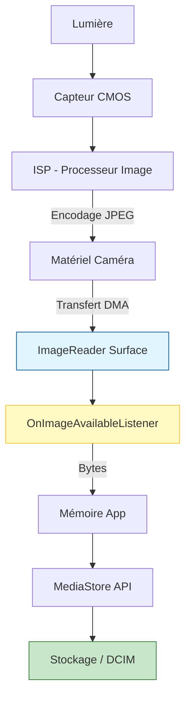

# Chapitre 11 : Prendre des photos

Prendre une photo dans Camera2 ne se résume pas à un simple appel de méthode. C'est l'aboutissement de plusieurs composants travaillant en harmonie : une `CaptureRequest` bien configurée, une surface `ImageReader` pour recevoir les pixels, et un pipeline de sauvegarde de fichiers.

Dans ce chapitre, nous allons implémenter le flux complet pour capturer une image JPEG haute résolution et l'enregistrer dans la galerie de l'utilisateur.

---

## 1. La cible de capture : ImageReader

Pour obtenir les données de l'image, nous utilisons la classe **`ImageReader`**. Elle agit comme un tampon qui reçoit les données brutes du matériel de la caméra et les expose sous forme d'objets `Image`.

```kotlin
// 1. Définir la taille (généralement la résolution JPEG max supportée)
val jpegSize = characteristics.get(CameraCharacteristics.SCALER_STREAM_CONFIGURATION_MAP)
    ?.getOutputSizes(ImageFormat.JPEG)?.maxByOrNull { it.width * it.height }!!

// 2. Créer l'ImageReader
// maxImages: 2 (un pour le traitement, un pour le tampon de sécurité)
val imageReader = ImageReader.newInstance(
    jpegSize.width, jpegSize.height, ImageFormat.JPEG, 2
)

// 3. Configurer l'écouteur de réception
imageReader.setOnImageAvailableListener({ reader ->
    val image = reader.acquireLatestImage()
    // Traiter l'image ici (sauvegarde sur disque)
    image.close()
}, backgroundHandler)
```

---

## 2. Le défi de la rotation

C'est ici que la plupart des développeurs se trompent. Le capteur de la caméra sur un téléphone Android est presque toujours monté de côté (paysage). De plus, l'utilisateur peut tenir le téléphone en portrait ou en paysage.

Pour que la photo soit dans le bon sens, nous devons calculer la rotation correcte en combinant :
1. L'orientation physique du capteur (`SENSOR_ORIENTATION`).
2. L'orientation actuelle de l'appareil (via `Display.rotation`).

### Calcul de l'orientation JPEG

```kotlin
private fun getJpegOrientation(characteristics: CameraCharacteristics, deviceRotation: Int): Int {
    val sensorOrientation = characteristics.get(CameraCharacteristics.SENSOR_ORIENTATION) ?: 0

    // Les orientations de l'écran sont 0, 90, 180, 270
    // Nous devons les convertir en degrés
    val deviceDegrees = when (deviceRotation) {
        Surface.ROTATION_0 -> 0
        Surface.ROTATION_90 -> 90
        Surface.ROTATION_180 -> 180
        Surface.ROTATION_270 -> 270
        else -> 0
    }

    // Calculer la rotation finale
    return (sensorOrientation + deviceDegrees + 270) % 360
}
```

---

## 3. Déclencher la capture

Une fois que la session est ouverte avec la surface de l' `ImageReader` incluse dans la configuration, nous pouvons envoyer la requête de capture.

```kotlin
fun takePhoto() {
    val captureBuilder = cameraDevice.createCaptureRequest(CameraDevice.TEMPLATE_STILL_CAPTURE)
    captureBuilder.addTarget(imageReader.surface)

    // Configuration des paramètres JPEG
    captureBuilder.set(CaptureRequest.JPEG_QUALITY, 95.toByte())
    captureBuilder.set(CaptureRequest.JPEG_ORIENTATION, getJpegOrientation(characteristics, currentRotation))

    // Utiliser les réglages de l'aperçu actuel pour l'AF/AE
    // (Voir le Chapitre 17 sur le pipeline 3A pour une gestion pro)

    session.capture(captureBuilder.build(), object : CameraCaptureSession.CaptureCallback() {
        override fun onCaptureStarted(...) {
            // Optionnel : Jouer un son d'obturateur ou faire vibrer
        }
    }, backgroundHandler)
}
```

---

## 4. Enregistrer l'image (Android 10+)

Depuis Android 10 (API 29), nous ne pouvons plus écrire directement dans `/sdcard/DCIM`. Nous devons utiliser le **`MediaStore`**.

```kotlin
private fun saveImageToGallery(bytes: ByteArray) {
    val contentValues = ContentValues().apply {
        put(MediaStore.MediaColumns.DISPLAY_NAME, "IMG_${System.currentTimeMillis()}.jpg")
        put(MediaStore.MediaColumns.MIME_TYPE, "image/jpeg")
        put(MediaStore.MediaColumns.RELATIVE_PATH, Environment.DIRECTORY_DCIM)
    }

    val uri = contentResolver.insert(MediaStore.Images.Media.EXTERNAL_CONTENT_URI, contentValues)
    
    uri?.let {
        contentResolver.openOutputStream(it)?.use { outputStream ->
            outputStream.write(bytes)
        }
    }
}
```

---

## Flux de données complet (Mermaid)

Voici comment les octets circulent de l'objectif vers le stockage :



---

## Points de vigilance (Checklist)

1. **Fermeture de l'Image :** N'oubliez JAMAIS d'appeler `image.close()` dans votre écouteur. Si vous ne le faites pas, les tampons saturent et la caméra s'arrête de prendre des photos.
2. **Gestion de la mémoire :** Les images JPEG haute résolution peuvent peser 10 Mo ou plus. Évitez de garder trop d'images en mémoire simultanément.
3. **Permission :** Pour enregistrer dans la galerie sur les anciennes versions d'Android, `WRITE_EXTERNAL_STORAGE` est nécessaire. Pour Android 10+, les `ContentValues` suffisent.
4. **Indicateur visuel :** Toujours fournir un retour à l'utilisateur (un flash blanc à l'écran ou une barre de progression) car la sauvegarde d'un fichier peut prendre quelques centaines de millisecondes.

## Et ensuite ?

Vous savez maintenant capturer un instantané. Mais comment s'assurer que l'image est nette et bien exposée sur tous les téléphones ? Dans le **Chapitre 12 : Plongée au cœur des CameraCharacteristics**, nous apprendrons à interroger les capacités réelles du matériel pour ne jamais demander l'impossible à la caméra.
