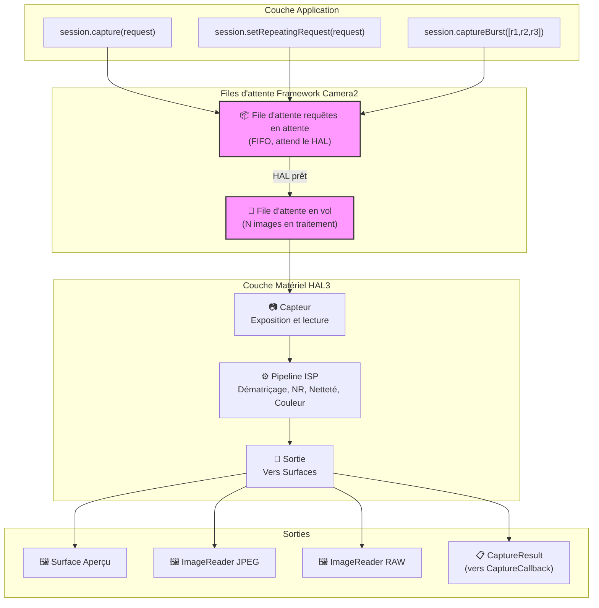
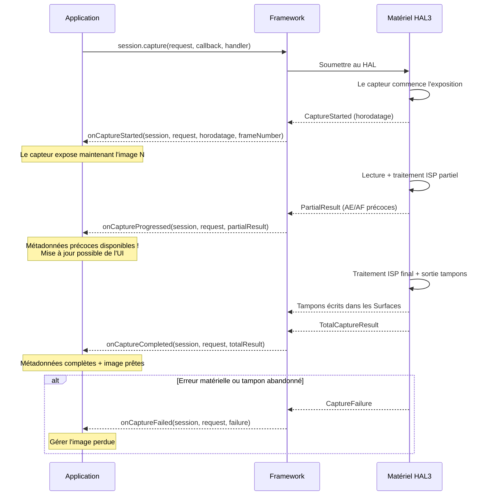
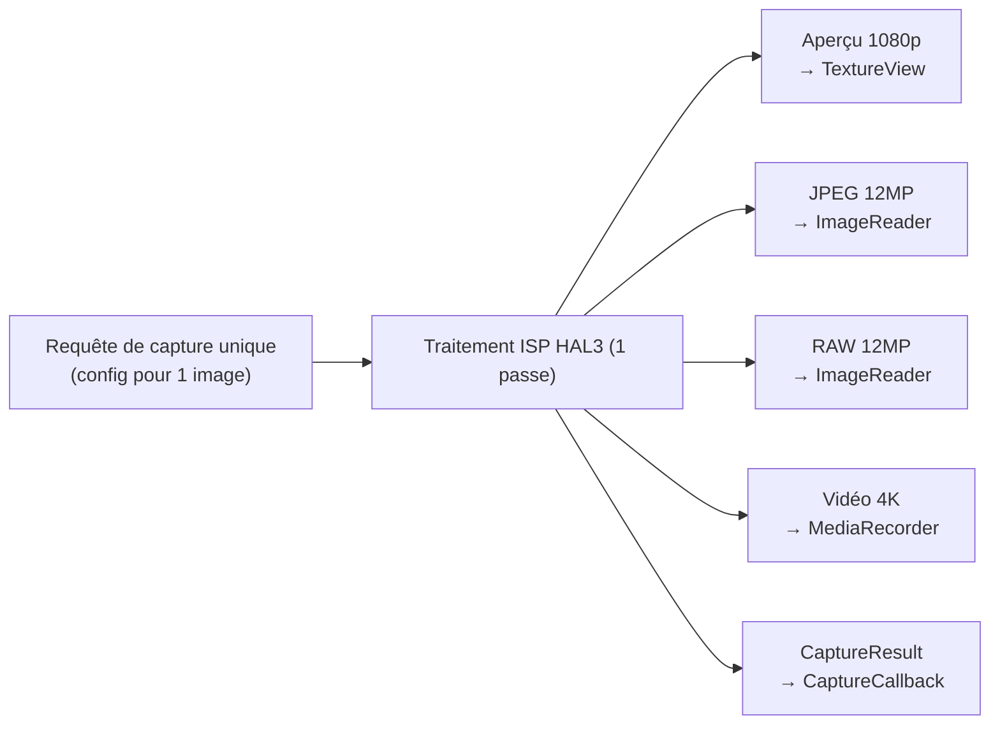
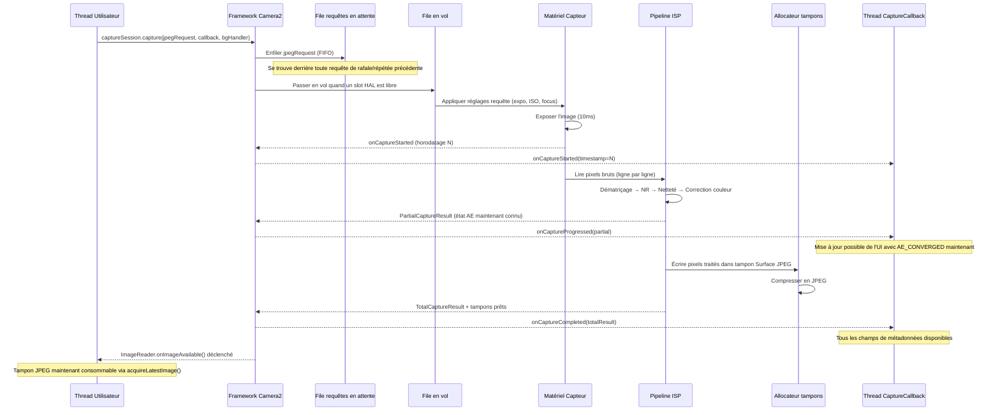

## 10.1 De l'usage à la compréhension

Dans les chapitres précédents de cette série, vous avez *utilisé* Camera2 : vous avez affiché des aperçus, capturé des photos et travaillé avec des fichiers RAW. Il est maintenant temps de retourner l'objectif et de regarder à l'intérieur — **comment Camera2 livre-t-il réellement ces images ?**

Comprendre le pipeline n'est pas seulement académique. Lorsque vous savez comment les requêtes circulent dans le système, vous pouvez :
- Diagnostiquer les pertes d'images lors d'une capture haute vitesse
- Expliquer pourquoi le changement de réglages prend 1 à 2 images pour apparaître
- Optimiser la capture en rafale pour éviter tout écran noir
- Construire des modèles mentaux corrects pour le timing des rappels

L'application Android Camera Parameters ([GitHub](https://github.com/zoozooll/AndroidCameraParameters), [Play Store](https://play.google.com/store/apps/details?id=com.minininja.cameraparams)) visualise le comportement du pipeline en temps réel — consultez les onglets **Frame Timing** et **Raw JSON** pour voir les concepts de ce chapitre en direct sur votre appareil.

## 10.2 Les structures de données centrales

Avant d'examiner le pipeline lui-même, étudions en profondeur les deux objets qui le traversent : `CaptureRequest` (ce qui entre) et `CaptureResult` (ce qui sort).

### CaptureRequest : Le plan d'exécution immuable de l'image

Une `CaptureRequest` est une **configuration complète et immuable pour une seule image**. Elle décrit *tout* ce que le capteur, l'objectif et l'ISP doivent faire pour une exposition : temps d'exposition du capteur, ISO, distance de mise au point de l'objectif, modes 3A, cibles de sortie, qualité JPEG, région de recadrage, et plus encore.

Les propriétés clés de `CaptureRequest` :

- **Immuable après build()** — Une fois que vous appelez `.build()`, la requête est figée. Pour changer les réglages, vous devez créer un nouveau Builder.
- **Modèle Builder** — Construit via `CaptureRequest.Builder`, obtenu à partir de `CameraDevice.createCaptureRequest(template)`.
- **Par image** — Chaque image individuelle reçoit son propre objet requête. Même les captures répétées créent (implicitement) une nouvelle requête par image.
- **Ciblée vers des surfaces** — Chaque requête liste explicitement quelles surfaces de sortie reçoivent les tampons d'image traités.

```kotlin
// Construire une CaptureRequest en utilisant le modèle Builder
val builder = cameraDevice.createCaptureRequest(CameraDevice.TEMPLATE_STILL_CAPTURE)

// Paramètres au niveau du capteur
builder.set(CaptureRequest.SENSOR_EXPOSURE_TIME, 10_000_000L)   // 10ms
builder.set(CaptureRequest.SENSOR_SENSITIVITY, 400)             // ISO 400
builder.set(CaptureRequest.SENSOR_FRAME_DURATION, 33_333_333L)  // ~30fps max

// Paramètres de l'objectif
builder.set(CaptureRequest.LENS_FOCUS_DISTANCE, 0.1f)           // mise au point à 10cm
builder.set(CaptureRequest.LENS_APERTURE, 1.8f)                 // f/1.8

// Modes de contrôle 3A
builder.set(CaptureRequest.CONTROL_AF_MODE, CaptureRequest.CONTROL_AF_MODE_OFF)
builder.set(CaptureRequest.CONTROL_AE_MODE, CaptureRequest.CONTROL_AE_MODE_OFF)
builder.set(CaptureRequest.CONTROL_AWB_MODE, CaptureRequest.CONTROL_AWB_MODE_OFF)

// Cibles de sortie
builder.addTarget(previewSurface)
builder.addTarget(jpegReader.surface)

// Build — maintenant immuable !
val request: CaptureRequest = builder.build()

// request.set(...) échouerait — pas de set() sur l'objet construit !
```

:::note
L'immuabilité est critique pour la justesse du pipeline. Comme le HAL lit la requête de manière asynchrone, si vous pouviez la modifier après soumission, vous créeriez des conditions de concurrence entre le thread de l'application et le thread de traitement matériel.
:::

### CaptureResult : Le rapport de métadonnées (Pas l'image !)

Un `CaptureResult` est la **sortie de métadonnées** pour une image traitée. Crucialement : **CaptureResult ne contient PAS de données de pixels d'image**. Les pixels vont vers les cibles `Surface` que vous avez ajoutées à la requête ; le `CaptureResult` va vers votre `CaptureCallback` transportant l'*histoire* de ce qui s'est passé pendant la capture.

Voici les champs les plus importants dans un `CaptureResult` :

| Clé de résultat | Type | Description |
|-----------|------|-------------|
| `SENSOR_EXPOSURE_TIME` | `Long` | Temps d'exposition réel utilisé en nanosecondes (peut différer de la requête) |
| `SENSOR_SENSITIVITY` | `Int` | Gain ISO réel appliqué |
| `SENSOR_TIMESTAMP` | `Long` | Horodatage en nanosecondes au début de l'exposition (issu de `SystemClock.elapsedRealtimeNanos()`) |
| `CONTROL_AE_STATE` | `Int` | État d'exposition auto : INACTIVE, SEARCHING, CONVERGED, LOCKED, FLASH_REQUIRED |
| `CONTROL_AF_STATE` | `Int` | État de mise au point auto : INACTIVE, PASSIVE_SCAN, ACTIVE_SCAN, FOCUSED_LOCKED, NOT_FOCUSED_LOCKED |
| `CONTROL_AWB_STATE` | `Int` | État de balance des blancs auto |
| `LENS_FOCUS_DISTANCE` | `Float` | Distance de mise au point réelle réglée par l'objectif |
| `SCALER_CROP_REGION` | `Rect` | Région de recadrage réelle utilisée pour le zoom numérique |
| `JPEG_GPS_LOCATION` | `Location` | Balise GPS écrite dans le JPEG (si demandée) |
| `STATISTICS_FACE_DETECT_MODE` | `Int` | Mode de détection de visage réellement utilisé |

Les champs de résultat sont votre **vérité terrain**. La `CaptureRequest` est ce que vous avez *demandé* ; le `CaptureResult` est ce que le matériel a *réellement fait*. Sur les appareils LEGACY ou LIMITED, le HAL peut silencieusement brider, arrondir ou outrepasser vos valeurs demandées — le résultat vous permet de le détecter.

```kotlin
val captureCallback = object : CameraCaptureSession.CaptureCallback() {
    override fun onCaptureCompleted(
        session: CameraCaptureSession,
        request: CaptureRequest,
        result: TotalCaptureResult
    ) {
        val timestampNs = result.get(CaptureResult.SENSOR_TIMESTAMP)
        val exposureNs = result.get(CaptureResult.SENSOR_EXPOSURE_TIME)
        val iso = result.get(CaptureResult.SENSOR_SENSITIVITY)
        val aeState = result.get(CaptureResult.CONTROL_AE_STATE)
        val afState = result.get(CaptureResult.CONTROL_AF_STATE)
        val focusDistance = result.get(CaptureResult.LENS_FOCUS_DISTANCE)
        val cropRegion = result.get(CaptureResult.SCALER_CROP_REGION)

        val aeStateStr = when (aeState) {
            CaptureResult.CONTROL_AE_STATE_INACTIVE -> "INACTIVE"
            CaptureResult.CONTROL_AE_STATE_SEARCHING -> "SEARCHING"
            CaptureResult.CONTROL_AE_STATE_CONVERGED -> "CONVERGED"
            CaptureResult.CONTROL_AE_STATE_LOCKED -> "LOCKED"
            CaptureResult.CONTROL_AE_STATE_FLASH_REQUIRED -> "FLASH_REQUIRED"
            else -> "INCONNU($aeState)"
        }

        val afStateStr = when (afState) {
            CaptureResult.CONTROL_AF_STATE_INACTIVE -> "INACTIVE"
            CaptureResult.CONTROL_AF_STATE_PASSIVE_SCAN -> "PASSIVE_SCAN"
            CaptureResult.CONTROL_AF_STATE_ACTIVE_SCAN -> "ACTIVE_SCAN"
            CaptureResult.CONTROL_AF_STATE_FOCUSED_LOCKED -> "FOCUSED_LOCKED"
            CaptureResult.CONTROL_AF_STATE_NOT_FOCUSED_LOCKED -> "NOT_FOCUSED_LOCKED"
            else -> "INCONNU($afState)"
        }

        Log.d("Pipeline", buildString {
            append("Image @${timestampNs?.let { it / 1_000_000 } ?: "?"}ms | ")
            append("Exposition : ${exposureNs?.let { "%.2fms".format(it / 1_000_000.0) } ?: "?"} | ")
            append("ISO : $iso | ")
            append("Mise au point : ${focusDistance?.let { "%.3f".format(it) } ?: "?"} dioptries | ")
            append("AE : $aeStateStr | ")
            append("AF : $afStateStr | ")
            append("Recadrage : ${cropRegion?.width()}x${cropRegion?.height()}")
        })
    }
}
```

:::tip
Dans l'application Android Camera Parameters, activez **Live Result Logging** dans les paramètres et regardez ce flux exact de métadonnées s'écouler en temps réel. Vous verrez AE_SEARCHING passer à AE_CONVERGED au fur et à mesure que l'exposition se stabilise, et AF_SCAN passer à FOCUSED_LOCKED lorsque vous appuyez pour faire la mise au point.
:::

## 10.3 Les files d'attente de requêtes

Camera2 utilise un **modèle de pipeline à deux files d'attente** au niveau du framework. Comprendre ces files d'attente explique presque tous les comportements temporels que vous observez.

### File d'attente des requêtes en attente (FIFO)

Lorsque vous appelez `session.capture()`, `session.captureBurst()` ou `session.setRepeatingRequest()`, la requête ne va pas immédiatement au HAL. Au lieu de cela, elle atterrit dans la **file d'attente des requêtes en attente (Pending Request Queue)** — une file d'attente FIFO (First-In, First-Out) gérée par le framework Camera2.

Pensez-y comme à une "salle d'attente". Les requêtes y restent jusqu'à ce que le HAL ait la capacité d'accepter une nouvelle requête pour traitement.

Propriétés clés :
- **Ordre FIFO** — Les requêtes sont traitées dans l'ordre exact de soumission.
- **Atomicité de la rafale** — Toutes les images d'une `captureBurst()` sont enfilées de manière contiguë et traitées sans entrelacer de requêtes répétées.
- **Surcharge de priorité** — Les requêtes ponctuelles/rafales passent *avant* la requête répétée dans la file d'attente (la requête répétée est ré-enfilée automatiquement une fois la capture ponctuelle terminée).
- **Limitée** — La file d'attente a une profondeur finie (généralement 4 à 8 requêtes) ; un débordement déclenche des erreurs.

### File d'attente en vol (In-Flight Queue)

Lorsque le HAL défile une requête de la file d'attente en attente et commence la lecture du capteur / le traitement ISP, la requête passe dans la **file d'attente en vol (In-Flight Queue)**. Cette file d'attente contient toutes les requêtes en cours de traitement par le matériel.

La profondeur de la file d'attente en vol (`CameraCharacteristics.REQUEST_PIPELINE_MAX_DEPTH`) vous indique combien d'images le matériel traite simultanément. Sur les appareils FULL typiques, elle est de 3 à 4 images, ce qui signifie que : pendant que l'image N est exposée, l'image N-1 est traitée par l'ISP, l'image N-2 est écrite en mémoire et l'image N-3 est renvoyée à l'application. C'est ainsi que Camera2 atteint plus de 30 fps malgré le fait que chaque image prend environ 100 ms de bout en bout.



## 10.4 Rappels de résultats : Le cycle de vie de CaptureCallback

Les résultats reviennent via `CameraCaptureSession.CaptureCallback`. Le HAL peut renvoyer des résultats en plusieurs étapes, vous donnant un accès précoce à des métadonnées partielles avant que l'image complète ne soit prête.

### Les quatre méthodes de rappel

| Méthode | Quand est-elle appelée | Contenu | Cas d'utilisation |
|--------|------------------------|----------|-------------------|
| `onCaptureStarted` | Le capteur *commence* l'exposition pour cette image | Infos minimales : numéro d'image, horodatage | Synchronisation précise du timing |
| `onCaptureProgressed` | L'ISP a partiellement traité l'image | PartialCaptureResult — certains champs de métadonnées prêts | Mises à jour précoces de l'état AE/AF |
| `onCaptureCompleted` | Image complète terminée, tous les tampons livrés | TotalCaptureResult — tous les champs | Journalisation finale des métadonnées |
| `onCaptureFailed` | L'image a été abandonnée / une erreur s'est produite | CaptureFailure — code d'erreur, raison | Récupération d'erreur |

### Résultats partiels vs totaux

Un `PartialCaptureResult` est renvoyé lorsque l'ISP a calculé *certains* champs de métadonnées mais n'a pas terminé le pipeline complet. Un `TotalCaptureResult` est renvoyé quand tout est terminé.



```kotlin
val fullPipelineCallback = object : CameraCaptureSession.CaptureCallback() {
    override fun onCaptureStarted(
        session: CameraCaptureSession,
        request: CaptureRequest,
        timestamp: Long,
        frameNumber: Long
    ) {
        super.onCaptureStarted(session, request, timestamp, frameNumber)
        Log.d("Pipeline", "Image #$frameNumber début d'exposition @ ${timestamp / 1_000_000}ms")
    }

    override fun onCaptureProgressed(
        session: CameraCaptureSession,
        request: CaptureRequest,
        partialResult: CaptureResult
    ) {
        super.onCaptureProgressed(session, request, partialResult)
        val aeState = partialResult.get(CaptureResult.CONTROL_AE_STATE)
        val afState = partialResult.get(CaptureResult.CONTROL_AF_STATE)
        Log.v("Pipeline", "Partiel : AE=$aeState AF=$afState")
    }

    override fun onCaptureCompleted(
        session: CameraCaptureSession,
        request: CaptureRequest,
        result: TotalCaptureResult
    ) {
        super.onCaptureCompleted(session, request, result)
        val totalFrames = result.frameNumber
        Log.d("Pipeline", "Image #$totalFrames entièrement terminée")
    }

    override fun onCaptureFailed(
        session: CameraCaptureSession,
        request: CaptureRequest,
        failure: CaptureFailure
    ) {
        super.onCaptureFailed(session, request, failure)
        val reason = when (failure.reason) {
            CaptureFailure.REASON_ERROR -> "Erreur interne"
            CaptureFailure.REASON_FLUSHED -> "Vidé par abortCaptures()"
            else -> "Inconnu (${failure.reason})"
        }
        Log.e("Pipeline", "Image #${failure.frameNumber} ÉCHOUÉE : $reason. Abandonnée : ${failure.wasImageCaptured()}")
    }
}
```

## 10.5 Mécanismes internes du pipeline : Sans état, séquentiel, asynchrone, multi-sorties

Le modèle de pipeline HAL3 que Camera2 expose possède quatre propriétés définissantes. Intériorisez-les et la plupart des comportements "bizarres" de Camera2 prendront soudainement tout leur sens.

### 1. Absence d'état (Statelessness)

Le matériel n'a **aucune mémoire entre les requêtes**. Chaque `CaptureRequest` doit être autonome — elle inclut *chaque réglage*, pas seulement ceux que vous avez modifiés par rapport à l'image précédente.

Cela signifie :
- Si vous réglez `SENSOR_EXPOSURE_TIME` sur l'image N mais que vous l'*omettez* sur l'image N+1, il revient à la valeur par défaut du modèle.
- La requête répétée n'est pas un "ensemble de surcharges" — elle est régénérée et ré-émise en entier à chaque image par le framework.
- Il n'y a pas de "régler et oublier" au niveau du HAL.

```kotlin
// 🔴 MAUVAIS : Espérer que les réglages persistent
session.setRepeatingRequest(requestWithExposure10ms, callback, handler)
// Plus tard : changement seulement du déclencheur AF, oubli de re-régler l'exposition
val triggerBuilder = cameraDevice.createCaptureRequest(CameraDevice.TEMPLATE_PREVIEW)
triggerBuilder.set(CaptureRequest.CONTROL_AF_TRIGGER, CaptureRequest.CONTROL_AF_TRIGGER_START)
triggerBuilder.addTarget(previewSurface)
session.capture(triggerBuilder.build(), callback, handler)
// 🐛 L'exposition revient à la valeur par défaut de TEMPLATE_PREVIEW pour cette image ponctuelle !

// ✅ CORRECT : Chaque requête est autonome
val triggerBuilder = cameraDevice.createCaptureRequest(CameraDevice.TEMPLATE_PREVIEW)
triggerBuilder.set(CaptureRequest.SENSOR_EXPOSURE_TIME, 10_000_000L)
triggerBuilder.set(CaptureRequest.CONTROL_AF_TRIGGER, CaptureRequest.CONTROL_AF_TRIGGER_START)
triggerBuilder.addTarget(previewSurface)
session.capture(triggerBuilder.build(), callback, handler)
```

### 2. Traitement séquentiel

Au sein d'un même flux de caméra logique, les requêtes sont traitées **une par une dans l'ordre FIFO**. Il n'y a pas de réordonnancement, pas d'évaluation de requêtes en parallèle. Si l'image 50 est derrière l'image 49 dans la file d'attente, l'image 50 attend que l'image 49 termine son exposition, même si l'image 50 serait "plus rapide" à traiter.

C'est pourquoi la capture en rafale produit des images contiguës et sans interruption : les N requêtes de la rafale sont garanties de s'exécuter les unes après les autres.

### 3. Résultats asynchrones

Le thread qui soumet une requête n'est **jamais** celui qui reçoit le résultat. Les résultats sont livrés sur le thread du `Handler` que vous avez fourni (ou sur un thread binder si vous avez passé `null`).

Conséquence pratique : **n'accédez jamais à un état partagé mutable depuis le rappel sans synchronisation**. Un bogue courant consiste à lire/écrire `latestExposure` à la fois depuis le clic du bouton de capture et depuis le rappel.

### 4. Sorties multiples par requête

Une requête → de nombreuses sorties. Une seule `CaptureRequest` peut cibler simultanément 2, 3 ou même plus de 4 cibles `Surface` :

- **SurfaceTexture d'aperçu** (pour l'affichage)
- **ImageReader JPEG** (pour la capture fixe)
- **ImageReader RAW** (pour le DNG)
- **Surface MediaRecorder** (pour l'encodage vidéo)
- **Surface d'allocation** (pour le traitement RenderScript/ML)

Le HAL est responsable du routage de la lecture unique du capteur à travers plusieurs branches ISP pour produire chaque format de sortie. Vous ne dupliquez pas la capture ; vous déclarez des cibles et le matériel s'occupe de la diffusion.



## 10.6 De bout en bout : Suivi d'une image

Tracons une seule requête de capture JPEG à travers tout le pipeline pour lier tous les éléments ensemble :



## 10.7 Voir le pipeline en action

L'application Android Camera Parameters ([GitHub](https://github.com/zoozooll/AndroidCameraParameters), [Play Store](https://play.google.com/store/apps/details?id=com.minininja.cameraparams)) inclut une vue de débogage **Pipeline Visualizer** qui superpose la profondeur actuelle de la file d'attente en attente, celle de la file en vol et les horodatages par image. Ouvrez l'application, activez le **Developer Mode** dans les paramètres, sélectionnez une caméra et passez à l'onglet **Pipeline** pour voir :

- Combien de requêtes sont en attente vs. en vol
- La latence par image du début → fin
- Le nombre de résultats partiels par image (combien d'appels `onCaptureProgressed` sont déclenchés)
- Toute image perdue avec les raisons de l'échec

Cet onglet est le meilleur moyen de développer une intuition pour les concepts de ce chapitre.

## 10.8 Résumé

| Concept | Point clé |
|---------|-----------|
| **CaptureRequest** | Plan d'exécution immuable par image. Construit via Builder. Contient TOUS les réglages (pas de persistance). |
| **CaptureResult** | Métadonnées seulement (pas de pixels). Vérité terrain sur ce que le matériel a *réellement fait*. Vérifier état AE/AF, exposition, recadrage. |
| **File en attente** | Salle d'attente FIFO. Les rafales restent contiguës. Les captures ponctuelles passent avant les répétées. |
| **File en vol** | Requêtes en cours de traitement. Profondeur = max depth du pipeline. 3-4 images typiques sur les appareils FULL. |
| **CaptureCallback** | Quatre phases : démarré → progressé → terminé (ou échoué). Résultats partiels vs totaux. |
| **Absence d'état** | Le matériel n'a pas de mémoire. Chaque requête doit inclure chaque réglage qui vous importe. |
| **Séquentiel + Asynchrone** | Ordre FIFO garanti. Rappel sur un thread différent de celui de la soumission. |
| **Multi-sorties** | Une requête → de nombreuses Surfaces (aperçu + JPEG + RAW + vidéo, tout à la fois). |

## Et ensuite ?

Dans le [Chapitre 11 : Types de capture](capture-types.md), nous examinerons les trois façons de soumettre des requêtes à ce pipeline — ponctuelle, en rafale et répétée — et quand utiliser chacune. Nous explorerons également les modèles intégrés (`TEMPLATE_PREVIEW`, `TEMPLATE_STILL_CAPTURE`, etc.) qui préconfigurent des valeurs par défaut raisonnables pour les cas d'utilisation courants.
