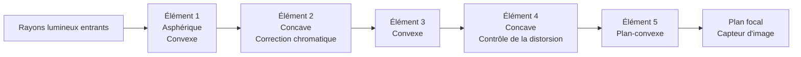
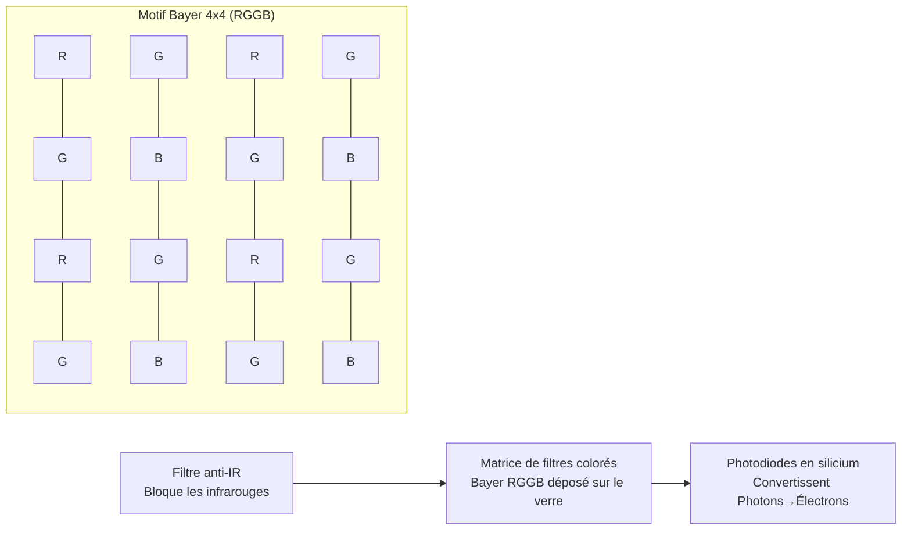
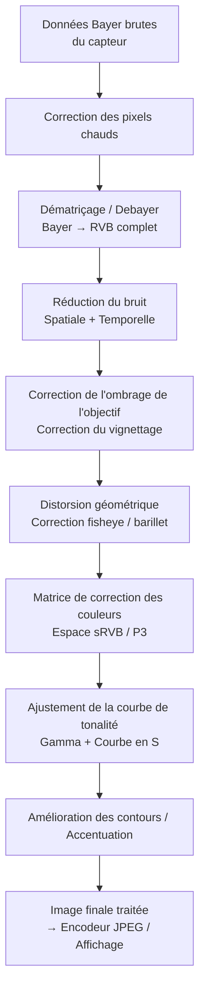
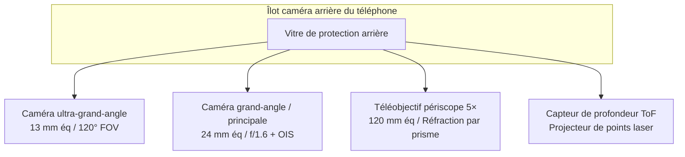
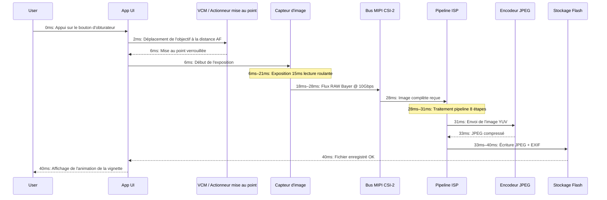

# Chapitre 2 : Comprendre les caméras des smartphones

Avant d'écrire une seule ligne de code pour l'API Camera2, vous devez comprendre le matériel physique que votre code va commander. Une caméra de smartphone n'est pas seulement "un objectif pointé vers un capteur". C'est un ensemble scellé, intégré de manière compacte et conçu avec précision, contenant des optiques, des actionneurs, des filtres, des semi-conducteurs et des bus de données à haute vitesse. Ce chapitre explique chaque composant, du verre qui capte la lumière en premier à la puce de mémoire flash où votre photo finale est stockée.

L'objectif de ce chapitre est de construire un modèle mental du pipeline de la caméra en tant que système physique. Lorsque les chapitres suivants vous demanderont de configurer une requête de capture avec `CONTROL_AE_TARGET_FPS_RANGE` ou `SENSOR_SENSITIVITY`, vous comprendrez exactement quelle pièce matérielle ces paramètres affectent et pourquoi les valeurs sont importantes.

## Le module caméra : Un assemblage optique scellé

Lorsque vous regardez l'arrière d'un téléphone phare moderne — imaginez un Pixel 10 ou un Galaxy S26 Ultra — vous voyez un îlot rectangulaire surélevé dépassant de 2 à 4 millimètres de la vitre arrière. Cet îlot n'est pas une seule caméra. Un îlot rectangulaire abrite trois modules circulaires distincts : le plus grand en bas est le grand-angle principal, un plus petit au-dessus est le téléobjectif périscope 3×, et celui de taille moyenne à gauche est l'ultra-grand-angle 0,5×. Chaque "bosse" circulaire à l'intérieur de cet îlot est un module caméra complet et indépendant.

Un module caméra est une unité scellée hermétiquement, fabriquée dans une salle blanche sans poussière. Il contient, empilés dans l'ordre de l'extérieur vers l'intérieur :

1. **Vitre de protection** : Une fenêtre en saphir résistant aux rayures ou en Gorilla Glass qui scelle le module et empêche la poussière d'entrer.
2. **Barillet d'objectif** : Un empilement cylindrique de 4 à 6 lentilles individuelles en verre (ou parfois en plastique asphérique), maintenues en alignement précis par de fines entretoises en plastique.
3. **Moteur à bobine mobile (VCM)** : Un actionneur électromagnétique qui déplace l'ensemble du barillet d'objectif vers l'avant ou vers l'arrière le long de l'axe optique par fractions de millimètre pour réaliser la mise au point automatique. Certains VCM haut de gamme peuvent également déplacer l'objectif perpendiculairement à l'axe pour la stabilisation optique de l'image (OIS).
4. **Filtre anti-infrarouge (IR)** : Une fine plaquette de verre revêtue placée directement devant le capteur. Elle bloque la lumière infrarouge (à laquelle le capteur en silicium est sensible mais pas l'œil humain) afin que les couleurs enregistrées correspondent à ce que les humains perçoivent.
5. **Puce du capteur** : La puce du capteur d'image CMOS en silicium elle-même, reliée par des fils à un substrat. La matrice de pixels actifs est orientée vers le haut, vers l'objectif.
6. **Circuit imprimé flexible (FPC)** : Un câble ruban fin et pliable qui transporte l'alimentation, la masse, les signaux de commande (I2C) et les données d'image à haute vitesse (MIPI CSI-2) du module vers la carte mère du téléphone.
7. **Connecteur carte à carte** : Une minuscule prise haute densité à l'extrémité du FPC qui s'enclenche dans un réceptacle correspondant sur le PCB principal du téléphone.

L'ensemble de l'assemblage — de la vitre de protection au connecteur — mesure généralement de 5 à 8 millimètres d'épaisseur pour une caméra arrière conventionnelle, et de 10 à 14 millimètres de long (à l'intérieur du téléphone, orienté horizontalement) pour un téléobjectif périscope. Les modules sont calibrés individuellement en usine : l'alignement de l'objectif, l'inclinaison du capteur, l'ombrage des couleurs et la position de mise au point à l'infini sont tous mesurés et stockés dans une mémoire programmable une seule fois (OTP) sur le module lui-même. L'API Camera2 lit ces données de calibration au démarrage de l'appareil afin que votre application n'ait pas à tenir compte des variations de fabrication d'une unité à l'autre.

## L'objectif : Distance focale, ouverture et stabilisation

L'objectif est le premier composant que la lumière rencontre. Son rôle est de courber les rayons lumineux entrants afin qu'ils convergent en une image nette exactement sur le plan du capteur d'image.

### Distance focale et équivalence plein format

La distance focale détermine le champ de vision (quelle partie de la scène entre dans le cadre) et le grossissement (quelle taille les sujets éloignés apparaissent). Les spécifications des caméras de smartphone annoncent toujours des **distances focales équivalentes plein format**. Il s'agit d'une convention qui normalise les différentes tailles de capteurs afin que les consommateurs puissent comparer ce qui est comparable. Un capteur plein format est de la taille 36 mm × 24 mm historiquement utilisée dans les appareils photo reflex argentiques 35 mm.

Distances focales équivalentes plein format courantes sur les smartphones :

- **10–18 mm (Ultra-grand-angle)** : Champ de vision diagonal de 100° à 130°. Utilisé pour les paysages, l'architecture, les selfies de groupe et les gros plans macro.
- **22–28 mm (Grand-angle / Principal)** : La caméra "normale" par défaut sur chaque téléphone. Champ de vision de ~75°, similaire à la vision périphérique humaine mais plus plat.
- **45–80 mm (Téléobjectif, 2× à 3×)** : Champ de vision étroit de 30° à 50°. Utilisé pour les portraits (proportions de visage d'aspect naturel, moins de distorsion de perspective) et le zoom général.
- **100–240 mm (Téléobjectif périscope, 5× à 10×)** : Champ de vision de 10° à 25°. La conception du périscope à prisme courbé permet de longues distances focales sans que le téléphone ne fasse 2 centimètres d'épaisseur.

Voici comment la lumière traverse un assemblage d'objectif grand-angle typique à 5 éléments :

### Ouverture

L'ouverture est la taille de l'orifice par lequel passe la lumière à l'intérieur de l'objectif. Elle est décrite par un **nombre f** (ou f-stop) : la distance focale divisée par le diamètre de l'ouverture. Un **nombre f plus petit signifie un trou plus large, ce qui signifie que plus de lumière** atteint le capteur.

- f/1.4 à f/1.8 : Ouverture très large. Caméras principales des fleurons typiques. Excellente en basse lumière.
- f/2.0 à f/2.4 : Ouverture modérée. Caméras ultra-grand-angle et téléobjectif typiques sur la plupart des téléphones.
- f/2.8 à f/4.0 : Ouverture étroite. Présente sur les caméras frontales à moindre coût et certains modules périscope.

L'ouverture est généralement fixe dans les caméras de smartphone. Quelques fleurons Samsung des années 2020 disposaient d'un **mécanisme d'ouverture variable** avec un double diaphragme qui pouvait basculer mécaniquement entre f/1.5 et f/2.4. C'est extrêmement rare aujourd'hui car la mise au point basée sur le VCM et le HDR computationnel multi-images ont rendu l'ouverture variable inutile pour la plupart des cas d'utilisation.

### Stabilisation optique de l'image (OIS)

Lorsque vous tenez un téléphone, vos mains tremblent naturellement de minuscules quantités angulaires — de l'ordre de 0,1° à 0,5° à 1/30e de seconde. Sur une exposition suffisamment longue, ce tremblement rend toute l'image floue. La **stabilisation optique de l'image (OIS)** résout ce problème en déplaçant physiquement soit le barillet de l'objectif (OIS par décalage de lentille), soit la puce du capteur elle-même (OIS par décalage de capteur) pour contrecarrer le mouvement détecté. Un minuscule gyroscope à l'intérieur du module caméra (ou partagé avec l'IMU principal du téléphone) mesure la vitesse angulaire 1 000 à 8 000 fois par seconde, et l'actionneur OIS déplace l'optique en conséquence. L'OIS peut généralement compenser 3 à 5 paliers de tremblement de la main, ce qui signifie qu'une exposition qui aurait nécessité 1/60s pour rester nette peut maintenant être prise à 1/8s ou 1/4s avec une netteté égale.

## Le capteur d'image : Là où la lumière devient électricité

Le capteur d'image est une puce en silicium contenant des millions de détecteurs de lumière individuels appelés **photodiodes**, disposés dans une matrice rectangulaire précise. Chaque capteur de smartphone aujourd'hui est de type **CMOS (Complementary Metal-Oxide-Semiconductor)**.

### Taille des pixels et mégapixels

Chaque photodiode individuelle + son circuit de lecture est appelé un **pixel**. La taille physique de chaque pixel (mesurée en micromètres, μm) est sans doute plus importante que le nombre total de mégapixels. Un pixel plus grand capte plus de photons par unité de temps, ce qui signifie moins de bruit de grenaille et de meilleures performances en basse lumière.

Tailles de pixels courantes dans les smartphones de 2026 :

- **0,6 μm à 0,8 μm** : Très petits pixels. Utilisés dans les capteurs haute résolution de 108 MP à 200 MP. Ceux-ci dépendent entièrement du regroupement de pixels (pixel binning) pour un bruit acceptable.
- **1,0 μm à 1,2 μm** : Taille moyenne. Utilisés dans les capteurs de 48 MP à 64 MP avec un regroupement 4:1 par défaut pour une sortie de 12 MP à 16 MP.
- **2,0 μm à 2,4 μm** : Grands pixels "phare". Utilisés dans les capteurs dédiés de 12 MP à 16 MP (Google Pixel, iPhone Pro) ou comme sortie regroupée des capteurs de 48 MP en mode "haute qualité".

Le regroupement de pixels (pixel binning) est la technique consistant à combiner la charge de pixels 2×2 (ou 3×3, ou 4×4) adjacents en un seul "super pixel" pendant la lecture. Un capteur de 48 MP avec des pixels individuels de 0,8 μm, lorsqu'il est regroupé 4 pour 1, se comporte comme un capteur de 12 MP avec des pixels effectifs de 1,6 μm — améliorant considérablement le rapport signal/bruit. L'API Camera2 expose à la fois le mode brut à pleine résolution et le mode regroupé par défaut comme des configurations de flux distinctes.

Le calcul du nombre de mégapixels est simple : un capteur de 48 MP a une matrice active d'environ 8 000 × 6 000 photodiodes = 48 000 000 de capteurs de lumière individuels.

### Classifications de la taille du capteur

La taille du capteur suit une notation héritée basée sur les pouces, remontant aux tubes de télévision Vidicon des années 1950. Le format est "1/X pouce" où X est le diviseur ; un X plus petit signifie un capteur plus grand :

- 1/3,06" à 1/2,55" : Petits capteurs, typiques pour les caméras frontales et les ultra-grand-angles d'entrée de gamme (~5 MP à 13 MP).
- 1/1,7" à 1/1,3" : Grands capteurs mobiles, caméras principales des fleurons (48 MP, 50 MP, 108 MP).
- 1 pouce (Type 1) : Très grand pour un téléphone. Présent dans le Xiaomi 13 Ultra, la série Sharp Aquos R et le Sony Xperia Pro-I. Surface active d'environ 13,2 mm × 8,8 mm — proche de la taille de certains appareils photo Micro Four Thirds.

Un capteur plus grand, à nombre de mégapixels égal, possède toujours des pixels individuels plus grands. C'est pourquoi les téléphones à "capteur d'un pouce" produisent des photos nettement meilleures en basse lumière.

### La matrice de filtres colorés Bayer (CFA)

Une photodiode en silicium brut est daltonienne — elle ne mesure que l'intensité totale des photons, pas la longueur d'onde. Pour enregistrer la couleur, les fabricants déposent un minuscule **filtre coloré** sur chaque pixel individuel. Le motif presque universel est la **matrice de filtres Bayer RGGB** : 50 % de pixels verts, 25 % de rouges et 25 % de bleus, disposés dans un carreau 2×2 répétitif. L'œil humain est plus sensible à la lumière verte, donc doubler l'échantillonnage vert améliore la résolution de luminance perçue et les performances en matière de bruit.

Après lecture, les données du capteur sont une mosaïque de valeurs séparées de rouge, vert et bleu — pas encore une image en couleur réelle. L'étape qui complète les informations de couleur manquantes pour chaque pixel s'appelle le **dématriçage** (ou debayering) et c'est la première étape de calcul majeure effectuée dans l'ISP.

### Obturateur roulant vs obturateur global

Presque tous les capteurs d'image de smartphone utilisent un **obturateur roulant** (rolling shutter). Le capteur n'expose pas et ne lit pas tous les pixels en même temps. Au lieu de cela, il expose et lit la matrice de pixels ligne par ligne, de haut en bas, une ligne horizontale à la fois. La lecture roulante d'un capteur typique de 48 MP prend environ 15 à 25 millisecondes pour une capture plein format.

L'obturateur roulant produit des distorsions caractéristiques sur les sujets se déplaçant très rapidement : une hélice d'avion en rotation ou un ventilateur de plafond semble courbé ou ondulé ; le haut et le bas d'un bâtiment panoramiqué verticalement penchent dans des directions opposées (l'effet "jello" en vidéo). Les capteurs à obturateur global, en revanche, exposent chaque pixel simultanément et les lisent tous en même temps après la fin de l'exposition. L'obturateur global est utilisé dans la vision industrielle, les caméras d'action et certains capteurs spécialisés de déverrouillage facial infrarouge orientés vers l'avant, mais la conception des pixels à obturateur global présente une sensibilité à la lumière plus faible et un coût plus élevé, elle n'est donc pas utilisée dans les caméras principales des smartphones.

## L'ISP : Processeur de signal d'image

L'**ISP (Image Signal Processor)** est un bloc matériel dédié (soit une puce séparée, soit, plus couramment aujourd'hui, une partie intégrée du SoC principal aux côtés du CPU et du GPU) dont le seul rôle est de transformer les données brutes, mosaïquées, bruitées et déformées provenant du capteur en une image couleur visuellement agréable.

L'ISP exécute un pipeline fixe et câblé d'étapes de traitement d'image à un débit extrêmement élevé. Un capteur moderne de 48 MP fonctionnant à 30 images par seconde envoie 1,44 milliard de pixels par seconde à l'ISP. L'ISP doit traiter chaque pixel à travers toutes les étapes en moins de 33 millisecondes par image pour suivre le rythme.

Les étapes canoniques du pipeline ISP, dans l'ordre, sont :

1. **Correction des pixels chauds** : Les pixels "bloqués" calibrés en usine (toujours clairs ou toujours sombres) sont remplacés par des valeurs interpolées des voisins.
2. **Dématriçage / Debayer** : La mosaïque Bayer RGGB est convertie en une image RVB complète en estimant les deux canaux de couleur manquants à chaque emplacement de pixel à partir des pixels environnants à l'aide d'algorithmes d'interpolation sensibles aux contours.
3. **Réduction du bruit (temporelle + spatiale)** : Le bruit de grenaille aléatoire et le bruit de lecture du capteur sont supprimés. La réduction du bruit (NR) spatiale floute les régions planes tout en préservant les contours. La NR temporelle fusionne les informations des images vidéo précédentes (si disponibles) pour des résultats encore plus propres.
4. **Correction de l'ombrage de l'objectif (Correction du vignettage)** : Les coins de l'image sont naturellement plus sombres car la lumière doit traverser l'objectif à un angle plus prononcé. L'ISP applique une rampe de gain numérique par pixel, plus lumineuse aux coins, pour aplatir l'éclairage. Les données de calibration pour cette rampe sont stockées dans l'OTP du module.
5. **Correction de la distorsion géométrique** : Les objectifs ultra-grand-angle et fisheye produisent une distorsion en barillet (les lignes droites se courbent vers l'extérieur). L'ISP remappe les coordonnées des pixels à l'aide d'un modèle d'objectif polynomial stocké pour produire une image rectiligne où les lignes droites apparaissent réellement droites. Cette étape recadre intrinsèquement 5 à 10 % de l'anneau de pixels extérieur.
6. **Matrice de correction des couleurs (CCM)** : La réponse spectrale RVB du capteur brut ne correspond pas à la réponse trichromatique de l'œil humain. Une multiplication par une matrice 3×3 convertit le RVB natif du capteur en espace colorimétrique standard sRVB ou DCI-P3. Les coefficients de la CCM sont ajustés par module et par illuminant (lumière du jour, tungstène, fluorescent).
7. **Ajustement de la courbe de tonalité** : Une courbe de mappage de tonalité non linéaire en forme de S est appliquée aux données RVB linéaires pour compresser le signal du capteur à plage dynamique élevée en une sortie à plage dynamique faible (généralement codée en gamma sRVB 8 bits). C'est cette étape qui donne de l'éclat à l'image — le contraste augmente dans les tons moyens, les zones lumineuses sont atténuées, les ombres sont rehaussées.
8. **Amélioration des contours / Accentuation de la netteté** : Un masque flou subtil est appliqué pour récupérer les détails haute fréquence atténués par la réduction du bruit et le filtre optique passe-bas. La quantité d'accentuation est soigneusement contrôlée pour éviter d'introduire des halos.

La qualité du traitement de l'ISP est un différenciateur majeur entre les fabricants de téléphones. Google, Samsung, Apple et Xiaomi règlent chacun leurs pipelines ISP avec des priorités artistiques différentes : certains privilégient les couleurs naturelles, d'autres une sortie saturée et percutante, d'autres encore une réduction agressive du bruit par rapport aux détails conservés. L'API Camera2 vous donne un certain contrôle sur l'intensité des étapes individuelles de l'ISP (via les commandes de mappage de tonalité et de correction des couleurs d'Android), mais la plupart des paramètres d'étape détaillés sont verrouillés derrière des API propriétaires des fournisseurs.

## RAW vs JPEG : Deux chemins du capteur au stockage

Le pipeline ISP ci-dessus produit une image traitée. Mais l'API Camera2 vous permet également de contourner entièrement l'ISP et de lire directement les données brutes du capteur. C'est la distinction critique entre la sortie RAW et JPEG.

### Format RAW

Un **fichier RAW** (sur Android, cela signifie un fichier DNG, Digital Negative) contient exactement ce que le capteur a mesuré avant tout traitement ISP. Il s'agit d'une mosaïque Bayer de 10, 12 ou 14 bits par pixel — toujours dans le motif RGGB original, toujours avec du vignettage, toujours avec du bruit, toujours linéaire. Le fichier RAW contient également des balises de métadonnées spécifiant le motif exact de la matrice de filtres colorés, le profil de couleur du capteur, le niveau de noir, le niveau de blanc et le modèle d'objectif.

- **Profondeur de bits** : RAW10 = 10 bits par canal = 1 024 niveaux. RAW12 = 4 096 niveaux. RAW14 = 16 384 niveaux. Comparez cela aux 8 bits du JPEG = 256 niveaux.
- **Taille du fichier** : 20 à 40 Mo par photo de 48 MP. Non compressé ou compressé presque sans perte.
- **Cas d'utilisation** : Édition post-production professionnelle. Les paliers de dynamique supplémentaires permettent à un éditeur de "sauver" des zones lumineuses surexposées (de 2 à 3 paliers d'EV) ou de rehausser des ombres sous-exposées sans effet de bande (banding).

### Format JPEG

Un **fichier JPEG** est la sortie entièrement "cuite" de l'ISP. Chacune des 8 étapes de l'ISP ci-dessus a déjà été appliquée aux données de pixels. Ensuite, l'image est convertie de RVB en espace colorimétrique YCbCr 4:2:0 avec sous-échantillonnage de la chrominance et compressée avec un algorithme de transformée en cosinus discrète avec perte à un rapport de compression d'environ 10:1 à 20:1.

- **Profondeur de bits** : Toujours 8 bits par canal = 256 niveaux par couleur.
- **Taille du fichier** : 2 à 5 Mo pour une photo de 12 MP à 48 MP, selon le niveau de qualité JPEG.
- **Cas d'utilisation** : Partage instantané, réseaux sociaux, tout flux de travail où la photo est "terminée" dès la prise de vue. Les ajustements dans un éditeur mobile dégradent rapidement l'image car il ne reste que 256 niveaux.

### Tableau de comparaison : RAW vs JPEG

| Caractéristique | RAW (DNG) | JPEG |
|---------|-----------|------|
| Traitement ISP appliqué | Aucun — toutes les étapes ignorées | Les 8 étapes appliquées et irréversibles |
| Profondeur de couleur | 10–14 bits (1 024–16 384 niveaux) | 8 bits (256 niveaux) |
| Balance des blancs | Étiquetée dans les métadonnées, modifiable en post | Incrustée dans les pixels — modifs mineures seulement |
| Latitude d'exposition | ±2 à 3 paliers récupérables | ±1/2 palier au mieux avant effet de bande |
| Taille du fichier (48 MP) | 25–40 Mo | 3–6 Mo |
| Espace colorimétrique | RVB linéaire natif du capteur | sRVB ou Display P3 encodé en gamma |
| Netteté / Réduction du bruit | Aucune — choix de l'éditeur | Appliquée ; ne peut être annulée |
| Flux de travail typique | Adobe Lightroom / Capture One | Partage direct sur Instagram / Messages |

## Téléphones multi-caméras : Pourquoi pas un seul zoom géant ?

Un appareil photo compact traditionnel utilise un seul zoom avec des groupes internes mobiles qui modifient continuellement la distance focale du grand-angle au téléobjectif. Pourquoi un smartphone ne peut-il pas faire la même chose ? La physique. Un zoom 10× qui couvre l'équivalent plein format 24 mm–240 mm avec une ouverture constante de f/2.8 nécessite un chemin optique d'environ 5 centimètres (2 pouces) de long. Un smartphone mesure, au plus, 0,9 centimètre d'épaisseur. Le calcul ne correspond tout simplement pas.

L'industrie du smartphone a résolu ce problème non pas avec un zoom, mais avec **plusieurs caméras à distance focale fixe**, chacune optimisée pour un usage différent, et un système de "zoom fluide" computationnel qui passe d'une caméra à l'autre à des rapports de zoom spécifiques.

Un îlot de caméras arrière typique d'un fleuron de 2026 contient :

1. **Ultra-grand-angle (zoom 0,5×, ~13 mm éq, ~120° FOV)** : Courte distance focale, grande profondeur de champ. Idéal pour les paysages, l'architecture, les photos de groupe et la macro de près lorsqu'il est repositionné via le logiciel.
2. **Grand-angle / Principal (zoom 1×, ~24 mm éq, ~75° FOV)** : Le choix par défaut. Le plus grand capteur, l'ouverture la plus large, le meilleur OIS. Utilisé pour 80 % des photos quotidiennes.
3. **Téléobjectif / Périscope (optique 3× à 10×, ~72 mm à ~240 mm éq)** : Un téléobjectif conventionnel (3×) se trouve directement au-dessus de son capteur. Un téléobjectif périscope (5×, 10×) utilise un prisme à 45° près du bord du téléphone pour réfléchir la lumière à 90°, de sorte que le barillet de l'objectif court horizontalement à l'intérieur du corps du téléphone plutôt que verticalement à travers son épaisseur.
4. **Capteur ToF / Profondeur** : Un projecteur de points laser proche infrarouge (ou, sur les iPhone, un scanner LiDAR à lumière structurée) qui projette plus de 30 000 points IR sur la scène et mesure leur temps de trajet aller-retour pour produire une carte de profondeur par pixel. Utilisé pour un bokeh de portrait précis, l'occlusion en réalité augmentée et une mise au point automatique rapide en basse lumière.

Lorsque vous effectuez un geste de pincement pour zoomer dans l'application caméra, le HAL (Hardware Abstraction Layer) bascule en douceur la caméra physique active à des seuils prédéterminés. Par exemple, zoomer de 0,5× à 1,0× passe de l'ultra-grand-angle au grand-angle. À 2,9×, l'application effectue toujours un recadrage numérique de la caméra grand-angle. À 3,0×, le HAL bascule la source active vers la caméra téléobjectif périscope. Entre ces rapports de zoom, un algorithme sophistiqué de fusion d'images utilise les deux caméras simultanément pour maintenir une transition fluide.

## Le voyage complet : Du photon à la photo enregistrée, milliseconde par milliseconde

Voici la chronologie complète et numérotée de ce qui se passe physiquement à l'intérieur d'un smartphone lors d'une seule capture de photo fixe, à partir du moment où le doigt de l'utilisateur quitte le bouton d'obturateur virtuel. Les chiffres sont représentatifs d'un fleuron de 2026 capturant un JPEG en mode par défaut 12 MP en plein jour :

- **0 ms** : L'utilisateur appuie sur l'obturateur. Le framework de l'API Camera2 reçoit la `CaptureRequest` avec `TEMPLATE_STILL_CAPTURE`.
- **0–2 ms** : L'algorithme 3A (Auto-Focus, Auto-Exposure, Auto-White-Balance) converge vers ses valeurs finales.
- **2–6 ms** : Le moteur à bobine mobile (VCM) excite sa bobine, déplaçant physiquement le barillet de l'objectif de 0,2 mm à la distance de mise au point exacte calculée par l'algorithme AF.
- **6–21 ms (exposition de 15 ms)** : La réinitialisation globale libère la charge des pixels du capteur. Pendant 15 millisecondes, les photodiodes accumulent des électrons générés par les photons. L'obturateur roulant lit ligne par ligne pendant et après cette fenêtre.
- **18–28 ms** : Le capteur envoie les données Bayer brutes via le bus série haute vitesse MIPI CSI-2. Une configuration typique comporte 4 voies de données à 2,5 Gbps par voie = 10 Gbps de bande passante totale, ce qui gère confortablement la profondeur de bits brute d'une image de 12 MP plus les intervalles de suppression.
- **28–31 ms** : Le pipeline à 8 étapes de l'ISP traite l'image : correction des pixels chauds, dématriçage, réduction du bruit, ombrage de l'objectif, correction géométrique, matrice de couleurs, courbe de tonalité et accentuation. Cela se passe entièrement au niveau matériel — aucune intervention du CPU au niveau des pixels.
- **31–33 ms** : L'image YUV traitée est envoyée à l'encodeur JPEG matériel, qui applique une compression DCT avec perte au niveau de qualité 90–95 et écrit les en-têtes de fichier JFIF (EXIF, vignette, coordonnées GPS si marquées).
- **33–40 ms** : Le bloc JPEG terminé est écrit via le fournisseur de contenu MediaStore dans le répertoire des fichiers de l'application, par exemple `/data/data/com.votrepaquet/files/DCIM/Camera/IMG_20260806_151042.jpg`. Le MediaScanner est notifié et la photo apparaît dans la galerie du système.

L'ensemble du processus prend environ 40 millisecondes de bout en bout pour une photo fixe en plein jour. En basse lumière, le temps d'exposition lui-même s'allonge (potentiellement jusqu'à plusieurs secondes pour une capture multi-images en mode Nuit), et la chronologie s'étire proportionnellement.

## Résumé

Vous avez maintenant une image physique complète du système de caméra du smartphone. Vous savez que chaque bosse de caméra arrière est un module scellé contenant un barillet d'objectif à plusieurs éléments, un actionneur de mise au point automatique VCM, un filtre anti-IR, un capteur CMOS avec une matrice de filtres colorés Bayer RGGB et un câble flexible transportant des données MIPI CSI-2. Vous comprenez la distance focale équivalente, l'ouverture et l'OIS. Vous savez comment le pipeline à 8 étapes de l'ISP transforme une mosaïque Bayer brute en un JPEG fini, et vous pouvez distinguer le RAW (natif du capteur, 10–14 bits, marge de post-traitement) du JPEG (traité par l'ISP, 8 bits, prêt à partager). Vous comprenez pourquoi les téléphones modernes utilisent plus de 3 caméras fixes au lieu d'un zoom, et vous avez parcouru la chronologie exacte, milliseconde par milliseconde, d'une seule capture photo.

## Et ensuite ?

Dans le chapitre 3, nous passerons du matériel physique à ce que ce matériel est capable de produire. Nous explorerons les fonctionnalités réelles de la photographie moderne sur smartphone : le bracketing multi-images HDR, le bokeh de portrait via stéréo / ToF / ML, les longues expositions multi-images Night Sight, la capture vidéo haute vitesse au ralenti, la correction de distorsion ultra-grand-angle et le zoom périscope. Vous apprendrez comment la photographie computationnelle — la fusion de l'optique, des capteurs, du traitement du signal multi-images et de l'apprentissage automatique sur l'appareil — crée des images qu'aucune combinaison objectif/capteur unique ne pourrait jamais produire seule.
