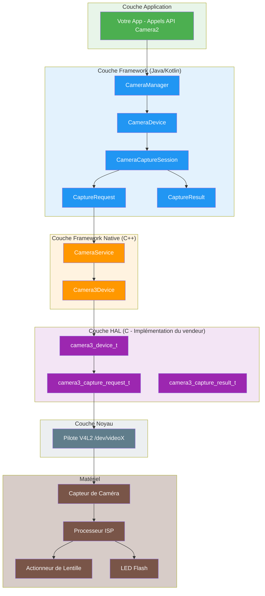
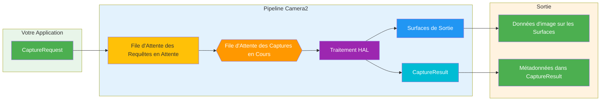
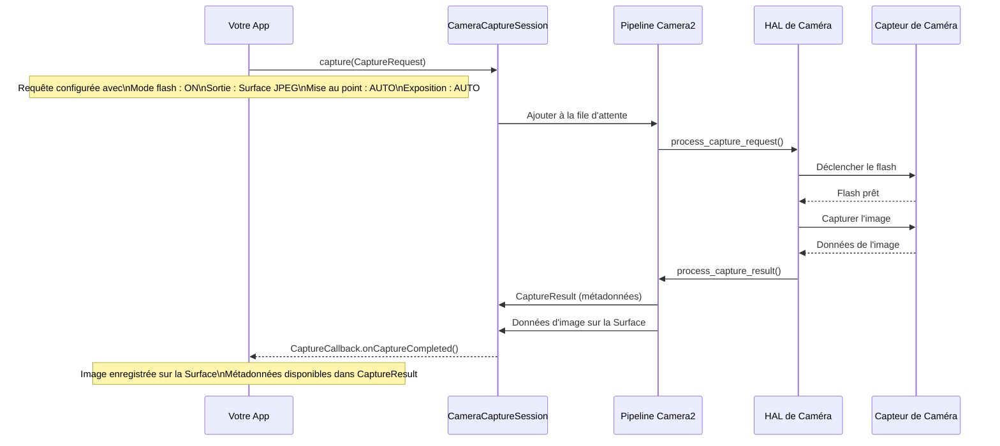
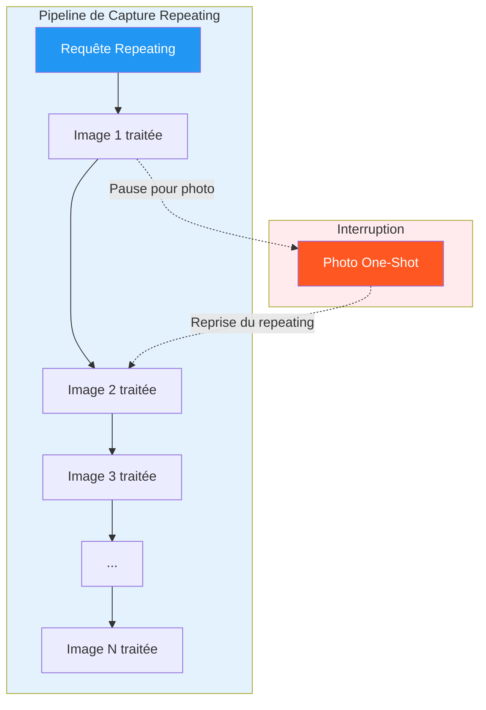
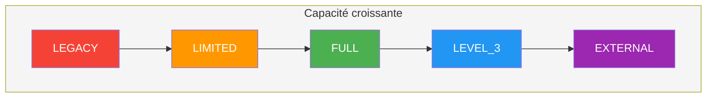
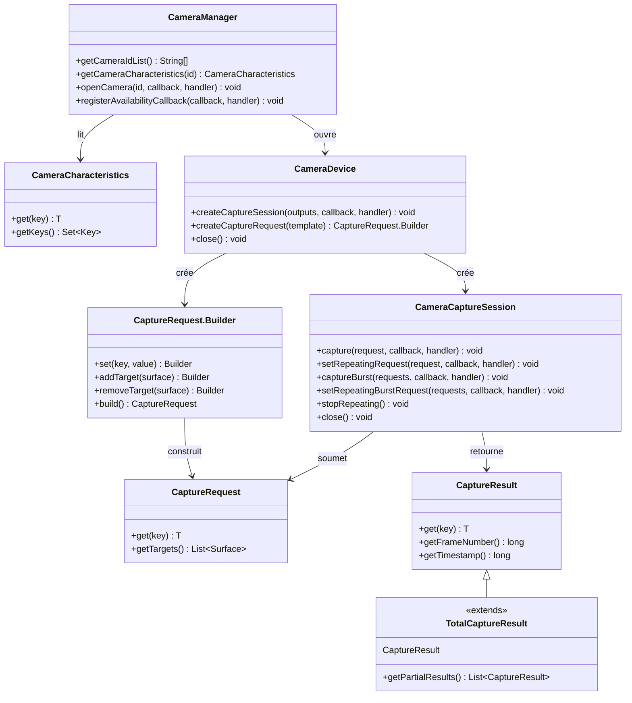
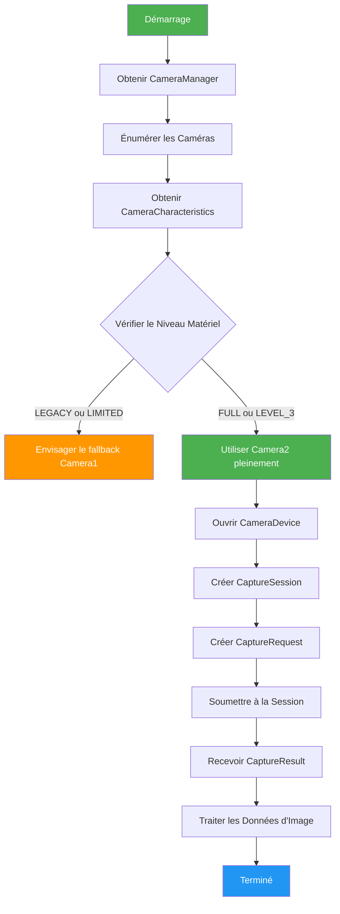
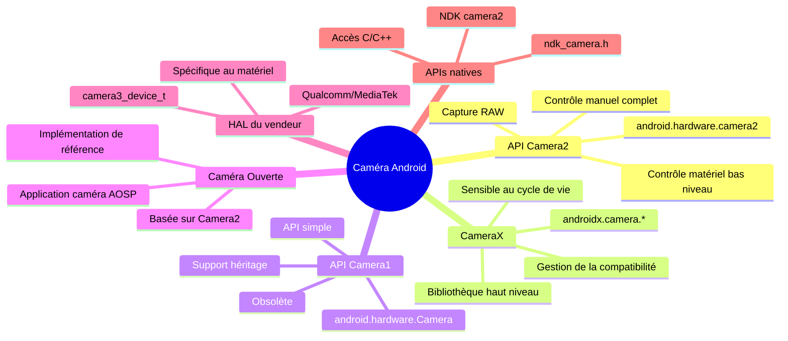

# Chapitre 1 : Bienvenue sur Android Camera2

> **Aperçu du chapitre :** Dans ce chapitre, nous explorerons le monde d'Android Camera2 de fond en comble. Vous comprendrez non seulement *ce qu'est* Camera2, mais aussi *pourquoi* il a été créé, *comment* il fonctionne, et *où* il se situe dans l'écosystème des caméras Android. Nous couvrirons le modèle Pipeline, les types de Capture, la classification des niveaux matériels, et l'architecture complète de l'application jusqu'à la HAL.

---

## 1.1 Pourquoi apprendre Camera2 ?

Presque tous les smartphones actuels sont équipés d'un système de caméra puissant. Un téléphone moderne peut :

- Capturer des photos d'aspect professionnel grâce à la photographie computationnelle
- Enregistrer des vidéos 4K et 8K à haute fréquence d'images
- Créer des effets de portrait avec détection de profondeur
- Filmer en très basse lumière avec le mode nuit
- Capturer des vidéos au ralenti à 960 fps
- Générer des informations de profondeur 3D pour les applications AR
- Combiner plusieurs caméras de manière transparente

Mais lorsque vous ouvrez l'application de caméra par défaut, vous ne voyez qu'une interface simple : un bouton d'obturateur, un contrôle de zoom, et quelques modes de prise de vue.

Derrière cette interface simple se cache un système étonnamment complexe. L'application de caméra communique avec des composants matériels, des processeurs d'image et les frameworks Android pour produire chaque image.

### Qui doit apprendre Camera2 ?

En tant que développeurs Android, nous pouvons vouloir créer des applications qui vont au-delà de l'application de caméra par défaut :

- Une **application de photographie manuelle** avec un contrôle total sur l'exposition, l'ISO et la mise au point
- Un **outil de test de caméra** permettant aux techniciens de vérifier les capacités de l'appareil
- Une **application de vision par ordinateur** nécessitant un accès aux images brutes
- Une **application de numérisation 3D** utilisant des capteurs de profondeur
- Un **enregistreur vidéo professionnel** avec sélection de codec et contrôle du débit binaire
- Un **analyseur de capacités de caméra** comme notre propre [Android Camera Parameters](https://github.com/zoozooll/AndroidCameraParameters)

Si l'un de ces scénarios vous semble familier, Camera2 est l'API que vous devez maîtriser.

---

## 1.2 Qu'est-ce qu'Android Camera2 ?

**Android Camera2** est le framework de caméra moderne introduit par Google dans **Android 5.0 (niveau API 21)**. Il a remplacé l'API originale `android.hardware.Camera` (aujourd'hui rétroactivement appelée **Camera1**).

### Le problème résolu par Camera2

L'ancienne API Camera (Camera1) a été conçue pour un monde plus simple : une seule caméra, la capture photo basique et l'enregistrement vidéo simple. Mais les caméras de smartphone ont évolué de manière spectaculaire :

| Époque | Appareil typique | API de caméra |
|--------|------------------|---------------|
| 2010-2014 | Caméra unique, capteur basique | Camera1 |
| 2015-2018 | Dual caméras, OIS, HDR | Camera2 (usage limité) |
| 2019-2022 | Triple caméras, profondeur, téléobjectif | Camera2 (standard) |
| 2023+ | Quadruple caméras, périscope, LiDAR, UWB | Camera2 (essentiel) |

Les appareils modernes peuvent contenir plusieurs caméras arrière (grand angle, ultra-grand angle, téléobjectif, périscope), des capteurs de profondeur, et même des caméras USB externes. Ils prennent en charge des fonctionnalités avancées telles que :

- Exposition et mise au point manuelles
- Capture d'images RAW
- Enregistrement vidéo haute vitesse
- Traitement HDR
- Stabilisation optique (OIS)
- Fusion multi-caméras

Camera2 a été créé pour donner aux développeurs un **contrôle profond, précis et granulaire** sur le matériel de la caméra.

---

## 1.3 Camera2 vs Camera1 vs CameraX

Avant de plonger profondément dans Camera2, clarifions la relation entre les trois principales APIs de caméra.

### Camera1 (`android.hardware.Camera`)

- **Introduite :** Android 1.0 (obsolète dans Android 5.0)
- **Modèle :** Procédural, avec état, orienté caméra unique
- **Avantages :** Simple, bien compris, largement compatible
- **Inconvénients :** Contrôle limité, pas de support RAW, pas de multi-caméra, pas de mode rafale

### Camera2 (`android.hardware.camera2`)

- **Introduite :** Android 5.0 (API 21)
- **Modèle :** Orienté objet, sans état, pipeline requête/réponse
- **Avantages :** Contrôle matériel profond, support RAW, multi-caméra, vidéo haute vitesse
- **Inconvénients :** Complexe, verbeux, nécessite une compréhension du fonctionnement interne de la caméra

### CameraX (`androidx.camera.*`)

- **Introduite :** Android 10 (pré-version), stable dans Android 11+
- **Modèle :** Déclaratif, sensible au cycle de vie, orienté cas d'utilisation
- **Avantages :** Facile à utiliser, compatibilité automatique, gestion du cycle de vie
- **Inconvénients :** Contrôle avancé limité, peut ne pas exposer toutes les fonctionnalités matérielles

### Tableau de comparaison

| Dimension | Camera1 | Camera2 | CameraX |
|-----------|---------|---------|---------|
| **Niveau** | Bas niveau (obsolète) | Bas niveau (actuel) | Haut niveau (Jetpack) |
| **Difficulté** | Facile | Difficile | Facile |
| **Contrôle** | Minimal | Maximum | Modéré |
| **Support RAW** | Non | Oui | Limité |
| **Multi-caméra** | Non | Oui | Limité |
| **Mode rafale** | Non | Oui | Non |
| **Contrôles manuels** | Limités | Complets | Limités |
| **Idéal pour** | Applications héritage | Applications caméra avancées | La plupart des applications caméra |
| **Statut** | Obsolète | Actif | Recommandé |

### Pourquoi cette série se concentre sur Camera2

Bien que CameraX soit recommandée pour la plupart des applications, comprendre Camera2 est essentiel car :

1. **CameraX est construite sur Camera2** — CameraX utilise Camera2 en arrière-plan. Comprendre Camera2 vous aide à comprendre ce que fait CameraX.
2. **Certaines fonctionnalités sont uniquement disponibles dans Camera2** — La capture RAW, le contrôle manuel du capteur et les scénarios multi-caméras avancés nécessitent Camera2.
3. **Le débogage nécessite la connaissance de Camera2** — Lorsqu'une application CameraX ne fonctionne pas comme prévu, vous devez souvent comprendre le comportement sous-jacent de Camera2 pour diagnostiquer les problèmes.
4. **La compréhension de Camera2 est fondamentale** — Même si vous utilisez CameraX pour votre application, comprendre Camera2 fait de vous un meilleur développeur de caméra Android.

---

## 1.4 Architecture de Camera2 : La vue d'ensemble

Camera2 se situe au milieu de la pile des caméras Android, faisant le pont entre le code d'application et les pilotes matériels. Comprendre cette architecture est crucial pour le débogage et l'optimisation.

### Architecture en couches



### Explication des couches de l'architecture

| Couche | Emplacement | Langage | Responsabilité |
|--------|-------------|---------|----------------|
| **Application** | Votre code d'application | Kotlin/Java | Créer des CaptureRequests, gérer les CaptureResults |
| **Framework (Java)** | `android.hardware.camera2.*` | Java | API publique, gère les sessions, convertit les données |
| **Framework Native** | `frameworks/av/` | C++ | Binder IPC, CameraService, Camera3Device |
| **HAL** | `hardware/libhardware/` + vendeur | C | Abstraction matérielle, implémentation spécifique au vendeur |
| **Noyau** | `/dev/videoX` | C | Pilote V4L2, communication matérielle |
| **Matériel** | Module de caméra physique | — | Capteur, ISP, lentille, flash |

### Principe de conception clé : Camera2 est un Pipeline

Le concept le plus important à comprendre à propos de Camera2 est qu'il modélise les opérations de caméra comme un **pipeline**. Chaque action — prévisualisation, capture photo, enregistrement vidéo — est exprimée sous forme de **Capture Request** qui traverse le pipeline et produit un **Capture Result**.

---

## 1.5 Le modèle Pipeline de Camera2

Le Pipeline est au cœur de la conception de Camera2. Il remplace le modèle avec état, une-à-une fois de Camera1 par un modèle sans état, requête/réponse.

### Comment fonctionne le Pipeline



### Explication des composants du Pipeline

| Composant | Description |
|-----------|-------------|
| **CaptureRequest** | Un objet de configuration qui décrit *une image* de capture. Contient tous les paramètres : temps d'exposition, mode de mise au point, flash, surfaces de sortie, etc. |
| **File d'Attente des Requêtes en Attente** | Une file FIFO où les nouvelles CaptureRequests attendent d'être traitées |
| **File d'Attente des Captures en Cours** | Requêtes actuellement traitées par la HAL. Généralement limitées à 1-4 requêtes selon l'appareil |
| **Traitement HAL** | La couche d'abstraction matérielle traite la requête : contrôle le capteur, l'ISP, la lentille, etc. |
| **Surfaces de Sortie** | Les images sont écrites sur les Surfaces configurées (Surface de prévisualisation, Surface ImageReader, etc.) |
| **CaptureResult** | Métadonnées sur la capture : temps d'exposition réel, état AF, timestamp, etc. Ne contient pas de données d'image |

### Propriétés clés du Pipeline

1. **Les requêtes sont sans état** — Chaque CaptureRequest contient toutes les informations nécessaires. Le pipeline n'a aucune mémoire des requêtes précédentes.
2. **Le traitement est séquentiel** — Les requêtes sont traitées dans l'ordre FIFO par la HAL.
3. **Les résultats sont asynchrones** — Les CaptureResults arrivent via des rappels, pas retournés de manière synchrone.
4. **Plusieurs sorties par requête** — Une CaptureRequest peut écrire sur plusieurs Surfaces (par exemple, prévisualisation + photo simultanément).
5. **Le pipeline peut être configuré** — Vous pouvez choisir des modèles (prévisualisation, capture photo, enregistrement) ou un mode entièrement manuel.

### Exemple concret : Prendre une photo avec flash

Pour comprendre le Pipeline, suivons ce qui se passe lorsque vous prenez une photo avec flash :



---

## 1.6 Types de Capture : One-Shot, Burst et Repeating

Camera2 définit trois types fondamentaux de Capture, chacun répondant à des cas d'utilisation différents. Les comprendre est crucial pour concevoir correctement les applications de caméra.

### Type 1 : Capture One-Shot

Les captures **One-Shot** s'exécutent exactement une fois. Elles sont idéales pour les actions uniques comme prendre une photo ou appliquer un changement de paramètre ponctuel.


**Cas d'utilisation :**
- Prendre une seule photo
- Appliquer un flash temporaire
- Capturer une image pour analyse
- Déclencher la mise au point automatique une fois

**Appel API :**
```kotlin
cameraCaptureSession.capture(captureRequest, callback, handler)
```

### Type 2 : Capture Burst

Les captures **Burst** s'exécutent plusieurs fois consécutives sans interruption. Une fois démarrées, aucune autre requête ne peut être insérée avant que la rafale ne se termine.


**Caractéristiques clés :**
- Toutes les images d'une rafale ont des paramètres identiques ou progressivement différents
- Aucune autre requête ne peut être traitée pendant une rafale
- La file d'attente de rafale est séparée de la file d'attente des requêtes en attente
- Priorité plus élevée que les requêtes répétitives

**Cas d'utilisation :**
- Capture photo continue (mode rafale)
- Bracketing (capture de la même scène à différentes expositions)
- Analyse de mouvement (capture de sujets en mouvement rapide)
- Capture multi-images séquentielle pour la composition

**Appel API :**
```kotlin
cameraCaptureSession.captureBurst(burstRequests, callback, handler)
```

### Type 3 : Capture Repeating

Les captures **Repeating** s'exécutent continuellement, formant la base de la prévisualisation en direct et de l'enregistrement vidéo. Lorsqu'une requête répétitive est active, elle occupe le pipeline entre les autres captures.



**Caractéristiques clés :**
- Une seule requête répétitive peut être active à la fois (remplace la précédente)
- Interrompue par les requêtes one-shot et burst, puis reprend automatiquement
- Forme la base de la prévisualisation et de l'enregistrement vidéo
- Ne produit pas de CaptureResult individuels pour chaque image (utilise des résultats partiels pour l'efficacité)

**Cas d'utilisation :**
- Prévisualisation de caméra en direct
- Enregistrement vidéo
- Surveillance continue de la mise au point
- Analyse d'images en temps réel

**Appel API :**
```kotlin
cameraCaptureSession.setRepeatingRequest(captureRequest, callback, handler)
// ou pour la vidéo :
cameraCaptureSession.setRepeatingBurstRequest(burstRequests, callback, handler)
```

### Comparaison des types de Capture

| Fonctionnalité | One-Shot | Burst | Repeating |
|---------------|----------|-------|-----------|
| **Exécution** | Une fois | Multiple (contiguës) | Continue |
| **Priorité** | Élevée | La plus élevée | La plus basse |
| **Interruption** | Ne peut pas être interrompue | Ne peut pas être interrompue | Peut être interrompue |
| **File d'attente** | File d'attente | File d'attente Burst séparée | Occupation du pipeline |
| **Utilisation typique** | Photo, image unique | Mode rafale, bracketing | Prévisualisation, vidéo |
| **Rappel de résultat** | Un résultat par appel | Un résultat par image | Résultats périodiques |

### Le système de modèles de Capture

Camera2 fournit des modèles prédéfinis pour les scénarios de capture courants :

| Modèle | Description | Cas d'utilisation |
|--------|-------------|------------------|
| `TEMPLATE_PREVIEW` | Optimisé pour la prévisualisation en direct | Prévisualisation de caméra |
| `TEMPLATE_STILL_CAPTURE` | Optimisé pour la capture photo | Prendre des photos |
| `TEMPLATE_RECORD` | Optimisé pour l'enregistrement vidéo | Capture vidéo |
| `TEMPLATE_VIDEO_SNAPSHOT` | Photo pendant l'enregistrement vidéo | Instantané pendant l'enregistrement |
| `TEMPLATE_ZERO_SHUTTER_LAG` | Haute qualité, délai minimal | Photographie en rafale |
| `TEMPLATE_MANUAL` | Tous les contrôles automatiques désactivés | Contrôle manuel complet |

Les modèles sont des raccourcis qui pré-configurent les paramètres courants. Vous pouvez ensuite modifier les paramètres individuels du modèle.

---

## 1.7 Niveaux matériels pris en charge

Tous les appareils Android ne prennent pas en charge l'ensemble des fonctionnalités Camera2. Pour résoudre ce problème, Google a défini les **Niveaux matériels pris en charge** — un système de classification qui indique aux développeurs ce qu'ils peuvent attendre de l'implémentation de la caméra d'un appareil.

### Classification des niveaux matériels



### Descriptions des niveaux

| Niveau | Description | Support Camera2 |
|--------|-------------|----------------|
| **LEGACY** | Rétrocompatible avec Camera1. Les appels Camera2 sont convertis en Camera1 en arrière-plan. | Uniquement les fonctionnalités Camera1 de base |
| **LIMITED** | Certaines fonctionnalités Camera2 prises en charge. Le pipeline Camera2 complet n'est pas garanti. | Fonctionnalités Camera2 partielles |
| **FULL** | Ensemble complet des fonctionnalités Camera2. Pipeline complet, contrôles manuels, multi-caméra. | Toutes les fonctionnalités Camera2 |
| **LEVEL_3** | Tout ce qui est dans FULL, plus le retraitement YUV et des flux de sortie supplémentaires. | FULL + fonctionnalités avancées |
| **EXTERNAL** | Similaire à LIMITED mais pour les caméras externes (USB, etc.). | Support des caméras externes |

### Comment vérifier le niveau matériel

Vous pouvez interroger le niveau matériel avec `CameraCharacteristics` :

```kotlin
val cameraManager = getSystemService(Context.CAMERA_SERVICE) as CameraManager
val cameraId = cameraManager.cameraIdList[0]
val characteristics = cameraManager.getCameraCharacteristics(cameraId)

val hardwareLevel = characteristics.get(CameraCharacteristics.INFO_SUPPORTED_HARDWARE_LEVEL)
val levelName = when (hardwareLevel) {
    CameraCharacteristics.INFO_SUPPORTED_HARDWARE_LEVEL_LEGACY -> "LEGACY"
    CameraCharacteristics.INFO_SUPPORTED_HARDWARE_LEVEL_LIMITED -> "LIMITED"
    CameraCharacteristics.INFO_SUPPORTED_HARDWARE_LEVEL_FULL -> "FULL"
    CameraCharacteristics.INFO_SUPPORTED_HARDWARE_LEVEL_3 -> "LEVEL_3"
    CameraCharacteristics.INFO_SUPPORTED_HARDWARE_LEVEL_EXTERNAL -> "EXTERNAL"
    else -> "UNKNOWN"
}
Log.d("Camera", "Hardware Level: $levelName")
```

### Implications pratiques

| Niveau | Ce que cela signifie pour votre application |
|--------|-------------------------------------------|
| **LEGACY** | Camera2 peut fonctionner mais avec des limites. Envisagez Camera1 comme solution de secours. |
| **LIMITED** | Les fonctionnalités Camera2 de base fonctionnent. Certaines fonctionnalités avancées peuvent être manquantes. |
| **FULL** | Support Camera2 complet. Il est sûr d'utiliser toutes les fonctionnalités Camera2. |
| **LEVEL_3** | Peut utiliser le retraitement YUV et les fonctionnalités multi-flux avancées. |
| **EXTERNAL** | Peut prendre en charge les caméras USB et les autres entrées externes. |

### Interrogation des capacités au moment de l'exécution

Au-delà du niveau matériel, vérifiez toujours les capacités spécifiques au moment de l'exécution :

```kotlin
val capabilities = characteristics.get(CameraCharacteristics.REQUEST_AVAILABLE_CAPABILITIES)
capabilities?.forEach { capability ->
    when (capability) {
        CameraMetadata.REQUEST_AVAILABLE_CAPABILITIES_BACKWARD_COMPATIBLE ->
            Log.d("Camera", "Supports backward compatible mode")
        CameraMetadata.REQUEST_AVAILABLE_CAPABILITIES_MANUAL_SENSOR ->
            Log.d("Camera", "Supports manual sensor control")
        CameraMetadata.REQUEST_AVAILABLE_CAPABILITIES_MANUAL_POST_PROCESSING ->
            Log.d("Camera", "Supports manual post-processing")
        CameraMetadata.REQUEST_AVAILABLE_CAPABILITIES_RAW ->
            Log.d("Camera", "Supports RAW capture")
        CameraMetadata.REQUEST_AVAILABLE_CAPABILITIES_PRIVATE_REPROCESSING ->
            Log.d("Camera", "Supports private reprocessing")
        CameraMetadata.REQUEST_AVAILABLE_CAPABILITIES_DEEP_OUTPUT ->
            Log.d("Camera", "Supports deep output")
    }
}
```

---

## 1.8 Aperçu des classes principales de Camera2

L'API de Camera2 est construite autour d'un petit ensemble de classes principales. Rencontrons-les avant de plonger profondément dans chacune d'elles.

### Diagramme de relation entre les classes principales



### Responsabilités des classes

| Classe | Package | Responsabilité |
|--------|---------|----------------|
| `CameraManager` | `android.hardware.camera2` | Service système de haut niveau. Énumère les caméras, fournit l'accès à CameraDevice. |
| `CameraCharacteristics` | `android.hardware.camera2` | Métadonnées de capacités de caméra en lecture seule. |
| `CameraDevice` | `android.hardware.camera2` | Représente une caméra connectée. Crée les sessions et les constructeurs de CaptureRequest. |
| `CameraCaptureSession` | `android.hardware.camera2` | L'instance du pipeline. Soumet les CaptureRequests, gère les captures répétitives. |
| `CaptureRequest` | `android.hardware.camera2` | Configuration de capture immuable. Tous les paramètres pour une image. |
| `CaptureRequest.Builder` | `android.hardware.camera2` | Builder pour créer des objets CaptureRequest. |
| `CaptureResult` | `android.hardware.camera2` | Sortie de métadonnées d'une capture terminée. |
| `TotalCaptureResult` | `android.hardware.camera2` | Résultat de capture complet incluant tous les résultats partiels. |

### Le flux de travail Camera2



---

## 1.9 Camera2 vs Camera1 : Comparaison détaillée

Si vous avez déjà travaillé avec Camera1, vous apprécierez les différences. Si ce n'est pas le cas, cette section vous aidera à comprendre pourquoi Camera2 est une refonte fondamentale.

### Comparaison des architectures

| Aspect | Camera1 | Camera2 |
|--------|---------|---------|
| **Modèle de programmation** | Procédural (impératif) | Orienté objet (déclaratif) |
| **Gestion d'état** | Avec état (la caméra maintient l'état) | Sans état (chaque requête est autonome) |
| **Modèle de capture** | Commandes (takePicture(), startPreview()) | Pipeline (CaptureRequest → CaptureResult) |
| **Gestion des threads** | Principalement mono-threadée | Conçue pour une utilisation multi-threadée |
| **Gestion des erreurs** | Exceptions, difficile à récupérer | Codes d'erreur + exceptions, plus granulaire |
| **Métadonnées** | Lecture seule après capture | Disponible en temps réel pendant la capture |
| **Sorties multiples** | Non prise en charge | Une requête → plusieurs surfaces |
| **Zero-Copy** | Non prise en charge | Prise en charge via ImageReader |

### Comparaison côte à côte des APIs

#### Ouvrir une caméra

```kotlin
// Camera1 (ancienne API)
val camera = Camera.open()
camera.setPreviewDisplay(surfaceHolder)
camera.startPreview()

// Camera2 (nouvelle API)
val cameraManager = getSystemService(Context.CAMERA_SERVICE) as CameraManager
cameraManager.openCamera(cameraId, object : CameraDevice.StateCallback() {
    override fun onOpened(camera: CameraDevice) {
        mCameraDevice = camera
        // Créer la session et les requêtes...
    }
    override fun onDisconnected(camera: CameraDevice) { camera.close() }
    override fun onError(camera: CameraDevice, error: Int) { camera.close() }
}, handler)
```

#### Prendre une photo

```kotlin
// Camera1 (ancienne API)
camera.takePicture(null, null, object : Camera.PictureCallback() {
    override fun onPictureTaken(data: ByteArray, camera: Camera) {
        // Traiter les données d'image
    }
})

// Camera2 (nouvelle API)
val requestBuilder = mCameraDevice.createCaptureRequest(CameraDevice.TEMPLATE_STILL_CAPTURE)
requestBuilder.addTarget(imageReader.surface)
val captureRequest = requestBuilder.build()
mCameraCaptureSession.capture(captureRequest, object : CameraCaptureSession.CaptureCallback() {
    override fun onCaptureCompleted(session: CameraCaptureSession, 
                                    request: CaptureRequest, 
                                    result: TotalCaptureResult) {
        // Métadonnées dans le résultat
        val exposureTime = result.get(CaptureResult.SENSOR_EXPOSURE_TIME)
    }
}, handler)
// Les données d'image arrivent via ImageReader.OnImageAvailableListener
```

#### Différences clés en pratique

| Opération | Camera1 | Camera2 |
|-----------|---------|---------|
| **Prévisualisation + Photo** | Doit arrêter la prévisualisation pour prendre une photo, puis redémarrer | Peut prendre une photo sans arrêter la prévisualisation |
| **Photos multiples** | Une seule photo à la fois | Mode rafale avec nombre arbitraire |
| **Exposition manuelle** | Non disponible | Contrôle total sur le temps d'exposition et le gain |
| **Mise au point manuelle** | Uniquement des modes prédéfinis | Contrôle total sur la position de la lentille |
| **Capture RAW** | Non disponible | Prise en charge sur les appareils FULL+ |
| **Métadonnées en temps réel** | Non disponible | Disponible via des CaptureResults partiels |

### Conseils de migration depuis Camera1

Si vous migrez depuis Camera1 vers Camera2, gardez ces conseils à l'esprit :

1. **Pensez en termes de CaptureRequests**, pas de commandes. Chaque action — mise au point, flash, photo — est une CaptureRequest.
2. **Séparez la prévisualisation de la capture**. Dans Camera1, vous deviez arrêter la prévisualisation pour capturer. Dans Camera2, vous soumettez une requête séparée pendant que la requête répétitive continue.
3. **Utilisez des handlers pour les rappels**. Les rappels Camera2 s'exécutent sur le thread d'un Handler. Fournissez-en toujours un pour éviter les ANR.
4. **Vérifiez d'abord le niveau matériel**. Si un appareil est LEGACY, envisagez d'utiliser Camera1 à la place.
5. **Utilisez les modèles CaptureRequest** pour les opérations courantes. Modifiez à partir des modèles plutôt que de construire à partir de zéro.
6. **Ne bloquez pas le thread principal**. Toutes les opérations Camera2 doivent s'exécuter sur un thread d'arrière-plan.

---

## 1.10 Camera2 dans l'écosystème Android

Camera2 n'existe pas en isolation. Il fait partie d'un écosystème plus large d'APIs et de bibliothèques liées à la caméra.

### Écosystème des APIs de caméra



### Quand utiliser quelle API

| Besoin | API recommandée | Raison |
|--------|----------------|--------|
| Application photo simple | CameraX | La plus facile, la plus compatible |
| Enregistrement vidéo | CameraX | Support vidéo intégré |
| Photographie manuelle | Camera2 | Contrôle total sur tous les paramètres |
| Vision par ordinateur | Camera2 | Accès direct aux images, latence minimale |
| Fusion multi-caméras | Camera2 | Seule API avec support multi-caméra complet |
| Capture RAW | Camera2 | Seule API avec support RAW |
| Caméra externe | Camera2 | Support des caméras externes (niveau EXTERNAL) |
| Support des appareils héritage | Camera1 | Compatibilité avec les appareils plus anciens |

---

## 1.11 Apprentissage avec Android Camera Parameters

La lecture de documentation est utile, mais les capacités de la caméra sont plus faciles à comprendre lorsque vous pouvez voir des données réelles provenant d'un téléphone réel. Tout au long de cette série, nous utiliserons [Android Camera Parameters](https://github.com/zoozooll/AndroidCameraParameters) pour explorer les informations réelles de la caméra de votre propre appareil.

Vous pouvez utiliser l'application pour découvrir :

- Les caméras disponibles (ID, orientation, niveau matériel)
- Les résolutions et fréquences d'images prises en charge
- Les informations du capteur (taille de réseau actif, focale)
- Le support du contrôle manuel (plage ISO, plage de temps d'exposition)
- La capacité et les formats RAW
- Le niveau matériel et les capacités prises en charge
- Le dump complet de CameraCharacteristics

Plutôt que d'apprendre à partir d'exemples abstraits, vous pouvez directement étudier votre propre appareil et voir comment les concepts de ce chapitre s'appliquent au matériel réel.

---

## 1.12 Points clés à retenir

Félicitations pour avoir terminé le Chapitre 1 ! Voici ce que vous devez retenir :

### Concepts fondamentaux

1. **Camera2 est un pipeline** — Chaque opération de caméra est une CaptureRequest qui traverse le pipeline et produit un CaptureResult.
2. **Types de capture** — One-shot (unique), Burst (multiple contiguës), Repeating (continu)
3. **Niveaux matériels** — LEGACY → LIMITED → FULL → LEVEL_3 → EXTERNAL
4. **Couches de l'architecture** — App → Framework → Framework Native → HAL → Noyau → Matériel

### Principes pratiques

1. **Toujours vérifier le niveau matériel** — Tous les appareils ne prennent pas en charge toutes les fonctionnalités Camera2
2. **Vérifier les capacités au moment de l'exécution** — Ne supposez pas que les fonctionnalités sont disponibles
3. **Utiliser des modèles pour les opérations courantes** — `TEMPLATE_PREVIEW`, `TEMPLATE_STILL_CAPTURE`, etc.
4. **Exécuter sur des threads d'arrière-plan** — Les opérations Camera2 ne doivent pas bloquer le thread principal
5. **Séparer la prévisualisation de la capture** — Utiliser une requête répétitive pour la prévisualisation, one-shot pour les photos

### Ce qui vient ensuite

Dans le prochain chapitre, **Comprendre les caméras de smartphone**, nous quitterons Android un instant pour explorer le matériel de la caméra lui-même. Vous allez apprendre :

- La technologie des capteurs de caméra (CMOS vs CCD)
- La conception des lentilles et la focale
- Le pipeline de traitement ISP (Image Signal Processor)
- Pourquoi deux téléphones avec des nombres de mégapixels similaires peuvent produire des photos complètement différentes
- Le pipeline d'image complet, de la lumière à la photo finale

Une fois que vous comprendrez le matériel, les concepts de Camera2 deviendront beaucoup plus intuitifs.

---

## 1.13 Résumé

Android Camera2 est un framework de caméra puissant et bas niveau qui donne aux développeurs un contrôle sans précédent sur le matériel de la caméra. Son architecture basée sur le Pipeline, ses trois types de Capture et sa classification des Niveaux matériels fournissent une base solide pour créer des applications de caméra avancées.

Dans ce chapitre, nous avons couvert :
- ✅ Architecture Camera2 et positionnement dans l'écosystème
- ✅ Modèle Pipeline avec flux requête/résultat
- ✅ Types de capture : one-shot, burst, repeating
- ✅ Classification des Niveaux matériels et vérification au moment de l'exécution
- ✅ Aperçu et relations des classes principales
- ✅ Comparaison détaillée Camera1 vs Camera2

Maintenant, plongeons dans le matériel de la caméra lui-même dans le Chapitre 2 ! 🚀
