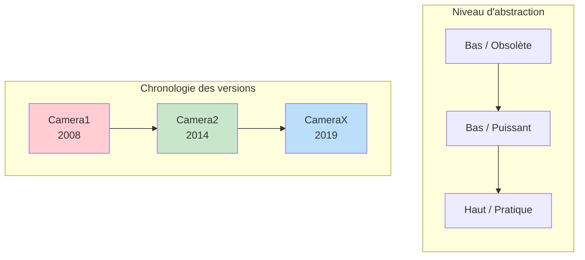
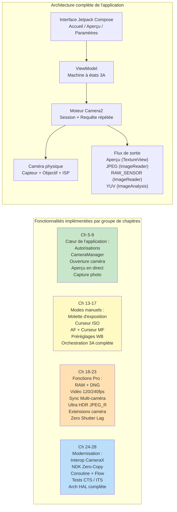

# Chapitre 1 : Bienvenue dans Android Camera2

> **Aperçu du chapitre :** Dans ce chapitre d'ouverture, nous prenons du recul pour regarder la situation dans son ensemble. Pourquoi Camera2 existe-t-il ? Quels problèmes résout-il par rapport à l'ancienne API Camera et à la nouvelle bibliothèque CameraX ? Qui devrait investir du temps dans l'apprentissage de Camera2 ? Et, plus important encore, qu'allez-vous réellement construire à la fin de cette série ? Pas d'architecture profonde, pas de couches HAL et pas encore de diagrammes de pipeline — juste des réponses claires aux questions que chaque développeur se pose avant de se lancer.

***

## 1.1 Pourquoi Camera2 ?

Sortez votre smartphone.

Regardez l'arrière. Vous voyez probablement deux, trois ou même plus d'objectifs de caméra. Cette petite bosse rectangulaire abrite plus de puissance optique et de silicium qu'un reflex numérique professionnel du milieu des années 2000.

Maintenant, ouvrez l'application caméra par défaut.

Appuyez sur l'obturateur. Instantanément, une photo haute résolution est stockée dans votre galerie. L'image est probablement superbe — des couleurs éclatantes, des sujets nets, un flou d'arrière-plan fluide et des ombres lumineuses même en lumière intérieure.

Mais l'application caméra que vous utilisez ne fait qu'effleurer la surface de ce que le matériel peut faire. Caché sous ce bouton d'obturateur convivial se trouve un pipeline d'imagerie incroyablement sophistiqué : un pipeline capable de prendre des photos RAW, d'enregistrer des vidéos au ralenti à 240 fps, de fusionner 10 images pour une seule prise de vue nocturne ou de contrôler indépendamment chaque micron de mouvement de l'objectif.

La plupart des applications Android tierces n'accèdent jamais à cette puissance. Pourquoi ? Parce que **l'ancienne API de caméra Android (rétroactivement appelée Camera1) était extrêmement limitée**. Camera1 a été conçue pour un monde de téléphones à caméra unique avec une capture photo et vidéo de base. Elle ne pouvait pas :

- Contrôler manuellement le temps d'exposition ou l'ISO
- Capturer les données brutes du capteur (RAW)
- Enregistrer au ralenti à des fréquences d'images élevées
- Utiliser plusieurs caméras simultanément
- Accéder aux métadonnées par image à la mi-capture
- Prendre des photos en rafale de manière fiable

À partir d'**Android 5.0 (niveau d'API 21)**, Google a introduit **Camera2 (android.hardware.camera2)** pour abattre ces murs. Camera2 n'est pas une mise à jour incrémentielle — c'est une **refonte complète**, construite à partir de zéro pour exposer les capacités brutes du silicium de caméra moderne à chaque développeur Android.

En bref : **Camera2 existe parce que les caméras des smartphones sont devenues de qualité professionnelle, et l'ancienne API ne pouvait plus suivre.**

***

## 1.2 Camera1 vs Camera2 vs CameraX

Plus d'une décennie de développement de caméras Android a produit **trois générations** d'APIs de caméra. Avant d'écrire une seule ligne de code, il est essentiel de comprendre quelle API résout quel problème.

### Trois générations, trois philosophies

### Camera1 — `android.hardware.Camera`

L'API de caméra originale, introduite avec Android 1.0 et **obsolète depuis Android 5.0**.

- **Modèle :** Commandes procédurales. Vous appelez des méthodes comme `startPreview()`, `takePicture()`, `setFlashMode()`.
- **Philosophie de conception :** "La caméra est une machine à états que vous commandez."
- **Idéal pour :** Applications héritées ciblant de très vieux appareils (pré-Lollipop). C'est tout.
- **Pourquoi l'éviter :** Google ne la met plus à jour. Les nouvelles fonctionnalités matérielles (multi-caméra, RAW, HDR) ne sont jamais portées sur Camera1. La surface de l'API est minuscule. Sur les appareils modernes, Camera1 est en fait **émulée par un wrapper Camera2** en interne, vous payez donc la complexité de Camera2 sans ses avantages.

### Camera2 — `android.hardware.camera2.*`

Le framework moderne de bas niveau, introduit dans Android 5.0 et continuellement étendu à chaque version d'Android depuis lors.

- **Modèle :** Un pipeline de requête/réponse. Vous construisez des objets `CaptureRequest` immuables, les soumettez à une `CameraCaptureSession` et recevez des métadonnées `CaptureResult` + des tampons d'images de manière asynchrone.
- **Philosophie de conception :** "La caméra est un pipeline programmable. Vous contrôlez chaque paramètre de chaque image."
- **Idéal pour :** Applications de caméra avancées, outils de photographie manuelle, pipelines de vision par ordinateur, capture RAW, recherche multi-caméra, vidéo haute vitesse et tout cas d'utilisation nécessitant un contrôle proche du matériel.
- **Pourquoi l'utiliser :** Accès complet à chaque capacité exposée par le HAL de l'OEM. Contrôle direct des images. La seule voie API pour les fonctionnalités professionnelles. Camera2 est ce que CameraX appelle en interne.

### CameraX — `androidx.camera.*`

Une **bibliothèque Jetpack** (pas une API de plateforme) introduite en version bêta en 2019 et stabilisée autour d'Android 11.

- **Modèle :** Cas d'utilisation déclaratifs. Vous liez au cycle de vie (`bindToLifecycle()`) un ensemble de cas d'utilisation `Preview`, `ImageCapture`, `ImageAnalysis` ou `VideoCapture` et la bibliothèque fait le reste.
- **Philosophie de conception :** "Nous avons résolu les 10 000 cas particuliers pour vous. Dites-nous simplement quelle sortie vous avez besoin."
- **Idéal pour :** La plupart des applications qui ont besoin d'une caméra. Scanneurs de QR/codes-barres, téléchargements de photos, numérisation de documents, enregistrement vidéo simple — tout scénario où la commodité et la fiabilité l'emportent sur le contrôle brut.
- **Pourquoi l'utiliser :** Respecte le cycle de vie (pas de fuites de ressources), la sélection de la résolution est automatique, les particularités des OEM ont des solutions intégrées, le même code exact fonctionne sur des milliers de modèles d'appareils sans aucune instruction `if`.

### Comparaison côte à côte

| Dimension | Camera1 | Camera2 | CameraX |
|:---|:---|:---|:---|
| **Introduit** | Android 1.0 (2008) | Android 5.0 (2014) | Android 10 (Jetpack) |
| **Statut** | Obsolète | Actif, maintenu | Recommandé (Jetpack) |
| **Abstraction** | Bas (hérité) | Bas | Haut |
| **Courbe d'apprentissage** | Facile | Très raide | Très douce |
| **Exposition manuelle / ISO / mise au point** | Limité | Contrôle total | Limité via Interop |
| **Capture RAW** | Non | Oui | Avec des solutions Interop |
| **Multi-caméra (flux physiques)** | Non | Oui | Non |
| **Vidéo haute vitesse (120+ fps)** | Non | Oui | Limité |
| **Rafale / Bracketing** | Non | Contrôle total | Non |
| **Métadonnées par image** | Non | Oui, résultats complets + partiels | Exposé via des rappels Interop |
| **Sécurité du cycle de vie** | Manuelle, sujette aux erreurs | Manuelle, sujette aux erreurs | Automatique, liée au cycle de vie |
| **Gestion des particularités OEM** | Aucune | Aucune | Intégrée (1000+ appareils testés) |
| **Volume de code pour une application fonctionnelle** | Moyen | Très élevé (verbeux) | Très faible |
| **Performance** | Correcte (wrapper indirect) | Maximum possible | Proche du maximum (faible surcoût) |

***

## 1.3 Que peut faire Camera2 ?

Pour comprendre concrètement la puissance de Camera2, imaginez des fonctionnalités que vous avez vues sur des téléphones phares. Camera2 les rend **toutes accessibles par programmation** :

### Capture de qualité professionnelle

- **Exposition manuelle complète :** Réglez la vitesse d'obturation de 1/8000 s à 30 s, et l'ISO de 50 à 102 400. Construisez une véritable interface utilisateur en mode Pro.
- **Photographie RAW :** Extrayez des **données Bayer non traitées** de 10 bits, 12 bits, 14 bits ou 16 bits directement du capteur (pas de dématriçage, pas de réduction de bruit, pas de correction de couleur). Écrivez des fichiers Adobe DNG en utilisant le `DngCreator` inclus pour une édition dans Lightroom.
- **Bracketing d'exposition :** Prenez 3, 5, 7 ou 9 images à des valeurs d'exposition (EV) précisément échelonnées. Alimentez-les dans un algorithme de fusion HDR.
- **Verrouillage du timelapse :** Gelez l'exposition, la mise au point et la balance des blancs sur des **milliers d'images** — pas de scintillement lorsque le soleil bouge ou que les nuages passent.

### Accès au matériel de photographie computationnelle

- **Vidéo haute vitesse :** Configurez `CameraConstrainedHighSpeedCaptureSession` pour une capture à 120 fps, 240 fps ou même 960 fps. Construisez des éditeurs de ralenti.
- **Multi-caméra logique :** Accédez **simultanément** aux deux caméras physiques sous un ID de multi-caméra logique. Récupérez des images YUV synchronisées d'un objectif grand-angle et d'un téléobjectif pour calculer des cartes de profondeur sur l'appareil.
- **Retraitement YUV / PRIVATE (appareils LEVEL_3) :** Maintenez un **tampon circulaire à pleine résolution dans l'ISP**, puis, lors de l'appui sur l'obturateur, récupérez une image du passé et relancez une réduction de bruit et une accentuation de la netteté intensives. C'est ainsi que les OEM implémentent le **Zero Shutter Lag (ZSL)**.
- **Ultra HDR / JPEG_R (Android 14+) :** Demandez et écrivez des fichiers `ImageFormat.JPEG_R` qui stockent un JPEG SDR 8 bits **plus** une carte de gain HDR secondaire. Les visionneuses héritées voient une photo normale ; les panneaux HDR affichent des zones lumineuses de plus de 1 000 nits.
- **Extensions de caméra (Android 12+) :** Déléguez les modes Nuit, Bokeh (portrait), HDR et Retouche de visage **au HAL de l'OEM** — en utilisant exactement le même pipeline d'IA multi-images que celui utilisé par la caméra d'origine.

### Pipelines de vision et vidéo avancés

- **Sortie simultanée multi-flux :** Pilotez une surface de **prévisualisation**, une surface d'**analyse YUV** (pour la détection d'objets par ML fonctionnant à 30 fps) et une surface de **cliché JPEG** à partir d'une seule requête de capture — le tout sans copier la mémoire.
- **Précision du timing du flash :** Coordonnez explicitement la mesure pré-flash, le déclenchement du flash principal et la lecture de l'obturateur roulant sur une base par image.
- **Résultats de capture partiels :** Recevez les métadonnées de l'état AE et de la distance de mise au point **des millisecondes avant** que le tampon d'image final ne soit prêt — permettant une réactivité de type "appuyez n'importe où et l'interface utilisateur se met à jour instantanément".
- **Sessions hors ligne (API 30+) :** Si l'utilisateur met votre application en arrière-plan au milieu d'un mode Nuit, confiez la fusion multi-images en cours à une `CameraOfflineSession` isolée et le HAL termine le traitement de manière asynchrone ; votre application se réveille avec l'image finale.

### Et ce n'est que le début

Chaque nouvelle version d'Android étend Camera2. Android 15 (API 35) a ajouté `CameraDeviceSetup` afin que vous puissiez sonder les configurations de session **sans allumer le capteur du tout**, réduisant la latence de vérification des capacités par 10. L'API est vivante, évolue et a toujours une longueur d'avance sur le dernier matériel de caméra.

***

## 1.4 Qui devrait apprendre Camera2 ?

Apprendre correctement Camera2 prend du temps. La surface de l'API est énorme — plus de 300 clés de métadonnées, des dizaines de rappels, plusieurs types de sessions et des centaines de cas particuliers d'OEM. Vous devriez investir ce temps si l'un de ces points vous décrit, vous ou votre projet :

### Vous construisez une application de caméra avancée

Votre application propose un **mode Pro** avec des molettes manuelles pour l'ISO, l'obturateur, la mise au point et la balance des blancs. Ou elle capture des **photos RAW** et permet aux utilisateurs de les exporter pour une édition sur ordinateur. Ou elle enregistre des **vidéos au ralenti**. Rien de tout cela n'est possible (ou est sévèrement limité) avec CameraX.

### Vous construisez une application de vision par ordinateur ou de recherche

Vous avez besoin d'**images YUV à latence ultra-faible et sans copie** pour alimenter un pipeline ML sur l'appareil. Ou vous avez besoin de **données de capteur verrouillées par image** (l'horodatage du gyroscope dans `SENSOR_TIMESTAMP` doit correspondre à l'image à ±1 ms près pour un SLAM précis / une odométrie visuelle-inertielle). Ou vous devez contrôler la **durée exacte de l'obturateur par image** pour la lumière structurée / la détection de profondeur.

### Vous construisez un outil de diagnostic des capacités de la caméra

Comme l'application compagnon de cette série — **Android Camera Parameters** ([GitHub](https://github.com/zoozooll/AndroidCameraParameters), [Google Play](https://play.google.com/store/apps/details?id=com.minininja.cameraparams)) — vous devez extraire exhaustivement chaque clé `CameraCharacteristics` pour visualiser ce que chaque appareil prend en charge. CameraX cache intentionnellement la plupart de ces détails.

### Vous déboguez un problème de CameraX ou d'une caméra OEM

CameraX échoue parfois sur des appareils obscurs. Lorsque votre prévisualisation CameraX est étirée, ou qu'un modèle Galaxy spécifique renvoie des images vertes en mode nuit, ou que le Pixel 9 plante sur `VideoCapture`, vous **devez** descendre au niveau de Camera2 pour reproduire et isoler le bogue.

### Vous travaillez dans l'imagerie mobile, les piles de caméras OEM ou les pipelines de caméras automobiles

Si vous touchez au code HAL du fournisseur, à `frameworks/av/camera`, au NDK Camera ou à la migration EVS→Camera2 pour l'automobile — la maîtrise de Camera2 est indispensable.

### Qui n'a **pas** besoin d'apprendre Camera2 ?

Si vos besoins sont : *"Je dois permettre aux utilisateurs de prendre une photo de profil ou de scanner un code QR"* — **utilisez CameraX**. Sérieusement. CameraX est un chef-d'œuvre d'ingénierie. Elle vous fera gagner des mois de travail sur la compatibilité des appareils. Camera2 est un outil puissant ; utilisez-le lorsque vous avez spécifiquement besoin de cette puissance.

***

## 1.5 Ce que vous allez construire tout au long de ce livre

La théorie sans code est abstraite. Le code sans progression est déroutant.

Tout au long de ce livre, vous allez **construire progressivement une application Camera2 réelle et entièrement fonctionnelle**. Chaque chapitre ajoute une fonctionnalité, et chaque fonctionnalité est compilée et exécutée sur un vrai téléphone. Au dernier chapitre, vous aurez assemblé cette application complète :

### Les étapes clés

| Plage de chapitres | Ce que vous pouvez faire après |
|:---|:---|
| **Ch 1–4** | Vous comprenez le matériel. Vous savez comment un objectif, un capteur et un ISP interagissent. Vous pouvez lire la fiche technique de n'importe quel téléphone et dire quelles fonctionnalités Camera2 il prend en charge. Vous avez installé l'application compagnon Android Camera Parameters et exploré votre propre appareil. |
| **Ch 5–9** | Vous avez une **application caméra fonctionnelle**. Elle ouvre la caméra arrière, affiche un aperçu en direct à l'écran et enregistre une photo JPEG lorsque vous appuyez sur le bouton de l'obturateur. La correction du rapport hauteur/largeur, la rotation correcte en mode portrait et le nettoyage approprié du cycle de vie fonctionnent tous. |
| **Ch 10–12** | Vous comprenez **pourquoi** le code fonctionne ainsi. Vous pouvez suivre une `CaptureRequest` à travers la file d'attente en attente, la file d'attente en vol, le HAL, et son retour sous forme de `CaptureResult`. Vous savez comment activer les fonctionnalités en fonction du niveau matériel réel et des capacités signalées. |
| **Ch 13–17** | Votre application dispose d'un **mode Pro complet**. Molettes manuelles pour l'ISO, l'obturateur, la distance de mise au point et la température de couleur WB. Histogramme en direct / lecture EV. Séquence complète AF ponctuel → AE pré-capture → capture qui imite exactement la façon dont les caméras d'origine des OEM obtiennent des résultats parfaits. |
| **Ch 18–23** | Votre application est désormais de **qualité phare** : elle enregistre simultanément RAW+JPEG, enregistre des vidéos au ralenti à 120 fps, peut capturer des flux YUV physiques doubles pour la profondeur de portrait, écrit des fichiers Ultra HDR JPEG_R, délègue les modes Bokeh et Nuit aux extensions de caméra et implémente le retraitement Zero-Shutter-Lag sur les appareils LEVEL_3. |
| **Ch 24–28** | Vous êtes un **ingénieur senior des caméras Android**. Vous pouvez intégrer CameraX via Interop pour 90 % des applications tout en utilisant Camera2 pour les 10 % qui en ont besoin. Vous pouvez créer des pipelines de caméras natives NDK sans copie. Vous enveloppez tous les rappels dans des Coroutines et Flow Kotlin pour un code propre et testable. Vous comprenez comment écrire des tests de caméra qui passent le CTS ITS. Et vous pouvez schématiser toute la pile Application→Framework→Binder→Native→HAL→Kernel→Matériel sur un tableau blanc. |
| **Ch 29 (Encyclopédie)** | Vous disposez d'une **référence de bureau** des 29 clés `CameraCharacteristics` les plus importantes, chacune expliquée avec sa justification, une requête Kotlin, un pointeur vers Android Camera Parameters et les pièges des OEM. Ce chapitre reste ouvert pendant que vous livrez du code de production. |

C'est un ensemble de compétences véritablement rare. Commençons le voyage.

***

## 1.6 Résumé

- **Camera2** est le framework moderne de bas niveau pour les caméras Android, introduit dans Android 5.0 pour exposer toute la capacité des smartphones d'aujourd'hui, riches en multi-caméras et en ISP.
- **Camera1** est obsolète ; **CameraX** est pratique pour la plupart des cas d'utilisation mais cache la puissance que seul Camera2 expose. Vous choisissez en fonction de vos besoins.
- Camera2 débloque les **contrôles manuels, la photographie RAW, la vidéo haute vitesse, la multi-caméra logique, le retraitement YUV/ZSL, l'Ultra HDR, les extensions OEM** et les **sessions hors ligne**.
- Investissez dans Camera2 lorsque vous construisez des outils photo Pro, des pipelines de vision/recherche, des applications de diagnostic ou que vous déboguez des couches plus profondes.
- Tout au long de ce livre, vous allez **construire progressivement une application Camera2 complète** — d'une caméra à un bouton au chapitre 9 à un outil d'imagerie de qualité phare au chapitre 23, renforcé par les modèles Android modernes au chapitre 28.

## 1.7 Et ensuite ?

Avant d'écrire une seule ligne de code Camera2, nous devons comprendre le matériel que nous commandons. Dans le **Chapitre 2 : Comprendre les caméras des smartphones**, vous apprendrez ce que fait réellement chaque partie d'un module de caméra de téléphone : l'objectif, le capteur d'image, l'ISP, et comment la lumière brute devient un JPEG compressé. À la fin, vous verrez pourquoi une étiquette "48 MP" sur la boîte ne vous dit presque rien sur la qualité réelle de l'image.
