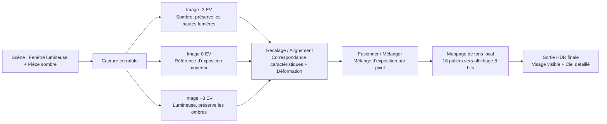
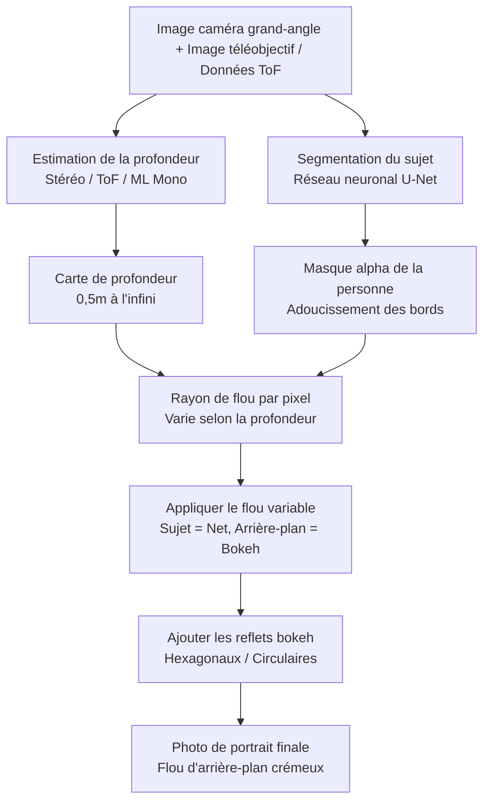
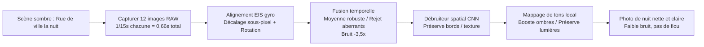
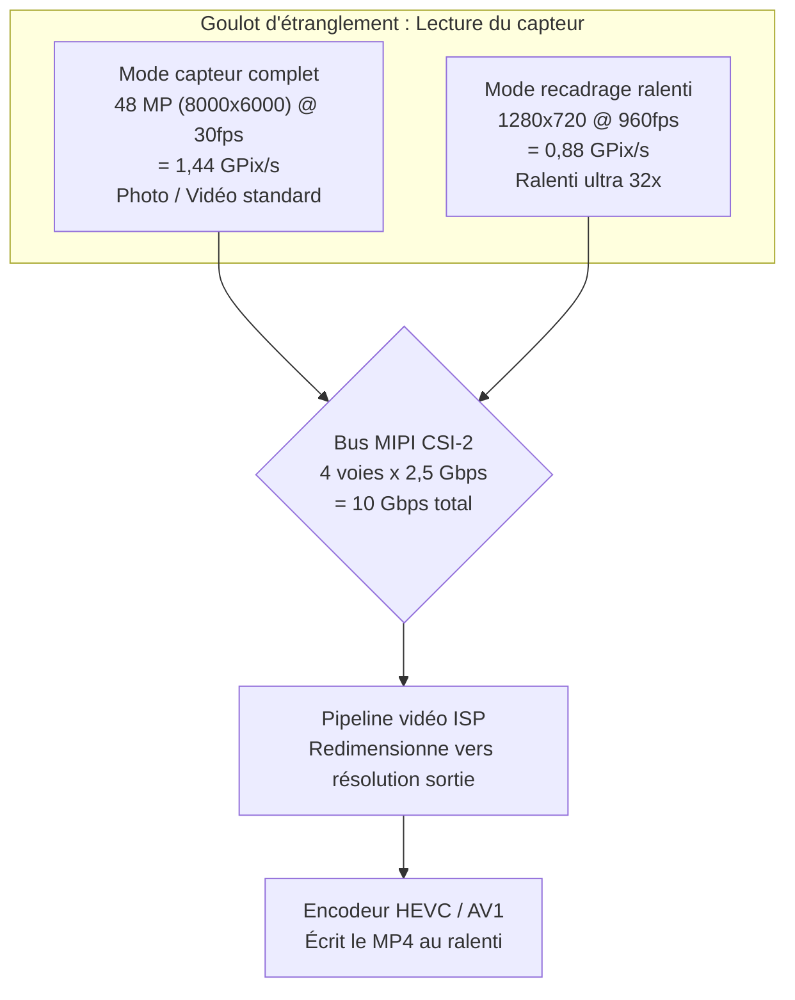
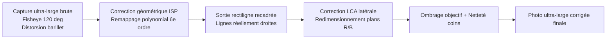
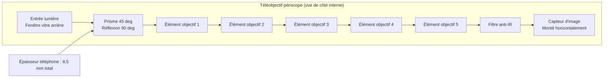
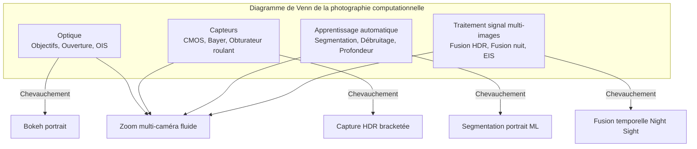

# Chapitre 3 : La photographie moderne sur smartphone

Le chapitre 2 vous a donné les bases matérielles : objectifs, capteurs, pipelines ISP et modules multi-caméras. Ce chapitre répond à la question suivante : **Comment les applications caméra modernes utilisent-elles réellement ce matériel pour produire les photos que je vois sur Instagram ?**

Un smartphone de 2010 prenait une seule exposition, la passait dans un ISP basique et écrivait un JPEG. Un smartphone de 2026 capture couramment de 5 à 15 images distinctes pour une seule photo fixe, les aligne avec une précision de sous-pixel à l'aide des données du gyroscope, les fusionne par un traitement du signal multi-images, passe le résultat dans un réseau neuronal pour la segmentation sémantique ou l'estimation de la profondeur, et enfin effectue un mappage de tons pour obtenir une image unique partageable — le tout en un seul appui sur le bouton d'obturateur.

Ce chapitre est un tour d'horizon des fonctionnalités de la photographie moderne sur smartphone. Nous expliquerons comment chaque fonctionnalité fonctionne au niveau matériel + logiciel, sans aucun code API Camera2. L'objectif est de construire un vocabulaire de ce que les systèmes de caméra modernes peuvent faire, afin que lorsque vous écrirez plus tard du code pour contrôler ces fonctionnalités, vous sachiez ce qui se passe sous le capot.

## HDR : Fusion multi-images à plage dynamique élevée

La **plage dynamique** (dynamic range) est le rapport entre les parties les plus claires et les plus sombres d'une scène qu'un système d'imagerie peut enregistrer simultanément sans saturation. L'œil humain peut percevoir environ 20 paliers de plage dynamique (un rapport de contraste de 1 000 000:1) d'un seul regard, grâce à l'adaptation saccadique. Une seule exposition d'un capteur de smartphone peut capturer environ 10 à 12 paliers à l'ISO de base. L'écart entre ces deux chiffres est la raison pour laquelle le HDR existe.

Imaginez que vous preniez une photo à l'intérieur avec une fenêtre lumineuse derrière votre sujet. Si vous exposez pour le visage de la personne (disons 1/30s, ISO 400), la fenêtre devient d'un blanc pur saturé — plus de ciel, plus de nuages, plus de détails. Si vous exposez pour la fenêtre (1/2000s, ISO 50), le visage de la personne devient une silhouette noire. Aucune exposition unique ne fonctionne.

### Comment fonctionne le HDR sur smartphone

Chaque système HDR sur les téléphones modernes utilise le **bracketing multi-images** suivi d'une fusion computationnelle. L'algorithme fonctionne ainsi :

1. **Capture bracketée** : La caméra capture une rafale rapide de 3 à 10 images consécutives à différentes valeurs d'exposition (EV). Un ensemble typique pourrait comprendre des images à -3 EV (très court, préserve les hautes lumières), -1 EV, +1 EV et +3 EV (très long, capte les ombres). Le capteur et le VCM sont maintenus parfaitement immobiles pendant la rafale ; seul le minutage de l'obturateur électronique change.
2. **Sélection de l'image de référence** : L'algorithme choisit l'image à exposition moyenne la plus nette comme référence géométrique.
3. **Recalage / Alignement d'images** : Chaque image non-référente est alignée mathématiquement sur la référence. L'algorithme trouve des points caractéristiques distinctifs (coins, bords) à l'aide d'algorithmes comme FAST ou SIFT, calcule une transformation affine ou homographique qui mappe les caractéristiques de chaque image sur l'image de référence, et déforme les pixels en conséquence. Toutes les images trop floues (à cause d'un micro-tremblement pendant la rafale) sont purement et simplement rejetées.
4. **Fusion** : Pour chaque emplacement de pixel dans l'image finale, l'algorithme combine les informations des images alignées. Les pixels sous-exposés apportent leurs données de hautes lumières nettes et non saturées. Les pixels surexposés apportent leurs données d'ombres à faible bruit. Les pixels des tons moyens sont moyennés sur toutes les images pour réduire le bruit de grenaille.
5. **Mappage de tons (Tone mapping)** : L'image linéaire fusionnée — qui peut désormais contenir 14 à 18 paliers de plage dynamique utilisable — est compressée par un opérateur de mappage de tons local sophistiqué en une image de sortie 8 bits ou 10 bits qui a fière allure sur un écran sRVB standard.

Exemple concret : un Galaxy S26 Ultra en mode "Optimiseur de scène HDR" par défaut déclenche en interne 7 images bracketées totalisant environ 0,2 seconde de temps de capture. La détection de mouvement de la main intégrée rejette 2 images floues. Les 5 images restantes sont alignées, fusionnées et mappées en tons. La sortie est écrite sous forme de **fichier JPEG_R Ultra HDR** sur les appareils Android 14+ : une image principale JPEG standard (8 bits SDR) avec une carte de gain intégrée que les visionneuses compatibles HDR (Galerie Android 14, Chrome 120+, Adobe Lightroom) peuvent utiliser pour reconstruire toute la plage de luminance HDR 10 bits sur un écran HDR10 ou Dolby Vision.

### Quand le HDR fonctionne et quand il échoue

Le HDR excelle dans les scènes statiques présentant à la fois des hautes lumières vives et des ombres profondes : paysages, portraits à contre-jour, pièces avec fenêtres, couchers de soleil sur l'eau. Il échoue activement — produisant des artefacts fantômes — lorsque des objets dans la scène bougent pendant la rafale bracketée : un oiseau en vol, un drapeau qui flotte, une personne qui cligne des yeux, un enfant qui court. Les algorithmes HDR modernes alimentés par l'IA détectent et segmentent les objets en mouvement, ne mélangeant que l'image de référence pour ces pixels afin d'éviter le classique "fantôme" HDR.

## Mode Portrait : Bokeh via l'estimation de la profondeur

Le mode portrait produit une esthétique où le visage du sujet est parfaitement net et l'arrière-plan se dissout dans un flou crémeux appelé **bokeh**. Les appareils photo traditionnels y parviennent optiquement avec de grands capteurs, de larges ouvertures et de longues distances focales. Les smartphones y parviennent par le calcul, car un capteur 1/1,3 pouce à f/1,6 ne produit pas naturellement une profondeur de champ assez faible pour cet effet.

### Trois méthodes d'estimation de la profondeur sur smartphone

Il existe trois techniques indépendantes utilisées par les systèmes de portrait modernes ; de nombreux téléphones utilisent une combinaison des trois.

**Méthode 1 : Disparité stéréo à partir de deux caméras.** C'est la méthode la plus ancienne et la plus solide géométriquement. Le téléphone déclenche simultanément la caméra grand-angle et la caméra téléobjectif sur le même sujet. Comme les deux caméras sont physiquement séparées de 10 à 15 millimètres (la "ligne de base"), elles voient le sujet depuis des positions horizontales légèrement différentes. La position d'un objet au premier plan se déplace davantage entre les deux points de vue que celle d'un objet lointain à l'arrière-plan. Ce décalage est appelé **disparité**. L'algorithme exécute une mise en correspondance de blocs ou un algorithme de correspondance semi-globale (SGM) sur les deux images rectifiées pour calculer une valeur de disparité pour chaque pixel. La disparité est inversement proportionnelle à la profondeur, donc la carte de disparité est convertie directement en une carte de profondeur par pixel.

**Méthode 2 : Détection active de la profondeur ToF / LiDAR.** Un capteur de profondeur ToF (Time-of-Flight) ou LiDAR projette un motif structuré de plus de 30 000 points laser proche infrarouge sur la scène, puis mesure le temps de trajet aller-retour (pour le ToF direct) ou le déphasage (pour le ToF indirect) de la lumière réfléchie pour calculer une profondeur métrique réelle en mètres pour chaque pixel. Le ToF produit des cartes de profondeur denses et précises même dans l'obscurité totale et sur des surfaces sans texture (murs unis, ciel) où la correspondance stéréo échoue. Les systèmes de portrait modernes utilisent généralement le ToF comme signal de profondeur de référence et la disparité stéréo comme signal de raffinement.

**Méthode 3 : Estimation de la profondeur ML monoculaire.** Pour les téléphones à caméra unique (ou pour la caméra selfie frontale, qui n'a pas de partenaire stéréo), un réseau neuronal estime la profondeur à partir d'une seule image RVB. Le modèle, entraîné sur des millions d'images avec des étiquettes de profondeur de référence, apprend les indices statistiques que les humains utilisent pour juger de la profondeur : taille relative, occlusion, perspective linéaire, gradient de texture, flou de défocalisation et perspective atmosphérique. PortraitNet de Google et DeepLabV3+ de Meta sont des architectures représentatives. La profondeur monoculaire est moins précise métriquement que la stéréo ou le ToF, mais elle est suffisante pour un bokeh de portrait à l'aspect plausible.

### Le pipeline de rendu de portrait

Une fois qu'une carte de profondeur est obtenue, les étapes restantes sont les mêmes, quelle que soit la méthode d'estimation de la profondeur utilisée :

1. **Segmentation du sujet** : Un réseau neuronal de segmentation sémantique distinct (généralement une variante U-Net) s'exécute sur l'image RVB de la caméra principale et produit un masque alpha progressif identifiant les pixels appartenant à la "personne" par rapport à l'"arrière-plan". Le masque est adouci sur les bords — particulièrement autour des cheveux, des lunettes et des détails fins du premier plan — pour éviter l'aspect "poupée de papier" découpée des débuts du mode portrait en 2010.
2. **Raffinement de la profondeur** : La carte de profondeur brute issue de la méthode 1/2/3 est multipliée par le masque de segmentation. Les pixels d'arrière-plan conservent leur valeur de profondeur ; les pixels du sujet sont bloqués sur une profondeur de plan de mise au point unique.
3. **Flou variable par pixel** : Chaque pixel d'arrière-plan est flouté par un noyau gaussien (ou, pour les modes "simulation optique" haut de gamme, une convolution de noyau d'objectif rendu physiquement) dont le rayon varie linéairement avec la distance du pixel par rapport au plan de mise au point. Un objet d'arrière-plan à 5 mètres reçoit un flou important ; un objet d'arrière-plan à 1,5 mètre reçoit un flou léger. Les pixels du sujet sont copiés sans modification.
4. **Reflets optiques simulés** : Une touche premium : les reflets spéculaires brillants dans l'arrière-plan flou (lampadaires, reflets, soleil) sont rendus sous forme d'hexagones ou de cercles de bokeh caractéristiques de la forme d'un objectif, plutôt que de simples taches gaussiennes. Cela renforce l'illusion que le flou provient d'un véritable diaphragme d'objectif.

## Mode Nuit : Fusion temporelle multi-images

Avant 2018, la photographie sur smartphone en basse lumière était essentiellement inutilisable sans flash. Un bar sombre ou une rue de ville la nuit produisait un fouillis bruyant, granuleux et flou. Puis Google a sorti **Night Sight** sur le Pixel 3, et tout a changé. L'idée centrale était contre-intuitive : au lieu de prendre une seule longue exposition d'une seconde (qui serait désespérément floue à cause du tremblement de la main), prenez 15 expositions très courtes de 1/15e de seconde (chacune individuellement nette parce que l'OIS est actif), puis alignez-les et faites-en la moyenne par algorithme. Le temps d'exposition total intégré est toujours d'une seconde, mais l'exposition par image est assez courte pour que le flou de bougé ne s'accumule jamais.

### L'algorithme du mode nuit étape par étape

1. **Capture en rafale** : La caméra capture 8 à 15 images RAW. Chaque image utilise un temps d'exposition modéré (1/15s à 1/8s est typique) et un ISO modéré (800 à 3200). Les images individuelles sont bruitées mais pas floues. La rafale dure de 0,5 à 2 secondes en temps réel.
2. **Alignement EIS assisté par gyro** : Le gyroscope de l'IMU principal du téléphone enregistre la vitesse angulaire à 8 000 Hz pendant toute la rafale. Pour chaque image, la rotation et la translation cumulées par rapport à l'image de référence sont calculées. Chaque image RAW est ensuite décalée, pivotée et légèrement redimensionnée numériquement (Stabilisation d'image électronique, EIS) sur le NPU à une précision de sous-pixel, la recalant parfaitement sur l'image de référence même si les mains de l'utilisateur ont bougé de plusieurs pixels pendant la rafale.
3. **Fusion temporelle des pixels** : Pour chaque emplacement de pixel sur les 12 images alignées, l'algorithme rassemble 12 valeurs de pixels candidates. Il effectue ensuite une fusion statistique robuste plutôt qu'une simple moyenne : les valeurs aberrantes (causées par des pixels chauds, des rayons cosmiques ou les phares d'une voiture passant à cet endroit) sont identifiées et rejetées. Les valeurs cohérentes restantes sont moyennées, réduisant le bruit de grenaille gaussien par un facteur égal à la racine carrée du nombre d'images conservées. Une fusion de 12 images réduit le bruit de 3,5×.
4. **Débruitage spatial** : Un débruiteur basé sur un CNN (entraîné spécifiquement sur des images de nuit brutes) supprime tout bruit haute fréquence restant tout en préservant les bords réels et la texture.
5. **Mappage de tons local** : L'image RAW fusionnée a une plage dynamique très élevée. Un opérateur de mappage de tons variant dans l'espace (basé sur un filtrage bilatéral ou un mappage de tons CNN appris) rehausse les ombres sans brûler les lumières de la ville, booste la saturation des couleurs dans les régions sombres (qui sembleraient autrement désaturées) et produit une image 8 bits finale qui semble lumineuse et propre plutôt que sombre et trouble.

Le "Nightography" de Samsung, le "Mode Nuit" d'Apple, le "Night Mode 2.0" de Xiaomi et le "Ultra Dark Mode" d'OPPO utilisent tous substantiellement la même architecture algorithmique. Des variations existent dans le nombre exact d'images, le choix de la statistique de fusion robuste, l'architecture du débruiteur et l'aspect du mappage de tons, mais la moyenne temporelle multi-images alignée par gyroscope est universelle dans toute l'industrie.

## Ralenti : Capture recadrée à fréquence d'images élevée

La vidéo au ralenti étire le temps en capturant des images vidéo plus rapidement que la fréquence de lecture standard de 30 fps, puis en les lisant à la vitesse normale de 30 fps. Les multiplicateurs courants :

- **Capture 120 fps → Lecture 30 fps = ralenti 4×.** Un événement réel d'une seconde devient 4 secondes de vidéo.
- **240 fps → 30 fps = ralenti 8×.**
- **960 fps → 30 fps = ralenti ultra-fluide 32×.** Une éclaboussure de goutte d'eau, l'éclatement d'un ballon ou le battement d'ailes d'un colibri deviennent visibles.

### Pourquoi le 960 fps nécessite un recadrage du capteur

Le goulot d'étranglement pour la capture à haute fréquence d'images est la **bande passante de lecture du capteur**. Le capteur d'image possède un nombre fini de voies MIPI CSI-2 fonctionnant à un débit de données maximal fixe (généralement 2,5 Gbps par voie, 4 voies = 10 Gbps au total). Le capteur ne peut sortir qu'un certain nombre de pixels par seconde.

- Une lecture d'image complète de 48 MP (8000×6000) à 960 fps nécessiterait 48 000 000 × 960 = 46,08 milliards de pixels par seconde. C'est 30× la bande passante de lecture réelle de n'importe quel capteur de smartphone de 2026.
- Par conséquent, pour atteindre 960 fps, le capteur ne doit lire qu'un petit recadrage central de sa matrice de pixels. Un mode 960 fps est généralement un recadrage 1280×720 (HD 720p) ou parfois 1920×1080 (FHD 1080p). La bande passante totale des pixels devient gérable : 1280×720×960 fps = 884 mégapixels par seconde, ce qui rentre confortablement dans les 10 Gbps même avec un codage 10 bits par pixel.

Les chiffres en pratique : capture 960 fps × 0,3 seconde de temps réel = 288 images individuelles. Lu à 30 fps = 9,6 secondes de vidéo au ralenti fluide. Certains téléphones fleurons Sony Xperia et Samsung Galaxy prennent en charge une brève rafale de 960 fps à une résolution 1080p en lisant le capteur via une banque de convertisseurs analogique-numérique (ADC) limitée uniquement dans la région de recadrage centrale.

Les modes de ralenti utilisent également souvent une technique HDR décalée où des lignes alternées du capteur sont exposées pendant des durées différentes pour maintenir une plage dynamique élevée, même à 240 fps ou 960 fps.

## Ultra-grand-angle : Correction de distorsion et qualité des bords

La caméra ultra-grand-angle d'un fleuron moderne offre une distance focale équivalente plein format de 10 à 18 mm et un champ de vision diagonal de 100° à 130°. Elle ouvre des possibilités de composition que la caméra grand-angle standard ne permet pas : paysages vastes, photos d'architecture imposantes où tout le bâtiment entre sans avoir à reculer dans le trafic, selfies de groupe qui incluent réellement tout le monde, et un effet ludique de "distorsion de proximité" où les objets tenus près de l'objectif apparaissent massivement surdimensionnés par rapport à l'arrière-plan.

Cependant, la distance focale ultra-large s'accompagne de trois défauts optiques caractéristiques que l'ISP doit corriger avant que la photo ne soit utilisable :

1. **Distorsion géométrique (en barillet)** : Les lignes droites se courbent vers l'extérieur comme les bords d'un objectif fisheye. Une photo d'un cadre de porte rectangulaire paraîtra bombée. L'étape de correction de la distorsion géométrique de l'ISP (voir chapitre 2) applique un remappage des coordonnées par pixel à l'aide d'un modèle d'objectif polynomial de 4e ou 6e ordre calibré pour ce module spécifique. La correction recadre nécessairement les 5 à 10 % extérieurs de la matrice du capteur car le remappage pousse ces pixels extérieurs hors du cadre.
2. **Aberration chromatique latérale (LCA)** : L'objectif courbe les différentes longueurs d'onde de la lumière par des quantités légèrement différentes, de sorte que les images rouge, verte et bleue d'un même point hors axe atterrissent à des coordonnées de pixels légèrement différentes. Le résultat est une frange de couleur visible (bords violets/verts) sur les objets à fort contraste près des coins. L'ISP corrige la LCA en appliquant un facteur de grossissement légèrement différent aux plans de couleur rouge et bleu par rapport au vert.
3. **Vignettage / Flou dans les coins** : Les pixels des coins reçoivent nettement moins de lumière que les pixels du centre (en raison de la chute naturelle en cos⁴θ de l'objectif et du vignettage mécanique du barillet de l'objectif), et la fonction de transfert de modulation (MTF) optique de l'objectif est plus faible aux angles extrêmes, ce qui rend les coins flous. L'étape de correction de l'ombrage de l'objectif applique un boost de gain à symétrie radiale pour aplatir l'éclairage, et un filtre d'accentuation de la netteté sensible aux contours est appliqué plus agressivement aux coins qu'au centre.

## Téléobjectif : Standard vs Périscope

Le téléobjectif capture les sujets éloignés que la caméra grand-angle ne peut pas résoudre. Les téléphones modernes proposent deux conceptions de téléobjectif distinctes.

**Téléobjectif standard (optique 2× à 3×) :** Il s'agit d'un module caméra conventionnel : le barillet de l'objectif est perpendiculaire au capot arrière du téléphone, directement au-dessus du capteur d'image, exactement comme la caméra grand-angle mais avec un objectif à distance focale plus longue. Un téléobjectif 3× a une distance focale équivalente plein format de ~72 mm. L'empilement physique est limité par l'épaisseur du téléphone (7–9 mm), donc l'objectif ne peut pas être plus long que cela. D'où le plafond pratique de 3× pour les modules téléobjectifs conventionnels.

**Téléobjectif périscope (optique 5× à 10×) :** Pour obtenir des distances focales plus longues sans épaissir le téléphone, les ingénieurs ont plié le chemin optique à 90° à l'aide d'un prisme. La lumière entre par une fenêtre sur le bord du téléphone ou sur la vitre arrière, frappe un prisme à angle droit de 45°, rebondit à 90° sur le côté, puis voyage horizontalement à travers un barillet d'objectif à plusieurs éléments de 10 à 14 mm de long qui court parallèlement à la carte mère du téléphone, pour finalement atterrir sur un capteur d'image monté latéralement sur le PCB. Le prisme lui-même est monté sur un cardan OIS à 2 axes, et le capteur est parfois monté sur un OIS à décalage de capteur séparé, offrant une stabilisation totale sur 4 ou 5 axes — suffisante pour obtenir des photos nettes à main levée à 10× du texte sur un panneau d'immeuble éloigné.

Aux limites de zoom entre les caméras physiques (par exemple, 2,9× toujours recadré numériquement de la caméra grand-angle vs 3,1× utilisant le capteur téléobjectif périscope 3× natif), le HAL effectue un tour de fusion multi-caméra : pour environ ±0,2× autour du point de basculement, il capture les deux caméras simultanément et effectue un fondu enchaîné pondéré par le rapport de zoom, de sorte que l'utilisateur ne voit jamais de "saut" visible lorsque la caméra physique active change.

## Macro : Photographie de gros plan extrême

La photographie macro capture des gros plans extrêmes de petits sujets : la texture des pétales de fleurs, les yeux composés des insectes, les fibres d'un morceau de tissu, les cristaux de sucre individuels sur un biscuit.

Deux stratégies macro existent dans les téléphones modernes :

**Caméra macro dédiée :** Les téléphones d'entrée et de milieu de gamme sont souvent équipés d'un petit module macro dédié à basse résolution (2 MP à 5 MP) avec un objectif à distance focale courte et mise au point fixe. Le module est réglé pour une distance de mise au point minimale spécifique (généralement 2–4 cm) et produit des images macro étonnamment nettes malgré sa faible résolution. Le principal inconvénient est que le capteur est minuscule, de sorte que la qualité de l'image se dégrade fortement dès que la lumière du jour n'est plus éclatante.

**Ultra-grand-angle réutilisé en macro :** Les téléphones fleurons (Google Pixel, Samsung série S Ultra, iPhone Pro) ne sont pas équipés d'une caméra macro dédiée. Au lieu de cela, ils réutilisent la caméra ultra-grand-angle. La courte distance focale de l'ultra-grand-angle (13 mm éq) lui confère une distance de mise au point minimale très courte — souvent 1 à 2 centimètres du sujet. Lorsque l'utilisateur appuie sur le mode "Macro" ou que l'application caméra détecte un sujet proche via le capteur ToF ou le télémètre AF à détection de phase, l'application passe à l'ultra-grand-angle, règle son VCM sur la position de mise au point minimale, applique une correction de distorsion géométrique supplémentaire (car le sujet se trouve maintenant à un extrême de courbure de champ où le remappage polynomial diffère considérablement de la calibration à l'infini) et recadre le centre du capteur ultra-grand-angle pour produire l'image macro finale. Le grand capteur ultra-large de 12 MP à 50 MP offre une qualité d'image macro nettement supérieure à celle d'un module dédié de 5 MP.

## Photographie computationnelle : La philosophie unificatrice

Les fonctionnalités ci-dessus — HDR, Portrait, Mode Nuit, Ralenti, correction Ultra-large, fusion de zoom Périscope, Macro — partagent une seule idée unificatrice. La **photographie computationnelle** est la philosophie selon laquelle le capteur de la caméra, l'ISP, le gyroscope/IMU, le NPU (Neural Processing Unit) et les algorithmes de traitement du signal multi-images peuvent travailler ensemble pour produire des images qu'aucune combinaison objectif/capteur unique, aussi coûteux soit le verre, ne pourrait jamais produire seule.

Le modèle reflex classique est : lumière → objectif → capteur → stockage. Le modèle smartphone est : lumière → objectifs multiples → capteurs multiples → gyro/IMU → capture de rafale multi-images → inférence neurale NPU → fusion de décision par pixel → mappage de tons sophistiqué → stockage. Les deux commencent et finissent au même endroit, mais le smartphone insère des dizaines d'étapes de calcul supplémentaires au milieu, chacune améliorant le résultat final d'une manière que l'optique seule ne peut pas faire.

Zoomer de manière fluide de 0,5× à 10× sur un Galaxy S26 Ultra est computationnel : le HAL mélange trois caméras différentes avec trois distances focales différentes à travers cinq points de basculement de zoom. Sauver un portrait à contre-jour où la fenêtre derrière le sujet n'est plus brûlée est computationnel : fusion HDR à 7 images. Une photo de nuit à main levée de la Voie lactée qui nécessiterait un trépied et une exposition de 30 secondes sur un reflex numérique est computationnelle : fusion temporelle de 12 images alignées par gyroscope. Chaque fonctionnalité décrite dans ce chapitre est de la photographie computationnelle.

C'est l'idée la plus importante à retenir pour les chapitres sur l'API Camera2 qui suivent. L'API Camera2 n'est pas seulement un outil pour "prendre une photo". C'est une interface de contrôle de bas niveau qui permet à votre application de déclencher des rafales multi-images précises, de lire les métadonnées du gyroscope par image, de sélectionner quelle caméra physique se déclenche à quel rapport de zoom et de faire passer des images par des réseaux neuronaux sur l'appareil — les briques de base pour implémenter vos propres fonctionnalités de photographie computationnelle.

## Résumé

Dans ce chapitre, vous avez appris les algorithmes réels derrière les fonctionnalités de la photographie moderne sur smartphone. Le HDR utilise le bracketing d'exposition sur 3 à 10 images, l'alignement basé sur les caractéristiques par image et le mappage de tons pour capturer une plage dynamique que le capteur ne peut pas voir en une seule exposition. Le mode portrait calcule une carte de profondeur par pixel via la disparité de la caméra stéréo, la télémétrie laser ToF ou l'estimation de la profondeur ML monoculaire, puis exécute une segmentation du sujet U-Net et applique un flou gaussien variable par pixel mis à l'échelle par la profondeur. Le mode nuit capture 8 à 15 expositions courtes, les aligne à l'aide de l'EIS assisté par gyro, applique une fusion temporelle robuste des pixels pour réduire le bruit de 3,5× et effectue un mappage de tons local du résultat. La vidéo au ralenti à 960 fps doit recadrer le capteur car la bande passante de lecture MIPI est le goulot d'étranglement matériel. Les photos ultra-grand-angle subissent une correction de distorsion géométrique, une correction d'aberration chromatique et une correction d'ombrage des coins dans l'ISP avant de devenir visualisables. Les caméras téléobjectifs périscopes utilisent un prisme à 45° pour plier le chemin de la lumière à 90° et faire tenir un objectif optique 10× à l'intérieur d'un téléphone de 8,5 mm d'épaisseur. Vous avez appris la définition de la photographie computationnelle : la fusion de l'optique, des capteurs, de l'apprentissage automatique et du traitement du signal multi-images pour créer des images hors de portée de tout système objectif/capteur unique.

## Et ensuite ?

Le chapitre 4 est le chapitre pratique. Vous installerez l'application compagnon **Android Camera Parameters** à partir des sources ou de Google Play, la lancerez sur votre propre téléphone et inspecterez exactement ce dont votre matériel est capable. Vous apprendrez à lire les ID de caméra et les directions de face, à vérifier le niveau matériel de chaque caméra (LEGACY / LIMITED / FULL / LEVEL_3), à énumérer les formats de sortie pris en charge (JPEG, YUV_420_888, PRIVATE, RAW_SENSOR, JPEG_R Ultra HDR), à trouver les plages de FPS maximales pour le ralenti, à explorer les rapports de zoom et les points de basculement entre les caméras physiques de votre téléphone, et à vérifier si votre capteur principal prend en charge la capture RAW — en notant les réponses pour votre appareil spécifique, car ces réponses déterminent ce qui est possible ou non pour votre propre application API Camera2 sur ce téléphone.
