# Chapitre 16 : Balance des blancs et couleur

Vous maîtrisez la luminosité (exposition) et la netteté (mise au point). Il est maintenant temps de contrôler l'**aspect** — le *ton chromatique* de l'image.

Lorsque vous prenez une photo d'une feuille de papier blanche sous une lampe à incandescence chaude, la lumière jaune/orange de la lampe frappe le papier, et le capteur la voit comme orange. *Votre cerveau* corrige cela instantanément et voit toujours du "papier blanc" — mais les données brutes du capteur enregistrent la vérité : c'est orange.

La **balance des blancs (White Balance - WB)** est le processus par lequel la caméra compense la couleur de la source lumineuse pour que les blancs neutres paraissent neutres. Si vous vous trompez, toute votre photo aura une dominante de couleur indésirable (trop orange, trop bleue, trop verte).

L'application [Android Camera Parameters](https://github.com/zoozooll/AndroidCameraParameters) présente chaque préréglage AWB dans une vue en grille en direct et expose un curseur de gains manuels — ouvrez l'application, passez au panneau Balance des blancs, et vous pourrez observer exactement ce que nous allons implémenter dans ce chapitre.

---

## Température de couleur : Le spectre du chaud au froid

Les sources lumineuses sont décrites par leur **température de couleur** en Kelvin (K). L'échelle décrit la température d'un "radiateur à corps noir" théorique qui émettrait la même couleur de lueur.

```mermaid
graph LR
    A["1800K<br/>Lueur de bougie"] --> B["2800K<br/>Lampe à incandescence"]
    B --> C[3500K<br/>Fluorescent chaud]
    C --> D[4500K<br/>Fluorescent froid]
    D --> E[5500K<br/>Lumière du jour / Flash]
    E --> F[6500K<br/>Jour couvert]
    F --> G[8000K<br/>Ombre découverte]
    G --> H[10000K+<br/>Ciel bleu / Ombre profonde]
    style A fill:#e67e22,color:#fff
    style B fill:#f39c12,color:#fff
    style C fill:#f1c40f,color:#333
    style D fill:#f9e79f,color:#333
    style E fill:#ffffff,color:#333,stroke:#333
    style F fill:#d4e6f1,color:#333
    style G fill:#85c1e9,color:#333
    style H fill:#3498db,color:#fff
```



**Règle contre-intuitive :** Lumière chaude = chiffre Kelvin *bas* (bougie 1800K = très orange). Lumière froide = chiffre Kelvin *élevé* (ciel 10000K = très bleu). Vos yeux l'apprennent dès l'enfance ; votre code doit s'en souvenir explicitement.

| Scène | Température de couleur typique | Dominante si WB "Lumière du jour" utilisée |
|-------|-------------------------------|--------------------------------------------|
| Dîner aux chandelles | 1800–2200K | Très orange / ambrée |
| Ampoule tungstène domestique | 2700–3000K | Orange / jaune |
| Lever / Coucher de soleil | 3000–4000K | Teinte dorée chaude (souvent souhaitable !) |
| Fluorescent "blanc froid" | 4000–5000K | Teinte verdâtre |
| Soleil de midi | 5200–5800K | Neutre correct |
| Flash électronique | 5500–6000K | Neutre (correspond à la lumière du jour) |
| Temps couvert / gros nuages | 6000–7500K | Légèrement bleue |
| Ombre découverte (pas de soleil direct) | 7000–9000K | Dominante bleue |
| Ciel bleu brumeux | 9000–12000K | Très bleue |

Le rôle de la balance des blancs automatique est de détecter l'illuminant probable à partir des statistiques de la scène, puis de *soustraire* la dominante de couleur pour que les objets neutres paraissent neutres.

---

## Modes de balance des blancs automatique (AWB) dans Camera2

Définis via `CaptureRequest.CONTROL_AWB_MODE` :

| Mode (CONTROL_AWB_MODE_*) | Effet | Cas d'utilisation |
|---------------------------|-------|-------------------|
| `OFF` | Balance des blancs manuelle uniquement. Utilisez explicitement `COLOR_CORRECTION_GAINS` ou `_TRANSFORM`. | Mode Pro, étalonnage personnalisé, RAW + post-prod |
| `AUTO` | Par défaut. L'ISP exécute la détection d'illuminant en continu. | Photographie générale |
| `INCANDESCENT` (TUNGSTEN) | ~2800K. Gain bleu fort pour annuler la lumière chaude du tungstène. | Intérieur avec lampes domestiques, éclairage de scène |
| `FLUORESCENT` | ~4500K. Gains pour le fluorescent typique de bureau (tend vers une dominante verte). | Bureaux / salles de classe |
| `WARM_FLUORESCENT` | ~3200K. Compense les tubes fluorescents blanc chaud. | Lampes CFL "blanc chaud" domestiques |
| `DAYLIGHT` | ~5500K. Profil d'illuminant standard du soleil de midi. | Extérieur jour ensoleillé, correspond au flash |
| `CLOUDY_DAYLIGHT` | ~6500K. Léger réchauffement pour annuler le froid d'un temps couvert. | Jour nuageux / brumeux |
| `TWILIGHT` | Profil d'heure dorée chaud (~4500K). | Coucher de soleil, crépuscule, paysage chaud |
| `SHADE` | ~7500K. Gain rouge fort contre la lumière bleue profonde de l'ombre. | Portrait à l'ombre, ombre citadine |

**Interrogez d'abord les modes supportés :** Tous les appareils ne proposent pas les 9 préréglages. Les fleurons le font généralement ; les appareils budget peuvent ne proposer que `AUTO` + `OFF`.

```kotlin
val availableAwbModes = characteristics.get(
    CameraCharacteristics.CONTROL_AWB_AVAILABLE_MODES
) ?: intArrayOf()
Log.d("AWB", "Modes disponibles : ${availableAwbModes.toList()}")
```

### États AWB (Comme l'AF, mais moins bavards)

La machine à états AWB est conceptuellement similaire à celle de l'AF mais plus simple — elle possède moins d'états :

| État AWB | Signification |
|-----------|---------------|
| `CONTROL_AWB_STATE_INACTIVE` | AWB désactivé (`AWB_MODE = OFF`) |
| `CONTROL_AWB_STATE_SEARCHING` | Recherche de l'illuminant correct (la dominante peut varier) |
| `CONTROL_AWB_STATE_CONVERGED` | Illuminant stable trouvé — la couleur est stable |
| `CONTROL_AWB_STATE_LOCKED` | Explicitement verrouillé via `CONTROL_AWB_LOCK = true` |

Utilisez le même modèle "attendre convergé / verrouillé avant la capture" que celui appliqué à l'AF pour la photographie où la couleur est critique (photos de produits, catalogue).

---

## Comment fonctionne la correction de balance des blancs : Sous le capot

L'AWB applique deux transformations de couleur pour passer du RVB du capteur au sRVB affichable. Les comprendre vous permet de contourner entièrement l'AWB avec des valeurs manuelles.

### Étape 1 : Gains par canal (Correction du point blanc)

Tout d'abord, multipliez chaque canal de couleur par un gain pour qu'une surface neutre ressorte avec des valeurs égales en R, V, B :

> Si une scène avec une lampe tungstène à 3200K produit `[R=200, V=150, B=100]` en sortie du capteur pour une cible grise, l'AWB applique des gains par canal d'environ `R: 1.0, V: 1.33, B: 2.0` pour normaliser à `[200, 200, 200]`.

Dans Camera2, cela est exposé sous le nom de **`CaptureRequest.COLOR_CORRECTION_GAINS`** : un tableau de 4 flottants dans l'ordre **[R, Vpair, B, Vimpair]**.

Les deux canaux verts (`Vpair`, `Vimpair`) existent car de nombreux capteurs de smartphone utilisent une matrice de Bayer 2×2 : des lignes alternées **RV / VB**. Les lignes commençant par Vert-R vs Vert-B ont une sensibilité spectrale légèrement différente et nécessitent des gains numériques indépendants. Pour le travail quotidien, régler les deux verts sur la même valeur est suffisant.

```kotlin
// COLOR_CORRECTION_GAINS = [ gain R, gain V-pair, gain B, gain V-impair ]
val warmGains = floatArrayOf(1.0f, 1.2f, 0.8f, 1.2f)  // Teinte chaude : boost R, réduit B
val coolGains = floatArrayOf(0.85f, 1.0f, 1.25f, 1.0f) // Teinte froide : boost B, réduit R
val neutralGains = floatArrayOf(1.0f, 1.0f, 1.0f, 1.0f) // Gains unitaires (couleur brute capteur)
```

**Plage valide :** Les gains sont généralement bridés entre [0.0, 4.0] par le HAL. Utilisez des facteurs multiplicatifs entre 0.5× et 3× pour des résultats plausibles.

### Étape 2 : Matrice de transformation de couleur 3×3 (Mappage de la gamme)

Les gains par canal ne corrigent que le *point blanc*. Mais différents capteurs ont des réponses spectrales de filtres colorés natives différentes, et différents appareils de sortie ont des gammes d'affichage différentes (sRVB/Rec.709 vs DCI-P3 vs Display P3). Une **matrice de correction de couleur (CCM) 3×3** mappe l'espace colorimétrique RVB natif du capteur vers l'espace de sortie standard.

Mathématiquement :

```
[ R' ]   [ m11  m12  m13 ] [ R ]
[ V' ] = [ m21  m22  m23 ] [ V ]
[ B' ]   [ m31  m32  m33 ] [ B ]
```

Ou en code : `sortie = M × entrée` où M est une matrice 3×3.

Camera2 expose cela via **`COLOR_CORRECTION_TRANSFORM`**, qui est défini en utilisant un tableau `Rational[9]` (ordre des lignes : `m11, m12, m13, m21, m22, m23, m31, m32, m33`). Matrice identité = entrée copiée directement :

```kotlin
// Matrice identité 3x3 en Rationals : 1/1 pour la diagonale, 0/1 pour le reste
val identityMatrix = arrayOf(
    Rational(1,1), Rational(0,1), Rational(0,1),
    Rational(0,1), Rational(1,1), Rational(0,1),
    Rational(0,1), Rational(0,1), Rational(1,1)
)
```

**Les gammes Rec.709 vs DCI-P3 :**

| Espace colorimétrique | Couverture | Cas d'utilisation |
|------------------------|------------|-------------------|
| **Rec.709 (sRVB)** | ~35 % de la lumière visible | TVHD, web, défaut JPEG, ~100 % des écrans de téléphone jusqu'en ~2020 |
| **DCI-P3** | ~45 % de la lumière visible | Cinéma numérique, 4K UHD, écrans larges gammes modernes iPhone/Android |

Un écran P3 peut afficher des rouges et des verts plus riches que le Rec.709. Votre CCM de sortie doit choisir une gamme cible qui correspond à ce que l'écran du spectateur attend. Sur Android, vérifiez `Display.isWideColorGamut()` et utilisez une matrice appropriée.

**Conseil pratique :** À moins d'écrire un développeur RAW professionnel ou une application de cinéma à gestion de couleur, réglez `COLOR_CORRECTION_MODE = TRANSFORM_MATRIX` et laissez la matrice par défaut de l'OEM gérer le mappage de la gamme. La plupart des applications en mode pro ne modifient que `COLOR_CORRECTION_GAINS` (les 4 gains) et ne touchent pas à la matrice.

---

## Exemple complet 1 : Verrouiller l'AWB sur le préréglage Lumière du jour (Verrouillage de teinte chaude)

Commençons simplement. Parfois, vous ne voulez pas du manuel complet — vous voulez simplement **empêcher l'AWB de dériver** entre les images (ex : timelapse, vidéo avec changements de scène). Définir un préréglage fixe comme `DAYLIGHT` garantit une couleur cohérente sur tous les clichés.

C'est le contrôle manuel de la couleur le plus simple.

```kotlin
class AwbPresetController(
    private val characteristics: CameraCharacteristics,
    private val captureSession: CameraCaptureSession,
    private val previewSurface: Surface
) {
    // Renvoie true si le HAL supporte réellement ce mode
    fun isModeSupported(mode: Int): Boolean {
        val available = characteristics.get(
            CameraCharacteristics.CONTROL_AWB_AVAILABLE_MODES
        ) ?: intArrayOf()
        return mode in available
    }

    fun setPresetDaylightForWarmTintLock(): Boolean {
        if (!isModeSupported(CameraMetadata.CONTROL_AWB_MODE_DAYLIGHT)) {
            Log.w("AWB", "Préréglage DAYLIGHT non supporté sur cet appareil")
            return false
        }

        val request = captureSession.device.createCaptureRequest(
            CameraDevice.TEMPLATE_PREVIEW
        ).apply {
            addTarget(previewSurface)

            // Verrouiller la balance des blancs sur le mode DAYLIGHT (~5500K).
            // Cela rendra les scènes intérieures au tungstène intentionnellement chaudes/orange,
            // ce qui est l'aspect "film" préféré en cinématographie.
            set(CaptureRequest.CONTROL_AWB_MODE,
                CameraMetadata.CONTROL_AWB_MODE_DAYLIGHT)

            // Laisser l'AE et l'AF dans leurs réglages par défaut (auto) pour cet exemple
            set(CaptureRequest.CONTROL_MODE,
                CameraMetadata.CONTROL_MODE_AUTO)
        }

        captureSession.setRepeatingRequest(request.build(),
            object : CameraCaptureSession.CaptureCallback() {
                override fun onCaptureCompleted(
                    session: CameraCaptureSession,
                    request: CaptureRequest,
                    result: TotalCaptureResult
                ) {
                    val awbState = result.get(CaptureResult.CONTROL_AWB_STATE)
                    Log.d("AWB", "Préréglage DAYLIGHT appliqué, état AWB=$awbState")
                }
            }, null
        )
        return true
    }
}
```

**Application artistique :** Si vous photographiez un coucher de soleil avec `AWB_MODE = DAYLIGHT`, la lumière du coucher de soleil à 3000K s'enregistrera comme *chaude* par rapport à la balance fixe de 5500K — produisant des tons orange doré riches et saturés. Utiliser `AWB_MODE = AUTO` ici *neutraliserait le coucher de soleil* (le but inverse !) en injectant plus de bleu pour annuler la lumière dorée. Les préréglages préservent l'ambiance.

---

## Exemple complet 2 : AWB manuel complet — Gains personnalisés pour coucher de soleil chaud

Pour un contrôle créatif ultime, désactivez entièrement l'AWB et écrivez vos propres gains. Construisons un "aspect coucher de soleil chaud" — en boostant légèrement le rouge, en supprimant le bleu, avec un subtil boost du vert pour éviter un décalage vers le violet.

```kotlin
class ManualColorGradingController(
    private val characteristics: CameraCharacteristics,
    private val captureSession: CameraCaptureSession,
    private val previewSurface: Surface,
    private val jpegReaderSurface: Surface
) {
    // Préréglages d'étalonnage de couleur canoniques (R, Vpair, B, Vimpair)
    object Presets {
        val NEUTRAL = floatArrayOf(1.00f, 1.00f, 1.00f, 1.00f)
        val WARM_SUNSET = floatArrayOf(1.00f, 1.20f, 0.80f, 1.20f)  // Ambre chaud
        val COOL_MORNING = floatArrayOf(0.85f, 1.00f, 1.25f, 1.00f)  // Bleu froid
        val VINTAGE_KODAK = floatArrayOf(1.15f, 1.00f, 0.85f, 1.00f) // Aspect film classique
        val GREEN_SHIFT_FLUO = floatArrayOf(1.00f, 1.25f, 1.00f, 1.25f) // Correction fluorescent
    }

    fun applyManualGains(gains: FloatArray, includeMatrix: Boolean = true) {
        // Validation : AWB_MODE = OFF doit être supporté (il l'est toujours sur la capacité MANUAL)
        val hwLevel = characteristics.get(CameraCharacteristics.INFO_SUPPORTED_HARDWARE_LEVEL)
        val supportsManualColor = (hwLevel == CameraMetadata.INFO_SUPPORTED_HARDWARE_LEVEL_3 ||
                                   hwLevel == CameraMetadata.INFO_SUPPORTED_HARDWARE_LEVEL_FULL ||
                                   isModeSupported(CameraMetadata.CONTROL_AWB_MODE_OFF))
        if (!supportsManualColor) {
            Log.e("AWB", "Cet appareil de niveau LEGACY ne peut pas faire de gains AWB manuels")
            return
        }

        val request = captureSession.device.createCaptureRequest(
            CameraDevice.TEMPLATE_PREVIEW
        ).apply {
            addTarget(previewSurface)

            // 1) DÉSACTIVER l'AWB entièrement
            set(CaptureRequest.CONTROL_AWB_MODE, CameraMetadata.CONTROL_AWB_MODE_OFF)

            // 2) Appliquer les 4 gains de canaux (R, Vpair, B, Vimpair)
            set(CaptureRequest.COLOR_CORRECTION_GAINS, gains)

            // 3) Choisir une stratégie de correction de couleur
            if (includeMatrix) {
                // FAST : laisser le HAL calculer une bonne matrice pour cet illuminant
                // (la matrice est auto-dérivée ; seuls les gains sont contrôlés par l'utilisateur)
                set(CaptureRequest.COLOR_CORRECTION_MODE,
                    CameraMetadata.COLOR_CORRECTION_MODE_FAST)
            } else {
                // EXPERT : définir notre propre matrice de transformation 3x3 + gains ensemble
                set(CaptureRequest.COLOR_CORRECTION_MODE,
                    CameraMetadata.COLOR_CORRECTION_MODE_TRANSFORM_MATRIX)
                set(CaptureRequest.COLOR_CORRECTION_TRANSFORM, identityMatrix())
            }
        }

        captureSession.setRepeatingRequest(request.build(), null, null)
        Log.d("AWB", "Gains manuels appliqués : [${gains.joinToString()}]")
    }

    // ------- Capture fixe avec couleur manuelle verrouillée -------
    fun captureStillWithColorGrading(gains: FloatArray) {
        applyManualGains(gains)

        val stillRequest = captureSession.device.createCaptureRequest(
            CameraDevice.TEMPLATE_STILL_CAPTURE
        ).apply {
            addTarget(previewSurface)
            addTarget(jpegReaderSurface)

            set(CaptureRequest.CONTROL_AWB_MODE, CameraMetadata.CONTROL_AWB_MODE_OFF)
            set(CaptureRequest.COLOR_CORRECTION_GAINS, gains)
            set(CaptureRequest.COLOR_CORRECTION_MODE,
                CameraMetadata.COLOR_CORRECTION_MODE_FAST)

            set(CaptureRequest.JPEG_QUALITY, 95)
        }

        captureSession.capture(stillRequest.build(), null, null)
    }

    // ------- Aides -------
    private fun identityMatrix(): Array<Rational> = arrayOf(
        Rational(1,1), Rational(0,1), Rational(0,1),
        Rational(0,1), Rational(1,1), Rational(0,1),
        Rational(0,1), Rational(0,1), Rational(1,1)
    )

    private fun isModeSupported(mode: Int): Boolean {
        val available = characteristics.get(
            CameraCharacteristics.CONTROL_AWB_AVAILABLE_MODES
        ) ?: intArrayOf()
        return mode in available
    }
}
```

### Utilisation des préréglages

```kotlin
// L'utilisateur appuie sur le bouton "Coucher de soleil chaud"
controller.applyManualGains(ManualColorGradingController.Presets.WARM_SUNSET)

// L'utilisateur appuie sur "Capturer" — les mêmes gains s'appliquent au JPEG
controller.captureStillWithColorGrading(ManualColorGradingController.Presets.WARM_SUNSET)
```

### COLOR_CORRECTION_MODE : FAST vs TRANSFORM_MATRIX

Utilisez ce tableau de décision :

| Scénario | Choisir `COLOR_CORRECTION_MODE =` |
|-----------|-----------------------------------|
| Je veux seulement des gains manuels ; laisser l'OEM choisir la matrice (plupart des apps) | `FAST` |
| J'applique une matrice / LUT d'étalonnage complète en externe, j'ai besoin de l'espace couleur brut intact | `TRANSFORM_MATRIX` + matrice identité |
| J'ai un profil de couleur personnalisé (ICC / DCP) dérivé pour ce capteur | `TRANSFORM_MATRIX` + 3x3 personnalisée |

**Avertissement :** `TRANSFORM_MATRIX` avec la matrice identité vous donne la **couleur brute du capteur** sans le mappage de la gamme de l'OEM. Sur de nombreux capteurs, cela paraît nettement désaturé et légèrement teinté de vert sans traitement supplémentaire. C'est un comportement correct — c'est la sortie brute du capteur prête pour votre pipeline de traitement personnalisé.

---

## Convertisseur manuel Kelvin-vers-Gains (Curseur de température de couleur)

Les applications caméra Pro (y compris [Android Camera Parameters](https://play.google.com/store/apps/details?id=com.minininja.cameraparams)) exposent un **curseur de température en Kelvin**. Comme Camera2 n'accepte pas directement les Kelvin, nous approximons la courbe des gains R/B.

Une approximation simple qui fonctionne pour la plupart des capteurs de smartphone (étalonnez votre courbe de gains de manière empirique sur votre matériel cible) :

```kotlin
class KelvinGainsConverter {
    // Convertir Kelvin [2000..10000] → gains approximatifs [R, Vpair, B, Vimpair]
    // Approximation simple du lieu planckien (suffisante pour des curseurs UI)
    fun kelvinToRgbGains(kelvin: Int): FloatArray {
        val k = kelvin.coerceIn(2000, 10000)
        val temp = k / 100.0

        // Rouge (chaud à bas K)
        val r = when {
            temp <= 66 -> 255.0
            else -> {
                var x = temp - 60.0
                x = 329.698727446 * Math.pow(x, -0.1332047592)
                x.coerceIn(0.0, 255.0)
            }
        }

        // Vert
        val g = when {
            temp <= 66 -> {
                var x = temp
                x = 99.4708025861 * Math.log(x) - 161.1195681661
                x.coerceIn(0.0, 255.0)
            }
            else -> {
                var x = temp - 60.0
                x = 288.1221695283 * Math.pow(x, -0.0755148492)
                x.coerceIn(0.0, 255.0)
            }
        }

        // Bleu (froid à haut K)
        val b = when {
            temp >= 66 -> 255.0
            temp <= 19 -> 0.0
            else -> {
                var x = temp - 10.0
                x = 138.5177312231 * Math.log(x) - 305.0447927307
                x.coerceIn(0.0, 255.0)
            }
        }

        // Normaliser pour que VERT = 1.0, puis inverser : on veut des GAINS pour compenser la temp.
        // Si l'utilisateur choisit 2800K (chaud), on a besoin de PLUS de gain bleu pour annuler la dominante chaude.
        // Cette fonction renvoie le RVB *source* ; les gains sont 1/R : 1/V : 1/B, normalisés à V=1
        val rGain = (g / r).toFloat().coerceIn(0.3f, 3.0f)
        val bGain = (g / b).toFloat().coerceIn(0.3f, 3.0f)
        return floatArrayOf(rGain, 1.0f, bGain, 1.0f)  // [R, Vpair, B, Vimpair]
    }
}
```

Utilisez-le avec un SeekBar (plage 2000–10000 K) :

```kotlin
val converter = KelvinGainsConverter()
seekKelvin.setOnSeekBarChangeListener(object : SeekBar.OnSeekBarChangeListener {
    override fun onProgressChanged(sb: SeekBar, progress: Int, fromUser: Boolean) {
        val kelvin = 2000 + progress * 8   // 0→2000K, 1000→10000K
        val gains = converter.kelvinToRgbGains(kelvin)
        textKelvinLabel.text = "$kelvin K"
        controller.applyManualGains(gains)
    }
    override fun onStartTrackingTouch(sb: SeekBar) = Unit
    override fun onStopTrackingTouch(sb: SeekBar) = Unit
})
```

**Note sur l'étalonnage :** C'est une approximation planckienne générique. Pour des résultats parfaits, exécutez une mire de couleur Macbeth ou un étalonnage du point blanc sur votre appareil cible, puis ajustez une courbe aux rapports de gains R/B mesurés par rapport au vrai Kelvin. L'application [Android Camera Parameters](https://github.com/zoozooll/AndroidCameraParameters) utilise les données d'étalonnage par appareil chargées depuis le HAL via `SENSOR_CALIBRATION_TRANSFORM1` quand elles sont disponibles.

---

## Dépannage des problèmes de couleur

| Symptôme | Cause | Solution |
|----------|-------|----------|
| Gains manuels définis mais la couleur est inchangée | Oubli de `CONTROL_AWB_MODE = OFF` → l'AWB surcharge toujours les gains | Réglez AWB_MODE = OFF *avant* de définir GAINS/TRANSFORM |
| COLOR_CORRECTION_TRANSFORM ignorée | Mode toujours sur `FAST` ; respectée uniquement en mode `TRANSFORM_MATRIX` | Réglez d'abord `COLOR_CORRECTION_MODE = TRANSFORM_MATRIX` |
| L'AWB dérive entre les images d'un timelapse (flash de teinte vert/violet) | L'AWB est toujours en AUTO et ré-évalue chaque image | Réglez un préréglage AWB_MODE fixe ou des gains manuels complets pour le timelapse |
| Couleur du JPEG différente de l'aperçu | Le JPEG a appliqué un mode/gains différent de la dernière requête répétée | Appliquez les MÊMES gains aux constructeurs TEMPLATE_PREVIEW et TEMPLATE_STILL_CAPTURE |
| Appareil de niveau LEGACY : plantage gains manuels | INFO_SUPPORTED_HARDWARE_LEVEL = LEGACY (pas de couleur manuelle) | Repli gracieux ; n'exposez que l'UI AUTO + préréglages |

---

## Résumé

La balance des blancs et la correction de couleur dans Camera2 vous donnent la dernière pièce de la trilogie des contrôles manuels :

- **Température de couleur (K) :** K bas (bougie 1800K) = chaud/orange ; K élevé (ombre 10000K) = froid/bleu. L'AWB compense pour neutraliser l'illuminant.
- **Modes AWB :** 9 préréglages (`INCANDESCENT` → `SHADE`) + `AUTO` + `OFF`. Interrogez `CONTROL_AWB_AVAILABLE_MODES` avant utilisation.
- **États AWB :** `SEARCHING → CONVERGED → LOCKED`. Attendez CONVERGED/LOCKED dans les séquences où la couleur est critique.
- **Le contrôle manuel a deux couches :**
  1. `COLOR_CORRECTION_GAINS` = tableau de 4 flottants `[R, Vpair, B, Vimpair]` — correction du point blanc. Utilisez `COLOR_CORRECTION_MODE = FAST` (matrice OEM, gains personnalisés).
  2. `COLOR_CORRECTION_TRANSFORM` = matrice `Rational[9]` 3x3 — mappage complet de la gamme. Utilisez le mode `TRANSFORM_MATRIX` pour la matrice identité ou une CCM personnalisée.
- **Rec.709 vs DCI-P3 :** La matrice 3x3 mappe l'espace couleur du capteur → la gamme cible d'affichage.
- **Curseur Kelvin :** Approximation Kelvin→gains via les mathématiques du lieu planckien, appliquer avec AWB OFF.

## Et ensuite ?

Vous comprenez maintenant **l'exposition, la mise au point et la balance des blancs individuellement**. Dans le **Chapitre 17 : Le pipeline 3A**, nous orchestrons enfin les trois ensemble dans une séquence de capture photo fixe unique et cohérente :

- Le flux complet `Déclencheur AF → AF verrouillé → Pré-capture AE → AE convergé avec flash → capture photo`
- Les modes de flash AE (`ON_AUTO_FLASH`, `ON_ALWAYS_FLASH`, `ON_AUTO_FLASH_REDEYE`)
- Les états AE et la séquence du déclencheur de pré-capture
- Les états AWB coordonnés avec l'AE+AF
- Une classe Kotlin de qualité production complète qui implémente toute l'orchestration 3A avec un diagramme de séquence Mermaid
- Référence à la recherche sur le pipeline de contrôle 3A

C'est le chapitre qui lie tout pour créer une application de caméra pro fonctionnelle. Ne le manquez pas.
