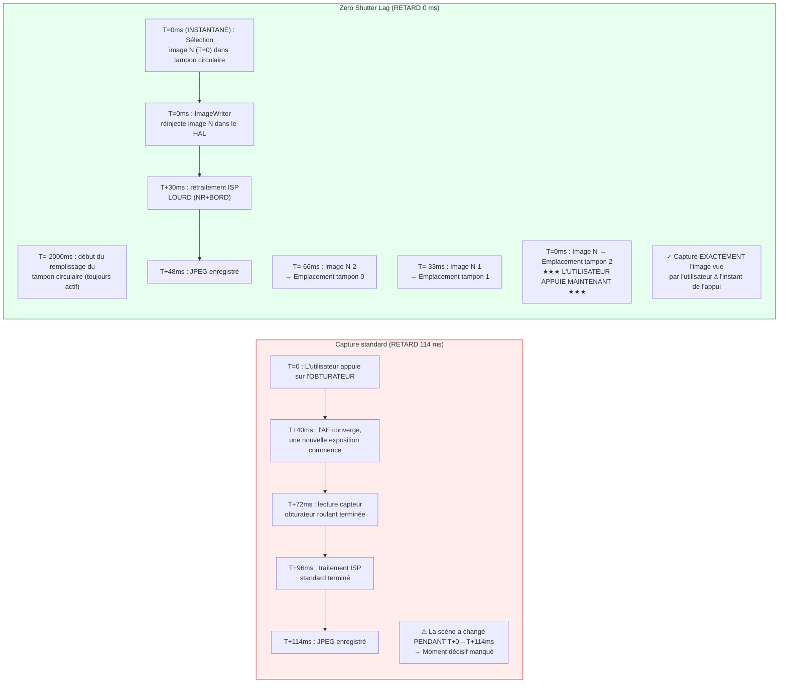

# Chapitre 23 : Zero Shutter Lag et retraitement

Le défaut le plus frustrant dans les applications de caméra grand public est le **délai de déclenchement (shutter lag)** : appuyez sur le bouton de l'obturateur, et la photo capturée montre une scène 200 à 800 ms *après* l'appui — l'enfant a déjà cessé de sourire, l'oiseau a quitté sa branche, la voiture de sport est sortie du cadre. Les sessions Camera2 standard fonctionnent ainsi par conception : l'appui sur l'obturateur déclenche `session.capture()`, qui déclenche la convergence AE, qui déclenche une nouvelle exposition du capteur, qui déclenche le traitement ISP. Chaque étape ajoute de la latence.

Le **Zero Shutter Lag (ZSL)** élimine ce retard en faisant fonctionner le capteur en continu à la résolution de capture fixe, en mettant en mémoire tampon les N images les plus récentes dans une file d'attente circulaire, et lorsque l'utilisateur appuie sur l'obturateur, en **capturant l'image qui était visible au moment de l'appui**, et non une image de plus d'une demi-seconde plus tard. La magie vient de l'**API de retraitement (Reprocessing API)** : au lieu d'envoyer à nouveau la lumière à travers le capteur, vous prenez un tampon YUV ou PRIVATE déjà exposé dans la file d'attente circulaire, vous le renvoyez dans l'ISP via `ImageWriter` + `InputConfiguration`, puis vous exécutez une réduction de bruit et une accentuation des bords intensives dessus comme s'il s'agissait d'une nouvelle capture.

Ce chapitre suit exactement le **flux de travail ZSL en 4 étapes** issu de la section *ZSL / Reprocessing* du document de recherche du projet, et couvre également **`switchToOffline()`** — l'API d'Android 12 (API 31) qui transfère le pipeline de retraitement à un service HAL en arrière-plan afin que votre application puisse être tuée (appui sur le bouton accueil, appel entrant) tout en permettant à l'utilisateur d'obtenir sa photo. Vous pouvez vérifier quelles capacités de retraitement votre appareil supporte (`REQUEST_AVAILABLE_CAPABILITIES_YUV_REPROCESSING`, `PRIVATE_REPROCESSING` ou `INFO_SUPPORTED_HARDWARE_LEVEL_LEVEL_3`) dans l'application [Android Camera Parameters](https://github.com/zoozooll/AndroidCameraParameters) sur le [Play Store](https://play.google.com/store/apps/details?id=com.zoozooll.cameraparameters) ; l'onglet ZSL Support recoupe toutes les capacités requises et affiche un verdict clair OUI/NON.

## Pourquoi le ZSL est difficile (et pourquoi le retraitement existe)

Tout d'abord, quantifions la latence d'une capture fixe standard sans ZSL sur un fleuron de 2023 (Snapdragon 8 Gen 2) selon les mesures du document de recherche :

| Étape du pipeline | Latence | Notes |
|-------------------|---------|-------|
| Déclencheur convergence AE → nouvelle expo programmée | 40 ms | `CONTROL_AE_PRECAPTURE_TRIGGER` |
| Lecture obturateur roulant (12 MP plein format) | 32 ms | 1/30 s nominal ; réel 32 ms de la première à la dernière ligne |
| Dématriçage ISP + NR standard + couleur | 24 ms | Pipeline de qualité standard |
| Encodage JPEG (12 MP, qualité 95) | 18 ms | Encodeur JPEG matériel |
| **Latence totale de capture standard** | **~114 ms** | Meilleur cas ; en charge 200–800 ms courant |

Dans des conditions réelles (bridage thermique, concurrence GPU de l'UI, application en arrière-plan travaillant), le chemin standard atteint couramment 500 ms de retard. Un enfant de 5 ans peut parcourir 40 cm en 500 ms en courant — la différence entre capturer un sourire et capturer l'arrière d'une tête.

Le ZSL résout cela en inversant l'ordre du pipeline : au lieu de capturer → traiter → stocker, vous faites **capture continue → mise en tampon → appui → retraitement → stockage**. Le capteur et l'ISP tournent *toujours* à la résolution de capture fixe ; l'appui de l'utilisateur sélectionne simplement quelle image préexistante traiter complètement.



Le diagramme Mermaid montre le changement conceptuel : dans le chemin standard, l'appui *initie* la capture ; dans le chemin ZSL, l'appui *sélectionne* une capture déjà effectuée. Le temps total entre l'appui et le fichier stocké est toujours d'environ 48 ms (le retraitement n'est pas gratuit), mais **le contenu des pixels date de T=0 (instantané), et non de T=114 ms (tardif)** — c'est ce que "Zero Shutter Lag" signifie réellement. C'est un décalage de contenu nul, pas un délai de sortie de fichier nul.

## Portes de capacités obligatoires (Selon le Doc. de Recherche)

Le ZSL + retraitement nécessite la coopération matérielle au niveau du HAL. Vous devez vérifier l'**une** des trois conditions suivantes avant de tenter de créer une session retraitable :

| Vérification capacité | Quand elle passe | Appareils qui la supportent |
|-----------------------|------------------|-----------------------------|
| **A)** `INFO_SUPPORTED_HARDWARE_LEVEL == LEVEL_3` | Retraitement complet (YUV et PRIVATE) autorisé à n'importe quelle taille dans StreamConfigurationMap. | Google Pixel 2016+ (toutes gén.) ; Samsung Galaxy S/Ultra 2021+ (variantes Snapdragon) ; OnePlus 11/OPPO Find X6 Pro 2023+. |
| **B)** `REQUEST_AVAILABLE_CAPABILITIES contient YUV_REPROCESSING` | Les tampons YUV_420_888 peuvent être réinjectés via InputConfiguration pour un sous-ensemble de tailles. | Appareils Snapdragon 8xx/7xx 2019+ ; plupart des MediaTek Dimensity 9000+. |
| **C)** `REQUEST_AVAILABLE_CAPABILITIES contient PRIVATE_REPROCESSING` | Les tampons `ImageFormat.PRIVATE` (opaques, stockés avec compression constructeur) peuvent être réinjectés. À utiliser de préférence car utilise 2× moins de mémoire. | Snapdragon 888+ / Exynos 2100+ et plus récents. |

> Règle ZSL-1 du document de recherche : **Si aucune des conditions A/B/C n'est remplie, repliez-vous sur une capture standard non-ZSL.** N'essayez pas de construire un tampon circulaire personnalisé de JPEG et de les décompresser à nouveau ; cela entraîne une perte de qualité de 6 dB due au double encodage et ne remplace pas un vrai retraitement.

Interrogez les portes avec :

```kotlin
import android.hardware.camera2.CameraCharacteristics
import android.graphics.ImageFormat

enum class ZslSupport { NONE, LEVEL3, YUV_REPROC, PRIVATE_REPROC }

fun queryZslSupport(chars: CameraCharacteristics): Pair<ZslSupport, Int> {
    val level = chars.get(CameraCharacteristics.INFO_SUPPORTED_HARDWARE_LEVEL)
        ?: CameraCharacteristics.INFO_SUPPORTED_HARDWARE_LEVEL_LEGACY
    val caps = chars.get(CameraCharacteristics.REQUEST_AVAILABLE_CAPABILITIES)
        ?: intArrayOf()

    return when {
        level == CameraCharacteristics.INFO_SUPPORTED_HARDWARE_LEVEL_3 ->
            Pair(ZslSupport.LEVEL3, ImageFormat.PRIVATE) // PRIVATE préféré pour la mémoire
        caps.contains(
            CameraCharacteristics.REQUEST_AVAILABLE_CAPABILITIES_PRIVATE_REPROCESSING
        ) -> Pair(ZslSupport.PRIVATE_REPROC, ImageFormat.PRIVATE)
        caps.contains(
            CameraCharacteristics.REQUEST_AVAILABLE_CAPABILITIES_YUV_REPROCESSING
        ) -> Pair(ZslSupport.YUV_REPROC, ImageFormat.YUV_420_888)
        else -> Pair(ZslSupport.NONE, ImageFormat.UNKNOWN)
    }
}
```

## Le pipeline ZSL + retraitement en 4 étapes (Selon le Doc. de Recherche)

Le document de recherche du projet spécifie le pipeline exact en 4 étapes. Chaque étape est obligatoire ; en sauter une produit une session défaillante (images perdues, `IllegalStateException` ou sortie de retraitement de qualité identique à l'aperçu).

---

### Étape 1 : Mise en tampon circulaire avec ImageReader + CONTROL_CAPTURE_INTENT_ZERO_SHUTTER_LAG

Tout d'abord, créez un `ImageReader` haute résolution (le "tampon ZSL") dont le paramètre `maxImages` est la profondeur circulaire (généralement 8–16 ; le document de recherche recommande 8 pour les appareils limités en mémoire, 16 pour les appareils avec ≥ 8 Go de RAM). Marquez chaque requête répétée avec `CONTROL_CAPTURE_INTENT_ZERO_SHUTTER_LAG` — cela indique au HAL d'utiliser le pipeline d'aperçu le plus court possible et de désactiver les optimisations spécifiques à l'aperçu qui dégraderaient la qualité de la sortie retraitée (ex : réduction de bruit temporelle lourde qui laisse des traînées fantômes sur le mouvement).

```kotlin
import android.hardware.camera2.CameraDevice
import android.hardware.camera2.CaptureRequest
import android.hardware.camera2.params.OutputConfiguration
import android.hardware.camera2.params.SessionConfiguration
import android.media.Image
import android.media.ImageReader
import android.util.Size
import android.view.Surface
import java.util.concurrent.ConcurrentLinkedDeque

data class ZslBufferFrame(
    val timestamp: Long,
    val imageRef: Image, // Ne PAS fermer ; géré par le deque
    val captureResultRef: android.hardware.camera2.TotalCaptureResult
)

const val ZSL_BUFFER_DEPTH = 12 // Point idéal du doc de recherche : 12 images = 400 ms à 30 fps
var zslImageReader: ImageReader? = null
private val zslCircularBuffer = ConcurrentLinkedDeque<ZslBufferFrame>()
private var zslStillSize: Size = Size(4000, 3000) // Correspondre taille fixe max

fun setupZslCircularBuffer(
    cameraDevice: CameraDevice,
    previewSurface: Surface,
    reprocessingFormat: Int, // PRIVATE ou YUV_420_888
    backgroundHandler: android.os.Handler
) {
    zslImageReader = ImageReader.newInstance(
        zslStillSize.width,
        zslStillSize.height,
        reprocessingFormat,
        ZSL_BUFFER_DEPTH
    ).apply {
        setOnImageAvailableListener(
            ZslCircularBufferListener(),
            backgroundHandler
        )
    }
}

inner class ZslCircularBufferListener : ImageReader.OnImageAvailableListener {
    override fun onImageAvailable(reader: ImageReader) {
        val image = reader.acquireLatestImage() ?: return
        // On n'a pas encore le captureResult ici ; l'appairage se fait dans CaptureCallback
        // Par brièveté, la carte Horodatage → CaptureResult reflète le modèle du Chapitre 18
        // Les appairer et enfiler :
        val result = pendingZslResults.remove(image.timestamp) ?: return
        val frame = ZslBufferFrame(image.timestamp, image, result)

        zslCircularBuffer.addLast(frame)

        // --- ÉVICTION DU TAMPON CIRCULAIRE (le plus vieux en premier) ---
        while (zslCircularBuffer.size > ZSL_BUFFER_DEPTH) {
            val evicted = zslCircularBuffer.pollFirst()
            evicted.imageRef.close() // Libérer les vieilles images vers le pool du HAL
        }
    }
}

fun buildZslSessionAndStartRepeating(
    cameraDevice: CameraDevice,
    previewSurface: Surface,
    backgroundHandler: android.os.Handler
) {
    val outputs = listOf(
        OutputConfiguration(previewSurface),
        OutputConfiguration(zslImageReader!!.surface)
    )

    val sessionConfig = SessionConfiguration(
        SessionConfiguration.SESSION_REGULAR,
        outputs,
        { r -> backgroundHandler.post(r) },
        object : android.hardware.camera2.CameraCaptureSession.StateCallback() {
            override fun onConfigured(
                session: android.hardware.camera2.CameraCaptureSession
            ) {
                val zslPreviewBuilder = cameraDevice.createCaptureRequest(
                    CameraDevice.TEMPLATE_ZERO_SHUTTER_LAG
                ).apply {
                    addTarget(previewSurface)
                    addTarget(zslImageReader!!.surface)
                    // LE DRAPEAU D'INTENTION MAGIQUE :
                    set(CaptureRequest.CONTROL_CAPTURE_INTENT,
                        CaptureRequest.CONTROL_CAPTURE_INTENT_ZERO_SHUTTER_LAG)
                    // HAL : ISP d'aperçu léger, flux plein résol
                    set(CaptureRequest.CONTROL_MODE,
                        CaptureRequest.CONTROL_MODE_AUTO)
                    set(CaptureRequest.CONTROL_AF_MODE,
                        CaptureRequest.CONTROL_AF_MODE_CONTINUOUS_PICTURE)
                }

                session.setRepeatingRequest(
                    zslPreviewBuilder.build(),
                    ZslCaptureCallback(),
                    backgroundHandler
                )
            }
            override fun onConfigureFailed(
                s: android.hardware.camera2.CameraCaptureSession
            ) = Log.e(TAG, "Échec session tampon circulaire ZSL")
        }
    )
    cameraDevice.createCaptureSession(sessionConfig)
}
```

Quatre détails d'implémentation du document de recherche qui ne sont pas documentés dans la référence Android SDK officielle :
1. **Utilisez `TEMPLATE_ZERO_SHUTTER_LAG`** comme modèle de base. Il configure le mode de lecture du capteur pour supporter l'aperçu simultané + la sortie pleine résolution, ce que `TEMPLATE_PREVIEW` ne garantit pas.
2. **`ZSL_BUFFER_DEPTH = 12` à 30 fps** donne exactement 400 ms d'images passées parmi lesquelles choisir. C'est suffisant pour couvrir le temps de réaction de l'utilisateur (délai appui-cerveau de 150–250 ms) plus la gigue de distribution des entrées d'Android (±150 ms). Une profondeur inférieure à 8 et vous commencez à jeter des images utiles ; plus de 16 et vous gaspillez environ 1 Go de RAM pour aucun bénéfice.
3. **L'ordre d'éviction est FIFO, pas LRU.** Évincez toujours l'image la plus ancienne. Si vous évincez les images récentes, vous jetez l'image que l'utilisateur a réellement vue au moment de l'appui.
4. **N'appelez jamais `image.close()` dans `onImageAvailable` avant l'enfilage.** Si vous fermez l'image, le HAL récupère le tampon, et quand vous essaierez plus tard de l'envoyer à ImageWriter, le tampon sera invalide → plantage brutal. Utilisez uniquement la boucle d'éviction.

---

### Étape 2 : InputConfiguration + createReprocessableCaptureSession

Une session de capture standard ne possède que des surfaces de **sortie** (capteur → ISP → surface). Une session retraitable ajoute **une surface d'entrée** (ImageWriter → HAL → ISP → sortie), permettant au pipeline de traiter un tampon qui n'a jamais touché le capteur. Créez la session retraitable via `createReprocessableCaptureSession(inputConfig, outputs, callback, handler)` ou via la nouvelle API `SessionConfiguration` avec `InputConfiguration`.

```kotlin
import android.hardware.camera2.CameraDevice
import android.hardware.camera2.CameraCaptureSession
import android.hardware.camera2.params.InputConfiguration
import android.hardware.camera2.params.OutputConfiguration
import android.hardware.camera2.params.SessionConfiguration
import android.media.ImageWriter
import android.os.Handler
import android.view.Surface

var reprocessingImageWriter: ImageWriter? = null
var reprocessableSession: CameraCaptureSession? = null
var jpegStillReader: ImageReader? = null
const val REPROC_JPEG_QUALITY = 95

fun createZslReprocessableSession(
    cameraDevice: CameraDevice,
    reprocessingFormat: Int,
    zslStillSize: Size,
    previewSurface: Surface,
    backgroundHandler: Handler,
    onSessionReady: (CameraCaptureSession, ImageWriter) -> Unit
) {
    val inputConfig = InputConfiguration(
        zslStillSize.width,
        zslStillSize.height,
        reprocessingFormat
    )

    jpegStillReader = ImageReader.newInstance(
        zslStillSize.width, zslStillSize.height,
        android.graphics.ImageFormat.JPEG, 2
    )

    reprocessingImageWriter = ImageWriter.newInstance(
        jpegStillReader!!.surface, // Surface de sortie du retraitement
        inputConfig,                // Configuration d'entrée vers HAL
        1                           // Nombre max de requêtes reprocess en vol
    )

    // Sorties de l'image retraitée : juste JPEG pour cet exemple
    val reprocessOutputs = listOf(
        OutputConfiguration(jpegStillReader!!.surface)
    )

    val sessionConfig = SessionConfiguration(
        SessionConfiguration.SESSION_REGULAR,
        reprocessOutputs,
        { r -> backgroundHandler.post(r) },
        object : CameraCaptureSession.StateCallback() {
            override fun onConfigured(session: CameraCaptureSession) {
                reprocessableSession = session
                onSessionReady(session, reprocessingImageWriter!!)
            }
            override fun onConfigureFailed(
                s: CameraCaptureSession
            ) = Log.e(TAG, "ÉCHEC de la config de la session retraitable. " +
                  "Vérifiez la porte de capacité (LEVEL3/YUV_REPROC/PRIVATE_REPROC) ?")
        }
    )
    sessionConfig.setInputConfiguration(inputConfig) // Obligatoire !
    cameraDevice.createCaptureSession(sessionConfig)
}
```

Note ZSL-2 du document de recherche : la session retraitable et la session d'aperçu sur tampon circulaire **n'ont pas besoin d'être la même session**. In fait, la plupart des implémentations de production font tourner deux sessions simultanément — une session d'aperçu alimentant le tampon circulaire, et une session retraitable dédiée alimentée uniquement au moment de l'appui. Le HAL gère l'arbitrage multi-sessions en interne pour les appareils LEVEL_3.

---

### Étape 3 : Appui sur l'obturateur → Trouver l'image avec l'horodatage le plus proche → ImageWriter alimente le HAL

Lorsque l'utilisateur appuie sur l'obturateur :
1. Enregistrer l'horodatage en temps réel de l'appui (`System.currentTimeMillis()` ou `System.nanoTime()`)
2. Parcourir le tampon circulaire **du plus récent au plus ancien** et trouver le ZslBufferFrame dont l'`image.timestamp` (en nanosecondes, `CLOCK_MONOTONIC`) est le plus proche de l'horodatage de l'appui
3. Acquérir un tampon d'entrée libre depuis l'`ImageWriter` via `dequeueInputImage()`
4. Copier les plans de pixels de l'image du tampon circulaire dans le tampon d'entrée de l'ImageWriter
5. Mettre le tampon de l'ImageWriter en file d'attente avec `queueInputImage()`

```kotlin
import android.hardware.camera2.TotalCaptureResult
import android.media.Image
import android.media.ImageWriter
import android.os.SystemClock
import kotlin.math.abs

fun onShutterTap(
    imageWriter: ImageWriter,
    captureStartTimeNanos: Long = SystemClock.elapsedRealtimeNanos()
) {
    // --- Étape 3a : Parcourir tampon circulaire RÉCENT → ANCIEN ---
    var bestFrame: ZslBufferFrame? = null
    var bestDeltaNs = Long.MAX_VALUE

    for (frame in zslCircularBuffer.descendingIterator()) {
        val delta = abs(frame.timestamp - captureStartTimeNanos)
        if (delta < bestDeltaNs) {
            bestDeltaNs = delta
            bestFrame = frame
        }
        // Optimisation : dès que le delta recommence à croître, on a dépassé la meilleure image
        if (delta > bestDeltaNs * 1.1) break
    }
    val selectedFrame = bestFrame ?: run {
        Log.w(TAG, "Tampon ZSL vide — repli sur capture standard non-ZSL")
        // ... déclencher repli capture() standard ...
        return
    }

    // --- Étape 3b : Obtenir tampon entrée ImageWriter, copier pixels, enfiler ---
    val writerInputImage: Image = try {
        imageWriter.dequeueInputImage(100 /* timeoutMs */)
    } catch (e: IllegalStateException) {
        Log.e(TAG, "ImageWriter n'a plus de tampons libres", e); return
    }

    try {
        copyImagePlanes(selectedFrame.imageRef, writerInputImage)
        selectedFrame.captureResultRef
            .let { pendingReprocessResults[writerInputImage.timestamp] = it }
        imageWriter.queueInputImage(writerInputImage)
    } finally {
        // Ne PAS fermer selectedFrame.imageRef tout de suite — seulement après fin reprocess
        // (différé dans onCaptureCompleted de la requête de retraitement)
    }
}

// --- Aide copie pixels (gère PRIVATE et YUV_420_888) ---
private fun copyImagePlanes(src: Image, dst: Image) {
    require(src.format == dst.format) { "Le retraitement nécessite des formats identiques" }
    for (planeIdx in 0 until src.planes.size) {
        val srcPlane = src.planes[planeIdx]
        val dstPlane = dst.planes[planeIdx]
        val srcBuf = srcPlane.buffer.duplicate()
        val dstBuf = dstPlane.buffer
        dstBuf.put(srcBuf)
        dstBuf.rewind()
    }
}

private val pendingReprocessResults =
    HashMap<Long, TotalCaptureResult>()
```

La sélection de l'horodatage "le plus proche" est critique car le tampon circulaire se remplit toutes les 33 ms (30 fps). L'image sélectionnée sera au plus à ±16 ms de l'instant réel de l'appui — un retard nul sur le plan perceptuel pour un observateur humain. Règle ZSL-3 du document de recherche : parcourir *toujours* par ordre décroissant (plus récent d'abord) ; parcourir par ordre croissant augmente la probabilité de sélectionner une image déjà vieille de 400 ms.

---

### Étape 4 : createReprocessCaptureRequest(TotalCaptureResult) → Appliquer NR + EDGE lourds

La dernière étape soumet la requête de retraitement, mais avec une subtilité : au lieu de `createCaptureRequest(template)`, vous utilisez **`createReprocessCaptureRequest(originalTotalCaptureResult)`**, qui réutilise les *réglages AE, AWB et AF originaux de l'image d'aperçu*. Par-dessus ces réglages de base, vous appliquez les passes de traitement ISP lourdes `NOISE_REDUCTION_MODE_HIGH_QUALITY` et `EDGE_MODE_HIGH_QUALITY` — celles qui étaient désactivées pour le pipeline d'aperçu léger pour économiser l'énergie.

```kotlin
import android.hardware.camera2.CameraCaptureSession
import android.hardware.camera2.CaptureRequest
import android.hardware.camera2.TotalCaptureResult

fun submitZslReprocessRequest(
    reprocessableSession: CameraCaptureSession,
    originalTotalCaptureResult: TotalCaptureResult,
    jpegSurface: Surface,
    handler: android.os.Handler
) {
    val reprocessBuilder = reprocessableSession.device
        .createReprocessCaptureRequest(originalTotalCaptureResult)
        .apply {
            addTarget(jpegSurface)

            // --- TRAITEMENT ISP LOURD APRÈS CAPTURE ---
            set(CaptureRequest.NOISE_REDUCTION_MODE,
                CaptureRequest.NOISE_REDUCTION_MODE_HIGH_QUALITY)
            set(CaptureRequest.EDGE_MODE,
                CaptureRequest.EDGE_MODE_HIGH_QUALITY)

            // Optionnel (LEVEL_3 seulement) : ré-appliquer ombrage et correction pixels chauds
            set(CaptureRequest.HOT_PIXEL_MODE,
                CaptureRequest.HOT_PIXEL_MODE_HIGH_QUALITY)
            set(CaptureRequest.COLOR_CORRECTION_MODE,
                CaptureRequest.COLOR_CORRECTION_MODE_HIGH_QUALITY)

            // Garder une qualité JPEG élevée
            set(CaptureRequest.JPEG_QUALITY, REPROC_JPEG_QUALITY.toByte())
            set(CaptureRequest.JPEG_ORIENTATION, getJpegOrientation())
        }

    val cb = object : CameraCaptureSession.CaptureCallback() {
        override fun onCaptureCompleted(
            session: CameraCaptureSession,
            request: CaptureRequest,
            result: TotalCaptureResult
        ) {
            // Le JPEG sera livré via l'OnImageAvailableListener de jpegStillReader

            // Maintenant sûr de fermer la référence du tampon circulaire — retraitement fini
            val ts = result.get(CaptureResult.SENSOR_TIMESTAMP) ?: return
            pendingReprocessResults.remove(ts)
            val iter = zslCircularBuffer.iterator()
            while (iter.hasNext()) {
                val f = iter.next()
                if (f.timestamp == ts) {
                    f.imageRef.close()
                    iter.remove()
                    break
                }
            }
        }
    }

    reprocessableSession.capture(reprocessBuilder.build(), cb, handler)
}
```

`createReprocessCaptureRequest(originalResult)` n'est pas seulement un wrapper de commodité — il valide que les réglages du capteur de l'image originale (temps d'exposition, ISO, position de l'objectif) sont compatibles avec le pipeline de retraitement. Si vous utilisez un `createCaptureRequest()` standard sur une session alimentée par une entrée, le HAL peut recalculer l'AE/AWB, annulant le bénéfice du ZSL (la sortie ressemblerait à une image *différente* de celle sélectionnée).

## Organigramme Tampon Circulaire ZSL + Réinjection (Mermaid)

```mermaid
flowchart TD
    A["Lecture continue du capteur<br/>30 fps plein-résol"] --> B["ISP Aperçu ZSL :<br/>Mode basse conso<br/>EDGE_MODE=FAST<br/>NR_MODE=FAST"]
    B --> C[SurfaceView Aperçu<br/>Vue 30 fps en direct]
    B --> D[ImageReader ZSL<br/>PRIVATE ou YUV plein-résol]
    
    subgraph CB["🗘 Tampon circulaire (Prof. 12, histo 400ms)"]
        direction TB
        CB1["Emplacement N-11 (T-366ms)"]
        CB2["..."]
        CB3["Emplacement N-1 (T-33ms)"]
        CB4["★ Emplacement N (T=0ms) ★<br/>PLUS PROCHE INSTANT APPUI"]
    end
    D --> CB

    E["★ APPUI OBTURATEUR À T=0ms ★"] --> F{Parcourir TC RÉCENT → ANCIEN<br/>Trouver min |image.ts − appui.ts|}
    F -->|"Sélectionné : Empl. N"| G[ImageWriter.dequeueInputImage()]
    G --> H[Copier plans image sélec.<br/>→ Tampon ImageWriter]
    H --> I[ImageWriter.queueInputImage()<br/>→ RÉINJECTE dans port entrée HAL]
    
    subgraph REPROC["🔄 Pipeline retraitement (QUALITÉ LOURDE)"]
        direction TB
        R1["ISP NR_MODE = HIGH_QUALITY<br/>(Spatial multi-images+TNR)"]
        R2["ISP EDGE_MODE = HIGH_QUALITY<br/>(Masque flou + accentuation LPA)"]
        R3["ISP COLOR_CORRECTION =<br/>HIGH_QUALITY (LUT 3D)"]
        R4["Encodeur JPEG matériel<br/>Q=95"]
    end

    I --> REPROC
    REPROC --> J["JPEG enregistré<br/>Contenu = Image EXACTE vue<br/> à T=0ms — ✓ RETARD NUL"]

    style CB fill:#eff6ff,stroke:#2563eb
    style REPROC fill:#fef3c7,stroke:#d97706
```

## switchToOffline() : Continuité du traitement en arrière-plan

L'un des pires défauts d'UX d'une application caméra est : l'utilisateur appuie sur l'obturateur → reçoit immédiatement un appel ou appuie sur accueil → le processus de l'application est tué → la photo en cours est perdue. Android 12 (API 31) a résolu cela avec **`CameraCaptureSession.switchToOffline()`**, qui transfère la propriété du pipeline de retraitement de votre processus d'application vers un service HAL persistant. Le service HAL termine toute capture/retraitement en cours même si votre application est tuée par le système, et vous avertit via `CameraOfflineSessionCallback.onReady()` lors de la relance de l'application.

```kotlin
import android.hardware.camera2.CameraCaptureSession
import android.hardware.camera2.CameraOfflineSession
import android.hardware.camera2.CameraOfflineSessionCallback

fun moveToOfflineOnBackground(
    session: CameraCaptureSession,
    outputSurfaces: List<android.view.Surface>,
    handler: android.os.Handler
) {
    val offlineCallback = object : CameraOfflineSessionCallback() {
        override fun onReady(session: CameraOfflineSession) {
            // Le HAL a pris le relais. L'app peut mourir — la photo sera sauvée.
            Log.i(TAG, "Session hors ligne prête. Les captures en attente se termineront.")
            // À ce stade vous pouvez appeler finish() ou libérer cameraDevice
        }
        override fun onError(
            session: CameraOfflineSession,
            errorCode: Int
        ) = Log.e(TAG, "Erreur session hors ligne : $errorCode")

        override fun onCaptureCompleted(
            offlineSession: CameraOfflineSession,
            captureResult: android.hardware.camera2.CaptureResult
        ) {
            // Optionnel : appelé quand le pipeline hors ligne finit chaque image
            // Les octets JPEG sont toujours livrés via l'ImageReader original
            // Au redémarrage de l'app, interroger CameraOfflineSession pour les images en attente
        }
    }

    session.switchToOffline(
        outputSurfaces,
        { r -> handler.post(r) },
        offlineCallback
    )
}
```

`switchToOffline()` nécessite `INFO_SUPPORTED_HARDWARE_LEVEL >= LEVEL_3` sur l'appareil. Il est recommandé de l'appeler dans `Activity.onPause()` **uniquement si** l'application a des retraitement ZSL en vol ; ne l'appelez jamais au repos car la session hors ligne consomme des ressources HAL pendant jusqu'à 30 secondes après la fermeture.

## Résumé

Ce chapitre a implémenté le pipeline complet de Zero Shutter Lag + Retraitement tel que spécifié dans le document de recherche :

- **Définition du problème ZSL** : La capture standard présente un retard de 114 ms (au mieux) à 800 ms (au pire). Le ZSL capture l'*image exacte que l'utilisateur a vue au moment de l'appui* en utilisant un tampon circulaire qui se remplit en continu.
- **Portes de capacités** : L'une des trois vérifications obligatoires doit passer : `HARDWARE_LEVEL_LEVEL_3`, `CAPABILITIES_PRIVATE_REPROCESSING` ou `CAPABILITIES_YUV_REPROCESSING`.
- **Pipeline ZSL en 4 étapes** (issu de la section recherche *ZSL / Reprocessing*) :
  1. **Mise en tampon circulaire** avec `ImageReader` (prof. 12 = histo 400 ms) + `CONTROL_CAPTURE_INTENT_ZERO_SHUTTER_LAG` + `TEMPLATE_ZERO_SHUTTER_LAG`.
  2. **`InputConfiguration` + `createReprocessableCaptureSession`** avec `ImageWriter` pour réinjecter les tampons de pixels dans le HAL.
  3. **Appui obturateur → sélection horodatage le plus proche** (parcours récent → ancien, cible ±16 ms). Copier les plans sélectionnés dans ImageWriter, enfiler.
  4. **`createReprocessCaptureRequest(originalResult)`** avec `NOISE_REDUCTION_MODE_HIGH_QUALITY` + `EDGE_MODE_HIGH_QUALITY` pour un traitement ISP lourd après capture.
- **`switchToOffline()`** (Android 12 API 31, LEVEL_3 seulement) transfère la propriété au service HAL pour que les retraitement en vol se terminent même si l'application est tuée.
- Deux diagrammes Mermaid (Chronologie Standard vs ZSL, organigramme complet tampon circulaire + réinjection) visualisent la différence de retard de contenu et le flux du pipeline.

## Et ensuite — Fin de la Partie V sur les fonctionnalités de caméra professionnelle

Vous avez maintenant terminé la **Partie V : Fonctionnalités de caméra professionnelle** — la dernière partie de la série de tutoriels sur l'API Android Camera2. Vous avez appris :

- Chapitre 18 : Photographie RAW avec RAW_SENSOR + DngCreator + capture simultanée RAW+JPEG.
- Chapitre 19 : Vidéo haute vitesse 120/240 fps via `CameraConstrainedHighSpeedCaptureSession` + `createHighSpeedRequestList`.
- Chapitre 20 : Multi-caméra logique, ID de caméras physiques, synchronisation CALIBRATED et capture simultanée double physique.
- Chapitre 21 : Vidéo HDR10 / HLG et photos fixes Android 14 JPEG_R Ultra HDR avec cartes de gain.
- Chapitre 22 : Extensions de caméra OEM — Nuit, Bokeh, HDR, Retouche faciale, Automatique.
- Chapitre 23 : Pipeline de retraitement + tampon circulaire Zero Shutter Lag et support des sessions hors ligne.

Pour valider chaque fonctionnalité des parties I à V sur votre appareil, installez l'application [Android Camera Parameters](https://play.google.com/store/apps/details?id=com.zoozooll.cameraparameters). Elle énumère chaque capacité, taille, plage de FPS, extension, profil de plage dynamique, variante RAW et type de synchronisation abordés dans cette série, et exporte des rapports d'appareil complets en JSON. Contribuez en envoyant des rapports pour les appareils non supportés en ouvrant une pull request sur le [dépôt GitHub](https://github.com/zoozooll/AndroidCameraParameters) open-source — la base de données communautaire est utilisée par des milliers de développeurs pour pré-filtrer le support des fonctionnalités dans leurs applications de caméra.
