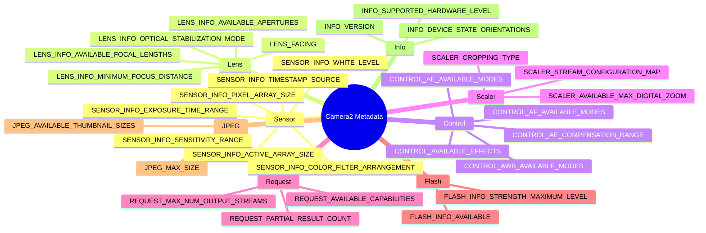

---
sidebar_position: 29
title: "कैमरा मेटाडेटा इनसाइक्लोपीडिया"
description: Sensor, Lens, Control, Scaler, Request, Flash, JPEG, Statistics और Info श्रेणियों सहित सभी आवश्यक CameraCharacteristics मेटाडेटा कुंजियों के लिए पूर्ण संदर्भ गाइड।
keywords: [CameraCharacteristics, CameraMetadata, Sensor, Lens, Control, Scaler, camera metadata reference, हिंदी]
---

import Tabs from '@theme/Tabs';
import TabItem from '@theme/TabItem';

# कैमरा मेटाडेटा इनसाइक्लोपीडिया (Camera Metadata Encyclopedia)

## साथी ऐप (Companion App)

अपने स्वयं के डिवाइस पर इस इनसाइक्लोपीडिया की हर कुंजी का लाइव निरीक्षण करें — Android Camera Parameters ऐप इंस्टॉल करें:

- **GitHub (ओपन सोर्स):** [github.com/zoozooll/AndroidCameraParameters](https://github.com/zoozooll/AndroidCameraParameters)
- **Google Play:** [play.google.com/store/apps/details?id=com.minininja.cameraparams](https://play.google.com/store/apps/details?id=com.minininja.cameraparams)

यह ऐप इस पेज पर मौजूद हर अवधारणा का एक जीवित कार्यान्वयन है।

---

## मेटाडेटा टैक्सोनॉमी (Metadata Taxonomy)



---

## परिचय (Introduction)

कैमरा मेटाडेटा इनसाइक्लोपीडिया में आपका स्वागत है। यह Android कैमरा डिवाइस की हर क्षमता का वर्णन करने वाली 300+ मेटाडेटा कुंजियों को समझने के लिए एक निश्चित संदर्भ (reference) है। Camera2 मेटाडेटा अक्सर आधिकारिक SDK में कम-दस्तावेजीकृत (under-documented) होता है। यह इनसाइक्लोपीडिया उस अंतर को भरने के लिए बनाया गया है।

नियम: पहले कुंजी को क्वेरी करें -> रिजल्ट का नल-चेक (null-check) करें -> फिर UI फीचर दिखाएं।

---

## कैमरा मेटाडेटा कैसे व्यवस्थित है

कैमरा मेटाडेटा तीन समानांतर श्रेणियों में रहता है:
1. **CameraCharacteristics**: कैमरा क्या *कर सकता* है (Static info)।
2. **CaptureRequest**: आप कैमरे से क्या *करवाना* चाहते हैं (Per-request info)।
3. **CaptureResult**: कैमरे ने वास्तव में क्या *किया* (Per-frame info)।

---

## Sensor श्रेणी

### SENSOR_INFO_ACTIVE_ARRAY_SIZE

**1. यह क्या है?**
यह एक `Rect` है जो सेंसर के सक्रिय इमेजिंग क्षेत्र के पिक्सेल निर्देशांक (coordinates) का वर्णन करता है। यह पिक्सेल का वह सबसे बड़ा आयत है जिसे वास्तव में पढ़ा जा सकता है।

**2. यह क्यों मौजूद है?**
सेंसर के बाहरी किनारे अक्सर "optically black" होते हैं और वास्तविक चित्र डेटा नहीं देते। यह कुंजी हमें बताती है कि डिजिटल ज़ूम के लिए किस निर्देशांक प्रणाली (coordinate system) का उपयोग करना है।

**3. समर्थित उपकरण?**
सभी Camera2 डिवाइस (LEGACY से LEVEL_3 तक)।

**4. क्वेरी कैसे करें?**
```kotlin
val activeArray: Rect? = characteristics.get(CameraCharacteristics.SENSOR_INFO_ACTIVE_ARRAY_SIZE)
```

**6. सामान्य गलतियाँ**
`SENSOR_INFO_PIXEL_ARRAY_SIZE` को JPEG रेज़ोल्यूशन मान लेना। हमेशा बफर साइज के लिए `activeArray` का उपयोग करें।

---

### SENSOR_INFO_SENSITIVITY_RANGE

**1. यह क्या है?**
यह एक `Range<Int>` है जो न्यूनतम और अधिकतम ISO (analog gain) मानों को दर्शाता है। सामान्य रेंज `[100, 6400]` होती है।

**4. क्वेरी कैसे करें?**
```kotlin
val sensitivityRange: Range<Int>? = characteristics.get(CameraCharacteristics.SENSOR_INFO_SENSITIVITY_RANGE)
```

**6. सामान्य गलतियाँ**
बिना `MANUAL_SENSOR` कैपेबिलिटी चेक किए मैनुअल ISO स्लाइडर दिखाना।

---

### SENSOR_INFO_EXPOSURE_TIME_RANGE

**1. यह क्या है?**
यह नैनोसेकंड (ns) में न्यूनतम और अधिकतम शटर स्पीड की रेंज है। 1 सेकंड = 1,000,000,000 ns।

**6. सामान्य गलतियाँ**
लॉन्ग एक्सपोज़र के दौरान प्रीव्यू के फ्रीज होने को क्रैश मान लेना। यह अपेक्षित व्यवहार है।

---

## Lens श्रेणी

### LENS_FACING

**1. यह क्या है?**
यह कैमरे की दिशा बताता है: `BACK` (पीछे), `FRONT` (सेल्फी), या `EXTERNAL` (USB)।

**6. सामान्य गलतियाँ**
सेल्फी कैमरे के लिए प्रीव्यू को मिरर करना लेकिन JPEG को मिरर करना भूल जाना। JPEG को EXIF टैग के माध्यम से मिरर किया जाना चाहिए।

---

### LENS_INFO_MINIMUM_FOCUS_DISTANCE

**1. यह क्या है?**
यह डायोप्टर (D) में मापी गई वह दूरी है जिसके आगे कैमरा फोकस नहीं कर सकता। `0.0` का मतलब है फिक्स्ड-फोकस (fixed-focus) लेंस।

**6. सामान्य गलतियाँ**
फिक्स्ड-फोकस कैमरे पर मैनुअल फोकस स्लाइडर दिखाना।

---

## Control श्रेणी

### CONTROL_AE_AVAILABLE_MODES

**1. यह क्या है?**
यह समर्थित ऑटो-एक्सपोज़र मोड की सूची है, जैसे `ON`, `OFF`, `ON_AUTO_FLASH` आदि।

**6. सामान्य गलतियाँ**
यह सोचना कि सिर्फ `CONTROL_AE_MODE_OFF` सेट करने से मैनुअल एक्सपोज़र काम करने लगेगा। इसके लिए `CONTROL_MODE = OFF` भी सेट करना ज़रूरी है।

---

## Scaler श्रेणी

### SCALER_STREAM_CONFIGURATION_MAP

**1. यह क्या है?**
Camera2 में सबसे महत्वपूर्ण कुंजी। यह बताती है कि कौन से फॉर्मेट (JPEG, RAW, YUV) और कौन से रेज़ोल्यूशन समर्थित हैं।

**6. सामान्य गलतियाँ**
सेंसर ओरिएंटेशन को ध्यान में रखे बिना आस्पेक्ट रेश्यो कैलकुलेट करना।

---

### SCALER_AVAILABLE_MAX_DIGITAL_ZOOM

**1. यह क्या है?**
डिजिटल ज़ूम का अधिकतम अनुपात (जैसे 10.0x)। ध्यान रखें कि 100x ज़ूम केवल मार्केटिंग है, वास्तविक क्वालिटी 2x-3x के बाद खराब हो जाती है।

---

## Request श्रेणी

### REQUEST_AVAILABLE_CAPABILITIES

**1. यह क्या है?**
कैमरा2 की सबसे महत्वपूर्ण कुंजी। यह बताती है कि क्या कैमरा `RAW`, `MANUAL_SENSOR`, `LOGICAL_MULTI_CAMERA` आदि सपोर्ट करता है।

**6. सामान्य गलतियाँ**
कैपेबिलिटी के बजाय हार्डवेयर लेवल (FULL/LIMITED) को चेक करना। हमेशा कैपेबिलिटी फ्लैग्स का उपयोग करें।

---

## Flash श्रेणी

### FLASH_INFO_AVAILABLE

**1. यह क्या है?**
क्या कैमरे में फिजिकल फ्लैश LED है? सेल्फी और अल्ट्रा-वाइड कैमरों में अक्सर यह नहीं होती।

---

## JPEG श्रेणी

### JPEG_AVAILABLE_THUMBNAIL_SIZES

**1. यह क्या है?**
EXIF थंबनेल के लिए समर्थित साइज। `0x0` का मतलब है कोई थंबनेल नहीं।

---

## Info श्रेणी

### INFO_SUPPORTED_HARDWARE_LEVEL

**1. यह क्या है?**
डिवाइस को श्रेणियों में बांटता है: `LEGACY`, `LIMITED`, `FULL`, `LEVEL_3`।

**6. सामान्य गलतियाँ**
यह मानना कि ऐप चलाने के लिए `FULL` लेवल अनिवार्य है। ऐप को `LIMITED` पर भी ग्रेसफुल फॉलबैक के साथ चलना चाहिए।

---

## संदर्भ का विस्तार करना (Extending This Reference)

यदि आप और कुंजियाँ जोड़ना चाहते हैं:
1. ऐसी श्रेणी चुनें जो यहाँ मौजूद नहीं है (जैसे Statistics)।
2. 6-पॉइंट स्ट्रक्चर का पालन करें।
3. [Android Camera Parameters](https://github.com/zoozooll/AndroidCameraParameters) पर PR भेजें।

---

*यह इनसाइक्लोपीडिया कैमरा2 विकास के लिए आपका डेस्क रेफरेंस है। इसे तब खोलें जब आपको यह जानना हो कि कोई विशिष्ट कुंजी किसी वास्तविक डिवाइस पर कैसा व्यवहार करती है।*
