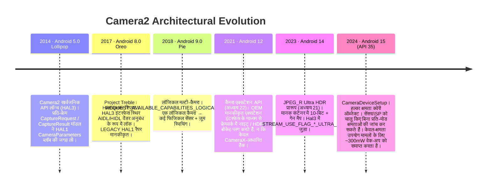

# अध्याय 28: Camera2 आर्किटेक्चर (Camera2 Architecture)

## सारांश (Summary)

यह वह अध्याय है जिसे आपने कमाया है। अध्याय 1-27 में आपने `CameraManager`, `CameraCharacteristics`, `CaptureRequest`, `CaptureResult`, `CameraCaptureSession`, `ImageReader`, CameraX, NDK नेटिव स्टैक, कोरूटीन रैपर्स और टेस्ट मॉक्स का उपयोग किया। आप हर सार्वजनिक API सरफेस को जानते हैं। अब हम क्रम में हर एब्स्ट्रैक्शन को हटाते हैं, आपके द्वारा लिखे गए Kotlin कोड की लाइन से लेकर सेंसर और SoC के बीच MIPI CSI-2 बस को पार करने वाले व्यक्तिगत इलेक्ट्रॉनों तक, लेंस समूह को 10 माइक्रोमीटर तक खिसकाने वाले वॉयस-कॉइल मोटर (VCM), और सेंसर के रोलिंग शटर के साथ माइक्रोसेकंड लॉक-स्टेप में जेनन या LED स्ट्रोब को पल्स करने वाले फ्लैश LED कंट्रोलर तक।

इस अध्याय के अंत तक आप किसी भी `CaptureRequest` को देख पाएंगे और लेयर दर लेयर मैप कर पाएंगे कि इसका प्रत्येक भाग कहाँ जाता है, कौन इसका अनुवाद करता है, कौन इसे वैलिडेट करता है, और अंत में सिलिकॉन पर इसे कौन निष्पादित करता है। आप Android 15 (API 35) `CameraDeviceSetup` एब्स्ट्रैक्शन को एक दशक लंबे आर्किटेक्चरल ट्रेंड के उदाहरण के रूप में भी समझेंगे: *क्षमता प्रश्नों (capability queries)* को *हार्डवेयर पावर स्टेट्स* से उत्तरोत्तर अलग करना ताकि ऐप्स सेंसर और ISP को चालू करने के लिए आवश्यक ~300mW जलाए बिना कैमरे की जांच कर सकें।

किसी भी वास्तविक डिवाइस की सटीक क्षमताओं का निरीक्षण करने और इस अध्याय में वर्णित आर्किटेक्चर परतों के साथ उन्हें क्रॉस-रेफरेंस करने के लिए, **Android Camera Parameters** इंस्टॉल करें ([Google Play](https://play.google.com/store/apps/details?id=com.minininja.cameraparams), [GitHub](https://github.com/zoozooll/AndroidCameraParameters))। यह हर `CameraCharacteristics` कुंजी को पढ़ता है जो नीचे की परतें सार्वजनिक API के लिए उजागर करती हैं।

---

## पूर्ण स्टैक लेयर आरेख (The Full Stack Layer Diagram)

यह पूरी पुस्तक का सबसे महत्वपूर्ण आरेख है। यहाँ से नीचे की हर परत Android Open Source Project (AOSP) में एक वास्तविक पथ, एक वास्तविक मालिक और एक वास्तविक बिंडर या फंक्शन-कॉल सीमा वाला वास्तविक कोड है। हम प्रत्येक परत को ऊपर से नीचे तक देखेंगे, फिर पिछले दशक में स्टैक के विकास को दिखाएंगे, फिर परतों में आपकी सीखने की यात्रा को मैप करेंगे।

```mermaid
graph TB
    subgraph APP["App Layer (your code)"]
        direction TB
        A1["Kotlin / Java / C++ NDK<br/>cameraManager.openCamera(id, cb, handler)<br/>session.capture(request, cb, handler)<br/>captureResult.get(SENSOR_EXPOSURE_TIME)"]
    end
    subgraph FRAME["Java/Kotlin Framework Layer — android.hardware.camera2.*"]
        direction TB
        F1["CameraManager · CameraCharacteristics<br/>CaptureRequest.Builder · CaptureResult<br/>CameraDevice · CameraCaptureSession"]
        F2["CameraBinderWrapper (AOSP frameworks/base)<br/>Translates Java objects -> AIDL Binder parcel"]
    end
    subgraph BIND["IPC Layer — Binder / HwBinder"]
        direction TB
        B1["AIDL ICameraService (AOSP)<br/>Framework <-> CameraService"]
        B2["HIDL / AIDL HAL Binder (Treble)<br/>CameraService <-> Vendor HAL"]
    end
    subgraph NS["Native Mediaserver Layer (system/bin/cameraserver)"]
        direction TB
        N1["CameraService (frameworks/av/services/camera/)"]
        N2["Camera3Device<br/>frameworks/av/services/camera/libcameraservice/device3/<br/>— Validates request vs session outputs<br/>— Builds camera3_capture_request_t<br/>— Parses camera3_capture_result_t"]
        N3["CameraProviderManager (frameworks/av)<br/>Enumerates vendor HAL implementations"]
    end
    subgraph HAL["Vendor HAL Layer (OEM / SoC code)"]
        direction TB
        H1["HAL3 Interface: camera3_device_t<br/>— process_capture_request()<br/>— process_capture_result()<br/>— flush()"]
        H2["HAL1 Wrapper (Legacy)<br/>camera2compat::Camera2Compat<br/>Translates HAL3 request->HAL1 CameraParameters<br/>for < INFO_SUPPORTED_HARDWARE_LEVEL_LIMITED"]
        H3["Vendor Implementation<br/>Qualcomm QCamera2 · MediaTek CamHAL · Samsung Exynos Camera HAL"]
    end
    subgraph K["Kernel Layer (Linux)"]
        direction TB
        K1["/dev/videoX — V4L2 Video Capture Driver<br/>VIDIOC_S_FMT · VIDIOC_REQBUFS · VIDIOC_QBUF / DQBUF"]
        K2["ISP Driver (Qualcomm CAMSS / MediaTek ISP Driver)<br/>Memory-to-memory processing V4L2 m2m node"]
        K3["Sensor Subdev Driver<br/>I2C writes for mode / exposure / gain / VCM"]
        K4["MIPI CSI-2 Receiver Driver (SoC)<br/>Lane configuration, LP/HS transitions, ECC/CRC check"]
    end
    subgraph HW["Physical Hardware Layer"]
        direction TB
        HW1["Lens Assembly<br/>VCM Voice Coil Motor (I2C)<br/>Moves lens group for focus / OIS"]
        HW2["Camera Sensor Pixel Array<br/>CMOS sensor (Sony IMX / Samsung ISOCELL / OmniVision)<br/>Expose -> Readout -> A/D"]
        HW3["MIPI CSI-2 Physical Bus<br/>2/4/8 differential pairs at 1.5 – 2.5 Gbps/lane"]
        HW4["ISP Image Signal Processor (on SoC)<br/>Demosaic · Noise Reduction · Sharpen · HDR merge · Face detect in hardware"]
        HW5["Flash LED Controller (I2C)<br/>Xenon strobe or LED current sink<br/>Synced to sensor EXRST pin"]
    end

    APP -->|function call| FRAME
    FRAME -->|AIDL parcel| BIND
    BIND -->|HwBinder| NS
    NS -->|HAL3 AIDL/HIDL| HAL
    HAL -->|ioctl() syscalls| K
    K -->|I2C writes + MIPI lane signals + ISP command queues| HW

    style APP fill:#e6d9f2
    style FRAME fill:#d9e6f2
    style BIND fill:#fff3cd,stroke:#ffc107,stroke-width:2px
    style NS fill:#d9f2e6
    style HAL fill:#f2d9e6
    style K fill:#e6d9e6
    style HW fill:#f2e6d9,stroke:#d4a373,stroke-width:2px
```

अब ऊपर से नीचे चलते हैं।

---

## लेयर 1 — ऐप लेयर (App Layer - Your Code)

यह वह कोड है जो आपने लिखा है। `cameraManager.openCamera(id, stateCallback, cameraHandler)`। आप इस परत को दिल से जानते हैं। दो तथ्य जिन्हें आपने शायद आत्मसात नहीं किया होगा:
- आपके द्वारा किया गया हर एक `CaptureRequest.Builder.set(key, value)` कॉल एक *टैग्ड मेटाडेटा प्रविष्टि (tagged metadata entry)* को एक पार्सलेबल संरचना में जोड़ता है जो `system/media/camera/include/system/camera_metadata.h` में `camera_metadata_t` C स्ट्रक्चर को बिल्कुल मिरर करती है। आपके Kotlin `CaptureRequest` और HAL के रिक्वेस्ट के बीच कोई जादुई अनुवाद नहीं है - वे एक ही बाइनरी मेटाडेटा प्रारूप हैं, बस अलग-अलग भाषा बाइंडिंग के साथ लिपटे हुए हैं।
- आपके द्वारा किया गया हर `CaptureResult.get(key)` कॉल उन सटीक बाइट्स को पढ़ता है जो HAL ने रिस्पॉन्स बफर में लिखे थे। यदि कोई HAL किसी विशिष्ट OTA बिल्ड पर एक्सपोज़र समय को गलत रिपोर्ट करता है, तो आपका ऐप बिल्कुल वही गलत मान पढ़ता है। HAL के ऊपर कोई फ्रेमवर्क-स्तरीय सत्यापन परत नहीं है जो वेंडर की गलतियों को सुधारती हो। यही कारण है कि अध्याय 27 का रियल-हार्डवेयर सैनिटी टेस्ट मौजूद है।

---

## लेयर 2 — Java/Kotlin फ्रेमवर्क लेयर (`android.hardware.camera2.*`)

फ्रेमवर्क लेयर (AOSP `frameworks/base/core/java/android/hardware/camera2/`) केवल दो काम करती है:
1. सार्वजनिक API सरफेस (`CameraManager`, `CameraDevice`, आदि) को उजागर करती है जिसे आप कॉल करते हैं।
2. `CaptureRequest` / `CaptureResult` Java ऑब्जेक्ट्स और उनके बिंडर-पार्सलेबल ऑन-द-वायर अभ्यावेदन के बीच अनुवाद करती है।

यह HAL के ऊपर कोई नीति प्रवर्तन (policy enforcement) नहीं करती है। यह कोई मेटाडेटा रीराइटिंग नहीं करती है। यह फिक्स नहीं करती है। यह एक पतली अनुवाद परत है और डिवाइस बूट के समय प्रति कैमरा आईडी एक बार प्राप्त `CameraCharacteristics` ब्लॉब के लिए एक कैश है।

बिंडर सीमा `CameraManager` → `ICameraService` AIDL में है, जो अगली परत है।

---

## लेयर 3 — IPC लेयर: बिंडर / HwBinder (Treble)

यह महत्वपूर्ण आर्किटेक्चरल अनुबंध है जिसे प्रोजेक्ट ट्रेबल (Project Treble - Android 8.0, 2017) ने लॉक कर दिया था। इसमें दो बिंडर डोमेन शामिल हैं:

| बिंडर डोमेन | किसे जोड़ता है | प्रोटोकॉल | ABI स्थिरता कौन लागू करता है |
|:---|:---|:---|:---|
| `/dev/binder` | Framework ↔ cameraserver (system_server side) | AIDL | प्लेटफ़ॉर्म (समान पार्टीशन बिल्ड) |
| `/dev/hwbinder` | cameraserver ↔ vendor camera HAL | HIDL / AIDL HAL | Treble (स्थिर वेंडर इंटरफेस) |

ट्रेबल से पहले, HAL एक `.so` फाइल थी जिसे सीधे `cameraserver` की प्रक्रिया में लोड किया जाता था। OEM के हर OTA को कैमरा *और* फ्रेमवर्क को एक साथ फिर से बनाना पड़ता था। ट्रेबल के HwBinder विभाजन का मतलब है कि वेंडर HAL अपनी खुद की प्रक्रिया, अपना खुद का पार्टीशन, अपनी खुद की 3-वर्षीय सुरक्षा अपडेट टाइमलाइन है, और इसके और `cameraserver` के बीच अनुबंध वर्शन और डिवाइस के जीवनकाल के लिए फ्रीज है। एक ऐप डेवलपर के रूप में आपके लिए, यही एकमात्र सबसे बड़ा कारण है कि Camera2 API व्यवहार OTA में अनुमानित है: वेंडर HAL इंटरफेस ट्रेबल अनुपालन परीक्षण को तोड़े बिना शाब्दिक रूप से बदल नहीं सकता है।

लीगेसी HAL1 रैपर इस सीमा के नीचे, वेंडर HAL प्रक्रिया के अंदर रहता है, इसलिए यह ऐप लेयर पर आपके लिए अदृश्य है सिवाय `INFO_SUPPORTED_HARDWARE_LEVEL_LEGACY` के माध्यम से।

---

## लेयर 4 — नेटिव मीडियासर्वर लेयर: `CameraService` / `Camera3Device`

`/system/bin/cameraserver` एक नेटिव डेमन (daemon) है जो बूट के समय `init.rc` द्वारा शुरू किया जाता है। यह हमेशा चलता रहता है, डिवाइस पर हर खुले कैमरे का मालिक होता है, और यह एकमात्र निर्णायक है कि किस ऐप को कैमरा एक्सेस मिलता है (शीर्ष-फोरग्राउंड ऐप जीतता है; बाकी सब डिस्कनेक्ट हो जाते हैं)।

इसके दो सबसे महत्वपूर्ण क्लासेज़:

1. **`CameraService`** (`frameworks/av/services/camera/libcameraservice/CameraService.cpp`):
   - फ्रेमवर्क में `ICameraService` AIDL को उजागर करता है।
   - हर बिंडर कॉल के लिए `android.permission.CAMERA` अनुमति जांच लागू करता है (बिना CAMERA अनुमति वाले ऐप की कॉल को HAL तक पहुँचने से पहले ही `cameraserver` में खारिज कर दिया जाता है)।
   - समवर्ती ओपन आर्बिट्रेशन (दो ऐप एक ही कैमरे का अनुरोध करते हैं → टॉप एक्टिविटी को मिलता है; बैकग्राउंड ऐप को `onDisconnected` मिलता है) को हैंडल करता है।
   - वेंडर HAL मॉड्यूल को एन्युमरेट करने के लिए `CameraProviderManager` का प्रबंधन करता है।

2. **`Camera3Device`** (`frameworks/av/services/camera/libcameraservice/device3/Camera3Device.cpp`):
   - पाइपलाइन का दिल।
   - वैलिडेट करता है कि कैप्चर रिक्वेस्ट में हर आउटपुट सरफेस वास्तव में सेशन के कॉन्फ़िगर किए गए आउटपुट सेट का हिस्सा है। (यहीं फ्रेमवर्क `IllegalArgumentException: Surface not in configured outputs` थ्रो करता है।)
   - आपके पार्सल किए गए `CaptureRequest` को HAL3 `camera3_capture_request_t` स्ट्रक्चर में पैकेज करता है।
   - `process_capture_request(request)` के माध्यम से एक-एक करके HAL में रिक्वेस्ट स्ट्रीम करता है।
   - HAL से वापस `camera3_capture_result_t` प्राप्त करता है, मेटाडेटा + फेंस को पार्सल करता है, और उन्हें आपके `CaptureCallback.onCaptureCompleted` के बिंडर चैन के माध्यम से वापस भेजता है।
   - आपके लिए `flush()`, एरर पाथ, `notify()` शटर और एरर कॉलबैक और EGL/Vulkan इंटरऑपरेबिलिटी के लिए आउटपुट बफर रिलीज फेंस को हैंडल करता है।

`Camera3Device` C++ की ~15,000 लाइनें है और पूरे स्टैक का सबसे भारी परीक्षण किया गया हिस्सा है। यदि आप कभी कोई बग रिपोर्ट पढ़ते हैं जिसमें कहा गया है कि "यह रिक्वेस्ट की Camera2 NDK पर काम करती है लेकिन Java Camera2 पर नहीं," तो विसंगति लगभग हमेशा `Camera3Device` के अंदर गायब वैलिडेशन या कन्वर्शन पाथ होती है।

---

## लेयर 5 — वेंडर HAL लेयर: HAL3 (`camera3_device_t`)

यहीं पर OEM भेदभाव (differentiation) वास्तव में रहता है। हर SoC वेंडर अपना खुद का HAL3 कार्यान्वयन भेजता है:

| वेंडर | HAL कोडनाम | AOSP इंटरफेस |
|:---|:---|:---|
| Qualcomm | QCamera2 / QCamera3 (mm-camera codebase) | `camera3_device_t` + `vendor.qti.hardware.camera*` एक्सटेंशन |
| MediaTek | CamHAL (mtkcam) | वही `camera3_device_t` + MediaTek एक्सटेंशन |
| Samsung | Exynos Camera HAL | वही `camera3_device_t` + Samsung एक्सटेंशन |
| Google Tensor | Google Camera HAL (Pixels) | वही `camera3_device_t` + नाइट साइट / कंप्यूटेशनल रॉ के लिए Google कस्टम लॉजिक |

HAL3 अनुबंध (contract) खुले डिवाइस पर बिल्कुल चार मुख्य ऑपरेशन हैं:

```cpp
// HAL3 सरलीकृत अनुबंध — यह पूरा इंटरफेस है
typedef struct camera3_device {
    hw_device_t common;

    int (*configure_streams)(
        const struct camera3_device *,
        camera3_stream_configuration_t *stream_list
    );

    int (*process_capture_request)(
        const struct camera3_device *,
        camera3_capture_request_t *request
    );

    void (*get_metadata_vendor_tag_ops)(...);

    int (*flush)(const struct camera3_device *);

    void (*dump)(...);
} camera3_device_t;
```

HAL रिक्वेस्ट प्राप्त करता है, परिणाम और आउटपुट बफर तैयार करता है। बस इतना ही। रिक्वेस्ट/रिस्पॉन्स मॉडल HAL3 के हस्ताक्षर (signature) है - HAL1 एक सिंगल `CameraParameters` स्ट्रिंग ब्लॉब (`"preview-size=1920x1080;picture-size=..."`) था जिसे पूरा उद्योग प्रति-फ्रेम नियंत्रण की कमी के कारण नापसंद करता था। HAL3 का रिक्वेस्ट/रिस्पॉन्स मॉडल वह है जो उन सभी उन्नत सुविधाओं को *सक्षम* बनाता है जिनका आपने इस पुस्तक में उपयोग किया है: प्रति-फ्रेम मैनुअल एक्सपोज़र, RAW कैप्चर, मल्टी-कैमरा फिजिकल स्ट्रीम, रीप्रोसेसिंग, ZSL इनपुट सरफेस। HAL1 के तहत यह सब असंभव था।

### लीगेसी HAL1 रैपर (The LEGACY HAL1 Wrapper)

`INFO_SUPPORTED_HARDWARE_LEVEL_LEGACY` का मतलब है कि वेंडर ने *अभी भी* केवल एक HAL1 `.so` भेजा है और डिवाइस पुराने `CameraParameters` ब्लॉब + `startPreview()`/`takePicture()` HAL1 प्रविष्टि बिंदुओं में वापस HAL3 रिक्वेस्ट/रिस्पॉन्स कॉल का अनुवाद करने के लिए AOSP के `camera2compat::Camera2Compat` शिम (shim) का उपयोग करता है। यह अनुवाद परत ही कारण है कि अध्याय 24 ने आपको चेतावनी दी थी कि `CONTROL_MODE_OFF` चुपचाप `LEGACY` डिवाइस पर कुछ नहीं करता है - HAL1 में अनुवाद करने के लिए कोई प्रति-फ्रेम `CONTROL_MODE` अवधारणा नहीं है। शिम उस मेटाडेटा प्रविष्टि को छोड़ देता है।

---

## लेयर 6 — कर्नेल लेयर: V4L2 + MIPI CSI-2 + सेंसर ड्राइवर

HAL3 प्रक्रिया डिवाइस नोड्स पर विशेष रूप से `ioctl()` सिस्टम कॉल के माध्यम से Linux कर्नेल को कॉल करती है। एक सिंगल फ्रेम को प्रोसेस करने के लिए कर्नेल ड्राइवर की चार श्रेणियां इंटरैक्ट करती हैं:

1. **MIPI CSI-2 रिसीवर ड्राइवर** (`/dev/v4l-subdevX`): PHY लेन काउंट और डेटा रेट कॉन्फ़िगर करता है, डिफरेंशियल पेयर पर लो-पावर से हाई-स्पीड ट्रांज़िशन को हैंडल करता है, पैकेट ECC/CRC को वैलिडेट करता है, और प्राप्त पिक्सेल लाइनों को ISP के इनपुट रिंग बफर में DMA करता है। आप यूजर स्पेस से इस ड्राइवर को कभी नहीं छूते हैं। एक खराब CSI-2 CRC आपके लिए `camera3_stream_buffer_t.status == BUFFER_ERROR` के साथ एक दूषित (corrupted) आउटपुट बफर के रूप में प्रकट होता है।

2. **सेंजर सबदेव ड्राइवर** (`/dev/v4l-subdevY`, I2C-नियंत्रित):
   - I2C (एक धीमी, ~100KHz साइड-बैंड बस) पर सेंसर रजिस्टर लिखता है, यही कारण है कि `HARDWARE_LEVEL_3` डिवाइस के लिए भी एक्सपोज़र परिवर्तन और मोड स्विच में ~2-3 फ्रेम की विलंबता होती है।
   - एक्सपोज़र टाइम (प्रति-फ्रेम रोलिंग शटर स्टार्ट/स्टॉप), एनालॉग गेन, डिजिटल गेन, रेज़ोल्यूशन, बिनिंग मोड सेट करता है।
   - वॉयस कॉइल में करंट भेजने वाले I2C DAC के माध्यम से VCM फोकस को नियंत्रित करता है (HW लेयर देखें)।
   - सेंसर-साइड EXRST आउटपुट पिन के माध्यम से फ्लैश स्ट्रोब सिंक्रोनाइज़ेशन को नियंत्रित करता है जिसे फ्लैश कंट्रोलर सुनता है।

3. **V4L2 वीडियो कैप्चर नोड** (`/dev/video0` आदि): HAL gralloc-backed बफर (बिल्कुल वही `AHardwareBuffer` हैंडल जिन्हें आपने अध्याय 25 में Vulkan में इम्पोर्ट किया था) आवंटित करने के लिए `VIDIOC_REQBUFS` कॉल करता है, फिर एक लूप में `VIDIOC_QBUF` (बफर को एनक्यू करना) कॉल करता है। जैसे ही CSI-2 रिसीवर + ISP से फ्रेम आते हैं, HAL `VIDIOC_DQBUF` (बफर को डीक्यू करना) कॉल करता है और इसे `Camera3Device` को `camera3_stream_buffer_t` के रूप में भेजता है।

4. **ISP मेमोरी-टू-मेमोरी ड्राइवर** (`/dev/videoN m2m` नोड): कैप्चर पाथ से अलग, HAL पहले से कैप्चर किए गए RAW फ्रेम पर डेमोसैक, डेनोइज़, HDR मर्ज या फेस डिटेक्शन चलाने के लिए ISP m2m क्यू में रीप्रोसेसिंग इनपुट बफर (ZSL के लिए, अध्याय 23) डालता है। परिणाम एक प्रोसेस्ड JPEG/YUV/PRIVATE आउटपुट बफर के रूप में उभरता है।

---

## लेयर 7 — भौतिक हार्डवेयर लेयर (Physical Hardware Layer)

अंत में, इलेक्ट्रॉन। ऊपर की हर परत SoC पर निष्पादित होने वाला कोड है। हार्डवेयर लेयर वह जगह है जहाँ फोटोन को इलेक्ट्रॉनों में परिवर्तित और संसाधित किया जाता है:

```mermaid
graph LR
    LENS["Lens Group<br/>Glass elements<br/>~10–20mm focal length"] --> VCM["VCM Voice Coil Motor<br/>I2C DAC → coil current →<br/>lens displacement ±50 µm<br/>Focus + OIS stabilization"]
    VCM --> SENSOR[CMOS Sensor Pixel Array<br/>Sony IMX / Samsung ISOCELL<br/>~12MP – 200MP<br/>rolling shutter: readout line-by-line<br/>Global shutter (rare) on industrial sensors]
    SENSOR -->|A/D converted 10/12/14-bit Bayer| CSI[MIPI CSI-2 PHY<br/>2/4/8 pairs<br/>up to 20 Gbps aggregate]
    CSI -->|SoC-internal interconnect| ISP[ISP — on SoC die<br/>Demosaic · CCM · NR · 3A stats · HDR merge<br/>often 1 TOPS+ of DNN for face/segmentation]
    ISP -->|Gralloc buffers → DRAM| CPU[CPU / GPU<br/>Your app's process reads them]
    FLASH["Flash LED / Xenon<br/>I2C flash controller<br/>Strobe synced to sensor EXRST"] --> SENSOR
```

प्रत्येक भौतिक उप-प्रणाली:
- **Lens & VCM**: लेंस का 10µm मूवमेंट AF का एक चरण है। OIS (Optical Image Stabilization) VCM में क्लोज्ड-लूप जाइरो फीडबैक जोड़ता है, हाथ के कंपन को रद्द करने के लिए लेंस को प्रति सेकंड 500-5000 बार थोड़ा सा खिसकाता है। कर्नेल ड्राइवर I²C DAC मान लिखता है; आपका ऐप `LENS_FOCUS_DISTANCE` और `LENS_OPTICAL_STABILIZATION_MODE` मेटाडेटा कुंजियों के माध्यम से इसे नियंत्रित करता।
- **सेंसर पिक्सेल एरे**: फोटोडायोड आपतित फोटोन काउंट के समानुपाती चार्ज जमा करते हैं। रीडआउट रोलिंग-शटर (ऊपर से नीचे लाइन दर लाइन) है, यही कारण है कि अध्याय 14 में आपके AE स्लाइडर में 2-3 फ्रेम की विलंबता थी - फ्रेम N के लिए एक्सपोज़र फ्रेम N-1 के रीडआउट के दौरान प्रोग्राम किया जाता है।
- **MIPI CSI-2 बस**: 2.5Gbps/लेन × 8 लेन = 20Gbps रॉ तक डिफरेंशियल पेयर। 60fps 4K 12-bit बायर के लिए पर्याप्त से अधिक। पैकेट एरर हार्डवेयर में CRC पुर्नप्रसार (retransmission) को ट्रिगर करते हैं लेकिन एक दूषित फ्रेम आप तक `BUFFER_ERROR` के रूप में पहुँचता है।
- **ISP**: कम आंका गया नायक। इसका डेमोसैक + शोर कम करना + शार्पनिंग हार्डवेयर 1+ गीगापिक्सेल/सेकंड पर चलता है और आपके CPU को इसे करने से बचाता है। आधुनिक Tensor / Snapdragon SoC पर यह CPU द्वारा फ्रेम देखने से पहले ही सीन सेगमेंटेशन, फेस डिटेक्शन और इन-सेंसर HDR मर्ज के लिए DNN एक्सेलरेटर भी चलाता है।
- **फ्लैश कंट्रोलर**: फ्लैश पल्स उस फ्रेम की रोलिंग-शटर एक्सपोज़र विंडो के दौरान *बिल्कुल* फायर होनी चाहिए जिसे उसे रोशन करना है। `CaptureResult` में `FLASH_STATE_FIRED` बिट संरेखण की पुष्टि करता है; गलत संरेखण के परिणामस्वरूप आंशिक रूप से उजागर (exposed) फ्रेम मिलते हैं।

---

## आर्किटेक्चरल विकास: Android वर्शन्स के माध्यम से Camera2

Camera2 एक दिन में नहीं बना था। हर 2-3 Android वर्शन्स ने एक नया आर्किटेक्चरल प्रिमिटिव जोड़ा जिसने डेवलपर्स के लिए वास्तविक सुविधाओं को अनलॉक किया:



हर रिलीज़ में रुझान स्पष्ट है: **डिकपलिंग (Decoupling)**।
- Android 8 ने HAL को फ्रेमवर्क से अलग किया (Treble)।
- Android 9 ने लॉजिकल कैमरा आईडी को फिजिकल सेंसर से अलग किया।
- Android 12 ने OEM एक्सटेंशन को ऐप कोड से अलग किया।
- Android 14 ने HDR एन्कोडिंग को RAW पाइपलाइन से अलग किया।
- **Android 15 का `CameraDeviceSetup` क्षमता प्रश्नों को हार्डवेयर पावर स्टेट्स से अलग करता है।**

---

## सारांश (Summary)

Camera2 एक सात-परत वाला स्टैक है: App → Framework (Java/Kotlin `android.hardware.camera2.*`) → Binder/HwBinder IPC → Native `CameraService` + `Camera3Device` → Vendor HAL3 (`camera3_device_t`, एक LEGACY HAL1 रैपर के साथ) → V4L2 Kernel drivers (MIPI CSI-2, सेंसर, कैप्चर, ISP m2m) → भौतिक हार्डवेयर (lens/VCM, सेंसर, MIPI बस, ISP, फ्लैश कंट्रोलर)। प्रोजेक्ट ट्रेबल ने HwBinder के माध्यम से HAL अनुबंध को लॉक कर दिया, जिससे दीर्घकालिक स्थिरता सुनिश्चित हुई। दशक भर पुराना आर्किटेक्चरल रुझान प्रगतिशील डिकपलिंग है, जो Android 15 के `CameraDeviceSetup` में समाप्त होता है, जो सेंसर को पावर दिए बिना क्षमताओं की जांच कर सकता है। आपने अब हर फीचर को मैप कर लिया है - अध्याय 14 में मैन्युअल ISO से लेकर अध्याय 23 में ZSL तक और अध्याय 25 में नेटिव Vulkan ज़ीरो-कॉपी तक - उस सटीक परत तक जो इसे निष्पादित करती है।

## आगे क्या है: भाग VII — कैमरा मेटाडेटा इनसाइक्लोपीडिया

यह भाग VI को समाप्त करता है: आधुनिक Android कैमरा विकास। शेष सीमा सभी 28 अध्यायों में आपके द्वारा उपयोग की जा रही हर `CameraCharacteristics`, `CaptureRequest`, और `CaptureResult` मेटाडेटा कुंजी के लिए एक विस्तृत, विश्वकोश संदर्भ (encyclopedic reference) है। भाग VII मेटाडेटा इनसाइक्लोपीडिया है: SENSOR, LENS, CONTROL, SCALER, REQUEST — हर टैग को परिभाषित किया गया है, समझाया गया है, वास्तविक उपकरणों के साथ क्रॉस-चेक किया गया है, और Android Camera Parameters ऐप के माध्यम से वैलिडेट किया गया है। इसे तब खोलें जब आपको यह जानने की आवश्यकता हो कि `SCALER_CROPPING_TYPE` का वास्तव में क्या अर्थ है, कौन से डिवाइस `REQUEST_AVAILABLE_CAPABILITIES_OFFLINE_PROCESSING` को सपोर्ट करते हैं, या कोई विशिष्ट कुंजी वास्तव में एक वास्तविक `LEGACY` HAL पर कैसा व्यवहार करती है।
