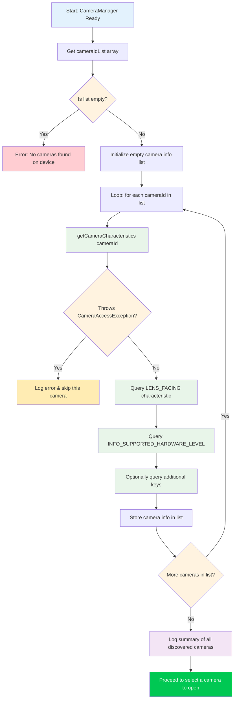

# अध्याय 6: कैमरों की खोज (Discovering Cameras)

अध्याय 5 में, आपने सफलतापूर्वक `CameraManager` को इनिशियलाइज़ किया और कैमरा आईडी की सूची प्राप्त की — लेकिन `"0"` या `"2"` जैसी स्ट्रिंग आपको इस बारे में कुछ नहीं बताती है कि वह कैमरा वास्तव में **क्या** है। क्या यह अल्ट्रा-वाइड रियर कैमरा है? सेल्फी कैमरा? या OTG के माध्यम से जुड़ा एक बाहरी USB वेबकैम? यह अध्याय आपको `CameraCharacteristics` का उपयोग करके उन सवालों के जवाब देना सिखाता है, जो मेटाडेटा कंटेनर है जो कैमरा डिवाइस की हर क्षमता का वर्णन करता है।

कैमरा एन्युमरेशन (enumeration) और विशेषताओं के निरीक्षण के उत्पादन-ग्रेड संदर्भ कार्यान्वयन के लिए, **Android Camera Parameters** ऐप देखें ([GitHub](https://github.com/zoozooll/AndroidCameraParameters), [Google Play](https://play.google.com/store/apps/details?id=com.minininja.cameraparams))। यह डिवाइस पर हर कैमरे के लिए `CameraCharacteristics` में हर कुंजी को एक्सप्लोर करता है और परिणामों को एक खोजने योग्य, फ़िल्टर करने योग्य UI में प्रस्तुत करता है।

## कैमरा आईडी को समझना (Understanding Camera IDs)

विशेषताओं में गोता लगाने से पहले, हमें नए Camera2 डेवलपर्स के लिए भ्रम के एक मौलिक स्रोत को संबोधित करने की आवश्यकता है: **संख्यात्मक कैमरा आईडी स्ट्रिंग्स का वास्तव में क्या अर्थ है?**

जब आप `cameraManager.cameraIdList` कॉल करते हैं, तो आपको एक `Array<String>` वापस मिलता है — उदाहरण के लिए: `["0", "1", "2", "3", "4"]`। ऐसी धारणाएं बनाना **लुभावना** है जैसे:
- `"0"` = रियर वाइड कैमरा
- `"1"` = फ्रंट कैमरा
- `"2"` = टेलीफोटो

**ऐसा कभी न करें।** आईडी → फिजिकल कैमरा का मैपिंग है:
1. **डिवाइस-विशिष्ट**: एक Pixel 8 फ्रंट कैमरे के लिए आईडी `"1"` का उपयोग कर सकता है, जबकि Samsung Galaxy S24 आईडी `"3"` का उपयोग करता है।
2. **वर्शन-विशिष्ट**: एक OEM OTA अपडेट डिवाइस शिप होने के बाद आईडी सूची को बदल सकता है।
3. **रीबिल्ड-विशिष्ट**: कुछ मल्टी-कैमरा लॉजिकल डिवाइस मोड के आधार पर अंतर्निहित फिजिकल कैमरों को गतिशील रूप से उजागर या छुपाते हैं।

**एकमात्र** सही दृष्टिकोण उन गुणों के आधार पर एक कैमरा **चुनना** है जिनकी आप परवाह करते हैं (लेंस फेसिंग, हार्डवेयर स्तर, फोकल लेंथ रेंज, आदि)।

## कैमरा एन्युमरेशन फ्लो (Camera Enumeration Flow)

कैमरों की खोज करने के लिए समग्र एल्गोरिदम सतह पर सीधा है, लेकिन त्रुटि प्रबंधन (error handling) के आसपास महत्वपूर्ण एज केस हैं।



## CameraCharacteristics का परिचय

`CameraCharacteristics` एक अपरिवर्तनीय (immutable), रीड-ओनली की-वैल्यू मैप है जो कैमरे की हार्डवेयर-स्तरीय क्षमताओं का वर्णन करता है।

आप निम्न के साथ एक विशेषताओं वाला ऑब्जेक्ट प्राप्त करते हैं:
```kotlin
val characteristics: CameraCharacteristics =
    cameraManager.getCameraCharacteristics(cameraId)
```

और आप जेनेरिक `get` मेथड के साथ अलग-अलग कुंजियों को क्वेरी करते हैं:
```kotlin
val lensFacing: Int? = characteristics.get(CameraCharacteristics.LENS_FACING)
```

## कुंजी 1: LENS_FACING — फ्रंट, बैक, या एक्सटर्नल

पहली चीज़ जो लगभग हर कैमरा ऐप को जाननी चाहिए वह यह है कि लेंस किस दिशा में इंगित करता है। Camera2 तीन स्थिरांक (constants) परिभाषित करता है:

| स्थिरांक | मान | अर्थ |
|---|---|---|
| `LENS_FACING_BACK` | `0` | कैमरा डिवाइस के पीछे है, उपयोगकर्ता से दूर |
| `LENS_FACING_FRONT` | `1` | कैमरा डिवाइस के सामने है, उपयोगकर्ता की ओर |
| `LENS_FACING_EXTERNAL` | `2` | कैमरा डिवाइस के बाहर है (जैसे, USB OTG वेबकैम) |

## कुंजी 2: INFO_SUPPORTED_HARDWARE_LEVEL — यह कैमरा क्या कर सकता है?

हार्डवेयर स्तर Camera2 में सबसे महत्वपूर्ण क्षमता वर्गीकरण है। यह आपको बताता है कि कैमरा हार्डवेयर और HAL (हार्डवेयर एब्स्ट्रैक्शन लेयर) पूर्ण Camera2 पाइपलाइन को लागू करते हैं या पुराने Camera API के चारों ओर एक लीगेसी संगतता रैपर (compatibility wrapper) का उपयोग कर रहे हैं।

| स्तर | मान | अर्थ |
|---|---|---|
| `LEGACY` | `2` | लीगेसी HAL मोड। बहुत सीमित कार्यक्षमता, कोई मैनुअल कंट्रोल नहीं, कोई RAW नहीं। |
| `LIMITED` | `0` | सीमित HAL3 सपोर्ट। बुनियादी कैप्चर, लेकिन उन्नत सुविधाएँ गायब हैं। |
| `FULL` | `1` | पूर्ण HAL3 सपोर्ट। मैनुअल सेंसर कंट्रोल, प्रति-फ्रेम सेटिंग्स, RAW आउटपुट। |
| `LEVEL_3` | `3` | विस्तारित HAL3 सपोर्ट। रीप्रोसेसिंग, मल्टी-फ्रेम इनपुट जोड़ता है। |
| `EXTERNAL` | `4` | बाहरी कैमरा (USB/OTG)। सीमित सुविधाएँ। |

:::tip
Android Camera Parameters ऐप में हर कैमरे के लिए प्रमुख बैज के रूप में हार्डवेयर लेवल दिखाया जाता है ताकि आप जल्दी से देख सकें कि प्रत्येक डिवाइस क्या सपोर्ट करता है।
:::

## पूर्ण Kotlin कोड: कैमरा डिस्कवरी यूटिलिटी (Camera Discovery Utility)

अब सब कुछ एक साथ जोड़ते हैं।

```kotlin
// ... (इम्पोर्ट और क्लास सेटअप)

    data class CameraInfo(
        val id: String,
        val lensFacing: Int?,
        val hardwareLevel: Int?
    ) {
        fun description(): String = buildString {
            append("Camera ID: $id | ")
            append("Facing: ${lensFacingToString(lensFacing)} | ")
            append("HW Level: ${hardwareLevelToString(hardwareLevel)}")
        }
    }

    private fun discoverAndLogCameras() {
        val cameraIdList: Array<String> = try {
            cameraManager.cameraIdList
        } catch (e: CameraAccessException) {
            Log.e(TAG, "Failed to get camera ID list", e)
            return
        }

        // ... (चेक और लूप)
        for (cameraId in cameraIdList) {
            try {
                val characteristics = cameraManager.getCameraCharacteristics(cameraId)
                val lensFacing = characteristics.get(CameraCharacteristics.LENS_FACING)
                val hardwareLevel = characteristics.get(CameraCharacteristics.INFO_SUPPORTED_HARDWARE_LEVEL)
                // ... (लॉगिंग और स्टोरिंग)
            } catch (e: CameraAccessException) {
                Log.e(TAG, "Failed to access characteristics", e)
            }
        }
    }

// ... (हेल्पर मेथड्स)
```

## सारांश (Summary)

इस अध्याय में, आपने सीखा:
1. **कैमरा आईडी सिमेंटिक्स**: आपको कभी भी हार्डकोड क्यों नहीं करना चाहिए कि कौन सी आईडी किस कैमरे से मैप होती है।
2. **CameraCharacteristics**: विशेषताओं वाला ऑब्जेक्ट कैसे प्राप्त करें और कुंजियों को कैसे क्वेरी करें।
3. **LENS_FACING**: तीन संभावित लेंस दिशाएं।
4. **INFO_SUPPORTED_HARDWARE_LEVEL**: पांच-स्तरीय क्षमता पदानुक्रम।

## आगे क्या है

कैमरा चुनने के बाद, इसे चालू करने का समय है। **अध्याय 7: कैमरा खोलना** में, आप `CameraDevice` लाइफसाइकिल और `openCamera()` के बारे में सीखेंगे।
