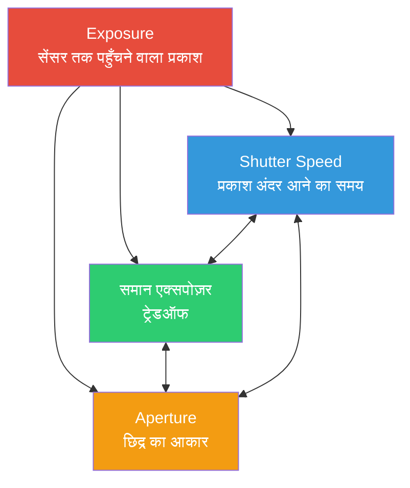

# अध्याय 13: एक्सपोज़र (Exposure)

## एक्सपोज़र ट्रायंगल: तीन नॉब, एक लक्ष्य

जब आप फोटो लेते हैं, तो आप प्रकाश को कैप्चर कर रहे होते हैं। तीन बुनियादी नियंत्रण इसे नियंत्रित करते हैं — साथ में वे **एक्सपोज़र ट्रायंगल (Exposure Triangle)** बनाते हैं।

**मूल विचार:** ट्रायंगल का प्रत्येक कोना प्रकाश को नियंत्रित करता है, लेकिन प्रत्येक एक *क्रिएटिव ट्रेडऑफ (tradeoff)* भी पेश करता है।

## ISO: सेंसर संवेदनशीलता (Gain Control)

डिजिटल फोटोग्राफी में, **ISO सेंसर गेन / इलेक्ट्रॉनिक प्रवर्धन (amplification)** है। जब आप ISO मान को दोगुना करते हैं, तो आप प्रभावी रूप से सिग्नल के प्रवर्धन को दोगुना कर रहे होते हैं।

- **ISO 100 = बेस गेन**: तस्वीरें **क्लीन** होती हैं, शोर (noise) न्यूनतम होता है, और रंग सबसे सटीक होते हैं।
- **ISO 3200 = हाई गेन**: आप कम रोशनी में शूट कर सकते हैं, लेकिन आपको **डिजिटल शोर (grain)** दिखाई देगा और रंगों की गुणवत्ता कम हो जाएगी।

## शटर स्पीड (Shutter Speed)

**शटर स्पीड** केवल यह है कि *सेंसर कितनी देर तक प्रकाश के संपर्क में रहता है*। इसे सेकंड के अंशों (fractions) में मापा जाता है।

- **1/1000s**: बहुत कम एक्सपोज़र, मोशन को फ्रीज (freeze) कर देता है (जैसे उड़ता हुआ पक्षी)।
- **1/30s**: हल्का मोशन ब्लर दिखाई दे सकता है।
- **1s - 30s**: लॉन्ग एक्सपोज़र, मोशन ब्लर बनाने के लिए (जैसे बहता हुआ पानी)।

**मोशन ब्लर**: जो कुछ भी शटर खुला रहने के दौरान हिलता है, वह एक लकीर (streak) बन जाता है।

## एपर्चर (Aperture)

**एपर्चर** लेंस में छिद्र का आकार है। इसे **f-stops** (f/1.8, f/2.8 आदि) में मापा जाता है। यहाँ छोटी संख्या = बड़ा छिद्र।

**स्मार्टफोन की वास्तविकता**: अधिकांश स्मार्टफोन में **फिक्स्ड एपर्चर लेंस (fixed aperture lenses)** होते हैं — आप f-stop को बदल नहीं सकते। इसलिए, हम एक्सपोज़र को केवल **ISO + शटर स्पीड** के माध्यम से नियंत्रित करते हैं।

## EV: एक्सपोज़र वैल्यू (The Logarithmic Scale)

फोटोग्राफी में "एक स्टॉप (one stop)" का मतलब है प्रकाश को दोगुना या आधा करना। इसके लिए **Exposure Value (EV)** का उपयोग किया जाता है।

**EV 0** को 1 सेकंड एक्सपोज़र, f/1.0 एपर्चर, और ISO 100 के रूप में परिभाषित किया गया है। हर **+1 EV प्रकाश को दोगुना करता है** (ब्राइट)। हर **-1 EV प्रकाश को आधा करता है** (डार्क)।

## कम / सही / अधिक एक्सपोज़र (Under / Correct / Overexposed)

- **Underexposed (-2 EV)**: विषय बहुत डार्क है। शैडो में कोई डिटेल नहीं है।
- **Correct Exposure (0 EV)**: मिड-टोन्स में उचित टेक्सचर है। चेहरा और बैकग्राउंड संतुलित हैं।
- **Overexposed (+2 EV)**: हाइलाइट्स **ब्लोन आउट (blown out)** हो जाते हैं, यानी वे शुद्ध सफेद हो जाते हैं और वहां कोई डेटा नहीं बचता।

**फोटोग्राफर का मंत्र:** *हाइलाइट्स के लिए एक्सपोज़ करें, शैडो को रिकवर करें।*

## सारांश (Summary)

- **ISO**: कम ISO = क्लीन इमेज; हाई ISO = शोर (noise)।
- **शटर स्पीड**: तेज़ शटर मोशन को फ्रीज करता है; धीमा शटर ब्लर बनाता है।
- **एपर्चर**: स्मार्टफोन पर अक्सर फिक्स्ड होता है।
- **EV**: प्रकाश को मापने का लॉग स्केल।

## आगे क्या है

**अध्याय 14: Camera2 में मैनुअल एक्सपोज़र** में, हम सीखेंगे कि `CONTROL_AE_MODE = OFF` कैसे करें और मैन्युअल रूप से `SENSOR_EXPOSURE_TIME` और `SENSOR_SENSITIVITY` कैसे सेट करें।
