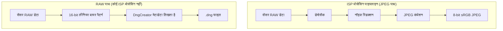

---     
sidebar_position: 18
title: "अध्याय 18: RAW फोटोग्राफी"
description: "RAW_SENSOR फॉर्मेट, DngCreator के साथ DNG फाइल बनाना, और Android Camera2 API में एक साथ RAW+JPEG कैप्चर करने में महारत हासिल करें।"
keywords: [Android Camera2, RAW photography, RAW_SENSOR, DngCreator, DNG, Bayer pattern, RGGB, JPEG_R, camera metadata, हिंदी]
---

# अध्याय 18: RAW फोटोग्राफी (RAW Photography)

प्रोफेशनल मोबाइल फोटोग्राफी के लिए Android के ISP द्वारा बनाए गए प्रोसेस्ड JPEG से कहीं अधिक की आवश्यकता होती है। Camera2 API आपको सीधे **RAW_SENSOR** फॉर्मेट तक पहुंच देता है: सेंसर से सीधे प्राप्त 16-बिट अनप्रोसेस्ड बायर-पैटर्न (Bayer-pattern) डेटा। **DngCreator** के साथ मिलकर, आप Adobe DNG (Digital Negative) फाइलें बना सकते हैं जिन्हें लाइटरूम या फोटोशॉप जैसे प्रोफेशनल एडिटिंग ऐप्स में एडिट किया जा सकता है।

[Android Camera Parameters](https://github.com/zoozooll/AndroidCameraParameters) ऐप में आप देख सकते हैं कि आपका डिवाइस कौन से RAW वेरिएंट (RAW10, RAW12, RAW14) सपोर्ट करता है।

## RAW क्यों? ISP प्रोसेसिंग की लागत

जब कैमरा एक JPEG बनाता है, तो वह कई चरणों से गुजरता है: नॉइज़ रिडक्शन, कलर करेक्शन, गामा मैपिंग और JPEG कंप्रेशन। ये चरण **अपरिवर्तनीय (irreversible)** होते हैं और फोटो की एडिटिंग क्षमता को कम कर देते हैं। RAW डेटा इन सभी को बायपास करता है और सेंसर की पूरी डायनेमिक रेंज को सुरक्षित रखता है, जिससे आप बाद में शैडो और हाइलाइट्स को बेहतर ढंग से रिकवर कर सकते हैं।



## बायर कलर फ़िल्टर एरे (The Bayer Color Filter Array)

सेंसर के पिक्सेल केवल रोशनी की तीव्रता मापते हैं, रंग नहीं। रंग पहचानने के लिए सेंसर पर एक **कलर फ़िल्टर एरे (CFA)** लगाया जाता है जिसे **बायर पैटर्न** कहते हैं।

- **RGGB**: सबसे आम पैटर्न (50% हरा, 25% लाल, 25% नीला)।
- हरे पिक्सेल अधिक होते हैं क्योंकि मानव आँख हरे रंग के प्रति अधिक संवेदनशील होती है।

## RAW_SENSOR फॉर्मेट और पैक्ड वेरिएंट

Android का मुख्य RAW फॉर्मेट `ImageFormat.RAW_SENSOR` है। आधुनिक फोन अक्सर पैक्ड वेरिएंट्स का उपयोग करते हैं:
- **RAW10**: प्रति 5 बाइट में 4 सैंपल।
- **RAW12**: प्रति 3 बाइट में 2 सैंपल।
- **RAW14**: प्रोफेशनल टियर सेंसर के लिए।

`DngCreator` इन सभी को अपने आप संभाल लेता है।

## DNG: Adobe डिजिटल नेगेटिव स्टैंडर्ड

RAW बफर केवल नंबरों का एक ग्रिड है। इसे सही ढंग से दिखाने के लिए मेटाडेटा (जैसे ब्लैक लेवल, कलर मैट्रिक्स) की आवश्यकता होती है। `DngCreator` क्लास `CameraCharacteristics` और `CaptureResult` से इस मेटाडेटा को अपने आप निकालती है और एक वैध DNG फाइल बनाती है।

## RAW + JPEG एक साथ कैप्चर करना

सही तरीका यह है कि एक ही `CaptureRequest` में कई आउटपुट टारगेट जोड़ें। इससे यह सुनिश्चित होता है कि RAW और JPEG दोनों एक ही फ्रेम (समान एक्सपोज़र) से आए हैं।

### स्टेप 1: क्षमताओं की जांच करें
चेक करें कि क्या `REQUEST_AVAILABLE_CAPABILITIES_RAW` इनेबल है और अधिकतम RAW साइज क्या है।

### स्टेप 2: डुअल ImageReaders बनाएं
एक RAW के लिए (ImageFormat.RAW_SENSOR) और एक JPEG के लिए।

### स्टेप 3: कैप्चर सेशन बनाएं
दोनों सर्फेस को `createCaptureSession` में जोड़ें।

### स्टेप 4: DngCreator का उपयोग करके फाइल लिखें
`ImageReader` से `Image` प्राप्त करें और उसे `CaptureResult` के साथ `DngCreator` को दें।

```kotlin
val dngCreator = DngCreator(characteristics, captureResult)
dngCreator.writeByteBuffer(fos, width, height, buffer, 0)
```

## सारांश (Summary)

- **RAW_SENSOR फॉर्मेट**: सेंसर से सीधे प्राप्त अनप्रोसेस्ड 16-बिट डेटा।
- **बायर पैटर्न**: RGGB जैसे पैटर्न जो रंग की जानकारी देते हैं।
- **DNG**: एक सार्वभौमिक RAW कंटेनर फॉर्मेट।
- **Multi-target CaptureRequests**: एक ही शटर टैप पर RAW और JPEG दोनों प्राप्त करना।

## आगे क्या है

अगले अध्याय में, हम स्थिर फोटोग्राफी से वीडियो की ओर बढ़ेंगे: **अध्याय 19: हाई-स्पीड वीडियो**, जहाँ हम 120 fps और 240 fps स्लो-मोशन कैप्चर के बारे में सीखेंगे।
