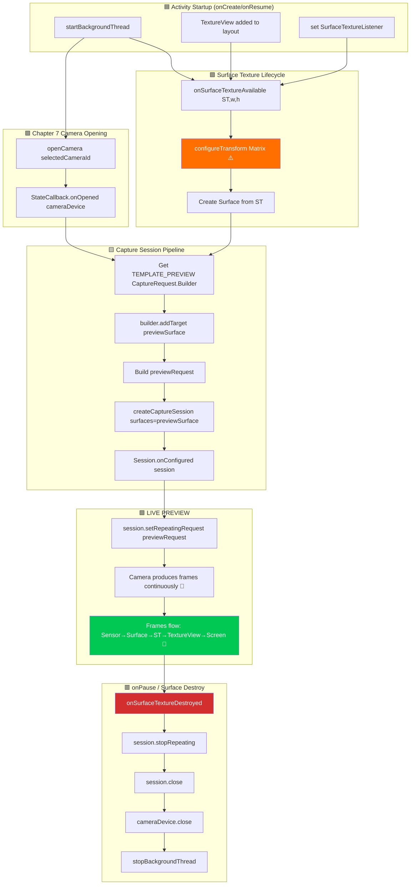

# अध्याय 8: कैमरा प्रीव्यू दिखाना (Showing Camera Preview)

यह वह अध्याय है जिसका आप इंतज़ार कर रहे थे। आधारभूत संरचना (अनुमतियाँ, थ्रेडिंग, CameraManager, एन्युमरेशन, ओपन/क्लोज़ लाइफसाइकिल) बनाने के तीन अध्यायों के बाद, आप अंततः **Android डिवाइस स्क्रीन पर लाइव रेंडर किए गए कैमरा आउटपुट को देखेंगे**। प्रीव्यू एक कैमरा ऐप की आत्मा है - यह वही है जिसे उपयोगकर्ता शटर टैप करने से पहले शॉट को फ्रेम करने, फोकस चेक करने और एक्सपोज़र को वैलिडेट करने के लिए देखता है।

सैकड़ों डिवाइसों पर एज केस को हैंडल करने वाले संदर्भ प्रीव्यू कार्यान्वयन के लिए, **Android Camera Parameters** ऐप में प्रीव्यू स्क्रीन देखें ([GitHub](https://github.com/zoozooll/AndroidCameraParameters) / [Google Play](https://play.google.com/store/apps/details?id=com.minininja.cameraparams))।

## प्रीव्यू पाइपलाइन: घटक अवलोकन (Components Overview)

कोड में गोता लगाने से पहले, चलिए कैमरा सेंसर से फोन के डिस्प्ले तक एक सिंगल प्रीव्यू फ्रेम की वैचारिक यात्रा को मैप करते हैं। प्रत्येक फ्रेम पांच परतों से होकर गुजरता है:

```
Camera Sensor → CameraDevice Pipeline → Surface (BufferQueue) → SurfaceTexture → TextureView → Display
```

प्रत्येक परत एक विशिष्ट भूमिका निभाती है। किसी को भी छोड़ने से ब्लैक स्क्रीन, विकृत आस्पेक्ट रेश्यो या टियरिंग (tearing) होती है। चलिए प्रत्येक घटक को परिभाषित करते हैं:

### 1. Surface — इमेज डेस्टिनेशन बफर (The Image Destination Buffer)

एक `Surface` प्रोसेस्ड इमेज फ्रेम के लिए **डेस्टिनेशन की Camera2 API की सामान्य अवधारणा** है। हुड के नीचे, एक सरफेस Android `BufferQueue` को लपेटता है।

सबसे आम उपभोक्ता (consumers) हैं:
- **SurfaceTexture** → `TextureView` को फीड करता है (ऑन-स्क्रीन प्रीव्यू के लिए - यह अध्याय)
- **ImageReader Surface** → JPEG/RAW कैप्चर के लिए (अध्याय 9)

### 2. SurfaceTexture — GPU-to-GPU ब्रिज

`SurfaceTexture` वह जादुई क्लास है जो कैमरा फ्रेम की एक रॉ स्ट्रीम को एक टेक्सचर में बदल देती है जिसे GPU सैंपल और रेंडर कर सकता है। यह CPU कॉपी के बिना 60+ FPS प्रीव्यू सक्षम करता है।

### 3. TextureView — ऑन-स्क्रीन विंडो

`TextureView` एक `View` सबक्लास है जो `SurfaceTexture` की सामग्री को प्रदर्शित कर सकता है। यह Camera2 प्रीव्यू के लिए अनुशंसित विकल्प है क्योंकि इसे सामान्य व्यू की तरह एनिमेट और ट्रांसफ़ॉर्म किया जा सकता है।

### 4. CameraCaptureSession — कॉन्फ़िगर की गई पाइपलाइन

एक `CameraDevice` किसी भी फ्रेम को तैयार करने से पहले, आपको एक `CameraCaptureSession` बनाना होगा। एक सेशन उन **सभी आउटपुट सरफेस का कॉन्फ़िगरेशन है जिन पर कैमरा पाइपलाइन लिखेगी**। प्रीव्यू-ओनली के लिए, सेशन में एक सरफेस (TextureView का) होता है।

### 5. रिपीटिंग कैप्चर रिक्वेस्ट (TEMPLATE_PREVIEW)

एक बार सेशन कॉन्फ़िगर हो जाने के बाद, निरंतर प्रीव्यू कैसे होता है? Camera2 एक रिक्वेस्ट-ड्रिवेन API है - हर फ्रेम सेशन में सबमिट की गई एक `CaptureRequest` है। प्रीव्यू के लिए, हम **एक रिक्वेस्ट सबमिट करते हैं और उसे रिपीटिंग के रूप में चिह्नित करते हैं**।

प्रीव्यू के लिए टेम्पलेट `CameraDevice.TEMPLATE_PREVIEW` है। यह **कम विलंबता (low latency) और स्मूथ फ्रेम रेट** के लिए ऑप्टिमाइज़ किया गया है।

## एंड-टू-एंड प्रीव्यू फ्लोचार्ट (End-to-End Preview Flowchart)



## स्टेप 1: लेआउट XML में TextureView जोड़ें

`activity_main.xml` में एक फुल-स्क्रीन `TextureView` और एक `TextView` स्टेटस इंडिकेटर जोड़ें।

## स्टेप 2: configureTransform — आस्पेक्ट रेश्यो ठीक करने का मंत्र

यदि आप कुछ नहीं करते हैं, तो प्रीव्यू **स्ट्रेच (stretched)** दिखाई देगा। कैमरा सेंसर का आस्पेक्ट रेश्यो (अक्सर 4:3) फोन डिस्प्ले (अक्सर ~20:9) से अलग होता है।

समाधान **`configureTransform`** है: एक मेथड जो `Matrix` (रोटेशन + सेंटर-क्रॉप स्केलिंग) की गणना करता है और उसे TextureView पर लागू करता है। यह डिवाइस रोटेशन और सेंसर ओरिएंटेशन के हिसाब से छवि को घुमाता और स्केल करता है।

## स्टेप 3: प्रीव्यू साइज चुनें

सेशन बनाने से पहले, हमें पता होना चाहिए कि कैमरा कौन सा प्रीव्यू साइज आउटपुट कर सकता है। `CameraCharacteristics.SCALER_STREAM_CONFIGURATION_MAP` से हम `SurfaceTexture` के लिए समर्थित साइज प्राप्त करते हैं और अपने व्यू के आस्पेक्ट रेश्यो से मेल खाने वाला सबसे अच्छा साइज चुनते हैं।

## स्टेप 4: पूर्ण अध्याय 8 कोड — लाइव प्रीव्यू

यहाँ `MainActivity.kt` का मुख्य भाग है:

```kotlin
// ... (इम्पोर्ट और क्लास सेटअप)

    private fun createCaptureSession() {
        val cam = cameraDevice ?: return
        val st = textureView.surfaceTexture ?: return
        val previewSurface = Surface(st)
        val outputSurfaces = listOf(previewSurface)

        try {
            previewRequestBuilder = cam.createCaptureRequest(CameraDevice.TEMPLATE_PREVIEW).apply {
                addTarget(previewSurface)
            }

            cam.createCaptureSession(outputSurfaces, object : CameraCaptureSession.StateCallback() {
                override fun onConfigured(session: CameraCaptureSession) {
                    captureSession = session
                    previewRequest = previewRequestBuilder!!.build()
                    // प्रीव्यू शुरू करने वाली जादुई लाइन:
                    session.setRepeatingRequest(previewRequest!!, null, backgroundHandler)
                }
                override fun onConfigureFailed(session: CameraCaptureSession) { /* हैंडल एरर */ }
            }, backgroundHandler)
        } catch (e: CameraAccessException) { /* ... */ }
    }

// ... (configureTransform और chooseOptimalPreviewSize लॉजिक)
```

## सत्यापन: सफलता कैसी दिखती है

1. **कैमरा खुलता है**: स्टेटस अपडेट होता है।
2. **सेशन कॉन्फ़िगर होता है**: **🎥 LIVE PREVIEW** दिखाई देता है।
3. **आउटपुट**: आप स्क्रीन पर कैमरा इमेज देखते हैं! यह स्मूथ (30–60 FPS) और सही ओरिएंटेशन में होनी चाहिए।

## सारांश (Summary)

इस अध्याय में, आपने सीखा:
1. **प्रीव्यू पाइपलाइन के पांच घटक**: Surface, SurfaceTexture, TextureView, CameraCaptureSession, और रिपीटिंग `TEMPLATE_PREVIEW` रिक्वेस्ट।
2. **TextureView + SurfaceTextureListener**: GPU सरफेस तैयार होने पर प्रीव्यू कैसे शुरू करें।
3. **प्रीव्यू साइज चयन**: अपने व्यू के लिए इष्टतम रेज़ोल्यूशन कैसे चुनें।
4. **configureTransform**: मैट्रिक्स जो स्ट्रेचिंग को रोकता है और ओरिएंटेशन ठीक करता है।
5. **setRepeatingRequest**: वह सिंगल लाइन जो वास्तव में फ्रेम स्ट्रीम शुरू करती है।

## आगे क्या है

लाइव प्रीव्यू शानदार है, लेकिन फोटो लेना असली लक्ष्य है। **अध्याय 9: फोटो लेना** में, आप `ImageReader` और JPEG कैप्चर पाइपलाइन के बारे में सीखेंगे।
