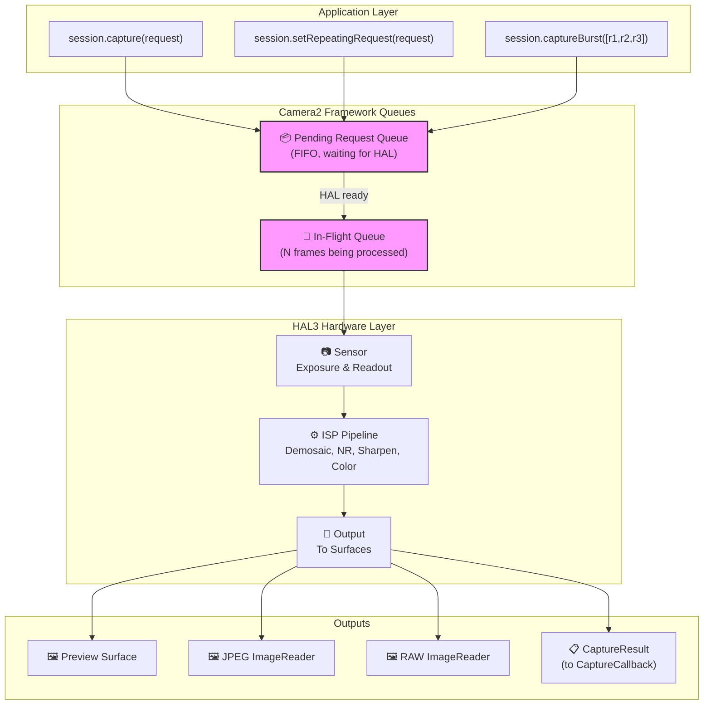
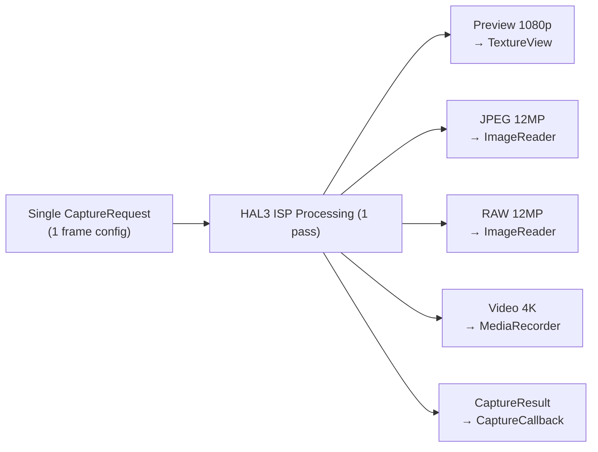
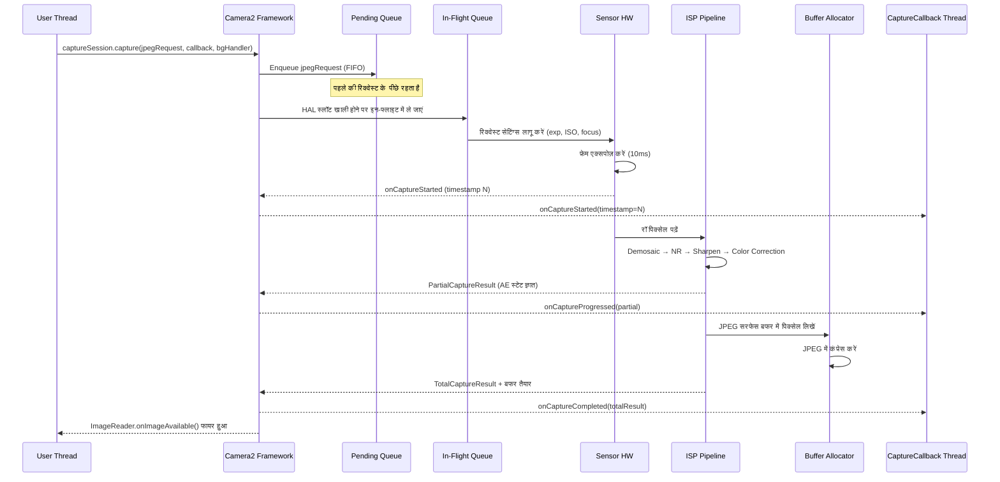

# अध्याय 10: Camera2 पाइपलाइन (The Camera2 Pipeline)

## 10.1 उपयोग से समझ तक (From Usage to Understanding)

इस सीरीज़ के पिछले अध्यायों में, आपने Camera2 का *उपयोग* किया: आपने प्रीव्यू दिखाए, फोटो कैप्चर किए और RAW फाइलों के साथ काम किया। अब लेंस को पलटने और अंदर देखने का समय है — **Camera2 वास्तव में उन फ्रेमों को कैसे डिलीवर करता है?**

पाइपलाइन को समझना केवल अकादमिक नहीं है। जब आप जानते हैं कि सिस्टम के माध्यम से रिक्वेस्ट कैसे प्रवाहित होती हैं, तो आप:
- हाई-स्पीड कैप्चर में फ्रेम ड्रॉप का निदान कर सकते हैं
- बता सकते हैं कि सेटिंग्स बदलने में दिखाई देने में 1-2 फ्रेम क्यों लगते हैं
- ज़ीरो ब्लैकआउट के लिए बर्स्ट कैप्चर को ऑप्टिमाइज़ कर सकते हैं
- कॉलबैक टाइमिंग के लिए सही मानसिक मॉडल बना सकते हैं

Android Camera Parameters ऐप ([GitHub](https://github.com/zoozooll/AndroidCameraParameters), [Play Store](https://play.google.com/store/apps/details?id=com.minininja.cameraparams)) रीयल टाइम में पाइपलाइन व्यवहार की कल्पना करता है — अपने डिवाइस पर इस अध्याय की अवधारणाओं को लाइव देखने के लिए **Frame Timing** और **Raw JSON** टैब देखें।

## 10.2 मुख्य डेटा संरचनाएं (The Core Data Structures)

पाइपलाइन को देखने से पहले, चलिए उन दो ऑब्जेक्ट्स की गहराई से जांच करते हैं जो इसके माध्यम से यात्रा करते हैं: `CaptureRequest` (जो अंदर जाता है) और `CaptureResult` (जो बाहर आता है)।

### CaptureRequest: अपरिवर्तनीय फ्रेम ब्लूप्रिंट (The Immutable Frame Blueprint)

एक `CaptureRequest` एक **सिंगल फ्रेम के लिए एक पूर्ण, अपरिवर्तनीय (immutable) कॉन्फ़िगरेशन** है। यह बताता है कि सेंसर, लेंस और ISP को एक एक्सपोज़र के लिए *सब कुछ* क्या करना चाहिए: सेंसर एक्सपोज़र टाइम, ISO, लेंस फोकस डिस्टेंस, 3A मोड, आउटपुट टारगेट, JPEG क्वालिटी, क्रॉप रीजन, और बहुत कुछ।

`CaptureRequest` के प्रमुख गुण:

- **build() के बाद अपरिवर्तनीय** — एक बार जब आप `.build()` कॉल करते हैं, तो रिक्वेस्ट फ्रीज हो जाती है। सेटिंग्स बदलने के लिए, आपको एक नया Builder बनाना होगा।
- **बिल्डर पैटर्न** — `CaptureRequest.Builder` के माध्यम से निर्मित, जिसे `CameraDevice.createCaptureRequest(template)` से प्राप्त किया जाता है।
- **प्रति-फ्रेम** — प्रत्येक व्यक्तिगत फ्रेम को अपना स्वयं का रिक्वेस्ट ऑब्जेक्ट मिलता है। यहाँ तक कि रिपीटिंग कैप्चर भी (परोक्ष रूप से) प्रति फ्रेम एक नया रिक्वेस्ट बनाते हैं।
- **सरफेस पर लक्षित** — प्रत्येक रिक्वेस्ट स्पष्ट रूप से सूचीबद्ध करती है कि कौन से आउटपुट सरफेस प्रोसेस्ड इमेज बफर प्राप्त करते हैं।

```kotlin
// बिल्डर पैटर्न का उपयोग करके एक CaptureRequest बनाएं
val builder = cameraDevice.createCaptureRequest(CameraDevice.TEMPLATE_STILL_CAPTURE)

// सेंसर-लेवल पैरामीटर
builder.set(CaptureRequest.SENSOR_EXPOSURE_TIME, 10_000_000L)   // 10ms
builder.set(CaptureRequest.SENSOR_SENSITIVITY, 400)             // ISO 400
builder.set(CaptureRequest.SENSOR_FRAME_DURATION, 33_333_333L)  // ~30fps max

// लेंस पैरामीटर
builder.set(CaptureRequest.LENS_FOCUS_DISTANCE, 0.1f)           // 10cm focus
builder.set(CaptureRequest.LENS_APERTURE, 1.8f)                 // f/1.8

// 3A कंट्रोल मोड
builder.set(CaptureRequest.CONTROL_AF_MODE, CaptureRequest.CONTROL_AF_MODE_OFF)
builder.set(CaptureRequest.CONTROL_AE_MODE, CaptureRequest.CONTROL_AE_MODE_OFF)
builder.set(CaptureRequest.CONTROL_AWB_MODE, CaptureRequest.CONTROL_AWB_MODE_OFF)

// आउटपुट टारगेट
builder.addTarget(previewSurface)
builder.addTarget(jpegReader.surface)

// बिल्ड — अब अपरिवर्तनीय!
val request: CaptureRequest = builder.build()

// request.set(...) विफल हो जाएगा — निर्मित ऑब्जेक्ट पर कोई set() नहीं!
```

:::note
पाइपलाइन की शुद्धता के लिए अपरिवर्तनीयता (immutability) महत्वपूर्ण है। चूँकि HAL रिक्वेस्ट को असिंक्रोनस रूप से पढ़ता है, यदि आप सबमिशन के बाद इसे संशोधित कर सकते हैं, तो आप ऐप थ्रेड और हार्डवेयर प्रोसेसिंग थ्रेड के बीच रेस कंडीशन (race conditions) पैदा कर देंगे।
:::

### CaptureResult: मेटाडेटा रिपोर्ट (इमेज नहीं!)

एक `CaptureResult` प्रोसेस्ड फ्रेम के लिए **मेटाडेटा आउटपुट** है। महत्वपूर्ण बात यह है कि: **CaptureResult में इमेज पिक्सेल डेटा नहीं होता है**। पिक्सेल उन `Surface` टारगेट पर जाते हैं जिन्हें आपने रिक्वेस्ट में जोड़ा था; `CaptureResult` आपके `CaptureCallback` पर जाता है जो कैप्चर के दौरान क्या हुआ इसकी *कहानी* ले जाता है।

यहाँ `CaptureResult` के सबसे महत्वपूर्ण फ़ील्ड दिए गए हैं:

| परिणाम कुंजी (Result Key) | प्रकार | विवरण |
|-----------|------|-------------|
| `SENSOR_EXPOSURE_TIME` | `Long` | नैनोसेकंड में उपयोग किया गया वास्तविक एक्सपोज़र समय (अनुरोध से भिन्न हो सकता है) |
| `SENSOR_SENSITIVITY` | `Int` | लागू किया गया वास्तविक ISO गेन |
| `SENSOR_TIMESTAMP` | `Long` | एक्सपोज़र की शुरुआत में नैनोसेकंड टाइमस्टैम्प |
| `CONTROL_AE_STATE` | `Int` | ऑटो-एक्सपोज़र स्टेट: INACTIVE, SEARCHING, CONVERGED, LOCKED, FLASH_REQUIRED |
| `CONTROL_AF_STATE` | `Int` | ऑटोफोकस स्टेट: INACTIVE, PASSIVE_SCAN, ACTIVE_SCAN, FOCUSED_LOCKED, NOT_FOCUSED_LOCKED |
| `CONTROL_AWB_STATE` | `Int` | ऑटो-व्हाइट बैलेंस स्टेट |
| `LENS_FOCUS_DISTANCE` | `Float` | लेंस द्वारा सेट की गई वास्तविक फोकस दूरी |
| `SCALER_CROP_REGION` | `Rect` | डिजिटल ज़ूम के लिए उपयोग किया गया वास्तविक क्रॉप रीजन |

रिजल्ट फ़ील्ड आपकी **जमीनी सच्चाई (ground truth)** हैं। `CaptureRequest` वह है जो आपने *मांगा* था; `CaptureResult` वह है जो हार्डवेयर ने *वास्तव में किया*। LEGACY या LIMITED डिवाइस पर, HAL चुपचाप आपके अनुरोधित मानों को क्लैंप, राउंड या ओवरराइड कर सकता है — रिजल्ट आपको उसका पता लगाने देता है।

```kotlin
val captureCallback = object : CameraCaptureSession.CaptureCallback() {
    override fun onCaptureCompleted(
        session: CameraCaptureSession,
        request: CaptureRequest,
        result: TotalCaptureResult
    ) {
        val timestampNs = result.get(CaptureResult.SENSOR_TIMESTAMP)
        val exposureNs = result.get(CaptureResult.SENSOR_EXPOSURE_TIME)
        val iso = result.get(CaptureResult.SENSOR_SENSITIVITY)
        val aeState = result.get(CaptureResult.CONTROL_AE_STATE)
        val afState = result.get(CaptureResult.CONTROL_AF_STATE)
        // ... (सीखने के लिए लॉगिंग कोड)
    }
}
```

:::tip
Android Camera Parameters ऐप में, सेटिंग्स में **Live Result Logging** इनेबल करें और मेटाडेटा के इस सटीक प्रवाह को रीयल टाइम में देखें। आप देखेंगे कि एक्सपोज़र सेटल होने पर AE_SEARCHING से AE_CONVERGED में ट्रांज़िशन होता है, और जब आप फोकस करने के लिए टैप करते हैं तो AF_SCAN से FOCUSED_LOCKED में ट्रांज़िशन होता है।
:::

## 10.3 रिक्वेस्ट क्यू (The Request Queues)

Camera2 फ्रेमवर्क स्तर पर **दो-क्यू पाइपलाइन मॉडल** का उपयोग करता है। इन क्यू को समझने से आपके द्वारा देखे जाने वाले लगभग हर टाइमिंग व्यवहार की व्याख्या हो जाती है।

### पेंडिंग रिक्वेस्ट क्यू (Pending Request Queue - FIFO)

जब आप `session.capture()`, `session.captureBurst()`, या `session.setRepeatingRequest()` कॉल करते हैं, तो रिक्वेस्ट तुरंत HAL के पास नहीं जाती है। इसके बजाय, यह **पेंडिंग रिक्वेस्ट क्यू** में आती है — Camera2 फ्रेमवर्क द्वारा प्रबंधित एक FIFO (First-In, First-Out) क्यू।

इसे "प्रतीक्षा कक्ष" के रूप में सोचें। रिक्वेस्ट यहाँ तब तक बैठती हैं जब तक कि HAL के पास प्रोसेसिंग के लिए एक नई रिक्वेस्ट स्वीकार करने की क्षमता न हो।

### इन-फ्लाइट क्यू (In-Flight Queue)

जब HAL पेंडिंग क्यू से एक रिक्वेस्ट निकालता है और सेंसर रीडआउट / ISP प्रोसेसिंग शुरू करता है, तो रिक्वेस्ट **इन-फ्लाइट क्यू** में चली जाती है। इस क्यू में वे सभी रिक्वेस्ट होती हैं जिन्हें वर्तमान में हार्डवेयर द्वारा प्रोसेस किया जा रहा है।

इन-फ्लाइट क्यू की गहराई (`CameraCharacteristics.REQUEST_PIPELINE_MAX_DEPTH`) आपको बताती है कि हार्डवेयर एक साथ कितने फ्रेम पर काम करता है। विशिष्ट FULL डिवाइस पर, यह 3–4 फ्रेम गहरा होता है, जिसका अर्थ है: जब फ्रेम N एक्सपोज़ किया जा रहा है, फ्रेम N-1 को ISP द्वारा प्रोसेस किया जा रहा है, फ्रेम N-2 को मेमोरी में लिखा जा रहा है, और फ्रेम N-3 ऐप को वापस किया जा रहा है। इसी तरह Camera2 प्रत्येक फ्रेम में ~100ms एंड-टू-एंड लगने के बावजूद 30+ fps प्राप्त करता है।



## 10.4 रिज़ल्ट कॉलबैक: CaptureCallback लाइफसाइकिल

परिणाम `CameraCaptureSession.CaptureCallback` के माध्यम से वापस आते हैं। HAL कई चरणों में परिणाम वापस कर सकता है, जिससे आपको पूरा फ्रेम तैयार होने से पहले आंशिक मेटाडेटा तक जल्दी पहुँच मिलती है।

### चार कॉलबैक मेथड (The Four Callback Methods)

| मेथड | कब कॉल किया जाता है | इसमें शामिल है | उपयोग का मामला |
|--------|------------|----------|----------|
| `onCaptureStarted` | सेंसर ने इस फ्रेम के लिए एक्सपोज़र *शुरू* कर दिया है | न्यूनतम जानकारी: फ्रेम नंबर, टाइमस्टैम्प | सटीक टाइमिंग सिंक्रोनाइज़ेशन |
| `onCaptureProgressed` | ISP ने फ्रेम को आंशिक रूप से प्रोसेस किया है | PartialCaptureResult — कुछ मेटाडेटा फ़ील्ड तैयार हैं | शुरुआती AE/AF स्टेट अपडेट |
| `onCaptureCompleted` | पूरा फ्रेम हो गया, सभी बफर डिलीवर हो गए | TotalCaptureResult — सभी फ़ील्ड | अंतिम मेटाडेटा लॉगिंग |
| `onCaptureFailed` | फ्रेम ड्रॉप हो गया / त्रुटि हुई | CaptureFailure — एरर कोड, कारण | त्रुटि सुधार |

## 10.5 पाइपलाइन इंटर्नल्स: स्टेटलेस, सीक्वेंशियल, असिंक, मल्टी-आउटपुट

HAL3 पाइपलाइन मॉडल के चार परिभाषित गुण हैं। इन्हें आत्मसात करें और अधिकांश "अजीब" Camera2 व्यवहार अचानक समझ में आ जाएंगे।

### 1. स्टेटलेसनेस (Statelessness)

हार्डवेयर की **रिक्वेस्ट के बीच कोई मेमोरी नहीं होती है**। प्रत्येक `CaptureRequest` स्व-निहित (self-contained) होनी चाहिए — इसमें *हर सेटिंग* शामिल होती है, न कि केवल वे जिन्हें आपने पिछले फ्रेम से बदला है।

इसका अर्थ है: यदि आप फ्रेम N पर `SENSOR_EXPOSURE_TIME` सेट करते हैं लेकिन फ्रेम N+1 पर इसे *छोड़* देते हैं, तो यह टेम्पलेट डिफॉल्ट पर वापस आ जाता है।

### 2. सीक्वेंशियल प्रोसेसिंग (Sequential Processing)

एक सिंगल लॉजिकल कैमरा स्ट्रीम के भीतर, रिक्वेस्ट को **FIFO क्रम में एक-एक करके** प्रोसेस किया जाता है। कोई रीऑर्डरिंग नहीं, कोई पैरेलल रिक्वेस्ट इवैल्यूएशन नहीं।

### 3. असिंक्रोनस परिणाम (Asynchronous Results)

वह थ्रेड जो रिक्वेस्ट सबमिट करता है, वह **कभी भी** वह थ्रेड नहीं होता जो परिणाम प्राप्त करता है। परिणाम आपके द्वारा प्रदान किए गए `Handler` थ्रेड पर डिलीवर किए जाते हैं।

### 4. प्रति रिक्वेस्ट कई आउटपुट (Multiple Outputs Per Request)

एक रिक्वेस्ट → कई आउटपुट। एक सिंगल `CaptureRequest` एक साथ 2, 3, या 4+ `Surface` टारगेट को लक्षित कर सकती है: Preview, JPEG, RAW, Video, आदि।



## 10.6 एंड-टू-एंड: एक फ्रेम को ट्रेस करना (Tracing One Frame)

सब कुछ एक साथ जोड़ने के लिए चलिए पूरी पाइपलाइन के माध्यम से एक सिंगल JPEG कैप्चर रिक्वेस्ट को ट्रेस करते हैं:



## 10.7 पाइपलाइन को एक्शन में देखना

Android Camera Parameters ऐप में एक **Pipeline Visualizer** डीबग व्यू शामिल है जो वर्तमान पेंडिंग क्यू गहराई, इन-फ्लाइट क्यू गहराई और प्रति-फ्रेम टाइमस्टैम्प को ओवरले करता है।

## 10.8 सारांश (Summary)

| अवधारणा | मुख्य निष्कर्ष |
|---------|-------------|
| **CaptureRequest** | अपरिवर्तनीय, प्रति-फ्रेम ब्लूप्रिंट। इसमें सभी सेटिंग्स होती हैं। |
| **CaptureResult** | केवल मेटाडेटा। हार्डवेयर ने *वास्तव में क्या किया* इसके लिए जमीनी सच्चाई। |
| **Pending Queue** | FIFO प्रतीक्षा कक्ष। बर्स्ट लगातार रहते हैं। |
| **In-Flight Queue** | वर्तमान में प्रोसेस्ड रिक्वेस्ट। 3-4 फ्रेम विशिष्ट। |
| **CaptureCallback** | चार चरण: started → progressed → completed। |
| **Statelessness** | हार्डवेयर की कोई मेमोरी नहीं होती। हर रिक्वेस्ट में सब कुछ शामिल होना चाहिए। |
| **Multi-Output** | एक रिक्वेस्ट → कई सरफेस (Preview + JPEG + RAW + Video एक साथ)। |

## आगे क्या है

[अध्याय 11: कैप्चर प्रकार (Capture Types)](capture-types.md) में, हम इस पाइपलाइन में रिक्वेस्ट सबमिट करने के तीन तरीकों — one-shot, burst, और repeating — को देखेंगे और यह भी देखेंगे कि प्रत्येक का उपयोग कब करना है।
