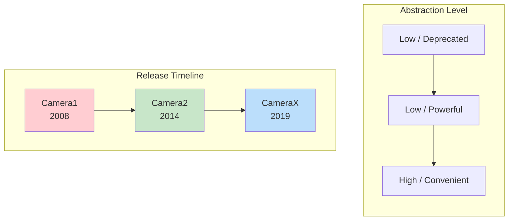
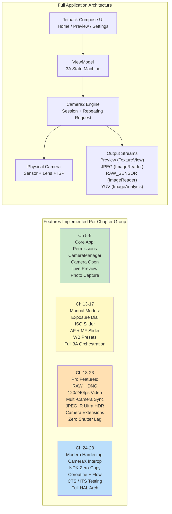

# अध्याय 1: Android Camera2 में आपका स्वागत है (Welcome to Android Camera2)

> **अध्याय अवलोकन (Chapter Overview):** इस शुरुआती अध्याय में, हम बड़े परिदृश्य को देखते हैं। Camera2 क्यों मौजूद है? पुराने Camera API और नई CameraX लाइब्रेरी की तुलना में यह किन समस्याओं का समाधान करता है? किसे Camera2 सीखने में समय निवेश करना चाहिए? और, सबसे महत्वपूर्ण बात, आप इस सीरीज़ के अंत तक वास्तव में क्या बनाएंगे? अभी कोई गहरा आर्किटेक्चर नहीं, कोई HAL लेयर नहीं, और कोई पाइपलाइन आरेख नहीं - बस उन सवालों के स्पष्ट जवाब जो हर डेवलपर गोता लगाने से पहले पूछता है।

***

## 1.1 Camera2 क्यों? (Why Camera2?)

अपना स्मार्टफोन निकालें।

उसके पीछे देखें। आपको शायद दो, तीन या उससे भी ज़्यादा कैमरा लेंस दिखाई देंगे। वह छोटा सा आयताकार उभार (bump) 2000 के दशक के मध्य के एक पेशेवर DSLR की तुलना में अधिक ऑप्टिकल और सिलिकॉन शक्ति रखता है।

अब डिफॉल्ट कैमरा ऐप खोलें।

शटर पर टैप करें। तुरंत, एक हाई-रेज़ोल्यूशन फोटो आपकी गैलरी में स्टोर हो जाती है। तस्वीर शायद बहुत अच्छी दिखती है - जीवंत रंग, शार्प विषय, स्मूथ बैकग्राउंड ब्लर और इनडोर लाइट में भी ब्राइट शैडो।

लेकिन आप जिस कैमरा ऐप का उपयोग कर रहे हैं वह हार्डवेयर क्या कर सकता है, उसकी केवल सतह को छूता है। उस अनुकूल शटर बटन के नीचे एक अविश्वसनीय रूप से परिष्कृत इमेजिंग पाइपलाइन छिपी हुई है: वह जो RAW फोटो शूट कर सकती है, 240 fps स्लो-मोशन वीडियो रिकॉर्ड कर सकती है, एक सिंगल नाइट शॉट के लिए 10 फ्रेम फ्यूज कर सकती है, या लेंस मूवमेंट के हर माइक्रोन को स्वतंत्र रूप से नियंत्रित कर सकती है।

अधिकांश थर्ड-पार्टी Android ऐप्स कभी भी इस शक्ति का उपयोग नहीं करते हैं। क्यों? क्योंकि **पुराना Android कैमरा API (जिसे पूर्वव्यापी रूप से Camera1 कहा जाता है) अत्यंत सीमित था**। Camera1 बुनियादी फोटो और वीडियो कैप्चर वाले सिंगल-कैमरा फोन की दुनिया के लिए डिज़ाइन किया गया था। यह निम्नलिखित कार्य नहीं कर सकता था:

- एक्सपोज़र टाइम या ISO को मैन्युअल रूप से नियंत्रित करना
- RAW सेंसर डेटा कैप्चर करना
- हाई फ्रेम रेट पर स्लो-मोशन रिकॉर्ड करना
- एक साथ कई कैमरों का उपयोग करना
- कैप्चर के बीच में प्रति-फ्रेम मेटाडेटा एक्सेस करना
- बर्स्ट फोटोग्राफी को विश्वसनीय रूप से शूट करना

**Android 5.0 (API लेवल 21)** से शुरू करते हुए, Google ने इन दीवारों को तोड़ने के लिए **Camera2 (android.hardware.camera2)** पेश किया। Camera2 कोई इंक्रीमेंटल अपडेट नहीं है - यह एक **पूर्ण रीडिज़ाइन** है, जिसे आधुनिक कैमरा सिलिकॉन की रॉ क्षमताओं को हर Android डेवलपर के लिए उजागर करने के लिए स्क्रैच से बनाया गया है।

संक्षेप में: **Camera2 इसलिए मौजूद है क्योंकि स्मार्टफोन कैमरे पेशेवर-ग्रेड बन गए हैं, और पुराना API तालमेल नहीं बिठा सका।**

***

## 1.2 Camera1 बनाम Camera2 बनाम CameraX

Android कैमरा विकास के एक दशक से अधिक समय में कैमरा API की **तीन पीढ़ियाँ** पैदा हुई हैं। इससे पहले कि आप कोड की एक भी लाइन लिखें, यह समझना आवश्यक है कि कौन सा API किस समस्या का समाधान करता है।

### तीन पीढ़ियाँ, तीन दर्शन (Three Generations, Three Philosophies)

### Camera1 — `android.hardware.Camera`

मूल कैमरा API, Android 1.0 के साथ पेश किया गया और **Android 5.0 में हटा दिया गया (deprecated)**।

- **मॉडल**: प्रक्रियात्मक (Procedural) कमांड। आप `startPreview()`, `takePicture()`, `setFlashMode()` जैसे मेथड को कॉल करते हैं।
- **डिज़ाइन दर्शन**: "कैमरा एक स्टेट मशीन है जिसे आप कमांड देते हैं।"
- **इसके लिए सर्वश्रेष्ठ**: पुराने डिवाइस (Lollipop से पहले) को लक्षित करने वाले लीगेसी ऐप्स। बस इतना ही।
- **इससे क्यों बचें**: Google अब इसे अपडेट नहीं करता है। नई हार्डवेयर सुविधाएँ (मल्टी-कैमरा, RAW, HDR) कभी भी Camera1 में बैक-पोर्ट नहीं की जाती हैं। API सरफेस बहुत छोटा है। आधुनिक डिवाइस पर, Camera1 वास्तव में आंतरिक रूप से **Camera2 रैपर द्वारा इमुलेट** किया जाता है, इसलिए आप Camera2 के लाभों के बिना Camera2 की जटिलता का भुगतान करते हैं।

### Camera2 — `android.hardware.camera2.*`

आधुनिक लो-लेवल फ्रेमवर्क, Android 5.0 में पेश किया गया और तब से हर Android वर्शन के माध्यम से लगातार विस्तारित किया गया।

- **मॉडल**: एक रिक्वेस्ट/रिस्पॉन्स पाइपलाइन। आप अपरिवर्तनीय (immutable) `CaptureRequest` ऑब्जेक्ट बनाते हैं, उन्हें `CameraCaptureSession` में सबमिट करते हैं, और एसिंक्रोनस रूप से `CaptureResult` मेटाडेटा + इमेज बफर प्राप्त करते हैं।
- **डिज़ाइन दर्शन**: "कैमरा एक प्रोग्राम करने योग्य पाइपलाइन है। आप हर फ्रेम के हर पैरामीटर को नियंत्रित करते हैं।"
- **इसके लिए सर्वश्रेष्ठ**: उन्नत कैमरा ऐप्स, मैनुअल फोटोग्राफी टूल, कंप्यूटर विजन पाइपलाइन, RAW कैप्चर, मल्टी-कैमरा रिसर्च, हाई-स्पीड वीडियो, और कोई भी उपयोग मामला जहाँ आपको हार्डवेयर-निकट नियंत्रण की आवश्यकता होती है।
- **इसका उपयोग क्यों करें**: OEM HAL द्वारा उजागर की जाने वाली हर क्षमता तक पूर्ण पहुंच। डायरेक्ट फ्रेम कंट्रोल। पेशेवर सुविधाओं के लिए एकमात्र API पथ। Camera2 वह है जिसे CameraX आंतरिक रूप से कॉल करता है।

### CameraX — `androidx.camera.*`

एक **Jetpack लाइब्रेरी** (प्लेटफ़ॉर्म API नहीं) जिसे 2019 में बीटा में पेश किया गया था और Android 11 के आसपास स्थिर (stabilize) किया गया था।

- **मॉडल**: घोषणात्मक (Declarative) उपयोग के मामले। आप `Preview`, `ImageCapture`, `ImageAnalysis`, या `VideoCapture` उपयोग के मामलों के एक सेट को `bindToLifecycle()` करते हैं और लाइब्रेरी बाकी काम करती है।
- **डिज़ाइन दर्शन**: "हमने आपके लिए 10,000 एज केस सुलझा लिए हैं। बस हमें बताएं कि आपको किस आउटपुट की आवश्यकता है।"
- **इसके लिए सर्वश्रेष्ठ**: अधिकांश एप्लिकेशन जिन्हें कैमरे की आवश्यकता होती है। QR/बारकोड स्कैनर, फोटो अपलोड, डॉक्यूमेंट स्कैनिंग, सरल वीडियो रिकॉर्डिंग - कोई भी परिदृश्य जहाँ सुविधा और विश्वसनीयता रॉ कंट्रोल से अधिक महत्वपूर्ण है।
- **इसका उपयोग क्यों करें**: लाइफसाइकिल-अवेयर (कोई रिसोर्स लीक नहीं), रेज़ोल्यूशन चयन स्वचालित है, OEM की अजीबोगरीब समस्याओं (quirks) के लिए बिल्ट-इन समाधान हैं, बिल्कुल वही कोड बिना किसी `if` स्टेटमेंट के हजारों डिवाइस मॉडल पर चलता है।

### साथ-साथ तुलना (Side-by-Side Comparison)

| आयाम (Dimension) | Camera1 | Camera2 | CameraX |
|:---|:---|:---|:---|
| **शुरुआत** | Android 1.0 (2008) | Android 5.0 (2014) | Android 10 (Jetpack) |
| **स्थिति** | Deprecated | सक्रिय, अनुरक्षित | अनुशंसित (Jetpack) |
| **एब्स्ट्रैक्शन** | निम्न (लीगेसी) | निम्न | उच्च |
| **सीखने की प्रक्रिया** | आसान | बहुत कठिन | बहुत सरल |
| **मैनुअल एक्सपोज़र / ISO / फोकस** | सीमित | पूर्ण नियंत्रण | Interop के माध्यम से सीमित |
| **RAW कैप्चर** | नहीं | हाँ | Interop समाधान के साथ |
| **मल्टी-कैमरा (फिजिकल स्ट्रीम)** | नहीं | हाँ | नहीं |
| **हाई-स्पीड वीडियो (120+ fps)** | नहीं | हाँ | सीमित |
| **बर्स्ट / ब्रैकेटिंग** | नहीं | पूर्ण नियंत्रण | नहीं |
| **प्रति-फ्रेम मेटाडेटा** | नहीं | हाँ, पूर्ण + आंशिक परिणाम | Interop कॉलबैक के माध्यम से |
| **लाइफसाइकिल सुरक्षा** | मैनुअल, त्रुटि की संभावना | मैनुअल, त्रुटि की संभावना | स्वचालित, लाइफसाइकिल-बाउंड |
| **OEM क्विर्क हैंडलिंग** | कुछ नहीं | कुछ नहीं | बिल्ट-इन (1000+ डिवाइस टेस्ट किए गए) |
| **कोड की मात्रा** | मध्यम | बहुत अधिक (विस्तृत) | बहुत कम |
| **परफॉर्मेंस** | ठीक (अप्रत्यक्ष रैपर) | अधिकतम संभव | अधिकतम के करीब (पतला ओवरहेड) |

***

## 1.3 Camera2 क्या कर सकता है? (What Can Camera2 Do?)

Camera2 की शक्ति को ठोस रूप से समझने के लिए, उन सुविधाओं की कल्पना करें जिन्हें आपने फ्लैगशिप फोन पर देखा है। Camera2 **इन सभी को प्रोग्रामेटिक रूप से सुलभ** बनाता है:

### प्रोफेशनल-ग्रेड कैप्चर (Professional-Grade Capture)

- **पूर्ण मैनुअल एक्सपोज़र**: 1/8000 सेकंड से 30 सेकंड तक शटर स्पीड और 50 से 102,400 तक ISO सेट करें। एक वास्तविक प्रो मोड UI बनाएँ।
- **RAW फोटोग्राफी**: सेंसर से सीधे 10-बिट, 12-बिट, 14-बिट, या 16-बिट **अनप्रोसेस्ड बायर (Bayer) डेटा** निकालें (कोई डेमोसैक नहीं, कोई शोर कम करना नहीं, कोई रंग सुधार नहीं)। लाइटरूम एडिटिंग के लिए बंडल किए गए `DngCreator` का उपयोग करके Adobe DNG फाइलें लिखें।
- **एक्सपोज़र ब्रैकेटिंग**: सटीक रूप से स्टेप किए गए EV मानों पर 3, 5, 7, या 9 फ्रेम शूट करें। उन्हें HDR फ्यूजन एल्गोरिदम में फीड करें।
- **टाइमलैप्स लॉकिंग**: **हजारों फ्रेम** में एक्सपोज़र, फोकस और व्हाइट बैलेंस को फ्रीज करें - सूरज के हिलने या बादलों के गुजरने पर कोई झिलमिलाहट (flicker) नहीं।

### कंप्यूटेशनल फोटोग्राफी हार्डवेयर एक्सेस

- **हाई-स्पीड वीडियो**: 120 fps, 240 fps, या यहाँ तक कि 960 fps कैप्चर के लिए `CameraConstrainedHighSpeedCaptureSession` कॉन्फ़िगर करें। स्लो-मोशन एडिटर बनाएँ।
- **लॉजिकल मल्टी-कैमरा**: एक लॉजिकल मल्टी-कैमरा आईडी के तहत **दोनों** फिजिकल कैमरों को **एक साथ** एक्सेस करें। डिवाइस पर डेप्थ मैप की गणना करने के लिए वाइड और टेलीफोटो लेंस से सिंक्रोनाइज़्ड YUV फ्रेम लें।
- **YUV / PRIVATE रीप्रोसेसिंग (LEVEL_3 डिवाइस)**: **ISP में एक फुल-रेज़ोल्यूशन सर्कुलर बफर** बनाए रखें, फिर शटर टैप पर, अतीत से एक फ्रेम लें और भारी शोर कम करने और शार्पनिंग को फिर से चलाएं। इस तरह OEM **ज़ीरो शटर लैग (ZSL)** लागू करते हैं।
- **Ultra HDR / JPEG_R (Android 14+)**: `ImageFormat.JPEG_R` फाइलों का अनुरोध करें और लिखें जो एक 8-बिट SDR JPEG **प्लस** एक सेकेंडरी HDR गेन मैप स्टोर करती हैं। पुराने व्यूअर एक सामान्य फोटो देखते हैं; HDR पैनल 1,000+ निट हाइलाइट्स रेंडर करते हैं।
- **कैमरा एक्सटेंशन (Android 12+)**: नाइट, बोकेह (पोर्ट्रेट), HDR, और फेस रीटच मोड को **OEM HAL को सौंपें** - उसी मल्टी-फ्रेम AI पाइपलाइन का उपयोग करके जिसका उपयोग स्टॉक कैमरा करता है।

### उन्नत वीडियो और विजन पाइपलाइन (Advanced Video and Vision Pipelines)

- **मल्टी-स्ट्रीम समवर्ती आउटपुट**: मेमोरी कॉपी किए बिना एक ही कैप्चर रिक्वेस्ट से एक **Preview** सरफेस, एक **YUV एनालिसिस** सरफेस (30 fps पर चलने वाले ML ऑब्जेक्ट डिटेक्शन के लिए), और एक **JPEG Still** सरफेस चलाएं।
- **फ्लैश टाइमिंग प्रिसिजन**: प्रति-फ्रेम आधार पर प्री-फ्लैश मीटरिंग, मुख्य-फ्लैश फायरिंग और रोलिंग-शटर रीडआउट को स्पष्ट रूप से समन्वयित करें।
- **आंशिक कैप्चर परिणाम**: अंतिम इमेज बफर तैयार होने से **मिलीसेकंड पहले** AE स्टेट और फोकस डिस्टेंस मेटाडेटा प्राप्त करें - जिससे "कहीं भी टैप करें और UI तुरंत अपडेट हो जाए" जैसी प्रतिक्रिया मिलती है।
- **ऑफलाइन सेशन (API 30+)**: यदि उपयोगकर्ता नाइट-मोड के बीच में आपके ऐप को बैकग्राउंड में भेज देता है, तो इन-फ्लाइट मल्टी-फ्रेम मर्ज को एक आइसोलेटेड `CameraOfflineSession` को सौंप दें और HAL असिंक्रोनस रूप से प्रोसेसिंग समाप्त करता है; आपका ऐप अंतिम चित्र के साथ जागता है।

### और यह तो बस शुरुआत है

हर नया Android वर्शन Camera2 का विस्तार करता है। Android 15 (API 35) ने `CameraDeviceSetup` जोड़ा ताकि आप **सेंसर को चालू किए बिना ही** सेशन कॉन्फ़िगरेशन की जांच कर सकें, जिससे क्षमता-जांच विलंबता (latency) 10 गुना कम हो जाती है। API जीवित है, विकसित हो रहा है, और हमेशा नवीनतम कैमरा हार्डवेयर से एक कदम आगे रहता।

***

## 1.4 किसे Camera2 सीखना चाहिए? (Who Should Learn Camera2?)

Camera2 को ठीक से सीखने में समय लगता है। API सरफेस बहुत बड़ा है - 300+ मेटाडेटा कुंजियाँ, दर्जनों कॉलबैक, कई सेशन प्रकार, और सैकड़ों OEM कॉर्नर केस। आपको वह समय निवेश करना चाहिए यदि इनमें से कोई भी आपका या आपके प्रोजेक्ट का वर्णन करता है:

### आप एक उन्नत कैमरा एप्लिकेशन बना रहे हैं
आपका ऐप मैनुअल ISO/शटर/फोकस/WB डायल के साथ **Pro mode** प्रदान करता है। या यह **RAW फोटो** कैप्चर करता है और उपयोगकर्ताओं को डेस्कटॉप एडिटिंग के लिए उन्हें एक्सपोर्ट करने देता है। या यह **स्लो-मोशन वीडियो** रिकॉर्ड करता है। इनमें से कोई भी CameraX के साथ संभव नहीं है (या गंभीर रूप से बाधित है)।

### आप एक कंप्यूटर विजन या रिसर्च एप्लिकेशन बना रहे हैं
आपको ऑन-डिवाइस ML पाइपलाइन को फीड करने के लिए **ज़ीरो-कॉपी, लोएस्ट-लेटेंसी YUV फ्रेम** की आवश्यकता है। या आपको **फ्रेम-लॉक्ड सेंसर डेटा** की आवश्यकता है (सटीक SLAM / विजुअल-इinertial ओडोमेट्री के लिए `SENSOR_TIMESTAMP` में जाइरो टाइमस्टैम्प छवि के साथ ±1 ms के भीतर मेल खाना चाहिए)। या आपको स्ट्रक्चर्ड लाइट / डेप्थ सेंसिंग के लिए **प्रति फ्रेम सटीक शटर अवधि** को नियंत्रित करना चाहिए।

### आप एक कैमरा क्षमता नैदानिक (diagnostic) टूल बना रहे हैं
इस सीरीज़ के साथी ऐप की तरह — **Android Camera Parameters** ([GitHub](https://github.com/zoozooll/AndroidCameraParameters), [Google Play](https://play.google.com/store/apps/details?id=com.minininja.cameraparams)) — आपको हर `CameraCharacteristics` कुंजी को व्यापक रूप से डंप करने की आवश्यकता है ताकि यह देखा जा सके कि प्रत्येक डिवाइस क्या सपोर्ट करता है। CameraX जानबूझकर इस विवरण के अधिकांश हिस्से को छुपाता है।

### आप CameraX या OEM कैमरा समस्या को डीबग कर रहे हैं
CameraX कभी-कभी अस्पष्ट डिवाइस पर काम करना बंद कर देता है। जब आपका CameraX प्रीव्यू स्ट्रेच हो जाता है, या कोई विशिष्ट गैलेक्सी मॉडल नाइट मोड पर हरे रंग के फ्रेम देता है, या Pixel 9 `VideoCapture` पर क्रैश हो जाता है, तो आपको बग को फिर से उत्पन्न करने और अलग करने के लिए Camera2 पर जाना **होगा**।

### आप मोबाइल इमेजिंग, OEM कैमरा स्टैक, या ऑटोमोटिव कैमरा पाइपलाइन में काम करते हैं
यदि आप वेंडर HAL कोड, `frameworks/av/camera`, Camera NDK, या ऑटोमोटिव EVS→Camera2 माइग्रेशन को छूते हैं - तो Camera2 में प्रवाह होना अनिवार्य है।

### किसे Camera2 सीखने की ज़रूरत **नहीं** है?
यदि आपकी आवश्यकताएं हैं: *"मुझे उपयोगकर्ताओं को एक प्रोफ़ाइल फोटो लेने या QR कोड स्कैन करने देने की आवश्यकता है"* — तो **CameraX का उपयोग करें**। गंभीरता से। CameraX इंजीनियरिंग का एक उत्कृष्ट नमूना है। यह डिवाइस संगतता पर आपके महीनों के काम को बचाएगा। Camera2 एक पावर टूल है; इसका उपयोग तब करें जब आपको विशेष रूप से उस शक्ति की आवश्यकता हो।

***

## 1.5 आप इस पुस्तक के दौरान क्या बनाएंगे (What You'll Build Throughout This Book)

बिना कोड के थ्योरी अमूर्त (abstract) है। बिना प्रगति के कोड भ्रमित करने वाला है।

इस पुस्तक के दौरान आप **क्रमशः एक वास्तविक, पूर्ण कार्यात्मक Camera2 एप्लिकेशन बनाएंगे**। हर अध्याय एक फीचर जोड़ता है, और हर फीचर एक वास्तविक फोन पर कंपाइल और रन होता है। अंतिम अध्याय तक, आपने इस पूर्ण ऐप को असेंबल कर लिया होगा:

### मील के पत्थर (The Milestones)

| अध्याय श्रेणी | उसके बाद आप क्या कर पाएंगे |
|:---|:---|
| **Ch 1–4** | आप हार्डवेयर को समझते हैं। आप जानते हैं कि लेंस, सेंसर और ISP कैसे इंटरैक्ट करते हैं। आप किसी भी फोन की स्पेक शीट पढ़ सकते हैं और बता सकते हैं कि यह किन Camera2 फीचर्स को सपोर्ट करता है। आपने Android Camera Parameters साथी ऐप इंस्टॉल किया है और अपने स्वयं के डिवाइस को एक्सप्लोर किया है। |
| **Ch 5–9** | आपके पास एक **काम करने वाला कैमरा ऐप** है। यह बैक कैमरा खोलता है, स्क्रीन पर लाइव प्रीव्यू दिखाता है, और शटर बटन टैप करने पर JPEG फोटो सेव करता है। फुल आस्पेक्ट-रेशियो सुधार, सही पोर्ट्रेट रोटेशन और उचित लाइफसाइकिल क्लीनअप सभी काम करते हैं। |
| **Ch 10–12** | आप समझते हैं कि कोड उस तरह से **क्यों** काम करता है जैसे वह करता है। आप एक CaptureRequest को पेंडिंग क्यू, इन-फ्लाइट क्यू, HAL और वापस एक CaptureResult के रूप में ट्रेस कर सकते हैं। आप जानते हैं कि वास्तविक हार्डवेयर स्तर और रिपोर्ट की गई क्षमताओं पर सुविधाओं को कैसे गेट (gate) किया जाए। |
| **Ch 13–17** | आपके ऐप में एक **पूर्ण Pro Mode** है। मैन्युअल ISO, शटर, फोकस डिस्टेंस और WB कलर टेम्परेचर डायल। लाइव हिस्टोग्राम / EV रीडबैक। फुल One-shot-AF → Precapture-AE → Capture सीक्वेंस जो बिल्कुल वैसा ही है जैसा OEM स्टॉक कैमरे परफेक्ट रिजल्ट पाने के लिए करते हैं। |
| **Ch 18–23** | आपका ऐप अब **फ्लैगशिप-ग्रेड** है: एक साथ RAW+JPEG सेव करता है, 120 fps स्लो-मोशन वीडियो रिकॉर्ड करता है, पोर्ट्रेट डेप्थ के लिए डुअल फिजिकल YUV स्ट्रीम कैप्चर कर सकता है, Ultra HDR JPEG_R फाइलें लिखता है, बोकेह और नाइट मोड को कैमरा एक्सटेंशन को सौंपता है, और LEVEL_3 डिवाइस पर ज़ीरो-शटर-लैग रीप्रोसेसिंग लागू करता है। |
| **Ch 24–28** | आप एक **सीनियर Android कैमरा इंजीनियर** हैं। आप 90% ऐप्स के लिए Interop के माध्यम से CameraX को शामिल कर सकते हैं, जबकि 10% के लिए Camera2 का उपयोग कर सकते हैं जिन्हें इसकी आवश्यकता है। आप ज़ीरो-कॉपी के साथ NDK नेटिव कैमरा पाइपलाइन लिख सकते हैं। आप क्लीन, टेस्टेबल कोड के लिए सभी कॉलबैक को Kotlin Coroutines और Flow में लपेटते हैं। आप समझते हैं कि कैमरा टेस्ट कैसे लिखे जाते हैं जो CTS ITS पास करते हैं। और आप व्हाइटबोर्ड पर पूरे App→Framework→Binder→Native→HAL→Kernel→Hardware स्टैक को समझा सकते हैं। |
| **Ch 29 (Encyclopedia)** | आपके पास 29 सबसे महत्वपूर्ण `CameraCharacteristics` कुंजियों का एक **डेस्क रेफरेंस** है, प्रत्येक को तर्क, एक Kotlin क्वेरी, एक Android Camera Parameters पॉइंटर और OEM कमियों के साथ समझाया गया है। जब आप प्रोडक्शन कोड भेजते हैं तो यह अध्याय खुला रहता है। |

यह वास्तव में एक दुर्लभ स्किल सेट है। चलिए यात्रा शुरू करते हैं।

***

## 1.6 सारांश (Summary)

- **Camera2** आधुनिक लो-लेवल Android कैमरा फ्रेमवर्क है, जिसे Android 5.0 में आज के मल्टी-कैमरा, ISP-समृद्ध स्मार्टफोन की पूर्ण क्षमता को उजागर करने के लिए पेश किया गया था।
- **Camera1** हटा दिया गया है (deprecated); **CameraX** अधिकांश उपयोग के मामलों के लिए सुविधाजनक है लेकिन उस शक्ति को छुपाता है जिसे केवल Camera2 उजागर करता है। आप आवश्यकताओं के आधार पर चुनते हैं।
- Camera2 **मैनुअल कंट्रोल, RAW फोटोग्राफी, हाई-स्पीड वीडियो, लॉजिकल मल्टी-कैमरा, YUV रीप्रोसेसिंग/ZSL, Ultra HDR, OEM एक्सटेंशन** और **ऑफलाइन सेशन** को अनलॉक करता है।
- Camera2 में तब निवेश करें जब आप प्रो-फोटो टूल, विजन/रिसर्च पाइपलाइन, डायग्नोस्टिक ऐप्स बना रहे हों या गहरी परतों को डीबग कर रहे हों।
- इस पुस्तक के दौरान आप **क्रमशः एक पूर्ण-विशेषताओं वाला Camera2 एप्लिकेशन बनाएंगे** - अध्याय 9 में एक बटन वाले कैमरे से लेकर अध्याय 23 तक एक फ्लैगशिप-ग्रेड इमेजिंग टूल तक, जिसे अध्याय 28 तक आधुनिक Android पैटर्न द्वारा मजबूत किया जाएगा।

## 1.7 आगे क्या है (What's Next)

Camera2 कोड की एक भी लाइन लिखने से पहले, हमें उस हार्डवेयर को समझने की आवश्यकता है जिसे हम कमांड दे रहे हैं। **अध्याय 2: स्मार्टफोन कैमरों को समझना** में, आप सीखेंगे कि फोन कैमरा मॉड्यूल का प्रत्येक भाग वास्तव में क्या करता है: लेंस, इमेज सेंसर, ISP, और कैसे रॉ लाइट एक कंप्रेस्ड JPEG बन जाती है। अंत में, आप देखेंगे कि बॉक्स पर "48 MP" का लेबल आपको वास्तविक इमेज क्वालिटी के बारे में लगभग कुछ नहीं बताता है।
