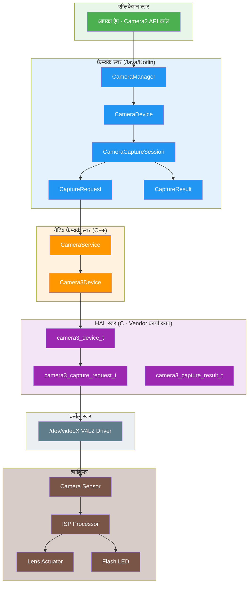
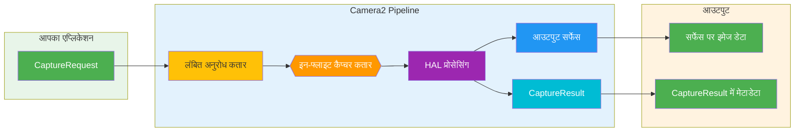
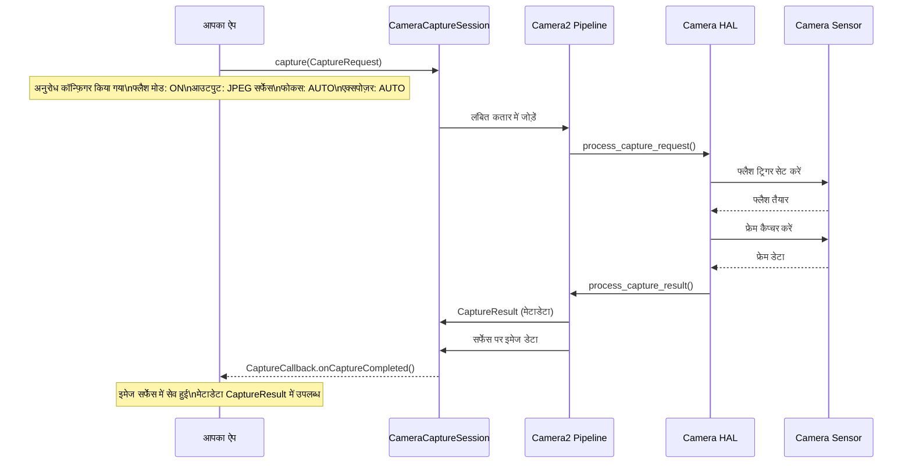
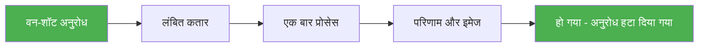
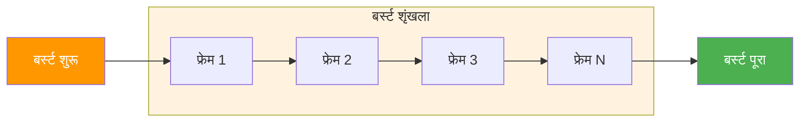
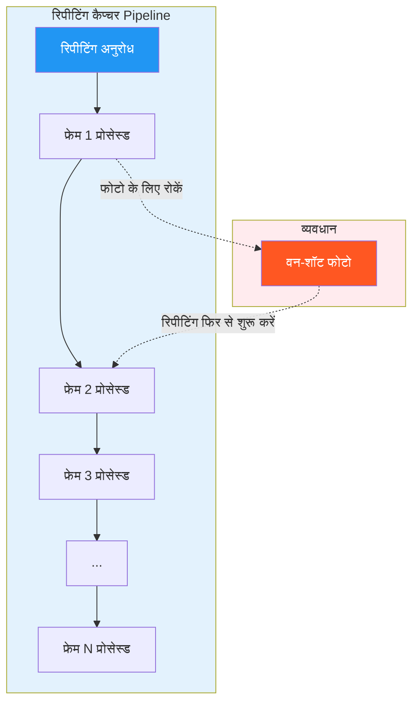
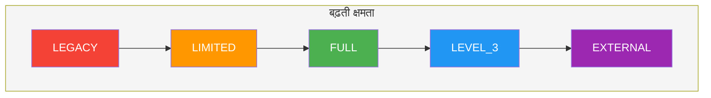
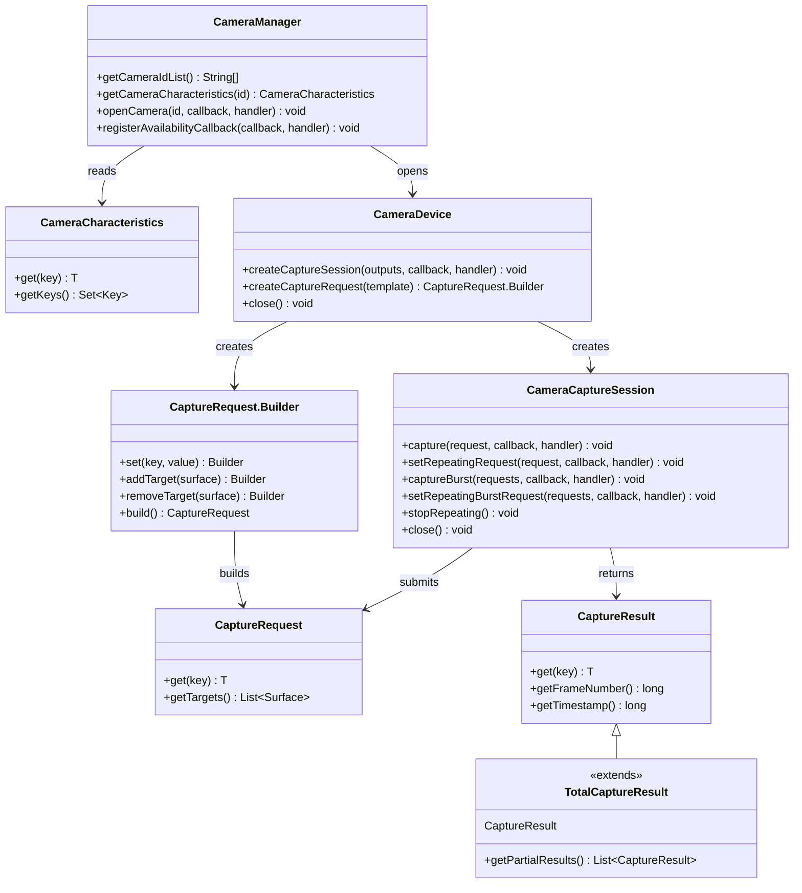
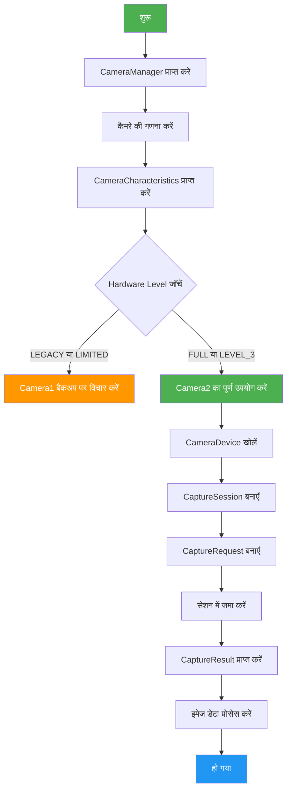
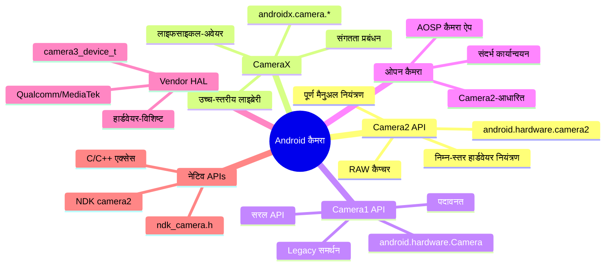

# अध्याय 1: Android Camera2 में आपका स्वागत है

> **अध्याय अवलोकन:** इस अध्याय में, हम Android Camera2 की दुनिया को शून्य से शुरू करके देखेंगे। आप न केवल समझेंगे कि Camera2 *क्या* है, बल्कि यह भी समझेंगे कि यह *क्यों* बनाया गया, यह *कैसे* काम करता है, और यह Android कैमरा इकोसिस्टम में *कहाँ* स्थित है। हम Pipeline मॉडल, Capture प्रकार, Hardware Level वर्गीकरण, और App से HAL तक की पूरी वास्तुकला को कवर करेंगे।

---

## 1.1 Camera2 क्यों सीखें?

आज लगभग हर स्मार्टफोन में एक शक्तिशाली कैमरा सिस्टम होता है। एक आधुनिक फोन यह कर सकता है:

- कम्प्यूटेशनल फोटोग्राफी के साथ पेशेवर दिखने वाली तस्वीरें कैप्चर करें
- उच्च फ्रेम दर पर 4K और 8K वीडियो रिकॉर्ड करें
- डेप्थ सेंसिंग के साथ पोर्ट्रेट इफेक्ट बनाएं
- नाइट मोड के साथ अत्यंत कम रोशनी में शूट करें
- 960 fps पर स्लो-मोशन वीडियो कैप्चर करें
- AR एप्लिकेशन के लिए 3D डेप्थ जानकारी उत्पन्न करें
- एकाधिक कैमरों को निर्बाध रूप से संयोजित करें

लेकिन जब आप डिफ़ॉल्ट कैमरा ऐप खोलते हैं, तो आपको केवल एक सरल इंटरफ़ेस दिखता है: एक शटर बटन, एक ज़ूम कंट्रोल, और कुछ शूटिंग मोड।

इस सरल इंटरफ़ेस के पीछे आश्चर्यजनक रूप से जटिल सिस्टम है। कैमरा ऐप हर एक फ्रेम का निर्माण करने के लिए हार्डवेयर कंपोनेंट्स, इमेज प्रोसेसर और Android फ्रेमवर्क के साथ संवाद करता है।

### Camera2 किसे सीखना चाहिए?

Android डेवलपर्स के रूप में, हम ऐसे एप्लिकेशन बनाना चाह सकते हैं जो डिफ़ॉल्ट कैमरा ऐप से आगे जाते हैं:

- एक **मैनुअल फोटोग्राफी एप्लिकेशन** जिसमें एक्सपोज़र, ISO, और फोकस पर पूर्ण नियंत्रण हो
- टेक्नीशियनों के लिए एक **कैमरा टेस्टिंग टूल** ताकि वे डिवाइस क्षमताओं को सत्यापित कर सकें
- एक **कम्प्यूटर विज़न एप्लिकेशन** जिसे RAW फ्रेम एक्सेस की आवश्यकता हो
- डेप्थ सेंसर का उपयोग करके एक **3D स्कैनिंग एप्लिकेशन**
- कोडेक चयन और बिटरेट कंट्रोल के साथ एक **पेशेवर वीडियो रिकॉर्डर**
- हमारे अपने [Android Camera Parameters](/) की तरह एक **कैमरा क्षमता विश्लेषक**

यदि इनमें से कोई भी परिदृश्य परिचित लगता है, तो Camera2 वह API है जिसे आपको मास्टर करने की आवश्यकता है।

---

## 1.2 Android Camera2 क्या है?

**Android Camera2** Google द्वारा **Android 5.0 (API level 21)** में पेश किया गया आधुनिक कैमरा फ्रेमवर्क है। इसने मूल `android.hardware.Camera` API (जिसे अब पूर्वनाम **Camera1** कहा जाता है) को प्रतिस्थापित किया।

### Camera2 ने क्या समस्या हल की?

पुराना Camera API (Camera1) एक सरल दुनिया के लिए डिज़ाइन किया गया था: एक कैमरा, बेसिक फोटो कैप्चर, और सरल वीडियो रिकॉर्डिंग। लेकिन स्मार्टफोन कैमरों में नाटकीय रूप से विकास हुआ:

| युग | विशिष्ट डिवाइस | Camera API |
|-----|---------------|------------|
| 2010-2014 | सिंगल कैमरा, बेसिक सेंसर | Camera1 |
| 2015-2018 | डुअल कैमरे, OIS, HDR | Camera2 (सीमित उपयोग) |
| 2019-2022 | ट्रिपल कैमरे, डेप्थ, टेलीफोटो | Camera2 (मानक) |
| 2023+ | क्वाड कैमरे, पेरिस्कोप, LiDAR, UWB | Camera2 (आवश्यक) |

आधुनिक डिवाइसों में एकाधिक रियर कैमरे (वाइड, अल्ट्रा-वाइड, टेलीफोटो, पेरिस्कोप), डेप्थ सेंसर, और यहाँ तक कि बाहरी USB कैमरे भी हो सकते हैं। वे उन्नत सुविधाओं का समर्थन करते हैं जैसे:

- मैनुअल एक्सपोज़र और फोकस
- RAW इमेज कैप्चर
- उच्च-गति वीडियो रिकॉर्डिंग
- HDR प्रोसेसिंग
- ऑप्टिकल स्टेबिलाइज़ेशन (OIS)
- मल्टी-कैमरा फ्यूजन

Camera2 डेवलपर्स को कैमरा हार्डवेयर पर **गहरा, सटीक और बारीक नियंत्रण** देने के लिए बनाया गया था।

---

## 1.3 Camera2 बनाम Camera1 बनाम CameraX

Camera2 में गहराई से जाने से पहले, आइए तीन प्रमुख कैमरा API के बीच के संबंध को स्पष्ट करें।

### Camera1 (`android.hardware.Camera`)

- **पेश किया गया:** Android 1.0 (Android 5.0 में पदावनत)
- **मॉडल:** प्रोसीजरल, स्टेटफुल, सिंगल-कैमरा उन्मुख
- **ताकतें:** सरल, अच्छी तरह समझा गया, व्यापक रूप से संगत
- **कमज़ोरियाँ:** सीमित नियंत्रण, RAW समर्थन नहीं, मल्टी-कैमरा नहीं, बर्स्ट मोड नहीं

### Camera2 (`android.hardware.camera2`)

- **पेश किया गया:** Android 5.0 (API 21)
- **मॉडल:** ऑब्जेक्ट-ओरिएंटेड, स्टेटलेस, रिक्वेस्ट/रिस्पॉन्स Pipeline
- **ताकतें:** गहरा हार्डवेयर नियंत्रण, RAW समर्थन, मल्टी-कैमरा, उच्च-गति वीडियो
- **कमज़ोरियाँ:** जटिल, वर्बोज़, कैमरा आंतरिक घटकों की समझ की आवश्यकता

### CameraX (`androidx.camera.*`)

- **पेश किया गया:** Android 10 (प्री-रिलीज़), Android 11+ में स्थिर
- **मॉडल:** डिक्लेरेटिव, लाइफसाइकल-अवेयर, यूज-केस संचालित
- **ताकतें:** उपयोग में आसान, स्वचालित संगतता, लाइफसाइकल प्रबंधन
- **कमज़ोरियाँ:** सीमित उन्नत नियंत्रण, सभी हार्डवेयर सुविधाओं को उजागर नहीं कर सकता

### तुलना तालिका

| आयाम | Camera1 | Camera2 | CameraX |
|-----------|---------|---------|---------|
| **स्तर** | निम्न-स्तर (पदावनत) | निम्न-स्तर (वर्तमान) | उच्च-स्तर (Jetpack) |
| **कठिनाई** | आसान | कठिन | आसान |
| **नियंत्रण** | न्यूनतम | अधिकतम | मध्यम |
| **RAW समर्थन** | नहीं | हाँ | सीमित |
| **मल्टी-कैमरा** | नहीं | हाँ | सीमित |
| **बर्स्ट मोड** | नहीं | हाँ | नहीं |
| **मैनुअल नियंत्रण** | सीमित | पूर्ण | सीमित |
| **किसके लिए सबसे अच्छा** | Legacy ऐप्स | उन्नत कैमरा ऐप्स | अधिकांश कैमरा ऐप्स |
| **स्थिति** | पदावनत | सक्रिय | अनुशंसित |

### यह श्रृंखला Camera2 पर क्यों केंद्रित है

जबकि अधिकांश एप्लिकेशन के लिए CameraX की अनुशंसा की जाती है, Camera2 को समझना आवश्यक है क्योंकि:

1. **CameraX Camera2 पर बना है** — CameraX हुड के नीचे Camera2 का उपयोग करता है। Camera2 को समझने से आपको पता चलता है कि CameraX क्या कर रहा है।
2. **कुछ सुविधाएँ केवल Camera2 में उपलब्ध हैं** — RAW कैप्चर, मैनुअल सेंसर नियंत्रण, और उन्नत मल्टी-कैमरा परिदृश्यों के लिए Camera2 की आवश्यकता होती है।
3. **डीबगिंग के लिए Camera2 ज्ञान की आवश्यकता है** — जब कोई CameraX ऐप अपेक्षानुसार काम नहीं करता है, तो आपको अक्सर अंतर्निहित Camera2 व्यवहार को समझने की आवश्यकता होती है ताकि समस्याओं का निदान किया जा सके।
4. **Camera2 की समझ मौलिक है** — भले ही आप अपने ऐप के लिए CameraX का उपयोग करें, Camera2 को समझने से आप बेहतर Android कैमरा डेवलपर बनते हैं।

---

## 1.4 Camera2 वास्तुकला: बड़ी तस्वीर

Camera2 Android कैमरा स्टैक के बीच में स्थित है, जो एप्लिकेशन कोड को हार्डवेयर ड्राइवरों के साथ जोड़ता है। इस वास्तुकला को समझना डीबगिंग और ऑप्टिमाइज़ेशन के लिए महत्वपूर्ण है।

### स्तरीय वास्तुकला



### वास्तुकला स्तर व्याख्या

| स्तर | स्थान | भाषा | जिम्मेदारी |
|-------|----------|----------|----------------|
| **एप्लिकेशन** | आपका ऐप कोड | Kotlin/Java | CaptureRequests बनाएँ, CaptureResults को संभालें |
| **फ्रेमवर्क (Java)** | `android.hardware.camera2.*` | Java | सार्वजनिक API, सेशन का प्रबंधन करें, डेटा रूपांतरित करें |
| **नेटिव फ्रेमवर्क** | `frameworks/av/` | C++ | Binder IPC, CameraService, Camera3Device |
| **HAL** | `hardware/libhardware/` + vendor | C | हार्डवेयर एब्सट्रैक्शन, vendor-विशिष्ट कार्यान्वयन |
| **कर्नेल** | `/dev/videoX` | C | V4L2 ड्राइवर, हार्डवेयर संचार |
| **हार्डवेयर** | भौतिक कैमरा मॉड्यूल | — | Sensor, ISP, लेंस, फ्लैश |

### मुख्य डिज़ाइन सिद्धांत: Camera2 एक Pipeline है

Camera2 के बारे में समझने के लिए सबसे महत्वपूर्ण अवधारणा यह है कि यह कैमरा ऑपरेशन को एक **Pipeline** के रूप में मॉडल करता है। हर कार्रवाई — प्रीव्यू, फोटो कैप्चर, वीडियो रिकॉर्डिंग — एक **Capture Request** के रूप में व्यक्त की जाती है जो Pipeline से गुजरती है और एक **Capture Result** का निर्माण करती है।

---

## 1.5 Camera2 Pipeline मॉडल

Pipeline Camera2 के डिज़ाइन का दिल है। यह Camera1 के स्टेटफुल, एक-बार-में-एक-मॉडल को स्टेटलेस, रिक्वेस्ट/रिस्पॉन्स मॉडल से प्रतिस्थापित करता है।

### Pipeline कैसे काम करता है



### Pipeline घटक व्याख्या

| घटक | विवरण |
|-----------|-------------|
| **CaptureRequest** | एक कॉन्फ़िगरेशन ऑब्जेक्ट जो कैप्चर के *एक फ्रेम* का वर्णन करता है। इसमें सभी पैरामीटर शामिल हैं: एक्सपोज़र टाइम, फोकस मोड, फ्लैश, आउटपुट सर्फेस, आदि। |
| **लंबित अनुरोध कतार** | एक FIFO कतार जहाँ नए CaptureRequests प्रोसेस होने की प्रतीक्षा करते हैं |
| **इन-फ्लाइट कैप्चर कतार** | वर्तमान में HAL द्वारा प्रोसेस किए जा रहे अनुरोध। आमतौर पर डिवाइस के आधार पर 1-4 अनुरोधों तक सीमित |
| **HAL प्रोसेसिंग** | हार्डवेयर एब्सट्रैक्शन लेयर अनुरोध को प्रोसेस करती है: सेंसर, ISP, लेंस, आदि को नियंत्रित करती है। |
| **आउटपुट सर्फेस** | इमेज को कॉन्फ़िगर किए गए सर्फेस (प्रीव्यू सर्फेस, ImageReader सर्फेस, आदि) पर लिखा जाता है |
| **CaptureResult** | कैप्चर के बारे में मेटाडेटा: वास्तविक एक्सपोज़र टाइम, AF स्थिति, टाइमस्टैंप, आदि। इसमें इमेज डेटा नहीं होता |

### मुख्य Pipeline गुण

1. **अनुरोध स्टेटलेस हैं** — हर CaptureRequest में सभी आवश्यक जानकारी होती है। Pipeline को पिछले अनुरोधों की कोई याद नहीं होती।
2. **प्रोसेसिंग अनुक्रमिक है** — अनुरोधों को HAL द्वारा FIFO क्रम में प्रोसेस किया जाता है।
3. **परिणाम एसिंक्रोनस हैं** — CaptureResults कॉलबैक के माध्यम से आते हैं, सिंक्रोनस रूप से वापस नहीं किए जाते।
4. **प्रति अनुरोध एकाधिक आउटपुट** — एक CaptureRequest एकाधिक सर्फेस (जैसे, एक साथ प्रीव्यू + फोटो) पर लिख सकता है।
5. **Pipeline को कॉन्फ़िगर किया जा सकता है** — आप टेम्पलेट (प्रीव्यू, स्टिल कैप्चर, रिकॉर्ड) या पूर्ण मैनुअल मोड चुन सकते हैं।

### ठोस उदाहरण: फ्लैश के साथ फोटो लेना

Pipeline को समझने के लिए, आइए फ्लैश के साथ फोटो लेने पर क्या होता है इसका पता लगाएँ:



---

## 1.6 Capture प्रकार: वन-शॉट, बर्स्ट, और रिपीटिंग

Camera2 तीन मौलिक Capture प्रकारों को परिभाषित करता है, प्रत्येक अलग-अलग यूज़ केस को पूरा करता है। इन्हें समझना कैमरा एप्लिकेशन को सही ढंग से डिज़ाइन करने के लिए महत्वपूर्ण है।

### प्रकार 1: वन-शॉट कैप्चर

**वन-शॉट** कैप्चर ठीक एक बार निष्पादित होते हैं। वे एकल कार्रवाइयों जैसे फोटो लेने या एक बार के सेटिंग परिवर्तन को लागू करने के लिए आदर्श हैं।



**यूज़ केस:**
- एकल फोटो लेना
- अस्थायी फ्लैश लागू करना
- विश्लेषण के लिए फ्रेम कैप्चर करना
- एक बार ऑटो-फोकस ट्रिगर करना

**API कॉल:**
```kotlin
cameraCaptureSession.capture(captureRequest, callback, handler)
```

### प्रकार 2: बर्स्ट कैप्चर

**बर्स्ट** कैप्चर बिना रुके लगातार कई बार निष्पादित होते हैं। एक बार शुरू होने पर, बर्स्ट पूरा होने तक कोई अन्य अनुरोध सम्मिलित नहीं किया जा सकता।



**मुख्य विशेषताएँ:**
- बर्स्ट में सभी फ्रेम में समान या क्रमिक रूप से भिन्न सेटिंग्स होती हैं
- बर्स्ट के दौरान कोई अन्य अनुरोध प्रोसेस नहीं किया जा सकता
- बर्स्ट कतार लंबित अनुरोध कतार से अलग है
- रिपीटिंग अनुरोधों से उच्च प्राथमिकता

**यूज़ केस:**
- लगातार फोटो कैप्चर (बर्स्ट मोड)
- ब्रैकेटिंग (विभिन्न एक्सपोज़र पर समान दृश्य कैप्चर करना)
- गति विश्लेषण (तेज़ी से चलने वाले विषयों को कैप्चर करना)
- कंपोजिटिंग के लिए अनुक्रमिक मल्टी-फ्रेम कैप्चर

**API कॉल:**
```kotlin
cameraCaptureSession.captureBurst(burstRequests, callback, handler)
```

### प्रकार 3: रिपीटिंग कैप्चर

**रिपीटिंग** कैप्चर लगातार निष्पादित होते हैं, जो लाइव प्रीव्यू और वीडियो रिकॉर्डिंग का आधार बनते हैं। जब एक रिपीटिंग अनुरोध सक्रिय होता है, तो यह अन्य कैप्चर के बीच Pipeline पर कब्ज़ा कर लेता है।



**मुख्य विशेषताएँ:**
- एक बार में केवल एक रिपीटिंग अनुरोध सक्रिय हो सकता है (पिछले को प्रतिस्थापित करता है)
- वन-शॉट और बर्स्ट अनुरोधों द्वारा बाधित होता है, फिर स्वचालित रूप से फिर से शुरू होता है
- प्रीव्यू और वीडियो रिकॉर्डिंग का आधार बनता है
- हर फ्रेम के लिए व्यक्तिगत CaptureResults नहीं बनाता (दक्षता के लिए आंशिक परिणामों का उपयोग करता है)

**यूज़ केस:**
- लाइव कैमरा प्रीव्यू
- वीडियो रिकॉर्डिंग
- लगातार फोकस मॉनिटरिंग
- रियल-टाइम फ्रेम विश्लेषण

**API कॉल:**
```kotlin
cameraCaptureSession.setRepeatingRequest(captureRequest, callback, handler)
// या वीडियो के लिए:
cameraCaptureSession.setRepeatingBurstRequest(burstRequests, callback, handler)
```

### कैप्चर प्रकार तुलना

| सुविधा | वन-शॉट | बर्स्ट | रिपीटिंग |
|---------|----------|-------|-----------|
| **निष्पादन** | एक बार | एकाधिक (संलग्न) | निरंतर |
| **प्राथमिकता** | उच्च | उच्चतम | सबसे कम |
| **व्यवधान** | बाधित नहीं किया जा सकता | बाधित नहीं किया जा सकता | बाधित किया जा सकता है |
| **कतार** | लंबित कतार | अलग बर्स्ट कतार | Pipeline अधिग्रहण |
| **विशिष्ट उपयोग** | फोटो, सिंगल फ्रेम | बर्स्ट मोड, ब्रैकेटिंग | प्रीव्यू, वीडियो |
| **परिणाम कॉलबैक** | प्रति कॉल एक परिणाम | प्रति फ्रेम एक परिणाम | समय-समय पर परिणाम |

### कैप्चर टेम्पलेट सिस्टम

Camera2 सामान्य कैप्चर परिदृश्यों के लिए पूर्वनिर्धारित टेम्पलेट प्रदान करता है:

| टेम्पलेट | विवरण | यूज़ केस |
|----------|-------------|----------|
| `TEMPLATE_PREVIEW` | लाइव प्रीव्यू के लिए ऑप्टिमाइज़ | कैमरा प्रीव्यू |
| `TEMPLATE_STILL_CAPTURE` | फोटो कैप्चर के लिए ऑप्टिमाइज़ | फोटो लेना |
| `TEMPLATE_RECORD` | वीडियो रिकॉर्डिंग के लिए ऑप्टिमाइज़ | वीडियो कैप्चर |
| `TEMPLATE_VIDEO_SNAPSHOT` | वीडियो रिकॉर्डिंग के दौरान फोटो | रिकॉर्डिंग के दौरान स्नैपशॉट |
| `TEMPLATE_ZERO_SHUTTER_LAG` | उच्च गुणवत्ता, न्यूनतम विलंब | बर्स्ट फोटोग्राफी |
| `TEMPLATE_MANUAL` | सभी ऑटो नियंत्रण अक्षम | पूर्ण मैनुअल नियंत्रण |

टेम्पलेट्स शॉर्टकट हैं जो सामान्य पैरामीटर को पूर्व-कॉन्फ़िगर करते हैं। फिर आप टेम्पलेट से व्यक्तिगत सेटिंग्स को संशोधित कर सकते हैं।

---

## 1.7 समर्थित Hardware Levels

सभी Android डिवाइस पूरे Camera2 फीचर सेट का समर्थन नहीं करते। इसे संबोधित करने के लिए, Google ने **समर्थित Hardware Levels** को परिभाषित किया — एक वर्गीकरण प्रणाली जो डेवलपर्स को बताती है कि डिवाइस के कैमरा कार्यान्वयन से क्या अपेक्षा करें।

### Hardware Level वर्गीकरण



### स्तर विवरण

| स्तर | विवरण | Camera2 समर्थन |
|-------|-------------|----------------|
| **LEGACY** | Camera1 के साथ बैकवर्ड-संगत। Camera2 कॉल हुड के नीचे Camera1 में परिवर्तित होते हैं। | केवल बेसिक Camera1 सुविधाएँ |
| **LIMITED** | कुछ Camera2 सुविधाएँ समर्थित। पूर्ण Camera2 Pipeline की गारंटी नहीं। | आंशिक Camera2 सुविधाएँ |
| **FULL** | पूर्ण Camera2 फीचर सेट। पूर्ण Pipeline, मैनुअल नियंत्रण, मल्टी-कैमरा। | सभी Camera2 सुविधाएँ |
| **LEVEL_3** | FULL में सब कुछ, साथ ही YUV रीप्रोसेसिंग और अतिरिक्त आउटपुट स्ट्रीम। | FULL + उन्नत सुविधाएँ |
| **EXTERNAL** | LIMITED के समान लेकिन बाहरी कैमरों (USB, आदि) के लिए। | बाहरी कैमरा समर्थन |

### Hardware Level कैसे जाँचें

आप `CameraCharacteristics` का उपयोग करके hardware level क्वेरी कर सकते हैं:

```kotlin
val cameraManager = getSystemService(Context.CAMERA_SERVICE) as CameraManager
val cameraId = cameraManager.cameraIdList[0]
val characteristics = cameraManager.getCameraCharacteristics(cameraId)

val hardwareLevel = characteristics.get(CameraCharacteristics.INFO_SUPPORTED_HARDWARE_LEVEL)
val levelName = when (hardwareLevel) {
    CameraCharacteristics.INFO_SUPPORTED_HARDWARE_LEVEL_LEGACY -> "LEGACY"
    CameraCharacteristics.INFO_SUPPORTED_HARDWARE_LEVEL_LIMITED -> "LIMITED"
    CameraCharacteristics.INFO_SUPPORTED_HARDWARE_LEVEL_FULL -> "FULL"
    CameraCharacteristics.INFO_SUPPORTED_HARDWARE_LEVEL_3 -> "LEVEL_3"
    CameraCharacteristics.INFO_SUPPORTED_HARDWARE_LEVEL_EXTERNAL -> "EXTERNAL"
    else -> "UNKNOWN"
}
Log.d("Camera", "Hardware Level: $levelName")
```

### व्यावहारिक निहितार्थ

| स्तर | आपके ऐप के लिए इसका क्या मतलब है |
|-------|---------------------------|
| **LEGACY** | Camera2 काम कर सकता है लेकिन सीमाओं के साथ। Camera1 को बैकअप के रूप में विचार करें। |
| **LIMITED** | बेसिक Camera2 सुविधाएँ काम करती हैं। कुछ उन्नत सुविधाएँ गुम हो सकती हैं। |
| **FULL** | पूर्ण Camera2 समर्थन। सभी Camera2 सुविधाओं का उपयोग करना सुरक्षित है। |
| **LEVEL_3** | YUV रीप्रोसेसिंग और उन्नत मल्टी-स्ट्रीम सुविधाओं का उपयोग कर सकते हैं। |
| **EXTERNAL** | USB कैमरे और अन्य बाहरी इनपुट का समर्थन कर सकते हैं। |

### रनटाइम क्षमता क्वेरी

Hardware level से परे, हमेशा रनटाइम पर विशिष्ट क्षमताओं की जाँच करें:

```kotlin
val capabilities = characteristics.get(CameraCharacteristics.REQUEST_AVAILABLE_CAPABILITIES)
capabilities?.forEach { capability ->
    when (capability) {
        CameraMetadata.REQUEST_AVAILABLE_CAPABILITIES_BACKWARD_COMPATIBLE ->
            Log.d("Camera", "बैकवर्ड कंपेटिबल मोड का समर्थन करता है")
        CameraMetadata.REQUEST_AVAILABLE_CAPABILITIES_MANUAL_SENSOR ->
            Log.d("Camera", "मैनुअल सेंसर नियंत्रण का समर्थन करता है")
        CameraMetadata.REQUEST_AVAILABLE_CAPABILITIES_MANUAL_POST_PROCESSING ->
            Log.d("Camera", "मैनुअल पोस्ट-प्रोसेसिंग का समर्थन करता है")
        CameraMetadata.REQUEST_AVAILABLE_CAPABILITIES_RAW ->
            Log.d("Camera", "RAW कैप्चर का समर्थन करता है")
        CameraMetadata.REQUEST_AVAILABLE_CAPABILITIES_PRIVATE_REPROCESSING ->
            Log.d("Camera", "प्राइवेट रीप्रोसेसिंग का समर्थन करता है")
        CameraMetadata.REQUEST_AVAILABLE_CAPABILITIES_DEEP_OUTPUT ->
            Log.d("Camera", "डीप आउटपुट का समर्थन करता है")
    }
}
```

---

## 1.8 Camera2 कोर कक्षाओं अवलोकन

Camera2 का API कोर कक्षाओं के एक छोटे सेट के चारों ओर बनाया गया है। आइए प्रत्येक में गहराई से जाने से पहले उनसे मिलें।

### कोर कक्षा संबंध चित्र



### कक्षा जिम्मेदारियाँ

| कक्षा | पैकेज | जिम्मेदारी |
|-------|---------|----------------|
| `CameraManager` | `android.hardware.camera2` | शीर्ष-स्तरीय सिस्टम सेवा। कैमरों की गणना करता है, CameraDevice तक पहुँच प्रदान करता है। |
| `CameraCharacteristics` | `android.hardware.camera2` | रीड-ओनली कैमरा क्षमताएँ मेटाडेटा। |
| `CameraDevice` | `android.hardware.camera2` | कनेक्टेड कैमरे का प्रतिनिधित्व करता है। सेशन और कैप्चर रिक्वेस्ट बिल्डर बनाता है। |
| `CameraCaptureSession` | `android.hardware.camera2` | Pipeline इंस्टेंस। CaptureRequests जमा करता है, रिपीटिंग कैप्चर का प्रबंधन करता है। |
| `CaptureRequest` | `android.hardware.camera2` | अपरिवर्तनीय कैप्चर कॉन्फ़िगरेशन। एक फ्रेम के लिए सभी पैरामीटर। |
| `CaptureRequest.Builder` | `android.hardware.camera2` | CaptureRequest ऑब्जेक्ट बनाने के लिए बिल्डर। |
| `CaptureResult` | `android.hardware.camera2` | पूर्ण कैप्चर से मेटाडेटा आउटपुट। |
| `TotalCaptureResult` | `android.hardware.camera2` | सभी आंशिक परिणामों सहित पूर्ण कैप्चर परिणाम। |

### Camera2 कार्यप्रवाह



---

## 1.9 Camera2 बनाम Camera1: विस्तृत तुलना

यदि आपने पहले Camera1 के साथ काम किया है, तो आप अंतर की सराहना करेंगे। यदि आपने नहीं किया है, तो यह खंड आपको यह समझने में मदद करेगा कि Camera2 एक मौलिक पुनर्डिज़ाइन क्यों है।

### वास्तुकला तुलना

| पहलू | Camera1 | Camera2 |
|--------|---------|---------|
| **प्रोग्रामिंग मॉडल** | प्रोसीजरल (इम्परेटिव) | ऑब्जेक्ट-ओरिएंटेड (डिक्लेरेटिव) |
| **स्टेट प्रबंधन** | स्टेटफुल (कैमरा स्थिति बनाए रखता है) | स्टेटलेस (प्रत्येक अनुरोध स्वयं-निहित है) |
| **कैप्चर मॉडल** | कमांड (takePicture(), startPreview()) | Pipeline (CaptureRequest → CaptureResult) |
| **थ्रेडिंग** | अधिकांशतः सिंगल-थ्रेडेड | मल्टी-थ्रेडेड उपयोग के लिए डिज़ाइन किया गया |
| **त्रुटि प्रबंधन** | अपवाद, पुनर्प्राप्त करना कठिन | त्रुटि कोड + अपवाद, अधिक बारीक |
| **मेटाडेटा** | कैप्चर के बाद रीड-ओनली | कैप्चर के दौरान रियल-टाइम में उपलब्ध |
| **एकाधिक आउटपुट** | समर्थित नहीं | एक अनुरोध → एकाधिक सर्फेस |
| **ज़ीरो-कॉपी** | समर्थित नहीं | ImageReader के माध्यम से समर्थित |

### API तुलना साइड-बाय-साइड

#### कैमरा खोलना

```kotlin
// Camera1 (पुराना API)
val camera = Camera.open()
camera.setPreviewDisplay(surfaceHolder)
camera.startPreview()

// Camera2 (नया API)
val cameraManager = getSystemService(Context.CAMERA_SERVICE) as CameraManager
cameraManager.openCamera(cameraId, object : CameraDevice.StateCallback() {
    override fun onOpened(camera: CameraDevice) {
        mCameraDevice = camera
        // सेशन और अनुरोध बनाएँ...
    }
    override fun onDisconnected(camera: CameraDevice) { camera.close() }
    override fun onError(camera: CameraDevice, error: Int) { camera.close() }
}, handler)
```

#### फोटो लेना

```kotlin
// Camera1 (पुराना API)
camera.takePicture(null, null, object : Camera.PictureCallback() {
    override fun onPictureTaken(data: ByteArray, camera: Camera) {
        // इमेज डेटा प्रोसेस करें
    }
})

// Camera2 (नया API)
val requestBuilder = mCameraDevice.createCaptureRequest(CameraDevice.TEMPLATE_STILL_CAPTURE)
requestBuilder.addTarget(imageReader.surface)
val captureRequest = requestBuilder.build()
mCameraCaptureSession.capture(captureRequest, object : CameraCaptureSession.CaptureCallback() {
    override fun onCaptureCompleted(session: CameraCaptureSession, 
                                    request: CaptureRequest, 
                                    result: TotalCaptureResult) {
        // परिणाम में मेटाडेटा
        val exposureTime = result.get(CaptureResult.SENSOR_EXPOSURE_TIME)
    }
}, handler)
// इमेज डेटा ImageReader.OnImageAvailableListener के माध्यम से आता है
```

#### व्यवहार में मुख्य अंतर

| ऑपरेशन | Camera1 | Camera2 |
|-----------|---------|---------|
| **प्रीव्यू + फोटो** | फोटो लेने के लिए प्रीव्यू रोकना पड़ता है, फिर रीस्टार्ट करना पड़ता है | प्रीव्यू रोके बिना फोटो ली जा सकती है |
| **एकाधिक फोटो** | एक बार में केवल एक फोटो | मनमानी संख्या के साथ बर्स्ट मोड |
| **मैनुअल एक्सपोज़र** | उपलब्ध नहीं | एक्सपोज़र टाइम और गेन पर पूर्ण नियंत्रण |
| **मैनुअल फोकस** | केवल पूर्वनिर्धारित मोड | लेंस स्थिति पर पूर्ण नियंत्रण |
| **RAW कैप्चर** | उपलब्ध नहीं | FULL+ डिवाइसों पर समर्थित |
| **रियल-टाइम मेटाडेटा** | उपलब्ध नहीं | आंशिक CaptureResults के माध्यम से उपलब्ध |

### Camera1 से माइग्रेशन टिप्स

यदि आप Camera1 से Camera2 में माइग्रेट कर रहे हैं, तो इन टिप्स को ध्यान में रखें:

1. **CaptureRequests के संदर्भ में सोचें**, कमांड के रूप में नहीं। हर कार्रवाई — फोकस, फ्लैश, फोटो — एक CaptureRequest है।
2. **प्रीव्यू को कैप्चर से अलग करें**। Camera1 में, आपको कैप्चर करने के लिए प्रीव्यू रोकना पड़ता था। Camera2 में, आप रिपीटिंग अनुरोध के जारी रहने पर एक अलग अनुरोध जमा करते हैं।
3. **कॉलबैक के लिए हैंडलर का उपयोग करें**। Camera2 कॉलबैक हैंडलर के थ्रेड पर चलते हैं। ANR से बचने के लिए हमेशा एक प्रदान करें।
4. **पहले hardware level जाँचें**। यदि कोई डिवाइस LEGACY है, तो इसके बजाय Camera1 पर विचार करें।
5. **सामान्य ऑपरेशन के लिए CaptureRequest टेम्पलेट्स का उपयोग करें**। शून्य से निर्माण करने के बजाय टेम्पलेट्स से संशोधित करें।
6. **मुख्य थ्रेड को ब्लॉक न करें**। सभी Camera2 ऑपरेशन बैकग्राउंड थ्रेड पर चलने चाहिए।

---

## 1.10 Android इकोसिस्टम में Camera2

Camera2 अलग-थलग मौजूद नहीं है। यह कैमरा-संबंधित API और लाइब्रेरी के बड़े इकोसिस्टम का हिस्सा है।

### कैमरा API इकोसिस्टम



### किस API का उपयोग कब करें

| आवश्यकता | अनुशंसित API | कारण |
|-------------|----------------|--------|
| सरल फोटो ऐप | CameraX | सबसे आसान, सबसे संगत |
| वीडियो रिकॉर्डिंग | CameraX | बिल्ट-इन वीडियो समर्थन |
| मैनुअल फोटोग्राफी | Camera2 | सभी पैरामीटरों पर पूर्ण नियंत्रण |
| कम्प्यूटर विज़न | Camera2 | डायरेक्ट फ्रेम एक्सेस, न्यूनतम विलंब |
| मल्टी-कैमरा फ्यूजन | Camera2 | पूर्ण मल्टी-कैमरा समर्थन वाला एकमात्र API |
| RAW कैप्चर | Camera2 | RAW समर्थन वाला एकमात्र API |
| बाहरी कैमरा | Camera2 | बाहरी कैमरा समर्थन (EXTERNAL level) |
| Legacy डिवाइस समर्थन | Camera1 | पुराने डिवाइसों के साथ संगतता |

---

## 1.11 Android Camera Parameters के साथ सीखना

दस्तावेज़ीकरण पढ़ना उपयोगी है, लेकिन कैमरा क्षमताओं को समझना तब आसान होता है जब आप किसी वास्तविक फोन से वास्तविक डेटा देख सकें। इस श्रृंखला में, हम आपके अपने डिवाइस से वास्तविक कैमरा जानकारी का पता लगाने के लिए [Android Camera Parameters](/) का उपयोग करेंगे।

आप ऐप का उपयोग करके खोज सकते हैं:

- उपलब्ध कैमरे (ID, फेसिंग, hardware level)
- समर्थित रिज़ॉल्यूशन और फ्रेम दर
- सेंसर जानकारी (सक्रिय सरणी आकार, फोकल लेंथ)
- मैनुअल कंट्रोल समर्थन (ISO रेंज, एक्सपोज़र टाइम रेंज)
- RAW क्षमता और फ़ॉर्मेट
- Hardware level और समर्थित क्षमताएँ
- पूर्ण CameraCharacteristics डंप

अमूर्त उदाहरणों से सीखने के बजाय, आप सीधे अपने डिवाइस की जाँच कर सकते हैं और देख सकते हैं कि इस अध्याय की अवधारणाएँ वास्तविक हार्डवेयर पर कैसे लागू होती हैं।

---

## 1.12 मुख्य बातें

अध्याय 1 पूरा करने पर बधाई! यहाँ आपको क्या याद रखना चाहिए:

### मुख्य अवधारणाएँ

1. **Camera2 एक Pipeline है** — हर कैमरा ऑपरेशन एक CaptureRequest है जो Pipeline से गुजरता है और एक CaptureResult का निर्माण करता है।
2. **Capture प्रकार** — वन-शॉट (सिंगल), बर्स्ट (एकाधिक संलग्न), रिपीटिंग (निरंतर)
3. **Hardware Levels** — LEGACY → LIMITED → FULL → LEVEL_3 → EXTERNAL
4. **वास्तुकला स्तर** — App → Framework → Native Framework → HAL → Kernel → Hardware

### व्यावहारिक सिद्धांत

1. **हमेशा hardware level जाँचें** — सभी डिवाइस पूर्ण Camera2 सुविधाओं का समर्थन नहीं करते
2. **रनटाइम पर क्षमताएँ जाँचें** — मान लें कि सुविधाएँ उपलब्ध हैं
3. **सामान्य ऑपरेशन के लिए टेम्पलेट्स का उपयोग करें** — `TEMPLATE_PREVIEW`, `TEMPLATE_STILL_CAPTURE`, आदि।
4. **बैकग्राउंड थ्रेड पर चलाएँ** — Camera2 ऑपरेशन मुख्य थ्रेड को ब्लॉक नहीं करने चाहिए
5. **प्रीव्यू को कैप्चर से अलग करें** — प्रीव्यू के लिए रिपीटिंग अनुरोध, फोटो के लिए वन-शॉट

### आगे क्या है

अगले अध्याय में, **स्मार्टफोन कैमरों को समझना**, हम क्षणभर के लिए Android को छोड़कर कैमरा हार्डवेयर का ही पता लगाएँगे। आप इसके बारे में सीखेंगे:

- कैमरा सेंसर तकनीक (CMOS बनाम CCD)
- लेंस डिज़ाइन और फोकल लेंथ
- ISP (इमेज सिग्नल प्रोसेसर) प्रोसेसिंग Pipeline
- समान मेगापिक्सल गणना वाले दो फोन पूरी तरह से अलग फोटो क्यों बना सकते हैं
- प्रकाश से अंतिम फोटो तक की पूरी इमेज Pipeline

एक बार जब आप हार्डवेयर को समझ लेते हैं, तो Camera2 अवधारणाएँ बहुत अधिक सहज हो जाएँगी।

---

## 1.13 सारांश

Android Camera2 एक शक्तिशाली, निम्न-स्तरीय कैमरा फ्रेमवर्क है जो डेवलपर्स को कैमरा हार्डवेयर पर अभूतपूर्व नियंत्रण प्रदान करता है। इसकी Pipeline-आधारित वास्तुकला, तीन Capture प्रकार, और Hardware Level वर्गीकरण उन्नत कैमरा एप्लिकेशन बनाने के लिए एक मजबूत नींव प्रदान करते हैं।

इस अध्याय में, हमने कवर किया:
- ✅ Camera2 वास्तुकला और इकोसिस्टम स्थिति
- ✅ रिक्वेस्ट/रिजल्ट फ्लो के साथ Pipeline मॉडल
- ✅ Capture प्रकार: वन-शॉट, बर्स्ट, रिपीटिंग
- ✅ Hardware Level वर्गीकरण और रनटाइम जाँच
- ✅ कोर कक्षाओं अवलोकन और संबंध
- ✅ Camera1 बनाम Camera2 विस्तृत तुलना

अब आइए अध्याय 2 में कैमरा हार्डवेयर में गहराई से जाएँ! 🚀