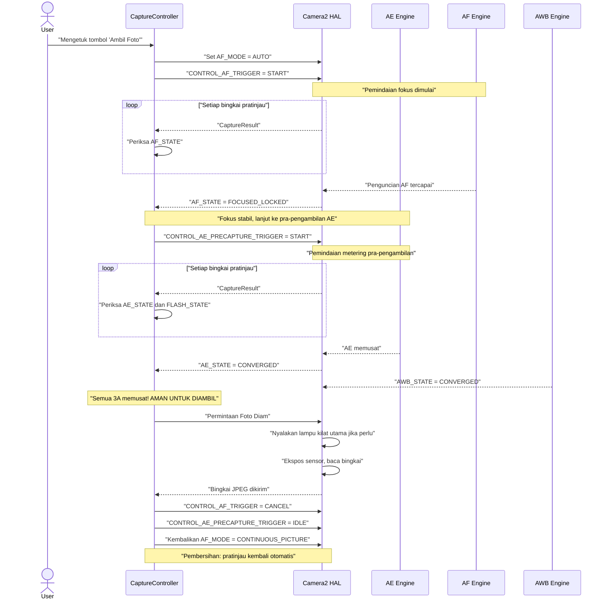
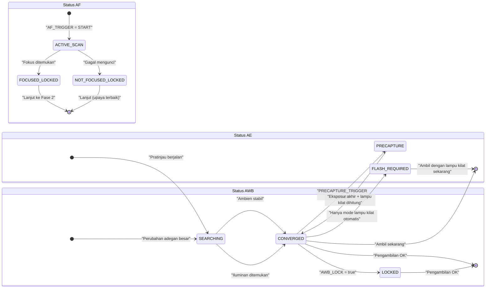

# Bab 17: Pipeline 3A

Kita telah mempelajari **AE** (Auto Exposure, Bab 13–14), **AF** (Auto Focus, Bab 15), dan **AWB** (Auto White Balance, Bab 16) sebagai sistem yang independen. Aplikasi fotografi sungguhan harus mengoordinasikan ketiganya sebelum setiap penekanan tombol rana — dan *urutan serta waktunya* sangatlah penting.

Implementasi naif yang langsung menembakkan `capture()` saat pengguna mengetuk tombol rana akan menghasilkan hasil yang tidak konsisten: terkadang fokus, terkadang tidak; terkadang lampu kilat menyala, terkadang tidak; terkadang AWB di tengah pemindaian memberikan foto berwarna kehijauan. Pipeline 3A yang andal akan menghilangkan semua itu.

Implementasi pipeline 3A dalam bab ini identik dengan alur yang digunakan secara internal dalam [aplikasi Android Camera Parameters](https://github.com/zoozooll/AndroidCameraParameters) dan urutan yang dijelaskan dalam dokumen penelitian arsitektur Kamera Android serta artikel CSDN tentang pengembangan Camera2 profesional.

---

## Urutan Orkestrasi 3A Penuh (Ikhtisar)

Sebelum mendalami setiap subsistem, mari kita visualisasikan alur status yang lengkap. Ini adalah urutan produksi yang sebenarnya — bukan penyederhanaan.



**Setiap langkah bersifat memblokir.** Anda tidak pindah ke langkah N+1 sampai HAL mengonfirmasi status yang diperlukan pada langkah N. Jangan pernah melewati langkah-langkah tersebut — itulah cara Anda merilis aplikasi dengan fokus yang sesekali meleset, eksposur lampu kilat yang buruk, atau foto berwarna kebiruan.

---

## Pembahasan Mendalam AE (Auto Exposure)

AE adalah yang paling kompleks dari ketiga A tersebut karena mencakup bukan hanya rana+ISO tetapi juga **metering lampu kilat** dan **pemicu pra-pengambilan (precapture trigger)**.

### Mode AE: CONTROL_AE_MODE

| Mode | Perilaku | Dukungan Lampu Kilat |
|------|----------|--------------|
| `OFF` | Manual sepenuhnya (dibahas di Bab 14) | Tidak ada |
| `ON` | Eksposur otomatis, **lampu kilat dinonaktifkan** (mati permanen) | Tidak |
| `ON_AUTO_FLASH` | Eksposur otomatis, **keputusan lampu kilat otomatis** — HAL menyalakan lampu kilat hanya dalam cahaya rendah | Otomatis (default yang paling umum) |
| `ON_ALWAYS_FLASH` | Eksposur otomatis, **lampu kilat selalu menyala** (lampu kilat pengisi untuk potret dengan cahaya latar) | Selalu |
| `ON_AUTO_FLASH_REDEYE` | Eksposur otomatis + lampu kilat + pengurangan mata merah (menyalakan urutan lampu kilat awal untuk mengecilkan pupil) | Otomatis + mata merah |
| `ON_EXTERNAL_FLASH` | Lampu kilat aksesori kamera eksternal | Eksternal saja (jarang) |

**Default untuk aplikasi kamera normal** adalah `ON_AUTO_FLASH`. Pengguna mengharapkan ponsel untuk "tahu" kapan harus menyalakan lampu kilat.

### Status AE & Pemicu Pra-Pengambilan

Seperti AF, AE melaporkan statusnya melalui `CaptureResult.CONTROL_AE_STATE`:

| Status | Arti |
|-------|---------|
| `INACTIVE` (0) | AE dinonaktifkan atau belum dimulai |
| `SEARCHING` (1) | Sedang aktif mencari eksposur yang benar |
| `CONVERGED` (2) | Eksposur stabil. Dalam mode lampu kilat, ini berarti eksposur *ambien* telah memusat, tetapi pemindaian lampu kilat awal belum terjadi. |
| `LOCKED` (3) | Eksposur dikunci secara eksplisit melalui `CONTROL_AE_LOCK = true` |
| `FLASH_REQUIRED` (4) | Memusat pada ambien, dan HAL telah memutuskan **lampu kilat diperlukan** untuk bidikan yang benar |
| `PRECAPTURE` (5) | **Status utama.** Pemindaian pra-pengambilan sedang berjalan — HAL sedang melakukan metering (menyalakan pulsa lampu kilat awal, jika lampu kilat diperlukan) untuk menghitung eksposur akhir pengambilan + kekuatan lampu kilat. |

### Mengapa Pemicu Pra-Pengambilan Itu Penting

Mesin AE yang berjalan pada bingkai pratinjau bersifat *perkiraan*. Pipeline pratinjau menggunakan buffer yang lebih kecil, pemrosesan kedalaman bit yang lebih rendah, dan tidak memperhitungkan kontribusi cahaya masif dari lampu kilat utama yang menyala saat pengambilan gambar.

`CONTROL_AE_PRECAPTURE_TRIGGER = START` memberi tahu HAL:

> "Saya akan mengambil foto diam yang sebenarnya. Berhenti memperkirakan. Jalankan pipeline metering presisi penuh. Jika saya berada dalam mode lampu kilat otomatis, nyalakan satu atau lebih lampu kilat awal berdaya rendah, ukur pantulannya, dan hitung rana/ISO/daya lampu kilat akhir yang tepat untuk pengambilan gambar."

**Melewati pra-pengambilan = foto lampu kilat akan secara acak kelebihan atau kekurangan eksposur.** HAL sama sekali tidak memiliki kesempatan untuk melakukan metering untuk lampu kilat secara real-time.

### Wilayah AE (Spot Metering)

Sama seperti `CONTROL_AF_REGIONS` untuk fokus, `CONTROL_AE_REGIONS` menentukan *di mana dalam adegan* untuk melakukan metering. Ketukan-untuk-fokus (tap-to-focus) pada potret harus secara bersamaan menerapkan wilayah yang sama ke AE — wajah mendapatkan prioritas fokus DAN prioritas eksposur, bukan dimetering berdasarkan latar belakang langit yang cerah.

```kotlin
// Gunakan array MeteringRectangle yang SAMA untuk wilayah AF dan AE
val focusWeightedRegions = arrayOf(userTapRegion)
builder.set(CaptureRequest.CONTROL_AF_REGIONS, focusWeightedRegions)
builder.set(CaptureRequest.CONTROL_AE_REGIONS, focusWeightedRegions)
```

**Pembobotan:** Setiap `MeteringRectangle` memiliki `weight` (0–1000). Wilayah dengan bobot lebih tinggi lebih memengaruhi metering. Mode "spot metering" menggunakan satu persegi panjang berbobot tinggi (1000). Metering "Matrix / Evaluative" menggunakan banyak persegi panjang berbobot rendah yang tersebar di seluruh bingkai.

---

## AWB: Mitra Diam dari Trio Tersebut

AWB biasanya memusat lebih awal dan tetap memusat di sebagian besar adegan — itulah sebabnya ia sering dianggap sebagai hal sekunder. Namun kontribusinya terhadap akurasi warna sangat kritis, dan ia *bisa saja* masih mencari saat Anda sudah siap untuk mengambil foto.

### Rekap Status AWB

| Status AWB | Keputusan Pengambilan |
|-----------|------------------|
| `INACTIVE` (AWB_MODE = OFF) | Oke untuk dilanjutkan (gain manual) |
| `SEARCHING` | **Tunggu.** Warna mungkin masih bergeser. Biasanya < 500ms setelah perubahan adegan besar. |
| `CONVERGED` | ✅ Sempurna — lanjutkan |
| `LOCKED` | ✅ Juga sempurna — dikunci secara eksplisit melalui `CONTROL_AWB_LOCK = true` |

### Menghubungkan Kunci AWB dengan Kunci AE/AF

Untuk fotografi studio/produk yang kritis, kunci ketiganya *sebelum* pengambilan gambar:

```kotlin
// Dalam permintaan foto diam (tidak lebih awal — kita ingin nilai yang sudah memusat akhir yang dikunci)
builder.set(CaptureRequest.CONTROL_AWB_LOCK, true)
builder.set(CaptureRequest.CONTROL_AE_LOCK, true)
// AF tetap terkunci karena kita memicunya lebih awal dan belum membatalkannya
```

Ini menjamin pengambilan gambar utama menggunakan profil warna/wb yang *persis* sama dengan yang digunakan bingkai metering pra-pengambilan akhir.

---

## Pengontrol Pengambilan Gambar 3A Produksi Lengkap (Kotlin)

Sekarang mari kita rakit semuanya menjadi kelas yang dapat digunakan kembali. Implementasi ini cocok dengan alur orkestrasi dalam bagian dokumen penelitian arsitektur Kamera Android tentang Pipeline Kontrol 3A dan pola yang direkomendasikan oleh seri CSDN Kamera Android.

```kotlin
class ThreeACaptureController(
    private val characteristics: CameraCharacteristics,
    private val captureSession: CameraCaptureSession,
    private val previewSurface: Surface,
    private val jpegReaderSurface: Surface,
    private val mainHandler: Handler
) {
    // ----------- API Publik -----------
    interface CaptureListener {
        fun onCaptureStarted() {}
        fun onCaptureSuccess(jpegBytes: ByteArray)
        fun onCaptureError(reason: String)
    }

    /**
     * Orkestrasikan urutan pengambilan gambar 3A penuh:
     *   Pemicu AF → AF Terkunci → Pra-pengambilan AE → AE Memusat → Foto Diam → Pembersihan
     */
    fun captureStillPhoto(
        aeMode: Int = CameraMetadata.CONTROL_AE_MODE_ON_AUTO_FLASH,
        listener: CaptureListener
    ) {
        this.listener = listener
        listener.onCaptureStarted()
        beginPhase1_AfTrigger(aeMode)
    }

    // ----------- Status internal -----------
    private var listener: CaptureListener? = null
    private var timeoutRunnable: Runnable? = null
    private var phase: Int = 0
    private lateinit var currentAeMode: Int

    private val SESSION_TIMEOUT_MS = 3500L  // Ponsel anggaran butuh hingga ~3 detik

    // ---- FASE 1: Picu AF, tunggu FOCUSED_LOCKED ----
    private fun beginPhase1_AfTrigger(aeMode: Int) {
        currentAeMode = aeMode
        phase = 1

        val request = captureSession.device.createCaptureRequest(
            CameraDevice.TEMPLATE_PREVIEW
        ).apply {
            addTarget(previewSurface)

            set(CaptureRequest.CONTROL_AF_MODE,
                CameraMetadata.CONTROL_AF_MODE_AUTO)
            set(CaptureRequest.CONTROL_AE_MODE, aeMode)
            set(CaptureRequest.CONTROL_AWB_MODE,
                CameraMetadata.CONTROL_AWB_MODE_AUTO)

            // Mulai pemindaian AF satu kali
            set(CaptureRequest.CONTROL_AF_TRIGGER,
                CameraMetadata.CONTROL_AF_TRIGGER_START)
        }

        startTimeout("AF scan")
        captureSession.setRepeatingRequest(request.build(), captureCallback, mainHandler)
    }

    // ---- FASE 2: AF terkunci. Mulai pemicu pra-pengambilan AE ----
    private fun beginPhase2_AePrecapture() {
        phase = 2
        val request = captureSession.device.createCaptureRequest(
            CameraDevice.TEMPLATE_PREVIEW
        ).apply {
            addTarget(previewSurface)

            // Jaga AF tetap terkunci — JANGAN batalkan pemicu AF dulu!
            set(CaptureRequest.CONTROL_AF_MODE,
                CameraMetadata.CONTROL_AF_MODE_AUTO)
            // AF_TRIGGER tetap dalam status START dari Fase 1

            set(CaptureRequest.CONTROL_AE_MODE, currentAeMode)

            // ---- BARIS KRITIS: Jalankan Pra-pengambilan ----
            set(CaptureRequest.CONTROL_AE_PRECAPTURE_TRIGGER,
                CameraMetadata.CONTROL_AE_PRECAPTURE_TRIGGER_START)

            set(CaptureRequest.CONTROL_AWB_MODE,
                CameraMetadata.CONTROL_AWB_MODE_AUTO)
        }

        restartTimeout("AE precapture")
        captureSession.setRepeatingRequest(request.build(), captureCallback, mainHandler)
    }

    // ---- FASE 3: AE memusat + AWB memusat. Tembakkan pengambilan foto diam sebenarnya. ----
    private fun beginPhase3_StillCapture() {
        phase = 3
        cancelTimeout()

        val request = captureSession.device.createCaptureRequest(
            CameraDevice.TEMPLATE_STILL_CAPTURE
        ).apply {
            addTarget(previewSurface)
            addTarget(jpegReaderSurface)

            // Jaga AF tetap terkunci sampai SETELAH pengambilan selesai
            set(CaptureRequest.CONTROL_AF_MODE,
                CameraMetadata.CONTROL_AF_MODE_AUTO)

            set(CaptureRequest.CONTROL_AE_MODE, currentAeMode)

            // Kunci AE dan AWB untuk pengambilan foto diam guna mencegah pergeseran di bingkai terakhir
            set(CaptureRequest.CONTROL_AE_LOCK, true)
            set(CaptureRequest.CONTROL_AWB_LOCK, true)

            set(CaptureRequest.CONTROL_AWB_MODE,
                CameraMetadata.CONTROL_AWB_MODE_AUTO)

            set(CaptureRequest.JPEG_QUALITY, 95)
            // Orientasi JPEG: gunakan rotasi Tampilan untuk orientasi akhir yang benar
            val jpegOrient = computeJpegOrientation()
            set(CaptureRequest.JPEG_ORIENTATION, jpegOrient)
        }

        captureSession.capture(request.build(), object : CameraCaptureSession.CaptureCallback() {
            override fun onCaptureCompleted(
                session: CameraCaptureSession,
                request: CaptureRequest,
                result: TotalCaptureResult
            ) {
                super.onCaptureCompleted(session, request, result)
                // OnImageAvailableListener ImageReader akan menangani penyimpanan byte ke listener
                // Sekarang bersihkan: setel kembali ke mode pratinjau berkelanjutan
                resetToContinuousPreview()
            }
        }, mainHandler)
    }

    // ---- Pembersihan: Lanjutkan pratinjau berkelanjutan normal ----
    private fun resetToContinuousPreview() {
        phase = 0
        val request = captureSession.device.createCaptureRequest(
            CameraDevice.TEMPLATE_PREVIEW
        ).apply {
            addTarget(previewSurface)
            set(CaptureRequest.CONTROL_AF_MODE,
                CameraMetadata.CONTROL_AF_MODE_CONTINUOUS_PICTURE)
            set(CaptureRequest.CONTROL_AE_MODE, currentAeMode)
            set(CaptureRequest.CONTROL_AWB_MODE,
                CameraMetadata.CONTROL_AWB_MODE_AUTO)

            // Lepaskan semua kunci & batalkan semua pemicu
            set(CaptureRequest.CONTROL_AF_TRIGGER,
                CameraMetadata.CONTROL_AF_TRIGGER_CANCEL)
            set(CaptureRequest.CONTROL_AE_PRECAPTURE_TRIGGER,
                CameraMetadata.CONTROL_AE_PRECAPTURE_TRIGGER_IDLE)
            set(CaptureRequest.CONTROL_AE_LOCK, false)
            set(CaptureRequest.CONTROL_AWB_LOCK, false)
        }
        captureSession.setRepeatingRequest(request.build(), null, mainHandler)
    }

    // ----------- Callback Master: Menggerakkan ketiga fase melalui inspeksi status -----------
    private val captureCallback = object : CameraCaptureSession.CaptureCallback() {
        override fun onCaptureCompleted(
            session: CameraCaptureSession,
            request: CaptureRequest,
            result: TotalCaptureResult
        ) {
            val afState = result.get(CaptureResult.CONTROL_AF_STATE)
            val aeState = result.get(CaptureResult.CONTROL_AE_STATE)
            val awbState = result.get(CaptureResult.CONTROL_AWB_STATE)

            when (phase) {
                1 -> {
                    // ---- FASE 1: Tunggu penguncian AF ----
                    when (afState) {
                        CaptureResult.CONTROL_AF_STATE_FOCUSED_LOCKED -> {
                            Log.d("3A", "✓ AF FOCUSED_LOCKED — pindah ke pra-pengambilan AE")
                            beginPhase2_AePrecapture()
                        }
                        CaptureResult.CONTROL_AF_STATE_NOT_FOCUSED_LOCKED -> {
                            Log.w("3A", "⚠ AF NOT_FOCUSED_LOCKED — tetap lanjut (mungkin tidak tajam)")
                            beginPhase2_AePrecapture()
                        }
                        // ACTIVE_SCAN / PASSIVE_SCAN → tetap menunggu
                    }
                }
                2 -> {
                    // ---- FASE 2: Tunggu AE memusat setelah pra-pengambilan ----
                    // Terima status yang berarti "AE selesai dengan pra-pengambilan dan siap untuk pengambilan"
                    val aeReady = (aeState == CaptureResult.CONTROL_AE_STATE_CONVERGED
                                || aeState == CaptureResult.CONTROL_AE_STATE_LOCKED
                                || aeState == CaptureResult.CONTROL_AE_STATE_FLASH_REQUIRED)
                    val awbReady = (awbState == CaptureResult.CONTROL_AWB_STATE_CONVERGED
                                 || awbState == CaptureResult.CONTROL_AWB_STATE_LOCKED
                                 || awbState == CaptureResult.CONTROL_AWB_STATE_INACTIVE)

                    if (aeReady && awbReady) {
                        Log.d("3A", "✓ AE=$aeState, AWB=$awbState — menembakkan pengambilan foto")
                        beginPhase3_StillCapture()
                    }
                }
            }
        }
    }

    // ----------- Proteksi waktu habis: Jangan pernah macet jika HAL tidak pernah memusat -----------
    private fun startTimeout(phaseName: String) {
        cancelTimeout()
        timeoutRunnable = Runnable {
            Log.w("3A", "⏱ Waktu habis menunggu $phaseName — lanjut dengan upaya terbaik")
            when (phase) {
                1 -> beginPhase2_AePrecapture()  // Lanjut dengan fokus terbaik yang dimungkinkan
                2 -> beginPhase3_StillCapture()  // Lanjut dengan eksposur terbaik yang dimungkinkan
            }
        }
        mainHandler.postDelayed(timeoutRunnable!!, SESSION_TIMEOUT_MS)
    }
    private fun restartTimeout(phaseName: String) = startTimeout(phaseName)
    private fun cancelTimeout() {
        timeoutRunnable?.let { mainHandler.removeCallbacks(it) }
        timeoutRunnable = null
    }

    // ----------- Utilitas: Koreksi orientasi JPEG berdasarkan rotasi tampilan -----------
    private fun computeJpegOrientation(): Int {
        val sensorOrient = characteristics.get(
            CameraCharacteristics.SENSOR_ORIENTATION
        ) ?: 0
        // Gabungkan dengan Display.rotation (0, 90, 180, 270) dari Activity Anda
        // Impl khas: return (sensorOrient + displayRotationDegrees) % 360
        return sensorOrient  // Disederhanakan; hubungkan ke rotasi tampilan Anda
    }
}
```

### Cara Menggunakan Pengontrol

```kotlin
// Di dalam listener klik tombol pengambilan gambar CameraFragment Anda
val controller = ThreeACaptureController(
    characteristics = yourCameraCharacteristics,
    captureSession = yourActiveSession,
    previewSurface = previewView.surface,
    jpegReaderSurface = jpegImageReader.surface,
    mainHandler = yourCameraHandler
)

controller.captureStillPhoto(
    aeMode = CameraMetadata.CONTROL_AE_MODE_ON_AUTO_FLASH
) {
    override fun onCaptureSuccess(jpegBytes: ByteArray) {
        lifecycleScope.launch(Dispatchers.IO) {
            val file = File(requireContext().filesDir, "photo_${System.currentTimeMillis()}.jpg")
            file.writeBytes(jpegBytes)
            withContext(Dispatchers.Main) {
                Toast.makeText(requireContext(), "Tersimpan: ${file.name}", Toast.LENGTH_SHORT).show()
            }
        }
    }
    override fun onCaptureError(reason: String) {
        Toast.makeText(requireContext(), "Pengambilan gagal: $reason", Toast.LENGTH_LONG).show()
    }
}
```

### Memasangkan dengan ImageReader

Jangan lupakan `OnImageAvailableListener` pada `ImageReader` JPEG Anda untuk benar-benar mengirimkan `jpegBytes` ke listener. Pengontrol di atas mengasumsikan Anda sudah memasang ini:

```kotlin
// Siapkan ini saat membuat ImageReader (lihat Bab Pengambilan Gambar)
jpegImageReader.setOnImageAvailableListener({ reader ->
    val image = reader.acquireLatestImage() ?: return@setOnImageAvailableListener
    image.use {
        val buffer = it.planes[0].buffer
        val bytes = ByteArray(buffer.remaining())
        buffer.get(bytes)
        // Kirim byte ke UI / penyimpan file Anda
        lastCaptureListener?.onCaptureSuccess(bytes)
    }
}, mainHandler)
```

---

## Nuansa Penanganan Khusus Lampu Kilat

Untuk mode `ON_AUTO_FLASH` / `ON_ALWAYS_FLASH` / `ON_AUTO_FLASH_REDEYE`, pemicu pra-pengambilan menjalankan pulsa lampu kilat awal. Dua pertimbangan penting:

1. **Visibilitas pulsa lampu kilat awal:** Lampu kilat awal adalah *lampu kilat asli* — pengguna melihatnya sebagai pulsa lampu kilat kecerahan rendah sebelum lampu kilat utama. Kebanyakan UI kamera modern menyembunyikan ini dengan "animasi tombol rana" atau dengan menggelapkan pratinjau.

2. **`FLASH_STATE` harus READY:** Selain `AE_STATE = CONVERGED`, verifikasi `CaptureResult.FLASH_STATE = FLASH_STATE_READY` (atau `FIRED`) untuk mode lampu kilat sebelum pengambilan gambar. Ada kemungkinan AE sudah memusat tetapi kapasitor pengisi lampu kilat masih dalam proses pengisian.

```kotlin
// Pemeriksaan aeReady yang ditingkatkan di dalam callback Fase 2 untuk mode lampu kilat:
val aeState = result.get(CaptureResult.CONTROL_AE_STATE)
val flashState = result.get(CaptureResult.FLASH_STATE)

val flashModeWantsFlash = (currentAeMode == CameraMetadata.CONTROL_AE_MODE_ON_ALWAYS_FLASH ||
                          (currentAeMode == CameraMetadata.CONTROL_AE_MODE_ON_AUTO_FLASH &&
                           aeState == CaptureResult.CONTROL_AE_STATE_FLASH_REQUIRED))

val aeReady = when {
    flashModeWantsFlash -> {
        // HAL harus memiliki AE yang memusat DAN lampu kilat yang siap menyala
        (aeState == CaptureResult.CONTROL_AE_STATE_CONVERGED
         || aeState == CaptureResult.CONTROL_AE_STATE_FLASH_REQUIRED) &&
        (flashState == CaptureResult.FLASH_STATE_READY
         || flashState == CaptureResult.FLASH_STATE_FIRED)
    }
    else -> {
        // Mode tanpa lampu kilat: pemusatan AE biasa sudah cukup
        (aeState == CaptureResult.CONTROL_AE_STATE_CONVERGED
         || aeState == CaptureResult.CONTROL_AE_STATE_LOCKED)
    }
}
```

---

## Mesin Transisi Status 3A (Diagram Ringkasan)

Untuk referensi cepat saat men-debug, berikut adalah bagan status gabungan AE, AF, dan AWB yang menunjukkan transisi yang diharapkan selama pengambilan gambar yang berhasil.



Pengontrol global hanya melanjutkan ke pengambilan foto diam ketika status akhir "pengambilan OK" dicapai secara bersamaan pada ketiga sub-status tersebut.

---

## Pemecahan Masalah Pipeline 3A

| Gejala | Akar Masalah | Perbaikan |
|---------|-----------|-----|
| Foto lampu kilat secara acak kurang/lebih eksposur | Melewatkan `AE_PRECAPTURE_TRIGGER = START` | Selalu jalankan pra-pengambilan sebelum foto diam dalam mode lampu kilat apa pun |
| Setiap foto ke-5 hingga ke-10 sedikit lembut | Melanjutkan ke pengambilan sebelum `FOCUSED_LOCKED` | Blokir berdasarkan status AF (pengontrol kita melakukan ini) |
| Kamera macet selama beberapa detik lalu mogok | Tidak ada waktu habis; HAL terjebak di SEARCHING selamanya | Tambahkan waktu habis 3500ms + cadangan upaya terbaik seperti yang ditunjukkan |
| Lampu kilat menyala tetapi foto tetap gelap | Melanjutkan sebelum `FLASH_STATE = READY` | Kapasitor sedang mengisi; tambahkan pemeriksaan FLASH_STATE dalam kondisi AE ready |
| Potret orang dengan cahaya latar kurang eksposur | AE melakukan metering pada langit, bukan wajah | Hubungkan `CONTROL_AE_REGIONS` ke persegi panjang ketukan yang sama dengan `CONTROL_AF_REGIONS` |
| Pergeseran semu warna 2° antar bingkai dalam burst | Lupa `AWB_LOCK = true` sebelum burst pengambilan gambar | Kunci AWB pada bingkai memusat pertama; biarkan terkunci sepanjang burst |
| Urutan pengambilan terasa lambat pada ponsel anggaran | `TEMPLATE_STILL_CAPTURE` memulai pipeline dingin | Lakukan pemanasan dengan `TEMPLATE_PREVIEW` dummy dengan pengaturan AE/AF identik terlebih dahulu |

---

## Ringkasan

Bab ini menghubungkan eksposur, fokus, dan keseimbangan putih menjadi satu **pipeline pengambilan gambar 3A** yang andal — urutan tepat yang digunakan aplikasi kamera profesional untuk setiap penekanan tombol rana:

1. **Fase 1 (AF):** Setel `AF_MODE = AUTO` + `AF_TRIGGER = START`. Tunggu sampai `AF_STATE = FOCUSED_LOCKED` (atau `NOT_FOCUSED_LOCKED` sebagai cadangan).
2. **Fase 2 (Pra-pengambilan AE):** Setel `AE_PRECAPTURE_TRIGGER = START`. Tunggu `AE_STATE = CONVERGED` / `FLASH_REQUIRED` DAN `FLASH_STATE = READY` (jika mode lampu kilat). Juga perlukan `AWB_STATE = CONVERGED`.
3. **Fase 3 (Foto Diam):** Kirim `TEMPLATE_STILL_CAPTURE` dengan `AE_LOCK = true`, `AWB_LOCK = true`.
4. **Fase 4 (Pembersihan):** Batalkan semua pemicu, lepaskan semua kunci, kembalikan `AF_MODE = CONTINUOUS_PICTURE`.

Konsep pendukung kritis:
- **Mode AE:** `ON_AUTO_FLASH` adalah default yang masuk akal untuk aplikasi konsumen
- **Wilayah AE** = spot metering; selalu pasangkan dengan wilayah AF pada ketukan-untuk-fokus
- **AWB memusat dengan cepat** tetapi selalu blokir pada `CONVERGED` atau `LOCKED` untuk pekerjaan yang kritis warna
- **Waktu habis tidak bisa ditawar.** Ponsel anggaran dan cahaya rendah dapat membuat pemindaian AF/AE berlangsung selamanya; selalu lanjutkan dengan cadangan upaya terbaik setelah ~3,5 detik.

## Apa Selanjutnya

Selamat telah menyelesaikan modul Fotografi Manual 3A. Anda sekarang memahami — pada tingkat profesional — cara mengontrol:

- **Eksposur (Bab 13–14):** Segitiga eksposur, ISO + rana, konversi nanodetik, pengesampingan manual, eksposur panjang, penguncian timelapse, bracketing
- **Fokus (Bab 15):** Mode AF, mesin status AF, urutan picu-dan-ambil satu kali, dioptri fokus manual, preset hiperfokal, wilayah ketukan-untuk-fokus
- **Warna (Bab 16):** Suhu warna, preset AWB, COLOR_CORRECTION_GAINS manual (4-saluran R/G/B/G), transformasi CCM 3×3, implementasi slider Kelvin
- **Orkestrasi (Bab 17):** Pipeline 3A penuh dengan pra-pengambilan, pemusatan AE yang aman untuk lampu kilat, waktu habis per-fase, pembersihan kunci/rilis

Anda sekarang dapat membangun aplikasi kamera mode pro lengkap yang menyaingi kemampuan dari [aplikasi Android Camera Parameters](https://github.com/zoozooll/AndroidCameraParameters) itu sendiri!

Dalam bab-bab mendatang, kita beralih dari **kontrol** pengambilan gambar ke **kualitas** pengambilan gambar — mencakup pengambilan RAW, penyimpanan DNG, pemrosesan multi-bingkai, HDR, dan teknik fotografi komputasional yang dibangun di atas pipeline 3A yang sekarang Anda kuasai.
