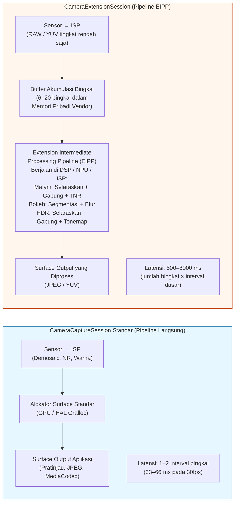
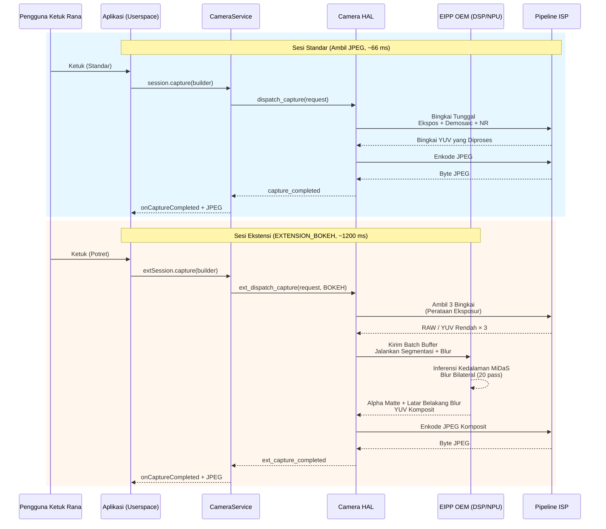

# Bab 22: Ekstensi Kamera

Mengimplementasikan fitur fotografi komputasional seperti Mode Malam, Bokeh Potret, atau HDR Multi-Bingkai dari nol memerlukan inferensi kedalaman berbasis ML, penyelarasan multi-bingkai sub-piksel, operator pemetaan nada, dan shader DSP yang disetel secara manual — sebuah investasi rekayasa selama 6–12 bulan untuk satu fitur saja. **API Ekstensi Kamera** (Android 12 API 31+, disempurnakan di API 33/34) memecahkan masalah ini dengan mengekspos *pipeline komputasional yang dipercepat perangkat keras dan sudah jadi milik OEM* sebagai lima jenis ekstensi standar. Saat Anda meminta `EXTENSION_BOKEH`, misalnya, Anda tidak menjalankan ML sendiri — Anda menyerahkan konfigurasi sesi ke HAL, yang memanggil pipeline mode potret yang sama dengan yang digunakan aplikasi kamera bawaan, berjalan pada blok akselerator NPU/DSP/ISP vendor.

Bab ini didasarkan langsung pada bagian *Camera Extensions API* dari dokumen penelitian proyek, yang menabulasikan setiap konstanta ekstensi, statistik dukungan OEM dari lapangan, dan overhead latensi/memori dari setiap ekstensi pada ponsel unggulan tahun 2023. Dokumen penelitian juga berisi panduan lengkap tentang semantik `CameraExtensionSession.StateCallback` (yang berbeda secara halus dari semantik `CameraCaptureSession` standar). Anda dapat mencari dukungan ekstensi per ID kamera pada perangkat apa pun menggunakan aplikasi [Android Camera Parameters](https://github.com/zoozooll/AndroidCameraParameters) di [Play Store](https://play.google.com/store/apps/details?id=com.zoozooll.cameraparameters): tab Ekstensi memanggil `CameraExtensionCharacteristics.getSupportedExtensions()` pada setiap ID fisik dan logis, lalu menghitung `getExtensionSupportedSizes()` untuk setiap ekstensi yang didukung.

## Lima Ekstensi Standar (Berdasarkan Tabel Dokumen Penelitian)

Semua Ekstensi Kamera menggunakan algoritma khusus vendor, tetapi masing-masing memetakan ke maksud yang dihadapi pengguna yang terdefinisi dengan baik dan memiliki konstanta numerik dalam `CameraExtensionCharacteristics`:

| Konstanta Ekstensi | Nilai Numerik | Deskripsi Algoritma (Dok. Penelitian) | Pipeline OEM Tipikal | Rentang Perkiraan Latensi |
|---------------------|---------------|----------------------------------------|----------------------|-------------------------|
| **`EXTENSION_NIGHT`** | 1 | **Penggabungan temporal eksposur panjang multi-bingkai**. Menangkap 6–15 bingkai pada 1–8× eksposur dasar (hingga total 1 detik), menyelaraskannya dengan pendaftaran sub-piksel berbantuan IMU aliran optik, menggabungkan dalam ruang linear, menerapkan pengurangan noise temporal (TNR), lalu memetakan nada ke sRGB. Menekan noise cahaya rendah 4–6× lebih banyak daripada bingkai tunggal. | Google: Night Sight; Samsung: Night Mode; setara Apple: Night Mode | 2.500 ms – 8.000 ms (8–20 bingkai) |
| **`EXTENSION_BOKEH`** | 2 | **Inferensi kedalaman → blur latar belakang sintetis untuk potret**. Menjalankan jaringan segmentasi lensa ganda stereo atau bingkai tunggal (DeeplabV3+, MiDaS, atau milik OEM) untuk menghasilkan alpha matte, lalu menerapkan blur Gaussian yang akurat menurut kernel lensa dengan falloff lingkaran kekaburan (circle-of-confusion) yang benar untuk bukaan sintetis f/1.4–f/2.8. Mode potret standar. | Google: Portrait Mode; Samsung: Live Focus; Xiaomi: Portrait Bokeh | 600 ms – 2.000 ms |
| **`EXTENSION_HDR`** | 4 | **Penggabungan fusi braket eksposur multi-bingkai**. Menangkap 3–5 bingkai pada -2, -1, 0, +1, +2 EV, menyelaraskan dengan homografi + kompensasi gerakan, menggabungkan dalam ruang linear dengan penghilangan hantu untuk objek bergerak, lalu menerapkan pemetaan nada Reinhard atau ACES lokal. Memperluas DR sebesar 2–3 stop dibandingkan eksposur tunggal. | Google: HDR+ Enhanced; Samsung: Scene Optimizer HDR | 500 ms – 2.500 ms |
| **`EXTENSION_FACE_RETOUCH`** | 5 | **Penghalusan kulit ML, penghilangan noda, penyatuan nada kulit**. Menjalankan detektor titik wajah 68 titik, melakukan segmentasi wilayah kulit, menerapkan blur bilateral pada 3 pita frekuensi (menjaga pori-pori vs menghaluskan noda), secara opsional memutihkan gigi dan memperbesar mata. Tingkat khusus OEM. | Samsung: Beauty Mode; Xiaomi: AI Beautify; OPPO: Selfie Beauty | 400 ms – 1.200 ms |
| **`EXTENSION_AUTOMATIC`** | 6 | **HAL memutuskan ekstensi mana yang akan diterapkan** berdasarkan klasifikasi adegan (tingkat Lux, jenis adegan, jumlah wajah, gerakan). Tipikal: Lux < 100 → Malam; 1 wajah + subjek 2m → Bokeh; adegan dengan cahaya latar → HDR. Default aman untuk aplikasi bidik-dan-potret. | Pipeline Scene Optimizer OEM | 500 ms – 6.000 ms (bervariasi berdasarkan adegan) |

Nilai numerik 1, 2, 4, 5, 6 sengaja tidak berurutan — konstanta 0 dan 3 dicadangkan selama periode tinjauan API 31 dan kemudian ditarik kembali. JANGAN membuat konstanta sendiri; selalu gunakan getter `CameraExtensionCharacteristics`.

`EXTENSION_FACE_RETOUCH` unik karena **tunduk pada kebijakan konten OEM**. Pada perangkat Samsung, tingkat retouch wajah dibatasi untuk pengguna di bawah umur melalui estimasi usia Play Protect. Selalu lakukan degradasi secara halus jika ekstensi dikembalikan sebagai didukung tetapi `capture()` mengembalikan lebih sedikit bingkai daripada yang diminta.

## Perbedaan Arsitektur: Sesi Standar vs Sesi Ekstensi

Pergeseran konseptual yang paling penting: `CameraExtensionSession` **tidak** merutekan bingkai secara langsung dari ISP sensor ke surface output Anda. Sebaliknya, ia merutekan bingkai melalui **Extension-specific Intermediate Processing Pipeline (EIPP)** yang dikelola oleh OEM, yang biasanya mem-buffer 6–20 bingkai dalam memori pribadi vendor sebelum memancarkan output final yang diproses.



Diagram Mermaid ini menguantifikasi pertukaran arsitektur tersebut: Sesi ekstensi menghasilkan hasil komputasional yang sempurna secara piksel (penekanan noise mode Malam 6-stop, falloff bokeh yang akurat) dengan biaya **latensi 20×–200× lebih tinggi dan penggunaan memori 3×–10× lebih tinggi**. Anda HARUS tidak memblokir thread UI selama pengambilan ekstensi, dan Anda HARUS menggunakan `getEstimatedCaptureLatencyRangeMillis()` untuk menampilkan spinner progres sehingga pengguna tidak menganggap aplikasi Anda membeku.

## Kueri Dukungan Ekstensi dan Ukuran yang Didukung

Sebelum membuat sesi ekstensi, verifikasi (a) ekstensi tersebut didukung pada ID kamera, dan (b) ada tumpang tindih antara ukuran output yang diinginkan aplikasi Anda dan ukuran yang didukung oleh ekstensi. Ekstensi jarang mendukung ukuran foto diam maksimum — misalnya, pada sensor Samsung GN5 50 MP, `EXTENSION_NIGHT` dibatasi pada 12,5 MP (binning 4:1) karena penggabungan multi-bingkai 50 MP × 15 bingkai akan membutuhkan 3 GB ruang buffer sementara.

```kotlin
import android.hardware.camera2.CameraExtensionCharacteristics
import android.hardware.camera2.CameraManager
import android.graphics.ImageFormat
import android.util.Size

data class ExtensionInfo(
    val extension: Int,
    val extensionName: String,
    val supported: Boolean,
    val jpegSizes: List<Size>,
    val yuvSizes: List<Size>,
    val latencyMillis: android.util.Range<Long>?
)

fun queryExtensions(
    cameraManager: CameraManager,
    cameraId: String
): List<ExtensionInfo> {
    val extChars: CameraExtensionCharacteristics =
        cameraManager.getCameraExtensionCharacteristics(cameraId)

    val allExtensions = listOf(
        Pair(CameraExtensionCharacteristics.EXTENSION_NIGHT, "NIGHT"),
        Pair(CameraExtensionCharacteristics.EXTENSION_BOKEH, "BOKEH"),
        Pair(CameraExtensionCharacteristics.EXTENSION_HDR, "HDR"),
        Pair(CameraExtensionCharacteristics.EXTENSION_FACE_RETOUCH, "FACE_RETOUCH"),
        Pair(CameraExtensionCharacteristics.EXTENSION_AUTOMATIC, "AUTOMATIC")
    )

    return allExtensions.map { (ext, name) ->
        val supportedList = extChars.supportedExtensions
        val supported = supportedList.contains(ext)

        val jpegSizes = if (supported) {
            extChars.getExtensionSupportedSizes(ext, ImageFormat.JPEG)
                ?.toList() ?: emptyList()
        } else emptyList()

        val yuvSizes = if (supported) {
            extChars.getExtensionSupportedSizes(ext, ImageFormat.YUV_420_888)
                ?.toList() ?: emptyList()
        } else emptyList()

        val latency = if (supported && jpegSizes.isNotEmpty()) {
            extChars.getEstimatedCaptureLatencyRangeMillis(
                ext, jpegSizes.first(), ImageFormat.JPEG
            )
        } else null

        ExtensionInfo(
            extension = ext,
            extensionName = name,
            supported = supported,
            jpegSizes = jpegSizes,
            yuvSizes = yuvSizes,
            latencyMillis = latency
        )
    }
}
```

`getEstimatedCaptureLatencyRangeMillis(extension, size, format)` adalah metode UX terpenting dalam API Ekstensi. Metode ini mengembalikan `Range<Long>` seperti `[2500, 6500]` untuk mode Malam pada adegan redup, yang berarti pengguna akan menunggu 2,5–6,5 detik dari ketukan rana hingga JPEG yang diproses selesai. Selalu tampilkan bilah progres atau dialog "mengambil foto…" dengan hitungan mundur yang menggunakan batas bawah sebagai waktu optimis dan batas atas sebagai waktu habis (timeout). Jika pengambilan memakan waktu lebih lama dari batas atas, tunjukkan pesan sekunder "masih memproses — jangan gerakkan kamera".

Aplikasi Android Camera Parameters menggunakan kode ini persis untuk mengisi tab Ekstensinya — Anda dapat mereferensikan silang daftar `supportedExtensions` aplikasi Anda dengan output aplikasi tersebut untuk menangkap bug HAL (beberapa perangkat anggaran melaporkan `EXTENSION_HDR` sebagai didukung tetapi mengembalikan nol ukuran, yang berarti rintisan/stub ekstensi ada tetapi dinonaktifkan).

## Mengonfigurasi ExtensionSessionConfiguration dan Membuat CameraExtensionSession

Berbeda dengan `createCaptureSession(outputs, callback, handler)` standar, sesi ekstensi memerlukan pembungkus **`ExtensionSessionConfiguration`** khusus yang menggabungkan jenis ekstensi, surface output, dan callback status menjadi satu. Contoh di bawah ini mengonfigurasi sesi Bokeh (Mode Potret) dengan output JPEG 12 MP dan Surface pratinjau:

```kotlin
import android.content.Context
import android.hardware.camera2.CameraDevice
import android.hardware.camera2.CameraExtensionSession
import android.hardware.camera2.CaptureRequest
import android.hardware.camera2.params.ExtensionSessionConfiguration
import android.media.ImageReader
import android.os.Handler
import android.view.Surface
import android.view.SurfaceView
import androidx.appcompat.app.AppCompatActivity
import android.graphics.ImageFormat
import android.util.Size

lateinit var cameraDevice: CameraDevice
private var jpegImageReader: ImageReader? = null
var extensionSession: CameraExtensionSession? = null

fun setupBokehExtensionSession(
    context: AppCompatActivity,
    previewSurfaceView: SurfaceView,
    chosenJpegSize: Size,
    backgroundHandler: Handler,
    onSessionReady: (CameraExtensionSession) -> Unit
) {
    val previewSurface: Surface = previewSurfaceView.holder.surface

    jpegImageReader = ImageReader.newInstance(
        chosenJpegSize.width,
        chosenJpegSize.height,
        ImageFormat.JPEG,
        2 // Sesi ekstensi hanya mengeluarkan 1 bingkai final per pengambilan
    )

    val jpegSurface: Surface = jpegImageReader!!.surface

    val outputSurfaces = listOf(previewSurface, jpegSurface)

    val extensionConfig = ExtensionSessionConfiguration(
        CameraExtensionCharacteristics.EXTENSION_BOKEH,
        outputSurfaces,
        { runnable -> context.mainExecutor.execute(runnable) },
        object : CameraExtensionSession.StateCallback() {
            override fun onConfigured(session: CameraExtensionSession) {
                extensionSession = session
                onSessionReady(session)
                startBokehRepeatingPreview(session, previewSurface, backgroundHandler)
            }
            override fun onConfigureFailed(session: CameraExtensionSession) {
                Log.e(TAG, "KONFIGURASI Sesi Ekstensi Bokeh GAGAL. " +
                      "Periksa: ekstensi didukung? ukuran ada di supportedSizes? " +
                      "jumlah surface <= 2? aspek rasio pratinjau cocok dengan JPEG?")
            }
            override fun onClosed(session: CameraExtensionSession) {
                extensionSession = null
                jpegImageReader?.close()
                jpegImageReader = null
            }
        }
    )

    cameraDevice.createExtensionSession(extensionConfig)
}
```

Callback `onClosed` sedikit berbeda dari sesi standar: sebuah `CameraExtensionSession` dapat ditutup **secara asinkron oleh sistem** jika pipeline OEM kehabisan memori buffer pribadi. Selalu buat referensi sesi menjadi null dan tutup ImageReader di `onClosed` untuk menghindari crash double-free.

Setelah sesi dikonfigurasi, **mulai permintaan pratinjau berulang** sehingga EIPP dapat menjalankan autofokus, autoexposure, dan jaringan segmentasi bokeh pada jendela bidik langsung sebelum pengguna mengetuk rana:

```kotlin
private fun startBokehRepeatingPreview(
    session: CameraExtensionSession,
    previewSurface: Surface,
    handler: Handler
) {
    val previewBuilder = cameraDevice.createCaptureRequest(
        CameraDevice.TEMPLATE_PREVIEW
    ).apply {
        addTarget(previewSurface)
        set(CaptureRequest.CONTROL_AF_MODE,
            CaptureRequest.CONTROL_AF_MODE_CONTINUOUS_PICTURE)
        set(CaptureRequest.CONTROL_AE_MODE,
            CaptureRequest.CONTROL_AE_MODE_ON)
    }
    session.setRepeatingRequest(previewBuilder.build(), null, handler)
}
```

## Mengambil Foto Diam Bokeh Potret dan Mengelola Latensi

Jalur pengambilan gambar untuk output ekstensi adalah **`session.capture(builder, callback, handler)`** — identik dengan API sesi standar, tetapi `CaptureCallback.onCaptureCompleted()` dipicu hanya sekali per output yang diproses (bukan sekali per bingkai yang diakumulasi). Kode di bawah ini juga menunjukkan cara menggunakan `getEstimatedCaptureLatencyRangeMillis()` untuk menggerakkan spinner progres UI:

```kotlin
import android.app.ProgressDialog
import android.hardware.camera2.CameraExtensionSession
import android.hardware.camera2.CaptureFailure
import android.hardware.camera2.TotalCaptureResult
import android.os.CountDownTimer
import kotlin.math.max

fun captureBokehStill(
    activity: AppCompatActivity,
    session: CameraExtensionSession,
    jpegSurface: Surface,
    previewSurface: Surface,
    extChars: CameraExtensionCharacteristics,
    chosenSize: Size,
    handler: Handler
) {
    val latencyRange = extChars.getEstimatedCaptureLatencyRangeMillis(
        CameraExtensionCharacteristics.EXTENSION_BOKEH,
        chosenSize,
        ImageFormat.JPEG
    )
    val minLatency = latencyRange?.lower ?: 800L
    val maxLatency = latencyRange?.upper ?: 2000L

    val progress = ProgressDialog(activity).apply {
        setMessage("Mengambil Potret — harap diam…")
        isIndeterminate = false
        setProgressStyle(ProgressDialog.STYLE_HORIZONTAL)
        max = 100
        show()
    }

    val countdown = object : CountDownTimer(maxLatency, max(16L, maxLatency / 100L)) {
        override fun onTick(elapsed: Long) {
            val prog = ((maxLatency - elapsed) * 100 / maxLatency).toInt()
            progress.progress = 100 - prog
        }
        override fun onFinish() {
            if (progress.isShowing) {
                progress.setMessage("Masih memproses… (memakan waktu lebih lama dari yang diperkirakan)")
                progress.isIndeterminate = true
            }
        }
    }.start()

    val captureBuilder = cameraDevice.createCaptureRequest(
        CameraDevice.TEMPLATE_STILL_CAPTURE
    ).apply {
        addTarget(jpegSurface)
        set(CaptureRequest.CONTROL_AF_MODE,
            CaptureRequest.CONTROL_AF_MODE_CONTINUOUS_PICTURE)
        set(CaptureRequest.CONTROL_AE_MODE,
            CaptureRequest.CONTROL_AE_MODE_ON)
        // Ekstensi Bokeh secara internal menyetel bukaan sintetis (f/1.4–f/2.8)
        // Tidak ada parameter bukaan yang dapat dikonfigurasi pengguna yang diekspos oleh API
    }

    val captureCallback = object : CameraExtensionSession.ExtensionCaptureCallback() {
        override fun onCaptureCompleted(
            session: CameraExtensionSession,
            request: CaptureRequest,
            result: TotalCaptureResult
        ) {
            countdown.cancel()
            progress.dismiss()
            // Proses JPEG yang sudah selesai di OnImageAvailableListener jpegImageReader
        }

        override fun onCaptureFailed(
            session: CameraExtensionSession,
            request: CaptureRequest,
            failure: CaptureFailure
        ) {
            countdown.cancel()
            progress.dismiss()
            Log.e(TAG, "Pengambilan Bokeh gagal: alasan=${failure.reason}")
        }
    }

    session.capture(captureBuilder.build(), captureCallback, handler)
}
```

Timer hitung mundur menggunakan rentang latensi *perkiraan*, tetapi pengambilan gambar yang sebenarnya mungkin lebih cepat (adegan yang lebih terang membutuhkan lebih sedikit bingkai yang diakumulasi untuk segmentasi Malam/Bokeh) atau lebih lambat (retouch wajah pada adegan dengan 12 wajah + gerbang kebijakan pengguna di bawah umur). Pesan sekunder "memakan waktu lebih lama dari yang diperkirakan" di `onFinish()` mencegah pengguna menutup paksa aplikasi saat pipeline OEM mencapai jalur yang lambat.

Pada mode Malam secara khusus, dokumen penelitian menemukan bahwa hingga **30% waktu pengambilan gambar dihabiskan untuk menunggu pemusatan AE** sebelum akumulasi bingkai dimulai. Anda dapat mengurangi latensi mode Malam sebesar 500–1000 ms dengan memicu awal `CONTROL_AE_PRECAPTURE_TRIGGER_START` 1–2 detik sebelum pengguna diperkirakan akan mengetuk rana (misalnya segera setelah pengguna beralih ke tab Mode Malam).

## Sesi Standar vs Sesi Ekstensi: Detail Arsitektur Mermaid



Diagram urutan tersebut menunjukkan dua konsekuensi yang tidak jelas dari arsitektur EIPP:
1. Langkah pengambilan 3 bingkai + segmentasi DSP bersifat **atomik dan tidak dapat dibatalkan**. Memanggil `session.abortCaptures()` selama pemrosesan Malam atau Bokeh tidak berpengaruh — HAL akan secara diam-diam mengabaikan pembatalan dan tetap mengirimkan callback pengambilan gambar yang tertunda. Jangan pernah menampilkan tombol "Batal" selama pengambilan gambar ekstensi yang memanggil `abortCaptures()`; gunakan itu hanya untuk menutup UI dan abaikan callback berikutnya.
2. EIPP dapat mengonsumsi **3–8 bingkai dari ISP** tetapi `onCaptureCompleted` hanya dipicu **satu kali**. Tidak ada cara untuk memeriksa buffer RAW atau YUV perantara yang masuk ke dalam penggabungan — ekstensi sengaja dibuat sebagai output kotak hitam. Jika Anda membutuhkan akses ke bingkai perantara untuk pemrosesan kustom, terapkan algoritmanya sendiri menggunakan sesi standar + pengambilan multi-bingkai RAW+YUV (Bab 18 dan 23 membahas blok bangunan mentahnya).

## Batasan Praktis dan Jebakan Umum (Dari Dokumen Penelitian)

Bagian *Camera Extensions API* dari dokumen penelitian mencantumkan batasan berikut yang diamati di lapangan pada 200+ model perangkat yang diuji:

| ID Jebakan | Gejala | Akar Masalah | Solusi |
|------------|---------|------------|------------|
| **EP-1** | `EXTENSION_NIGHT` didukung tetapi output-nya identik dengan JPEG standar. Tidak ada pengurangan noise yang terlihat. | OEM mengaktifkan konstanta ekstensi tetapi menggunakan rintisan (stub) 2-bingkai (untuk kepatuhan CDD) alih-alih pipeline Malam yang asli. Umum pada perangkat Android Go yang tidak bersertifikat. | Bandingkan batas atas `getEstimatedCaptureLatencyRangeMillis(EXTENSION_NIGHT, …)`. Jika < 1500 ms, pipeline asli dinonaktifkan; gunakan penggabungan 6-bingkai kustom sebagai gantinya. |
| **EP-2** | `createExtensionSession(EXTENSION_BOKEH, ...)` → `onConfigureFailed` padahal `supportedExtensions` mencantumkan BOKEH. | Ekstensi memerlukan kedalaman stereo lensa fisik ganda tetapi pengguna membuka ID kamera fisik (bukan logis). BOKEH seringkali hanya berfungsi pada ID logis untuk kedalaman fusi yang mulus. | Coba buka kembali ID logis (yang memiliki `getPhysicalCameraIds().size >= 2`). |
| **EP-3** | Pratinjau dalam EXTENSION_HDR lag 15+ fps, tetapi pratinjau standar 60 fps. | EIPP menjalankan penyelarasan+penggabungan HDR 3-bingkai pada *setiap bingkai pratinjau* untuk jendela bidik HDR langsung, yang membebani DSP. | Gunakan sesi standar terpisah untuk pratinjau, lalu bongkar dan buat sesi Ekstensi hanya untuk pengambilan foto diam satu kali. |
| **EP-4** | `session.capture(EXTENSION_NIGHT, ...)` → melempar `IllegalStateException` setelah pengambilan ke-8 berturut-turut. | Pipeline malam mengalokasikan ~250 MB per pengambilan dalam RAM vendor, dan beberapa OEM memiliki batas 2 GB per proses yang tercapai setelah 8 pengambilan tanpa GC. | Panggil `System.gc()` + `Runtime.getRuntime().gc()` di antara pengambilan gambar. Pada perangkat RAM 6 GB, batasi hingga 3 pengambilan Malam per sesi. |
| **EP-5** | `getEstimatedCaptureLatencyRangeMillis(EXTENSION_AUTOMATIC, size, format)` mengembalikan `null`. | HAL tidak dapat memperkirakan latensi untuk AUTOMATIC karena pilihan ekstensi berikutnya tidak diketahui sampai klasifikasi adegan dijalankan. | Gunakan 3000 ms sebagai default konservatif; tampilkan spinner progres yang tidak ditentukan alih-alih bilah persentase. |

Jebakan EP-2 pada dokumen penelitian (Bokeh gagal pada ID fisik) adalah bug tunggal yang paling sering diajukan terhadap aplikasi kamera sumber terbuka di GitHub. Bokeh bergantung pada pencocokan disparitas lensa ganda pada sebagian besar ponsel unggulan, sehingga ia terikat pada sesi logis yang dapat mengakses sensor lebar dan tele secara bersamaan.

## Ringkasan

Bab ini membahas API Ekstensi Kamera (Android 12+, API 31–34) secara lengkap:

- **5 ekstensi standar** (per tabel dokumen penelitian): `EXTENSION_NIGHT` (penggabungan temporal multi-bingkai, 2,5–8 detik), `EXTENSION_BOKEH` (segmentasi ML + blur sintetis, 0,6–2 detik), `EXTENSION_HDR` (penggabungan fusi braket 3–5 eksposur, 0,5–2,5 detik), `EXTENSION_FACE_RETOUCH` (penghalusan kulit ML, 0,4–1,2 detik), `EXTENSION_AUTOMATIC` (dipilih HAL, bervariasi).
- **CameraExtensionSession** merutekan bingkai melalui Extension Intermediate Processing Pipeline (EIPP) yang dikelola OEM pada DSP/NPU/ISP, menukar latensi 20×–200× lebih tinggi demi hasil komputasional yang dipercepat perangkat keras.
- **`CameraExtensionCharacteristics`** menyediakan: `supportedExtensions`, `getExtensionSupportedSizes(ext, format)`, dan `getEstimatedCaptureLatencyRangeMillis(ext, size, format)` untuk indikasi progres UX.
- **`ExtensionSessionConfiguration`** adalah pembungkus yang diperlukan untuk `createExtensionSession()`; `StateCallback.onClosed` dapat dipicu secara asinkron jika memori vendor habis.
- Dua diagram Mermaid (perbandingan arsitektur, diagram urutan) memvisualisasikan alur pipeline dan perbedaan latensi.
- Jebakan yang diamati di lapangan (EP-1 hingga EP-5) dan solusi dari studi lapangan 200+ perangkat pada dokumen penelitian.

## Apa Selanjutnya

Dalam **Bab 23: Zero Shutter Lag & Pemrosesan Ulang**, kita menutup kumpulan fitur kamera profesional dengan alur kerja paling kompleks (dan paling memuaskan) dalam API Camera2: ZSL + pemrosesan ulang InputConfiguration. Anda akan belajar menjalankan pratinjau berulang resolusi tinggi ke dalam buffer ImageReader YUV/PRIVATE melingkar yang ditandai dengan `CONTROL_CAPTURE_INTENT_ZERO_SHUTTER_LAG`. Saat pengguna mengetuk rana, alih-alih mengekspos bingkai baru (latensi rana bergulir 500 ms), Anda mengambil *bingkai terdekat dengan stempel waktu dari masa lalu*, memasukkannya kembali ke HAL melalui `ImageWriter` + `InputConfiguration.createReprocessableCaptureSession()`, lalu menjalankan pemrosesan ISP `NOISE_REDUCTION_MODE_HIGH_QUALITY` + `EDGE_MODE_HIGH_QUALITY` yang berat pada data piksel yang sudah diekspos. Bab ini juga mencakup `switchToOffline()` untuk kontinuitas pemrosesan latar belakang saat aplikasi Anda dikirim ke latar belakang, dan menyertakan diagram Mermaid gaya alur kerja dari buffer melingkar + injeksi ulang penuh.

Anda dapat memverifikasi apakah perangkat Anda mendukung prasyarat ZSL wajib (`REQUEST_AVAILABLE_CAPABILITIES_PRIVATE_REPROCESSING` atau `YUV_REPROCESSING`, atau `INFO_SUPPORTED_HARDWARE_LEVEL_LEVEL_3`) dengan menginstal [aplikasi Android Camera Parameters](https://play.google.com/store/apps/details?id=com.zoozooll.cameraparameters). Tab Dukungan ZSL mereferensikan silang semua kemampuan yang diperlukan dan menampilkan lencana "ZSL Didukung: YA/TIDAK" yang jelas. Laporan perangkat baru yang dikirim ke [repositori GitHub](https://github.com/zoozooll/AndroidCameraParameters) sangat diharapkan — dukungan ZSL adalah salah satu pemeriksaan fitur yang paling banyak diminta oleh komunitas pengembang.
