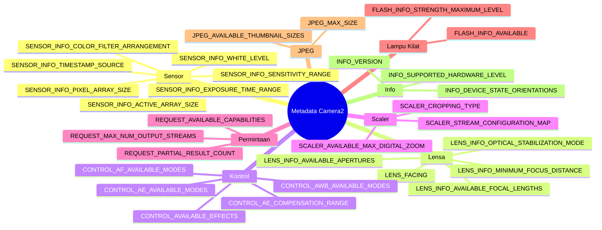

---
sidebar_position: 29
title: "Ensiklopedia Metadata Kamera"
description: Panduan referensi lengkap untuk semua kunci metadata CameraCharacteristics penting termasuk kategori Sensor, Lensa, Kontrol, Scaler, Permintaan, Lampu Kilat, JPEG, Statistik, dan Info.
keywords: [CameraCharacteristics, CameraMetadata, Sensor, Lensa, Kontrol, Scaler, referensi metadata kamera]
---

import Tabs from '@theme/Tabs';
import TabItem from '@theme/TabItem';

# Ensiklopedia Metadata Kamera

## Aplikasi Pendamping

Periksa setiap kunci dalam ensiklopedia ini secara langsung pada perangkat Anda sendiri — instal aplikasi Android Camera Parameters:

- **GitHub (Sumber Terbuka):** [github.com/zoozooll/AndroidCameraParameters](https://github.com/zoozooll/AndroidCameraParameters)
- **Google Play:** [play.google.com/store/apps/details?id=com.minininja.cameraparams](https://play.google.com/store/apps/details?id=com.minininja.cameraparams)

Aplikasi ini adalah implementasi hidup dari setiap konsep di halaman ini. Setiap entri metadata di bawah ini memberi tahu Anda tab dan layar mana yang menampilkan nilai tersebut sehingga Anda dapat mereferensikan silang dengan perangkat nyata di tangan Anda.

---

## Taksonomi Metadata



---

## Pendahuluan

Selamat datang di Ensiklopedia Metadata Kamera, referensi definitif untuk memahami 300+ kunci metadata yang menjelaskan setiap kemampuan perangkat kamera Android. Jika bab-bab sebelumnya dalam seri ini mengajarkan Anda *cara* mengoperasikan Camera2 — membuka sesi, membangun permintaan, streaming surface — ensiklopedia ini mengajarkan Anda *apa* yang sebenarnya mampu dilakukan kamera Anda. Setiap fitur yang Anda aktifkan dalam `CaptureRequest.Builder` harus divalidasi terlebih dahulu terhadap `CameraCharacteristics`. Lewati validasi ini dan aplikasi Anda akan crash pada persentase perangkat tertentu, atau lebih buruk lagi, secara diam-diam menghasilkan output yang rusak.

Ensiklopedia ini ada karena metadata Camera2 sangat kurang didokumentasikan dalam referensi SDK Android resmi. Dokumentasi memberi tahu Anda tipe dari setiap kunci (seperti `Range<Int>`, `FloatArray`, dll.) tetapi jarang memberi tahu Anda *semantik*-nya: apa arti "dioptri" dalam praktiknya, mengapa ukuran array aktif berbeda dari ukuran array piksel, atau urutan kunci mana yang harus Anda periksa bersama sebelum mengekspos tombol ISO manual. Entri di sini menjembatani celah tersebut dengan kode tingkat produksi, jebakan OEM yang umum, dan perilaku perangkat nyata yang diambil dari ribuan profil perangkat dalam basis data Android Camera Parameters.

Anggap halaman ini sebagai tabel pencarian untuk arsitektur aplikasi kamera Anda. Saat Anda mendesain layar pengaturan, buka bagian Kontrol. Saat Anda membangun UI zoom, buka Scaler. Saat Anda menulis pipeline pemrosesan RAW, buka Sensor. Setiap entri mengikuti struktur enam poin yang sama sehingga Anda dapat melompat langsung ke kode yang Anda butuhkan tanpa mempelajari kembali tata letaknya. Aplikasi pendamping di ponsel Anda kemudian memvalidasi bahwa kueri yang sama berfungsi terhadap silikon nyata dari Samsung, Sony, HiSilicon, MediaTek, dan Google Tensor.

Tidak ada perangkat yang mendukung setiap kunci dalam ensiklopedia ini. Itulah intinya. Pola yang benar untuk pengembangan Camera2 adalah: kueri kunci → periksa null hasilnya → batasi fitur UI → dokumentasikan jalur cadangan. Halaman ini memberi Anda kueri, pemeriksaan, dan jebakan yang akan Anda temui jika Anda melewatkannya.

---

## Bagaimana Metadata Camera2 Diorganisir

Metadata Camera2 hidup dalam tiga hierarki kelas paralel, semuanya berakar pada `android.hardware.camera2.CameraMetadata`. Deskripsi statis tentang apa yang *bisa* dilakukan kamera hidup di `CameraCharacteristics` — Anda menanyakan ini tepat satu kali per ID kamera setelah menemukannya melalui `CameraManager.getCameraIdList()`. Deskripsi per permintaan tentang apa yang Anda *inginkan* untuk dilakukan kamera hidup di `CaptureRequest` — Anda mengisi kunci melalui `CaptureRequest.Builder.set()`. Deskripsi per bingkai tentang apa yang kamera *sebenarnya lakukan* hidup di `CaptureResult` (atau varian totalnya `TotalCaptureResult`) — Anda membaca kunci dari callback di `CameraCaptureSession.CaptureCallback.onCaptureCompleted()`.

Setiap kunci di ketiga hierarki tersebut memperluas `CaptureResult.Key<T>` (atau saudara-saudaranya `CameraCharacteristics.Key<T>` dan `CaptureRequest.Key<T>`) dan merupakan deskriptor bidang yang bertipe kuat. Ada lebih dari 300 kunci publik di ketiga kelas tersebut, ditambah kunci privat OEM tambahan yang dapat diakses melalui `CameraCharacteristics.get(CameraCharacteristics.REQUEST_AVAILABLE_SESSION_KEYS)` pada ekstensi vendor tertentu. Kategori dalam ensiklopedia ini mengikuti pengelompokan konseptual yang digunakan oleh spesifikasi antarmuka HAL3: Sensor menjelaskan imager, Lensa menjelaskan optik, Kontrol menjelaskan algoritma 3A (auto-exposure, auto-focus, auto-white-balance), Scaler menjelaskan pipeline pemotongan-dan-pengubahan-ukuran, Permintaan menjelaskan flag kemampuan lintas-subsistem, Lampu Kilat menjelaskan LED senter/kilat, JPEG menjelaskan encoder gambar diam, dan Info menjelaskan paket kamera dan versi HAL.

---

## Konvensi yang Digunakan dalam Ensiklopedia Ini

Setiap entri metadata di bawah ini mengikuti tepat enam bagian:

1. **Apa itu?** Definisi 1–2 paragraf tentang kunci, tipe, dan semantiknya.
2. **Mengapa itu ada?** Rasional desain yang mengarahkan insinyur Android untuk mengekspos kunci ini alih-alih menurunkan nilainya secara implisit.
3. **Perangkat mana yang mendukungnya?** Tingkat perangkat keras minimum, flag kemampuan, dan versi Android di mana kunci ini menjadi bermakna.
4. **Bagaimana cara menanyakannya?** Cuplikan kode Kotlin lengkap dengan keamanan null, menunjukkan panggilan `characteristics.get()` yang tepat plus penanganan kesalahan.
5. **Bagaimana cara memeriksanya dengan Android Camera Parameters?** Hierarki tab yang tepat dalam aplikasi pendamping di mana Anda dapat melihat nilai ini dirender pada perangkat.
6. **Jebakan umum.** Satu atau lebih masalah dunia nyata yang ditemui pengembang, biasanya melibatkan fragmentasi OEM, keterkaitan status tersembunyi antar kunci, atau kesalahpahaman tentang unit.

Cuplikan kode menggunakan Kotlin idiomatik dengan operator keamanan null (`?.`) dan operator Elvis (`?:`) ditambah blok `run` untuk cadangan. Semua cuplikan mengasumsikan Anda sudah memegang instansi `CameraCharacteristics` bernama `characteristics` yang diperoleh melalui `cameraManager.getCameraCharacteristics(cameraId)`. Cuplikan yang menghasilkan output yang terlihat pengguna menggunakan pemformatan string dengan unit (dioptri, nanodetik, langkah EV) sehingga Anda dapat memasukkannya langsung ke dalam `PreferenceScreen` atau overlay debug `TextView`.

Referensi aplikasi pendamping selalu menggunakan pola yang sama: *Nama Tab / Nama Sub-tab*. Misalnya "Overview / Hardware Level" berarti: buka aplikasi, ketuk tab Overview di navigasi bawah, lalu cari kartu Hardware Level. Jika kunci muncul di beberapa layar, kita mencantumkan lokasi utama kanonik terlebih dahulu.

---

## Kategori Sensor

### SENSOR_INFO_ACTIVE_ARRAY_SIZE

**1. Apa itu?**

`SENSOR_INFO_ACTIVE_ARRAY_SIZE` adalah `android.graphics.Rect` yang menjelaskan koordinat piksel dari area pencitraan aktif di dalam die sensor penuh. Dalam praktiknya ini adalah persegi panjang piksel terbesar yang sebenarnya dapat dibaca dan dikirim ke aliran output. Persegi panjang tersebut selalu selaras dengan sumbu dan dinyatakan dalam ruang koordinat piksel di mana `(0,0)` adalah sudut kiri atas dari array piksel penuh. Nilai tipikal terlihat seperti `Rect(0, 0, 8000, 6000)` untuk sensor 8K×6K, atau `Rect(120, 160, 3880, 2880)` ketika produsen sensor menyisakan batas tidak aktif kecil (piksel hitam optik) di sekitar tepinya.

Setiap aliran output yang Anda konfigurasi — baik JPEG, YUV_420_888, RAW, atau SurfaceTexture pratinjau — pada akhirnya dipotong dari area aktif ini. Saat Anda meminta JPEG 4:3 pada 12MP, ISP kamera memotong array aktif ke rasio aspek 4:3 dan mengecilkan ukurannya. Saat Anda menerapkan zoom digital melalui `SCALER_CROP_REGION`, wilayah pemotongan tersebut dipotong relatif terhadap array aktif, bukan array piksel.

**2. Mengapa itu ada?**

Die sensor selalu mengandung lebih banyak fotodioda fisik daripada yang dikirim ke pipeline ISP. Baris dan kolom terluar adalah piksel "dummy" atau "hitam optik" yang digunakan untuk kalibrasi arus-gelap dan koreksi bayangan lensa — bukan data gambar nyata. Tanpa `SENSOR_INFO_ACTIVE_ARRAY_SIZE`, pengembang tidak akan tahu sistem koordinat mana yang digunakan untuk `SCALER_CROP_REGION` atau pelacakan pemotongan berbasis wajah. Camera1 dulu menyembunyikan perbedaan ini sepenuhnya, yang membuat matematika zoom digital tidak konsisten di berbagai OEM. Camera2 mengeksposnya secara eksplisit sehingga wilayah pemotongan dapat dihitung dengan presisi setingkat piksel.

**3. Perangkat mana yang mendukungnya?**

Semua perangkat Camera2 mendukung kunci ini di semua tingkat perangkat keras: LEGACY, LIMITED, FULL, dan LEVEL_3. Ini terdaftar di `CameraCharacteristics.getAvailableCaptureResultKeys()` untuk setiap ID kamera, termasuk kamera USB eksternal. Rect tersebut selalu tidak kosong dan lebar/tingginya tidak pernah melebihi `SENSOR_INFO_PIXEL_ARRAY_SIZE`.

**4. Bagaimana cara menanyakannya?**

```kotlin
val activeArray: Rect? = characteristics.get(
    CameraCharacteristics.SENSOR_INFO_ACTIVE_ARRAY_SIZE
)

activeArray?.let { rect ->
    val widthPx = rect.width()
    val heightPx = rect.height()
    val megapixels = (widthPx * heightPx) / 1_000_000.0
    Log.d(TAG, "Array aktif: ${widthPx}×${heightPx}px (%.1f MP)".format(megapixels))
    Log.d(TAG, "  Kiri=${rect.left}, Atas=${rect.top}, Kanan=${rect.right}, Bawah=${rect.bottom}")
} ?: run {
    Log.w(TAG, "Ukuran array aktif tidak tersedia pada perangkat ini")
}
```

**5. Bagaimana cara memeriksanya dengan Android Camera Parameters?**

Navigasi ke **Sensor / Sensor Info**. Array aktif dirender sebagai baris kedua dari kartu "Sensor Geometry", di bawah ukuran array piksel. Aplikasi pendamping juga menggambar persegi panjang array aktif yang secara visual ditempatkan di atas representasi skala dari array piksel, sehingga Anda dapat melihat sekilas seberapa banyak dari die fisik yang sebenarnya dapat digunakan.

**6. Jebakan umum**

Kesalahan tunggal terbesar adalah menanyakan `SENSOR_INFO_PIXEL_ARRAY_SIZE` dan kemudian mengharapkan output JPEG pada resolusi tersebut. Gambar diam ukuran penuh selalu menggunakan dimensi array aktif, tidak pernah array piksel. Pada sensor Samsung ISOCELL 50MP yang khas, array piksel mungkin 8192×6144 tetapi array aktifnya adalah 8000×6000. Jika Anda mengalokasikan buffer 50,3MP (dari array piksel), Anda akan mendapatkan gambar 48MP dan piksel yang tersisa dibuang secara diam-diam, atau lebih buruk lagi, Anda mendapatkan buffer yang rusak pada perangkat HAL lama. Selalu gunakan `activeArray.width() * activeArray.height()` untuk ukuran buffer, jangan pernah hasil kali array piksel. Jebakan umum kedua adalah menggunakan koordinat array aktif tanpa menyertakan offset: ketika top/left rect tidak nol, matematika wilayah pemotongan Anda harus menambahkan titik asal tersebut atau zoom akan bergeser ke arah kiri atas.

---

### SENSOR_INFO_PIXEL_ARRAY_SIZE

**1. Apa itu?**

`SENSOR_INFO_PIXEL_ARRAY_SIZE` adalah `android.util.Size` yang mewakili jumlah total fotodioda fisik pada die sensor, termasuk piksel batas hitam optik atau dummy. Ini adalah angka "megapiksel pemasaran": sensor 108MP mengiklankan dimensi array piksel 12000×9000 terlepas dari berapa banyak yang sebenarnya dikirim ke pipeline ISP. Secara tipe ini adalah `Size` sederhana dengan bidang `.width` dan `.height`.

Hubungannya dengan array aktif selalu:
- `pixelArray.width >= activeArray.width`
- `pixelArray.height >= activeArray.height`

Perbedaannya biasanya 100–400 piksel pada setiap sumbu, digunakan untuk baris hitam optik (OB) dan kalibrasi bayangan lensa pabrik.

**2. Mengapa itu ada?**

Pipeline pengambilan gambar RAW memerlukan dimensi piksel penuh untuk mengurai buffer RAW10/RAW12/RAW16 dengan benar, karena format RAW (ketika `SENSOR_INFO_PRE_CORRECTION_ACTIVE_ARRAY_SIZE` tidak tersedia) terkadang menyertakan baris OB. Pengembang yang menulis kode demosaic kustom atau pengurangan frame gelap juga perlu tahu berapa banyak piksel pada setiap batas yang harus dibuang sebelum diproses. Di sisi konsumen, tim pemasaran dan aplikasi benchmark menggunakan ukuran array piksel untuk melaporkan resolusi sensor "sebenarnya" tanpa pemotongan ISP dari OEM.

**3. Perangkat mana yang mendukungnya?**

Semua tingkat perangkat keras mengekspos kunci ini. Tidak ada prasyarat flag kemampuan. Perangkat yang mampu RAW (yang mengiklankan `REQUEST_AVAILABLE_CAPABILITIES_RAW`) diwajibkan oleh Camera2 CDD untuk melaporkan ukuran array piksel yang akurat hingga dalam satu baris/kolom dari spesifikasi sensor fisik.

**4. Bagaimana cara menanyakannya?**

```kotlin
val pixelArray: Size? = characteristics.get(
    CameraCharacteristics.SENSOR_INFO_PIXEL_ARRAY_SIZE
)

pixelArray?.let { size ->
    val mp = (size.width * size.height) / 1_000_000.0
    Log.d(TAG, "Array piksel: ${size.width}×${size.height}px (pemasaran %.1f MP)".format(mp))
    
    characteristics.get(CameraCharacteristics.SENSOR_INFO_ACTIVE_ARRAY_SIZE)?.let { active ->
        val usablePct = (active.width() * active.height()).toDouble() /
                        (size.width * size.height).toDouble() * 100.0
        Log.d(TAG, "  %.1f%% piksel dapat dikirim melalui array aktif".format(usablePct))
    }
} ?: run {
    Log.w(TAG, "Ukuran array piksel tidak tersedia")
}
```

**5. Bagaimana cara memeriksanya dengan Android Camera Parameters?**

Buka **Sensor / Sensor Info** dan lihat entri pertama di kartu "Sensor Geometry", berlabel "Pixel Array". Aplikasi merendernya sebagai lebar×tinggi dengan jumlah megapiksel pemasaran dalam tanda kurung (misalnya "8192 × 6144 (50.3 MP)"). Jika Anda mengetuk baris tersebut, sebuah dialog terbuka dengan tabel perbandingan array piksel vs array aktif vs array aktif pra-koreksi.

**6. Jebakan umum**

Membingungkan array piksel dengan ukuran JPEG yang dapat dikirim adalah hal yang universal di kalangan pengembang Camera2 pemula. Urutannya selalu: (1) kueri `SCALER_STREAM_CONFIGURATION_MAP.getOutputSizes(ImageFormat.JPEG)` untuk mendapatkan resolusi *aktual* yang dapat dihasilkan encoder, (2) ukuran JPEG terbesar akan sama dengan (atau potongan berskala dari) `SENSOR_INFO_ACTIVE_ARRAY_SIZE`, tidak pernah array piksel. Jika Anda menulis kode yang menghitung pemotongan 4:3 dari dimensi array piksel, hasilnya akan sedikit lebih lebar dari yang sebenarnya dapat dikirim oleh ISP, dan perangkat kamera akan secara diam-diam membatasinya — memperkenalkan pergeseran piksel halus dalam zoom pelacakan wajah. Kedua, pada perangkat yang mampu memproses ulang yang mengiklankan `REQUEST_AVAILABLE_CAPABILITIES_PRIVATE_REPROCESSING`, ukuran input pemrosesan ulang menggunakan semantik array piksel; menggunakan array aktif untuk pemrosesan ulang menyebabkan kesalahan penyelarasan bingkai.

---

### SENSOR_INFO_SENSITIVITY_RANGE

**1. Apa itu?**

`SENSOR_INFO_SENSITIVITY_RANGE` adalah `android.util.Range<Int>` yang menentukan nilai ISO minimum dan maksimum (gain analog) yang dapat diterapkan sensor *selama pembacaan mentah*. Unitnya adalah aritmatika ISO: 100 adalah ISO dasar (gambar terbersih, noise terendah), 6400 atau lebih tinggi adalah mode sensitivitas tinggi (gambar lebih ber-noise, waktu rana lebih pendek untuk EV yang sama). Rentang tipikal pada perangkat modern adalah `[100, 6400]` untuk ponsel kelas menengah dan `[50, 12800]` atau `[32, 25600]` untuk sensor unggulan dengan sumur piksel besar.

Sensitivitas diterapkan *sebelum* penguatan digital apa pun di pipeline ISP. Nilai yang dikembalikan di sini sesuai dengan apa yang Anda setel di `CaptureRequest.SENSOR_SENSITIVITY` ketika kontrol manual diaktifkan.

**2. Mengapa itu ada?**

Setiap sensor CMOS memiliki tingkat penguatan minimum fisik (ditentukan oleh penguat pembacaan) dan tingkat maksimum (ditentukan oleh seberapa banyak sinyal analog dapat dikuatkan sebelum terjadi clipping atau noise yang tidak dapat diterima). Tanpa rentang yang eksplisit, setiap OEM akan menggunakan default implisit yang berbeda. Camera2 mengekspos rentang tersebut sehingga slider UI eksposur manual dapat memiliki titik akhir min/max yang benar, dan agar pengembang dapat memvalidasi permintaan ISO manual *sebelum* mengirimkannya ke sesi pengambilan gambar — menghindari `IllegalArgumentException` yang tidak jelas yang dilemparkan sesi jika Anda meminta nilai di luar rentang.

**3. Perangkat mana yang mendukungnya?**

Semua perangkat mengekspos kunci ini sebagai `Range<Int>`. Namun, nilainya hanya dapat *dikontrol* jika perangkat mengiklankan `REQUEST_AVAILABLE_CAPABILITIES_MANUAL_SENSOR` dalam daftar kemampuannya. Pada perangkat tingkat LIMITED tanpa flag tersebut, rentang tersebut akan tetap mengembalikan nilai (biasanya `[100, 800]`) tetapi menyetel `SENSOR_SENSITIVITY` dalam CaptureRequest akan diabaikan — algoritma AE tetap memegang kendali. Selalu batasi fitur UI ISO manual pada flag MANUAL_SENSOR, bukan pada rentang yang tidak null.

**4. Bagaimana cara menanyakannya?**

```kotlin
val sensitivityRange: Range<Int>? = characteristics.get(
    CameraCharacteristics.SENSOR_INFO_SENSITIVITY_RANGE
)

val capabilities: IntArray? = characteristics.get(
    CameraCharacteristics.REQUEST_AVAILABLE_CAPABILITIES
)
val hasManualSensor = capabilities?.contains(
    CameraCharacteristics.REQUEST_AVAILABLE_CAPABILITIES_MANUAL_SENSOR
) ?: false

sensitivityRange?.let { range ->
    Log.d(TAG, "Rentang sensitivitas: ISO ${range.lower} hingga ISO ${range.upper}")
    Log.d(TAG, "  Kontrol ISO manual tersedia: $hasManualSensor")
    
    if (hasManualSensor) {
        val stopCount = log2(range.upper.toDouble() / range.lower.toDouble())
        Log.d(TAG, "  Rentang dinamis: %.1f stop".format(stopCount))
    } else {
        Log.w(TAG, "  PERINGATAN: Rentang dilaporkan tetapi flag MANUAL_SENSOR ABSEN.")
        Log.w(TAG, "  Penyetelan SENSOR_SENSITIVITY akan DIABAIKAN oleh algoritma AE!")
    }
} ?: run {
    Log.w(TAG, "Rentang sensitivitas tidak tersedia")
}
```

**5. Bagaimana cara memeriksanya dengan Android Camera Parameters?**

Navigasi ke **Sensor / Manual Sensor** di mana rentang sensitivitas muncul sebagai "ISO Range" di kartu pertama. Pada perangkat dengan kemampuan MANUAL_SENSOR, rentang tersebut ditampilkan dengan pratinjau slider yang menunjukkan apa yang diekspos oleh UI manual. Pada perangkat non-manual, aplikasi secara eksplisit menandai rentang tersebut sebagai "Read Only" dan menampilkan banner peringatan yang menjelaskan bahwa nilai tersebut hanya untuk tujuan informasi.

**6. Jebakan umum**

Jebakan pertama: melihat rentang sensitivitas yang valid dan mengaktifkan kontrol ISO manual tanpa memeriksa `MANUAL_SENSOR`. Ini berfungsi pada perangkat pengujian pengembang (seperti Pixel 8, yang memiliki tingkat perangkat keras FULL) tetapi slider tersebut secara diam-diam tidak melakukan apa pun pada 60% ponsel kelas menengah di lapangan. Pengguna melihat UI, menggeser slider, tidak melihat perbedaan noise, dan memberikan ulasan bintang satu. Selalu periksa kedua kunci secara bersamaan.

Jebakan kedua: kebingungan unit. `SENSOR_SENSITIVITY` menggunakan aritmatika ISO, bukan logaritmik. Slider yang berjalan dari 100 ke 6400 secara *linear* membuat 75% bagian atas lintasan terasa identik (6400 ke 3200 adalah satu stop, 3200 ke 1600 adalah stop lainnya, ..., 200 ke 100 adalah stop terakhir) sementara 25% bagian bawah mencakup 6 stop. Slider yang benar menginterpolasi nilai menggunakan skala logaritmik sehingga setiap 10% lintasan setara dengan kira-kira satu stop.

---

### SENSOR_INFO_EXPOSURE_TIME_RANGE

**1. Apa itu?**

`SENSOR_INFO_EXPOSURE_TIME_RANGE` adalah `android.util.Range<Long>` yang menentukan durasi rana minimum dan maksimum yang dapat digunakan sensor untuk mengekspos satu bingkai, diukur dalam **nanodetik**. Setiap nilai dalam rentang ini sesuai dengan argumen yang valid untuk `CaptureRequest.SENSOR_EXPOSURE_TIME` ketika kontrol sensor manual diaktifkan. Rentang tipikal berkisar dari kira-kira `Range(1_000_000L, 1_000_000_000L)` (minimum 1 milidetik hingga maksimum 1 detik) pada perangkat kelas menengah, hingga `Range(100_000L, 10_000_000_000L)` (0,1 ms hingga 10 detik) pada perangkat unggulan tingkat FULL dengan dukungan mode malam khusus. Beberapa kamera eksternal tingkat bioskop LEVEL_3 bisa mencapai 30 detik atau lebih lama.

Konversi antara nanodetik dan unit waktu umum adalah:
- 1 mikrodetik = 1.000 ns
- 1 milidetik = 1.000.000 ns
- 1 detik = 1.000.000.000 ns

**2. Mengapa itu ada?**

HAL Kamera memerlukan kontrak waktu rana yang eksplisit dengan lapisan aplikasi karena dua alasan. Pertama, eksposur panjang berinteraksi dengan `SENSOR_FRAME_DURATION` dengan cara yang tidak jelas: jika Anda meminta eksposur 5 detik, durasi bingkai minimum melonjak menjadi 5 detik plus sensor blanking, yang berarti callback pratinjau berhenti tiba selama 5 detik dan UI tampak membeku. Kedua, eksposur yang sangat singkat (mikrodetik) berinteraksi dengan skew rana bergulir (rolling-shutter) dari sensor; di bawah waktu eksposur minimum, pengaturan waktu pembacaan sensor tidak dapat mengimbangi dan bingkai output berisi garis pindai yang rusak.

**3. Perangkat mana yang mendukungnya?**

Seperti rentang sensitivitas, kunci ini ada di semua perangkat tetapi hanya dapat *dikontrol* ketika `MANUAL_SENSOR` ada dalam daftar kemampuan. Perangkat tingkat LIMITED yang tidak memiliki dukungan sensor manual akan tetap melaporkan rentang eksposur yang masuk akal (biasanya 1 ms hingga 1/30 s) sehingga alat analisis pengaturan waktu AE dapat menalar perilaku algoritma AE, tetapi pengaturan manual diabaikan. Kontrol manual penuh memerlukan baik rentang tersebut *maupun* flag kemampuan.

**4. Bagaimana cara menanyakannya?**

```kotlin
fun Long.nanosToSeconds(): Double = this / 1_000_000_000.0
fun Long.nanosToMillis(): Double = this / 1_000_000.0
fun Double.secondsToNanos(): Long = (this * 1_000_000_000.0).toLong()

val exposureRange: Range<Long>? = characteristics.get(
    CameraCharacteristics.SENSOR_INFO_EXPOSURE_TIME_RANGE
)

val hasManualSensor = characteristics.get(
    CameraCharacteristics.REQUEST_AVAILABLE_CAPABILITIES
)?.contains(CameraCharacteristics.REQUEST_AVAILABLE_CAPABILITIES_MANUAL_SENSOR) ?: false

exposureRange?.let { range ->
    Log.d(TAG, "Rentang waktu eksposur:")
    Log.d(TAG, "  Min: ${range.lower} ns = %.4f ms = %.7f s"
        .format(range.lower.nanosToMillis(), range.lower.nanosToSeconds()))
    Log.d(TAG, "  Max: ${range.upper} ns = %.2f ms = %.4f s"
        .format(range.upper.nanosToMillis(), range.upper.nanosToSeconds()))
    Log.d(TAG, "  Kontrol rana manual tersedia: $hasManualSensor")
    
    val shutterSpeeds = listOf(
        0.001, 0.002, 0.004, 0.008, 0.016, 0.033,
        0.066, 0.125, 0.25, 0.5, 1.0, 2.0, 4.0, 8.0
    )
    val supportedSpeeds = shutterSpeeds.filter { s ->
        val ns = s.secondsToNanos()
        ns >= range.lower && ns <= range.upper
    }
    Log.d(TAG, "  Stop umum yang didukung: $supportedSpeeds detik")
} ?: run {
    Log.w(TAG, "Rentang waktu eksposur tidak tersedia")
}
```

**5. Bagaimana cara memeriksanya dengan Android Camera Parameters?**

Buka kartu **Sensor / Manual Sensor**, berjudul "Exposure Range". Aplikasi menunjukkan nilai dalam tiga cara: nanodetik mentah, milidetik, dan detik untuk kedua titik akhir. Garis waktu horizontal di bawah memvisualisasikan rentang dengan stop kecepatan rana umum (1/1000 s hingga 8 s) yang ditandai sebagai centang, sehingga Anda dapat langsung melihat apakah fotografi malam eksposur panjang dimungkinkan. Kemampuan kontrol manual ditunjukkan oleh centang hijau (dapat dikontrol) atau label merah "read-only".

**6. Jebakan umum**

Jebakan pratinjau-membeku: pengembang menyetel eksposur 4 detik untuk pengambilan foto diam dalam cahaya rendah tetapi lupa bahwa `CaptureRequest` yang sama berlaku untuk SEMUA surface dalam sesi, termasuk `SurfaceTexture` pratinjau. Hasilnya: selama 4 detik, tidak ada bingkai pratinjau yang tiba, layar membeku, dan pengguna mengira aplikasi crash. Perbaikannya adalah permintaan berulang bingkai tunggal untuk surface pratinjau pada 30 fps normal, lalu panggilan `setRepeatingBurst` atau `capture` terpisah dengan eksposur panjang yang diterapkan hanya pada surface JPEG/RAW melalui `CaptureRequest.Builder.addTarget()`.

Jebakan kedua adalah integer overflow dalam konversi. Perkalian dan pembagian dengan `1.000.000.000` mendorong batas integer 32-bit. Selalu gunakan `Long` (64-bit) untuk variabel apa pun yang menampung nanodetik, dan tulis fungsi ekstensi pembantu eksplisit (seperti `nanosToSeconds()` di atas) sehingga Anda tidak pernah membagi dalam urutan yang salah. Eksposur 1 detik yang disimpan sebagai Int akan meluap pada kira-kira 2,1 detik, menyebabkan HAL menerima waktu eksposur negatif, yang bisa membuat sesi crash atau membatasi nilai secara diam-diam ke minimum pada HAL MediaTek tertentu.

---

### SENSOR_INFO_WHITE_LEVEL

**1. Apa itu?**

`SENSOR_INFO_WHITE_LEVEL` adalah `Int` tunggal yang mewakili nilai kode konverter analog-ke-digital (ADC) maksimum yang dapat dicapai oleh piksel sensor RAW sebelum terjadi clipping. Untuk sensor RAW10 (10 bit per piksel per saluran), tingkat putih biasanya 1023 (2¹⁰−1). Untuk RAW12 biasanya 4095. Untuk RAW14 biasanya 16383. Beberapa sensor membulatkan sedikit ke bawah (misalnya 16300 alih-alih 16383 untuk RAW14) untuk menyisakan ruang (headroom) bagi highlight HDR atau koreksi piksel cacat; nilai tepatnya dikalibrasi sensor di pabrik.

Ini adalah nilai saturasi per saluran. Dalam setiap bingkai RAW dari sensor ini, setiap saluran piksel pada (atau di atas) tingkat putih mewakili highlight yang "terbakar" (blown-out) tanpa detail yang dapat dipulihkan.

**2. Mengapa itu ada?**

Format piksel RAW selalu menggunakan kedalaman bit yang sama per saluran. Buffer RAW10 menyimpan setiap piksel dalam integer selaras 16-bit, dan pengembang yang tidak terbiasa dengan pemrosesan RAW secara alami membagi dengan 65535 (nilai 16-bit maks) saat menormalisasi ke floating point. Ini menghasilkan gambar yang redup, pudar, dan dengan pengurangan titik hitam yang salah. `SENSOR_INFO_WHITE_LEVEL` memberi Anda pembagi yang benar: bagi piksel RAW dengan `WHITE_LEVEL - BLACK_LEVEL_PATTERN` (bukan 65535) untuk mendapatkan rentang cahaya linear 0,0–1,0. Setiap sensor RAW juga memiliki kunci `SENSOR_BLACK_LEVEL_PATTERN` yang memberikan offset nol-eksposur per saluran; menggabungkan keduanya memberi Anda kurva normalisasi RAW-ke-float yang lengkap.

**3. Perangkat mana yang mendukungnya?**

Kunci ini diperlukan pada perangkat apa pun yang melaporkan `REQUEST_AVAILABLE_CAPABILITIES_RAW` dalam daftar kemampuannya — yaitu, kamera apa pun yang dapat mengeluarkan buffer RAW10/RAW12/RAW16 melalui `ImageReader`. Pada perangkat non-RAW, kunci tersebut mungkin tetap ada (mengembalikan nilai nominal yang sesuai dengan kedalaman bit asli sensor) tetapi tidak ada cara untuk membaca piksel RAW, sehingga kunci tersebut murni informatif.

**4. Bagaimana cara menanyakannya?**

```kotlin
val whiteLevel: Int? = characteristics.get(
    CameraCharacteristics.SENSOR_INFO_WHITE_LEVEL
)

val blackLevelPattern: IntArray? = characteristics.get(
    CameraCharacteristics.SENSOR_BLACK_LEVEL_PATTERN
)

whiteLevel?.let { wl ->
    Log.d(TAG, "SENSOR_INFO_WHITE_LEVEL = $wl")
    
    val bits = ceil(log2(wl.toDouble() + 1.0)).toInt()
    Log.d(TAG, "  Kedalaman bit RAW efektif: $bits bit per saluran")
    Log.d(TAG, "  Nilai piksel RAW terbesar (saturasi): $wl")
    
    blackLevelPattern?.let { bl ->
        if (bl.size == 4) {
            Log.d(TAG, "  Pola tingkat hitam (R, Gr, Gb, B) = [${bl[0]}, ${bl[1]}, ${bl[2]}, ${bl[3]}]")
            val avgBlack = (bl[0] + bl[1] + bl[2] + bl[3]) / 4.0
            val usableDnRange = wl - avgBlack
            val stops = log2(usableDnRange / avgBlack)
            Log.d(TAG, "  Pembagi normalisasi: ${wl - avgBlack.toInt()}")
            Log.d(TAG, "  Estimasi rentang dinamis RAW: %.1f stop".format(stops))
        }
    } ?: run {
        Log.d(TAG, "  Tidak ada pola tingkat hitam. Asumsikan 0. Normalisasi dengan $wl secara langsung.")
    }
} ?: run {
    Log.w(TAG, "Tingkat putih tidak tersedia — output RAW mungkin tidak didukung")
}
```

**5. Bagaimana cara memeriksanya dengan Android Camera Parameters?**

Tingkat putih ada di **Sensor / Sensor Info** di bawah kartu "RAW Sensor Parameters", di samping pola tingkat hitam dan susunan filter warna. Jika kemampuan RAW ada, aplikasi pendamping menunjukkan pratinjau langsung dari bilah gradien horizontal yang dinormalisasi dengan benar menggunakan tingkat putih perangkat itu sendiri, sehingga Anda dapat secara visual membandingkan normalisasi yang benar (menggunakan kunci) terhadap kesalahan umum membagi dengan 65535 — versi yang salah akan tampak jauh lebih gelap.

**6. Jebakan umum**

Menormalisasi dengan 65535 alih-alih tingkat putih adalah kesalahan pertama yang universal dalam pemrosesan RAW. Foto RAW10 yang dinormalisasi dengan 65535 keluar dengan kecerahan sekitar 1/64 — hampir murni hitam. Pengembang menyadari hal ini dan menerapkan pengali gain 64× untuk mengimbanginya, yang memperkenalkan banding karena mereka meregangkan 10 bit informasi ke dalam presisi 16 bit, mengompresi rentang nada. Kode yang benar mengurangi tingkat hitam terlebih dahulu, lalu membagi dengan (tingkat putih dikurangi tingkat hitam). Ini memberikan gambar cahaya linear yang terekspos dengan benar dan siap untuk gamma serta pemetaan nada.

Jebakan kedua: tingkat putih dapat bervariasi *per bingkai* pada sensor HDR tertentu, di mana penguatan ADC berubah antara eksposur panjang dan pendek untuk pembacaan HDR bertahap (staggered-HDR). Periksa `CaptureResult.SENSOR_DYNAMIC_WHITE_LEVEL` di setiap callback `onCaptureCompleted` pada perangkat Android 13+; gunakan nilai per-bingkai jika tersedia alih-alih konstanta statis `CameraCharacteristics`. Melakukan caching tingkat putih statis pada sensor HDR akan menghasilkan highlight yang terpotong (clipped) pada bingkai eksposur pendek.

---

### SENSOR_INFO_COLOR_FILTER_ARRANGEMENT

**1. Apa itu?**

`SENSOR_INFO_COLOR_FILTER_ARRANGEMENT` adalah enum `Int` yang menjelaskan tata letak array filter warna (CFA) Bayer di atas fotodioda sensor. CFA adalah mosaik warna mikroskopis yang memberikan sensitivitas warna merah, hijau, atau biru pada setiap piksel (dua piksel hijau per blok 2×2). Nilai yang mungkin adalah:
- `SENSOR_INFO_COLOR_FILTER_ARRANGEMENT_RGGB` — yang paling umum (baris atas Merah-Hijau, baris kedua Hijau-Biru)
- `SENSOR_INFO_COLOR_FILTER_ARRANGEMENT_GRBG` — varian hijau-merah / biru-hijau
- `SENSOR_INFO_COLOR_FILTER_ARRANGEMENT_BGGR` — varian biru-hijau / hijau-merah (umum pada sensor Sony)
- `SENSOR_INFO_COLOR_FILTER_ARRANGEMENT_GBRG` — varian hijau-biru / merah-hijau
- `SENSOR_INFO_COLOR_FILTER_ARRANGEMENT_MONOCHROME` — tidak ada filter warna, sensor luminans murni (kamera inframerah atau penglihatan malam khusus)

Susunan tersebut menjelaskan piksel kiri atas (x=0, y=0) dari array aktif. Setiap blok 2×2 mengulangi pola ini di seluruh permukaan sensor.

**2. Mengapa itu ada?**

Data sensor RAW bersifat monokrom secara alami. Algoritma demosaic harus diterapkan untuk merekonstruksi gambar RGB penuh dengan menginterpolasi dua saluran warna yang hilang untuk setiap piksel. Algoritma demosaic *harus* tahu warna mana yang ada di setiap lokasi fisik. Jika Anda menjalankan demosaic RGGB pada sensor BGGR, Anda akan mendapatkan gambar dengan warna terbalik: piksel merah menjadi biru, biru menjadi merah, dan mata manusia akan langsung menyadari warna kulit yang salah. Kualitas demosaic juga bergantung pada CFA — algoritma adaptif seperti AMaZE atau LMMSE memerlukan susunan yang tepat untuk memilih arah interpolasi yang benar.

**3. Perangkat mana yang mendukungnya?**

Diwajibkan pada semua perangkat yang mampu RAW. Pada perangkat tanpa output RAW, kunci tersebut mungkin tetap ada (memungkinkan alat analisis untuk menjelaskan konstruksi sensor) tetapi tidak ada jalur kode yang *memerlukan* nilai tersebut. Kamera USB eksternal melalui tingkat perangkat keras EXTERNAL terkadang menghilangkan kunci ini; Anda harus menggunakan default `SENSOR_INFO_COLOR_FILTER_ARRANGEMENT_RGGB`, karena kamera USB UVC hampir secara universal menggunakan RGGB.

**4. Bagaimana cara menanyakannya?**

```kotlin
val cfa: Int? = characteristics.get(
    CameraCharacteristics.SENSOR_INFO_COLOR_FILTER_ARRANGEMENT
)

cfa?.let { arrangement ->
    val arrangementName = when (arrangement) {
        CameraCharacteristics.SENSOR_INFO_COLOR_FILTER_ARRANGEMENT_RGGB -> "RGGB"
        CameraCharacteristics.SENSOR_INFO_COLOR_FILTER_ARRANGEMENT_GRBG -> "GRBG"
        CameraCharacteristics.SENSOR_INFO_COLOR_FILTER_ARRANGEMENT_BGGR -> "BGGR"
        CameraCharacteristics.SENSOR_INFO_COLOR_FILTER_ARRANGEMENT_GBRG -> "GBRG"
        CameraCharacteristics.SENSOR_INFO_COLOR_FILTER_ARRANGEMENT_MONOCHROME -> "MONOCHROME"
        else -> "TIDAK DIKETAHUI (nilai=$arrangement)"
    }
    Log.d(TAG, "Susunan Filter Warna = $arrangementName")
    
    val isMono = arrangement == CameraCharacteristics
        .SENSOR_INFO_COLOR_FILTER_ARRANGEMENT_MONOCHROME
    
    Log.d(TAG, "  Apakah sensor monokrom: $isMono")
    if (isMono) {
        Log.d(TAG, "  Demosaic: TIDAK DIPERLUKAN. Piksel sudah luminans saja.")
        Log.d(TAG, "  Tips: Lewati langkah de-Bayer. Perlakukan RAW sebagai grayscale secara langsung.")
    } else {
        Log.d(TAG, "  Demosaic: DIPERLUKAN. Gunakan CFA '$arrangementName' dalam decoder RAW.")
        Log.d(TAG, "  Saluran piksel (0,0): " + when (arrangement) {
            CameraCharacteristics.SENSOR_INFO_COLOR_FILTER_ARRANGEMENT_RGGB -> "Merah"
            CameraCharacteristics.SENSOR_INFO_COLOR_FILTER_ARRANGEMENT_GRBG -> "Hijau (baris Merah)"
            CameraCharacteristics.SENSOR_INFO_COLOR_FILTER_ARRANGEMENT_BGGR -> "Biru"
            CameraCharacteristics.SENSOR_INFO_COLOR_FILTER_ARRANGEMENT_GBRG -> "Hijau (baris Biru)"
            else -> "?"
        })
    }
} ?: run {
    Log.w(TAG, "Tidak ada info CFA. Menggunakan default RGGB untuk perangkat USB eksternal / lama.")
}
```

**5. Bagaimana cara memeriksanya dengan Android Camera Parameters?**

Buka **Sensor / Sensor Info** dan lihat baris "Color Filter Array" di kartu RAW Sensor Parameters. Aplikasi merender representasi visual piksel 4×4 menggunakan susunan aktual yang dilaporkan oleh sensor — kotak merah, hijau, dan biru yang disusun seperti yang dilihat oleh silikon. Sensor monokrom dirender sebagai kisi abu-abu datar dengan label "NO CFA".

**6. Jebakan umum**

Kegagalan fatal adalah melakukan hardcoding demosaic RGGB. Setiap sensor Sony Exmor-RS di pasar dikirimkan dengan BGGR, jadi jika Anda melakukan hardcoding RGGB, kode Anda akan berfungsi pada ponsel Samsung ISOCELL yang Anda gunakan untuk pengujian tetapi akan menghasilkan gambar dengan warna terbalik pada setiap Xperia, sebagian besar Pixel, dan semua iPhone yang menjalankan Android (jika ada). Perbaikannya mudah: baca kuncinya dan arahkan demosaic Anda. Banyak pustaka RAW sumber terbuka (libraw, OpenImageIO) menerima enum CFA secara langsung, jadi petakan nilai CFA Android ke konstanta pustaka dan teruskan.

Jebakan kedua: `SENSOR_INFO_COLOR_FILTER_ARRANGEMENT` menjelaskan piksel kiri atas array aktif. Jika Anda memotong buffer RAW (misalnya, untuk mengekstrak wilayah 1000×1000 untuk pemrosesan wajah), pola CFA akan *bergeser* sebesar (crop.left mod 2, crop.top mod 2). Memotong satu piksel ke kanan mengubah pola RGGB menjadi GRBG dalam sub-gambar yang dipotong. Memotong satu piksel ke kanan dan satu ke bawah mengubah RGGB menjadi BGGR. Sebagian besar pengembang melupakan hal ini dan mendemosaic hasil potong dengan pola asli, menghasilkan moiré warna frekuensi tinggi yang terlihat seperti bug demosaic tetapi sebenarnya adalah bug koordinat. Perbaiki dengan menyesuaikan CFA untuk paritas potongan atau dengan selalu memotong pada batas genap.

---

## Kategori Lensa

### LENS_FACING

**1. Apa itu?**

`LENS_FACING` adalah enum `Int` yang menjelaskan arah pemasangan fisik modul kamera relatif terhadap layar perangkat. Tiga nilai yang mungkin adalah:
- `LENS_FACING_BACK` — kamera menghadap menjauhi pengguna (kamera "utama", digunakan untuk fotografi lanskap)
- `LENS_FACING_FRONT` — kamera menghadap ke arah pengguna (kamera selfie, selalu dipasang di bezel atau notch layar)
- `LENS_FACING_EXTERNAL` — webcam USB, kartu capture HDMI, atau kamera hot-pluggable lainnya dengan orientasi yang tidak diketahui

Kunci ini statis per ID kamera; ia tidak pernah berubah selama masa pakai perangkat (kecuali perangkat lipat — lihat `INFO_DEVICE_STATE_ORIENTATIONS` untuk status dinamis).

**2. Mengapa itu ada?**

Dampak paling nyata dari arah hadap adalah pada transformasi pratinjau. Android mengharuskan pratinjau kamera yang menghadap ke belakang berputar sesuai orientasi perangkat menggunakan orientasi alami sensor plus `SENSOR_ORIENTATION`; untuk kamera yang menghadap ke depan, pratinjau juga harus **dicerminkan secara horizontal** sehingga pengguna melihat diri mereka seolah-olah sedang bercermin. Tanpa kunci arah hadap, setiap aplikasi harus menebak kamera mana yang mana menggunakan heuristik (ID pertama = belakang, kedua = depan) yang akan rusak pada perangkat multi-kamera di mana ID 0, 1, 2, 3 semuanya menghadap ke belakang.

**3. Perangkat mana yang mendukungnya?**

Setiap ID kamera pada setiap perangkat melaporkan kunci ini. Tidak mungkin menghitung ID kamera yang valid melalui `CameraManager.getCameraIdList()` yang tidak memiliki `LENS_FACING`. Bahkan perangkat tingkat LEGACY yang dibungkus Camera1 mengeksposnya. Kamera USB eksternal mendapatkan `LENS_FACING_EXTERNAL` secara default.

**4. Bagaimana cara menanyakannya?**

```kotlin
val facing: Int? = characteristics.get(
    CameraCharacteristics.LENS_FACING
)

facing?.let { f ->
    val (name, emoji) = when (f) {
        CameraCharacteristics.LENS_FACING_BACK -> "Belakang" to "📷"
        CameraCharacteristics.LENS_FACING_FRONT -> "Depan" to "🤳"
        CameraCharacteristics.LENS_FACING_EXTERNAL -> "Eksternal" to "🔌"
        else -> "Tidak Diketahui ($f)" to "❓"
    }
    Log.d(TAG, "LENS_FACING = $name $emoji")
    
    val sensorOrientation = characteristics.get(
        CameraCharacteristics.SENSOR_ORIENTATION
    ) ?: 0
    
    Log.d(TAG, "  Orientasi sensor (rotasi alami): $sensorOrientation°")
    
    val totalDisplayRotation = when (f) {
        CameraCharacteristics.LENS_FACING_FRONT -> {
            (sensorOrientation + displayRotation) % 360
            (360 - ((sensorOrientation + displayRotation) % 360)) % 360
        }
        CameraCharacteristics.LENS_FACING_BACK,
        CameraCharacteristics.LENS_FACING_EXTERNAL -> {
            (sensorOrientation + displayRotation) % 360
        }
        else -> displayRotation
    }
    Log.d(TAG, "  Hasil rotasi tampilan: $totalDisplayRotation°")
    Log.d(TAG, "  Kamera depan: HARUS mencerminkan pratinjau TextureView/SurfaceView secara horizontal")
} ?: run {
    Log.e(TAG, "LENS_FACING null — ini tidak boleh terjadi pada ID kamera yang valid")
}
```

**5. Bagaimana cara memeriksanya dengan Android Camera Parameters?**

Navigasi ke **Overview / Cameras**. Kartu pertama mencantumkan setiap ID kamera sebagai sebuah baris, menunjukkan arah hadap, orientasi sensor, jumlah megapiksel, dan tingkat perangkat keras dalam bentuk kompak. Kamera depan memiliki lencana "🤳", kamera belakang memiliki "📷", dan kamera USB eksternal menunjukkan "🔌". Mengetuk baris kamera mana pun akan membuka tampilan detail di mana arah hadap ditampilkan sebagai bidang metadata pertama.

**6. Jebakan umum**

Jebakan pencerminan selfie bersifat universal: pengembang mencerminkan `TextureView` pratinjau dengan benar untuk pengalaman "bercermin" yang alami, tetapi kemudian mengambil JPEG melalui `ImageReader` dan heran mengapa foto tersebut *tidak* dicerminkan. Pencerminan adalah **transformasi tampilan saja** yang diterapkan pada surface pratinjau. Piksel sensor yang sebenarnya (dan oleh karena itu byte JPEG) tidak pernah dicerminkan. Pengguna membencinya: "Selfie saya terlihat terbalik!" Perbaikannya adalah dengan menulis rotasi horizontal ke dalam tag orientasi EXIF JPEG menggunakan `ExifInterface`. Setel `TAG_ORIENTATION` ke `ORIENTATION_FLIP_HORIZONTAL` untuk kamera depan. Sebagian besar aplikasi galeri menghormati flag ini dan menampilkan foto yang dicerminkan; editor foto melakukan hal yang sama. Jika Anda benar-benar memerlukan output piksel yang dicerminkan (untuk diunggah ke server yang mengabaikan EXIF), maka proseslah `Bitmap` dengan `Canvas` dan `Matrix.preScale(-1f, 1f)` horizontal sebelum disimpan.

Jebakan kedua: perangkat lipat dengan kamera di bawah layar. ID kamera logis yang sama dapat melaporkan `LENS_FACING_FRONT` saat dibuka tetapi transformasi pratinjau berubah karena orientasi sensor berubah. Lihat `INFO_DEVICE_STATE_ORIENTATIONS` di bagian Info. Jangan pernah menyimpan pasangan `LENS_FACING` + `SENSOR_ORIENTATION` sebagai konstanta statis — tanyakan ulang keduanya saat perangkat melaporkan perubahan konfigurasi.

---

### LENS_INFO_AVAILABLE_FOCAL_LENGTHS

**1. Apa itu?**

`LENS_INFO_AVAILABLE_FOCAL_LENGTHS` adalah `FloatArray` yang mencantumkan panjang fokus optik diskrit (dalam milimeter) yang dapat dihasilkan oleh kamera ini melalui gerakan lensa fisik atau peralihan multi-kamera. Perangkat kamera tunggal melaporkan array satu elemen seperti `[4.2]` yang berarti lensa prime 4,2 mm. Perangkat logis multi-kamera (yang mendukung ID kamera yang sama dengan beberapa sensor fisik) melaporkan array seperti `[1.7, 5.0, 12.0]` yang berarti tersedia opsi ultra-lebar (1,7 mm), sudut lebar (5,0 mm), dan telefoto periskop (12,0 mm). Perlu dicatat ini adalah panjang fokus **optik**, bukan angka pemasaran setara 35mm. Untuk mendapatkan setara 35mm, kalikan dengan `LENS_INFO_AVAILABLE_FOCAL_LENGTHS[i] / SENSOR_INFO_PHYSICAL_SIZE.width`.

**2. Mengapa itu ada?**

Panjang fokus adalah properti dasar yang menentukan sudut pandang sebuah foto. Subsistem zoom Camera2 didesain ulang untuk perangkat multi-kamera agar memungkinkan framework untuk *beralih secara mulus* di antara kamera fisik saat pengguna mencubit untuk melakukan zoom. Tanpa mengetahui panjang fokus mana yang tersedia, pengembang tidak dapat mendesain UI zoom yang menyoroti "titik manis" zoom optik (1×, 3×, 5×) di mana framework menggunakan lensa nyata tanpa potongan digital. Kunci ini memungkinkan Anda merender bilah zoom dengan tanda visual pada setiap panjang fokus.

**3. Perangkat mana yang mendukungnya?**

Semua tingkat perangkat keras. Perangkat kamera tunggal selalu memiliki array satu elemen. Kemampuan multi-kamera (`REQUEST_AVAILABLE_CAPABILITIES_LOGICAL_MULTI_CAMERA`) berkorelasi dengan array yang lebih panjang, tetapi tidak diwajibkan secara ketat — beberapa OEM mengekspos array multi-panjang-fokus melalui pembungkus tingkat LEGACY. Array tersebut dijamin diurutkan secara menaik pada perangkat yang patuh.

**4. Bagaimana cara menanyakannya?**

```kotlin
val focalLengths: FloatArray? = characteristics.get(
    CameraCharacteristics.LENS_INFO_AVAILABLE_FOCAL_LENGTHS
)

val sensorSize: SizeF? = characteristics.get(
    CameraCharacteristics.SENSOR_INFO_PHYSICAL_SIZE
)

focalLengths?.let { fLengths ->
    Log.d(TAG, "Panjang fokus optik (${fLengths.size} nilai diskrit):")
    
    fLengths.sort()
    fLengths.forEachIndexed { index, mm ->
        Log.d(TAG, "  [$index] ${"%.2f".format(mm)}mm (optik)")
        
        sensorSize?.let { size ->
            val fullFrameDiagonalMm = 43.27
            val cropFactor = fullFrameDiagonalMm / hypot(size.width.toDouble(), size.height.toDouble())
            val equivalent35mm = mm * cropFactor
            val angleOfViewDeg = 2.0 * atan(size.width.toDouble() / (2.0 * mm.toDouble())) * 180.0 / Math.PI
            Log.d(TAG, "       Setara 35mm: ${"%.1f".format(equivalent35mm)}mm | " +
                       "AoV: ${"%.0f".format(angleOfViewDeg)}° | " +
                       "Crop: ${"%.2f".format(cropFactor)}×")
        }
    }
    
    if (fLengths.size > 1) {
        val zoomRatios = fLengths.map { it / fLengths[0] }
        Log.d(TAG, "  Langkah zoom optik (relatif terhadap terlebar): " +
                   zoomRatios.joinToString("×, ") { "%.1f".format(it) } + "×")
    }
} ?: run {
    Log.w(TAG, "Array panjang fokus yang tersedia tidak tersedia")
}
```

**5. Bagaimana cara memeriksanya dengan Android Camera Parameters?**

Buka **Lens / Lens Info**. Panjang fokus muncul sebagai kartu "Focal Lengths" yang menunjukkan setiap panjang fokus optik dengan setara 35mm, sudut pandang, dan faktor crop-nya. Pada perangkat logis multi-kamera, setiap panjang fokus memiliki lencana yang menyebutkan ID kamera fisik mana yang mendukungnya, dan mengetuknya akan merender representasi visual dari kerucut sudut pandang (semakin lebar sudutnya, semakin lebar diagram segitiganya).

**6. Jebakan umum**

Panjang fokus vs jarak fokus: pasangan yang paling sering tertukar di seluruh Camera2. `LENS_INFO_AVAILABLE_FOCAL_LENGTHS` (dalam mm) adalah **properti optik lensa** — seberapa lebar atau sempit adegannya. `LENS_FOCUS_DISTANCE` (dalam dioptri, 1/m) adalah **posisi AF saat ini** — seberapa jauh kamera difokuskan. Menyetel `LENS_FOCAL_LENGTH` beralih di antara kamera fisik; menyetel `LENS_FOCUS_DISTANCE` menggerakkan motor fokus otomatis di dalam satu lensa. Keduanya ortogonal dan independen. Pengembang sering membangun satu slider yang mencoba mengontrol keduanya, dengan hasil yang aneh.

Jebakan kedua: mengasumsikan array sudah diurutkan. Pada sebagian besar perangkat tingkat FULL sudah, tetapi pada pembungkus LEGACY tertentu dari Xiaomi dan Oppo, lensa terlebar adalah elemen terakhir, bukan yang pertama. Selalu panggil `fLengths.sort()` sebelum menghitung rasio langkah zoom. Menghitung rasio terhadap elemen yang salah menghasilkan "zoom" 0,25× yang tidak dapat ditampilkan UI Anda dengan benar.

---

### LENS_INFO_MINIMUM_FOCUS_DISTANCE

**1. Apa itu?**

`LENS_INFO_MINIMUM_FOCUS_DISTANCE` adalah `Float` tunggal yang diukur dalam **dioptri (D)**, didefinisikan sebagai kebalikan dari jarak fokus terdekat dalam meter. Nilai `10.0` berarti lensa dapat fokus pada objek sedekat 0,1 meter (10 cm). Nilai `0.0` berarti lensa adalah fokus tetap (fixed-focus) — ia tidak dapat mengubah jarak fokusnya sama sekali, karena dioptimalkan untuk tak terhingga. Sebagian besar kamera selfie, kamera ponsel anggaran, dan kamera depan sudut lebar adalah fokus tetap. Nilai 20D atau lebih tinggi menunjukkan modul yang mampu makro yang dapat fokus pada objek yang menyentuh lensa.

Dioptri secara matematis nyaman karena bersifat linear dalam persamaan lensa: `1 / jarak = 1 / panjang_fokus + 1 / jarak_sensor`. Saat Anda menyetel `CaptureRequest.LENS_FOCUS_DISTANCE` ke suatu nilai, HAL menafsirkannya sebagai dioptri.

**2. Mengapa itu ada?**

Tanpa jarak fokus minimum, tidak ada cara terprogram untuk mengetahui apakah sebuah kamera bahkan mampu melakukan fokus manual. Jika Anda menampilkan slider fokus manual pada kamera fokus tetap (0,0 dioptri), pergerakan slider tersebut tidak menghasilkan perubahan apa pun pada gambar — membingungkan pengguna. Kunci ini juga mendefinisikan rentang valid dari parameter permintaan `LENS_FOCUS_DISTANCE`: nilai yang valid selalu berkisar antara `[0.0, minimum_focus_distance]` (tak terhingga hingga fokus terdekat). Untuk fotografi makro, Anda tahu persis seberapa dekat Anda bisa mendekat sebelum gambar menjadi lembut.

**3. Perangkat mana yang mendukungnya?**

Diekspos di semua perangkat, tetapi hanya bermakna jika dikombinasikan dengan kontrol manual. Flag kemampuan `MANUAL_SENSOR` (sekali lagi) menentukan apakah penyetelan `LENS_FOCUS_DISTANCE` benar-benar mengubah lensa. Perangkat tingkat LIMITED mungkin melaporkan `LENS_INFO_MINIMUM_FOCUS_DISTANCE = 10.0` tetapi jika `MANUAL_SENSOR` absen, penulisan `LENS_FOCUS_DISTANCE` dalam capture request secara diam-diam diabaikan oleh sistem AF. Perangkat yang dibungkus LEGACY terkadang melaporkan `0.0` meskipun modul fisiknya *dapat* fokus — ini adalah batasan pembungkus LEGACY yang diketahui.

**4. Bagaimana cara menanyakannya?**

```kotlin
val minFocusDiopters: Float? = characteristics.get(
    CameraCharacteristics.LENS_INFO_MINIMUM_FOCUS_DISTANCE
)

val hasManualSensor = characteristics.get(
    CameraCharacteristics.REQUEST_AVAILABLE_CAPABILITIES
)?.contains(CameraCharacteristics.REQUEST_AVAILABLE_CAPABILITIES_MANUAL_SENSOR) ?: false

minFocusDiopters?.let { d ->
    Log.d(TAG, "LENS_INFO_MINIMUM_FOCUS_DISTANCE = %.2f D (dioptri)".format(d))
    
    val closestFocusMeters = if (d > 0.0f) (1.0 / d.toDouble()) else Double.POSITIVE_INFINITY
    val closestFocusCm = if (d > 0.0f) (100.0 / d.toDouble()) else Double.POSITIVE_INFINITY
    
    when {
        d == 0.0f -> {
            Log.d(TAG, "  Jenis lensa: FOKUS TETAP (tidak dapat mengubah fokus sama sekali)")
            Log.d(TAG, "  Fokus terdekat: secara efektif tak terhingga (lanskap saja)")
            Log.d(TAG, "  Tindakan UI: SEMBUNYIKAN slider fokus manual sepenuhnya.")
        }
        d < 2.0f -> {
            Log.d(TAG, "  Jenis lensa: Dapat fokus lembut (fokus dekat ~${"%.0f".format(closestFocusCm)} cm)")
            Log.d(TAG, "  UI: Tunjukkan slider tetapi pengguna tidak akan melihat banyak perubahan.")
        }
        d >= 2.0f && d < 10.0f -> {
            Log.d(TAG, "  Jenis lensa: Fokus standar (terdekat ~${"%.0f".format(closestFocusCm)} cm)")
        }
        d >= 10.0f && d < 20.0f -> {
            Log.d(TAG, "  Jenis lensa: Mampu fokus dekat (terdekat ~${"%.0f".format(closestFocusCm)} cm)")
        }
        else -> {
            Log.d(TAG, "  Jenis lensa: Mampu MAKRO (terdekat ${"%.1f".format(closestFocusCm)} cm!)")
        }
    }
    
    if (hasManualSensor) {
        Log.d(TAG, "  Fokus manual: DAPAT DIKONTROL via CaptureRequest.LENS_FOCUS_DISTANCE")
        Log.d(TAG, "  Rentang valid: [0.0 (∞) → %.2f D (${"%.0f".format(closestFocusCm)} cm)]".format(d))
    } else {
        Log.w(TAG, "  PERINGATAN: Lensa melaporkan rentang fokus tetapi MANUAL_SENSOR absen.")
        Log.w(TAG, "  Slider fokus manual tidak akan melakukan apa-apa. Sembunyikan.")
    }
} ?: run {
    Log.w(TAG, "Jarak fokus minimum tidak tersedia")
}
```

**5. Bagaimana cara memeriksanya dengan Android Camera Parameters?**

Lihat di **Lens / Lens Info** di bawah "Minimum Focus Distance". Aplikasi merender nilai dalam tiga cara: dioptri mentah, jarak terdekat dalam sentimeter, dan jarak terdekat dalam inci, sehingga Anda dapat langsung tahu apakah sebuah kamera mampu makro. Jika nilainya 0,0, banner merah memperingatkan "FIXED FOCUS — slider fokus manual tidak tersedia". Layar fokus manual di aplikasi membaca kunci ini terlebih dahulu dan menolak untuk menampilkan slider-nya ketika fokus minimum adalah 0,0 atau ketika MANUAL_SENSOR hilang.

**6. Jebakan umum**

Nomor satu: menampilkan slider fokus manual ketika `minFocusDistance == 0.0f`. Slider berjalan dari 0,0 ke 0,0 — satu titik. Dari sisi UI ini adalah lintasan tanpa operasi yang tidak melakukan apa-apa, dan QA akan melaporkannya sebagai bug. Perilaku yang benar adalah memeriksa baik `minFocusDistance > 0.0` maupun kemampuan `MANUAL_SENSOR`. Jika salah satu pemeriksaan gagal, hapus atau nonaktifkan slider fokus dari panel pengaturan. Dalam Compose: `if (minFocus > 0f && hasManualSensor) { ManualFocusSlider(...) }`.

Jebakan kedua: skala dioptri terbalik pada slider. Dioptri tumbuh *ke arah* kamera (10 D = 10 cm, 1 D = 1 m, 0 D = ∞). Jika Anda secara naif memetakan slider-kiri = 0,0 dan slider-kanan = minFocusDistance, "menarik slider ke kanan" akan fokus *lebih dekat* alih-alih lebih jauh, yang berlawanan dengan ekspektasi pengguna untuk slider "fokus dekat → jauh". Balik pemetaannya: posisi slider `p ∈ [0,1]` harus dipetakan ke `focus = (1.0 - p) * minFocusDistance` sehingga slider-kiri = tak terhingga dan slider-kanan = fokus terdekat.

---

### LENS_INFO_AVAILABLE_APERTURES

**1. Apa itu?**

`LENS_INFO_AVAILABLE_APERTURES` adalah `FloatArray` angka f-stop yang mewakili ukuran bukaan (aperture) diskrit yang dapat dicapai lensa. F-stop adalah rasio `panjang_fokus / diameter_iris` — angka yang lebih rendah berarti bukaan yang lebih lebar (lebih banyak cahaya, kedalaman bidang lebih dangkal), angka yang lebih tinggi berarti bukaan yang lebih sempit (kurang cahaya, fokus lebih dalam). Sebagian besar smartphone modern memiliki bukaan tetap: `[1.8]` atau `[1.7]` atau `[2.2]` tergantung pada lensanya. Sejumlah kecil perangkat premium (Samsung Galaxy S9–S23 Ultra, beberapa ponsel unggulan Xiaomi) memiliki iris *dual-aperture mekanis* yang secara fisik beralih di antara dua stop seperti `[1.5, 2.4]`.

Array tersebut diurutkan secara menaik pada perangkat yang patuh CDD.

**2. Mengapa itu ada?**

"Segitiga eksposur" fotografi adalah ISO, kecepatan rana, dan bukaan. Pada smartphone dengan bukaan tetap, segitiga tersebut menciut menjadi dua variabel karena bukaan terkunci. Array bukaan yang tersedia memberi tahu pengembang secara tepat apakah "A" dalam ISO+SS+A benar-benar variabel ketiga atau konstanta. UI eksposur manual yang menampilkan slider bukaan untuk kamera bukaan tetap adalah bug.

**3. Perangkat mana yang mendukungnya?**

Semua perangkat melaporkan array ini. Array satu elemen (bukaan tetap) mendominasi pasar. Array multi-elemen hanya ada pada perangkat unggulan dengan mekanisme iris dual-aperture fisik, kira-kira &lt;1% dari populasi perangkat aktif pada tahun 2024. Tidak ada prasyarat flag kemampuan: jika array memiliki lebih dari satu entri, Anda dapat menyetel `CaptureRequest.LENS_APERTURE` ke salah satu entri tersebut dan itu akan berfungsi — tidak diperlukan pemeriksaan MANUAL_SENSOR, karena peralihan iris mekanis independen dari kontrol gain/timing sensor.

**4. Bagaimana cara menanyakannya?**

```kotlin
val apertures: FloatArray? = characteristics.get(
    CameraCharacteristics.LENS_INFO_AVAILABLE_APERTURES
)

apertures?.let { stops ->
    stops.sort()
    Log.d(TAG, "Bukaan tersedia: f/${stops.joinToString(", f/") { "%.1f".format(it) }}")
    
    when (stops.size) {
        0 -> {
            Log.e(TAG, "  KESALAHAN: Array bukaan kosong (pelanggaran HAL)")
        }
        1 -> {
            val f = stops[0]
            Log.d(TAG, "  Bukaan TETAP f/${"%.1f".format(f)}.")
            Log.d(TAG, "  Segitiga eksposur: 2 variabel (ISO + Kecepatan Rana saja).")
            Log.d(TAG, "  UI: SEMBUNYIKAN pemilih bukaan / nonaktifkan tombol.")
        }
        else -> {
            Log.d(TAG, "  Bukaan VARIABEL (${stops.size} stop — iris mekanis!)")
            stops.forEachIndexed { i, f ->
                val lightGainedVersusSmallest = (stops.last() / f) * (stops.last() / f)
                Log.d(TAG, "    [$i] f/${"%.1f".format(f)} — cahaya ${"%.1f".format(lightGainedVersusSmallest)}× vs f/${"%.1f".format(stops.last())}")
            }
            Log.d(TAG, "  UI: TAMPILKAN pemilih bukaan. Setel via CaptureRequest.LENS_APERTURE.")
        }
    }
} ?: run {
    Log.w(TAG, "Array bukaan yang tersedia tidak tersedia")
}
```

**5. Bagaimana cara memeriksanya dengan Android Camera Parameters?**

Buka **Lens / Lens Info** — bukaan muncul sebagai "Aperture" dengan satu atau lebih tombol berbentuk pil untuk setiap stop yang tersedia. Pada perangkat bukaan variabel, mengetuk setiap tombol akan mengalihkan bukaan secara langsung dan meredupkan/mencerahkan pratinjau sehingga Anda dapat melihat perubahan kedalaman bidang yang nyata. Pada perangkat bukaan tetap, pil tersebut berwarna abu-abu dan tooltip menjelaskan "Bukaan tetap — tidak dapat dikontrol".

**6. Jebakan umum**

Memperlakukan bukaan sebagai parameter yang dapat dikontrol di setiap perangkat. Banyak pengembang mempelajari segitiga eksposur dari DSLR dan berasumsi ketiga kontrol tersebut ada di ponsel. Saat mereka menulis `captureRequest.set(CaptureRequest.LENS_APERTURE, 2.8f)` pada kamera f/1.8 tetap, HAL secara diam-diam mengabaikan permintaan tersebut (pada HAL yang baik) atau membuat sesi crash (pada pembungkus LEGACY yang buruk). Selalu periksa `apertures.size > 1` sebelum mengekspos UI bukaan. Hitung dengan dua jari: kurang dari 2 entri = tidak ada pemilih.

Jebakan kedua: membingungkan unit f-stop dengan kecerahan linear. F-stop bersifat kuadratik. f/1.4 membiarkan cahaya masuk 2× lebih banyak daripada f/2.0 dan 4× lebih banyak daripada f/2.8. Saat menampilkan slider bukaan, beri label dengan f-stop aktual dari array, bukan dengan persentase linear, karena setiap langkah stop penuh secara visual membagi dua atau melipatgandakan kecerahan gambar.

---

### LENS_INFO_OPTICAL_STABILIZATION_MODE

**1. Apa itu?**

`LENS_INFO_OPTICAL_STABILIZATION_MODE` (catatan: dipasangkan dengan `LENS_INFO_AVAILABLE_OPTICAL_STABILIZATION` untuk array mode) adalah `IntArray` yang mencantumkan apakah stabilisasi gambar optik perangkat keras (OIS) tersedia dan mode mana yang didukung HAL. Nilai standarnya adalah:
- `LENS_OPTICAL_STABILIZATION_MODE_OFF` — tidak ada OIS, semua stabilisasi harus dilakukan di perangkat lunak (EIS)
- `LENS_OPTICAL_STABILIZATION_MODE_ON` — OIS gambar diam standar, gyro menggerakkan grup lensa ke atas/bawah/kiri/kanan sepersekian milimeter untuk membatalkan getaran tangan
- `LENS_OPTICAL_STABILIZATION_MODE_VIDEO_STABILIZATION` — profil OIS yang dioptimalkan untuk pengambilan video, dengan pemfilteran yang disetel untuk mencocokkan waktu bingkai

Kunci pendamping di CaptureRequest adalah `LENS_OPTICAL_STABILIZATION_MODE` yang memilih mode aktif dari daftar yang tersedia.

**2. Mengapa itu ada?**

OIS dan EIS (stabilisasi gambar elektronik) perangkat lunak adalah dua teknologi stabilisasi terpisah yang berinteraksi satu sama lain dengan cara yang penting. OIS secara fisik menggerakkan lensa, yang mengharuskan margin potongan yang dicadangkan untuk warping EIS disesuaikan. Pada mayoritas perangkat Android 2019–2024, HAL tidak mengizinkan OIS dan `CONTROL_VIDEO_STABILIZATION_MODE_ON` diaktifkan secara bersamaan — mengaktifkan keduanya menyebabkan konflik HAL karena kalkulator warp EIS milik ISP mengharapkan jalur optik statis tetapi motor OIS tetap menggerakkannya.

**3. Perangkat mana yang mendukungnya?**

Semua perangkat mengekspos array mode-tersedia. Kehadiran `ON` dalam array menunjukkan adanya perangkat keras OIS yang sebenarnya. Ponsel unggulan, sebagian besar ponsel kelas menengah, dan lensa telefoto/periskop modern menyertakan OIS. Ponsel anggaran (di bawah $300 USD) dan kamera selfie biasanya hanya memiliki `[OFF]`. OIS independen dari tingkat perangkat keras: ada perangkat tingkat LIMITED dengan OIS dan perangkat tingkat FULL tanpanya.

**4. Bagaimana cara menanyakannya?**

```kotlin
val availableOisModes: IntArray? = characteristics.get(
    CameraCharacteristics.LENS_INFO_AVAILABLE_OPTICAL_STABILIZATION
)

availableOisModes?.let { modes ->
    val modeNames = modes.map { m ->
        when (m) {
            CameraCharacteristics.LENS_OPTICAL_STABILIZATION_MODE_OFF -> "MATI"
            CameraCharacteristics.LENS_OPTICAL_STABILIZATION_MODE_ON -> "HIDUP"
            CameraCharacteristics.LENS_OPTICAL_STABILIZATION_MODE_VIDEO_STABILIZATION -> "VIDEO"
            else -> "TIDAK DIKETAHUI($m)"
        }
    }
    Log.d(TAG, "Mode OIS tersedia: [${modeNames.joinToString(", ")}]")
    
    val hasOisHardware = modes.contains(
        CameraCharacteristics.LENS_OPTICAL_STABILIZATION_MODE_ON
    ) || modes.contains(
        CameraCharacteristics.LENS_OPTICAL_STABILIZATION_MODE_VIDEO_STABILIZATION
    )
    
    Log.d(TAG, "  Perangkat keras OIS ada: $hasOisHardware")
    
    characteristics.get(
        CameraCharacteristics.CONTROL_AVAILABLE_VIDEO_STABILIZATION_MODES
    )?.let { eisModes ->
        val hasEis = eisModes.contains(
            CameraCharacteristics.CONTROL_VIDEO_STABILIZATION_MODE_ON
        )
        Log.d(TAG, "  Software EIS tersedia: $hasEis")
        
        if (hasOisHardware && hasEis) {
            Log.w(TAG, "  PERINGATAN: Perangkat mengklaim baik OIS + EIS.")
            Log.w(TAG, "  Banyak HAL mengizinkan HANYA SATU PADA SATU WAKTU — uji secara simultan.")
            Log.w(TAG, "  Jika pembuatan sesi gagal dengan keduanya diaktifkan, pilih SATU.")
        }
    }
    
    val recommendedMode = when {
        modes.contains(CameraCharacteristics
            .LENS_OPTICAL_STABILIZATION_MODE_VIDEO_STABILIZATION) -> "Profil VIDEO"
        modes.contains(CameraCharacteristics
            .LENS_OPTICAL_STABILIZATION_MODE_ON) -> "HIDUP"
        else -> "MATI (tidak ada perangkat keras OIS)"
    }
    Log.d(TAG, "  OIS yang direkomendasikan untuk perekaman video: $recommendedMode")
} ?: run {
    Log.w(TAG, "Info OIS tidak tersedia")
}
```

**5. Bagaimana cara memeriksanya dengan Android Camera Parameters?**

Navigasi ke **Lens / Stabilization**. Kartu menunjukkan "Available OIS Modes" sebagai daftar dengan indikator status ON/OFF. Di bawahnya, aplikasi pendamping juga menunjukkan mode EIS dan banner peringatan jika keduanya tersedia, menjelaskan risiko mutual-exclusivity. Aktivitas pratinjau di aplikasi memungkinkan peralihan OIS dan EIS secara independen sehingga Anda dapat langsung melihat apakah mengaktifkan keduanya menyebabkan kegagalan sesi pada perangkat Anda.

**6. Jebakan umum**

Mutual exclusivity: masalah nomor satu adalah mengaktifkan `LENS_OPTICAL_STABILIZATION_MODE = ON` dan `CONTROL_VIDEO_STABILIZATION_MODE = ON` secara bersamaan. Pada perangkat Samsung Exynos, ini secara diam-diam mematikan OIS (stabilisasi menjadi kurang efektif daripada OIS murni). Pada perangkat MediaTek, pembuatan CaptureSession melemparkan `CameraAccessException` tanpa pesan diagnostik. Pada perangkat Snapdragon 8 Gen 1+, ini berfungsi tetapi memperkenalkan penundaan 1-2 bingkai yang tersendat pada pratinjau karena warp EIS menunggu keterlambatan gyro OIS. Aturan amannya: pilih OIS ATAU EIS, jangan pernah keduanya. Lebih suka OIS saat tersedia (karena ia mengoreksi sebelum pengambilan, mempertahankan lebih banyak cahaya), gunakan EIS sebagai cadangan saat lensa tidak memiliki perangkat kerasnya.

Jebakan kedua: OIS yang dioptimalkan untuk video vs OIS foto diam. Banyak ponsel unggulan dikirimkan dengan `LENS_OPTICAL_STABILIZATION_MODE_VIDEO_STABILIZATION` dalam array sebagai mode terpisah. Jika Anda menyetel `ON` untuk perekaman video, OIS menggunakan filter gyro foto diam, yang mengoreksi gerakan pan cepat secara berlebihan dan membuat rekaman terlihat seperti "jittery stuck in place". Gunakan mode khusus VIDEO untuk sesi pengambilan video dan `ON` hanya untuk foto diam.

---

## Kategori Kontrol

### CONTROL_AE_AVAILABLE_MODES

**1. Apa itu?**

`CONTROL_AE_AVAILABLE_MODES` adalah `IntArray` dari konstanta `CONTROL_AE_MODE_*` yang menjelaskan mode pengoperasian eksposur otomatis mana yang didukung oleh algoritma 3A AE. Nilai standarnya adalah:
- `CONTROL_AE_MODE_OFF` — AE dikunci; waktu eksposur dan ISO diambil dari kunci manual `SENSOR_EXPOSURE_TIME` dan `SENSOR_SENSITIVITY` saja.
- `CONTROL_AE_MODE_ON` — eksposur otomatis standar; kamera menyesuaikan rana dan penguatan secara otomatis.
- `CONTROL_AE_MODE_ON_AUTO_FLASH` — AE + penembakan lampu kilat otomatis dalam cahaya rendah.
- `CONTROL_AE_MODE_ON_ALWAYS_FLASH` — AE + penembakan lampu kilat paksa.
- `CONTROL_AE_MODE_ON_AUTO_FLASH_REDEYE` — AE + pulsa pra-kilat untuk pengurangan efek mata merah.
- `CONTROL_AE_MODE_ON_EXTERNAL_FLASH` — AE dikonfigurasi untuk strobo di luar kamera.

Padanan CaptureRequest `CONTROL_AE_MODE` memilih salah satu dari nilai-nilai ini per permintaan.

**2. Mengapa itu ada?**

Setiap mode AE memerlukan status HAL internal yang berbeda. Misalnya, mode pengurangan mata merah perlu mengonfigurasi urutan pra-kilat (biasanya tiga pulsa pendek pada daya ~1/16) yang dijadwalkan 20–50 ms sebelum kilat utama. Mode lampu kilat eksternal menonaktifkan pengukuran lampu kilat bawaan sepenuhnya dan mengharapkan sinyal kabel sinkronisasi. Jika HAL tidak mendukung mata merah (misalnya ponsel anggaran dengan hanya satu driver lampu kilat), mode tersebut harus absen dari daftar yang tersedia. Meminta HAL untuk menggunakan mode yang tidak didukungnya akan menghasilkan cadangan ke `ON` (pada HAL yang baik) atau crash sesi (pada pembungkus LEGACY yang buruk).

**3. Perangkat mana yang mendukungnya?**

Semua tingkat perangkat keras. Set minimum absolut, yang dijamin pada ID kamera valid mana pun, adalah `[OFF, ON]`. Mode terkait lampu kilat hanya ada ketika `FLASH_INFO_AVAILABLE = true`. Mata merah bersifat opsional bahkan pada perangkat yang dilengkapi lampu kilat; banyak HAL anggaran melewatkan sirkuit pulsa pra-kilat karena alasan biaya.

**4. Bagaimana cara menanyakannya?**

```kotlin
val aeModes: IntArray? = characteristics.get(
    CameraCharacteristics.CONTROL_AE_AVAILABLE_MODES
)

aeModes?.let { modes ->
    val map = modes.map { m ->
        m to when (m) {
            CameraCharacteristics.CONTROL_AE_MODE_OFF -> "MATI (manual saja)"
            CameraCharacteristics.CONTROL_AE_MODE_ON -> "HIDUP"
            CameraCharacteristics.CONTROL_AE_MODE_ON_AUTO_FLASH -> "ON_AUTO_FLASH"
            CameraCharacteristics.CONTROL_AE_MODE_ON_ALWAYS_FLASH -> "ON_ALWAYS_FLASH"
            CameraCharacteristics.CONTROL_AE_MODE_ON_AUTO_FLASH_REDEYE -> "ON_AUTO_FLASH_REDEYE"
            CameraCharacteristics.CONTROL_AE_MODE_ON_EXTERNAL_FLASH -> "ON_EXTERNAL_FLASH"
            else -> "TIDAK DIKETAHUI($m)"
        }
    }
    Log.d(TAG, "Mode AE tersedia:")
    map.forEach { (v, s) -> Log.d(TAG, "  $v — $s") }
    
    val hasFlash = characteristics.get(CameraCharacteristics.FLASH_INFO_AVAILABLE)
        ?: false
    val hasAutoFlash = modes.contains(
        CameraCharacteristics.CONTROL_AE_MODE_ON_AUTO_FLASH
    )
    val hasRedeye = modes.contains(
        CameraCharacteristics.CONTROL_AE_MODE_ON_AUTO_FLASH_REDEYE
    )
    
    if (!hasAutoFlash && hasFlash) {
        Log.w(TAG, "  Lampu kilat ada tetapi mode AUTO_FLASH hilang? " +
                   "Cadangan: ALWAYS_FLASH atau senter manual.")
    }
    if (hasRedeye) {
        Log.d(TAG, "  Pengurangan mata merah: DIDUKUNG melalui pulsa pra-kilat.")
    }
} ?: run {
    Log.w(TAG, "Daftar mode AE tidak tersedia")
}
```

**5. Bagaimana cara memeriksanya dengan Android Camera Parameters?**

Lihat di **Control / 3A Modes**, kartu pertama berjudul "AE Modes". Setiap mode yang tersedia dirender sebagai tombol yang dapat dialihkan. Mengetuk tombol akan menerapkan mode tersebut secara langsung ke sesi pengambilan pratinjau sehingga Anda dapat mengamati perubahan perilakunya — misalnya mengetuk RED_EYE sambil mengarahkan ke wajah seseorang akan memicu urutan pra-kilat yang terlihat di bingkai pratinjau.

**6. Jebakan umum**

Jebakan double-OFF: `CONTROL_AE_MODE_OFF` saja **TIDAK** mengaktifkan eksposur manual. Setiap pengembang menemui hal ini dalam minggu pertama menggunakan Camera2. Ada kunci "master override" global yang disebut `CONTROL_MODE`. Jika `CONTROL_MODE` is still set to the default `CONTROL_MODE_AUTO`, HAL menafsirkan nilai OFF mode 3A individual sebagai "jangan ubah perilaku otomatis" — kebalikan dari apa yang Anda harapkan. Urutan eksposur manual yang benar adalah:

```kotlin
builder.set(CaptureRequest.CONTROL_MODE, CaptureRequest.CONTROL_MODE_OFF)
builder.set(CaptureRequest.CONTROL_AE_MODE, CaptureRequest.CONTROL_AE_MODE_OFF)
builder.set(CaptureRequest.CONTROL_AF_MODE, CaptureRequest.CONTROL_AF_MODE_OFF)
builder.set(CaptureRequest.CONTROL_AWB_MODE, CaptureRequest.CONTROL_AWB_MODE_OFF)
builder.set(CaptureRequest.SENSOR_SENSITIVITY, iso)
builder.set(CaptureRequest.SENSOR_EXPOSURE_TIME, exposureNs)
```

Baik `CONTROL_MODE` maupun `CONTROL_AE_MODE` harus `OFF`. Menyetel yang kedua saja menghasilkan permintaan yang tampak valid (tidak ada pengecualian yang dilemparkan) tetapi AE terus berjalan — pengembang menatap log mereka dan tidak mengerti mengapa ISO terus berubah meskipun telah menyetelnya secara eksplisit.

---

### CONTROL_AF_AVAILABLE_MODES

**1. Apa itu?**

`CONTROL_AF_AVAILABLE_MODES` adalah `IntArray` yang mencantumkan semua mode pengoperasian fokus otomatis yang didukung. Nilai standar:
- `CONTROL_AF_MODE_OFF` — AF dinonaktifkan; posisi fokus lensa diambil dari `LENS_FOCUS_DISTANCE` (memerlukan MANUAL_SENSOR).
- `CONTROL_AF_MODE_AUTO` — AF bidikan tunggal: pemicu fokus dengan `CONTROL_AF_TRIGGER = START`, terkunci saat memusat.
- `CONTROL_AF_MODE_MACRO` — AF bidikan tunggal dengan algoritma pencarian yang dioptimalkan untuk jarak dekat (&lt;30 cm).
- `CONTROL_AF_MODE_CONTINUOUS_PICTURE` — pemfokusan ulang terus menerus, agresif, disetel untuk pengambilan foto diam: berburu dengan cepat, memfokuskan ulang setiap kali adegan berubah.
- `CONTROL_AF_MODE_CONTINUOUS_VIDEO` — pemfokusan ulang terus menerus, lambat dan halus: menghindari artefak "focus breathing" selama perekaman video dengan menggerakkan lensa secara bertahap.
- `CONTROL_AF_MODE_EDOF` — extended depth-of-field: pemrosesan ulang perangkat lunak mensimulasikan fokus tajam dari ~30 cm ke tak terhingga, tidak ada gerakan motor lensa fisik.

**2. Mengapa itu ada?**

Kasus penggunaan yang berbeda memerlukan strategi AF yang secara fundamental berbeda. Video tidak dapat mentoleransi perburuan agresif dari AF berkelanjutan gambar diam karena setiap perubahan fokus secara visual merusak gambar (focus breathing) dan menghasilkan noise motor yang terdengar pada trek mikrofon. Adegan makro memerlukan rentang pencarian yang terbatas pada jarak dekat karena mencari seluruh rentang ∞→0,1m memakan waktu 800 ms atau lebih lama. EDOF tidak memerlukan motor lensa sama sekali. Kunci ini mengomunikasikan algoritma HAL mana yang sebenarnya dikompilasi di dalamnya.

**3. Perangkat mana yang mendukungnya?**

Semua tingkat perangkat keras. Set minimum: hampir setiap perangkat menyertakan `[AUTO, CONTINUOUS_PICTURE]`. `MACRO` bersifat opsional pada perangkat fokus tetap (ketika `LENS_INFO_MINIMUM_FOCUS_DISTANCE = 0.0`, maka MACRO biasanya dihilangkan karena AF tidak bisa fokus dekat). `EDOF` hanya muncul pada perangkat anggaran dengan sensor kecil dan fokus pasca-pemrosesan. `CONTINUOUS_VIDEO` ada di perangkat apa pun yang dapat merekam video via `MediaRecorder` — yaitu, hampir semua.

**4. Bagaimana cara menanyakannya?**

```kotlin
val afModes: IntArray? = characteristics.get(
    CameraCharacteristics.CONTROL_AF_AVAILABLE_MODES
)

afModes?.let { modes ->
    Log.d(TAG, "Mode AF tersedia:")
    modes.forEach { m ->
        val s = when (m) {
            CameraCharacteristics.CONTROL_AF_MODE_OFF -> "MATI (posisi fokus manual)"
            CameraCharacteristics.CONTROL_AF_MODE_AUTO -> "AUTO (bidikan tunggal, pemicu sekali)"
            CameraCharacteristics.CONTROL_AF_MODE_MACRO -> "MACRO (bidikan tunggal, optimal jarak dekat)"
            CameraCharacteristics.CONTROL_AF_MODE_CONTINUOUS_PICTURE -> "CONTINUOUS_PICTURE (buru cepat, foto diam)"
            CameraCharacteristics.CONTROL_AF_MODE_CONTINUOUS_VIDEO -> "CONTINUOUS_VIDEO (halus, tanpa breathing)"
            CameraCharacteristics.CONTROL_AF_MODE_EDOF -> "EDOF (EDOF perangkat lunak, tanpa motor)"
            else -> "TIDAK DIKETAHUI($m)"
        }
        Log.d(TAG, "  $m — $s")
    }
    
    val hasContinuousVideo = modes.contains(
        CameraCharacteristics.CONTROL_AF_MODE_CONTINUOUS_VIDEO
    )
    val hasContinuousPicture = modes.contains(
        CameraCharacteristics.CONTROL_AF_MODE_CONTINUOUS_PICTURE
    )
    val hasEdof = modes.contains(CameraCharacteristics.CONTROL_AF_MODE_EDOF)
    
    if (hasEdof) {
        Log.w(TAG, "  EDOF ada: mesin status AF akan selalu melaporkan INACTIVE.")
        Log.w(TAG, "  Jangan menunggu AF_STATE_FOCUSED_LOCKED pada lensa EDOF.")
    }
    
    Log.d(TAG, "  Pemilih mode untuk perekaman video: " +
               if (hasContinuousVideo) "CONTINUOUS_VIDEO" else
               if (hasContinuousPicture) "CONTINUOUS_PICTURE (CADANGAN)" else
               "AUTO (CADANGAN)")
} ?: run {
    Log.w(TAG, "Daftar mode AF tidak tersedia")
}
```

**5. Bagaimana cara memeriksanya dengan Android Camera Parameters?**

Buka **Control / 3A Modes** dan lihat kartu "AF Modes". Setiap mode yang tersedia adalah sebuah tombol. Aplikasi pendamping menunjukkan indikator status AF langsung di samping setiap mode: saat Anda mengetuk CONTINUOUS_PICTURE sambil melambaikan tangan di depan lensa, mesin status beralih PASSIVE_SCAN → PASSIVE_FOCUSED; saat Anda mengetuk CONTINUOUS_VIDEO, mesin status bertransisi hanya setiap ~2 detik bahkan dengan gerakan adegan — bukti nyata dari penyetelan yang lebih lambat. Mode EDOF menampilkan tooltip yang menjelaskan bahwa tidak ada gerakan motor yang terjadi.

**6. Jebakan umum**

Menggunakan CONTINUOUS_PICTURE untuk video: ini menghasilkan rekaman yang "bernapas" (breathing) dengan setiap pemfokusan ulang karena penyetelan mode foto diam menggerakkan motor AF ke posisi barunya dalam ~80 ms. Ketika lensa memiliki bukaan lebar (f/1.8), bidang fokus bergeser secara visual, yang dirasakan pengguna sebagai "video tersendat". Lebih buruk lagi, pada ponsel dengan mikrofon yang dekat dengan motor lensa, rekaman akan menangkap suara "tik tik tik" samar tapi terdengar saat motor bergerak di setiap bingkai. Gunakan CONTINUOUS_VIDEO (atau kembali ke AUTO dengan pemicuan periodik) untuk surface output MediaRecorder/MediaCodec mana pun.

EDOF adalah jebakan kedua: pada perangkat EDOF, mesin status AF *tidak pernah bertransisi ke FOCUSED_LOCKED*. Pengembang yang memblokir pengambilan gambar pada `CaptureResult.CONTROL_AF_STATE == CONTROL_AF_STATE_FOCUSED_LOCKED` akan menunggu selamanya untuk status yang tidak akan pernah tiba. EDOF menggunakan `CONTROL_AF_STATE_INACTIVE` untuk status stabil karena tidak ada motor fisik yang harus dikunci. Pola yang benar saat memulai pengambilan foto diam adalah: jika `AF_MODE == EDOF` → lewati pemicu AF, langsung tembak. Jika tidak: pemicu AF, tunggu FOCUSED_LOCKED atau NOT_FOCUSED_LOCKED, lalu tembak.

---

### CONTROL_AWB_AVAILABLE_MODES

**1. Apa itu?**

`CONTROL_AWB_AVAILABLE_MODES` adalah `IntArray` yang menghitung mode keseimbangan putih otomatis dan suhu warna tetap yang didukung oleh algoritma AWB. Nilai standar:
- `CONTROL_AWB_MODE_OFF` — AWB dinonaktifkan; koreksi warna diambil dari `COLOR_CORRECTION_TRANSFORM` dan `COLOR_CORRECTION_GAINS` (memerlukan kemampuan MANUAL_POST_PROCESSING untuk kontrol manual, jika tidak akan diabaikan).
- `CONTROL_AWB_MODE_AUTO` — pemusatan AWB terus menerus; memperkirakan suhu warna adegan dari statistik gambar.
- `CONTROL_AWB_MODE_INCANDESCENT` — keseimbangan putih hangat tetap ~2700K (bola lampu tungsten / dalam ruangan).
- `CONTROL_AWB_MODE_FLUORESCENT` — fluoresen putih dingin tetap ~4500K.
- `CONTROL_AWB_MODE_WARM_FLUORESCENT` — fluoresen hangat tetap ~3000K.
- `CONTROL_AWB_MODE_DAYLIGHT` — cahaya siang tetap ~5500K.
- `CONTROL_AWB_MODE_CLOUDY_DAYLIGHT` — cahaya siang mendung tetap ~6500K.
- `CONTROL_AWB_MODE_TWILIGHT` — senja/fajar tetap ~4000K.
- `CONTROL_AWB_MODE_SHADE` — bayangan dalam tetap ~7500K.

Setiap preset sesuai dengan set gain RGB tetap yang diterapkan dalam pipeline koreksi warna ISP.

**2. Mengapa itu ada?**

Preset AWB memecahkan masalah "bagaimana cara membuat foto terlihat seperti apa yang dilihat mata saya" di bawah pencahayaan yang dapat diprediksi. Mode generik `AUTO` terkadang membuat keputusan yang salah: dinding yang dicat merah murni menyebabkan algoritma AWB mengira adegan diterangi oleh cahaya sian, sehingga ia menerapkan cast hijau secara keseluruhan. Jika pengguna secara eksplisit mengambil foto di bawah bola lampu tungsten, memilih `INCANDESCENT` memberi tahu HAL: "Saya tahu suhu cahayanya — gunakan gain yang dikalibrasi untuk iluminan ini, bukan estimator otomatis."

**3. Perangkat mana yang mendukungnya?**

Semua perangkat. Set minimum adalah `[OFF, AUTO]`. Kedelapan mode preset muncul pada ~70% perangkat; sisanya 30% (perangkat lama, kamera USB tertentu) menghilangkan mode yang lebih jarang seperti `WARM_FLUORESCENT` atau `SHADE`. Tidak ada ketergantungan lampu kilat: ini adalah nilai kalibrasi warna tetap yang independen dari sumber pencahayaan.

**4. Bagaimana cara menanyakannya?**

```kotlin
val awbModes: IntArray? = characteristics.get(
    CameraCharacteristics.CONTROL_AWB_AVAILABLE_MODES
)

awbModes?.let { modes ->
    val labelFor: (Int) -> Pair<String, Int> = { m ->
        when (m) {
            CameraCharacteristics.CONTROL_AWB_MODE_OFF -> "MATI (gain CC manual)" to 0
            CameraCharacteristics.CONTROL_AWB_MODE_AUTO -> "AUTO (estimasi terus menerus)" to -1
            CameraCharacteristics.CONTROL_AWB_MODE_INCANDESCENT -> "INCANDESCENT (Tungsten)" to 2700
            CameraCharacteristics.CONTROL_AWB_MODE_FLUORESCENT -> "FLUORESCENT (Putih Dingin)" to 4500
            CameraCharacteristics.CONTROL_AWB_MODE_WARM_FLUORESCENT -> "WARM_FLUORESCENT" to 3000
            CameraCharacteristics.CONTROL_AWB_MODE_DAYLIGHT -> "DAYLIGHT" to 5500
            CameraCharacteristics.CONTROL_AWB_MODE_CLOUDY_DAYLIGHT -> "CLOUDY_DAYLIGHT" to 6500
            CameraCharacteristics.CONTROL_AWB_MODE_TWILIGHT -> "TWILIGHT" to 4000
            CameraCharacteristics.CONTROL_AWB_MODE_SHADE -> "SHADE" to 7500
            else -> "TIDAK DIKETAHUI($m)" to -1
        }
    }
    
    Log.d(TAG, "Mode AWB tersedia:")
    modes.forEach { m ->
        val (s, k) = labelFor(m)
        val kelvinStr = if (k > 0) " ~${k}K" else if (k == 0) " (CTCC manual via MANUAL_POST_PROCESSING)" else ""
        Log.d(TAG, "  $m — $s$kelvinStr")
    }
    
    val presetCount = modes.count { it != CameraCharacteristics.CONTROL_AWB_MODE_OFF &&
                                     it != CameraCharacteristics.CONTROL_AWB_MODE_AUTO }
    Log.d(TAG, "  Preset tetap tersedia: $presetCount / 7 standar")
    
    val missing = listOf(
        CameraCharacteristics.CONTROL_AWB_MODE_INCANDESCENT,
        CameraCharacteristics.CONTROL_AWB_MODE_FLUORESCENT,
        CameraCharacteristics.CONTROL_AWB_MODE_WARM_FLUORESCENT,
        CameraCharacteristics.CONTROL_AWB_MODE_DAYLIGHT,
        CameraCharacteristics.CONTROL_AWB_MODE_CLOUDY_DAYLIGHT,
        CameraCharacteristics.CONTROL_AWB_MODE_TWILIGHT,
        CameraCharacteristics.CONTROL_AWB_MODE_SHADE
    ).filter { !modes.contains(it) }
    
    if (missing.isNotEmpty()) {
        Log.w(TAG, "  Preset AWB standar yang hilang: $missing")
        Log.w(TAG, "  UI: Tunjukkan hanya preset yang ada. Jangan hardcode ke-8-nya.")
    }
} ?: run {
    Log.w(TAG, "Daftar mode AWB tidak tersedia")
}
```

**5. Bagaimana cara memeriksanya dengan Android Camera Parameters?**

Lihat di **Control / 3A Modes** di bawah kartu "AWB Modes". Setiap preset adalah tombol dengan contoh warna kecil yang menunjukkan perkiraan cast dari preset tersebut. Jika Anda mulai dengan AUTO di bawah pencahayaan dalam ruangan lalu mengetuk INCANDESCENT, pratinjau segera mendingin (kurang oranye) karena preset menghilangkan cast oranye tungsten. Mengetuk SHADE di bawah cahaya siang akan menghangatkan pratinjau sedikit karena preset mengompensasi pergeseran biru dari cahaya bayangan.

**6. Jebakan umum**

Mengasumsikan nilai suhu preset cocok di berbagai OEM. Android CDD tidak mengharuskan `DAYLIGHT` tepat 5500K; ia hanya mengharuskan preset tersebut "kira-kira cahaya siang". Dalam praktiknya: `DAYLIGHT` Samsung ~5200K (sedikit hangat), Pixel Google ~5700K (sedikit dingin), dan `DAYLIGHT` OnePlus ~5400K. Jika Anda membangun pipeline warna kustom dan mengandalkan DAYLIGHT yang menghasilkan gain tepat 5500K, warna output akan bergeser 200–500K tergantung perangkat. Untuk warna lintas-perangkat yang presisi, gunakan kemampuan `MANUAL_POST_PROCESSING` dan setel `COLOR_CORRECTION_GAINS` + `COLOR_CORRECTION_TRANSFORM` secara manual menggunakan adegan terkalibrasi (bagan warna X-Rite).

AWB_MODE_OFF tanpa MANUAL_POST_PROCESSING adalah jebakan kedua. Seperti AE, master override global sangat penting. Menyetel AWB ke OFF saat `CONTROL_MODE != OFF` menghasilkan permintaan di mana HAL mengabaikan pengaturan OFF. AWB manual (suhu warna kustom) memerlukan baik `CONTROL_MODE = OFF` DAN kemampuan `MANUAL_POST_PROCESSING`, bukan hanya `MANUAL_SENSOR`. MANUAL_SENSOR memberikan ISO/rana; MANUAL_POST_PROCESSING memberikan gain warna dan tonemap.

---

### CONTROL_AVAILABLE_EFFECTS

**1. Apa itu?**

`CONTROL_AVAILABLE_EFFECTS` adalah `IntArray` dari filter warna OEM bawaan yang diterapkan di dalam pipeline ISP. Nilai efek standar:
- `CONTROL_EFFECT_MODE_OFF` — tidak ada efek warna (default).
- `CONTROL_EFFECT_MODE_MONO` — skala abu-abu / hitam-putih.
- `CONTROL_EFFECT_MODE_NEGATIVE` — warna terbalik (tampilan negatif film).
- `CONTROL_EFFECT_MODE_SOLARIZE` — inversi parsial gaya Sabattier.
- `CONTROL_EFFECT_MODE_SEPIA` — tampilan vintage nada cokelat.
- `CONTROL_EFFECT_MODE_POSTERIZE` — palet warna yang dikurangi / ber-band.
- `CONTROL_EFFECT_MODE_WHITEBOARD` — ditingkatkan untuk pengambilan gambar papan tulis (tingkatkan kontras, hapus bayangan).
- `CONTROL_EFFECT_MODE_BLACKBOARD` — ditingkatkan untuk pengambilan gambar papan tulis gelap (tingkatkan goresan redup, potong ke tepi papan pada beberapa HAL).
- `CONTROL_EFFECT_MODE_AQUA` — peningkatan saluran biru / tampilan bawah air.

Plus nilai-nilai khusus OEM (100+, 101+, dll.) yang sepenuhnya ditentukan vendor.

**2. Mengapa itu ada?**

Efek ISP bawaan berjalan pada resolusi pratinjau penuh dan nol biaya CPU karena diimplementasikan dalam tabel pencarian perangkat keras di dalam ISP kamera. Menjalankan efek yang setara pada CPU/GPU via RenderScript atau Vulkan memakan biaya 5–15 ms per bingkai pada resolusi 4K, memakan anggaran bingkai. Kunci ini mengiklankan LUT mana yang dipanggang ke dalam HAL.

**3. Perangkat mana yang mendukungnya?**

Semua perangkat mencantumkan setidaknya `[OFF]`. Ponsel kelas menengah dan anggaran biasanya menyertakan 3–6 efek (MONO, SEPIA, NEGATIVE, ditambah mungkin POSTERIZE). Perangkat unggulan Samsung dan Xiaomi menawarkan 12+ efek termasuk ekstensi OEM seperti "Vintage," "Blue Ice," dan "Provia" melalui nilai privat vendor yang tidak ada dalam enum standar. Perangkat Pixel memiliki efek paling sedikit, biasanya hanya menawarkan OFF dan MONO di sebagian besar generasi.

**4. Bagaimana cara menanyakannya?**

```kotlin
val effects: IntArray? = characteristics.get(
    CameraCharacteristics.CONTROL_AVAILABLE_EFFECTS
)

effects?.let { effs ->
    val standardName = mapOf(
        CameraCharacteristics.CONTROL_EFFECT_MODE_OFF to "MATI (tanpa efek)",
        CameraCharacteristics.CONTROL_EFFECT_MODE_MONO to "MONO (Hitam Putih)",
        CameraCharacteristics.CONTROL_EFFECT_MODE_NEGATIVE to "NEGATIVE (balik)",
        CameraCharacteristics.CONTROL_EFFECT_MODE_SOLARIZE to "SOLARIZE",
        CameraCharacteristics.CONTROL_EFFECT_MODE_SEPIA to "SEPIA",
        CameraCharacteristics.CONTROL_EFFECT_MODE_POSTERIZE to "POSTERIZE",
        CameraCharacteristics.CONTROL_EFFECT_MODE_WHITEBOARD to "WHITEBOARD",
        CameraCharacteristics.CONTROL_EFFECT_MODE_BLACKBOARD to "BLACKBOARD",
        CameraCharacteristics.CONTROL_EFFECT_MODE_AQUA to "AQUA"
    )
    
    Log.d(TAG, "Efek ISP tersedia (${effs.size} mode):")
    effs.forEach { e ->
        val standard = standardName[e]
        if (standard != null) {
            Log.d(TAG, "  $e — $standard")
        } else {
            Log.d(TAG, "  $e — OEM_PRIVATE_EFFECT (ditentukan vendor)")
        }
    }
    
    val oemCount = effs.count { it > CameraCharacteristics.CONTROL_EFFECT_MODE_AQUA }
    if (oemCount > 0) {
        Log.w(TAG, "  Efek privat OEM: $oemCount. Perilaku TIDAK portabel antar perangkat.")
        Log.w(TAG, "  Efek numerik yang sama pada Samsung ≠ hasil visual yang sama pada Xiaomi.")
    }
} ?: run {
    Log.w(TAG, "Daftar efek tidak tersedia")
}
```

**5. Bagaimana cara memeriksanya dengan Android Camera Parameters?**

Navigasi ke **Control / Effects**. Setiap efek adalah thumbnail kecil yang menunjukkan contoh pratinjau dengan nama efek. Mengetuk thumbnail menerapkan efek tersebut ke pratinjau langsung secara instan — Anda dapat membandingkan MONO vs SEPIA vs AQUA berdampingan dengan beralih cepat. Efek privat OEM diberi label "OEM [nomor]" dengan tooltip peringatan yang menjelaskan bahwa mereka mungkin tidak portabel. Di bawah galeri efek ada kartu benchmark yang menunjukkan laju bingkai dengan efek HIDUP vs MATI, mendemonstrasikan sifat nol-biaya dari efek ISP vs pemrosesan GPU.

**6. Common pitfalls**

Portabilitas: efek bawaan adalah fitur tunggal yang paling bervariasi menurut OEM di seluruh Camera2. Bahkan mode MONO yang *standar* tidak konsisten secara visual: MONO Samsung menerapkan luminans berbobot saluran merah (`0.30R + 0.50G + 0.20B`) dengan kurva-S sedikit; MONO Pixel menggunakan bobot BT.709 (`0.2126R + 0.7152G + 0.0722B`) tanpa kurva-S. Nada SEPIA berkisar dari cokelat-kemerahan (LG) hingga kuning-sepia murni (Sony) hingga cokelat-hampir-dingin (OnePlus). Jika identitas visual inti aplikasi Anda bergantung pada tampilan filter tertentu, implementasikan dalam shader GPU dengan koefisien tetap. Cadangkan efek ISP untuk: (1) kenyamanan pratinjau tanpa biaya, atau (2) fitur khusus platform pada perangkat yang telah Anda uji QA. Jangan pernah mengiklankan efek sebagai "Sepia" di pemasaran Anda jika output visualnya bervariasi sebesar 100ΔE antar perangkat.

Jebakan kedua: efek + deteksi wajah + pipeline HDR berinteraksi. Pada HAL Sony dan MediaTek tertentu, mengaktifkan efek SEPIA atau NEGATIVE menonaktifkan pemrosesan HDR (karena tonemap HDR ISP dan LUT SEPIA berbagi tahap pipeline perangkat keras yang sama). Pengembang mengaktifkan HDR dan SEPIA, menangkap gambar, dan tidak melihat pemulihan highlight HDR. Satu-satunya perbaikan adalah menerapkan efek pasca-pengambilan saat HDR aktif.

---

### CONTROL_AE_COMPENSATION_RANGE

**1. Apa itu?**

`CONTROL_AE_COMPENSATION_RANGE` adalah `android.util.Range<Int>` yang menentukan offset penyesuaian EV minimum dan maksimum yang dapat Anda teruskan ke `CaptureRequest.CONTROL_AE_EXPOSURE_COMPENSATION`. Secara kritis, nilainya adalah **dalam langkah integer**, bukan dalam stop. Setiap langkah sesuai dengan `CONTROL_AE_COMPENSATION_STEP`, yang merupakan `Rational` (pecahan) seperti `Rational(1, 3)` (0,333 EV per langkah). Gabungannya:
- `range = [-12, +12]`, `step = 1/3 EV` → rentang EV efektif = -4 EV hingga +4 EV (dalam kenaikan 1/3 stop)
- `range = [-24, +24]`, `step = 1/2 EV` → rentang EV efektif = -12 EV hingga +12 EV (dalam kenaikan 1/2 stop)

Nilai kompensasi ditambahkan ke eksposur apa pun yang dipilih oleh algoritma AE, membias gambar menjadi lebih terang (+) atau lebih gelap (−).

**2. Mengapa itu ada?**

Algoritma AE membuat keputusan global berbasis adegan. Ketika cahaya terang menempati 10% bingkai (jendela dalam adegan dalam ruangan), AE mengekspos area dalam ruangan terlalu gelap (underexpose). Pengguna ingin "menambah +1 EV" agar area dalam ruangan lebih terang, meskipun jendela menjadi putih murni (clip). Kompensasi EV adalah kontrol standar fotografer untuk ini — setiap DSLR memiliki dial ±.

**3. Perangkat mana yang mendukungnya?**

Semua tingkat perangkat keras, dengan persyaratan minimum CDD setidaknya ±3 EV rentang dalam beberapa ukuran langkah. Perangkat LIMITED biasanya menawarkan `[-12, +12]` dengan langkah 1/3 atau 1/2 (total ±4 EV atau ±6 EV). Perangkat FULL menawarkan `[-24, +24]` atau lebih luas. Tidak diperlukan flag kemampuan — jika rentang tersebut ada (dan selalu ada), pengaturan `CONTROL_AE_EXPOSURE_COMPENSATION` akan berfungsi terlepas dari MANUAL_SENSOR.

**4. Bagaimana cara menanyakannya?**

```kotlin
val compensationRange: Range<Int>? = characteristics.get(
    CameraCharacteristics.CONTROL_AE_COMPENSATION_RANGE
)

val compensationStep: Rational? = characteristics.get(
    CameraCharacteristics.CONTROL_AE_COMPENSATION_STEP
)

compensationRange?.let { rng ->
    val step = compensationStep ?: Rational(1, 3)
    
    val stepValue = step.numerator.toDouble() / step.denominator.toDouble()
    val evMin = rng.lower * stepValue
    val evMax = rng.upper * stepValue
    
    Log.d(TAG, "CONTROL_AE_COMPENSATION_RANGE = [${rng.lower}, ${rng.upper}] (langkah)")
    Log.d(TAG, "CONTROL_AE_COMPENSATION_STEP = ${step.numerator}/${step.denominator} = ${"%.4f".format(stepValue)} EV/langkah")
    Log.d(TAG, "  Rentang EV EFEKTIF: ${"%.1f".format(evMin)} EV — ${"%.1f".format(evMax)} EV")
    Log.d(TAG, "  Total latitude: ${"%.1f".format(evMax - evMin)} EV")
    
    val discreteSteps = (rng.upper - rng.lower) + 1
    Log.d(TAG, "  Posisi diskrit: $discreteSteps (termasuk 0)")
    
    val sliderPositions: List<Pair<Int, Double>> = (rng.lower..rng.upper step max(1, discreteSteps / 10))
        .map { stepIdx -> stepIdx to stepIdx * stepValue }
    
    Log.d(TAG, "  Contoh posisi slider (langkah → EV):")
    sliderPositions.take(11).forEach { (idx, ev) ->
        val marker = when {
            idx == rng.lower -> " (MIN)"
            idx == 0 -> " (NOL/METERED)"
            idx == rng.upper -> " (MAX)"
            else -> ""
        }
        Log.d(TAG, "    langkah=$idx → EV=${"%+.2f".format(ev)}$marker")
    }
} ?: run {
    Log.w(TAG, "Info kompensasi AE tidak tersedia")
}
```

**5. Bagaimana cara memeriksanya dengan Android Camera Parameters?**

Navigasi ke **Control / 3A Modes** dan lihat kartu "Exposure Compensation". Kartu tersebut menunjukkan rentang EV efektif sebagai label berujung ganda (misalnya "−4 EV hingga +4 EV"), ukuran langkah (misalnya "Langkah 1/3 EV"), dan slider langsung yang dapat digeser dengan 21 titik diskrit untuk contoh di atas. Menggeser slider menerapkan kompensasi secara real time dan pratinjau menjadi lebih terang atau lebih gelap seketika. Di bawah slider, nilai langkah integer mentah dan nilai EV efektif ditampilkan berdampingan, sehingga Anda dapat melihat perkalian langkah-ke-EV secara langsung.

**6. Common pitfalls**

Unit, unit, unit. Kesalahan nomor satu: memperlakukan nilai `Range<Int>` sebagai *stop* secara langsung. Seorang pengembang melihat `[-12, +12]`, menunjukkan slider dengan label "−12 EV" hingga "+12 EV", padahal efek maksimum slider hanya +4 EV (karena langkahnya 1/3). Pengguna mengeluh: "Mengapa pengaturan +12 EV hanya +4 stop?" Perbaikannya sederhana: kalikan `sliderInt × step.numerator / step.denominator` sebelum memformat label EV, dan setel nilai maksimal internal slider ke `range.upper`, bukan ke jumlah stop yang terbaca manusia. Slider UI harus menyimpan langkah integer secara internal dan menampilkan nilai EV yang telah dikonversi kepada pengguna.

Jebakan kedua: kompensasi menetap di seluruh permintaan. Berbeda dengan ISO atau waktu rana, kompensasi AE adalah status yang lengket (sticky) dalam algoritma 3A pada sebagian besar HAL. Jika Anda menyetel kompensasi = +6 untuk satu pengambilan foto diam dan kemudian lupa menyetel ulang ke 0 untuk pengambilan berikutnya, pratinjau dan pengambilan berikutnya semuanya akan 2 stop lebih terang. Selalu kembalikan kompensasi ke 0 setelah bidikan sekali jalan, atau setel secara eksplisit di setiap permintaan berulang daripada mengandalkan status default HAL.

---

## Kategori Scaler

### SCALER_STREAM_CONFIGURATION_MAP

**1. Apa itu?**

`SCALER_STREAM_CONFIGURATION_MAP` adalah objek `android.hardware.camera2.params.StreamConfigurationMap` — struktur data tunggal yang paling penting di seluruh Camera2 untuk menemukan output yang didukung. Objek ini berisi:
- `getOutputSizes(int format)` — resolusi yang didukung untuk `ImageFormat.JPEG`, `ImageFormat.YUV_420_888`, `ImageFormat.RAW_SENSOR`, dll.
- `getOutputSizes(Class<T> klass)` — resolusi yang didukung untuk `SurfaceTexture` (pratinjau), `MediaRecorder`, `MediaCodec`, `RenderScript.Allocation`.
- `getHighSpeedVideoSizes()` / `getHighSpeedVideoFpsRanges()` — resolusi dan framerate untuk video kecepatan tinggi terbatas (120 fps, 240 fps, dll.).
- `getValidOutputFormatsForInput()` — format input yang didukung untuk pemrosesan ulang pada perangkat `PRIVATE_REPROCESSING` atau `YUV_REPROCESSING`.
- `getOutputMinFrameDuration(int format, Size size)` — interval bingkai tercepat yang mungkin (nanodetik) untuk pasangan format/ukuran ini, yaitu, fps maks = 1e9 / minFrameDuration.

Peta ini adalah sumber otoritatif untuk "resolusi apa yang bisa saya konfigurasi"; jangan pernah menggunakan nilai 1920×1080 atau 3840×2160 yang di-hardcode tanpa memeriksa peta terlebih dahulu.

**2. Mengapa itu ada?**

Camera2 mendukung 8+ format output × 30+ kemungkinan kelas surface × resolusi khusus vendor. Sebelum `StreamConfigurationMap` ada (era Camera1), pengembang harus mengulang daftar `getSupportedPictureSizes()` / `getSupportedPreviewSizes()` secara terpisah untuk setiap kelas surface dan mencocokkan rasio aspek secara manual. Peta terpadu memecahkan ini dengan mengembalikan, untuk setiap pasangan format-surface, daftar resolusi tepat yang dapat digerakkan oleh HAL. Data durasi-bingkai-min memungkinkan Anda menentukan apakah 4K60 dimungkinkan atau jika 4K30 adalah batas atas pada perangkat tertentu.

**3. Perangkat mana yang mendukungnya?**

Semua perangkat Camera2 yang valid. Perangkat tingkat LEGACY menghasilkan peta secara internal dengan membungkus metode `Parameters.getSupported*Sizes()` dari Camera1, yang terkadang dapat menyebabkan keanehan LEGACY (resolusi dilaporkan tetapi tidak dapat digerakkan, atau sebaliknya). Perangkat tingkat FULL menjamin setiap ukuran dalam peta benar-benar dapat digerakkan pada durasi bingkai minimum yang tercantum. Ukuran kecepatan tinggi hanya diisi untuk perangkat dengan kemampuan `CONSTRAINED_HIGH_SPEED_VIDEO`.

**4. Bagaimana cara menanyakannya?**

```kotlin
val configMap: StreamConfigurationMap? = characteristics.get(
    CameraCharacteristics.SCALER_STREAM_CONFIGURATION_MAP
)

configMap?.let { map ->
    Log.d(TAG, "Ringkasan Stream Configuration Map:")
    
    // JPEG (foto diam)
    val jpegSizes = map.getOutputSizes(ImageFormat.JPEG)?.sortedByDescending { it.width * it.height }
        ?: emptyArray()
    Log.d(TAG, "  Ukuran foto diam JPEG (${jpegSizes.size}): " +
               if (jpegSizes.isNotEmpty())
                   "${jpegSizes.first().width}×${jpegSizes.first().height} (maks) " +
                   "hingga ${jpegSizes.last().width}×${jpegSizes.last().height}"
               else "tidak ada")
    
    // YUV_420_888 (analisis gambar)
    val yuvSizes = map.getOutputSizes(ImageFormat.YUV_420_888)?.sortedByDescending { it.width * it.height }
        ?: emptyArray()
    Log.d(TAG, "  Ukuran YUV_420_888 (${yuvSizes.size}): " +
               if (yuvSizes.isNotEmpty()) "${yuvSizes.first()} (maks)" else "tidak ada")
    
    // SurfaceTexture (pratinjau)
    val previewSizes = map.getOutputSizes(SurfaceTexture::class.java)
        ?.sortedByDescending { it.width * it.height } ?: emptyArray()
    Log.d(TAG, "  Ukuran pratinjau (SurfaceTexture) (${previewSizes.size}): " +
               if (previewSizes.isNotEmpty()) "${previewSizes.first()} (maks)" else "tidak ada")
    
    // RAW10/RAW12 (jika didukung)
    if (characteristics.get(CameraCharacteristics.REQUEST_AVAILABLE_CAPABILITIES)
            ?.contains(CameraCharacteristics.REQUEST_AVAILABLE_CAPABILITIES_RAW) == true) {
        val rawSizes = map.getOutputSizes(ImageFormat.RAW_SENSOR)
        Log.d(TAG, "  Ukuran RAW_SENSOR (${rawSizes?.size ?: 0}): ${rawSizes?.joinToString() ?: "tidak ada"}")
    }
    
    // Laju bingkai maks
    jpegSizes.firstOrNull()?.let { maxJpeg ->
        val ns = map.getOutputMinFrameDuration(ImageFormat.JPEG, maxJpeg)
        val fps = 1_000_000_000.0 / ns.toDouble()
        Log.d(TAG, "  JPEG Maks (${maxJpeg}): ${ns}ns/bingkai = batas atas ${"%.1f".format(fps)} fps")
    }
    
    previewSizes.firstOrNull { it.width <= 1920 && it.height <= 1080 }?.let { fhd ->
        val ns = map.getOutputMinFrameDuration(SurfaceTexture::class.java, fhd)
        Log.d(TAG, "  Bingkai min pratinjau 1080p: ${ns}ns (${"%.0f".format(1e9 / ns)} fps maks)")
    }
    
    // Video kecepatan tinggi
    val hsCaps = characteristics.get(
        CameraCharacteristics.REQUEST_AVAILABLE_CAPABILITIES
    )?.contains(
        CameraCharacteristics.REQUEST_AVAILABLE_CAPABILITIES_CONSTRAINED_HIGH_SPEED_VIDEO
    ) ?: false
    if (hsCaps) {
        val hsSizes = map.highSpeedVideoSizes
        val hsRanges = map.highSpeedVideoFpsRanges
        Log.d(TAG, "  Ukuran video kecepatan tinggi: ${hsSizes?.joinToString() ?: "tidak ada"}")
        Log.d(TAG, "  Rentang FPS kecepatan tinggi: ${hsRanges?.joinToString() ?: "tidak ada"}")
    }
    
    // Demonstrasi pembantu pencocokan rasio aspek
    val sensor = characteristics.get(CameraCharacteristics.SENSOR_INFO_ACTIVE_ARRAY_SIZE)!!
    val sensorAr = sensor.width().toDouble() / sensor.height().toDouble()
    val ratios = setOf(4.0/3.0, 16.0/9.0, 18.0/9.0, 1.0, 20.0/9.0, sensorAr)
    Log.d(TAG, "  Rasio aspek sensor: ${"%.3f".format(sensorAr)} (l:t)")
    Log.d(TAG, "  Rasio target umum: 4:3=${"%.3f".format(4.0/3.0)}, " +
               "16:9=${"%.3f".format(16.0/9.0)}, 1:1=1.000")
} ?: run {
    Log.w(TAG, "Stream configuration map tidak tersedia — ini adalah kesalahan FATAL")
}
```

**5. Bagaimana cara memeriksanya dengan Android Camera Parameters?**

Buka **Streams / Formats**. Tab terbuka dengan bilah chip pemilih format (JPEG, YUV, RAW, SurfaceTexture Pratinjau, MediaRecorder, ...). Memilih format akan merender resolusi yang didukung diurutkan berdasarkan jumlah piksel menurun. Setiap baris resolusi menunjukkan: dimensi piksel, megapiksel, lencana rasio aspek, dan FPS maks yang diturunkan dari durasi-bingkai-min. Mengetuk resolusi mana pun akan membuka lembar detail dengan `getOutputMinFrameDuration()` untuk pasangan format-ukuran tersebut, ditambah tombol "Coba ukuran ini di pratinjau" yang secara langsung mengalihkan pratinjau aplikasi pendamping ke resolusi yang dipilih sehingga Anda dapat mengonfirmasi fungsinya. Tab Streams juga memiliki sub-tab "High Speed" khusus untuk `getHighSpeedVideoSizes()` ketika kemampuan tersebut ada.

**6. Common pitfalls**

Rotasi / orientasi dalam matematika rasio aspek. Orientasi alami kamera adalah lanskap: `SENSOR_ORIENTATION = 90` berarti baris piksel sensor berjalan secara portrait relatif terhadap layar potret perangkat. Panggilan `getOutputSizes()` untuk JPEG mengembalikan `3840×2160` (lanskap) tetapi pada kamera belakang yang berorientasi portrait, ini tampak bagi pengguna sebagai 2160×3840 (potret). Jika UI Anda menghitung rasio aspek menggunakan nilai mentah `Size.width / Size.height` tanpa memperhitungkan rotasi 90°/270°, Anda akan menukar 16:9 dan 9:16 dan melabeli 3840×2160 sebagai "widescreen" padahal seharusnya sesuai dengan rasio aspek layar 9:19,5. Kode yang benar:

```kotlin
fun Size.aspectRatioForDisplay(sensorOrientationDeg: Int): Double {
    val swapped = sensorOrientationDeg == 90 || sensorOrientationDeg == 270
    return if (swapped) height.toDouble() / width.toDouble()
           else width.toDouble() / height.toDouble()
}
```

Jebakan kedua: HAL yang dibungkus LEGACY melaporkan ukuran dalam StreamConfigurationMap yang tidak dapat digerakkan oleh Camera1. Pola umum adalah daftar `LEGACY` mencantumkan JPEG 4K padahal maksimum yang dapat dihasilkan Camera1 hanya 1080p. Jika `INFO_SUPPORTED_HARDWARE_LEVEL == LEGACY`, perlakukan ukuran JPEG maksimum dengan curiga; lebih baik gunakan `Parameters.getSupportedPictureSizes()` atau verifikasi dengan benar-benar membuat `ImageReader` dan melakukan satu pengambilan gambar uji sebelum mengeksposnya di UI.

---

### SCALER_AVAILABLE_MAX_DIGITAL_ZOOM

**1. Apa itu?**

`SCALER_AVAILABLE_MAX_DIGITAL_ZOOM` adalah `Float` tunggal yang mewakili rasio pemotongan maksimum yang diizinkan untuk zoom digital. Nilai `10.0f` berarti Anda dapat memotong hingga 1/10 dari array aktif di setiap dimensi (lebar dan tinggi wilayah pemotongan tidak lebih kecil dari 1/10 lebar dan tinggi array aktif). Ini adalah *zoom digital murni* — ini adalah operasi pemotongan ISP + peningkatan skala (upscale) dengan kehilangan kualitas bawaan. Misalnya, zoom = 2.0× berarti: potong array aktif menjadi lebar 50% × tinggi 50%, lalu skalakan kembali ke ukuran aliran output menggunakan blok scaler ISP.

Kunci ini mendefinisikan rentang valid dari kebalikan ukuran persegi panjang `CaptureRequest.SCALER_CROP_REGION`.

**2. Mengapa itu ada?**

Tanpa rasio zoom maks yang eksplisit, pengembang akan memotong array aktif ke ukuran sembarang. Memotong menjadi 1 piksel × 1 piksel dan meminta HAL untuk meningkatkan skala ke output 4K secara matematis sah tetapi menghasilkan gambar 0,0-MP. HAL menggunakan batas dimensi minimum (setiap surface output memiliki ukuran output minimum, biasanya ≥64 px pada setiap sumbu) dan kunci zoom maks mengomunikasikan gabungan batasan tersebut sebagai rasio tunggal yang ramah pengembang.

**3. Perangkat mana yang mendukungnya?**

Semua tingkat perangkat keras. Nilainya selalu ≥ 1.0. Perangkat LIMITED biasanya dikirimkan dengan zoom maks antara 4× dan 8×. Perangkat FULL dan perangkat dengan kemampuan `LOGICAL_MULTI_CAMERA` sering kali dikirimkan dengan zoom digital maks 10×, 20×, atau bahkan 100× untuk mencocokkan spesifikasi zoom pemasaran. Tidak ada prasyarat flag kemampuan.

**4. Bagaimana cara menanyakannya?**

```kotlin
val maxDigitalZoom: Float? = characteristics.get(
    CameraCharacteristics.SCALER_AVAILABLE_MAX_DIGITAL_ZOOM
)

maxDigitalZoom?.let { maxZoom ->
    Log.d(TAG, "SCALER_AVAILABLE_MAX_DIGITAL_ZOOM = ${"%.1f".format(maxZoom)}×")
    
    val active = characteristics.get(CameraCharacteristics.SENSOR_INFO_ACTIVE_ARRAY_SIZE)!!
    val activeW = active.width()
    val activeH = active.height()
    
    Log.d(TAG, "  Array aktif: ${activeW}×${activeH}")
    val minCropW = ceil(activeW / maxZoom).toInt()
    val minCropH = ceil(activeH / maxZoom).toInt()
    Log.d(TAG, "  Ukuran wilayah pemotongan minimum pada zoom maks: ${minCropW}×${minCropH}px")
    
    val optical = characteristics.get(CameraCharacteristics.LENS_INFO_AVAILABLE_FOCAL_LENGTHS)
    if (optical != null && optical.size > 1) {
        val opticalMax = optical.last() / optical[0]
        Log.d(TAG, "  Zoom optik dari multi-kamera: ${"%.1f".format(opticalMax)}×")
        Log.d(TAG, "  Zoom 'Pemasaran' (optik × digital): " +
                   "${"%.1f".format(opticalMax)} × ${"%.1f".format(maxZoom)} = " +
                   "${"%.0f".format(opticalMax * maxZoom)}×")
    }
    
    val stepCount = 100
    Log.d(TAG, "  Nilai zoom slider (0 → $stepCount):")
    for (i in 0..stepCount step 25) {
        val zoom = 1.0 + (maxZoom - 1.0) * (i.toDouble() / stepCount.toDouble())
        Log.d(TAG, "    pos $i → zoom=${"%.2f".format(zoom)}×")
    }
} ?: run {
    Log.w(TAG, "Zoom digital maks tidak tersedia")
}
```

**5. Bagaimana cara memeriksanya dengan Android Camera Parameters?**

Navigasi ke **Zoom / Crop Region**. Kartu berjudul "Maximum Digital Zoom" menunjukkan rasionya (misalnya "10.0×") dan pratinjau persegi panjang pemotongan visual yang dapat digerakkan dan dicubit hingga tepat maksimum ini. Aplikasi pendamping menggambar "gradien kualitas" pada slider zoom: rasio zoom di mana kamera fisik beralih (berdasarkan panjang fokus) ditandai sebagai garis transisi kualitas; di bawah garis tersebut zoom bersifat optik (hijau) dan di atas garis tersebut slider berubah menjadi kuning (digital, degradasi kualitas). Anda dapat secara visual membandingkan zoom 1×, 3× optik, dan 10× digital berdampingan dalam pratinjau.

**6. Common pitfalls**

Memperlakukan zoom digital maks sebagai "zoom kualitas". Materi pemasaran mengiklankan "100× Space Zoom" tetapi kunci ini memberi tahu Anda batas atas zoom *digital*. Zoom 100× pada array aktif 48MP memotong menjadi sekitar 480×360 piksel dan ditingkatkan skalanya 100× — hasilnya memiliki kurang dari 0,17 megapiksel informasi nyata, kabur dan tidak dapat dikenali kecuali untuk sumber titik cahaya terang pada latar belakang gelap (bulan, bintang). UI yang benar: tandai nilai zoom pada slider dengan pengkodean warna. Wilayah hijau = posisi zoom optik murni (peralihan antara kamera fisik pada titik manis panjang fokus). Kuning = potongan digital kecil (basis kamera optik 1×–3×, masih wajar). Merah = zoom digital berat (5×+) yang secara efektif hanya untuk pemasaran dan menghasilkan detail yang tidak dapat digunakan pada apa pun selain bulan.

Jebakan kedua: kesalahan tanda matematika zoom. Persegi panjang pemotongan untuk rasio zoom z dihitung sebagai:
```
cropWidth  = activeWidth  / z
cropHeight = activeHeight / z
```
Kesalahan umum adalah `crop = size * z` yang menghasilkan persegi panjang pemotongan yang LEBIH BESAR dari array aktif. HAL kemudian akan membatasi potongan ke array aktif, sehingga zoom tampak macet di 1× untuk nilai z > 1. Selalu **bagi** ukuran array aktif dengan rasio zoom.

---

### SCALER_CROPPING_TYPE

**1. Apa itu?**

`SCALER_CROPPING_TYPE` adalah enum `Int` yang menjelaskan bagaimana HAL memvalidasi persegi panjang `SCALER_CROP_REGION` yang Anda kirimkan di setiap CaptureRequest. Dua nilai:
- `SCALER_CROPPING_TYPE_CENTER_ONLY` — wilayah pemotongan *selalu berada di tengah* dalam array aktif, terlepas dari (kiri, atas) yang Anda kirimkan. HAL mengabaikan offset dan memusatkan potongan secara otomatis.
- `SCALER_CROPPING_TYPE_FREEFORM` — wilayah pemotongan dapat ditempatkan di mana saja di dalam array aktif dengan (kiri, atas) sembarang selama dimensinya sesuai dengan skala zoom.

Perbedaannya sangat penting untuk zoom pelacakan wajah, pembingkaian olahraga aksi, dan aplikasi apa pun di mana Anda ingin potongan bergerak menjauhi pusat untuk mengikuti subjek yang bergerak.

**2. Mengapa itu ada?**

Pemotongan CENTER_ONLY ada karena biayanya murah di perangkat keras. Scaler ISP hanya memerlukan satu operasi pembagian per bingkai untuk menghitung pemotongan. Pemotongan bebas (FREEFORM) menambahkan register offset yang dapat diprogram ke pipeline scaler, yang menambah jumlah gerbang pada silikon ISP. SoC anggaran (MediaTek seri Helio G, Snapdragon seri 4) dikirimkan dengan CENTER_ONLY untuk menghemat biaya. Kunci ini memungkinkan framework mengiklankan jenis scaler mana yang ada pada silikon sehingga aplikasi dapat terdegradasi secara anggun.

**3. Perangkat mana yang mendukungnya?**

Semua tingkat perangkat keras. Perangkat tingkat FULL hampir selalu memiliki FREEFORM karena CDD sangat merekomendasikannya untuk kesesuaian FULL. Perangkat LIMITED terbagi kira-kira 50/50 antara FREEFORM vs CENTER_ONLY tergantung pada jenis SoC dan biaya. Perangkat LEGACY selalu melaporkan CENTER_ONLY (API Camera1 tidak pernah memiliki API "pindah offset potong"). Sekitar 60% perangkat Android kelas menengah 2020–2024 dikirimkan dengan CENTER_ONLY.

**4. Bagaimana cara menanyakannya?**

```kotlin
val croppingType: Int? = characteristics.get(
    CameraCharacteristics.SCALER_CROPPING_TYPE
)

croppingType?.let { type ->
    val (name, free) = when (type) {
        CameraCharacteristics.SCALER_CROPPING_TYPE_CENTER_ONLY ->
            "CENTER_ONLY" to false
        CameraCharacteristics.SCALER_CROPPING_TYPE_FREEFORM ->
            "FREEFORM" to true
        else -> "TIDAK DIKETAHUI($type)" to false
    }
    Log.d(TAG, "SCALER_CROPPING_TYPE = $name")
    Log.d(TAG, "  Offset SCALER_CROP_REGION dihormati? $free")
    
    if (free) {
        Log.d(TAG, "  Kasus penggunaan yang didukung:")
        Log.d(TAG, "    ✓ Potong pelacakan wajah (pindahkan wilayah zoom ke wajah)")
        Log.d(TAG, "    ✓ Pembingkaian aksi (ikuti subjek yang bergerak horizontal)")
        Log.d(TAG, "    ✓ Potong offset rule-of-thirds")
    } else {
        Log.w(TAG, "  Batasan potongan CENTER_ONLY:")
        Log.w(TAG, "    ✗ Potong pelacakan wajah: HAL mengabaikan offset, tetap di tengah")
        Log.w(TAG, "    ✗ Zoom pelacakan subjek: TIDAK AKAN mengikuti pergerakan")
        Log.w(TAG, "    ✗ Persegi panjang potongan non-sentris apa pun")
        Log.w(TAG, "  UI: Nonaktifkan kontrol 'lacak wajah' dan 'ikuti subjek'.")
    }
    
    characteristics.get(CameraCharacteristics.STATISTICS_INFO_AVAILABLE_FACE_DETECT_MODES)
        ?.let { faceModes ->
            val hasFace = faceModes.any { it > 0 }
            if (hasFace && !free) {
                Log.w(TAG, "  Deteksi wajah ada tetapi potongan CENTER_ONLY: " +
                           "tidak dapat memindahkan persegi panjang potongan ke wajah yang terdeteksi.")
                Log.w(TAG, "  Implementasikan pelacakan wajah via UI pasca-potong + skala-ulang, bukan via CROP_REGION.")
            }
        }
} ?: run {
    Log.w(TAG, "Jenis pemotongan tidak tersedia — asumsikan CENTER_ONLY demi keamanan")
}
```

**5. Bagaimana cara memeriksanya dengan Android Camera Parameters?**

Buka **Zoom / Crop Region**. Bagian kanan atas layar menunjukkan lencana: baik "FREEFORM CROP" (lencana hijau dengan "Posisi sembarang OK") atau "CENTER ONLY" (lencana kuning dengan "Posisi tengah tetap"). Overlay persegi panjang potongan yang dapat digerakkan menegakkan perilaku HAL yang sebenarnya: jika jenisnya adalah CENTER_ONLY, menyeret persegi panjang akan membuatnya membal kembali ke tengah dengan animasi, dan sebuah toast menjelaskan "CENTER_ONLY: offset diabaikan oleh HAL." Jika FREEFORM, Anda dapat menyeret persegi panjang potongan ke mana saja di dalam batas array aktif dan pratinjau langsung akan memoton ulang sesuai.

**6. Common pitfalls**

Mengimplementasikan zoom pelacakan wajah pada perangkat CENTER_ONLY. Pendekatan naif: deteksi wajah di (x=60% bingkai, y=30%), lalu bangun `SCALER_CROP_REGION` yang berpusat pada koordinat tersebut dengan zoom 2,0×. Hasilnya: pada HAL CENTER_ONLY, HAL membuang offset dan memusatkan potongan — wajah muncul di posisi (60%, 30%) yang sama dari gambar yang dipotong alih-alih dibingkai di tengah. Pengguna melaporkan: "Pelacakan wajah tidak melakukan apa-apa." Cadangan yang benar pada perangkat CENTER_ONLY adalah (a) zoom berpusat seperti biasa via `CROP_REGION`, dan (b) implementasikan pelacakan wajah lateral **setelah** stream sebagai transformasi GPU (potong + geser tekstur pratinjau, dan potong + geser byte JPEG pasca-pengambilan dengan Bitmap region decode). Ini memerlukan penyimpanan seluruh stream dalam buffer untuk pasca-potong, yang memiliki biaya memori. Atau, nonaktifkan UI pelacakan wajah sepenuhnya pada perangkat CENTER_ONLY.

---

## Kategori Permintaan

### REQUEST_AVAILABLE_CAPABILITIES

**1. Apa itu?**

`REQUEST_AVAILABLE_CAPABILITIES` adalah kunci metadata tunggal yang paling penting. Ini adalah `IntArray` yang berisi flag kemampuan yang menjelaskan fitur lanjutan mana yang didukung HAL. Flag yang paling penting:

| Flag | Arti |
|---|---|
| `BACKWARD_COMPATIBLE` | Garis dasar default; selalu ada. |
| `MANUAL_SENSOR` | ISO manual, waktu eksposur, durasi bingkai, jarak fokus lensa. |
| `MANUAL_POST_PROCESSING` | Gain/transformasi koreksi warna manual, kurva tonemap, bayangan lensa, mode tepi, mode pengurangan noise. |
| `RAW` | Output `ImageReader` dengan format `ImageFormat.RAW_SENSOR` (RAW10/12/16). |
| `PRIVATE_REPROCESSING` | Masukkan kembali Gambar format `PRIVATE` ke dalam sesi sebagai input untuk pemrosesan ulang zero-shutter-lag. |
| `YUV_REPROCESSING` | Masukkan kembali Gambar `YUV_420_888` ke dalam sesi sebagai input. |
| `DEPTH_OUTPUT` | Output buffer `DEPTH16` atau `DEPTH_POINT_CLOUD` melalui aliran kedalaman khusus. |
| `LOGICAL_MULTI_CAMERA` | ID kamera ini didukung oleh beberapa sensor fisik; HAL dapat beralih di antara mereka secara transparan selama zoom. |
| `BURST_CAPTURE` | HAL dapat memproses burst resolusi penuh ≥20 bingkai per detik tanpa terputus. |
| `CONSTRAINED_HIGH_SPEED_VIDEO` | Perekaman kecepatan tinggi ≥120 fps melalui sesi kecepatan tinggi terbatas. |
| `MOTION_TRACKING` | Kamera dapat menghasilkan bingkai pelacakan gerakan untuk output stabil gaya AR. |

Setiap fitur-gate di aplikasi Anda harus memeriksa array ini. Kombinasi `MANUAL_SENSOR + MANUAL_POST_PROCESSING` adalah apa yang mendefinisikan perangkat berkemampuan "mode pro".

**2. Mengapa itu ada?**

`INFO_SUPPORTED_HARDWARE_LEVEL` mengelompokkan perangkat ke dalam tingkatan kasar (LEGACY / LIMITED / FULL / LEVEL_3 / EXTERNAL). Tetapi tingkat perangkat keras bersifat *kumulatif* dan tidak granular: FULL menyiratkan MANUAL_SENSOR, RAW, dan BURST_CAPTURE — tetapi perangkat LIMITED dapat memiliki MANUAL_SENSOR *tanpa* RAW, atau RAW tanpa BURST_CAPTURE. Perangkat Samsung seri A kelas menengah 2023 adalah LIMITED + MANUAL_SENSOR + RAW (set fitur FULL parsial tanpa BURST_CAPTURE atau kontrol tonemap penuh). Tanpa flag per-kemampuan, pengembang harus memeriksa tingkat perangkat keras dan kehilangan akses ke fitur LIMITED parsial ini. Array kemampuan adalah saklar yang halus.

**3. Perangkat mana yang mendukungnya?**

Setiap ID kamera di setiap tingkat perangkat keras. `BACKWARD_COMPATIBLE` selalu disertakan; tidak mungkin array tersebut kosong. Daftar lengkap flag tumbuh dengan setiap rilis Android: Android 11 menambahkan kemampuan ULTRA_HIGH_RESOLUTION_SENSOR, Android 12 menambahkan DYNAMIC_RANGE_TEN_BIT, dll. Flag baru pada perangkat lama tidak ada — jadi selalu periksa `.contains()` dengan keamanan null.

**4. Bagaimana cara menanyakannya?**

```kotlin
val capabilities: IntArray? = characteristics.get(
    CameraCharacteristics.REQUEST_AVAILABLE_CAPABILITIES
)

capabilities?.let { caps ->
    fun has(c: Int) = caps.contains(c)
    
    val flagMap = mapOf(
        "BACKWARD_COMPATIBLE" to CameraCharacteristics
            .REQUEST_AVAILABLE_CAPABILITIES_BACKWARD_COMPATIBLE,
        "MANUAL_SENSOR" to CameraCharacteristics
            .REQUEST_AVAILABLE_CAPABILITIES_MANUAL_SENSOR,
        "MANUAL_POST_PROCESSING" to CameraCharacteristics
            .REQUEST_AVAILABLE_CAPABILITIES_MANUAL_POST_PROCESSING,
        "RAW" to CameraCharacteristics
            .REQUEST_AVAILABLE_CAPABILITIES_RAW,
        "PRIVATE_REPROCESSING" to CameraCharacteristics
            .REQUEST_AVAILABLE_CAPABILITIES_PRIVATE_REPROCESSING,
        "YUV_REPROCESSING" to CameraCharacteristics
            .REQUEST_AVAILABLE_CAPABILITIES_YUV_REPROCESSING,
        "DEPTH_OUTPUT" to CameraCharacteristics
            .REQUEST_AVAILABLE_CAPABILITIES_DEPTH_OUTPUT,
        "LOGICAL_MULTI_CAMERA" to CameraCharacteristics
            .REQUEST_AVAILABLE_CAPABILITIES_LOGICAL_MULTI_CAMERA,
        "BURST_CAPTURE" to CameraCharacteristics
            .REQUEST_AVAILABLE_CAPABILITIES_BURST_CAPTURE,
        "CONSTRAINED_HIGH_SPEED_VIDEO" to CameraCharacteristics
            .REQUEST_AVAILABLE_CAPABILITIES_CONSTRAINED_HIGH_SPEED_VIDEO,
        "MOTION_TRACKING" to CameraCharacteristics
            .REQUEST_AVAILABLE_CAPABILITIES_MOTION_TRACKING
    )
    
    Log.d(TAG, "REQUEST_AVAILABLE_CAPABILITIES (${caps.size} flag):")
    flagMap.entries.forEach { (name, id) ->
        val present = has(id)
        Log.d(TAG, "  ${if (present) "✓" else "✗"} $name")
    }
    
    val hwLevel = characteristics.get(
        CameraCharacteristics.INFO_SUPPORTED_HARDWARE_LEVEL
    )
    Log.d(TAG, "  Hubungan tingkat perangkat keras:")
    Log.d(TAG, "    Tingkat perangkat keras dilaporkan: ${hwLevelToString(hwLevel)}")
    
    val impliedFull = has(CameraCharacteristics.REQUEST_AVAILABLE_CAPABILITIES_MANUAL_SENSOR)
            && has(CameraCharacteristics.REQUEST_AVAILABLE_CAPABILITIES_MANUAL_POST_PROCESSING)
            && has(CameraCharacteristics.REQUEST_AVAILABLE_CAPABILITIES_RAW)
            && has(CameraCharacteristics.REQUEST_AVAILABLE_CAPABILITIES_BURST_CAPTURE)
    Log.d(TAG, "    Tersirat tingkat FULL dari flag: $impliedFull")
    
    // UI gating: tunjukkan/sembunyikan seluruh layar berdasarkan flag
    Log.d(TAG, "  Rekomendasi fitur UI gating:")
    Log.d(TAG, "    Tombol ISO/SS Manual: ${has(CameraCharacteristics.REQUEST_AVAILABLE_CAPABILITIES_MANUAL_SENSOR)}")
    Log.d(TAG, "    WB/tonemap Manual:   ${has(CameraCharacteristics.REQUEST_AVAILABLE_CAPABILITIES_MANUAL_POST_PROCESSING)}")
    Log.d(TAG, "    Format foto RAW:    ${has(CameraCharacteristics.REQUEST_AVAILABLE_CAPABILITIES_RAW)}")
    Log.d(TAG, "    Potret (depth):    ${has(CameraCharacteristics.REQUEST_AVAILABLE_CAPABILITIES_DEPTH_OUTPUT)}")
    Log.d(TAG, "    Mode Burst:          ${has(CameraCharacteristics.REQUEST_AVAILABLE_CAPABILITIES_BURST_CAPTURE)}")
    Log.d(TAG, "    Slow-mo 120+ fps:    ${has(CameraCharacteristics.REQUEST_AVAILABLE_CAPABILITIES_CONSTRAINED_HIGH_SPEED_VIDEO)}")
    Log.d(TAG, "    Zoom multi-kamera:   ${has(CameraCharacteristics.REQUEST_AVAILABLE_CAPABILITIES_LOGICAL_MULTI_CAMERA)}")
} ?: run {
    Log.e(TAG, "Daftar kemampuan hilang — FATAL. Tidak dapat membatasi fitur.")
}

private fun hwLevelToString(level: Int?): String = when (level) {
    CameraCharacteristics.INFO_SUPPORTED_HARDWARE_LEVEL_LEGACY -> "LEGACY"
    CameraCharacteristics.INFO_SUPPORTED_HARDWARE_LEVEL_LIMITED -> "LIMITED"
    CameraCharacteristics.INFO_SUPPORTED_HARDWARE_LEVEL_FULL -> "FULL"
    CameraCharacteristics.INFO_SUPPORTED_HARDWARE_LEVEL_3 -> "LEVEL_3"
    CameraCharacteristics.INFO_SUPPORTED_HARDWARE_LEVEL_EXTERNAL -> "EXTERNAL"
    else -> "TIDAK DIKETAHUI($level)"
}
```

**5. Bagaimana cara memeriksanya dengan Android Camera Parameters?**

Navigasi ke **Overview / Hardware Level**. Daftar kemampuan adalah kartu kedua di layar ini, dirender sebagai kisi saklar nyala/mati (hijau = didukung, abu-abu = tidak didukung) dengan nama pendek dan nilai flag integer dalam tanda kurung. Mengetuk kemampuan mana pun akan membuka dialog info yang menjelaskan dengan tepat layar UI mana dalam aplikasi yang dibatasi pada flag tersebut, dengan cuplikan layar dari layar-layar tersebut yang muncul/menghilang. Ini adalah layar kanonik dalam aplikasi pendamping karena visibilitas setiap layar lainnya mengalir dari kartu ini. Kartu tingkat perangkat keras berada tepat di atasnya, menunjukkan hubungannya: daftar centang "Full implies" menunjukkan flag mana yang diharapkan untuk setiap bucket perangkat keras, menyoroti ketidaksesuaian apa pun (misalnya, perangkat LIMITED yang kebetulan memiliki flag kemampuan tingkat FULL).

**6. Common pitfalls**

Memeriksa tingkat perangkat keras alih-alih kemampuan. Anti-pola: `if (hwLevel == FULL) { showManualControls() }`. Masalah: sekitar 25% perangkat LIMITED 2021–2024 (misalnya Samsung A53, A54, Xiaomi Redmi Note 12 Pro, Motorola Edge 30 Neo) dikirimkan dengan MANUAL_SENSOR meskipun tingkat perangkat kerasnya LIMITED. Anti-pola tersebut menyembunyikan ISO manual pada perangkat tersebut tanpa alasan — pengguna dengan ponsel kelas menengah yang mampu mendapatkan fitur yang dipangkas. Gating yang benar *selalu* berbasis kemampuan: `if (caps.contains(MANUAL_SENSOR)) { showManualControls() }`. Tingkat perangkat keras hanya berguna untuk analitik, bukan untuk gating fitur.

Jebakan kedua: array kemampuan tumbuh dengan versi Android. Pada Android 13 flag baru `ULTRA_HIGH_RESOLUTION_SENSOR` ditambahkan. Jika aplikasi Anda dikompilasi dengan targetSdk=33 dan Anda memeriksa `caps.contains(ULTRA_HIGH_RESOLUTION_SENSOR)` pada perangkat yang menjalankan Android 11, flag tersebut tidak ada dalam array (belum ditentukan). Panggilan `.contains()` mengembalikan false dengan benar — tidak ada crash. Tetapi jika Anda menggunakan pernyataan `when` dengan enumerasi penuh tanpa cabang `else`, compiler tidak memperingatkan Anda. Selalu sertakan cabang else untuk flag kemampuan masa depan yang tidak diketahui.

---

### REQUEST_PARTIAL_RESULT_COUNT

**1. Apa itu?**

`REQUEST_PARTIAL_RESULT_COUNT` adalah `Int` tunggal yang menjelaskan berapa banyak callback `CaptureResult` *parsial* yang ditembakkan HAL per bingkai, selain `TotalCaptureResult` final di akhir bingkai. Nilai `1` berarti tidak ada parsial — hanya hasil total final yang dikirimkan. Nilai yang lebih besar dari 1 (nilai tipikal: 4, 5, 6, atau 8 pada perangkat FULL) berarti `onCaptureProgressed()` ditembakkan N-1 kali dengan semakin banyak bidang yang diisi saat perangkat keras ISP menyelesaikan setiap tahap pipeline. Bidang-bidang tersebut tiba dalam urutan tetap yang sesuai dengan pipeline HAL3: status AE + sensitivitas mendarat di parsial 1 (dibaca dari register timing sensor lebih awal), status AF + jarak fokus mendarat di parsial 3–4 (setelah lensa memusat), status AWB + gain koreksi warna mendarat terakhir di parsial 5, dan segala hal lainnya tiba bersamaan dalam TotalCaptureResult.

**2. Mengapa itu ada?**

Responsivitas latensi rendah. Bingkai pengambilan foto diam resolusi penuh pada sensor 50MP memakan waktu 40–80 ms dari ujung ke ujung. Jika algoritma AE memutuskan perlu menambah ISO sebesar +2 stop untuk menjaga target eksposur, keputusan itu sudah diketahui setelah 10 ms (parsial 1) tetapi aplikasi tanpa parsial baru mengetahuinya 30–70 ms kemudian saat hasil penuh tiba. Jeda 60 ms itu membuat slider UI manual terasa "lengket". Parsial memungkinkan aplikasi yang berat UI (kamera manual, monitor sinematografi viewfinder) untuk memperbarui indikator status AE, overlay fokus peaking, dan pembacaan suhu AWB jauh lebih awal daripada callback akhir bingkai.

**3. Perangkat mana yang mendukungnya?**

Kunci ini ada di semua perangkat. Nilai 1 (tanpa parsial) adalah tipikal pada perangkat LEGACY dan ~50% perangkat LIMITED. Tingkat perangkat keras FULL memerlukan setidaknya N ≥ 4 per CDD. Perangkat LEVEL_3 biasanya menawarkan N = 8 atau lebih dengan pelaporan tahap yang lebih granular. CDD menjamin bahwa jumlah hasil parsial yang dikembalikan per bingkai adalah *tepat* N-1, diikuti oleh satu TotalCaptureResult — tidak pernah jumlah yang berbeda.

**4. Bagaimana cara menanyakannya?**

```kotlin
val partialCount: Int? = characteristics.get(
    CameraCharacteristics.REQUEST_PARTIAL_RESULT_COUNT
)

partialCount?.let { count ->
    Log.d(TAG, "REQUEST_PARTIAL_RESULT_COUNT = $count")
    val numPartialCallbacks = count - 1
    when {
        count <= 1 -> {
            Log.w(TAG, "  Hasil parsial tidak tersedia.")
            Log.w(TAG, "  Semua metadata tersedia HANYA dalam TotalCaptureResult.")
            Log.w(TAG, "  Implikasi UI:")
            Log.w(TAG, "    - Indikator status AE tertunda sepanjang latensi bingkai penuh (40-80ms)")
            Log.w(TAG, "    - Overlay fokus peaking diperbarui hanya setelah bingkai selesai")
            Log.w(TAG, "    - Pembacaan ISO/SS tidak bisa lebih cepat dari pipeline pengambilan")
        }
        count <= 3 -> {
            Log.d(TAG, "  Parsial minimal: $numPartialCallbacks callback parsial per bingkai")
            Log.d(TAG, "  Status AE biasanya tersedia di tengah pipeline (parsial 1-2)")
        }
        else -> {
            Log.d(TAG, "  Parsial kaya: $numPartialCallbacks callback parsial per bingkai")
            Log.d(TAG, "  Urutan kedatangan tipikal (khusus perangkat):")
            Log.d(TAG, "    Parsial 1: SENSOR_SENSITIVITY, SENSOR_EXPOSURE_TIME, CONTROL_AE_STATE")
            Log.d(TAG, "    Parsial 2: LENS_FOCUS_DISTANCE (estimasi pra-pemusatan)")
            Log.d(TAG, "    Parsial 3: CONTROL_AF_STATE, LENS_FOCUS_DISTANCE (final)")
            Log.d(TAG, "    Parsial 4: STATISTICS_FACE_DETECT_MODE, persegi panjang wajah")
            Log.d(TAG, "    Parsial 5: CONTROL_AWB_STATE, COLOR_CORRECTION_GAINS")
            Log.d(TAG, "    TotalCaptureResult: SEMUA BIDANG + byte JPEG/YUV")
        }
    }
} ?: run {
    Log.w(TAG, "Jumlah hasil parsial tidak tersedia — asumsikan = 1 (tanpa parsial)")
}
```

**5. Bagaimana cara memeriksanya dengan Android Camera Parameters?**

Buka **Request / Results**. Kartu pertama adalah "Partial Results" dengan jumlah integer yang ditampilkan secara menonjol. Diagram "pengaturan waktu per-bingkai" langsung di bawahnya memplot garis waktu horizontal untuk masing-masing dari 8 bingkai terakhir: ujung kiri adalah awal pengambilan, ujung kanan adalah kedatangan TotalCaptureResult, dan titik-titik di antaranya menunjukkan setiap kedatangan callback parsial dengan kuncinya yang terisi. Jika count = 1 Anda melihat satu titik per bingkai di ujung kanan; jika count = 5 Anda melihat 4 titik yang berjarak sama ditambah titik total akhir. Mengetuk setiap titik membuka flyout yang mencantumkan kunci mana yang ada dalam parsial tersebut untuk bingkai yang dipilih.

**6. Common pitfalls**

Mengasumsikan setiap kunci terisi di setiap parsial. Pada perangkat FULL dengan count = 5, parsial 1 hanya berisi kunci terkait AE. Jika Anda membaca `CONTROL_AF_STATE` dari parsial 1, nilainya akan `null` (kunci belum ada). Pola yang benar selalu akses aman null per kunci dengan cadangan: di setiap `onCaptureProgressed()`, periksa kunci yang Anda butuhkan satu per satu dan perbarui UI hanya jika mereka non-null. TotalCaptureResult di akhir bingkai selalu berisi setiap kunci yang tersedia, jadi perbarui bidang UI yang hanya Anda terima parsialnya *sekali lagi* dari hasil total. Jika Anda hanya membaca dari parsial dan tidak pernah membaca hasil total, beberapa bidang UI tidak pernah terisi.

Jebakan kedua: mengasumsikan parsial N memiliki kunci yang sama di berbagai perangkat. Pixel 8 mengisi status AF di parsial 3, tetapi Samsung S24 mengisinya di parsial 2. CDD hanya menjamin "semakin banyak bidang per parsial" — bukan urutan tetap. Kode yang beralih pada indeks parsial `if (partial == 3) updateAfIndicator()` akan gagal pada perangkat dengan jadwal yang berbeda. Kode yang benar adalah berbasis kunci, bukan berbasis indeks: `result[CaptureResult.CONTROL_AF_STATE]?.let { updateAfIndicator(it) }`.

---

### REQUEST_MAX_NUM_OUTPUT_STREAMS

**1. Apa itu?**

`REQUEST_MAX_NUM_OUTPUT_STREAMS` adalah `IntArray` dengan tepat **3 elemen** yang menjelaskan jumlah maksimum aliran output (surface/ImageReader) dari setiap *kelas stall* yang dapat dibuat secara bersamaan dalam satu `CameraCaptureSession`. Kelas stall adalah:

- **Indeks 0 (RAW)** — jumlah maksimum aliran output format RAW-SENSOR (ImageReader RAW10/12/16). Ini mengonsumsi bandwidth bus ISP/CPHY yang ekstrem; batasnya biasanya 1 pada perangkat yang mampu RAW, 0 pada perangkat tanpa kemampuan RAW.
- **Indeks 1 (Non-stalling processables)** — jumlah maksimum aliran non-stalling yang dapat diproses (ImageReader YUV_420_888, surface format PRIVATE seperti SurfaceTexture/MediaRecorder/MediaCodec, Alokasi RenderScript). Ini biasanya dibatasi pada 3–5 surface bersamaan.
- **Indeks 2 (Stalling processables)** — jumlah maksimum aliran *stalling* yang dapat diproses (ImageReader JPEG, output HEIC/JPEG_R). Format stalling dikodekan dalam perangkat keras dan memerlukan blok pipeline encoder khusus; batasnya biasanya 1 untuk JPEG saja, atau 2 jika Anda berbagi kapasitas encoder di seluruh JPEG + YUV.

Jika Anda membuat lebih banyak surface daripada batas per indeks, panggilan `createCaptureSession()` mengembalikan kegagalan melalui `onConfigureFailed()`.

**2. Mengapa itu ada?**

Setiap aliran output dalam sesi kamera mengonsumsi sumber daya perangkat keras: bandwidth MIPI-DPHY, port pipeline ISP writeback, slot antrean encoder JPEG, dan DRAM. Satu sesi kamera yang mencoba mengeluarkan RAW + pratinjau 1080p + video 4K + JPEG 4K + analisis wajah YUV + pipeline machine learning YUV secara bersamaan akan melebihi bandwidth fisik bus kamera pada semua kecuali perangkat LEVEL_3. Alih-alih membiarkan setiap perangkat gagal dengan cara yang berbeda (terkadang korupsi diam-diam, terkadang kegagalan sesi setelah 2 menit), CDD mengharuskan perangkat untuk mempublikasikan batas per kelas stall secara eksplisit di muka.

**3. Perangkat mana yang mendukungnya?**

Semua perangkat Camera2 yang valid. Kontrak array 3-elemen adalah bagian dari spesifikasi dasar Camera2. Perangkat tingkat LEGACY memiliki batas yang ketat: sering kali `[0, 2, 1]` yang berarti tidak ada RAW, maksimum 2 non-stall (pratinjau + analisis YUV), maksimum 1 JPEG. Perangkat FULL biasanya `[1, 4, 2]` atau `[1, 5, 2]`. Chip tingkat bioskop LEVEL_3 bisa mencapai `[2, 10, 3]`.

**4. Bagaimana cara menanyakannya?**

```kotlin
val maxStreams: IntArray? = characteristics.get(
    CameraCharacteristics.REQUEST_MAX_NUM_OUTPUT_STREAMS
)

maxStreams?.let { max ->
    check(max.size == 3) { "Array max streams salah format: size=${max.size}" }
    
    val (maxRaw, maxProcessNoStall, maxProcessStall) = Triple(max[0], max[1], max[2])
    
    Log.d(TAG, "REQUEST_MAX_NUM_OUTPUT_STREAMS = [RAW=${max[0]}, PROC=${max[1]}, STALL=${max[2]}]")
    Log.d(TAG, "  Aliran RAW (ImageReader RAW_SENSOR):       maks $maxRaw simultan")
    Log.d(TAG, "  Non-stalling (YUV_420/SurfaceTexture/dll): maks $maxProcessNoStall simultan")
    Log.d(TAG, "  Stalling (ImageReader JPEG/HEIC):          maks $maxProcessStall simultan")
    
    data class StreamPlan(
        val label: String, val format: Int, val stallClass: Int
    )
    
    val plannedStreams = mutableListOf(
        StreamPlan("SurfaceTexture Pratinjau", -1, 1),
        StreamPlan("MediaCodec video 4K", -1, 1),
        StreamPlan("ImageReader JPEG resolusi penuh", ImageFormat.JPEG, 2),
        StreamPlan("ImageReader YUV analisis ML", ImageFormat.YUV_420_888, 1)
    )
    
    val counts = plannedStreams.groupingBy { it.stallClass }.eachCount()
    val rawNeeded = counts[0] ?: 0
    val procNeeded = counts[1] ?: 0
    val stallNeeded = counts[2] ?: 0
    
    Log.d(TAG, "  Usulan jumlah aliran sesi:")
    Log.d(TAG, "    RAW: butuh=$rawNeeded / maks=$maxRaw → ${if (rawNeeded <= maxRaw) "✓ OK" else "✗ MELEBIHI BATAS"}")
    Log.d(TAG, "    PROC: butuh=$procNeeded / maks=$maxProcessNoStall → ${if (procNeeded <= maxProcessNoStall) "✓ OK" else "✗ MELEBIHI BATAS"}")
    Log.d(TAG, "    STALL: butuh=$stallNeeded / maks=$maxProcessStall → ${if (stallNeeded <= maxProcessStall) "✓ OK" else "✗ MELEBIHI BATAS"}")
    
    val sessionValid = rawNeeded <= maxRaw
            && procNeeded <= maxProcessNoStall
            && stallNeeded <= maxProcessStall
    
    if (!sessionValid) {
        Log.w(TAG, "  SESI AKAN GAGAL DIKONFIGURASI. Kurangi jumlah aliran.")
        Log.w(TAG, "  Perbaikan umum: gabungkan analisis ML + pratinjau dalam satu YUV + readback GPU.")
    }
} ?: run {
    Log.w(TAG, "Array max streams tidak tersedia — asumsikan batas ketat [0,2,1] (garis dasar LEGACY)")
}
```

**5. Bagaimana cara memeriksanya dengan Android Camera Parameters?**

Navigasi ke **Streams / Limits**. Kartu pertama merender array tiga elemen sebagai tiga ubin angka besar: RAW (merah), NON-STALL (hijau), STALL (biru). Di bawah ubin tersebut, aplikasi menunjukkan kotak pasir "Session Builder" di mana Anda dapat mengetuk tombol tambah untuk menambahkan surface ke sesi hipotetis (pratinjau, video, JPEG, analisis YUV, RAW, deteksi wajah) dan melihat secara real time apakah setiap jumlah kelas stall melebihi batas. Sesi yang melebihi batas mendapatkan lencana merah dan status OK/GAGAL ditampilkan di bagian bawah. Ini adalah cara tercepat untuk membuat prototipe konfigurasi sesi multi-surface.

**6. Common pitfalls**

Menambahkan `ImageReader` JPEG kedua. Banyak pengembang menambahkan satu reader JPEG untuk thumbnail pada 1080p dan reader JPEG kedua untuk resolusi penuh pada 48MP. Tetapi `JPEG` adalah format stalling dengan batas tipikal 1. Pembuatan sesi gagal pada 60% perangkat. Pola yang benar: gunakan satu `ImageReader` JPEG resolusi penuh dan buat thumbnail pasca-pengambilan dengan mendecode JPEG penuh menjadi thumbnail 1080×1080 melalui `BitmapFactory` dengan `inSampleSize`. Biaya disk/CPU untuk mengodekan ulang thumbnail dapat diabaikan dibandingkan dengan biaya pipeline encoder kedua.

Jebakan kedua: membingungkan kelas stall. Surface `MediaRecorder` bersifat non-stalling (indeks 1), meskipun `MediaRecorder` secara internal menghasilkan output H.264/H.265 yang stalling. Taksonomi kelas stall menghitung sisi surface yang *menghadap kamera*, bukan konsumen hilir. `MediaRecorder` yang menghadap kamera adalah format PRIVATE dan non-stalling; hanya `ImageReader` `JPEG`/`HEIC` yang memakan slot encoder stalling. Saat membangun perhitungan rencana-aliran Anda, perlakukan `MediaRecorder`, `MediaCodec`, `SurfaceTexture`, dan `SurfaceHolder` semuanya sebagai kelas 1. Perlakukan hanya ImageReader `ImageFormat.JPEG`, `JPEG_R`, `HEIC` sebagai kelas 2.

---

## Kategori Lampu Kilat

### FLASH_INFO_AVAILABLE

**1. Apa itu?**

`FLASH_INFO_AVAILABLE` adalah `Boolean` tunggal yang menunjukkan apakah modul kamera memiliki LED lampu kilat (senter/strobo) yang dipasang secara fisik padanya. `true` = perangkat keras lampu kilat ada; `false` = tidak ada perangkat keras lampu kilat. Ini adalah boolean kanonik untuk mengetahui apakah aplikasi boleh mencoba menggunakan mode senter, penembakan lampu kilat, atau kunci CaptureRequest terkait lampu kilat apa pun. Pada perangkat logis multi-kamera, setiap kamera fisik dapat memiliki atau tidak memiliki lampu kilat secara independen: kamera belakang ultra-lebar seringkali tidak memiliki lampu kilat, kamera sudut lebar utama memilikinya, dan kamera telefoto terkadang berbagi lampu kilat milik sudut lebar melalui pemandu cahaya.

**2. Mengapa itu ada?**

Tanpa boolean ini, setiap panggilan ke `CaptureRequest.FLASH_MODE = TORCH` atau `FLASH_MODE = SINGLE` perlu dibungkus dalam try/catch untuk `CameraAccessException`. Karena lampu kilat tidak ada pada sekitar 25% ID kamera (kamera selfie, kamera belakang ultra-lebar, webcam USB, kamera di bawah layar yang dapat dilipat), sebuah boolean statis jauh lebih murah dan lebih aman daripada pengecualian dinamis pada setiap panggilan yang dicoba.

**3. Perangkat mana yang mendukungnya?**

Setiap ID kamera di setiap perangkat melaporkan boolean ini. Tidak diperlukan flag kemampuan. Perangkat LEGACY, LIMITED, FULL, LEVEL_3, dan EXTERNAL semuanya memiliki kunci ini. Kamera USB biasanya mengembalikan `false` kecuali modul kamera menyertakan cincin LED bawaan.

**4. Bagaimana cara menanyakannya?**

```kotlin
val flashAvailable: Boolean? = characteristics.get(
    CameraCharacteristics.FLASH_INFO_AVAILABLE
)

val hasFlash = flashAvailable == true
Log.d(TAG, "FLASH_INFO_AVAILABLE = $hasFlash")

if (hasFlash) {
    val availableModes = characteristics.get(
        CameraCharacteristics.FLASH_INFO_AVAILABLE_MODES
    ) ?: intArrayOf()
    val modeNames = availableModes.map { m ->
        when (m) {
            CameraCharacteristics.FLASH_MODE_OFF -> "MATI"
            CameraCharacteristics.FLASH_MODE_SINGLE -> "SINGLE"
            CameraCharacteristics.FLASH_MODE_TORCH -> "TORCH"
            else -> "TIDAK DIKETAHUI($m)"
        }
    }
    Log.d(TAG, "  Mode lampu kilat tersedia: [${modeNames.joinToString(", ")}]")
    Log.d(TAG, "  UI: Tunjukkan ikon mode-kilat + toggle senter.")
    
    val maxLevel = characteristics.get(
        CameraCharacteristics.FLASH_INFO_STRENGTH_MAXIMUM_LEVEL
    ) ?: 0
    Log.d(TAG, "  Tingkat kekuatan senter variabel (0=HIDUP/MATI saja): $maxLevel")
} else {
    Log.w(TAG, "  Tidak ada perangkat keras lampu kilat pada ID kamera ini.")
    Log.w(TAG, "  UI: SEMBUNYIKAN pemilih mode-kilat, SEMBUNYIKAN tombol senter sepenuhnya.")
    Log.w(TAG, "  Setiap panggilan untuk menyetel FLASH_MODE akan melemparkan CameraAccessException.")
}
```

**5. Bagaimana cara memeriksanya dengan Android Camera Parameters?**

Navigasi ke **Flash / Info**. Kartu atas adalah "Flash Available" dengan lencana boolean sederhana: hijau "PRESENT" ketika true, merah "ABSENT" ketika false. Di bawahnya, tab **Flash / Control** hanya diaktifkan jika boolean tersebut true, menunjukkan tombol toggle TORCH langsung dan tombol pemilih mode lampu kilat. Jika `FLASH_INFO_AVAILABLE = false`, tab Control menunjukkan status dinonaktifkan dan kartu penjelasan: "Tidak ada LED lampu kilat — senter tidak tersedia pada kamera ini."

**6. Common pitfalls**

Nomor satu: pemeriksaan null + asumsi true global. Pengembang menulis `val hasFlash = characteristics.get(FLASH_INFO_AVAILABLE)` dan melupakan ` ?: false`, sehingga variabelnya adalah `Boolean?` bukan `Boolean`. Melewatkan nullable ini ke `if (hasFlash)` berfungsi di Kotlin (auto-cast), tetapi `if (!hasFlash)` adalah kesalahan kompilasi atau, lebih buruk lagi, pada nilai `null` cadangan operator Elvis dalam kode UI Anda terlewati dan tombol senter ditampilkan. Selalu gunakan `val hasFlash = characteristics.get(...) == true` atau `val hasFlash = characteristics.get(...) ?: false`. Pola pertama (tepat `== true`) lebih aman karena menolak baik null maupun false secara seragam.

Jebakan kedua: kamera selfie + toggle senter. Pengguna beralih ke kamera depan dan aplikasi masih menunjukkan tombol senter. Mengetuknya melemparkan `CameraAccessException: setTorchMode failed: The camera device has no flash unit`. Selalu tanyakan ulang `FLASH_INFO_AVAILABLE` setiap kali pengguna beralih kamera — jangan simpan nilai dari kamera belakang sebelumnya. Setiap ID kamera memiliki perangkat keras lampu kilat independennya sendiri. Callback siklus hidup yang benar adalah: di dalam `openCamera(cameraId)` → kueri karakteristik → setel visibilitas tombol lampu kilat berdasarkan boolean kamera baru, sebelum pengguna dapat berinteraksi dengan viewfinder.

---

### FLASH_INFO_STRENGTH_MAXIMUM_LEVEL

**1. Apa itu?**

`FLASH_INFO_STRENGTH_MAXIMUM_LEVEL` adalah `Int` tunggal yang menjelaskan tingkat kecerahan maksimum untuk kontrol senter dan lampu kilat linear, yang diperkenalkan di Android 13 (tingkat API 33). Nilai `0` berarti hanya kontrol HIDUP/MATI yang didukung (senter biner melalui `FLASH_MODE_TORCH` / `FLASH_MODE_OFF`). Nilai `10` berarti 10 langkah kecerahan linear (0 = mati, 1 = 10% kecerahan, …, 10 = 100% kecerahan). Nilai `100` berarti 100 langkah linear (1% per langkah). Kunci permintaan yang sesuai di CaptureRequest adalah `FLASH_STRENGTH_DEFAULT_LEVEL` yang menerima integer apa pun dari 0 hingga MAX.

Kunci hasil yang sesuai di CaptureResult adalah `FLASH_STATE` yang dikombinasikan dengan `FLASH_STRENGTH_LEVEL` per bingkai untuk pemantauan.

**2. Mengapa itu ada?**

Versi Android sebelumnya hanya menawarkan kontrol lampu kilat biner. Pengguna menginginkan dimmer senter untuk fotografi jarak dekat (terlalu terang pada daya 100%) dan untuk perekaman video (lampu pengisi yang dapat disesuaikan). OEM telah mengimplementasikan fungsionalitas senter-variabel dalam aplikasi kamera stok mereka melalui kunci metadata privat vendor selama bertahun-tahun. Android 13 menstandarisasi API sehingga slider yang sama berfungsi di Pixel, Samsung, Xiaomi, dan OnePlus.

**3. Perangkat mana yang mendukungnya?**

Semua perangkat yang menjalankan Android 13 atau lebih baru yang memiliki `FLASH_INFO_AVAILABLE = true`. Perangkat *dengan* lampu kilat tetapi menjalankan Android 12 atau sebelumnya melaporkan kunci tersebut tetapi nilainya adalah 0 (tanpa dimmer, hanya HIDUP/MATI). Tidak semua perangkat Android 13 yang dilengkapi lampu kilat memiliki dimmer linear di perangkat keras: sekitar 60% perangkat 2023 dikirimkan dengan MAX_LEVEL ≥ 1, sisanya 40% (perangkat anggaran) memiliki MAX_LEVEL = 0.

**4. Bagaimana cara menanyakannya?**

```kotlin
val flashAvailable = characteristics.get(
    CameraCharacteristics.FLASH_INFO_AVAILABLE
) ?: false

val maxStrengthLevel: Int? = if (Build.VERSION.SDK_INT >= 33) {
    characteristics.get(
        CameraCharacteristics.FLASH_INFO_STRENGTH_MAXIMUM_LEVEL
    )
} else {
    Log.w(TAG, "Perangkat Android 12 atau sebelumnya — kekuatan variabel tidak didukung.")
    0
}

Log.d(TAG, "FLASH_INFO_STRENGTH_MAXIMUM_LEVEL = $maxStrengthLevel")

when {
    !flashAvailable -> {
        Log.w(TAG, "  Tidak ada perangkat keras lampu kilat. Kekuatan tidak relevan.")
    }
    maxStrengthLevel == null || maxStrengthLevel <= 0 -> {
        Log.d(TAG, "  Hanya senter biner: HIDUP/MATI, tanpa dimmer.")
        Log.d(TAG, "  Gunakan FLASH_MODE_TORCH / FLASH_MODE_OFF untuk kontrol.")
        Log.d(TAG, "  UI: Tampilkan ToggleButton senter, sembunyikan slider kekuatan.")
    }
    else -> {
        Log.d(TAG, "  Dimmer senter linear: 0 (mati) .. $maxStrengthLevel (maks)")
        val pctPerStep = 100.0 / maxStrengthLevel
        Log.d(TAG, "  Granularitas langkah: ${"%.1f".format(pctPerStep)}% per langkah")
        Log.d(TAG, "  Gunakan CaptureRequest.FLASH_STRENGTH_DEFAULT_LEVEL = 0..$maxStrengthLevel")
        Log.d(TAG, "  UI: Tampilkan toggle senter + SeekBar dengan ${maxStrengthLevel + 1} titik.")
        
        val commonLevels = (0..100 step 25).mapNotNull { pct ->
            val level = (maxStrengthLevel * pct / 100.0).roundToInt()
            if (level in 0..maxStrengthLevel) level to pct else null
        }
        Log.d(TAG, "  Tingkat preset umum: " +
                   commonLevels.joinToString { (l, p) -> "$l=${p}%" })
    }
}
```

**5. Bagaimana cara memeriksanya dengan Android Camera Parameters?**

Buka **Flash / Control**. Tingkat kekuatan muncul sebagai ubin "Max Level" di bagian atas kartu kontrol. Ketika level > 0, sebuah `SeekBar` langsung muncul di bawah toggle senter, dengan label "0% / 25% / 50% / 75% / 100%" yang dipetakan ke nilai integer 0, max/4, max/2, 3max/4, max. Menggeser slider akan langsung mengubah kecerahan senter di dunia nyata, sehingga Anda dapat memverifikasi bahwa peredupan tersebut benar-benar linear (driver non-linear menghasilkan lompatan kecerahan daripada transisi halus). Jika level adalah 0, slider disembunyikan dan hanya toggle HIDUP/MATI yang ditampilkan.

**6. Common pitfalls**

Menggunakan `FLASH_STRENGTH_DEFAULT_LEVEL` pada versi Android yang lebih lama. Kunci ini adalah `@RequiresApi(33)`. Jika `minSdk` Anda adalah 28 atau 30, memanggil `builder.set(FLASH_STRENGTH_DEFAULT_LEVEL, 5)` di Android 12 akan melemparkan `NoSuchFieldError` saat runtime karena kunci tersebut tidak ada di kelas CameraMetadata SDK tersebut. Kode yang benar dijaga dengan `if (Build.VERSION.SDK_INT >= 33 && maxStrengthLevel > 0) { builder.set(...) }` *and* `characteristics.get(...)` untuk kunci tersebut mengembalikan non-null. Jangan pernah berasumsi karena Anda menyetel `targetSdk=34` maka semua perangkat mendukung kunci tersebut.

Jebakan kedua: peredupan non-linear. CDD menjelaskan tingkat tersebut sebagai "kecerahan yang dirasakan linear" tetapi beberapa perangkat anggaran memetakan MAX_LEVEL = 10 ke siklus kerja PWM secara logaritmik: langkah 1 = kecerahan 0,1%, langkah 2 = 0,5%, langkah 10 = 100%. Pengguna merasakan separuh bawah slider sebagai "tidak ada perubahan" dan separuh atas sebagai "lompatan tiba-tiba ke penuh." Tidak ada kunci metadata yang menjelaskan kurva kecerahan; satu-satunya cara andal untuk mendapatkan output yang dirasakan linear adalah dengan mengukur menggunakan lux meter secara per-perangkat dan mengirimkan kurva koreksi per-OEM untuk perangkat yang diketahui buruk, atau menerima bahwa beberapa OEM melanggar kontrak linearitas.

---

## Kategori JPEG

### JPEG_AVAILABLE_THUMBNAIL_SIZES

**1. Apa itu?**

`JPEG_AVAILABLE_THUMBNAIL_SIZES` adalah array objek `android.util.Size`, masing-masing mewakili resolusi `(lebar, tinggi)` yang valid untuk thumbnail EXIF tersemat yang ditulis oleh encoder JPEG bersama dengan gambar utama ukuran penuh. Nilai sentinel khusus `Size(0, 0)` ada ketika encoder mendukung penulisan *tanpa* thumbnail (nol byte, menghemat ~30–50 KB per file JPEG). Ukuran standar pada perangkat modern biasanya `[0×0, 96×96, 160×120, 176×144, 256×144]`. Kunci permintaan yang sesuai adalah `CaptureRequest.JPEG_THUMBNAIL_SIZE` yang harus Anda setel ke salah satu ukuran dari daftar ini; ukuran lain apa pun adalah perilaku yang tidak ditentukan menurut CDD.

**2. Mengapa itu ada?**

Aplikasi galeri dan pengelola file gambar menggunakan thumbnail EXIF untuk merender tampilan kisi dari ribuan foto tanpa mendecode JPEG penuh berukuran 12–48 MB. Mendecode JPEG 5000×5000 untuk sel kisi 48×48 adalah biaya yang sangat mahal (waktu decode ~200 ms per foto vs 0,1 ms per thumbnail). Encoder JPEG perangkat keras pada SoC modern dapat menyematkan thumbnail di perangkat keras dengan biaya CPU nol, tetapi scaler thumbnail encoder hanya mendukung sekumpulan kecil ukuran tetap — biasanya pangkat 2 atau ukuran standar 3GPP MMS.

**3. Perangkat mana yang mendukungnya?**

Semua perangkat yang mendukung format JPEG (secara efektif setiap ID kamera yang ada). Array tersebut selalu berisi setidaknya dua elemen: sentinel `0×0` ditambah setidaknya satu ukuran thumbnail nyata. Perangkat tingkat FULL menjamin setiap ukuran dalam daftar benar-benar berfungsi. Pembungkus LEGACY terkadang mencantumkan ukuran yang secara diam-diam ditolak oleh encoder — disarankan memverifikasi dengan satu pengambilan gambar uji pada perangkat LEGACY.

**4. Bagaimana cara menanyakannya?**

```kotlin
val thumbnailSizes: Array<Size>? = characteristics.get(
    CameraCharacteristics.JPEG_AVAILABLE_THUMBNAIL_SIZES
)

thumbnailSizes?.let { sizes ->
    Log.d(TAG, "JPEG_AVAILABLE_THUMBNAIL_SIZES (${sizes.size} opsi):")
    
    val noThumbnail = sizes.firstOrNull { it.width == 0 && it.height == 0 } != null
    Log.d(TAG, "  Dukungan nonaktifkan thumbnail (0×0)? $noThumbnail")
    
    val realSizes = sizes.filter { it.width > 0 && it.height > 0 }
        .sortedByDescending { it.width * it.height }
    
    realSizes.forEach { size ->
        val mp = size.width * size.height / 1_000.0
        val ar = size.width.toDouble() / size.height.toDouble()
        val arLabel = when {
            abs(ar - 4.0/3.0) < 0.05 -> "4:3"
            abs(ar - 16.0/9.0) < 0.05 -> "16:9"
            abs(ar - 1.0) < 0.05 -> "1:1"
            else -> "%.2f".format(ar)
        }
        Log.d(TAG, "    ${size.width}×${size.height}px (estimasi $mp KB, $arLabel)")
    }
    
    Log.d(TAG, "  Strategi pemilihan:")
    val recommended = when {
        realSizes.isEmpty() -> Size(0, 0)
        else -> {
            val largest = realSizes.first()
            val wLimit = 512
            realSizes.firstOrNull { it.width <= wLimit } ?: largest
        }
    }
    Log.d(TAG, "  Direkomendasikan: ${recommended} (keseimbangan terbaik antara kejelasan vs penyimpanan)")
    
    if (noThumbnail) {
        Log.d(TAG, "  Alternatif: 0×0 jika thumbnail galeri tidak diperlukan (hemat ruang)")
    }
} ?: run {
    Log.w(TAG, "Array ukuran thumbnail tidak tersedia — cadangan ke 160×120 atau abaikan thumbnail")
}
```

**5. Bagaimana cara memeriksanya dengan Android Camera Parameters?**

Navigasi ke **JPEG / Thumbnails**. Seluruh kartu merender setiap ukuran yang didukung sebagai kotak pratinjau persegi panjang kecil yang diskalakan ke rasio aspek aktual, dengan dimensi piksel tercetak di dalamnya. Mengetuk ukuran mana pun akan melakukan pengambilan gambar diam nyata dengan ukuran thumbnail tersebut dipilih, lalu menampilkan thumbnail EXIF yang diekstrak di samping gambar ukuran penuh sehingga Anda dapat secara visual membandingkan kualitas thumbnail di berbagai ukuran. Opsi 0×0 muncul sebagai baris "No thumbnail" yang tampak dinonaktifkan di bagian bawah; mengetuknya akan melakukan pengambilan gambar dan memverifikasi bahwa EXIF tidak berisi tag thumbnail 0x0002-IFD0.

**6. Common pitfalls**

Menyetel ukuran thumbnail yang tidak ada dalam daftar tersedia. Pengembang secara naif meminta thumbnail persegi 256×256 karena cocok dengan kisi galeri mereka. Pada perangkat LEGACY, encoder secara diam-diam membuang thumbnail tersebut (tidak ada kesalahan, tag thumbnail EXIF kosong). Pada HAL Snapdragon 845/855 tertentu, menyetel ukuran non-daftar untuk thumbnail menyebabkan output *JPEG penuh* menjadi rusak: gambar memiliki garis hitam 16-piksel di tepi kiri atau 10% baris pindai bagian bawah murni hitam. Perbaikannya sederhana: selalu pilih Size dari array `JPEG_AVAILABLE_THUMBNAIL_SIZES`. Jika Anda benar-benar memerlukan thumbnail 256×256 untuk unggahan server Anda, setel `JPEG_THUMBNAIL_SIZE` ke ukuran terdekat yang didukung (misalnya `0×0` untuk tidak ada thumbnail tersemat) lalu proses byte JPEG yang disimpan dengan `ExifInterface` untuk menulis thumbnail kustom Anda via `setThumbnail()` sebelum penutupan file.

Jebakan kedua: rasio aspek tidak cocok. Ukuran thumbnail harus cocok dengan rasio aspek gambar utama secara dekat, atau scaler perangkat keras akan memberi letterbox pada thumbnail dengan batas hitam. Jika gambar utama Anda 4:3 (4000×3000) and thumbnail Anda 16:9 (256×144), hasilnya adalah thumbnail 256×144 dengan batang hitam atas/bawab 24-piksel dan data gambar aktual terhimpit di 96 piksel bagian tengah. Pengguna melaporkan "thumbnail terlihat gepeng di galeri saya." Perbaikannya adalah memilih ukuran thumbnail yang rasio aspeknya paling dekat dengan rasio aspek resolusi JPEG utama *untuk setiap pengambilan gambar*, bukan sekali untuk default aplikasi.

---

### JPEG_MAX_SIZE

**1. Apa itu?**

`JPEG_MAX_SIZE` adalah `Int` tunggal yang mewakili jumlah maksimum *byte* yang akan ditempati oleh satu buffer output JPEG dari kamera ini. Nilai tipikal untuk ponsel unggulan 2024: ~30–50 MB untuk sensor Bayer 50–208 MP. Sensor kelas menengah 12 MP biasanya melaporkan ~12–16 MB. Output RAW-SENSOR tidak menggunakan kunci ini; ukuran buffer RAW dihitung dari `pixelArray × bytesPerPixel` secara langsung. Encoder JPEG menjamin bahwa gambar dengan kompleksitas maksimum (berbutir, detail tinggi, entropi kasus terburuk) yang dikodekan pada `JPEG_QUALITY = 100` tidak menghasilkan byte lebih banyak dari `JPEG_MAX_SIZE`.

**2. Mengapa itu ada?**

Alokasi `ByteBuffer` langsung untuk pengambilan gambar JPEG: beberapa aplikasi lanjutan mengalokasikan pool ByteBuffers sebelumnya dan menyerahkannya ke kamera melalui `ImageReader.attachBuffer()` daripada membiarkan framework mengalokasikan per-pengambilan. Ini menghilangkan jeda GC selama pengambilan burst. Tanpa mengetahui ukuran buffer maksimum, pengembang harus menebak dan bisa membuang-buang memori (alokasikan 128 MB per buffer) atau merusak data (alokasikan 8 MB dan mendapatkan JPEG kualitas tinggi 14 MB yang melampaui buffer).

**3. Perangkat mana yang mendukungnya?**

Semua tingkat perangkat keras. CDD tingkat FULL mengharuskan nilainya berada dalam kisaran 10% dari nilai maksimum kasus terburuk yang sebenarnya. Perangkat LEGACY terkadang melaporkan `JPEG_MAX_SIZE` yang terlalu rendah (melaporkan 8 MB padahal JPEG 12 MP kualitas 100% mencapai 10 MB); pool buffer pada LEGACY harus menggunakan 125% dari nilai yang dilaporkan dengan margin keamanan 2 MB.

**4. Bagaimana cara menanyakannya?**

```kotlin
val jpegMaxBytes: Int? = characteristics.get(
    CameraCharacteristics.JPEG_MAX_SIZE
)

jpegMaxBytes?.let { maxBytes ->
    val maxMB = maxBytes / (1024.0 * 1024.0)
    Log.d(TAG, "JPEG_MAX_SIZE = $maxBytes byte (${"%.1f".format(maxMB)} MB)")
    
    val largestJpegSize = characteristics.get(
        CameraCharacteristics.SCALER_STREAM_CONFIGURATION_MAP
    )?.getOutputSizes(ImageFormat.JPEG)?.firstOrNull()
    
    largestJpegSize?.let { size ->
        val pixels = size.width * size.height
        val bppMax = maxBytes.toDouble() / pixels.toDouble()
        Log.d(TAG, "  Ukuran JPEG terbesar: ${size.width}×${size.height} = $pixels piksel")
        Log.d(TAG, "  Byte per piksel kasus terburuk: ${"%.3f".format(bppMax)} Bpp")
        Log.d(TAG, "  Aturan praktis: JPEG pada kualitas 100 = ~1,5–3 Bpp, " +
                   "sehingga diharapkan maks ${pixels * 2 / 1_000_000}–${pixels * 3 / 1_000_000} MB")
        
        when {
            bppMax < 1.0 -> {
                Log.w(TAG, "  PERINGATAN: JPEG_MAX_SIZE < 1 Bpp. Encoder memaksakan " +
                           "batas kualitas rendah ATAU metadata kurang dilaporkan.")
            }
            bppMax > 5.0 -> {
                Log.w(TAG, "  PERINGATAN: JPEG_MAX_SIZE > 5 Bpp. Pool buffer akan " +
                           "mengalokasikan berlebihan (HAL bersikap konservatif).")
            }
        }
    }
    
    Log.d(TAG, "  Rekomendasi ukuran pool buffer:")
    val burstCapacity = 20
    val poolBytesPerBuffer = (maxBytes * 1.10).toLong()  // margin keamanan 10%
    Log.d(TAG, "    Per buffer: $poolBytesPerBuffer byte")
    Log.d(TAG, "    Total pool burst $burstCapacity-buffer: " +
               "${poolBytesPerBuffer * burstCapacity / (1024.0 * 1024.0)} MB")
    
    if (Build.VERSION.SDK_INT < Build.VERSION_CODES.P) {
        Log.w(TAG, "  Android lama < 9: pool ByteBuffer manual via attachBuffer() " +
                   "adalah satu-satunya cara menghindari GC selama burst.")
    } else {
        Log.d(TAG, "  Android 9+: ImageReader mengalokasikan secara internal; gunakan ukuran maks " +
                   "untuk menghitung jejak memori.")
    }
} ?: run {
    Log.w(TAG, "JPEG_MAX_SIZE tidak tersedia. Default ke keamanan 32 MB.")
}
```

**5. Bagaimana cara memeriksanya dengan Android Camera Parameters?**

Navigasi ke **JPEG / Encoder**. Ukuran maksimum ditampilkan sebagai "Max JPEG size" dalam byte dan megabyte. Aplikasi pendamping melakukan benchmark langsung: menangkap 3 JPEG pada kualitas = 100, menangkap 3 pada kualitas = 50, menangkap 3 pada kualitas = 25, dan merender grafik batang dengan jumlah byte aktual setiap JPEG, ditambah garis putus-putus merah pada `JPEG_MAX_SIZE`. Ini memungkinkan Anda memverifikasi secara visual bahwa semua ukuran yang ditangkap berada di bawah batas yang dilaporkan HAL, dan memberi Anda perkiraan kasar ukuran JPEG rata-rata aktual (biasanya 40–60% dari maks untuk sebagian besar adegan dunia nyata).

**6. Common pitfalls**

Menggunakan `JPEG_MAX_SIZE` sebagai parameter ukuran maks `ImageReader` default. Konstruktor `ImageReader.newInstance(width, height, format, maxImages)` menerima jumlah gambar, bukan ukuran byte buffer. Pengembang membaca `JPEG_MAX_SIZE = 16_000_000` dan secara keliru memanggil `ImageReader.newInstance(w, h, JPEG, 16_000_000)` — meminta 16 juta buffer JPEG. Hasilnya adalah OOM pada `newInstance` atau pembatasan batas di sisi framework. Benar: `ImageReader.newInstance(w, h, ImageFormat.JPEG, 5)` mencadangkan 5 slot gambar. `JPEG_MAX_SIZE` digunakan untuk menghitung total ekspektasi memori *jika* Anda mengalokasikan sendiri objek `ByteBuffer`.

Jebakan kedua: format HEIC menggunakan kunci yang berbeda. Pada perangkat Android 10+ dengan dukungan `ImageFormat.HEIC` (Pixel 4+, Samsung One UI 2.0+), HEIC output adalah seringkali berukuran 20–40% dari JPEG untuk kualitas yang sama. `JPEG_MAX_SIZE` hanya menjelaskan JPEG; untuk HEIC Anda harus mengalokasikan ImageReader `JPEG_R` atau `HEIC` dan menggunakan ukuran `SCALER_STREAM_CONFIGURATION_MAP.getOutputSizes(ImageFormat.HEIC)` dikombinasikan dengan estimasi Bpp kasus terburuk khusus HEIC (~1,0 byte per piksel). Tidak ada kunci metadata yang saat ini melaporkan ukuran byte maksimum HEIC per bingkai — ukur dengan adegan uji kompleks secara manual.

---

## Kategori Info

### INFO_SUPPORTED_HARDWARE_LEVEL

**1. Apa itu?**

`INFO_SUPPORTED_HARDWARE_LEVEL` adalah enum pengelompokan tingkatan kasar. Lima nilai standar:

- `INFO_SUPPORTED_HARDWARE_LEVEL_LEGACY` (2) — API Camera2 adalah *pembungkus* (wrapper) di sekitar HAL Camera1 yang lama. Tidak ada kontrol per-bingkai, terbatas pada fungsionalitas era Camera1. ~5% perangkat aktif 2020+, sebagian besar ponsel pra-2017.
- `INFO_SUPPORTED_HARDWARE_LEVEL_LIMITED` (0) — HAL Camera2 asli yang mengimplementasikan set fitur dasar plus *beberapa* fitur lanjutan (misalnya, MANUAL_SENSOR tanpa MANUAL_POST_PROCESSING). Sebagian besar ponsel kelas menengah 2017–sekarang.
- `INFO_SUPPORTED_HARDWARE_LEVEL_FULL` (1) — Mendukung semua fitur Camera2 standar yang wajib: MANUAL_SENSOR, MANUAL_POST_PROCESSING, output RAW, BURST_CAPTURE ≥ 20 fps. Biasanya perangkat unggulan.
- `INFO_SUPPORTED_HARDWARE_LEVEL_3` (3) — Menambahkan aliran input pemrosesan ulang (YUV/PRIVATE → → ISP → output), peningkatan yang berfokus pada kedalaman, kurva tonemap kustom ≥ 64 titik kontrol. Perangkat tingkat bioskop / Pixel Visual Core.
- `INFO_SUPPORTED_HARDWARE_LEVEL_EXTERNAL` (4) — Kamera USB / HDMI eksternal. Set fitur bervariasi dan dinegosiasikan secara dinamis; beberapa kunci berubah saat kamera dicabut-pasang.

Tingkatan ini bersifat *kumulatif*: LEVEL_3 ⊇ FULL ⊇ LIMITED ⊇ LEGACY dalam hal fitur.

**2. Mengapa itu ada?**

Sebelum `INFO_SUPPORTED_HARDWARE_LEVEL` difinalisasi dalam Lollipop MR1, pengembang harus memeriksa 10+ kemampuan individu untuk mendapatkan perkiraan tingkatan untuk analitik perangkat. Tingkat perangkat keras memberikan satu angka pengelompokan yang dapat digunakan oleh dashboard analitik aplikasi ("X% dari DAU kita adalah LIMITED"). Perhatikan peringatan sebelumnya: *gating fitur tetap harus memeriksa kemampuan individu*, bukan hanya bucket ini.

**3. Perangkat mana yang mendukungnya?**

Setiap ID kamera. LEGACY tidak pernah dikembalikan untuk perangkat pasca-2019. LIMITED adalah tingkat perangkat keras median untuk ponsel 2020–2024 (sekitar 65% perangkat aktif). FULL menyumbang ~25%, LEVEL_3 ~5%, EXTERNAL ~5%.

**4. Bagaimana cara menanyakannya?**

```kotlin
val hwLevel: Int? = characteristics.get(
    CameraCharacteristics.INFO_SUPPORTED_HARDWARE_LEVEL
)

hwLevel?.let { level ->
    val name = when (level) {
        CameraCharacteristics.INFO_SUPPORTED_HARDWARE_LEVEL_LEGACY -> "LEGACY"
        CameraCharacteristics.INFO_SUPPORTED_HARDWARE_LEVEL_LIMITED -> "LIMITED"
        CameraCharacteristics.INFO_SUPPORTED_HARDWARE_LEVEL_FULL -> "FULL"
        CameraCharacteristics.INFO_SUPPORTED_HARDWARE_LEVEL_3 -> "LEVEL_3"
        CameraCharacteristics.INFO_SUPPORTED_HARDWARE_LEVEL_EXTERNAL -> "EXTERNAL"
        else -> "TIDAK DIKETAHUI($level)"
    }
    Log.d(TAG, "INFO_SUPPORTED_HARDWARE_LEVEL = $name")
    
    val caps = characteristics.get(
        CameraCharacteristics.REQUEST_AVAILABLE_CAPABILITIES
    ) ?: intArrayOf()
    fun has(c: Int) = caps.contains(c)
    
    Log.d(TAG, "  Ringkasan tingkatan fitur:")
    when (level) {
        CameraCharacteristics.INFO_SUPPORTED_HARDWARE_LEVEL_LEGACY -> {
            Log.w(TAG, "    LEGACY: Pembungkus Camera1. Hindari permintaan per-bingkai.")
            Log.w(TAG, "    Permintaan berulang mungkin dibatch. Tidak ada kontrol manual.")
        }
        CameraCharacteristics.INFO_SUPPORTED_HARDWARE_LEVEL_LIMITED -> {
            Log.d(TAG, "    LIMITED: HAL asli. Periksa kemampuan per-fitur:")
            Log.d(TAG, "      MANUAL_SENSOR:        ${has(CameraCharacteristics.REQUEST_AVAILABLE_CAPABILITIES_MANUAL_SENSOR)}")
            Log.d(TAG, "      MANUAL_POST_PROC:     ${has(CameraCharacteristics.REQUEST_AVAILABLE_CAPABILITIES_MANUAL_POST_PROCESSING)}")
            Log.d(TAG, "      RAW:                  ${has(CameraCharacteristics.REQUEST_AVAILABLE_CAPABILITIES_RAW)}")
            Log.d(TAG, "      BURST:                ${has(CameraCharacteristics.REQUEST_AVAILABLE_CAPABILITIES_BURST_CAPTURE)}")
        }
        CameraCharacteristics.INFO_SUPPORTED_HARDWARE_LEVEL_FULL -> {
            Log.i(TAG, "    FULL: Semua fitur standar dijamin.")
            Log.i(TAG, "      Sensor manual + pasca-pemrosesan + RAW + burst semuanya WAJIB.")
        }
        CameraCharacteristics.INFO_SUPPORTED_HARDWARE_LEVEL_3 -> {
            Log.i(TAG, "    LEVEL_3: FULL + pemrosesan ulang YUV/PRIVATE + depth + tonemap lanjutan.")
            Log.i(TAG, "      Zero-shutter-lag via pemrosesan ulang dimungkinkan.")
        }
        CameraCharacteristics.INFO_SUPPORTED_HARDWARE_LEVEL_EXTERNAL -> {
            Log.w(TAG, "    EXTERNAL: Kamera USB/HDMI. Set fitur bersifat DINAMIS.")
            Log.w(TAG, "      Kueri ulang saat dicabut-pasang. Beberapa kunci mungkin berubah antar koneksi.")
        }
    }
} ?: run {
    Log.e(TAG, "Tingkat perangkat keras hilang — tidak mungkin pada perangkat Camera2 yang valid")
}
```

**5. Bagaimana cara memeriksanya dengan Android Camera Parameters?**

Navigasi ke **Overview / Hardware Level**. Tingkat perangkat keras dirender sebagai lencana tingkatan besar di bagian atas dengan kode warna: LEGACY = abu-abu, LIMITED = kuning, FULL = hijau, LEVEL_3 = biru, EXTERNAL = ungu. Di bawah lencana tersebut ada daftar periksa tingkatan-kemampuan yang membandingkan kemampuan mana yang *diwajibkan* oleh CDD untuk tingkatan tersebut vs kemampuan mana yang *benar-benar ada* pada perangkat, menyoroti ketidaksesuaian apa pun (misalnya, perangkat LIMITED yang kebetulan memiliki kemampuan RAW ditandai sebagai "LIMITED+").

**6. Common pitfalls**

Menulis kode yang memerlukan tingkat perangkat keras FULL agar berfungsi. Ini mengecualikan ~70% perangkat LIMITED kelas menengah aktif yang memiliki kemampuan MANUAL_SENSOR dan RAW tetapi tidak memiliki BURST_CAPTURE atau kontrol tonemap penuh. Arsitektur yang benar adalah: setiap fitur (ISO manual, RAW, WB manual) memiliki pemeriksaan kemampuan individunya sendiri dalam array kemampuan. Tingkat perangkat keras adalah untuk analitik saja: catat, tampilkan, tetapi jangan pernah `if (hwLevel != FULL) return`.

Perangkat LEGACY adalah jebakan kedua. Pada LEGACY, seluruh API Camera2 adalah pembungkus emulasi di sekitar Camera1. CaptureRequests per-bingkai dibatch 3–10 sekaligus; menyetel nilai kompensasi AE yang berbeda untuk setiap bingkai dalam sebuah burst akan menerapkan semuanya dalam satu batch, bukan per bingkai. Burst atau animasi per-bingkai apa pun (perpindahan fokus yang halus) harus memiliki jalur cadangan LEGACY: proses bingkai-bingkai tersebut daripada mengandalkan nilai CaptureRequest per-bingkai.

---

### INFO_DEVICE_STATE_ORIENTATIONS

**1. Apa itu?**

`INFO_DEVICE_STATE_ORIENTATIONS` adalah `IntArray` (diperkenalkan di Android 12, tingkat API 31) yang mencantumkan semua *nilai orientasi sensor* yang dapat dilaporkan oleh ID kamera ini saat perangkat dilipat, dibuka, atau dikonfigurasi ulang. Nilai standarnya adalah `0`, `90`, `180`, `270` — derajat yang sama yang digunakan dalam `SENSOR_ORIENTATION`. Untuk ponsel non-lipat biasa, array tersebut berisi tepat satu elemen `[90]` untuk kamera belakang dan `[270]` untuk kamera depan (orientasi tetap). Untuk perangkat lipat seperti Pixel Fold atau Galaxy Z Fold, array-nya adalah `[90, 270]` untuk mode selfie layar belakang: saat pengguna menutup lipatan dan menggunakan layar belakang sebagai viewfinder, orientasi sensor efektif kamera *berbalik* agar sesuai dengan arah tampilan baru.

Kunci pendamping `SENSOR_ORIENTATION` tetap melaporkan orientasi saat ini untuk status lipatan perangkat saat ini. Kunci ini mengiklankan *set lengkap* nilai yang mungkin di semua status perangkat sehingga Anda dapat mengalokasikan jalur kode rotasi UI sebelumnya.

**2. Mengapa itu ada?**

Sebelum perangkat lipat, `SENSOR_ORIENTATION` dijamin menjadi konstanta statis selama masa pakai perangkat. Anda menanyakannya sekali di `onCreate()` dan menyimpan nilainya. Pada perangkat lipat, sensor kamera fisik yang sama dapat menghadap ke dua arah logis yang berbeda (belakang = menjauhi layar dalam yang besar, menghadap ke depan saat pengguna mengaktifkan "selfie layar belakang"), sehingga `SENSOR_ORIENTATION` berubah secara dinamis antara 90° dan 270°. Jika aplikasi Anda menyimpan nilai rotasi lama dan tidak pernah menanyakan ulang, pratinjau akan berputar 180° saat pengguna melipat perangkat. Kunci `INFO_DEVICE_STATE_ORIENTATIONS` memberi Anda peringatan sebelumnya: "orientasi kamera ini dapat berubah, inilah nilai-nilai yang mungkin."

**3. Perangkat mana yang mendukungnya?**

Seuma perangkat lipat/flip yang menjalankan Android 12 dan yang lebih baru. Perangkat non-lipat yang menjalankan Android 12+ tetap melaporkan kunci ini, tetapi dengan array satu elemen (nilai yang sama dengan `SENSOR_ORIENTATION`). Pada perangkat pra-Android 12, kunci tersebut absen (null), menunjukkan hanya satu orientasi statis selamanya. Tidak ada prasyarat flag kemampuan.

**4. Bagaimana cara menanyakannya?**

```kotlin
val currentOrientation: Int = characteristics.get(
    CameraCharacteristics.SENSOR_ORIENTATION
) ?: 0

val possibleOrientations: IntArray? = if (Build.VERSION.SDK_INT >= 31) {
    characteristics.get(
        CameraCharacteristics.INFO_DEVICE_STATE_ORIENTATIONS
    )
} else {
    Log.d(TAG, "Android < 12. Hanya orientasi statis.")
    intArrayOf(currentOrientation)
}

Log.d(TAG, "SENSOR_ORIENTATION saat ini = ${currentOrientation}°")
possibleOrientations?.let { orients ->
    Log.d(TAG, "INFO_DEVICE_STATE_ORIENTATIONS = [${orients.joinToString("°, ")}°]")
    
    val isFoldableCamera = orients.size > 1
    Log.d(TAG, "  Orientasi dinamis (lipat/dapat dikonfigurasi ulang)? $isFoldableCamera")
    
    if (isFoldableCamera) {
        Log.w(TAG, "  PERINGATAN: SENSOR_ORIENTATION TIDAK STATIS.")
        Log.w(TAG, "  Daftarkan callback DeviceStateManager untuk kueri ulang saat lipat.")
        Log.w(TAG, "  Jangan pernah simpan SENSOR_ORIENTATION sebagai val/const.")
    }
    
    orients.forEach { deg ->
        val displayRot = when (characteristics.get(CameraCharacteristics.LENS_FACING)) {
            CameraCharacteristics.LENS_FACING_FRONT ->
                (360 - ((deg + displayRotation) % 360)) % 360
            else -> (deg + displayRotation) % 360
        }
        Log.d(TAG, "    Jika sensor= ${deg}° → rotasi tampilan= ${displayRot}°")
    }
} ?: run {
    Log.d(TAG, "  Orientasi statis. Tidak pernah berubah. Simpan nilai: ${currentOrientation}°")
}
```

**5. Bagaimana cara memeriksanya dengan Android Camera Parameters?**

Buka **Info / Device State**. Kartu "Supported Orientations" menunjukkan array sebagai beberapa grafik kompas orientasi (masing-masing menunjukkan siluet ponsel kecil yang diputar sesuai dengan nilai derajat). Pada perangkat lipat, melipat perangkat secara fisik saat aplikasi terbuka menyebabkan nilai `SENSOR_ORIENTATION` pada kartu **Overview / Cameras** berbalik, dan kartu Info menyoroti orientasi mana yang saat ini aktif dengan bingkai hijau. Indikator "fold state" kecil di kanan atas layar juga diperbarui secara real time (FOLDED / UNFOLDED / HALF-FOLDED / TENT).

**6. Common pitfalls**

Menyimpan `SENSOR_ORIENTATION` sebagai `val` tingkat atas. Pola kode klasik:
```kotlin
private val sensorRotation = cameraManager
    .getCameraCharacteristics(camId)[SENSOR_ORIENTATION] ?: 90
```
Ini berfungsi pada non-lipat dan rusak pada perangkat lipat. Setelah membuka Pixel Fold, rotasinya berbalik tetapi `val` Anda memegang nilai 90° yang sudah usang. Pratinjau kemudian menjadi terbalik sampai proses dimatikan. Perbaikannya: gunakan `var` yang diperbarui dalam `DeviceStateManager.DeviceStateCallback` (ditambahkan di Android 12) atau cukup tanyakan kembali `characteristics[SENSOR_ORIENTATION]` di dalam setiap callback `onSurfaceTextureChanged()`.

Jebakan kedua: menyimpan JPEG dengan tag orientasi EXIF yang usang. Tag orientasi EXIF harus sesuai dengan orientasi saat ini pada waktu pengambilan gambar. Jika Anda menghitung tag EXIF sekali saat pembukaan sesi dan melipat perangkat di tengah sesi, JPEG berikutnya akan memiliki orientasi EXIF yang salah dan ditampilkan terputar. Hitung ulang tag EXIF dari `SENSOR_ORIENTATION` + `display.rotation` untuk setiap pengambilan gambar tunggal, bukan sekali per sesi.

---

### INFO_VERSION

**1. Apa itu?**

`INFO_VERSION` adalah `IntArray` dengan tepat 2 elemen yang melaporkan versi implementasi HAL Kamera sebagai `[MAJOR, MINOR]`. Nilai seperti `[3, 2]` berarti HAL 3.2. `[3, 5]` berarti HAL 3.5. Versi spesifikasi HAL Kamera kira-kira berkorelasi dengan rilis Android: HAL 3.2 muncul dengan Android 9, HAL 3.4 dengan Android 11, HAL 3.5 dengan Android 12, HAL 3.6 dengan Android 13, dan HAL 3.8+ dengan Android 14.

Setiap revisi HAL 3.x berikutnya menambahkan kunci metadata wajib tambahan dan memperketat jaminan perilaku. Misalnya, HAL 3.2 memerlukan `SCALER_CROP_REGION` yang benar dengan perilaku pelestarian rasio aspek yang sebelumnya opsional. HAL 3.5 memerlukan `SENSOR_DYNAMIC_WHITE_LEVEL` yang akurat untuk sensor HDR bertahap, dan HAL 3.8 menambahkan kontrol eksposur pola bayer UHRS (Ultra-High Resolution Sensor) wajib.

**2. Mengapa itu ada?**

Perutean solusi (workaround) untuk bug HAL yang diketahui. Misalnya: semua perangkat yang menjalankan HAL 3.1 dikirimkan dengan bug tertentu di mana pengiriman lebih dari satu surface JPEG dalam sebuah sesi menyebabkan `onConfigFailed` terlepas dari `REQUEST_MAX_NUM_OUTPUT_STREAMS`. Alih-alih mengirimkan daftar blokir `Build.MODEL` raksasa untuk ponsel yang terpengaruh, Anda cukup memeriksa `INFO_VERSION < [3, 2]` dan menerapkan solusi secara global.

**3. Perangkat mana yang mendukungnya?**

Semua perangkat Camera2 yang menjalankan HAL 3.0 dan yang lebih baru (yaitu, setiap perangkat LEGACY/LIMITED/FULL/LEVEL_3 dari Android 5.0 ke atas). Kamera USB eksternal terkadang melaporkan `[1, 0]` untuk UVC 1.0, `[1, 5]` untuk UVC 1.5.

**4. Bagaimana cara menanyakannya?**

```kotlin
val version: IntArray? = characteristics.get(
    CameraCharacteristics.INFO_VERSION
)

version?.let { v ->
    check(v.size == 2) { "Ukuran array INFO_VERSION salah size=${v.size}" }
    val (major, minor) = v[0] to v[1]
    Log.d(TAG, "INFO_VERSION = HAL $major.$minor")
    
    val androidEquivalent = when {
        major == 3 && minor >= 8 -> "Perilaku Android 14+"
        major == 3 && minor >= 6 -> "Perilaku Android 13+"
        major == 3 && minor >= 5 -> "Perilaku Android 12+"
        major == 3 && minor >= 4 -> "Perilaku Android 11+"
        major == 3 && minor >= 2 -> "Perilaku Android 9+"
        major == 3 && minor >= 0 -> "Perilaku Android 5.0–8"
        else -> "Spesifikasi UVC/HAL lainnya"
    }
    Log.d(TAG, "  Jaminan Android yang sesuai: ~$androidEquivalent")
    
    data class Workaround(val halMin: Pair<Int, Int>, val label: String, val action: () -> Unit)
    
    val workarounds = listOfNotNull(
        if (major == 3 && minor < 2)
            Workaround(3 to 2, "HAL 3.1: bug multi-output JPEG") {
                Log.w(TAG, "  AKTIFKAN solusi: surface JPEG tunggal saja")
            }
        else null,
        if (major == 3 && minor < 4)
            Workaround(3 to 4, "HAL 3.3: hasil parsial tidak terisi secara andal") {
                Log.w(TAG, "  AKTIFKAN solusi: abaikan parsial, gunakan TotalCaptureResult saja")
            }
        else null,
        if (major == 3 && minor < 5)
            Workaround(3 to 5, "HAL 3.4: tingkat putih dinamis hilang pada sensor HDR") {
                Log.w(TAG, "  AKTIFKAN solusi: gunakan SENSOR_WHITE_LEVEL statis selalu")
            }
        else null
    )
    
    if (workarounds.isNotEmpty()) {
        Log.w(TAG, "  Menerapkan solusi HAL (${workarounds.size} total):")
        workarounds.forEach { wa ->
            Log.w(TAG, "    ✓ < HAL ${wa.halMin.first}.${wa.halMin.second}: ${wa.label}")
            wa.action()
        }
    } else {
        Log.d(TAG, "  Tidak diperlukan solusi khusus versi HAL.")
    }
} ?: run {
    Log.w(TAG, "INFO_VERSION tidak dilaporkan. Asumsikan HAL 3.0 (tertua) — aktifkan semua solusi.")
}
```

**5. Bagaimana cara memeriksanya dengan Android Camera Parameters?**

Navigasi ke **Info / Version**. Versi HAL muncul sebagai pil besar "HAL 3.5" di bagian atas. Di bawah versi tersebut ada kartu "Android Release Compatibility" yang menunjukkan versi Android mana yang jaminannya kira-kira cocok dengan versi HAL tersebut. Lebih jauh di bawah ada tabel semua solusi HAL yang diketahui dengan versi minimum HAL-nya, deskripsi bug, dan saklar yang menunjukkan apakah solusi tersebut saat ini diaktifkan. Mengetuk baris HAL menunjukkan ringkasan perubahan CDD untuk revisi minor tersebut (misalnya, log perubahan HAL 3.4: "Menambahkan pelaporan fused focal-length wajib untuk LOGICAL_MULTI_CAMERA").

**6. Common pitfalls**

Menyamakan versi HAL dengan versi SDK Android. Samsung A54 yang diluncurkan di Android 13 *dapat* dikirimkan dengan HAL 3.4 (jaminan era Android 11) karena CDD tidak memaksa versi HAL baru pada semua perangkat yang diluncurkan di Android yang lebih baru. Sebaliknya, Pixel 4a yang awalnya diluncurkan di Android 10 (HAL 3.5) dan diperbarui hingga Android 14; setelah pembaruan, versi HAL tetap 3.5 meskipun versi SDK-nya adalah 34. Selalu periksa kunci HAL, jangan pernah `Build.VERSION.SDK_INT`, untuk perilaku khusus HAL.

Jebakan kedua: mengasumsikan nilai major.minor yang sama berarti perilaku identik di berbagai vendor. HAL 3.4 pada Snapdragon berarti kepatuhan jaminan yang sedikit berbeda dari HAL 3.4 pada Exynos — CDD memiliki item "SHOULD" selain item "MUST", dan vendor memilih item "SHOULD" mana yang akan diimplementasikan. Saat men-debug masalah per-vendor, gabungkan versi HAL + `Build.BRAND` + tingkat perangkat keras + kemampuan untuk mempersempit aktivasi solusi.

---

## Memperluas Referensi Ini

Ensiklopedia ini mencakup ~30 kunci metadata paling penting untuk pengembangan aplikasi Camera2 sehari-hari. Kelas `CameraCharacteristics` lengkap berisi lebih dari 120 kunci di keluarga `Characteristics.*` saja, ditambah 200+ lainnya di CaptureRequest dan CaptureResult. Jika Anda ingin menambahkan entri ke ensiklopedia ini, ikuti langkah-langkah berikut:

1. **Pilih kunci dari kategori yang hilang.** Kandidat populer untuk perluasan di masa depan meliputi:
   - **Kategori statistik:** `STATISTICS_INFO_AVAILABLE_FACE_DETECT_MODES`, `STATISTICS_INFO_MAX_FACE_COUNT`, `STATISTICS_INFO_HISTOGRAM_BUCKET_COUNT`, `STATISTICS_INFO_MAX_LENS_SHADING_MAP_SIZE`.
   - **Kategori sinkronisasi:** `SYNC_MAX_LATENCY` (sinkronisasi per-bingkai vs multi-bingkai untuk multi-kamera), `SYNC_INFO_TYPE` (APPROXIMATE vs CALIBRATED).
   - **Kategori kedalaman (depth):** `DEPTH_DEPTH_IS_EXCLUSIVE`, `DEPTH_AVAILABLE_DEPTH_STREAM_CONFIGURATIONS`, `DEPTH_AVAILABLE_DEPTH_MIN_FRAME_DURATIONS`.
   - **Kategori Distorsi (Android 14+):** `DISTORTION_CORRECTION_AVAILABLE_MODES` (untuk kalibrasi geometris pada lensa ultra-lebar).

2. **Ikuti struktur 6-poin dengan tepat.** Meskipun bagian-bagian tertentu tampak berulang (misalnya, "Perangkat mana yang mendukungnya" untuk kunci yang memerlukan flag kemampuan), tetap simpan keenam bagian tersebut agar setiap entri memiliki irama pencarian yang sama.

3. **Kirimkan PR ke repositori Android Camera Parameters.** Aplikasi pendamping di [github.com/zoozooll/AndroidCameraParameters](https://github.com/zoozooll/AndroidCameraParameters) mengimplementasikan inspektur untuk setiap kunci yang ditambahkan ke ensiklopedia ini. Setiap entri metadata baru harus menyertakan tab inspeksi aplikasi yang cocok (atau memperbarui tab yang ada) sehingga bagian "Bagaimana cara memeriksanya" tetap akurat bagi semua pengguna.

4. **Sertakan data jebakan yang telah diuji di perangkat.** Bagian "Jebakan umum" adalah bagian paling bernilai dari setiap entri. Tangkap cuplikan layar dari setidaknya dua OEM yang berbeda (misalnya Pixel + Samsung, Samsung + Xiaomi) yang mendemonstrasikan jebakan tersebut, lalu jelaskan perbedaan perilakunya. Jebakan berdasarkan pembacaan CDD murni (tanpa laporan kegagalan perangkat nyata) memiliki kegunaan yang terbatas.

5. **Jaga agar cuplikan Kotlin tetap aman null.** Setiap panggilan `characteristics.get()` harus diikuti oleh blok `?.let { ... } ?: run { ... }` atau cadangan eksplisit. Cuplikan harus dikompilasi terhadap `compileSdk = 34` dan menargetkan minSdk 21. Cuplikan yang menggunakan kunci baru (Android 12+) memerlukan blok penjaga `Build.VERSION.SDK_INT` di sekitarnya.

