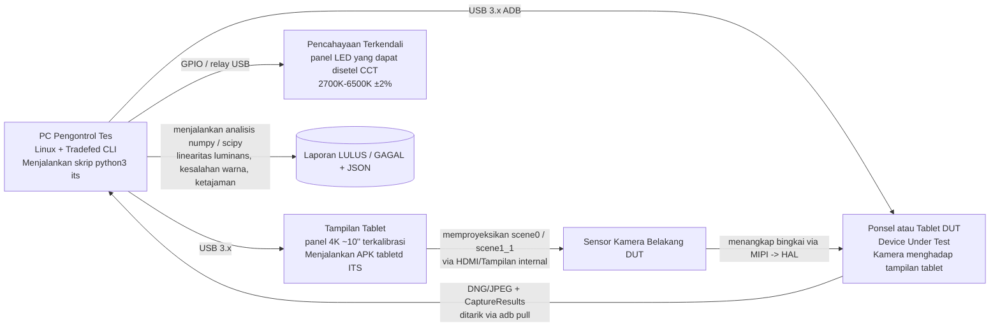

# Bab 27: Pengujian Kamera

## Ringkasan

Anda telah membangun aplikasi kamera. Berhasil berjalan di Pixel Anda. Berhasil berjalan di Galaxy Anda. Apakah ia berhasil berjalan di perangkat Android Go seharga $99 dengan HAL `LEGACY` yang vendornya salah mengimplementasikan `CONTROL_AF_TRIGGER_START` dan mengembalikan setiap `SENSOR_EXPOSURE_TIME` dalam *mikrodetik*, bukan nanodetik?

Pengujian perangkat lunak kamera adalah masalah dua bagian: **validasi OEM di tingkat HAL** (pengujian yang *dipaksakan* oleh Google untuk dilalui setiap produsen sebelum perangkat dapat dikirim dengan Google Play) dan **pengujian tingkat aplikasi di CI** (pengujian yang Anda jalankan terhadap kode Anda sendiri tanpa memerlukan perangkat keras kamera fisik). Bab ini membahas keduanya. Pertama, Anda akan mempelajari apa yang sebenarnya divalidasi oleh Camera ITS (Image Test Suite, bagian dari CTS) pada rig pengujian fisik: enumerasi kombinasi aliran, linearitas luminans adegan fisik, dan fusi stempel waktu sensor/gyro. Kemudian Anda akan belajar cara menulis pengujian instrumentasi Anda sendiri menggunakan mock Mockito untuk `CameraManager`/`CameraDevice`/`CaptureSession` sehingga seluruh tumpukan kamera Anda berjalan di server CI tanpa layar (headless) tanpa perangkat keras kamera sama sekali, ditambah pola pengujian berparameter yang menegaskan bahwa kode Anda terdegradasi secara anggun pada perangkat keras `LEGACY` alih-alih crash.

Gunakan **Android Camera Parameters** ([Google Play](https://play.google.com/store/apps/details?id=com.minininja.cameraparams), [GitHub](https://github.com/zoozooll/AndroidCameraParameters)) sebagai alat referensi untuk memeriksa kemampuan tepat yang harus ditegaskan oleh pengujian Anda — aplikasi ini menampilkan setiap kunci `CameraCharacteristics` yang juga divalidasi ITS pada rig nyata.

---

## Bagian Satu: Bagaimana OEM Memvalidasi Kamera — Camera ITS dan CTS

Sebelum perangkat dapat dikirim dengan Google Mobile Services (GMS), perangkat tersebut harus lulus Android Compatibility Test Suite (CTS). CTS Kamera memiliki dua bagian: pengujian CTS terprogram yang berjalan via `Tradefed`, dan Camera ITS (Image Test Suite) yang memerlukan laboratorium pengujian fisik dengan rig otomatis.

### Kategori Pengujian

```mermaid
graph TB
    subgraph CTS[Android CTS — Bagian Kamera]
        direction TB
        CTS_API[Pengujian API<br/>— Kunci CameraCharacteristics<br/>— isSessionConfigurationSupported<br/>— Semua kasus penggunaan dihitung dengan benar]
        CTS_FLOW[Pengujian Alur<br/>— buka -> tutup<br/>— buka -> sesi -> pengambilan -> tutup<br/>— Stres buka/tutup cepat]
        CTS_V[CTS Verifier<br/>Pengujian manual di perangkat<br/>— Kehalusan pratinjau<br/>— Kualitas pengambilan gambar<br/>— Peralihan multi-kamera]
    end
    subgraph ITS[Camera ITS — Image Test Suite]
        direction TB
        ITS_COMBI[test_feature_combination<br/>Permutasi aliran x FPS x HDR<br/>Ribuan panggilan ke<br/>isSessionConfigurationSupported]
        ITS_SCENE[Pengujian Adegan Fisik<br/>scene0 (abu-abu seragam)<br/>scene1_1 (pemeriksa warna)<br/>Tampilan tablet otomatis → DUT]
        ITS_FUSION[pengujian sensor_fusion<br/>Stempel waktu gyro harus selaras dengan<br/>SENSOR_TIMESTAMP di CaptureResult<br/>toleransi ±1ms]
        ITS_3A[Pengujian pemusatan 3A<br/>AE/AF/AWB harus memusat dalam<br/>N bingkai di bawah pencahayaan standar]
        ITS_HDR[Pengujian HDR / Ultra HDR<br/>Validitas gainmap JPEG_R<br/>Pengukuran rentang dinamis]
    end
    CTS --> SHIP[(Dikirim jika SEMUA lulus)]
    ITS --> SHIP

    style ITS_COMBI fill:#d9e6f2
    style ITS_SCENE fill:#d9f2e6
    style ITS_FUSION fill:#f2d9e6
    style CTS_API fill:#fff3cd
    style CTS_V fill:#fff3cd
```

Segala sesuatu dalam diagram tersebut wajib dilalui. Jika satu saja dari pengujian ini gagal pada satu ID kamera, perangkat tersebut tidak dikirim. Itulah sebabnya memahami ITS membantu aplikasi Anda: ia menjamin garis dasar di bawah mana tidak ada HAL yang boleh jatuh, dan ia mendokumentasikan perilaku persis yang dapat Anda andalkan.

### Arsitektur Rig Pengujian Camera ITS

Laboratorium Camera ITS yang nyata terlihat seperti ini:



Kuncinya adalah *loop tertutup (closed loop)*. Pengontrol pengujian tahu *persis* nilai piksel apa yang ia perintahkan untuk ditampilkan pada layar tablet (misalnya abu-abu seragam pada intensitas 50% dengan suhu warna 6500K yang diketahui secara presisi) dan kemudian memverifikasi secara numerik bahwa output kamera DUT — baik luminans piksel dalam JPEG/DNG *maupun* `SENSOR_EXPOSURE_TIME` × `SENSOR_SENSITIVITY` yang dilaporkan dalam `CaptureResult` — cocok dengan input fisik dalam toleransi yang diizinkan.

#### `test_feature_combination`: Tantangan Enumerasi

Pengujian ITS tunggal terbesar berdasarkan waktu jalannya adalah `test_feature_combination`. Ia menghitung setiap ukuran aliran yang sah dari `SCALER_STREAM_CONFIGURATION_MAP`, setiap format (`PRIV`, `YUV`, `JPEG`, `RAW_SENSOR`, `JPEG_R`, `DEPTH`), setiap rentang FPS dari `CONTROL_AE_AVAILABLE_TARGET_FPS_RANGES`, setiap kombinasi *jumlah* surface output (konfigurasi sesi 1-output, 2-output, 3-output), dan setiap flag mode HDR — kemudian memanggil `isSessionConfigurationSupported` pada SessionConfiguration yang dihasilkan, menangkap satu bingkai per konfigurasi yang didukung, dan menegaskan bahwa bingkai tersebut tidak rusak. Jumlah total kombinasi seringkali mencapai 30.000–100.000 per ID kamera.

Bagi Anda sebagai pengembang aplikasi, kesimpulannya sederhana: **jika `isSessionConfigurationSupported` mengembalikan `true` pada perangkat yang lulus CTS, kombinasi aliran tersebut benar-benar berfungsi, di kedua arah.** Jika ia mengembalikan `false`, jangan mencobanya. Andalkan panggilan ini sebelum Anda beralih ke ukuran yang lebih kecil. Ini adalah kueri yang persis sama dengan yang digunakan CameraX secara internal di pemilih resolusinya.

#### Pengujian Adegan Fisik: Linearitas Eksposur

Pengujian Scene0 dan scene1_1 memvalidasi bahwa perhitungan eksposur yang *dilaporkan* kamera cocok dengan output piksel yang *diukur*. Rig pengujian memproyeksikan bidang abu-abu seragam (scene0) dengan luminans `L` yang diketahui ke DUT. Ia kemudian memerintahkan pemindaian terhadap N pasangan `(SENSOR_EXPOSURE_TIME, SENSOR_SENSITIVITY)` yang berbeda dari seluruh rentang yang tersedia, menangkap bingkai DNG per pasangan, dan menghitung luminans piksel rata-rata aritmatika `Y` di seluruh array aktif sensor.

Pernyataan tersebut benar-benar linear:

```
Y_i / (EXPOSURE_TIME_i × SENSITIVITY_i) = konstanta ± toleransi
```

di *seluruh* pasangan yang ditangkap. Jika produknya berlipat ganda, luminans piksel harus berlipat ganda. Jika berkurang setengahnya, luminans harus berkurang setengahnya. Penyimpangan apa pun di atas ~1% pada nada tengah akan menggagalkan pengujian.

Mengapa ini penting bagi Anda: ini adalah jaminan bahwa slider eksposur manual Anda (Bab 14) menghasilkan hasil yang dapat diprediksi secara matematis pada perangkat yang mematuhi CTS. Jika aplikasi Anda menghitung pasangan "ISO/eksposur berikutnya" untuk langkah +1 EV, gambar output benar-benar akan menjadi satu stop lebih terang. Pada perangkat yang tidak mematuhi CTS (ponsel pasar gelap, custom ROM tanpa CTS), jaminan ini tidak berlaku, dan UI eksposur manual Anda akan terlihat rusak.

#### `sensor_fusion`: Pengujian Fusi Stempel Waktu

EIS (Electronic Image Stabilization) dan pelacakan AR hidup atau mati berdasarkan pengujian ini. Saat DUT sedang merekam video, pengontrol pengujian secara fisik memutar ponsel pada gimbal bermotor dengan kecepatan sudut yang diketahui. Secara bersamaan, ia melakukan polling pada sensor giroskop DUT melalui `SensorManager` pada frekuensi 400Hz+ dan `CaptureResult.SENSOR_TIMESTAMP` kamera pada 30/60fps.

Kondisi kelulusan: setiap stempel waktu gyro dan setiap stempel waktu bingkai `SENSOR_TIMESTAMP` harus berada dalam basis waktu `CLOCK_MONOTONIC` yang persis sama, dengan sampel gyro yang diinterpolasi pada waktu sampel kamera cocok dengan kecepatan sudut yang diperintahkan gimbal dalam toleransi ±0,1 rad/detik dan ±1ms.

Jika pengujian ini gagal, sumber stempel waktu HAL salah — biasanya ia mencampur `CLOCK_REALTIME` (waktu dinding, yang melompat selama sinkronisasi NTP) dengan `CLOCK_MONOTONIC` (stabil, monotonik). Google menolak perangkat tersebut. Bagi Anda, ini berarti Anda dapat dengan aman memasukkan `CaptureResult.SENSOR_TIMESTAMP` langsung ke dalam panggilan pembaruan gambar kamera ARCore tanpa menerapkan offset stempel waktu kustom apa pun, pada perangkat bersertifikasi GMS apa pun.

### CTS Verifier: Pengujian Pengguna Manual

Tidak semuanya dapat diotomatisasi. CTS Verifier adalah APK di perangkat yang digunakan oleh penguji QA manusia untuk pengujian subjektif:

- **Kehalusan pratinjau:** 30 detik menggerakkan perangkat; penguji memberi skor kehalusan yang dirasakan 1–5. (Telemetri objektif juga ditangkap melalui dumpsys Choreographer.)
- **Kualitas pengambilan gambar:** 5 foto adegan standar di bawah pencahayaan standar; penguji membandingkan dengan perangkat referensi emas.
- **Transisi zoom multi-kamera:** Saat melakukan zoom terus-menerus 0,5×–10×, tidak boleh ada lompatan, gangguan, atau bingkai hitam yang terlihat di antara pergantian kamera fisik.
- **Kualitas HDR/JPEG_R:** Pengambilan gambar SDR dan HDR secara berdampingan dibandingkan dengan citra referensi yang diketahui baik.

Ini bersifat subjektif, tetapi standar penilaiannya bersifat publik. Jika aplikasi Anda menargetkan tujuan UX yang serupa (transisi zoom yang halus, pengambilan HDR), Anda dapat mereplikasi prosedur pengujian yang sama di lab QA internal Anda dengan rig tablet scene0/scene1_1 yang sama.

---

## Bagian Dua: Menguji Aplikasi Anda Sendiri — Instrumentasi dan Mocking

Pengujian OEM memvalidasi HAL. Anda perlu memvalidasi kode *Anda*. Kesalahan kanonik yang dilakukan tim adalah mewajibkan ponsel asli dengan kamera yang berfungsi di server CI mereka. Jangan lakukan itu. Dengan `mock()` + `ArgumentCaptor` Mockito, setiap kelas Camera2 — `CameraManager`, `CameraDevice`, `CameraCaptureSession`, `CaptureResult` — adalah antarmuka atau kelas non-final yang dapat di-mock dengan bersih. Anda dapat menjalankan seluruh pipeline kamera Anda di CI pada emulator Linux x86 tanpa layar tanpa perangkat keras kamera sama sekali.

### Contoh 1: Menangkap sebuah "Bingkai" dan Memverifikasi CaptureResult Berisi EXPOSURE_TIME yang Diharapkan (AndroidTest dengan Mockito)

```kotlin
// app/src/androidTest/java/com/example/camera/CameraCaptureTest.kt
@RunWith(AndroidJUnit4::class)
@SmallTest
class CameraCaptureTest {

    @Test
    fun captureRequest_containsManualExposureTime_andResultEchoesIt() = runTest {
        // ---- Persiapan ----
        val mockCameraManager = mock<CameraManager>()
        val mockCameraDevice = mock<CameraDevice>()
        val mockSession = mock<CameraCaptureSession>()
        val mockSurface = mock<Surface>()
        val testHandler = Handler(Looper.getMainLooper())

        val expectedExposureNs = 16_666_666L // 1/60 detik
        val expectedIso = 400

        // Tangkap StateCallback yang diteruskan ke openCamera
        val deviceCallbackCaptor =
            argumentCaptor<CameraDevice.StateCallback>()
        whenever(mockCameraManager.openCamera(
            anyString(), deviceCallbackCaptor.capture(), any()
        )).thenAnswer { /* no-op; kita picu callback secara manual */ }

        // Tangkap callback status sesi
        val sessionCallbackCaptor =
            argumentCaptor<CameraCaptureSession.StateCallback>()
        whenever(mockCameraDevice.createCaptureSession(
            anyList<Surface>(),
            sessionCallbackCaptor.capture(),
            any()
        )).thenAnswer { /* no-op */ }

        // Tangkap CaptureCallback yang diteruskan ke capture()
        val captureCallbackCaptor =
            argumentCaptor<CameraCaptureSession.CaptureCallback>()
        whenever(mockSession.capture(
            any(), captureCallbackCaptor.capture(), any()
        )).thenReturn(1)

        // Bangun kamera yang sedang diuji menggunakan pembungkus (wrapper) Anda
        val cameraWrapper = YourCameraWrapper(mockCameraManager, testHandler)

        // ---- Aksi: picu rantai buka → konfigurasi → pengambilan ----
        cameraWrapper.open("0")
        // (Di dalam YourCameraWrapper.open() memanggil
        //  mockCameraManager.openCamera, yang menangkap callback.)
        // Simulasikan HAL mengembalikan keberhasilan:
        deviceCallbackCaptor.lastValue.onOpened(mockCameraDevice)

        cameraWrapper.createSession(listOf(mockSurface))
        sessionCallbackCaptor.lastValue.onConfigured(mockSession)

        val requestBuilder: CaptureRequest.Builder =
            mockCameraDevice.createCaptureRequest(CameraDevice.TEMPLATE_STILL_CAPTURE)
        // (Pembungkus Anda menerapkan pengaturan manual di sini)
        requestBuilder.set(CaptureRequest.CONTROL_MODE,
                           CaptureRequest.CONTROL_MODE_OFF)
        requestBuilder.set(CaptureRequest.SENSOR_EXPOSURE_TIME,
                           expectedExposureNs)
        requestBuilder.set(CaptureRequest.SENSOR_SENSITIVITY,
                           expectedIso)

        val resultDeferred = async { cameraWrapper.capture(requestBuilder.build()) }

        // ---- Penegasan (Assert) 1: CaptureRequest yang dikirim ke HAL memiliki kunci yang benar ----
        val sentRequest: CaptureRequest = captureArg(mockSession, 0) {
            capture(any(), any(), any())
        }
        assertThat(sentRequest[CaptureRequest.SENSOR_EXPOSURE_TIME])
            .isEqualTo(expectedExposureNs)
        assertThat(sentRequest[CaptureRequest.SENSOR_SENSITIVITY])
            .isEqualTo(expectedIso)

        // ---- Aksi 2: Simulasikan HAL mengembalikan CaptureResult ----
        val mockResult = mock<TotalCaptureResult>().apply {
            whenever(get(CaptureResult.SENSOR_EXPOSURE_TIME))
                .thenReturn(expectedExposureNs)
            whenever(get(CaptureResult.SENSOR_SENSITIVITY))
                .thenReturn(expectedIso)
            whenever(frameNumber).thenReturn(1L)
        }
        captureCallbackCaptor.lastValue
            .onCaptureCompleted(mockSession, sentRequest, mockResult)

        // ---- Penegasan 2: hasil pengambilan yang dikembalikan pembungkus memantulkan eksposur ----
        val actual = resultDeferred.await()
        assertThat(actual.exposureTimeNanos).isEqualTo(expectedExposureNs)
        assertThat(actual.iso).isEqualTo(expectedIso)
    }
}
```

Polanya selalu sama:
1. `argumentCaptor` callback yang akan dikirim ke HAL.
2. Panggil pembungkus Anda.
3. Picu metode sukses callback *seolah-olah HAL merespons*.
4. Lakukan penegasan (assertion) pada input (apa yang dikirim pembungkus Anda ke HAL) dan output (apa yang diserahkan pembungkus Anda kembali ke pemanggil).

Ini berjalan di emulator tanpa kamera. Tanpa perangkat keras. Tanpa ketidakkonsistenan dari pencahayaan. 10.000 kali dijalankan menghasilkan 10.000 kelulusan yang sama.

### Contoh 2: Pengujian Berparameter — Perangkat LEGACY Harus Terdegradasi Secara Anggun, Jangan Pernah Crash

Setiap aplikasi kamera produksi harus dapat berjalan pada HAL `LEGACY`. Bug tunggal yang paling umum adalah memanggil `CaptureRequest.CONTROL_MODE_OFF` pada perangkat `LEGACY`: HAL mengabaikannya, tetapi pembungkus Anda menafsirkan hasil `CaptureResult.CONTROL_AE_STATE == SEARCHING` sebagai kegagalan sementara dan mencoba memulai ulang AE dalam loop tak terhingga, yang akhirnya menyebabkan ANR.

Gunakan parameter pada pengujian Anda per `INFO_SUPPORTED_HARDWARE_LEVEL`:

```kotlin
@RunWith(Parameterized::class)
class HardwareLevelGracefulDegradationTest(
    private val hardwareLevel: Int,
    private val hardwareLevelName: String
) {
    companion object {
        @JvmStatic
        @Parameterized.Parameters(name = "{1}")
        fun data() = listOf(
            arrayOf(CameraCharacteristics.INFO_SUPPORTED_HARDWARE_LEVEL_LEGACY,
                    "LEGACY"),
            arrayOf(CameraCharacteristics.INFO_SUPPORTED_HARDWARE_LEVEL_LIMITED,
                    "LIMITED"),
            arrayOf(CameraCharacteristics.INFO_SUPPORTED_HARDWARE_LEVEL_FULL,
                    "FULL"),
            arrayOf(CameraCharacteristics.INFO_SUPPORTED_HARDWARE_LEVEL_3,
                    "LEVEL_3"),
        )
    }

    @Test
    fun requestManualExposure_onAnyHardwareLevel_doesNotCrash_orHang() = runTest {
        val mockCameraManager = mock<CameraManager>()
        val mockChars = mock<CameraCharacteristics>()
        whenever(mockChars.get<Int>(
            CameraCharacteristics.INFO_SUPPORTED_HARDWARE_LEVEL
        )).thenReturn(hardwareLevel)
        whenever(mockCameraManager.getCameraCharacteristics("0"))
            .thenReturn(mockChars)

        val wrapper = YourCameraWrapper(mockCameraManager, testHandler)
        wrapper.open("0")
        // ... (boilerplate pengaturan sesi seperti sebelumnya, diringkas)

        val job = launch {
            wrapper.setManualExposure(iso = 400, exposureNs = 8_000_000L)
        }

        // Tidak macet — harus selesai dalam waktu habis bahkan pada LEGACY
        withTimeoutOrNull(2_000) { job.join() }
            ?: fail("setManualExposure macet pada perangkat keras $hardwareLevelName")

        // Tidak ada eksepsi yang bocor ke uncaught
        assertThat(job.isCancelled).isFalse()
    }
}
```

Jalankan ini terhadap setiap build baru. Hanya butuh 400ms. Ini menangkap kelas macetnya HAL `LEGACY` yang jika tidak dilakukan hanya akan muncul di laporan crash Play Console berbulan-bulan kemudian.

### AndroidTest pada Perangkat Keras Nyata: Pengambilan Uji Kewarasan Bahwa EXPOSURE_TIME Sudah Benar

Untuk dijalankan setiap malam terhadap sekumpulan kecil ponsel asli, tulis AndroidTest singkat yang membuka kamera *sebenarnya*, menangkap satu bingkai RAW, dan menegaskan bahwa `CaptureResult.SENSOR_EXPOSURE_TIME` berada dalam 5% dari nilai yang diminta. Ini menjaga dari regresi HAL pada build OS tertentu:

```kotlin
@RunWith(AndroidJUnit4::class)
@RequiresDevice
@LargeTest
class RealHardwareCaptureSanityTest {

    @Test
    fun realCapture_exposureTimeIsWithin5PercentOfRequested() = runTest {
        val context = InstrumentationRegistry.getInstrumentation().context
        val camManager = context.getSystemService(Context.CAMERA_SERVICE)
            as CameraManager
        val chars = camManager.getCameraCharacteristics("0")
        assumeTrue(
            "Memerlukan FULL atau LEVEL_3 untuk eksposur manual",
            chars[CameraCharacteristics.INFO_SUPPORTED_HARDWARE_LEVEL] in
            setOf(
                CameraCharacteristics.INFO_SUPPORTED_HARDWARE_LEVEL_FULL,
                CameraCharacteristics.INFO_SUPPORTED_HARDWARE_LEVEL_3,
            )
        )

        // ... buka kamera, buat sesi ImageReader (PRIVATE atau YUV), tangkap
        // bingkai manual tunggal dengan eksposur yang diketahui menggunakan pembungkus dari
        // coroutine Bab 26 ...

        val requestedNs = 10_000_000L // 1/100 detik
        val result: TotalCaptureResult =
            cameraWrapper.captureManualExposure(requestedNs, iso = 200)

        val actualNs = result[CaptureResult.SENSOR_EXPOSURE_TIME]!!
        val tolerancePct = abs(actualNs - requestedNs) * 100.0 / requestedNs
        assertThat(tolerancePct)
            .withFailMessage(
                "Diminta %d ns, didapat %d ns (selisih %$.1f%% >5%%)",
                requestedNs, actualNs, tolerancePct
            )
            .isLessThan(5.0)
    }
}
```

Pengujian ini bersifat tidak konsisten (flaky) secara alami — ia bergantung pada perangkat keras nyata. Namun ia menangkap kelas pembaruan OTA vendor yang secara diam-diam merusak eksposur manual pada ponsel unggulan. Jalankan ini setiap malam pada armada 5–10 perangkat Anda; sinyal yang didapat sebanding dengan gangguannya.

---

## Ringkasan

Pengujian kamera terbagi menjadi validasi OEM dan validasi aplikasi. OEM harus lulus CTS dan Camera ITS, rangkaian pengujian yang dilakukan secara fisik yang menegaskan dukungan kombinasi aliran (melalui ribuan panggilan `isSessionConfigurationSupported`), linearitas luminans di seluruh bidang eksposur × sensitivitas, dan penyelarasan stempel waktu sensor/gyro untuk EIS dan AR. Aplikasi menguji via instrumentasi: Mockito me-mock setiap kelas Camera2, `ArgumentCaptor` mengambil callback HAL, Anda memicunya secara manual, dan Anda menegaskan baik permintaan maupun hasil tanpa menyentuh perangkat keras nyata — memungkinkan eksekusi CI pada emulator tanpa layar. Gunakan parameter pada pengujian pembungkus Anda terhadap setiap `INFO_SUPPORTED_HARDWARE_LEVEL` (terutama `LEGACY`) untuk menjamin degradasi yang anggun, dan jalankan rangkaian kecil pengambilan uji kewarasan `@RequiresDevice @LargeTest` terhadap armada perangkat nyata untuk menangkap regresi OTA.

## Apa Selanjutnya

Anda telah menguasai API publik Camera2 dari Kotlin melalui native NDK, membungkusnya dalam coroutine, dan memverifikasinya terhadap pengujian. Namun apa yang sebenarnya terjadi *di balik layar* saat Anda memanggil `CameraManager.openCamera`? Apa itu HAL3? Di mana batas IPC Binder sebenarnya berada? Dan bagaimana `CameraDeviceSetup` (Android 15, API 35) mengubah arsitektur dengan memisahkan kueri kemampuan dari daya sensor? Bab 28 adalah final arsitektur yang agung: tumpukan penuh dari kode aplikasi hingga motor voice coil VCM di barel lensa.
