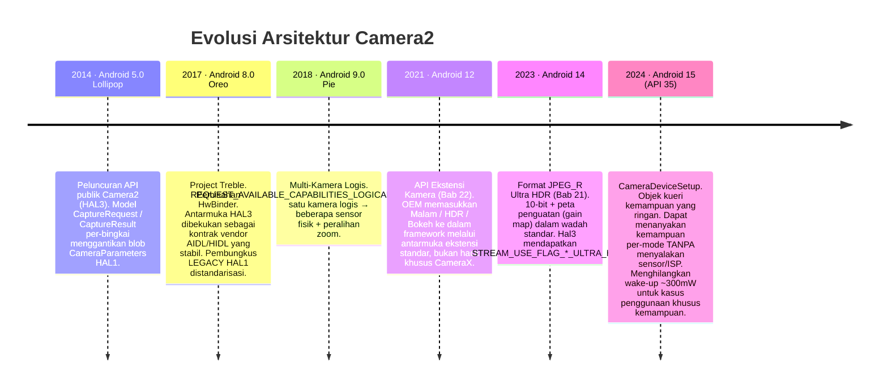

# Bab 28: Arsitektur Camera2

## Ringkasan

Ini adalah bab yang layak Anda dapatkan. Dalam Bab 1–27 Anda telah menggunakan `CameraManager`, `CameraCharacteristics`, `CaptureRequest`, `CaptureResult`, `CameraCaptureSession`, `ImageReader`, CameraX, tumpukan asli NDK, pembungkus coroutine, dan mock pengujian. Anda mengetahui setiap permukaan API publik. Sekarang kita mengupas setiap abstraksi secara berurutan, dari baris kode Kotlin yang Anda tulis hingga elektron individu yang melintasi bus MIPI CSI-2 antara sensor dan SoC, motor voice-coil yang menggeser grup lensa sejauh 10 mikrometer, dan pengontrol LED lampu kilat yang memancarkan strobo xenon atau LED dalam langkah kunci mikrodetik dengan rana bergulir sensor.

Pada akhir bab ini, Anda akan dapat melihat `CaptureRequest` apa pun dan memetakan, lapisan demi lapisan, ke mana setiap bagiannya pergi, siapa yang menerjemahkannya, siapa yang memvalidasinya, dan siapa yang akhirnya mengeksekusinya pada silikon. Anda juga akan memahami abstraksi `CameraDeviceSetup` Android 15 (API 35) sebagai contoh tren arsitektur selama satu dekade: memisahkan *kueri kemampuan* dari *status daya perangkat keras* secara progresif sehingga aplikasi dapat menyelidiki kamera tanpa menghabiskan daya ~300mW yang diperlukan untuk menyalakan sensor dan ISP.

Untuk memeriksa kemampuan tepat dari perangkat nyata apa pun dan mereferensikan silangnya terhadap lapisan arsitektur yang dijelaskan di sini, instal **Android Camera Parameters** ([Google Play](https://play.google.com/store/apps/details?id=com.minininja.cameraparams), [GitHub](https://github.com/zoozooll/AndroidCameraParameters)). Aplikasi ini membaca setiap kunci `CameraCharacteristics` yang diekspos oleh lapisan di bawah ini ke API publik.

---

## Diagram Lapisan Tumpukan Penuh

Ini adalah diagram tunggal yang paling penting di seluruh buku ini. Setiap lapisan dari sini ke bawah adalah kode nyata dengan jalur nyata dalam Android Open Source Project (AOSP), pemilik nyata, dan batas Binder atau panggilan fungsi yang nyata. Kita akan menelusuri setiap lapisan dari atas ke bawah, lalu menunjukkan evolusi tumpukan selama satu dekade terakhir, lalu memetakan perjalanan belajar Anda di berbagai lapisan tersebut.

```mermaid
graph TB
    subgraph APP["Lapisan Aplikasi (kode Anda)"]
        direction TB
        A1["Kotlin / Java / C++ NDK<br/>cameraManager.openCamera(id, cb, handler)<br/>session.capture(request, cb, handler)<br/>captureResult.get(SENSOR_EXPOSURE_TIME)"]
    end
    subgraph FRAME["Lapisan Framework Java/Kotlin — android.hardware.camera2.*"]
        direction TB
        F1["CameraManager · CameraCharacteristics<br/>CaptureRequest.Builder · CaptureResult<br/>CameraDevice · CameraCaptureSession"]
        F2["CameraBinderWrapper (AOSP frameworks/base)<br/>Menerjemahkan objek Java → parcel Binder AIDL"]
    end
    subgraph BIND["Lapisan IPC — Binder / HwBinder"]
        direction TB
        B1["AIDL ICameraService (AOSP)<br/>Framework ↔ CameraService"]
        B2["HIDL / AIDL HAL Binder (Treble)<br/>CameraService ↔ Vendor HAL"]
    end
    subgraph NS["Lapisan Native Mediaserver (system/bin/cameraserver)"]
        direction TB
        N1["CameraService (frameworks/av/services/camera/)"]
        N2["Camera3Device<br/>frameworks/av/services/camera/libcameraservice/device3/<br/>— Memvalidasi request vs output sesi<br/>— Membangun camera3_capture_request_t<br/>— Mengurai camera3_capture_result_t"]
        N3["CameraProviderManager (frameworks/av)<br/>Menghitung implementasi vendor HAL"]
    end
    subgraph HAL["Lapisan Vendor HAL (kode OEM / SoC)"]
        direction TB
        H1["Antarmuka HAL3: camera3_device_t<br/>— process_capture_request()<br/>— process_capture_result()<br/>— flush()"]
        H2["Pembungkus HAL1 (Legacy)<br/>camera2compat::Camera2Compat<br/>Menerjemahkan HAL3 request→HAL1 CameraParameters<br/>untuk < INFO_SUPPORTED_HARDWARE_LEVEL_LIMITED"]
        H3["Implementasi Vendor<br/>Qualcomm QCamera2 · MediaTek CamHAL · Samsung Exynos Camera HAL"]
    end
    subgraph K["Lapisan Kernel (Linux)"]
        direction TB
        K1["/dev/videoX — Driver Pengambilan Video V4L2<br/>VIDIOC_S_FMT · VIDIOC_REQBUFS · VIDIOC_QBUF / DQBUF"]
        K2["Driver ISP (Qualcomm CAMSS / Driver ISP MediaTek)<br/>Simpul V4L2 m2m pemrosesan memori-ke-memori"]
        K3["Driver Sensor Subdev<br/>Tulis I2C untuk mode / eksposur / gain / VCM"]
        K4["Driver Penerima MIPI CSI-2 (SoC)<br/>Konfigurasi jalur, transisi LP/HS, cek ECC/CRC"]
    end
    subgraph HW["Lapisan Perangkat Keras Fisik"]
        direction TB
        HW1["Rakitan Lensa<br/>VCM Voice Coil Motor (I2C)<br/>Menggerakkan grup lensa untuk fokus / OIS"]
        HW2["Array Piksel Sensor Kamera<br/>Sensor CMOS (Sony IMX / Samsung ISOCELL / OmniVision)<br/>Eksposur → Pembacaan → A/D"]
        HW3["Bus Fisik MIPI CSI-2<br/>2/4/8 pasangan diferensial pada 1,5 – 2,5 Gbps/jalur"]
        HW4["ISP Image Signal Processor (pada SoC)<br/>Demosaic · Pengurangan Noise · Penajaman · penggabungan HDR · deteksi wajah di perangkat keras"]
        HW5["Pengontrol LED Lampu Kilat (I2C)<br/>Strobo Xenon atau sink arus LED<br/>Disinkronkan ke pin EXRST sensor"]
    end

    APP -->|panggilan fungsi| FRAME
    FRAME -->|parcel AIDL| BIND
    BIND -->|HwBinder| NS
    NS -->|HAL3 AIDL/HIDL| HAL
    HAL -->|ioctl() syscalls| K
    K -->|tulis I2C + sinyal jalur MIPI + antrean perintah ISP| HW

    style APP fill:#e6d9f2
    style FRAME fill:#d9e6f2
    style BIND fill:#fff3cd,stroke:#ffc107,stroke-width:2px
    style NS fill:#d9f2e6
    style HAL fill:#f2d9e6
    style K fill:#e6d9e6
    style HW fill:#f2e6d9,stroke:#d4a373,stroke-width:2px
```

Sekarang telusuri dari atas ke bawah.

---

## Lapisan 1 — Lapisan Aplikasi (Kode Anda)

Ini adalah kode yang Anda tulis. `cameraManager.openCamera(id, stateCallback, cameraHandler)`. Anda hafal lapisan ini luar dalam. Dua fakta yang mungkin belum Anda internalisasi:
- Setiap panggilan `CaptureRequest.Builder.set(key, value)` yang Anda lakukan menambahkan *entri metadata yang ditandai* ke struktur parcelable yang mencerminkan persis struktur C `camera_metadata_t` dalam `system/media/camera/include/system/camera_metadata.h`. Tidak ada terjemahan ajaib antara `CaptureRequest` Kotlin Anda dan permintaan HAL — keduanya adalah format metadata biner yang sama, hanya dibungkus dengan pengikatan bahasa yang berbeda.
- Setiap panggilan `CaptureResult.get(key)` yang Anda lakukan membaca byte tepat yang ditulis HAL ke dalam buffer respons. Jika HAL salah melaporkan waktu eksposur pada build OTA tertentu, aplikasi Anda membaca tepat nilai yang salah tersebut. Tidak ada lapisan validasi tingkat framework di atas HAL yang memperbaiki kesalahan vendor. Itulah sebabnya pengujian kewarasan perangkat keras nyata Bab 27 ada.

---

## Lapisan 2 — Lapisan Framework Java/Kotlin (`android.hardware.camera2.*`)

Lapisan Framework (AOSP `frameworks/base/core/java/android/hardware/camera2/`) hanya melakukan dua hal:
1. Mengekspos permukaan API publik (`CameraManager`, `CameraDevice`, dll.) yang Anda panggil.
2. Menerjemahkan antara objek Java `CaptureRequest` / `CaptureResult` dan representasi kabel yang dapat diparcelkan melalui Binder.

Lapisan ini tidak melakukan penegakan kebijakan di atas HAL. Ia tidak melakukan penulisan ulang metadata. Ia tidak "memperbaiki" permintaan. Ia adalah lapisan terjemahan tipis ditambah cache untuk blob `CameraCharacteristics` yang tidak dapat diubah yang diambil satu kali per ID kamera saat perangkat dinyalakan.

Batas Binder ada pada AIDL `CameraManager` → `ICameraService`, yang merupakan lapisan berikutnya.

---

## Lapisan 3 — Lapisan IPC: Binder / HwBinder (Treble)

Ini adalah kontrak arsitektur kritis yang dikunci oleh Project Treble (Android 8.0, 2017). Dua domain Binder terlibat:

| Domain Binder     | Menghubungkan                                         | Protokol        | Siapa yang Menegakkan Stabilitas ABI |
|-------------------|-------------------------------------------------------|-----------------|--------------------------------------|
| `/dev/binder`     | Framework ↔ cameraserver (sisi system_server)        | AIDL            | Platform (build partisi yang sama)   |
| `/dev/hwbinder`   | cameraserver ↔ vendor camera HAL                      | HIDL / AIDL HAL | Treble (antarmuka vendor stabil)     |

Sebelum Treble, HAL adalah sebuah `.so` yang di-dlopen langsung ke dalam proses `cameraserver`. Setiap OTA dari OEM harus membangun kembali kamera *dan* framework secara bersamaan. Pemisahan HwBinder Treble berarti vendor HAL adalah prosesnya sendiri, partisinya sendiri, lini masa pembaruan keamanan 3 tahunnya sendiri, dan kontrak antara ia dan `cameraserver` telah diberi versi dan dibekukan selama masa pakai perangkat. Bagi Anda sebagai pengembang aplikasi, ini adalah alasan tunggal terbesar mengapa perilaku API Camera2 dapat diprediksi di berbagai OTA: antarmuka HAL secara harfiah tidak dapat berubah tanpa merusak pengujian kepatuhan Treble.

Pembungkus LEGACY HAL1 hidup di bawah batas ini, di dalam proses vendor HAL, sehingga tidak terlihat oleh Anda di lapisan aplikasi kecuali melalui `INFO_SUPPORTED_HARDWARE_LEVEL_LEGACY`.

---

## Lapisan 4 — Lapisan Native Mediaserver: `CameraService` / `Camera3Device`

`/system/bin/cameraserver` adalah daemon native yang dimulai saat booting oleh `init.rc`. Ia selalu berjalan, memiliki setiap kamera yang terbuka di perangkat, dan merupakan satu-satunya penentu aplikasi mana yang mendapatkan akses kamera (aplikasi teratas di latar depan menang; yang lainnya diputus koneksinya).

Dua kelas terpentingnya:

1. **`CameraService`** (`frameworks/av/services/camera/libcameraservice/CameraService.cpp`):
   - Mengekspos AIDL `ICameraService` ke framework.
   - Menegakkan pemeriksaan izin `android.permission.CAMERA` untuk setiap panggilan binder (panggilan aplikasi tanpa izin CAMERA ditolak *di cameraserver* sebelum mencapai HAL).
   - Menangani arbitrase pembukaan konkuren (dua aplikasi meminta kamera yang sama → aktivitas teratas mendapatkannya; aplikasi latar belakang mendapatkan `onDisconnected`).
   - Mengelola `CameraProviderManager` untuk menghitung modul vendor HAL.

2. **`Camera3Device`** (`frameworks/av/services/camera/libcameraservice/device3/Camera3Device.cpp`):
   - Jantung dari pipeline.
   - Memvalidasi bahwa setiap surface output dalam permintaan pengambilan gambar benar-benar merupakan bagian dari set output yang dikonfigurasi sesi. (Di sinilah framework melempar `IllegalArgumentException: Surface not in configured outputs`.)
   - Mengemas `CaptureRequest` Anda yang telah diparcelkan ke dalam struct HAL3 `camera3_capture_request_t`.
   - Mengalirkan permintaan satu per satu ke dalam HAL melalui `process_capture_request(request)`.
   - Menerima `camera3_capture_result_t` kembali dari HAL, memparcelkan metadata + pagar (fences), dan meneruskannya *kembali* ke atas rantai Binder ke `CaptureCallback.onCaptureCompleted` Anda.
   - Menangani `flush()` untuk Anda, jalur kesalahan, callback rana dan kesalahan `notify()`, serta pagar pelepasan buffer output untuk interop EGL/Vulkan.

`Camera3Device` berisi sekitar 15.000 baris kode C++ dan merupakan bagian yang paling banyak diuji dari seluruh tumpukan (pengujian CTS Bab 27 menargetkan perilaku `Camera3Device` secara langsung dari sisi framework). Jika Anda pernah membaca laporan bug yang mengatakan "kunci permintaan ini berfungsi pada Camera2 NDK tetapi tidak pada Java Camera2," ketidaksesuaian tersebut hampir selalu merupakan jalur validasi atau konversi yang hilang di dalam `Camera3Device`.

---

## Lapisan 5 — Lapisan Vendor HAL: HAL3 (`camera3_device_t`)

Di sinilah diferensiasi OEM sebenarnya berada. Setiap vendor SoC mengirimkan implementasi HAL3 mereka sendiri:

| Vendor       | Nama Kode HAL                             | Antarmuka AOSP                               |
|--------------|-------------------------------------------|----------------------------------------------|
| Qualcomm     | QCamera2 / QCamera3 (basis kode mm-camera)| `camera3_device_t` + ekstensi `vendor.qti.hardware.camera*` |
| MediaTek     | CamHAL (mtkcam)                           | `camera3_device_t` yang sama + ekstensi MediaTek |
| Samsung      | Exynos Camera HAL                         | `camera3_device_t` yang sama + ekstensi Samsung |
| Google Tensor| Google Camera HAL (Pixel)                 | `camera3_device_t` yang sama + logika kustom Google untuk Night Sight / Computational Raw |

Kontrak HAL3 (didefinisikan dalam `hardware/libhardware/include/hardware/camera3.h`) tepatnya adalah empat operasi inti pada perangkat yang terbuka:

```cpp
// Kontrak HAL3 yang disederhanakan — ini adalah seluruh antarmukanya
typedef struct camera3_device {
    hw_device_t common;

    int (*configure_streams)(
        const struct camera3_device *,
        camera3_stream_configuration_t *stream_list
    );

    int (*process_capture_request)(
        const struct camera3_device *,
        camera3_capture_request_t *request
    );

    void (*get_metadata_vendor_tag_ops)(...);

    int (*flush)(const struct camera3_device *);

    void (*dump)(...);
} camera3_device_t;
```

HAL menerima permintaan, menghasilkan hasil dan buffer output. Itu saja. Model permintaan/tanggapan adalah ciri khas HAL3 — HAL1 adalah blob string `CameraParameters` tunggal (`"preview-size=1920x1080;picture-size=..."`) yang dibenci seluruh industri karena kurangnya kontrol per-bingkai. Model permintaan/tanggapan HAL3 adalah apa yang *memungkinkan* setiap fitur canggih yang telah Anda gunakan dalam buku ini: eksposur manual per-bingkai, pengambilan RAW, stream fisik multi-kamera, pemrosesan ulang, surface input ZSL. Semuanya mustahil di bawah HAL1.

### Pembungkus LEGACY HAL1

`INFO_SUPPORTED_HARDWARE_LEVEL_LEGACY` berarti vendor *masih* hanya mengirimkan HAL1 `.so` dan perangkat tersebut menggunakan shim `camera2compat::Camera2Compat` AOSP untuk menerjemahkan panggilan permintaan/tanggapan HAL3 kembali ke blob `CameraParameters` lama + titik masuk HAL1 `startPreview()`/`takePicture()`. Lapisan terjemahan ini adalah alasan mengapa Bab 24 memperingatkan Anda bahwa `CONTROL_MODE_OFF` secara diam-diam tidak melakukan apa pun pada perangkat `LEGACY` — HAL1 tidak memiliki konsep `CONTROL_MODE` per-bingkai untuk diterjemahkan *ke*. Shim tersebut membuang entri metadata tersebut begitu saja.

---

## Lapisan 6 — Lapisan Kernel: V4L2 + MIPI CSI-2 + Driver Sensor

Proses HAL3 memanggil turun ke kernel Linux secara eksklusif melalui syscall `ioctl()` pada node perangkat. Empat kategori driver kernel berinteraksi untuk memproses satu bingkai:

1. **Driver Penerima MIPI CSI-2** (`/dev/v4l-subdevX`): Mengonfigurasi jumlah jalur PHY dan laju data, menangani transisi Low-Power ke High-Speed pada pasangan diferensial, memvalidasi ECC/CRC paket, dan melakukan DMA garis piksel yang diterima ke dalam buffer ring input ISP. Anda tidak pernah menyentuh driver ini dari user space. CRC CSI-2 yang buruk bermanifestasi kepada Anda sebagai buffer output yang rusak dengan `camera3_stream_buffer_t.status == BUFFER_ERROR` yang cocok.

2. **Driver Sensor Subdev** (`/dev/v4l-subdevY`, dikontrol I2C):
   - Menulis register sensor melalui I2C (bus side-band yang lambat, ~100KHz, itulah sebabnya perubahan eksposur dan peralihan mode memiliki latensi ~2-3 bingkai bahkan untuk perangkat `HARDWARE_LEVEL_3`).
   - Mengatur waktu eksposur (mulai/berhenti rana bergulir per-bingkai), gain analog, gain digital, resolusi, mode binning.
   - Mengontrol fokus VCM melalui DAC I2C yang mengalirkan arus ke motor voice coil (lihat lapisan HW).
   - Mengontrol sinkronisasi strobo lampu kilat melalui pin output EXRST sisi sensor yang didengarkan oleh pengontrol lampu kilat.

3. **Simpul Pengambilan Video V4L2** (`/dev/video0` dll.): HAL memanggil `VIDIOC_REQBUFS` untuk mengalokasikan buffer yang didukung gralloc (handle `AHardwareBuffer` yang sama persis dengan yang Anda impor ke Vulkan di Bab 25), lalu `VIDIOC_QBUF` (memasukkan buffer ke antrean) dalam sebuah loop. Saat bingkai tiba dari penerima CSI-2 + ISP, HAL memanggil `VIDIOC_DQBUF` (mengeluarkan buffer dari antrean) dan mengirimkannya ke `Camera3Device` sebagai `camera3_stream_buffer_t`.

4. **Driver ISP Memori-ke-Memori** (simpul `/dev/videoN m2m`): Terpisah dari jalur pengambilan gambar, HAL memasukkan buffer input pemrosesan ulang (untuk ZSL, Bab 23) ke dalam antrean m2m ISP untuk menjalankan demosaic, denoise, penggabungan HDR, atau deteksi wajah pada bingkai RAW yang ditangkap sebelumnya. Hasilnya muncul sebagai buffer output JPEG/YUV/PRIVATE yang diproses.

---

## Lapisan 7 — Lapisan Perangkat Keras Fisik

Akhirnya, elektron. Setiap lapisan di atas adalah kode yang mengeksekusi pada SoC. Lapisan perangkat keras adalah tempat foton diubah menjadi elektron dan diproses:

```mermaid
graph LR
    LENS["Grup Lensa<br/>Elemen kaca<br/>panjang fokus ~10–20mm"] --> VCM["VCM Voice Coil Motor<br/>DAC I2C → arus kumparan →<br/>perpindahan lensa ±50 µm<br/>Fokus + stabilisasi OIS"]
    VCM --> SENSOR[Array Piksel Sensor CMOS<br/>Sony IMX / Samsung ISOCELL<br/>~12MP – 200MP<br/>rana bergulir: pembacaan baris demi baris<br/>Rana global (jarang) pada sensor industri]
    SENSOR -->|Bayer 10/12/14-bit hasil konversi A/D| CSI[MIPI CSI-2 PHY<br/>2/4/8 pasangan<br/>hingga 20 Gbps agregat]
    CSI -->|interkoneksi internal SoC| ISP[ISP — pada die SoC<br/>Demosaic · CCM · NR · statistik 3A · penggabungan HDR<br/>seringkali 1 TOPS+ DNN untuk wajah/segmentasi]
    ISP -->|buffer Gralloc → DRAM| CPU[CPU / GPU<br/>Proses aplikasi Anda membacanya]
    FLASH["LED Lampu Kilat / Xenon<br/>Pengontrol lampu kilat I2C<br/>Strobo disinkronkan ke EXRST sensor"] --> SENSOR
```

Masing-masing sub-sistem fisik:
- **Lensa & VCM**: Gerakan lensa 10µm adalah satu langkah AF. OIS (Optical Image Stabilization) menambahkan umpan balik gyro loop tertutup ke VCM, menggeser lensa 500–5000 kali per detik untuk membatalkan getaran tangan. Driver kernel menulis nilai DAC I²C; aplikasi Anda mengontrolnya melalui kunci metadata `LENS_FOCUS_DISTANCE` dan `LENS_OPTICAL_STABILIZATION_MODE`.
- **Array piksel sensor**: Fotodioda mengumpulkan muatan proporsional dengan jumlah foton yang masuk. Pembacaan adalah rana bergulir (baris demi baris dari atas ke bawah), itulah sebabnya slider AE Anda di Bab 14 memiliki latensi 2–3 bingkai — eksposur untuk bingkai N diprogram selama pembacaan bingkai N-1.
- **Bus MIPI CSI-2**: Pasangan diferensial hingga 2,5Gbps/jalur × 8 jalur = 20Gbps mentah. Lebih dari cukup untuk 60fps 4K Bayer 12-bit. Kesalahan paket memicu transmisi ulang CRC di perangkat keras tetapi bingkai yang rusak mencapai Anda sebagai `BUFFER_ERROR`.
- **ISP**: Pahlawan yang kurang dihargai. Perangkat keras demosaic + pengurangan noise + penajaman berjalan pada kecepatan 1+ Gigapiksel/detik dan membebaskan CPU Anda untuk tidak melakukannya. Pada SoC Tensor / Snapdragon modern, ISP juga menjalankan akselerator DNN untuk segmentasi adegan, deteksi wajah, dan penggabungan HDR dalam sensor sebelum CPU melihat bingkai tersebut.
- **Pengontrol lampu kilat**: Pulsa lampu kilat harus menyala *tepat selama* jendela eksposur rana bergulir dari bingkai yang seharusnya disinari. Bit `FLASH_STATE_FIRED` dalam `CaptureResult` mengonfirmasi penyelarasan; ketidakselarasan menghasilkan bingkai yang terekspos sebagian.

---

## Evolusi Arsitektur: Camera2 melalui Versi Android

Camera2 tidak dibangun dalam sehari. Setiap 2–3 versi Android menambahkan primitif arsitektur baru yang membuka fitur nyata bagi pengembang:



Tren di setiap rilis sudah jelas: **pemisahan (decoupling)**.
- Android 8 memisahkan HAL dari framework (Treble).
- Android 9 memisahkan ID kamera logis dari sensor fisik.
- Android 12 memisahkan ekstensi OEM dari kode aplikasi.
- Android 14 memisahkan pengkodean HDR dari pipeline RAW.
- **`CameraDeviceSetup` Android 15 memisahkan kueri kemampuan dari daya perangkat keras.**

### Sorotan: `CameraDeviceSetup` Android 15 — Pemisahan Arsitektur dalam Beraksi

`CameraDeviceSetup` (Android 15, API 35) adalah contoh termurni dari tren ini. Sebelum API 35, jika sebuah aplikasi ingin tahu "apakah kombo stream 4K@60 dengan analisis YUV_420_888 secara bersamaan ini?", satu-satunya cara untuk memanggil `isSessionConfigurationSupported` adalah melalui instansi `CameraCharacteristics` yang diambil melalui `CameraManager.getCameraCharacteristics(id)`. Secara internal, ini memaksa HAL untuk menyalakan sensor (≈250–350mW) dan ISP selama beberapa milidetik hanya untuk membaca tabel kemampuan yang secara efektif statis selama masa pakai perangkat. Pada aplikasi yang terkendala baterai, ini sangat tidak mungkin untuk UX "pemeriksaan fitur sebelum dijalankan" apa pun.

`CameraDeviceSetup` memperbaikinya dengan menyediakan representasi ringan yang tidak memakan daya:

```kotlin
// Memerlukan API 35+
val setup: CameraDeviceSetup = cameraManager.getCameraDeviceSetup(cameraId)
val supported: Boolean = setup.isSessionConfigurationSupported(sessionConfig)
// getCameraDeviceSetup() TIDAK menyalakan sensor atau ISP
// Hasil dapat di-cache selama seluruh waktu aktif perangkat
```

Secara arsitektur, tabel kemampuan sekarang berada di blob bertanda tangan, terpisah dari partisi, yang diambil sebelumnya di partisi vendor, dan `getCameraDeviceSetup` membacanya melalui panggilan HwBinder terpisah yang melewati urutan penyalaan `Camera3Device` sepenuhnya. Ini adalah arah dekade berikutnya: *setiap* API yang dapat dijawab secara statis pada akhirnya akan memiliki rekanan ringan tanpa daya. Harapkan `CameraDeviceSetup` mendapatkan semakin banyak kueri kemampuan di Android 16+.

---

## Perjalanan Pembaca Dipetakan ke Lapisan Arsitektur

Terakhir, petakan perjalanan Anda sendiri melalui buku ini ke lapisan-lapisan tersebut. Setiap bab berhubungan dengan lapisan atau batas antarmuka tertentu:

```mermaid
flowchart TB
    subgraph Journey["Perjalanan Anda di Buku Ini (Bab → Lapisan)"]
        direction LR
        C1["Bab 1–4<br/>Dasar-dasar<br/>Konsep lapisan HW"] ~~~ H_L1["↔ Lapisan HW"]
        C2["Bab 5–9<br/>Aplikasi Camera2 pertama<br/>CameraManager · Sesi · ImageReader"] ~~~ H_L2["↔ App + Framework"]
        C3["Bab 10–12<br/>Pipeline · Jenis Pengambilan<br/>Deep Dive Karakteristik"] ~~~ H_L3["↔ Metadata parcel + kontrak HAL3"]
        C4["Bab 13–17<br/>Manual 3A · Eksposur · Fokus · WB"] ~~~ H_L4["↔ Kunci metadata → HAL3 → driver sensor I²C"]
        C5["Bab 18–23<br/>RAW · HDR · Multi-Cam · ZSL · Ekstensi"] ~~~ H_L5["↔ Model permintaan HAL3 · pemrosesan ulang ISP m2m"]
        C6["Bab 24 CameraX<br/>Fasad UseCase + Interop"] ~~~ H_L6["↔ Abstraksi sisi aplikasi di atas Framework"]
        C7["Bab 25 Native NDK<br/>ACamera + AHB → Vulkan"] ~~~ H_L7["↔ Shim NDK tepat di atas Camera3Device"]
        C8["Bab 26 Coroutine/Flow<br/>Pembungkusan asinkron callback"] ~~~ H_L8["↔ Asinkron lapisan aplikasi di sekitar batas Binder"]
        C9["Bab 27 Pengujian ITS/CTS<br/>Mock vs perangkat keras asli"] ~~~ H_L9["↔ Memvalidasi setiap lapisan via harness pengujian"]
        C10["Bab 28 BAB INI<br/>Arsitektur tumpukan penuh"] ~~~ H_L10["↔ SEMUA lapisan, ujung-ke-ujung"]
    end
    H_L1 --> HW
    H_L2 --> FRAME
    H_L3 --> HAL
    H_L4 --> K
    H_L5 --> HAL
    H_L6 --> APP
    H_L7 --> NS
    H_L8 --> APP
    H_L9 --> BIND
    H_L10 --> HW
```



Dengan membaca bab ini terakhir, Anda telah mencocokkan arsitektur dengan praktiknya. Anda tidak mempelajari HAL3 secara abstrak di hari pertama dan berjuang untuk memetakannya ke kode nyata. Anda belajar dengan *melakukan*: buka → konfigurasi → pengambilan → hasil, selama 27 bab, lalu menarik tirai untuk melihat siapa yang sebenarnya merespons setiap panggilan tersebut.

---

## Ringkasan

Camera2 adalah tumpukan tujuh lapisan: Aplikasi → Framework (Java/Kotlin `android.hardware.camera2.*`) → IPC Binder/HwBinder → `CameraService` Native + `Camera3Device` → Vendor HAL3 (`camera3_device_t`, dengan pembungkus LEGACY HAL1) → Driver Kernel V4L2 (MIPI CSI-2, sensor, pengambilan, ISP m2m) → Perangkat keras fisik (lensa/VCM, sensor, bus MIPI, ISP, pengontrol lampu kilat). Project Treble mengunci kontrak HAL melalui HwBinder, memastikan stabilitas jangka panjang. Tren arsitektur selama satu dekade adalah pemisahan progresif, yang berpuncak pada `CameraDeviceSetup` Android 15, yang dapat menanyakan kemampuan tanpa menyalakan sensor. Anda sekarang telah memetakan setiap fitur — dari ISO manual di Bab 14 hingga ZSL di Bab 23 hingga Vulkan zero-copy asli di Bab 25 — ke lapisan tepat yang mengeksekusinya.

## Apa Selanjutnya: Bagian VII — Ensiklopedia Metadata Kamera

Ini menutup Bagian VI: Pengembangan Kamera Android Modern. Perbatasan yang tersisa adalah referensi ensiklopedis mendetail untuk setiap kunci metadata `CameraCharacteristics`, `CaptureRequest`, dan `CaptureResult` yang telah Anda gunakan di 28 bab. Bagian VII adalah Ensiklopedia Metadata: SENSOR, LENS, CONTROL, SCALER, REQUEST — setiap tag didefinisikan, dijelaskan, ditanyakan, diperiksa silang terhadap perangkat nyata, dan divalidasi melalui aplikasi Android Camera Parameters. Buka saat Anda perlu tahu persis apa arti `SCALER_CROPPING_TYPE`, perangkat mana yang mendukung `REQUEST_AVAILABLE_CAPABILITIES_OFFLINE_PROCESSING`, atau bagaimana perilaku kunci tertentu sebenarnya pada HAL `LEGACY` yang nyata.
