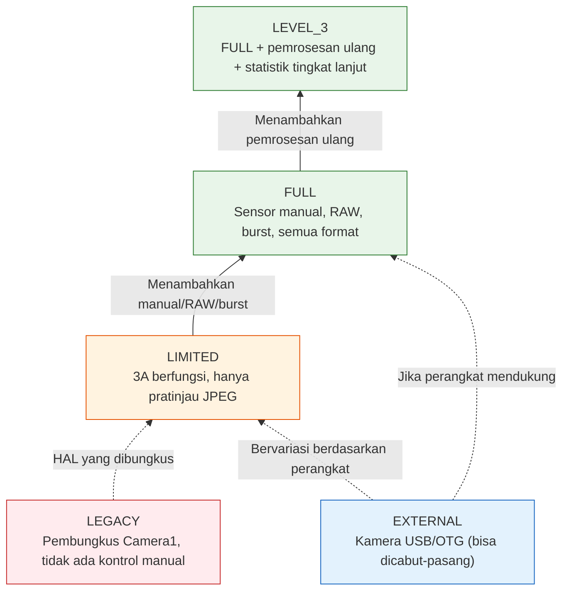
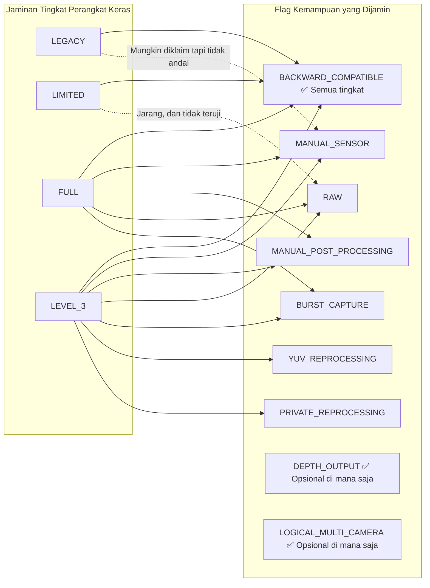
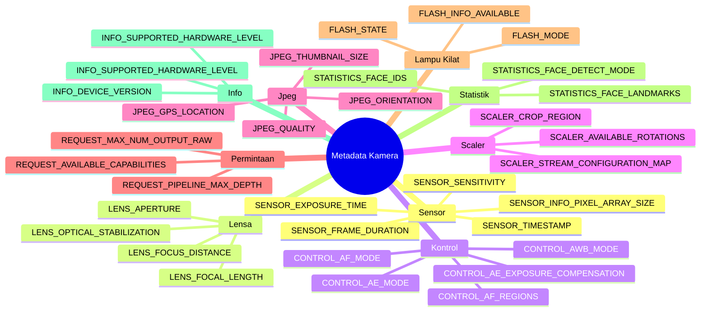

## 12.1 Lembar Spesifikasi dalam Saku Anda

Sebelum Anda dapat memanggil `openCamera()`, sebelum Anda dapat membangun `CaptureRequest`, sebelum Anda dapat mengonfigurasi sesi — ada `CameraCharacteristics`. Ini adalah jendela statis, tidak dapat diubah, dan bebas daya ke *segala sesuatu* yang dapat dilakukan kamera. Anggap saja sebagai lembar spesifikasi kamera, yang diekspos sebagai objek terstruktur yang dapat ditanyakan.

`CameraCharacteristics` adalah alat terpenting Anda untuk menulis aplikasi yang berfungsi di 10.000+ model perangkat Android. Anda tidak dapat berasumsi ISO manual berfungsi. Anda tidak dapat berasumsi RAW tersedia. Anda bahkan tidak dapat berasumsi kamera mendukung pratinjau 1080p — kecuali Anda menanyakannya ke `CameraCharacteristics`.

Di [Bab 6](discovering-cameras.md) kita telah menyentuh dasar-dasarnya: arah hadap lensa, ukuran sensor, panjang fokus. Dalam pembahasan mendalam ini kita akan melangkah lebih jauh:
- Lima **tingkat perangkat keras** (LEGACY → LIMITED → FULL → LEVEL_3 → EXTERNAL) dan apa yang dijamin oleh masing-masing tingkat
- Sepuluh lebih **flag kemampuan (capability flags)** (`MANUAL_SENSOR`, `RAW`, `DEPTH_OUTPUT`, dll.) dan tingkat perangkat keras mana yang menyediakannya
- Bagaimana kunci metadata **diorganisasikan secara hierarkis** berdasarkan subsistem (`android.sensor.*`, `android.lens.*`, `android.control.*`, ...)
- Cara menulis **kueri kemampuan runtime yang komprehensif** dengan cadangan (fallbacks) yang anggun

Aplikasi Android Camera Parameters ([GitHub](https://github.com/zoozooll/AndroidCameraParameters), [Play Store](https://play.google.com/store/apps/details?id=com.minininja.cameraparams)) pada dasarnya adalah browser `CameraCharacteristics`. Buka untuk kamera apa pun dan Anda akan melihat persis kunci-kunci yang kita bahas dalam bab ini, diatur berdasarkan kategori, dengan label yang dapat dibaca manusia dan tampilan nilai langsung.

## 12.2 Apa Sebenarnya CameraCharacteristics Itu

Secara formal, `CameraCharacteristics` adalah:

- **Tidak dapat diubah (Immutable)** — Setelah diperoleh dari `CameraManager.getCameraCharacteristics(id)`, objek tersebut tidak pernah berubah (dengan satu pengecualian yang didokumentasikan: `SENSOR_ORIENTATION` pada perangkat lipat di API 32+).
- **Bebas daya** — Menanyakannya **tidak** menyalakan sensor atau ISP. Anda dapat memanggilnya di `onCreate()` Activity pertama Anda tanpa dampak pada baterai.
- **Per-kamera** — Setiap ID kamera logis memiliki objek `CameraCharacteristics`-nya sendiri.
- **Aman tipe dan berbasis kunci** — Data diakses via `<Key<T>> get(Key<T> key)` di mana setiap kunci memiliki tipe yang didokumentasikan (Int, Long, Float, Rect, Array, dll.).

Anda mendapatkannya dengan satu panggilan:

```kotlin
val cameraManager = getSystemService(CAMERA_SERVICE) as CameraManager
val cameraIdList = cameraManager.cameraIdList  // misalnya ["0", "1", "2", "3"]

for (id in cameraIdList) {
    val characteristics: CameraCharacteristics = cameraManager.getCameraCharacteristics(id)
    // Silakan kueri — tidak ada daya sensor yang digunakan!
}
```

Pada Android 15 (API 35) Anda dapat menggunakan `CameraManager.getCameraDeviceSetup(id)` untuk kueri konfigurasi sesi yang ringan tanpa membuka kamera (lihat [Bab 28](camera2-architecture.md) untuk detail `CameraDeviceSetup`).

## 12.3 Tingkat Perangkat Keras: INFO_SUPPORTED_HARDWARE_LEVEL

Kunci `CameraCharacteristics` tunggal yang paling penting adalah **`INFO_SUPPORTED_HARDWARE_LEVEL`**. Ini mendefinisikan seluruh tingkatan HAL kamera dan memberi tahu Anda (secara luas) fitur apa saja yang dijamin berfungsi. Ada lima tingkat perangkat keras:

### Lima Tingkat Perangkat Keras

| Tingkat | Konstanta | Perangkat Tipikal | Apa Artinya dalam Praktik |
|-------|----------|----------------|---------------------------|
| **LEGACY** | `INFO_SUPPORTED_HARDWARE_LEVEL_LEGACY` | Perangkat anggaran pra-2015, chipset yang sangat tua | API Camera2 adalah pembungkus (wrapper) di sekitar API `android.hardware.Camera` yang lama. Tidak ada kontrol per-bingkai, tidak ada pengaturan manual, RAW mustahil, burst tidak andal. Perlakukan perangkat ini sebagai "era Camera1 dengan sintaks Camera2." |
| **LIMITED** | `INFO_SUPPORTED_HARDWARE_LEVEL_LIMITED` | Ponsel anggaran (Android Go, SoC tingkat entri seperti MediaTek Helio, Snapdragon 4xx) | HAL Camera2 asli tetapi hanya subset fitur. 3A (AF/AE/AWB) berfungsi. Pratinjau + JPEG berfungsi. Tapi **tidak ada** kontrol sensor manual, **tidak ada** RAW, **tidak ada** burst yang dijamin, **tidak ada** pemrosesan ulang YUV. Ini adalah tingkat kamera "garis dasar fungsional" Android. |
| **FULL** | `INFO_SUPPORTED_HARDWARE_LEVEL_FULL` | Ponsel kelas menengah dan unggulan (Snapdragon 6xx/7xx/8xx, Exynos kelas menengah ke atas, Dimensity 7xxx+) | Tingkatan "kamera pro." Menjamin MANUAL_SENSOR, MANUAL_POST_PROCESSING, BURST_CAPTURE, pengaturan per-bingkai, resolusi penuh 30fps, RAW, semua format output, kedalaman pipeline yang dapat diprediksi. Inilah yang Anda inginkan untuk aplikasi kamera serius apa pun. |
| **LEVEL_3** | `INFO_SUPPORTED_HARDWARE_LEVEL_3` | Ponsel unggulan kelas atas dengan ISP canggih (Snapdragon 8 Gen 1+, Pixel 6+, Exynos 2xxx+) | FULL + ekstra: pemrosesan ulang YUV (dukungan stream input, pemrosesan ulang offline), pemrosesan ulang pribadi, statistik tingkat lanjut, JPEG perangkat keras + RAW pada resolusi maksimum secara simultan. Diperlukan untuk ZSL dengan output RAW. |
| **EXTERNAL** | `INFO_SUPPORTED_HARDWARE_LEVEL_EXTERNAL` | Kamera USB, webcam yang terhubung via OTG | HAL kamera eksternal. Berperilaku seperti LIMITED atau FULL tergantung pada perangkat USB-nya. Peringatan utama: kamera dapat dicabut/terputus kapan saja, jadi dengarkan `ACTION_CAMERA_DEVICE_STATE_CHANGED`. |



:::important
Tingkat perangkat keras adalah sebuah **jaminan**, bukan sekadar flag upaya terbaik. Jika sebuah perangkat melaporkan FULL, CTS (Compatibility Test Suite) Google telah memverifikasi bahwa setiap fitur tingkat FULL berfungsi. Jika perangkat melaporkan LIMITED, Anda tidak dapat mengandalkan fitur tingkat FULL apa pun — meskipun fitur tersebut kebetulan berfungsi di satu perangkat LIMITED tertentu, ia akan rusak di perangkat lainnya.
:::

### Memeriksa Tingkat Perangkat Keras saat Runtime

```kotlin
val hardwareLevel = characteristics.get(CameraCharacteristics.INFO_SUPPORTED_HARDWARE_LEVEL)

when (hardwareLevel) {
    CameraCharacteristics.INFO_SUPPORTED_HARDWARE_LEVEL_LEGACY -> {
        Log.w("CamCaps", "Perangkat keras LEGACY — manual/RAW dinonaktifkan. Kembali ke JPEG dasar.")
        disableManualControls()
        disableRawCapture()
    }
    CameraCharacteristics.INFO_SUPPORTED_HARDWARE_LEVEL_LIMITED -> {
        Log.i("CamCaps", "Perangkat keras LIMITED — hanya pratinjau + foto dasar.")
        disableManualControls()
        disableRawCapture()
        disableBurstCapture()
    }
    CameraCharacteristics.INFO_SUPPORTED_HARDWARE_LEVEL_FULL -> {
        Log.i("CamCaps", "Perangkat keras FULL — mengaktifkan kontrol manual, RAW, dan burst.")
        enableManualControls()
        enableRawCapture()
        enableBurstCapture()
    }
    CameraCharacteristics.INFO_SUPPORTED_HARDWARE_LEVEL_3 -> {
        Log.i("CamCaps", "Perangkat keras LEVEL_3 — FULL + pemrosesan ulang + ZSL + statistik tingkat lanjut.")
        enableManualControls()
        enableRawCapture()
        enableBurstCapture()
        enableReprocessing()
        enableZeroShutterLag()
    }
    CameraCharacteristics.INFO_SUPPORTED_HARDWARE_LEVEL_EXTERNAL -> {
        Log.i("CamCaps", "Kamera EXTERNAL — mungkin LIMITED atau FULL; mendaftarkan listener pemutusan.")
        registerHotplugListener()
        // Selidiki kemampuan secara dinamis daripada berasumsi
    }
    else -> {
        Log.w("CamCaps", "Tingkat perangkat keras tidak diketahui $hardwareLevel — mengasumsikan LIMITED demi keamanan.")
        safeDefaultFeatures()
    }
}
```

## 12.4 Kemampuan: REQUEST_AVAILABLE_CAPABILITIES

Tingkat perangkat keras adalah tingkatan yang *kasar*. Untuk deteksi fitur yang mendetail, Camera2 mengekspos `REQUEST_AVAILABLE_CAPABILITIES` — sebuah `IntArray` berisi flag kemampuan. Setiap flag menjelaskan satu hal spesifik yang dapat dilakukan kamera.

Hubungan formal antara tingkat perangkat keras dan kemampuan:



### Penjelasan Flag Kemampuan

| Konstanta Flag | Arti | Jaminan Tingkat Perangkat Keras | Implikasi Praktis |
|--------------|---------|--------------------------|----------------------|
| `BACKWARD_COMPATIBLE` | Kamera mengimplementasikan API Camera2 dasar | **Semua 5 tingkat** (LEGACY–EXTERNAL) | Jika ini hilang, perangkat kamera tersebut secara efektif tidak berfungsi untuk aplikasi Anda. |
| `MANUAL_SENSOR` | Aplikasi dapat mengontrol `SENSOR_EXPOSURE_TIME`, `SENSOR_SENSITIVITY`, `SENSOR_FRAME_DURATION`, `LENS_FOCUS_DISTANCE`, `LENS_APERTURE` secara manual | Dijamin pada **FULL** dan **LEVEL_3** | Mode pro dan UI kamera manual memerlukan ini. Tanpa ini, semua slider ISO/eksposur manual harus disembunyikan. |
| `MANUAL_POST_PROCESSING` | Aplikasi dapat mengontrol tahap ISP secara manual: pengurangan noise, peningkatan tepi, kurva nada, gain koreksi warna, transformasi koreksi warna | Dijamin pada **FULL** dan **LEVEL_3** | Diperlukan untuk LUT "tampilan film" kustom, white balance manual via gain, kontrol ketajaman/blur. |
| `RAW` | Sensor mengeluarkan data Bayer RAW via `ImageFormat.RAW_SENSOR`, `RAW10`, atau `RAW12` | Dijamin pada **FULL** dan **LEVEL_3** | Pengambilan DNG, pipeline pengeditan RAW-ke-JPEG, fotografi komputasional semuanya dimulai dari sini. |
| `PRIVATE_REPROCESSING` | Kamera mendukung `InputSurface` + pemrosesan ulang offline gambar format-pribadi-HAL menjadi JPEG/YUV | Dijamin pada **LEVEL_3**. Jarang pada FULL. | Memungkinkan Zero-Shutter-Lag (ZSL): masukkan bingkai masa lalu ke buffer melingkar, proses ulang bingkai terbaru menjadi foto diam kualitas tinggi. |
| `YUV_REPROCESSING` | Kamera mendukung `InputSurface` + pemrosesan ulang gambar YUV_420_888 yang diberikan aplikasi kembali melalui ISP | Dijamin pada **LEVEL_3** | Memungkinkan pipeline "terapkan LUT sinematik ke video yang direkam" atau "fokus ulang kedalaman potret di pasca-proses". |
| `DEPTH_OUTPUT` | Kamera dapat mengeluarkan peta kedalaman (format `DEPTH16` / `DEPTH_POINT_CLOUD`) | **Opsional pada tingkat APA PUN**. Periksa array secara eksplisit. | Bokeh mode potret, pengukuran AR, pemindaian 3D. Seringkali dipasangkan dengan `LOGICAL_MULTI_CAMERA` (kamera fisik ganda untuk kedalaman stereo). |
| `LOGICAL_MULTI_CAMERA` | Kamera logis ini didukung oleh 2+ sensor fisik (misalnya ultra-lebar + lebar + telefoto) | **Opsional pada tingkat APA PUN**. Biasanya hanya ponsel unggulan. | Memungkinkan zoom optik yang mulus (lihat [Bab 20](multi-camera.md)). Anda dapat menanyakan `LOGICAL_MULTI_CAMERA_PHYSICAL_IDS` untuk mendapatkan ID kamera fisik. |
| `BURST_CAPTURE` | `captureBurst()` dengan > 1 bingkai berfungsi pada resolusi penuh tanpa bingkai yang terbuang | Dijamin pada **FULL** dan **LEVEL_3** | Tanpa ini, pengambilan gambar burst mungkin tersendat, bingkai terbuang, atau gagal secara diam-diam. Bracketing eksposur / fokus memerlukan ini. |
| `CONSTRAINED_HIGH_SPEED_VIDEO` | Mendukung `createHighSpeedRequestList()` + video kecepatan tinggi (120fps, 240fps) | **Opsional pada FULL/LEVEL_3**. Jarang pada LIMITED. | Perekaman gerak lambat (lihat [Bab 19](high-speed-video.md)). |
| `MOTION_TRACKING` | Kamera dapat melacak objek / wajah pada frame rate tinggi dengan latensi rendah | Opsional (jarang). Ditemukan pada Pixel dan beberapa ponsel unggulan. | Pelacakan gerakan AR, autofokus olahraga. |
| `LOGICAL_MULTI_CAMERA_SYNC` | Beberapa kamera fisik dalam perangkat logis dapat menangkap bingkai yang disinkronkan | Opsional. Diperlukan untuk pengambilan gambar multi-sensor simultan yang sebenarnya. | Fotografi komputasional yang menggunakan beberapa lensa sekaligus (misalnya fusion zoom). |

### Menanyakan Semua Kemampuan saat Runtime

```kotlin
val capabilities = characteristics.get(
    CameraCharacteristics.REQUEST_AVAILABLE_CAPABILITIES
) ?: intArrayOf()

fun hasCapability(cap: Int): Boolean = capabilities.contains(cap)

val supportsManualSensor = hasCapability(
    CameraCharacteristics.REQUEST_AVAILABLE_CAPABILITIES_MANUAL_SENSOR
)
val supportsRaw = hasCapability(
    CameraCharacteristics.REQUEST_AVAILABLE_CAPABILITIES_RAW
)
val supportsBurst = hasCapability(
    CameraCharacteristics.REQUEST_AVAILABLE_CAPABILITIES_BURST_CAPTURE
)
val supportsDepth = hasCapability(
    CameraCharacteristics.REQUEST_AVAILABLE_CAPABILITIES_DEPTH_OUTPUT
)
val supportsLogicalMultiCam = hasCapability(
    CameraCharacteristics.REQUEST_AVAILABLE_CAPABILITIES_LOGICAL_MULTI_CAMERA
)
val supportsHighSpeed = hasCapability(
    CameraCharacteristics.REQUEST_AVAILABLE_CAPABILITIES_CONSTRAINED_HIGH_SPEED_VIDEO
)
val supportsYuvReprocessing = hasCapability(
    CameraCharacteristics.REQUEST_AVAILABLE_CAPABILITIES_YUV_REPROCESSING
)
val supportsPrivateReprocessing = hasCapability(
    CameraCharacteristics.REQUEST_AVAILABLE_CAPABILITIES_PRIVATE_REPROCESSING
)

// Bangun laporan yang dapat dibaca manusia
val capabilityReport = buildString {
    appendLine("=== Laporan Kemampuan Kamera ===")
    appendLine("BACKWARD_COMPATIBLE:     ${hasCapability(
        CameraCharacteristics.REQUEST_AVAILABLE_CAPABILITIES_BACKWARD_COMPATIBLE
    )}")
    appendLine("MANUAL_SENSOR:           $supportsManualSensor")
    appendLine("MANUAL_POST_PROCESSING:  ${hasCapability(
        CameraCharacteristics.REQUEST_AVAILABLE_CAPABILITIES_MANUAL_POST_PROCESSING
    )}")
    appendLine("RAW:                     $supportsRaw")
    appendLine("BURST_CAPTURE:           $supportsBurst")
    appendLine("YUV_REPROCESSING:        $supportsYuvReprocessing")
    appendLine("PRIVATE_REPROCESSING:    $supportsPrivateReprocessing")
    appendLine("DEPTH_OUTPUT:            $supportsDepth")
    appendLine("LOGICAL_MULTI_CAMERA:    $supportsLogicalMultiCam")
    appendLine("CONSTRAINED_HIGH_SPEED:  $supportsHighSpeed")
}

Log.i("CamCaps", capabilityReport)

// Sekarang batasi fitur UI Anda
manualIsoSlider.isEnabled = supportsManualSensor
manualExposureSlider.isEnabled = supportsManualSensor
rawCaptureToggle.isEnabled = supportsRaw
burstCaptureButton.isEnabled = supportsBurst
depthPortraitMode.isEnabled = supportsDepth
zoomSwitcher.isEnabled = supportsLogicalMultiCam
slowMoButton.isEnabled = supportsHighSpeed
zslMode.isEnabled = supportsPrivateReprocessing  // LEVEL_3
```

:::tip
Aplikasi Android Camera Parameters merender kueri ini tepat sebagai kotak centang berkode warna dalam kartu **Kemampuan** dari tampilan ringkasan kamera. Hijau = didukung, abu-abu = tidak didukung. Anda dapat membandingkan beberapa kamera berdampingan untuk melihat bagaimana kemampuan kamera ultra-lebar berbeda dari kamera utama.
:::

## 12.5 Pengorganisasian Metadata: Namespace android.*

Setiap kunci dalam `CameraCharacteristics`, `CaptureRequest`, dan `CaptureResult` mengikuti konvensi penamaan hierarkis: `android.<subsistem>.<parameter>`. Komponen yang dipisahkan titik mengelompokkan pengaturan terkait berdasarkan subsistem perangkat keras/perangkat lunak yang mereka kontrol.

### Kelas Subsistem

| Prefiks Subsistem | Kelas Metadata Kotlin | Apa yang Dicakup |
|-----------------|----------------------|---------------|
| `android.sensor.*` | `CameraCharacteristics.SensorInfo*`, `CaptureRequest.SENSOR_*`, `CaptureResult.SENSOR_*` | Pembacaan sensor: waktu eksposur, sensitivitas ISO, durasi bingkai, stempel waktu, array piksel, array aktif, arah rana bergulir, mode pola pengujian |
| `android.lens.*` | `LensInfo*`, `Lens.*` | Optik: jarak fokus, bukaan, panjang fokus, stabilisasi optik (OIS), densitas filter (ND), rentang fokus, bukaan yang tersedia |
| `android.control.*` | `Control*` | Algoritma 3A: mode/status/target/wilayah eksposur otomatis (AE), mode/status/pemicu/wilayah fokus otomatis (AF), mode/status/wilayah keseimbangan putih otomatis (AWB), anti-banding, mode adegan, mode efek, stabilisasi video (EIS) |
| `android.scaler.*` | `Scaler.*` | Konfigurasi pipeline output: wilayah pemotongan (zoom digital), rotasi, peta konfigurasi aliran (format output, ukuran, durasi), durasi bingkai minimum yang tersedia |
| `android.jpeg.*` | `Jpeg*` | Pengkodean JPEG: kualitas, orientasi, koordinat GPS, ukuran thumbnail, kualitas thumbnail |
| `android.request.*` | `Request*` | Kemampuan di seluruh pipeline: array kemampuan yang tersedia, kedalaman maksimum pipeline, jumlah maksimum output raw/proc, kunci objek metadata, daftar template yang tersedia |
| `android.flash.*` | `FlashInfo*`, `Flash*` | Unit lampu kilat: ketersediaan, status pengisian, suhu warna, kecerahan maksimum, mode (mati / tunggal / senter) |
| `android.statistics.*` | `Statistics*` | Output statistik ISP: deteksi wajah, ID wajah, titik wajah, skor wajah, histogram, peta ketajaman, peta bayangan lensa, peta piksel panas |
| `android.info.*` | `Info*` | Info kamera statis: tingkat perangkat keras yang didukung, versi perangkat, tingkat perangkat keras yang didukung, mode deteksi wajah yang tersedia, mode pengurangan noise yang tersedia |
| `android.black.*` | `BlackLevel*` | Kunci tingkat hitam, pola tingkat hitam (koreksi noise pola tetap) |
| `android.colorCorrection.*` | `ColorCorrection*` | Pipeline warna: matriks transformasi, gain koreksi warna (saluran R, G, B), mode koreksi aberasi |
| `android.tonemap.*` | `Tonemap*` | Pemetaan nada: kurva tonemap (gamma kustom), mode tonemap, kontras, saturasi |
| `android.edge.*` | `Edge*` | Peningkatan tepi / penajaman: mode, kekuatan |
| `android.noiseReduction.*` | `NoiseReduction*` | Pengurangan noise: mode, kekuatan, kekuatan NR temporal |
| `android.shading.*` | `Shading*` | Koreksi bayangan lensa / vinyet: mode, kekuatan |
| `android.hotPixel.*` | `HotPixel*` | Koreksi piksel panas: mode, peta piksel panas |
| `android.distortionCorrection.*` | `DistortionCorrection*` | Koreksi distorsi geometris lensa: mode |
| `android.depth.*` | `Depth*` | Output kedalaman: kedalaman eksklusif, sampel kedalaman maksimum, format kedalaman |
| `android.logicalMultiCamera.*` | `LogicalMultiCamera*` | Kamera multi logis: ID kamera fisik, sinkronisasi sensor fisik |



### Catatan tentang Ketersediaan Kunci

Tidak semua kunci ada di setiap perangkat. Jika Anda memanggil `get(KEY)` pada kunci yang tidak didukung perangkat, Anda akan mendapatkan `null` — itulah sebabnya pola `?: 0` atau `?.let` sering Anda lihat di seluruh buku ini.

Pola yang aman adalah: **periksa apakah kunci tersebut ada sebelum membacanya**, atau gunakan null-safety Kotlin untuk memberikan default.

```kotlin
// Akses aman dengan default cadangan
val exposureTimeNs: Long = characteristics.get(
    CameraCharacteristics.SENSOR_INFO_EXPOSURE_TIME_RANGE
)?.upper ?: 1_000_000L  // default maks 1ms jika kunci hilang

// Pemrosesan opsional jika kunci ada
characteristics.get(CameraCharacteristics.LENS_INFO_AVAILABLE_APERTURES)?.let { apertures ->
    Log.d("CamCaps", "Perangkat mendukung ${apertures.size} bukaan: ${apertures.contentToString()}")
    buildApertureSelector(apertures)
} ?: run {
    Log.d("CamCaps", "Tidak ada bukaan variabel pada perangkat ini")
    hideApertureControl()
}
```

## 12.6 Kueri Kemampuan Runtime Lengkap (Kelas Produksi)

Menyatukan semuanya, berikut adalah kueri kemampuan siap produksi yang dapat Anda pasang di aplikasi Camera2 mana pun. Ini menggabungkan tingkat perangkat keras, flag kemampuan, dan pengecekan kunci individual:

```kotlin
data class CameraCapabilityProfile(
    val cameraId: String,
    val lensFacing: Int,
    val hardwareLevel: Int,
    val hardwareLevelName: String,
    val supportsManualSensor: Boolean,
    val supportsManualPostProcessing: Boolean,
    val supportsRaw: Boolean,
    val supportsBurst: Boolean,
    val supportsDepth: Boolean,
    val supportsLogicalMultiCam: Boolean,
    val supportsHighSpeedVideo: Boolean,
    val supportsYuvReprocessing: Boolean,
    val supportsPrivateReprocessing: Boolean,
    val maxBurstRaw: Int,
    val maxBurstProcessed: Int,
    val pipelineMaxDepth: Int,
    val availableFocalLengths: FloatArray?,
    val availableApertures: FloatArray?,
    val minFocusDistanceDiopters: Float?,
    val maxDigitalZoom: Float?
)

fun buildCapabilityProfile(
    cameraManager: CameraManager,
    cameraId: String
): CameraCapabilityProfile {
    val c = cameraManager.getCameraCharacteristics(cameraId)

    val hwLevel = c.get(CameraCharacteristics.INFO_SUPPORTED_HARDWARE_LEVEL)
        ?: CameraCharacteristics.INFO_SUPPORTED_HARDWARE_LEVEL_LEGACY

    val hwLevelName = when (hwLevel) {
        CameraCharacteristics.INFO_SUPPORTED_HARDWARE_LEVEL_LEGACY -> "LEGACY"
        CameraCharacteristics.INFO_SUPPORTED_HARDWARE_LEVEL_LIMITED -> "LIMITED"
        CameraCharacteristics.INFO_SUPPORTED_HARDWARE_LEVEL_FULL -> "FULL"
        CameraCharacteristics.INFO_SUPPORTED_HARDWARE_LEVEL_3 -> "LEVEL_3"
        CameraCharacteristics.INFO_SUPPORTED_HARDWARE_LEVEL_EXTERNAL -> "EXTERNAL"
        else -> "TIDAK DIKETAHUI($hwLevel)"
    }

    val caps = c.get(CameraCharacteristics.REQUEST_AVAILABLE_CAPABILITIES) ?: intArrayOf()
    fun has(cap: Int) = caps.contains(cap)

    // Tingkat perangkat keras memberikan jaminan kemampuan, tetapi periksa flag demi keamanan
    val atLeastFull = hwLevel == CameraCharacteristics.INFO_SUPPORTED_HARDWARE_LEVEL_FULL ||
                      hwLevel == CameraCharacteristics.INFO_SUPPORTED_HARDWARE_LEVEL_3

    return CameraCapabilityProfile(
        cameraId = cameraId,
        lensFacing = c.get(CameraCharacteristics.LENS_FACING)
            ?: CameraCharacteristics.LENS_FACING_BACK,
        hardwareLevel = hwLevel,
        hardwareLevelName = hwLevelName,

        // Gunakan cek flag + jaminan tingkat perangkat keras sebagai cadangan demi keamanan
        supportsManualSensor = has(
            CameraCharacteristics.REQUEST_AVAILABLE_CAPABILITIES_MANUAL_SENSOR
        ) || atLeastFull,
        supportsManualPostProcessing = has(
            CameraCharacteristics.REQUEST_AVAILABLE_CAPABILITIES_MANUAL_POST_PROCESSING
        ) || atLeastFull,
        supportsRaw = has(
            CameraCharacteristics.REQUEST_AVAILABLE_CAPABILITIES_RAW
        ) || atLeastFull,
        supportsBurst = has(
            CameraCharacteristics.REQUEST_AVAILABLE_CAPABILITIES_BURST_CAPTURE
        ) || atLeastFull,
        supportsDepth = has(
            CameraCharacteristics.REQUEST_AVAILABLE_CAPABILITIES_DEPTH_OUTPUT
        ),
        supportsLogicalMultiCam = has(
            CameraCharacteristics.REQUEST_AVAILABLE_CAPABILITIES_LOGICAL_MULTI_CAMERA
        ),
        supportsHighSpeedVideo = has(
            CameraCharacteristics.REQUEST_AVAILABLE_CAPABILITIES_CONSTRAINED_HIGH_SPEED_VIDEO
        ),
        supportsYuvReprocessing = has(
            CameraCharacteristics.REQUEST_AVAILABLE_CAPABILITIES_YUV_REPROCESSING
        ),
        supportsPrivateReprocessing = has(
            CameraCharacteristics.REQUEST_AVAILABLE_CAPABILITIES_PRIVATE_REPROCESSING
        ),

        maxBurstRaw = c.get(CameraCharacteristics.REQUEST_MAX_NUM_OUTPUT_RAW) ?: 1,
        maxBurstProcessed = c.get(CameraCharacteristics.REQUEST_MAX_NUM_OUTPUT_PROC) ?: 1,
        pipelineMaxDepth = c.get(CameraCharacteristics.REQUEST_PIPELINE_MAX_DEPTH) ?: 1,

        availableFocalLengths = c.get(CameraCharacteristics.LENS_INFO_AVAILABLE_FOCAL_LENGTHS),
        availableApertures = c.get(CameraCharacteristics.LENS_INFO_AVAILABLE_APERTURES),
        minFocusDistanceDiopters = c.get(CameraCharacteristics.LENS_INFO_MINIMUM_FOCUS_DISTANCE),
        maxDigitalZoom = c.get(CameraCharacteristics.SCALER_AVAILABLE_MAX_DIGITAL_ZOOM)
    )
}

// Penggunaan:
val profile = buildCapabilityProfile(cameraManager, "0")
Log.d("CamCaps", "Profil kamera 0: ${profile.hardwareLevelName}, " +
    "Manual=${profile.supportsManualSensor}, RAW=${profile.supportsRaw}, " +
    "Burst=${profile.supportsBurst}, Depth=${profile.supportsDepth}, " +
    "Zoom=${profile.maxDigitalZoom}x")
```

## 12.7 Visualisasi dalam Aplikasi Android Camera Parameters

Aplikasi Android Camera Parameters ([GitHub](https://github.com/zoozooll/AndroidCameraParameters), [Play Store](https://play.google.com/store/apps/details?id=com.minininja.cameraparams)) adalah pendamping ideal untuk bab ini. Ia mengubah pasangan kunci/nilai `CameraCharacteristics` mentah menjadi UI yang dapat dijelajahi:

- **Kartu ringkasan** — Tingkat perangkat keras (dengan lencana berkode warna: merah=LEGACY, oranye=LIMITED, hijau=FULL, teal=LEVEL_3, biru=EXTERNAL), arah hadap lensa, resolusi sensor, panjang fokus
- **Kartu kemampuan** — Daftar centang dari setiap flag `REQUEST_AVAILABLE_CAPABILITIES`, hijau jika ada
- **Tab kategori** — Dianjurkan tepat berdasarkan subsistem `android.*`: Sensor, Lensa, Kontrol, Scaler, Jpeg, Lampu Kilat, Statistik, Info, Permintaan
- **Tab Raw JSON** — Objek `CameraCharacteristics` terserialisasi lengkap untuk disalin/tempel ke laporan bug
- **Mode bandingkan** — Geser antar kamera (0, 1, 2, 3) untuk melihat bagaimana tingkat perangkat keras dan kemampuan berbeda di setiap lensa

## 12.8 Ringkasan

| Konsep | Poin Penting |
|---------|-------------|
| **Tingkat Perangkat Keras** | 5 tingkat: LEGACY (pembungkus) → LIMITED (garis dasar) → FULL (pro + manual/RAW) → LEVEL_3 (FULL + pemrosesan ulang) → EXTERNAL (USB). FULL adalah minimum untuk pekerjaan kamera serius apa pun. Jaminan terverifikasi CTS. |
| **Flag Kemampuan** | Deteksi fitur mendetail via `REQUEST_AVAILABLE_CAPABILITIES`. Flag utama: `MANUAL_SENSOR`, `MANUAL_POST_PROCESSING`, `RAW`, `BURST_CAPTURE`, `DEPTH_OUTPUT`, `LOGICAL_MULTI_CAMERA`, `PRIVATE_REPROCESSING`, `YUV_REPROCESSING`, `CONSTRAINED_HIGH_SPEED_VIDEO`. |
| **Pemetaan Tingkat → Kemampuan** | FULL menjamin MANUAL_SENSOR, MANUAL_POST_PROCESSING, RAW, BURST. LEVEL_3 menambahkan YUV/PRIVATE_REPROCESSING. DEPTH dan LOGICAL_MULTI_CAMERA bersifat opsional pada semua tingkat. |
| **Namespace Metadata** | Kunci diatur sebagai `android.<subsistem>.<param>`. Subsistem utama: sensor, lens, control, scaler, jpeg, request, flash, statistics, info. Setiap subsistem memiliki info statis (CameraCharacteristics), input permintaan (CaptureRequest), dan output hasil (CaptureResult). |
| **Kueri Aman** | Selalu sediakan default null-safety untuk `get()` — banyak kunci bersifat opsional. Gunakan tingkat perangkat keras sebagai gerbang kasar, flag kemampuan sebagai gerbang halus, kehadiran kunci individual untuk penyetelan per perangkat. |

## Apa Selanjutnya

Sekarang setelah Anda memahami apa yang dapat dilakukan kamera (karakteristik) dan cara mengontrolnya (pipeline + jenis pengambilan), Anda memiliki fondasi lengkap untuk Bagian IV.

Dalam **Bab 13: ISO dan Eksposur Kamera Manual**, Anda akan belajar menggunakan kemampuan `MANUAL_SENSOR` untuk mengontrol `SENSOR_EXPOSURE_TIME` dan `SENSOR_SENSITIVITY` secara manual — mengimplementasikan slider eksposur mode pro dengan pratinjau langsung, kompensasi eksposur, dan pertukaran segitiga eksposur.
