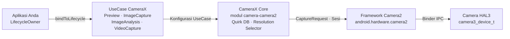

# Bab 24: CameraX

## Ringkasan

Pada saat Anda mencapai bab ini, Anda telah menguasai API Camera2 mentah: membuka instansi `CameraDevice` dengan tangan, membangun objek `CaptureRequest.Builder`, mengelola siklus hidup `CameraCaptureSession`, menangani tiga jenis callback yang berbeda, dan dengan hati-hati melepaskan setiap sumber daya pada setiap kasus tepi. Anda telah mendapatkan pengalaman yang berharga. Sekarang kita melangkah mundur dan bertanya: bagaimana jika 80% dari kode boilerplate tersebut bisa menghilang?

CameraX adalah pustaka Jetpack dari Google yang membungkus Camera2 dalam API yang sadar-siklus-hidup (lifecycle-aware), deklaratif, dan digerakkan oleh use-case. Ia tidak menggantikan Camera2 — ia adalah Camera2 di balik layar. Apa yang digantikannya adalah ratusan baris kode konfigurasi sesi, penanganan keunikan (quirk) khusus perangkat, dan pembukuan siklus hidup manual. Dalam bab ini Anda akan mempelajari arsitektur CameraX, memahami model `UseCase`, melihat cara menyuntikkan parameter Camera2 mentah *ke dalam* CameraX via `Camera2Interop`, dan mendapatkan tabel keputusan tentang kapan tepatnya harus menggunakan CameraX dan kapan Anda harus turun ke Camera2 mentah.

Untuk mengikuti dan memeriksa setiap kemampuan kamera di perangkat Anda sendiri sebelum memutuskan lapisan mana yang akan dituju, instal **Android Camera Parameters** dari [Google Play](https://play.google.com/store/apps/details?id=com.minininja.cameraparams) atau telusuri sumbernya di [github.com/zoozooll/AndroidCameraParameters](https://github.com/zoozooll/AndroidCameraParameters).

---

## Arsitektur CameraX

CameraX dikirimkan sebagai lima artefak Jetpack: `camera-core`, `camera-camera2`, `camera-lifecycle`, `camera-view`, dan `camera-extensions`. Tulang punggung arsitekturnya adalah model `UseCase` — alih-alih berpikir dalam surface dan sesi, Anda berpikir dalam *apa yang Anda inginkan untuk dilakukan kamera*.

### Model UseCase

Ada empat use case kanonik, dan Anda dapat menghubungkan subset apa pun dari mereka secara bersamaan ke sebuah siklus hidup:

| UseCase          | Tujuan                                                        |
|------------------|----------------------------------------------------------------|
| `Preview`        | Mengalirkan bingkai ke `PreviewView` atau `Surface`. Analog dengan menyiapkan permintaan berulang yang menargetkan `SurfaceTexture`. |
| `ImageAnalysis`  | Mengalirkan bingkai `ImageProxy` ke penganalisis Anda pada thread latar belakang. Menggantikan pembuatan `ImageReader` manual dengan `YUV_420_888` dan menghubungkan listener-nya ke permintaan berulang. |
| `ImageCapture`   | Pengambilan foto satu kali atau burst. Menangani permintaan pengambilan gambar, penghubungan `ImageReader`, rotasi, dan EXIF untuk Anda. |
| `VideoCapture`   | Digabungkan ke dalam CameraX sejak versi 1.1; membungkus pipeline `MediaRecorder` atau `ParcelFileDescriptor` dengan semantik jeda/lanjutkan dan perutean audio yang benar. |

Menghubungkan keempatnya sekaligus adalah hal yang sepenuhnya sah — CameraX secara internal menyelesaikan kombinasi aliran terhadap `SCALER_STREAM_CONFIGURATION_MAP` dan memanggil `isSessionConfigurationSupported` atas nama Anda, kembali ke resolusi yang lebih rendah jika kombinasi tepat Anda tidak didukung. Ini adalah salah satu keuntungan terbesar tunggal: Anda tidak akan pernah lagi menghabiskan tiga jam untuk menemukan bahwa Samsung kelas menengah tahun 2019 dalam matriks pengujian Anda tidak mendukung `4:3 PRIV + 16:9 JPEG_MAX` secara bersamaan. CameraX bekerja begitu saja.

### ProcessCameraProvider dan Kesadaran Siklus Hidup

Titik penghubungnya adalah `ProcessCameraProvider`, sebuah singleton yang dimiliki oleh proses aplikasi Anda. Baris kuncinya adalah:

```kotlin
val cameraProviderFuture = ProcessCameraProvider.getInstance(context)
cameraProviderFuture.addListener({
    val cameraProvider = cameraProviderFuture.get()
    val camera: Camera = cameraProvider.bindToLifecycle(
        lifecycleOwner,
        cameraSelector,
        preview,
        imageCapture,
        imageAnalysis
    )
}, ContextCompat.getMainExecutor(context))
```

Itu saja. Tidak ada callback hell `openCamera`, tidak ada `StateCallback`, tidak ada callback konfigurasi sesi, tidak ada pembongkaran. Saat `lifecycleOwner` (`Fragment` atau `Activity` Anda) mencapai `ON_STOP`, CameraX menutup `CameraDevice`. Pada `ON_DESTROY`, ia membongkar sesi dan melepaskan setiap surface. Kebocoran sumber daya jenis yang Anda buru di Bab 7 sama sekali tidak dapat terjadi — kontrak siklus hidup menegakkannya.

### CameraX Secara Internal Membungkus Camera2

Secara internal, CameraX adalah Camera2. Artefak `camera-camera2` berisi `Camera2Camera`, `Camera2CameraCaptureResult`, dan `Camera2RequestProcessor`, yang semuanya menerjemahkan deklarasi UseCase tingkat tinggi Anda ke dalam panggilan `CameraManager.openCamera`, `createCaptureSession`, dan `setRepeatingRequest` yang persis sama dengan yang Anda tulis dengan tangan selama 23 bab sebelumnya. Solusi khusus vendor dikodekan dalam file XML per perangkat di dalam pustaka — "database keunikan (quirk) CameraX" yang terkenal.

Arsitektur lengkapnya terlihat seperti ini:



Ikuti panah dari kiri ke kanan: aplikasi Anda menyatakan *apa* yang diinginkannya (use case), CameraX memutuskan *bagaimana* mendapatkannya (ukuran surface, konfigurasi sesi, keunikan) dan kemudian mengeluarkan panggilan Camera2 yang identik dengan yang akan Anda tulis. Nilai tambahnya adalah dua kotak di tengah — ratusan ribu baris kode kompatibilitas perangkat buatan Google yang tidak perlu Anda tulis.

---

## Camera2Interop: Menyuntikkan Parameter Camera2 ke Dalam CameraX

CameraX sangat brilian untuk 80% kasus. Namun Anda, pembaca yang budiman, adalah master Camera2. Anda tahu apa arti `CONTROL_AE_MODE_OFF`. Anda tahu perbedaan antara `SENSOR_SENSITIVITY` dan `CONTROL_AE_EXPOSURE_COMPENSATION`. Saat spesifikasi produk mengatakan "biarkan pengguna mengunci ISO ke 400 dan eksposur ke 1/60 detik bahkan saat menggunakan CameraX," Anda tidak menulis ulang seluruh fitur dalam Camera2 mentah. Anda menggunakan `Camera2Interop`.

### Pola Extender

Setiap `UseCase.Builder` memiliki `Camera2Interop.Extender` yang cocok. Panggil *sebelum* `build()` untuk menyuntikkan kunci Camera2 mentah baik di tingkat sesi atau tingkat permintaan:

| Metode                                         | Padanan Camera2                           |
|------------------------------------------------|----------------------------------------------|
| `extender.setCaptureRequestOption(key, value)` | `CaptureRequest.Builder.set(key, value)`     |
| `extender.setSessionOption(key, value)`        | Parameter inisialisasi sesi (jarang digunakan) |

Extender bersifat aditif: CameraX tetap menyetel default-nya sendiri untuk setiap kunci yang tidak Anda ganti. Jika Anda hanya menyetel `SENSOR_SENSITIVITY`, CameraX tetap menangani AF, AWB, rotasi, dan metadata.

### Contoh Dunia Nyata: ISO dan Eksposur Manual di CameraX

Berikut adalah builder `ImageCapture` lengkap yang mengunci kamera ke AE manual dengan ISO tetap 400 dan waktu eksposur 1/60 detik, lalu mengambil foto:

```kotlin
val iso = 400
val exposureTimeNanos = 1_000_000_000L / 60 // 1/60 detik

val imageCapture = ImageCapture.Builder()
    .setTargetResolution(Size(4032, 3024))
    .setCaptureMode(ImageCapture.CAPTURE_MODE_MAXIMIZE_QUALITY)
    .apply {
        val interop = Camera2Interop.Extender(this)
        interop.setCaptureRequestOption(
            CaptureRequest.CONTROL_AE_MODE,
            CaptureRequest.CONTROL_AE_MODE_OFF
        )
        interop.setCaptureRequestOption(
            CaptureRequest.CONTROL_AE_LOCK,
            false
        )
        interop.setCaptureRequestOption(
            CaptureRequest.SENSOR_SENSITIVITY,
            iso
        )
        interop.setCaptureRequestOption(
            CaptureRequest.SENSOR_EXPOSURE_TIME,
            exposureTimeNanos
        )
        interop.setCaptureRequestOption(
            CaptureRequest.CONTROL_MODE,
            CaptureRequest.CONTROL_MODE_OFF
        )
    }
    .build()

cameraProvider.bindToLifecycle(
    viewLifecycleOwner,
    CameraSelector.DEFAULT_BACK_CAMERA,
    preview,
    imageCapture
)

// Kemudian, picu bidikan:
imageCapture.takePicture(
    ContextCompat.getMainExecutor(context),
    object : ImageCapture.OnImageCapturedCallback() {
        override fun onCaptureSuccess(imageProxy: ImageProxy) {
            // imageProxy berisi bingkai yang terekspos secara manual
            imageProxy.close()
        }

        override fun onError(exception: ImageCaptureException) {
            Log.e(TAG, "Pengambilan gagal: ${exception.imageCaptureError}", exception)
        }
    }
)
```

**Peringatan kritis:** menyetel `CONTROL_MODE_OFF` menonaktifkan *semua* 3A. Jika Anda hanya ingin mengunci eksposur tetapi tetap menjalankan AF dan AWB, setel hanya `CONTROL_AE_MODE_OFF` (atau `CONTROL_AE_LOCK = true`) dan biarkan `CONTROL_MODE` pada default-nya (`CONTROL_MODE_AUTO`). CameraX memberikan nilai default untuk setiap kunci yang tidak Anda sentuh.

Dan ya — Anda dapat melakukan hal yang sama dengan `Preview.Builder` dan `ImageAnalysis.Builder` untuk aliran manual berulang. Extender berlaku untuk setiap permintaan berulang atau tunggal yang dikeluarkan selama masa pakai UseCase tersebut.

### Membaca Kembali Hasil Camera2

Berjalan ke arah lain — mengekstrak `TotalCaptureResult` dari callback CameraX — sama mudahnya via `Camera2CameraCaptureResult`:

```kotlin
imageCapture.takePicture(
    executor,
    object : ImageCapture.OnImageCapturedCallback() {
        override fun onCaptureSuccess(imageProxy: ImageProxy) {
            val camera2Result = imageProxy.imageInfo
                .cameraCaptureResult as? Camera2CameraCaptureResult
            val totalResult: TotalCaptureResult? = camera2Result?.captureResult
            val actualIso = totalResult?.get(CaptureResult.SENSOR_SENSITIVITY)
            Log.d(TAG, "ISO aktual pada sensor: $actualIso")
            imageProxy.close()
        }
    }
)
```

Ini memungkinkan Anda memverifikasi bahwa parameter yang Anda suntikkan benar-benar sampai ke sensor. Gunakan **Android Camera Parameters** untuk memeriksa silang `SENSOR_INFO_SENSITIVITY_RANGE` yang diklaim perangkat Anda — jika ISO yang Anda suntikkan berada di luar rentang tersebut, CameraX akan secara diam-diam membatasinya (atau HAL yang melakukannya), dan membaca kembali hasilnya adalah satu-satunya cara untuk mengetahuinya.

---

## Memilih CameraX vs Camera2

Pertanyaan arsitektur tersulit bukanlah "bagaimana cara menggunakan CameraX?" tetapi "apakah saya harus menggunakan CameraX sama sekali?" Berikut adalah kerangka kerja keputusan yang disaring dari pekerjaan produksi nyata.

### Diagram Alur Keputusan

```mermaid
flowchart TD
    A["Mulai"] --> B{Butuh pengambilan RAW,<br/>pemrosesan ulang ZSL,<br/>stream fisik multi-kamera,<br/>kecepatan tinggi >60fps?}
    B -->|Ya| D[Gunakan Camera2 mentah]
    B -->|Tidak| C{Butuh templating CaptureRequest<br/>per-bingkai per kamera fisik,<br/>konfigurasi sesi kustom<br/>(surface input reprocess),<br/>atau sesi offline?}
    C -->|Ya| D
    C -->|Tidak| E{Preview + Foto + Video<br/>+ Analisis yang sederhana,<br/>kompatibilitas perangkat luas?}
    E -->|Ya| F[Gunakan CameraX]
    E -->|Tidak| G{Quirk DB CameraX mencakup<br/>set perangkat Anda?<br/>Verifikasi via Android Camera Parameters}
    G -->|Ya| F
    G -->|No| D
```

### Tabel Keputusan

| Skenario                                                              | CameraX | Camera2 Mentah |
|-----------------------------------------------------------------------|:-------:|:-----------:|
| Pratinjau gaya Instagram + foto satu ketukan + video                   |    ✅    |      ⛔      |
| Kode QR / barcode / deteksi wajah ML Kit tanpa kustomisasi bingkai     |    ✅    |      ⛔      |
| Eksposur manual dengan ISO + rana tetap (Camera2Interop mencakupnya)   |    ✅    |      ⚠️       |
| Mesin status 3A kustom yang mengesampingkan algoritma OEM             |    ⛔    |      ✅      |
| Fotografi profesional `RAW_SENSOR` / `RAW_PRIVATE` / DNG             |    ⛔    |      ✅      |
| Zero Shutter Lag (Bab 23) dengan surface input pemrosesan ulang        |    ⛔    |      ✅      |
| Akses stream fisik multi-kamera logis (Bab 20)                        |    ⛔    |      ✅      |
| Kecepatan tinggi 120/240fps dengan sesi-kecepatan-tinggi-terbatas       |    ⛔    |      ✅      |
| Ekstensi Kamera (Malam / Bokeh / HDR) melalui ekstensi OEM             |    ✅    |      ✅      |
| Kamera belakang otomotif dengan migrasi EVS awal booting               |    ⛔    |      ✅ (NDK)  |
| Kompatibilitas lintas-perangkat adalah persyaratan non-fungsional #1   |    ✅    |      ⚠️       |

Area tengah (⚠️) adalah tempat pertimbangan profesional berperan. Kontrol eksposur manual via `Camera2Interop` bekerja andal pada perangkat `HARDWARE_LEVEL_FULL` tetapi secara diam-diam gagal pada perangkat `LEGACY` karena HAL `LEGACY` mengabaikan `CONTROL_MODE_OFF` sepenuhnya. Jalankan **Android Camera Parameters** pada armada pengujian Anda, periksa `INFO_SUPPORTED_HARDWARE_LEVEL` untuk setiap perangkat, dan jika 20% dari armada Anda adalah `LEGACY`, pilih untuk turun ke Camera2 mentah dengan jalur cadangan atau terima bahwa kontrol manual tidak akan berfungsi pada perangkat tersebut.

### Pengaturan Dasar CameraX Preview + ImageCapture (Lengkap)

Untuk referensi, berikut adalah pengaturan minimal lengkap yang menggantikan ~300 baris kode Camera2 mentah yang Anda tulis di Bab 6–9.

```kotlin
class CameraXFragment : Fragment() {

    private lateinit var viewBinding: FragmentCameraXBinding
    private lateinit var imageCapture: ImageCapture

    override fun onViewCreated(view: View, savedInstanceState: Bundle?) {
        super.onViewCreated(view, savedInstanceState)
        viewBinding = FragmentCameraXBinding.bind(view)

        val cameraProviderFuture = ProcessCameraProvider.getInstance(requireContext())
        cameraProviderFuture.addListener({
            val cameraProvider = cameraProviderFuture.get()
            bindCameraUseCases(cameraProvider)
        }, ContextCompat.getMainExecutor(requireContext()))
    }

    private fun bindCameraUseCases(cameraProvider: ProcessCameraProvider) {
        val preview = Preview.Builder().build().also {
            it.setSurfaceProvider(viewBinding.previewView.surfaceProvider)
        }

        imageCapture = ImageCapture.Builder()
            .setCaptureMode(ImageCapture.CAPTURE_MODE_MINIMIZE_LATENCY)
            .setTargetRotation(viewBinding.previewView.display.rotation)
            .build()

        val cameraSelector = CameraSelector.Builder()
            .requireLensFacing(CameraSelector.LENS_FACING_BACK)
            .build()

        cameraProvider.unbindAll()
        try {
            cameraProvider.bindToLifecycle(
                viewLifecycleOwner,
                cameraSelector,
                preview,
                imageCapture
            )
        } catch (exc: Exception) {
            Log.e(TAG, "Binding UseCase gagal", exc)
        }
    }

    private fun takePhoto() {
        val photoFile = File(
            outputDirectory,
            "PHOTO_${System.currentTimeMillis()}.jpg"
        )
        val outputOptions = ImageCapture.OutputFileOptions
            .Builder(photoFile)
            .build()

        imageCapture.takePicture(
            outputOptions,
            ContextCompat.getMainExecutor(requireContext()),
            object : ImageCapture.OnImageSavedCallback {
                override fun onImageSaved(output: ImageCapture.OutputFileResults) {
                    val savedUri = Uri.fromFile(photoFile)
                    Toast.makeText(requireContext(),
                        "Tersimpan: $savedUri", Toast.LENGTH_SHORT).show()
                }
                override fun onError(exc: ImageCaptureException) {
                    Log.e(TAG, "Pengambilan foto gagal: ${exc.message}", exc)
                }
            }
        )
    }

    companion object {
        private const val TAG = "CameraXFragment"
    }
}
```

Itulah seluruh pipeline pratinjau + foto. Perhatikan ketiadaan total `HandlerThread`, `CameraDevice.StateCallback`, `CameraCaptureSession.StateCallback`, `ImageReader.OnImageAvailableListener`, atau panggilan `close()` manual. CameraX menangani semuanya.

---

## Ringkasan

CameraX adalah Camera2 dengan fasad deklaratif dan sadar-siklus-hidup yang didukung oleh database keunikan lintas-perangkat milik Google. Arsitekturnya menumpuk aplikasi Anda → UseCase → CameraX Core → Camera2 → HAL, dan panggilan `ProcessCameraProvider.bindToLifecycle()` menggantikan ratusan baris pengaturan manual. Untuk 20% parameter yang tidak diekspos CameraX di tingkat UseCase, `Camera2Interop.Extender` menyuntikkan kunci `CaptureRequest` mentah dan membaca kembali nilai `TotalCaptureResult` mentah. Keputusan kapan menggunakannya sangat mudah: CameraX adalah default kecuali fitur Anda secara eksplisit memerlukan RAW, ZSL, stream multi-kamera fisik, video kecepatan tinggi, atau topologi sesi kustom yang tidak dapat diekspresikan oleh resolver CameraX.

## Apa Selanjutnya

CameraX masih merupakan kode Java/Kotlin Dalvik/ART yang berada di atas batas Binder. Bagaimana jika overhead tersebut masih terlalu banyak untuk anggaran bingkai 16ms mesin AR Anda? Dalam Bab 25 kita menyeberangi garis JNI sepenuhnya dan membuka kamera secara langsung dari C++ menggunakan tumpukan kamera native NDK, menghubungkan bingkai sebagai tekstur Vulkan dengan tanpa salinan.
