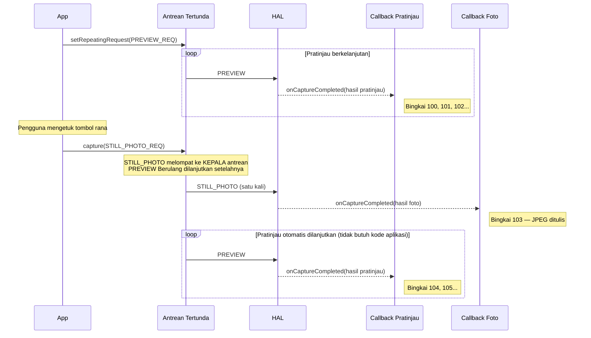
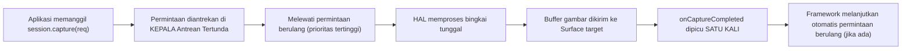
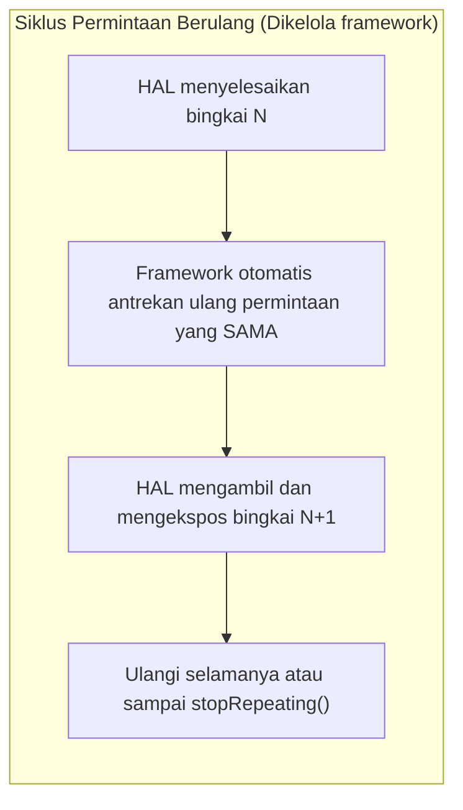
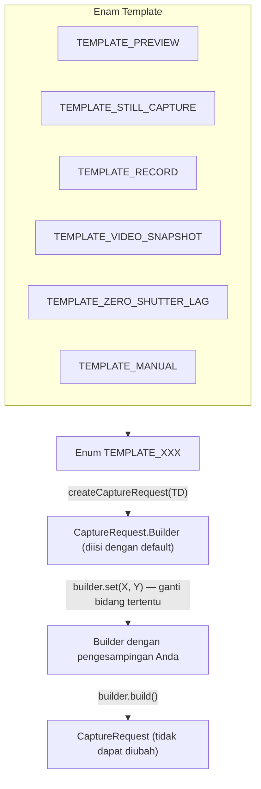

## 11.1 Tiga Cara Memberi Makan Pipeline

Dalam [Bab 10](the-camera2-pipeline.md) Anda telah melihat bagaimana permintaan melakukan perjalanan melalui pipeline Camera2: dari Antrean Tertunda ke Antrean In-Flight ke HAL hingga ke callback dan surface output Anda. Namun *bagaimana Anda mengirimkan* permintaan tersebut sangatlah penting. Camera2 memberi Anda tiga mekanisme pengiriman, masing-masing dengan perilaku yang berbeda secara fundamental:

1. **Satu kali (One-shot)** (`capture()`) — mengeksekusi satu permintaan sebanyak satu kali
2. **Burst** (`captureBurst()`) — mengeksekusi daftar permintaan secara berurutan, berturut-turut
3. **Berulang (Repeating)** (`setRepeatingRequest()`) — mengeksekusi permintaan yang sama secara terus-menerus selamanya (atau sampai dihentikan)

Di atas ketiga mode pengiriman tersebut, framework menyediakan enam **template pengambilan gambar** yang mengisi `CaptureRequest.Builder` dengan default yang masuk akal untuk kasus penggunaan umum (pratinjau, pengambilan foto diam, perekaman video, zero-shutter-lag, kontrol manual, dll.).

Pada akhir bab ini, Anda akan tahu persis kapan harus menggunakan setiap jenis pengambilan gambar dan template — termasuk mengapa pratinjau selalu menggunakan permintaan berulang, mengapa burst adalah satu-satunya cara untuk melakukan bracketing eksposur, dan mengapa foto diam menggunakan satu kali pengambilan bahkan saat pratinjau sedang berjalan.

Aplikasi Android Camera Parameters ([GitHub](https://github.com/zoozooll/AndroidCameraParameters), [Play Store](https://play.google.com/store/apps/details?id=com.minininja.cameraparams)) mendemonstrasikan ketiga jenis pengambilan gambar di tab **Capture Demo**-nya. Beralihlah di antara mode "Preview (Repeating)," "Single Photo (One-Shot)," dan "Burst (3 Frames)" untuk melihat perilaku callback dan perbedaan waktu secara langsung di perangkat Anda.

## 11.2 Satu Kali (One-Shot): capture()

Mode pengiriman yang paling sederhana adalah **pengambilan gambar satu kali** melalui `CameraCaptureSession.capture()`. Ia melakukan persis seperti namanya: mengirimkan satu `CaptureRequest` ke pipeline, mengeksekusinya tepat satu kali, dan selesai.

```kotlin
// Satu kali: ambil satu bingkai foto diam ke ImageReader JPEG
fun captureStillPhoto() {
    val builder = cameraDevice.createCaptureRequest(CameraDevice.TEMPLATE_STILL_CAPTURE)
    builder.addTarget(jpegReader.surface)
    builder.set(CaptureRequest.JPEG_QUALITY, 100)
    builder.set(CaptureRequest.CONTROL_AF_MODE, CaptureRequest.CONTROL_AF_MODE_CONTINUOUS_PICTURE)
    builder.set(CaptureRequest.CONTROL_AE_MODE, CaptureRequest.CONTROL_AE_MODE_ON)

    val request = builder.build()

    captureSession.capture(request, object : CameraCaptureSession.CaptureCallback() {
        override fun onCaptureCompleted(
            session: CameraCaptureSession,
            request: CaptureRequest,
            result: TotalCaptureResult
        ) {
            super.onCaptureCompleted(session, request, result)
            Log.d("Capture", "Foto satu kali selesai. Bingkai #${result.frameNumber}")
        }
    }, backgroundHandler)
}
```

### Kapan Menggunakan Satu Kali (One-Shot)

| Kasus Penggunaan | Mengapa Satu Kali? |
|----------|--------------|
| Foto diam tunggal | Mengeksekusi tepat satu kali per klik rana |
| Pemicu AF/AE tunggal | Menembakkan `CONTROL_AF_TRIGGER_START` untuk satu kali ketukan-untuk-fokus |
| Foto instan (snapshot) selama video | Mengambil satu bingkai resolusi tinggi saat permintaan video berulang sedang aktif |
| Mengambil bingkai RAW tunggal | Pengambilan ganda RAW + JPEG untuk satu foto |

### Bagaimana Satu Kali Berinteraksi dengan Pratinjau Berulang

Pola desain yang kritis dalam Camera2 adalah: **pratinjau berjalan sebagai permintaan berulang, dan foto diam dimasukkan sebagai permintaan satu kali**. Permintaan satu kali tersebut melompat ke depan permintaan berulang di Antrean Tertunda (seperti yang kita bahas dalam model antrean Bab 10), sehingga ia segera dieksekusi. Setelah permintaan satu kali selesai, framework secara otomatis melanjutkan permintaan pratinjau berulang — Anda tidak perlu mengirimkannya kembali.



:::tip
Perilaku lanjut otomatis ini sudah tertanam di dalam framework Camera2. Anda tidak perlu secara manual "memulai kembali pratinjau" setelah pengambilan foto satu kali — framework mengantrekan kembali permintaan berulang untuk Anda.
:::

### Alur Eksekusi Satu Kali



## 11.3 Burst: captureBurst()

Jika `capture()` mengirimkan satu permintaan, `captureBurst()` mengirimkan sebuah **`List<CaptureRequest>`** dan menjamin bahwa semua N bingkai dalam daftar tersebut dieksekusi **secara berurutan tanpa celah, tanpa ada bingkai yang menyelingi dari sumber lain (termasuk permintaan berulang)**.

Jaminan atomis dan tanpa celah inilah yang membuat pengambilan gambar burst sangat penting untuk:

- **Bracketing eksposur** — Mengambil 3-5 bingkai pada ±1EV, ±2EV, lalu menggabungkannya menjadi HDR
- **Bracketing fokus** — Menelusuri jarak fokus, lalu menumpuknya untuk efek depth-of-field
- **Pengambilan gambar aksi / gerakan** — Memotret 10-30 bingkai dari subjek yang bergerak cepat, lalu memilih yang paling tajam
- **Video gerak lambat (kecepatan tinggi)** — `createHighSpeedRequestList()` + burst kecepatan tinggi yang terbatas
- **Sampling pemusatan 3A** — Menembakkan pemicu AF/AE, lalu melakukan burst hingga memusat

```kotlin
// Burst: bracketing eksposur 3-bingkai (-2EV, 0EV, +2EV)
fun captureExposureBracket() {
    val baseIso = 100
    val baseExposure = 10_000_000L  // 10ms = garis dasar "0EV"

    val burstList: MutableList<CaptureRequest> = mutableListOf()

    // Bingkai 0: -2EV (eksposur 4x lebih pendek = lebih gelap)
    burstList += cameraDevice.createCaptureRequest(CameraDevice.TEMPLATE_STILL_CAPTURE).apply {
        addTarget(jpegReader.surface)
        set(CaptureRequest.SENSOR_SENSITIVITY, baseIso)
        set(CaptureRequest.SENSOR_EXPOSURE_TIME, baseExposure / 4)
        set(CaptureRequest.CONTROL_AE_MODE, CaptureRequest.CONTROL_AE_MODE_OFF)
    }.build()

    // Bingkai 1: 0EV (eksposur benar)
    burstList += cameraDevice.createCaptureRequest(CameraDevice.TEMPLATE_STILL_CAPTURE).apply {
        addTarget(jpegReader.surface)
        set(CaptureRequest.SENSOR_SENSITIVITY, baseIso)
        set(CaptureRequest.SENSOR_EXPOSURE_TIME, baseExposure)
        set(CaptureRequest.CONTROL_AE_MODE, CaptureRequest.CONTROL_AE_MODE_OFF)
    }.build()

    // Bingkai 2: +2EV (eksposur 4x lebih lama = lebih terang)
    burstList += cameraDevice.createCaptureRequest(CameraDevice.TEMPLATE_STILL_CAPTURE).apply {
        addTarget(jpegReader.surface)
        set(CaptureRequest.SENSOR_SENSITIVITY, baseIso)
        set(CaptureRequest.SENSOR_EXPOSURE_TIME, baseExposure * 4)
        set(CaptureRequest.CONTROL_AE_MODE, CaptureRequest.CONTROL_AE_MODE_OFF)
    }.build()

    captureSession.captureBurst(burstList, object : CameraCaptureSession.CaptureCallback() {
        private var completedCount = 0

        override fun onCaptureCompleted(
            session: CameraCaptureSession,
            request: CaptureRequest,
            result: TotalCaptureResult
        ) {
            super.onCaptureCompleted(session, request, result)
            completedCount++
            Log.d("Burst", "Bingkai burst $completedCount/${burstList.size} selesai. Bingkai #${result.frameNumber}")

            if (completedCount == burstList.size) {
                Log.d("Burst", "Semua $burstList.size bingkai bracketing telah diambil!")
                // TODO: Gabungkan HDR, tumpuk fokus, atau biarkan pengguna memilih bingkai terbaik
            }
        }
    }, backgroundHandler)
}
```

### Jaminan Berurutan Beraksi

Properti utama dari burst adalah bahwa **seluruh daftar diantrekan secara atomik** — bahkan jika `setRepeatingRequest()` aktif, ke-N bingkai burst semuanya akan berjalan berturut-turut sebelum permintaan berulang dilanjutkan. Permintaan berulang tidak disisipkan di antara bingkai burst.

```mermaid
flowchart TB
    subgraph QueueBefore ["Sebelum Kirim Burst"]
        direction LR
        R1["PRATINJAU (berulang)"] --> R2["PRATINJAU (berulang)"] --> R3["PRATINJAU (berulang)"]
    end

    subgraph Arrow ["aplikasi memanggil captureBurst([B1,B2,B3])"]
        style Arrow fill:#fff3e0
    end

    subgraph QueueAfter ["Setelah Kirim Burst (antrean atomik)"]
        direction LR
        B1["BINGKAI BURST 1"] --> B2["BINGKAI BURST 2"] --> B3["BINGKAI BURST 3"] --> R4["PRATINJAU (berulang) dilanjutkan"] --> R5["PRATINJAU"]
    end

    QueueBefore --> Arrow --> QueueAfter

    Note over B1,B3: Tidak ada bingkai pratinjau yang menyelinap di antaranya!
```

### Batas Ukuran Burst

Ukuran burst maksimum yang dapat Anda kirimkan dalam satu panggilan `captureBurst()` ditentukan oleh:
- `CameraCharacteristics.REQUEST_MAX_NUM_OUTPUT_RAW` — untuk output RAW
- `CameraCharacteristics.REQUEST_MAX_NUM_OUTPUT_PROC` — untuk output yang diproses (YUV/JPEG)
- Bandwidth perangkat keras praktis (burst 4K akan lebih pendek daripada burst 1080p)

Untuk perangkat FULL tipikal, burst JPEG yang diproses sebanyak 10-50 bingkai masih oke. Burst RAW mungkin terbatas pada 5-10 bingkai tergantung pada sensor dan memori.

### Burst Kecepatan Tinggi untuk Gerak Lambat

Untuk video gerak lambat, Camera2 menyediakan `CameraDevice.createHighSpeedRequestList()` yang mengubah satu `CaptureRequest` normal menjadi daftar permintaan burst yang cocok untuk video pengambilan gambar berkecepatan tinggi dan terbatas (misalnya, 120fps atau 240fps). Ini dipasangkan dengan `CameraCaptureSession.captureBurst()` dan membutuhkan kemampuan `CONSTRAINED_HIGH_SPEED_VIDEO`:

```kotlin
// Burst: Gerak lambat kecepatan tinggi (120fps)
fun captureHighSpeedSlowMo() {
    val capabilities = characteristics.get(CameraCharacteristics.REQUEST_AVAILABLE_CAPABILITIES)
    val supportsHighSpeed = capabilities?.contains(
        CameraCharacteristics.REQUEST_AVAILABLE_CAPABILITIES_CONSTRAINED_HIGH_SPEED_VIDEO
    ) ?: false

    if (!supportsHighSpeed) {
        Log.w("HighSpeed", "Perangkat tidak mendukung video kecepatan tinggi terbatas")
        return
    }

    // Bangun satu permintaan dasar (menargetkan Surface MediaRecorder)
    val baseBuilder = cameraDevice.createCaptureRequest(CameraDevice.TEMPLATE_RECORD)
    baseBuilder.addTarget(mediaRecorderSurface)
    val baseRequest = baseBuilder.build()

    // Perluas ke dalam daftar burst kecepatan tinggi — framework mengoptimalkan untuk 120fps
    val highSpeedBurst = cameraDevice.createHighSpeedRequestList(listOf(baseRequest))

    // Kirimkan daftar burst yang dioptimalkan melalui captureBurst
    captureSession.captureBurst(highSpeedBurst, highSpeedCallback, backgroundHandler)
}
```

## 11.4 Berulang (Repeating): setRepeatingRequest()

Andalan dari Camera2 adalah **permintaan berulang**, yang dikirimkan melalui `CameraCaptureSession.setRepeatingRequest()`. Alih-alih dieksekusi sekali, framework akan mengantrekan kembali *permintaan yang sama* setelah setiap bingkai, selamanya — menghasilkan aliran bingkai terus-menerus pada frame rate asli perangkat keras.

```kotlin
// Berulang: Mulai pratinjau kamera (aliran kontinu 30fps)
fun startPreview() {
    val builder = cameraDevice.createCaptureRequest(CameraDevice.TEMPLATE_PREVIEW)
    builder.addTarget(previewSurface)
    builder.set(CaptureRequest.CONTROL_AF_MODE, CaptureRequest.CONTROL_AF_MODE_CONTINUOUS_PICTURE)
    builder.set(CaptureRequest.CONTROL_AE_MODE, CaptureRequest.CONTROL_AE_MODE_ON)
    builder.set(CaptureRequest.CONTROL_AWB_MODE, CaptureRequest.CONTROL_AWB_MODE_AUTO)

    val repeatingRequest = builder.build()

    captureSession.setRepeatingRequest(
        repeatingRequest,
        object : CameraCaptureSession.CaptureCallback() {
            private var frameCount = 0
            private var lastFpsLogMs = 0L

            override fun onCaptureCompleted(
                session: CameraCaptureSession,
                request: CaptureRequest,
                result: TotalCaptureResult
            ) {
                super.onCaptureCompleted(session, request, result)
                frameCount++
                val now = System.currentTimeMillis()
                if (now - lastFpsLogMs > 1000) {
                    Log.d("Preview", "FPS Pratinjau: $frameCount")
                    frameCount = 0
                    lastFpsLogMs = now
                }
            }
        },
        backgroundHandler
    )
}
```

### Mengapa Pratinjau *Harus* Menggunakan Permintaan Berulang

Jika Anda mencoba mengimplementasikan pratinjau 30fps menggunakan `capture()` yang dipanggil 30 kali per detik dari timer, Anda akan:
1. Membuang CPU untuk mengirimkan ulang permintaan yang identik setiap 33ms
2. Mengalami penyimpangan (drift) jika timer Anda terlambat
3. Mengalami celah bingkai jika callback satu kali memblokir
4. Berbenturan dengan manajemen antrean framework

Permintaan berulang ditangani sepenuhnya di dalam framework/HAL. Setelah setiap bingkai selesai, HAL secara otomatis menjadwalkan eksposur berikutnya — tanpa melibatkan thread aplikasi. Ini menghasilkan pratinjau yang mulus dan tanpa celah dengan nol overhead CPU aplikasi.



### Menghentikan Permintaan Berulang

Untuk menghentikan aliran berulang, panggil `stopRepeating()`. Ini akan menghapus permintaan berulang dari antrean tetapi tidak membatalkan bingkai yang sudah dalam proses (in-flight). Panggil `abortCaptures()` untuk membatalkan semuanya secara paksa (dan memicu `onCaptureFailed` dengan `REASON_FLUSHED` untuk bingkai-bingkai yang sedang diproses).

```kotlin
// Menghentikan pratinjau sementara
fun pausePreview() {
    captureSession.stopRepeating()
    Log.d("Preview", "Permintaan berulang dihentikan. Bingkai yang sedang diproses tetap akan selesai.")
}

// Berhenti darurat — batalkan semuanya sekarang juga
fun emergencyStopAllCaptures() {
    captureSession.stopRepeating()
    captureSession.abortCaptures()
    // Semua bingkai yang sedang diproses akan gagal dengan REASON_FLUSHED
}
```

### Permintaan Berulang Juga untuk Perekaman Video

Selain pratinjau, permintaan berulang digunakan untuk **perekaman video** (menargetkan `Surface` `MediaRecorder` atau `MediaCodec`) dan **analisis gambar kontinu** (menargetkan `ImageReader` YUV resolusi rendah untuk deteksi wajah, inferensi ML, dll.).

Polanya selalu sama: setel sekali, biarkan mengalir, perbarui parameter permintaan saat Anda ingin mengubah pengaturan (misalnya, mengubah zoom digital di tengah aliran dengan memperbarui wilayah pemotongan dalam permintaan berulang baru).

```kotlin
// Berulang: Perbarui tingkat zoom secara langsung selama pratinjau/video
fun updateDigitalZoom(cropRegion: Rect) {
    val builder = cameraDevice.createCaptureRequest(CameraDevice.TEMPLATE_PREVIEW)
    builder.addTarget(previewSurface)
    builder.addTarget(mediaRecorderSurface)
    builder.set(CaptureRequest.SCALER_CROP_REGION, cropRegion)
    builder.set(CaptureRequest.CONTROL_AF_MODE, CaptureRequest.CONTROL_AF_MODE_CONTINUOUS_PICTURE)

    // Ganti permintaan berulang lama dengan yang baru (target sama, crop baru)
    captureSession.setRepeatingRequest(builder.build(), currentCallback, backgroundHandler)
    Log.d("Zoom", "Permintaan berulang diperbarui dengan crop ${cropRegion.width()}x${cropRegion.height()}")
}
```

## 11.5 Template Pengambilan Gambar

Setiap `CaptureRequest.Builder` dimulai dari sebuah **template**: Anda memanggil `cameraDevice.createCaptureRequest(TEMPLATE_XXX)` dan framework akan mengisi builder tersebut dengan default yang dioptimalkan perangkat keras untuk kasus penggunaan tersebut. Anda kemudian hanya perlu mengesampingkan pengaturan spesifik yang Anda butuhkan.

Template ada karena pipeline kamera ponsel memiliki puluhan kenop (kekuatan pengurangan noise, peningkatan tepi, kurva nada, mode anti-banding, rentang frame rate, ...). Template menetapkan garis dasar yang masuk akal sehingga Anda tidak perlu mengonfigurasi setiap pengaturan dari nol.



### Keenam Template, Apa yang Dikonfigurasinya, dan Kapan Menggunakannya

| Template | Kasus Penggunaan | Pengaturan Utama yang Dikonfigurasi |
|----------|----------|---------------------------|
| `TEMPLATE_PREVIEW` | Jendela bidik / pratinjau langsung | Prioritas latensi rendah, 3A (AF/AE/AWB) dalam otomatis kontinu, NR/penajaman moderat, frame rate tinggi (30fps). Mengorbankan sedikit kualitas demi kelancaran. |
| `TEMPLATE_STILL_CAPTURE` | Foto satu kali | Prioritas kualitas maksimal, AF dalam mode gambar, NR/penajaman penuh, pengkodean JPEG kualitas tinggi, mungkin menurunkan frame rate untuk meningkatkan kualitas bingkai tersebut. |
| `TEMPLATE_RECORD` | Perekaman video | Frame rate stabil (cocok dengan output MediaRecorder), AF kontinu, stempel waktu sinkronisasi audio-video, anti-banding diaktifkan, NR sedang — disetel untuk gerakan + kompresi. |
| `TEMPLATE_VIDEO_SNAPSHOT` | Foto resolusi tinggi *selama* video | Seperti STILL_CAPTURE tetapi menjaga pengaturan bingkai video — mengambil foto resolusi tinggi tanpa menghentikan aliran perekaman video. |
| `TEMPLATE_ZERO_SHUTTER_LAG` | Pengambilan foto ZSL (Bab 14) | Membangun buffer melingkar bingkai terbaru. Saat rana ditekan, bingkai dari *masa lalu* dikembalikan untuk nol blackout. Butuh kemampuan burst dan pemrosesan ulang pribadi. |
| `TEMPLATE_MANUAL` | Kontrol manual / pro | Semua mode 3A disetel ke OFF secara default sehingga Anda dapat mengatur eksposur sensor, ISO, fokus lensa, dan gain koreksi warna secara manual tanpa gangguan. Garis dasar untuk UI kamera pro. |

```kotlin
// Contoh template — lihat apa yang terjadi saat Anda memulai dengan masing-masing

// TEMPLATE_PREVIEW — halus, latensi rendah
val previewBuilder = cameraDevice.createCaptureRequest(CameraDevice.TEMPLATE_PREVIEW)
val previewRequest = previewBuilder.build()
Log.d("Template", "PREVIEW AF_MODE = ${previewRequest.get(CaptureRequest.CONTROL_AF_MODE)}")
// ^ Biasanya CONTROL_AF_MODE_CONTINUOUS_PICTURE (selalu memfokuskan ulang)

// TEMPLATE_STILL_CAPTURE — kualitas tertinggi per bingkai
val stillBuilder = cameraDevice.createCaptureRequest(CameraDevice.TEMPLATE_STILL_CAPTURE)
val stillRequest = stillBuilder.build()
Log.d("Template", "STILL_CAPTURE JPEG_QUALITY = ${stillRequest.get(CaptureRequest.JPEG_QUALITY)}")
// ^ Biasanya 100 (pengkodean kualitas maksimal)

// TEMPLATE_MANUAL — semua kontrol otomatis dinonaktifkan
val manualBuilder = cameraDevice.createCaptureRequest(CameraDevice.TEMPLATE_MANUAL)
val manualRequest = manualBuilder.build()
Log.d("Template", "MANUAL AE_MODE = ${manualRequest.get(CaptureRequest.CONTROL_AE_MODE)}")
Log.d("Template", "MANUAL AF_MODE = ${manualRequest.get(CaptureRequest.CONTROL_AF_MODE)}")
Log.d("Template", "MANUAL AWB_MODE = ${manualRequest.get(CaptureRequest.CONTROL_AWB_MODE)}")
// ^ Biasanya AE_MODE_OFF, AF_MODE_OFF, AWB_MODE_OFF — manual sejak awal
```

:::tip
Selalu mulai dengan template dan ganti bidang tertentu. Memulai dari `TEMPLATE_PREVIEW` dan kemudian mengganti 2-3 pengaturan (misalnya, wilayah pemotongan untuk zoom, bias target AE untuk kompensasi eksposur) jauh lebih kecil risikonya terhadap kesalahan daripada membuat permintaan dari template kosong (yang bahkan tidak mungkin dilakukan — setiap `createCaptureRequest` membutuhkan template).
:::

## 11.6 Membandingkan Ketiga Jenis Pengambilan Gambar

| Dimensi | Satu Kali `capture()` | Burst `captureBurst()` | Berulang `setRepeatingRequest()` |
|-----------|---------------------|----------------------|---------------------------------|
| **Eksekusi** | Satu permintaan berjalan sekali | Daftar N permintaan berjalan berurutan | Permintaan yang sama berjalan setiap bingkai (otomatis diantrekan ulang) |
| **Prioritas** | Tertinggi — melompat ke KEPALA Antrean Tertunda | Tinggi — semua N bingkai dimasukkan secara atomik di KEPALA | Terendah — satu kali/burst memotong di depan dan berulang dilanjutkan setelahnya |
| **Interupsi** | Menyela permintaan berulang; berulang dilanjutkan setelahnya | Menyela permintaan berulang; seluruh burst selesai sebelum berulang dilanjutkan | Disela oleh setiap satu kali pengambilan atau burst; dilanjutkan otomatis setelahnya |
| **Perilaku Antrean** | Satu permintaan diantrekan | N permintaan diantrekan berurutan (tanpa celah) | Satu permintaan konseptual diantrekan kembali setiap siklus |
| **Kegunaan Tipikal** | Foto tunggal, pemicu AF tunggal, foto lampu kilat | Bracketing eksposur, penumpukan fokus, aksi burst, gerak lambat, HDR | Pratinjau, perekaman video, analisis ML kontinu, deteksi wajah langsung |
| **Callback Hasil** | `onCaptureCompleted` dipicu tepat sekali | `onCaptureCompleted` dipicu N kali (sekali per bingkai burst) | `onCaptureCompleted` dipicu terus-menerus untuk setiap bingkai (30-60x/detik) |

```mermaid
quadrantChart
    title Pola Penggunaan Jenis Pengambilan Gambar
    x-axis ["Jumlah Bingkai Rendah", "Jumlah Bingkai Tinggi"]
    y-axis ["Konfigurasi Tunggal", "Konfigurasi Per-Bingkai Bervariasi"]
    quadrant-1 ["Burst: Bracketing Eksposur / Fokus"]
    quadrant-2 ["Burst: Gerak Lambat Kecepatan Tinggi"]
    quadrant-3 ["Satu Kali: Foto Diam"]
    quadrant-4 ["Berulang: Pratinjau + Video"]
    "Pengambilan JPEG tunggal": [0.15, 0.2]
    "Pemicu ketuk-untuk-fokus": [0.1, 0.15]
    "Bracket HDR 3-bingkai": [0.4, 0.75]
    "Tumpukan fokus 7-bingkai": [0.45, 0.8]
    "Gerak lambat 120fps 2dtk": [0.85, 0.25]
    "Pratinjau CameraFinder 30fps": [0.9, 0.1]
    "Perekaman video 4K": [0.88, 0.18]
```

## 11.7 Melihat Jenis Pengambilan Gambar di Aplikasi Android Camera Parameters

Buka aplikasi Android Camera Parameters ([GitHub](https://github.com/zoozooll/AndroidCameraParameters), [Play Store](https://play.google.com/store/apps/details?id=com.minininja.cameraparams)) dan buka tab **Capture Demo**. Aplikasi ini mengekspos ketiga jenis pengambilan gambar secara berdampingan:

- Ketuk **Start Preview** untuk memanggil `setRepeatingRequest(TEMPLATE_PREVIEW)` dan lihat log `CaptureCallback` langsung (bingkai 1, 2, 3, ... bergulir setiap ~33ms)
- Ketuk **Take Photo** untuk memasukkan satu kali pengambilan `capture(TEMPLATE_STILL_CAPTURE)` saat pratinjau sedang berjalan. Anda akan melihat hitungan callback berhenti sejenak untuk bingkai kualitas tinggi, lalu berlanjut mulus saat permintaan berulang dilanjutkan otomatis.
- Ketuk **Burst 5 Frames** untuk memanggil `captureBurst(List<CaptureRequest(5)>)`. Amati bahwa tepat 5 bingkai selesai berturut-turut sebelum guliran pratinjau berlanjut — membuktikan jaminan urutan tanpa celah.

Anda juga dapat memeriksa `REQUEST_MAX_NUM_OUTPUT_RAW` dan `REQUEST_MAX_NUM_OUTPUT_PROC` di tab **Raw JSON** untuk melihat batas ukuran burst perangkat Anda.

## 11.8 Ringkasan

| Konsep | Poin Penting |
|---------|-------------|
| **Satu kali `capture()`** | Permintaan tunggal, berjalan sekali, prioritas tertinggi. Untuk foto diam, pemicu AF. Melanjutkan permintaan berulang secara otomatis setelahnya. |
| **Burst `captureBurst()`** | Daftar `List<CaptureRequest>` berjalan berurutan, tanpa sela. Untuk bracketing, gerakan, gerak lambat. Seluruh daftar melompat ke antrean secara atomik. |
| **Berulang `setRepeatingRequest()`** | Satu permintaan dialirkan terus-menerus. Framework otomatis antrekan ulang. Untuk pratinjau, video, analisis. Prioritas terendah. |
| **Template** | Enam garis dasar mengisi Builder dengan default. Mulai dengan TEMPLATE_PREVIEW/STILL_CAPTURE/RECORD/ZSL/MANUAL dan ganti hanya yang Anda butuhkan. |
| **Aturan Interupsi** | Satu kali dan burst *selalu* mendahului permintaan berulang. Permintaan berulang dilanjutkan otomatis setelahnya. Bingkai burst tidak pernah terpisah. |

## Apa Selanjutnya

Dalam [Bab 12: Pembahasan Mendalam CameraCharacteristics](cameracharacteristics-deep-dive.md), kita akan menggali objek metadata statis yang menjelaskan *apa yang bahkan dapat dilakukan kamera Anda* sebelum Anda membukanya. Kita akan merinci tingkat perangkat keras (LEGACY → LIMITED → FULL → LEVEL_3 → EXTERNAL), sistem flag kemampuan (MANUAL_SENSOR, RAW, DEPTH_OUTPUT, dll.), dan cara menanyakan semuanya saat runtime untuk menulis aplikasi yang berfungsi di 10.000+ model perangkat Android.
