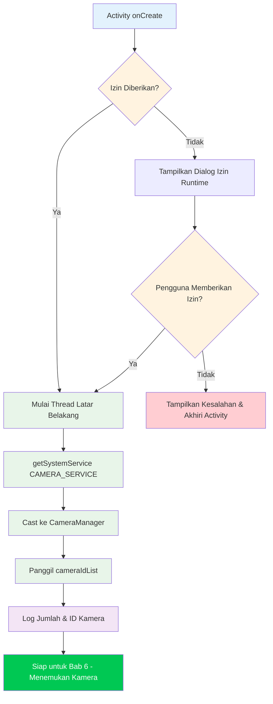

Selamat datang di bagian praktis dari seri tutorial Camera2. Di bab-bab sebelumnya, Anda telah mempelajari tentang perangkat keras kamera smartphone dan dasar-dasar teoretis dari API Camera2. Sekarang saatnya menyingsingkan lengan baju dan menulis kode yang sebenarnya. Pada akhir bab ini, Anda akan memiliki proyek Android yang berfungsi yang berhasil menginisialisasi API Camera2 dan mengakses layanan CameraManager — langkah pertama yang kritis sebelum Anda dapat menghitung kamera, membuka perangkat, atau menampilkan pratinjau.

Jika Anda ingin melihat contoh produksi dari semua yang akan kita bangun dalam seri ini, lihat aplikasi **Android Camera Parameters** di [GitHub](https://github.com/zoozooll/AndroidCameraParameters) dan [Google Play](https://play.google.com/store/apps/details?id=com.minininja.cameraparams). Aplikasi ini mendemonstrasikan penggunaan Camera2 tingkat lanjut termasuk enumerasi CameraCharacteristics lengkap, kontrol pengambilan gambar manual, dan dukungan multi-kamera.

## Mengapa Memulai dengan Pengaturan Proyek?

Sebelum Anda dapat menulis satu baris kode Camera2 pun, aplikasi Anda harus dikonfigurasi dengan benar. Camera2 adalah API tingkat rendah yang sensitif terhadap performa, dan mengabaikan pengaturan awal akan menyebabkan crash yang misterius, ANR (Application Not Responding), atau bingkai gambar yang tidak pernah sampai. Tiga pilar dari pengaturan proyek Camera2 yang benar adalah:

1. **Izin (Permissions)** — Kerangka kerja Android membatasi akses kamera baik pada saat instalasi (manifest) maupun saat runtime (persetujuan pengguna).
2. **Arsitektur Threading** — Callback Camera2 tidak boleh memblokir thread utama; kita memerlukan thread latar belakang khusus.
3. **Konfigurasi View** — Jika Anda berencana menggunakan TextureView untuk pratinjau (pendekatan yang direkomendasikan), akselerasi perangkat keras harus diaktifkan.

Mari kita tangani masing-masing secara sistematis.

## Langkah 1: Membuat Proyek Android Studio Baru

Luncurkan Android Studio dan buat proyek baru. Untuk seri tutorial ini, kami merekomendasikan:

- **Template**: Empty Activity (titik awal yang paling sederhana)
- **Bahasa**: Kotlin (standar modern untuk pengembangan Android; semua contoh dalam seri ini menggunakan Kotlin)
- **SDK Minimum**: API 21 (Lollipop) — ini adalah level SDK pertama yang mendukung Camera2 secara asli. Jika Anda perlu mendukung kamera USB eksternal melalui OTG, targetkan API 23 atau lebih tinggi. Jika Anda memerlukan dukungan penyimpanan terbatas (scoped storage) untuk penyimpanan foto (Bab 9), API 29+ relevan, tetapi kita akan menangani kompatibilitas mundur di sana.
- **Bahasa konfigurasi build**: Kotlin DSL atau Groovy — keduanya bisa; contoh-contoh kita akan bersifat agnostik terhadap sistem build.

Setelah proyek dibuat, buka file `build.gradle` (atau `build.gradle.kts`) tingkat modul Anda. Template Empty Activity default sudah menyertakan sebagian besar dependensi yang Anda butuhkan, tetapi pastikan Anda memiliki setidaknya:

```kotlin
dependencies {
    implementation("androidx.core:core-ktx:1.12.0")
    implementation("androidx.appcompat:appcompat:1.6.1")
    implementation("com.google.android.material:material:1.11.0")
    implementation("androidx.constraintlayout:constraintlayout:2.1.4")
    // Camera2 adalah bagian dari kerangka kerja Android, jadi TIDAK diperlukan dependensi ekstra
    // untuk API dasar. androidx.camera.camera2 hanya untuk interop CameraX.
}
```

:::tip
Anda **tidak** perlu menambahkan dependensi Camera2 eksternal apa pun. Seluruh paket `android.hardware.camera2` adalah bagian dari kerangka kerja Android. Pustaka Jetpack CameraX adalah abstraksi tingkat lebih tinggi terpisah yang dibangun di atas Camera2; kita menggunakan **API Camera2 asli secara langsung** dalam tutorial ini.
:::

## Langkah 2: Menyatakan Izin di AndroidManifest.xml

Setiap aplikasi kamera harus menyatakan izin `CAMERA` di `AndroidManifest.xml`. Ini memberi tahu Google Play Store bahwa aplikasi Anda menggunakan perangkat keras kamera, dan ini memungkinkan dialog izin runtime pada Android 6.0 (API 23) ke atas.

Buka `app/src/main/AndroidManifest.xml` dan tambahkan elemen-elemen berikut **sebagai anak dari tag root `<manifest>`** (bukan di dalam `<application>`):

```xml
<?xml version="1.0" encoding="utf-8"?>
<manifest xmlns:android="http://schemas.android.com/apk/res/android"
    xmlns:tools="http://schemas.android.com/tools">

    <!-- ✅ Pernyataan izin kamera -->
    <uses-permission android:name="android.permission.CAMERA" />

    <!-- Pernyataan fitur opsional (digunakan oleh pemfilteran Google Play) -->
    <uses-feature
        android:name="android.hardware.camera"
        android:required="true" />
    <uses-feature
        android:name="android.hardware.camera.autofocus"
        android:required="false" />

    <application
        android:allowBackup="true"
        ...>
        <activity
            android:name=".MainActivity"
            android:exported="true"
            android:hardwareAccelerated="true">
            ...
        </activity>
    </application>
</manifest>
```

Mari kita uraikan bagian-bagian pentingnya:

### `<uses-permission android:name="android.permission.CAMERA" />`

Ini adalah izin inti. Tanpanya, setiap panggilan ke layanan kamera akan melempar `SecurityException`. Pada API 22 ke bawah, pengguna memberikan izin ini saat instalasi; pada API 23+, Anda juga harus memintanya saat runtime (dibahas selanjutnya).

### `<uses-feature android:name="android.hardware.camera" android:required="true" />`

Pernyataan ini memberi tahu Google Play untuk memfilter aplikasi Anda hanya untuk perangkat yang memiliki setidaknya satu kamera. Atur `android:required="false"` jika aplikasi Anda dapat berfungsi tanpa kamera (misalnya, aplikasi galeri dengan pengambilan foto opsional). Jika Anda tidak menyatakan ini sama sekali, Google Play menganggap kamera **tidak** diperlukan, yang mungkin membuat aplikasi Anda terinstal di perangkat tanpa kamera.

### `android:hardwareAccelerated="true"` pada `<activity>`

Ini **sangat penting** untuk perenderan pratinjau TextureView. TextureView menggunakan pipeline komposisi GPU untuk menampilkan bingkai kamera secara efisien. Tanpa akselerasi perangkat keras yang diaktifkan di tingkat Activity atau Application, TextureView akan gagal merender secara diam-diam atau menampilkan layar hitam. Default-nya di Android modern adalah `true` untuk seluruh aplikasi, tetapi merupakan praktik yang baik untuk menyatakannya secara eksplisit pada Activity apa pun yang menampung TextureView.

## Langkah 3: Permintaan Izin Runtime

Pada Android 6.0 (Marshmallow, API 23) dan yang lebih baru, menyatakan izin di manifest hanyalah setengah dari cerita. Anda juga harus **meminta izin secara eksplisit kepada pengguna** saat runtime, menggunakan pustaka Activity Compat. Pola standarnya adalah:

1. Periksa apakah izin sudah diberikan dengan `ContextCompat.checkSelfPermission`.
2. Jika diberikan, lanjutkan ke inisialisasi kamera.
3. Jika tidak diberikan, panggil `ActivityCompat.requestPermissions` untuk menampilkan dialog sistem.
4. Tangani hasilnya di `onRequestPermissionsResult`.

Berikut adalah alur izin lengkap di `MainActivity.kt`:

```kotlin
package com.example.camera2tutorial

import android.Manifest
import android.content.pm.PackageManager
import android.os.Bundle
import android.widget.Toast
import androidx.appcompat.app.AppCompatActivity
import androidx.core.app.ActivityCompat
import androidx.core.content.ContextCompat

class MainActivity : AppCompatActivity() {

    override fun onCreate(savedInstanceState: Bundle?) {
        super.onCreate(savedInstanceState)
        setContentView(R.layout.activity_main)

        if (allPermissionsGranted()) {
            initializeCamera()
        } else {
            ActivityCompat.requestPermissions(
                this,
                REQUIRED_PERMISSIONS,
                REQUEST_CODE_PERMISSIONS
            )
        }
    }

    private fun allPermissionsGranted() = REQUIRED_PERMISSIONS.all {
        ContextCompat.checkSelfPermission(baseContext, it) == PackageManager.PERMISSION_GRANTED
    }

    override fun onRequestPermissionsResult(
        requestCode: Int,
        permissions: Array<out String>,
        grantResults: IntArray
    ) {
        super.onRequestPermissionsResult(requestCode, permissions, grantResults)
        if (requestCode == REQUEST_CODE_PERMISSIONS) {
            if (allPermissionsGranted()) {
                initializeCamera()
            } else {
                Toast.makeText(
                    this,
                    "Izin kamera diperlukan untuk menggunakan aplikasi ini.",
                    Toast.LENGTH_LONG
                ).show()
                finish()
            }
        }
    }

    private fun initializeCamera() {
        // TODO: Kita akan mengimplementasikan metode ini di bagian bawah.
        // Di sinilah pengaturan CameraManager akan terjadi.
        // Untuk sekarang, cukup log keberhasilan.
        android.util.Log.d(TAG, "Izin diberikan. Siap menginisialisasi kamera.")
    }

    companion object {
        private const val TAG = "Camera2Tutorial"
        private const val REQUEST_CODE_PERMISSIONS = 10
        private val REQUIRED_PERMISSIONS = arrayOf(Manifest.permission.CAMERA)
    }
}
```

### Mengapa `allPermissionsGranted()` Menggunakan Pola Array

Meskipun kita hanya membutuhkan `CAMERA` sekarang, mendefinisikan array `REQUIRED_PERMISSIONS` membuatnya sangat mudah untuk menambahkan izin tambahan nanti (seperti `WRITE_EXTERNAL_STORAGE` untuk penyimpanan foto lama, atau `RECORD_AUDIO` untuk video). Fungsi `all { ... }` memeriksa bahwa **setiap** izin dalam array tersebut diberikan sebelum melanjutkan.

## Langkah 4: Thread Latar Belakang (HandlerThread)

Ini adalah detail tunggal yang paling sering terlewatkan dalam kode Camera2 pemula, dan ini menyebabkan **bug acak yang sulit direproduksi**. Mari kita pahami mengapa Camera2 membutuhkan thread latar belakang, lalu implementasikan dengan benar.

### Mengapa Camera2 TIDAK BOLEH Berjalan di Thread Utama

Thread utama (UI) Android bertanggung jawab untuk:
- Menggambar UI pada 60-120 FPS
- Menangani peristiwa sentuhan pengguna
- Mengirim callback siklus hidup
- Menjalankan semua kode Activity/Fragment secara default

API Camera2 memberikan beberapa callback kritis secara sinkron:
- `CameraDevice.StateCallback` — saat kamera dibuka, terputus, atau terjadi error
- `CameraCaptureSession.StateCallback` — saat sesi pengambilan gambar dikonfigurasi
- `CameraCaptureSession.CaptureCallback` — untuk setiap bingkai tunggal (hingga 60+ kali per detik!)

Jika callback ini berjalan di thread utama, dua hal bencana akan terjadi:

1. **Jank dan bingkai yang terlewat**: Jika memproses sebuah callback memakan waktu bahkan hanya 10ms, satu bingkai 60FPS terlewatkan, dan pengguna melihat stutter (patah-patah).
2. **Deadlock dan ANR**: Beberapa metode Camera2 (seperti `close()`) bersifat sinkron dan menunggu callback. Jika callback harus berjalan di thread yang sama yang memanggil `close()`, Anda akan mendapatkan deadlock.

Solusinya adalah **thread latar belakang khusus** dengan Looper-nya sendiri, yang diimplementasikan melalui `HandlerThread`.

### Mengimplementasikan HandlerThread dengan Benar

Siklus hidup thread latar belakang harus sesuai dengan siklus hidup operasi kamera. Kita memulai thread saat Activity dimulai/dilanjutkan (resume), dan kita menghentikan thread saat Activity dihentikan/dijeda (pause).

```kotlin
package com.example.camera2tutorial

import android.Manifest
import android.content.Context
import android.content.pm.PackageManager
import android.hardware.camera2.CameraManager
import android.os.Bundle
import android.os.Handler
import android.os.HandlerThread
import android.util.Log
import android.widget.Toast
import androidx.appcompat.app.AppCompatActivity
import androidx.core.app.ActivityCompat
import androidx.core.content.ContextCompat

class MainActivity : AppCompatActivity() {

    // --- Komponen threading latar belakang ---
    private lateinit var backgroundThread: HandlerThread
    private lateinit var backgroundHandler: Handler

    override fun onCreate(savedInstanceState: Bundle?) {
        super.onCreate(savedInstanceState)
        setContentView(R.layout.activity_main)

        if (allPermissionsGranted()) {
            initializeCamera()
        } else {
            ActivityCompat.requestPermissions(
                this,
                REQUIRED_PERMISSIONS,
                REQUEST_CODE_PERMISSIONS
            )
        }
    }

    override fun onResume() {
        super.onResume()
        startBackgroundThread()
        // Inisialisasi ulang jika izin diberikan saat aplikasi berada di latar belakang
        if (allPermissionsGranted() && this::cameraManager.isInitialized) {
            // (cameraManager dideklarasikan di bawah)
        }
    }

    override fun onPause() {
        stopBackgroundThread()
        super.onPause()
    }

    private fun startBackgroundThread() {
        backgroundThread = HandlerThread("Camera2Background").apply {
            start()
        }
        backgroundHandler = Handler(backgroundThread.looper)
        Log.d(TAG, "Thread latar belakang dimulai: ${backgroundThread.name}")
    }

    private fun stopBackgroundThread() {
        backgroundThread.quitSafely()
        try {
            backgroundThread.join(1000) // Tunggu hingga 1 detik untuk pembersihan
            Log.d(TAG, "Thread latar belakang dihentikan dengan bersih")
        } catch (e: InterruptedException) {
            Log.e(TAG, "Terinterupsi saat menggabungkan thread latar belakang", e)
        }
    }

    // --- Inisialisasi CameraManager ---
    private lateinit var cameraManager: CameraManager

    private fun initializeCamera() {
        cameraManager = getSystemService(Context.CAMERA_SERVICE) as CameraManager

        val cameraIdList = cameraManager.cameraIdList
        Log.d(TAG, "Berhasil mengakses CameraManager. Menemukan ${cameraIdList.size} kamera.")
        cameraIdList.forEachIndexed { index, cameraId ->
            Log.d(TAG, "Kamera $index: ID = $cameraId")
        }

        Toast.makeText(
            this,
            "CameraManager diinisialisasi! Menemukan ${cameraIdList.size} kamera.",
            Toast.LENGTH_LONG
        ).show()
    }

    // --- Penanganan izin (sama seperti sebelumnya) ---
    private fun allPermissionsGranted() = REQUIRED_PERMISSIONS.all {
        ContextCompat.checkSelfPermission(baseContext, it) == PackageManager.PERMISSION_GRANTED
    }

    override fun onRequestPermissionsResult(
        requestCode: Int,
        permissions: Array<out String>,
        grantResults: IntArray
    ) {
        super.onRequestPermissionsResult(requestCode, permissions, grantResults)
        if (requestCode == REQUEST_CODE_PERMISSIONS) {
            if (allPermissionsGranted()) {
                initializeCamera()
            } else {
                Toast.makeText(
                    this,
                    "Izin kamera diperlukan untuk menggunakan aplikasi ini.",
                    Toast.LENGTH_LONG
                ).show()
                finish()
            }
        }
    }

    companion object {
        private const val TAG = "Camera2Tutorial"
        private const val REQUEST_CODE_PERMISSIONS = 10
        private val REQUIRED_PERMISSIONS = arrayOf(Manifest.permission.CAMERA)
    }
}
```

### Penjelasan Pola Threading Utama

1. **`startBackgroundThread()` di `onResume()`**: Setiap kali Activity masuk ke latar depan (foreground), kita membuat `HandlerThread` baru, memulainya, dan membuat `Handler` yang terikat ke `Looper` thread tersebut. Handler ini akan diteruskan ke semua metode Camera2 yang menerima callback (`openCamera`, `createCaptureSession`, dll.).

2. **`stopBackgroundThread()` di `onPause()`**: Sebelum Activity masuk ke latar belakang, kita memanggil `quitSafely()` pada thread tersebut. Ini memberi tahu Looper untuk berhenti memproses pesan baru setelah pesan saat ini selesai (berbeda dengan `quit()`, yang membuang pesan yang tertunda). Kita kemudian memanggil `join(1000)` untuk memblokir thread utama selama maksimal satu detik sementara thread latar belakang menyelesaikan pembersihannya. Ini mencegah kebocoran sumber daya.

3. **Mengapa `HandlerThread` alih-alih `CoroutineDispatcher`?** Camera2 sudah ada beberapa tahun sebelum Kotlin Coroutine, dan sistem callback-nya pada dasarnya berbasis Handler/Looper. Meskipun Anda dapat menggunakan `Dispatchers.Default.asExecutor()` atau membungkus callback dalam `suspendCoroutine` untuk kode tingkat yang lebih tinggi, API Camera2 yang mendasarinya tetap memerlukan thread Looper untuk callback. Menggunakan `HandlerThread` secara langsung adalah pendekatan kanonik yang didokumentasikan dalam sampel resmi Android.

## Langkah 5: Alur Inisialisasi Lengkap (Gabungan)

Mari kita lihat urutan kejadian lengkap yang harus terjadi saat aplikasi Anda dimulai. Urutannya kritis: izin → thread → CameraManager. Jika Anda membalik langkah apa pun, kode akan crash atau berperilaku tidak konsisten.



Flowchart di atas mengilustrasikan mengapa setiap langkah ada:

- **Gerbang Izin (Permission Gate)**: Seluruh subsistem kamera dilindungi; kita tidak dapat melanjutkan sampai pengguna memberikan persetujuan.
- **Thread Sebelum CameraManager**: Meskipun `getSystemService()` itu sendiri aman untuk thread (thread-safe), kita ingin thread latar belakang sudah berjalan sebelum kita melakukan operasi Camera2 berbasis callback (yang dimulai di bab berikutnya).
- **CameraManager → cameraIdList**: Memanggil `cameraIdList` adalah cara termurah untuk memverifikasi bahwa CameraManager berfungsi. Jika panggilan ini berhasil tanpa melempar pengecualian, pernyataan manifest, izin runtime, dan pengikatan layanan Anda semuanya benar.

## Menyatukan Semuanya: Jalankan dan Verifikasi

Pada titik ini, Anda memiliki proyek Camera2 lengkap dan dapat dijalankan yang:
1. Membuat proyek Android dengan target SDK yang benar.
2. Menyatakan izin CAMERA di manifest.
3. Meminta izin saat runtime, menangani jalur diterima dan ditolak.
4. Memulai HandlerThread khusus di `onResume` dan menghentikannya dengan bersih di `onPause`.
5. Mengambil layanan sistem `CAMERA_SERVICE` dan melakukan casting ke `CameraManager`.
6. Memanggil `cameraIdList` dan mencatat jumlah kamera serta ID-nya.

### Apa yang Harus Anda Lihat Saat Menjalankannya

1. Pada peluncuran pertama, Android menampilkan dialog izin: *"Izinkan Camera2Tutorial mengambil gambar dan merekam video?"*
2. Ketuk **Izinkan**.
3. Sebuah Toast muncul: *"CameraManager diinisialisasi! Menemukan X kamera."*
4. Di Logcat (filter berdasarkan `Camera2Tutorial`), Anda akan melihat entri seperti:
   ```
   D/Camera2Tutorial: Thread latar belakang dimulai: Camera2Background
   D/Camera2Tutorial: Berhasil mengakses CameraManager. Menemukan 4 kamera.
   D/Camera2Tutorial: Kamera 0: ID = 0
   D/Camera2Tutorial: Kamera 1: ID = 1
   D/Camera2Tutorial: Kamera 2: ID = 2
   D/Camera2Tutorial: Kamera 3: ID = 3
   ```
5. Saat Anda menekan tombol Beranda atau menavigasi keluar, Logcat akan menampilkan:
   ```
   D/Camera2Tutorial: Thread latar belakang dihentikan dengan bersih
   ```

Jika Anda melihat log ini, **selamat**! Anda telah berhasil membangun fondasi aplikasi Camera2. Belum ada pratinjau kamera — itu ada di Bab 8 — tetapi sistem penghubungnya sudah benar. Jika Anda mendapatkan `SecurityException`, periksa kembali apakah Anda menerima dialog izin. Jika `cameraIdList` mengembalikan array kosong, perangkat mungkin tidak memiliki kamera (jarang terjadi pada ponsel) atau izin ditolak.

## Pemecahan Masalah Kesalahan Pengaturan Umum

### `SecurityException: Lacking privileges to access camera service`

Ini berarti izin runtime tidak diberikan. Periksa bahwa:
- Anda menambahkan `<uses-permission android:name="android.permission.CAMERA" />` ke manifest.
- Anda memanggil `ActivityCompat.requestPermissions` dengan kode permintaan yang benar.
- Pengguna mengetuk **Izinkan** pada dialog.
- Jika Anda menguji pada perangkat fisik, buka Pengaturan → Aplikasi → Aplikasi Anda → Izin dan pastikan Kamera diaktifkan.

### `NullPointerException` pada `backgroundHandler`

Ini terjadi jika Anda mencoba menggunakan `backgroundHandler` sebelum `startBackgroundThread()` berjalan. Pastikan semua operasi Camera2 yang menerima Handler hanya dieksekusi **setelah** `onResume` dipanggil dan thread sedang berjalan. Dalam kode kita, `initializeCamera()` dipanggil dari `onCreate`, tetapi ia hanya menggunakan CameraManager secara sinkron; callback yang memerlukan `backgroundHandler` akan ditambahkan di bab-bab selanjutnya dan dikunci dengan benar pada `onResume`.

### `TextureView` menampilkan layar hitam di bab-bab selanjutnya

Jika Anda melompati bagian ini dan menambahkan TextureView sekarang, pastikan `android:hardwareAccelerated="true"` diatur pada Activity Anda di manifest. Pastikan juga TextureView terlampir ke hierarki tampilan dan terlihat di XML tata letak Anda.

## Ringkasan

Dalam bab ini, Anda membangun kerangka lengkap aplikasi Android Camera2. Anda mempelajari:

1. **Struktur Proyek**: Cara membuat proyek Android Studio baru dengan template Empty Activity, menargetkan API 21+, menggunakan Kotlin, dan memverifikasi bahwa tidak diperlukan dependensi Camera2 eksternal.
2. **Konfigurasi Manifest**: Pernyataan izin `CAMERA`, tag `uses-feature` untuk pemfilteran Google Play, dan `hardwareAccelerated="true"` pada Activity untuk perenderan TextureView.
3. **Izin Runtime**: Siklus lengkap periksa → minta → hasil menggunakan `ContextCompat.checkSelfPermission` dan `ActivityCompat.requestPermissions`, dengan penanganan untuk jalur terima dan tolak.
4. **Threading Latar Belakang**: Mengapa callback Camera2 tidak boleh berjalan di thread utama, dan cara mengimplementasikan pasangan `HandlerThread` + `Handler` yang dikelola siklus hidupnya dengan benar dengan `startBackgroundThread()` di `onResume` dan `stopBackgroundThread()` dengan `quitSafely()` + `join()` di `onPause`.
5. **Inisialisasi CameraManager**: Mengambil layanan sistem `CAMERA_SERVICE`, melakukan casting ke `CameraManager`, memanggil `cameraIdList` untuk memverifikasi layanan berfungsi, dan mencatat ID kamera yang ditemukan.

Kode dalam bab ini adalah dasar untuk semua yang menyusul. Aplikasi Android Camera Parameters ([GitHub](https://github.com/zoozooll/AndroidCameraParameters), [Google Play](https://play.google.com/store/apps/details?id=com.minininja.cameraparams)) menggunakan pola-pola ini — beberapa `HandlerThread` untuk beban kerja yang berbeda, pemeriksaan izin yang cermat, dan manajemen siklus hidup yang kuat.

## Apa Selanjutnya

Sekarang setelah `CameraManager` berhasil diinisialisasi dan kita memiliki daftar ID kamera, langkah selanjutnya adalah **menanyakan kemampuan dari setiap kamera**. Di **Bab 6: Menemukan Kamera**, Anda akan:

- Mempelajari apa yang diwakili oleh string ID kamera (dan mengapa Anda tidak boleh melakukan hardcode asumsi tentang mereka).
- Membedakan kamera depan, belakang, dan eksternal (USB OTG) menggunakan `LENS_FACING`.
- Menanyakan tingkat perangkat keras dari setiap kamera (`INFO_SUPPORTED_HARDWARE_LEVEL`) untuk menentukan apakah itu LEGACY, LIMITED, FULL, atau LEVEL_3.
- Melakukan iterasi pada setiap kamera di perangkat dan mencatat propertinya menggunakan `CameraCharacteristics`.

Pada akhir Bab 6, Anda akan memiliki utilitas enumerasi kamera yang berfungsi yang mengekstrak metadata Camera2 nyata dari perangkat — sesuatu yang sudah dapat Anda gunakan untuk membandingkan perangkat keras kamera di berbagai ponsel!
