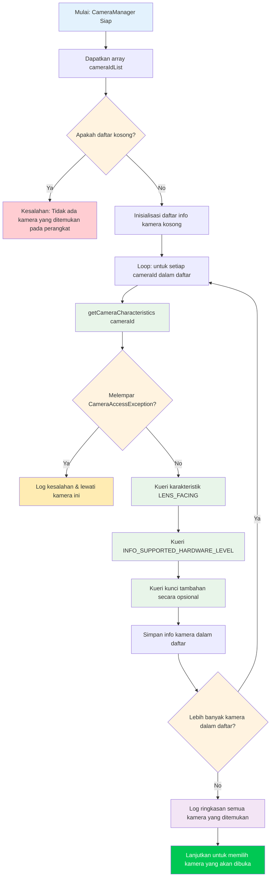

Di Bab 5, Anda berhasil menginisialisasi `CameraManager` dan mengambil daftar ID kamera — tetapi string seperti `"0"` atau `"2"` tidak memberi tahu Anda apa pun tentang kamera itu sebenarnya. Apakah itu kamera belakang ultra-lebar? Kamera selfie? Webcam USB eksternal yang terhubung melalui OTG? Bab ini mengajarkan Anda cara menjawab pertanyaan-pertanyaan tersebut menggunakan `CameraCharacteristics`, wadah metadata yang menjelaskan setiap kemampuan perangkat kamera.

Untuk referensi implementasi tingkat produksi dari enumerasi kamera dan inspeksi karakteristik, lihat aplikasi **Android Camera Parameters** ([GitHub](https://github.com/zoozooll/AndroidCameraParameters), [Google Play](https://play.google.com/store/apps/details?id=com.minininja.cameraparams)). Aplikasi ini menelusuri setiap kunci dalam `CameraCharacteristics` untuk setiap kamera di perangkat dan menampilkan hasilnya dalam UI yang dapat dicari dan difilter — alat yang tepat yang Anda inginkan saat men-debug masalah Camera2 khusus perangkat keras.

## Memahami ID Kamera

Sebelum menyelami karakteristik, kita perlu mengatasi sumber kebingungan mendasar bagi pengembang Camera2 baru: **apa sebenarnya arti dari string ID kamera numerik?**

Saat Anda memanggil `cameraManager.cameraIdList`, Anda mendapatkan `Array<String>` — misalnya: `["0", "1", "2", "3", "4"]`. Sangat **menggoda** untuk membuat asumsi hardcode seperti:
- `"0"` = kamera lebar belakang
- `"1"` = kamera depan
- `"2"` = telefoto

**Jangan pernah lakukan ini.** Pemetaan ID → kamera fisik adalah:
1. **Spesifik perangkat**: Pixel 8 mungkin menggunakan ID `"1"` untuk kamera depan, sementara Samsung Galaxy S24 menggunakan ID `"3"`.
2. **Spesifik versi**: Pembaruan OTA OEM dapat mengubah daftar ID setelah perangkat dirilis.
3. **Spesifik build ulang**: Beberapa perangkat multi-kamera logis (dibahas di bab Bagian III mendatang) secara dinamis mengekspos atau menyembunyikan kamera fisik yang mendasarinya berdasarkan mode.

**Satu-satunya** pendekatan yang benar adalah dengan **menanyakan karakteristik setiap ID** dan memilih kamera berdasarkan properti yang Anda pedulikan (arah hadap lensa, tingkat perangkat keras, rentang panjang fokus, dll.). Inilah yang dilakukan oleh aplikasi Camera2 yang ditulis dengan baik, dan ini adalah pola yang akan kita terapkan di sini.

## Alur Enumerasi Kamera

Algoritma keseluruhan untuk menemukan kamera tampak sederhana di permukaan, tetapi memiliki kasus tepi penting seputar penanganan kesalahan. Mari kita lihat prosesnya terlebih dahulu sebagai diagram alur, lalu terapkan dalam kode.



Observasi utama dari diagram alur:
1. **Selalu tangani daftar ID kosong**: Jarang terjadi pada ponsel, tetapi umum pada Android TV, perangkat tanpa layar (headless), atau emulator tanpa kamera virtual.
2. **Selalu bungkus `getCameraCharacteristics` dalam try/catch**: Kamera bisa saja terputus di tengah enumerasi (terutama kamera USB eksternal), atau kebijakan perangkat yang terkunci dapat membatasi kamera tertentu.
3. **Iterasi sepenuhnya, lalu pilih**: Kumpulkan semua kandidat terlebih dahulu, lalu pilih yang terbaik berdasarkan kriteria Anda. Jangan buka kamera "bagus" pertama yang Anda temukan — Anda mungkin melewatkan yang lebih baik.

## Memperkenalkan CameraCharacteristics

`CameraCharacteristics` adalah peta kunci-nilai read-only yang tidak dapat diubah (immutable) yang menjelaskan kemampuan tingkat perangkat keras dari sebuah kamera. Wadah ini berisi beberapa ratus kunci yang mencakup segalanya, mulai dari panjang fokus lensa hingga ukuran array piksel sensor hingga format output yang didukung.

Anda mengambil objek karakteristik dengan:
```kotlin
val characteristics: CameraCharacteristics =
    cameraManager.getCameraCharacteristics(cameraId)
```

Dan Anda menanyakan kunci individual dengan metode `get` generik:
```kotlin
val lensFacing: Int? = characteristics.get(CameraCharacteristics.LENS_FACING)
```

Tipe kembaliannya bersifat nullable (`Int?` dalam kasus ini) karena beberapa kunci bersifat opsional dan mungkin tidak ada pada semua perangkat. Dalam praktiknya, kunci yang kita tanyakan dalam bab ini (`LENS_FACING` dan `INFO_SUPPORTED_HARDWARE_LEVEL`) dijamin ada untuk setiap kamera yang valid, tetapi tetap merupakan praktik yang baik untuk menangani null secara defensif.

:::note
Bab ini sengaja hanya mencakup `LENS_FACING` dan `INFO_SUPPORTED_HARDWARE_LEVEL`. Bagian internal yang lebih dalam dari `CameraCharacteristics` (karakteristik sensor, konfigurasi output, kemampuan yang tersedia) adalah subjek dari Bagian III, Bab 10: Ensiklopedia CameraCharacteristics. Kita tetap fokus pada informasi minimum yang Anda butuhkan untuk memilih kamera yang akan dibuka.
:::

## Kunci 1: LENS_FACING — Depan, Belakang, atau Eksternal

Hal pertama yang perlu diketahui oleh hampir setiap aplikasi kamera adalah ke arah mana lensa menghadap. Camera2 mendefinisikan tiga konstanta:

| Konstanta | Nilai | Arti | Kasus Penggunaan Umum |
|---|---|---|---|
| `LENS_FACING_BACK` | `0` | Kamera ada di bagian belakang perangkat, menjauhi pengguna | Pengambilan foto, video lanskap, AR |
| `LENS_FACING_FRONT` | `1` | Kamera ada di bagian depan perangkat, menghadap pengguna | Selfie, panggilan video |
| `LENS_FACING_EXTERNAL` | `2` | Kamera berada di luar perangkat (misalnya, webcam USB OTG) | Aksesori eksternal, kamera khusus |

Berikut cara Anda mengubah integer mentah menjadi string yang dapat dibaca manusia:

```kotlin
fun lensFacingToString(facing: Int?): String = when (facing) {
    CameraCharacteristics.LENS_FACING_BACK -> "Belakang (LENS_FACING_BACK)"
    CameraCharacteristics.LENS_FACING_FRONT -> "Depan (LENS_FACING_FRONT)"
    CameraCharacteristics.LENS_FACING_EXTERNAL -> "Eksternal / USB OTG (LENS_FACING_EXTERNAL)"
    null -> "Tidak Diketahui (null)"
    else -> "Tidak Diketahui (value=$facing)"
}
```

### Kasus Khusus: Kamera Eksternal (USB OTG)

`LENS_FACING_EXTERNAL` ditambahkan pada API 23 (Marshmallow). Sebelum membuka kamera eksternal, pertimbangkan:

1. **Pernyataan Fitur USB Host**: Jika aplikasi Anda secara khusus menargetkan kamera eksternal, tambahkan `<uses-feature android:name="android.hardware.usb.host" />` ke manifest Anda. Atur `required="false"` jika aplikasi juga berfungsi dengan kamera internal.
2. **Izin untuk Perangkat Eksternal**: Pada banyak perangkat, mengakses kamera USB hanya memerlukan izin `CAMERA`. Namun, beberapa chipset webcam USB memerlukan konfirmasi izin host USB tambahan melalui `UsbManager.requestPermission()`. Tangani siaran (broadcast) `UsbManager.ACTION_USB_DEVICE_ATTACHED` jika Anda ingin mendeteksi secara otomatis saat kamera dicolokkan.
3. **Tingkat Perangkat Keras**: Kamera eksternal hampir selalu melaporkan `INFO_SUPPORTED_HARDWARE_LEVEL_EXTERNAL` (lihat di bawah), yang berarti set fiturnya dibatasi oleh driver USB Video Class (UVC). Jangan harapkan kontrol manual atau output RAW dari webcam generik.

Pada ponsel dengan webcam USB yang terpasang, `cameraIdList` mungkin mengembalikan sesuatu seperti `["0", "1", "100"]` di mana `"100"` adalah ID kamera eksternal yang ditetapkan secara dinamis. ID kamera eksternal biasanya berupa angka yang lebih tinggi dan **tidak** stabil setelah reboot atau dicolokkan kembali.

## Kunci 2: INFO_SUPPORTED_HARDWARE_LEVEL — Apa yang Bisa Dilakukan Kamera Ini?

Tingkat perangkat keras adalah klasifikasi kemampuan tunggal yang paling penting dalam Camera2. Tingkat ini memberi tahu Anda apakah perangkat keras kamera dan HAL (Hardware Abstraction Layer) mengimplementasikan pipeline Camera2 penuh atau menggunakan pembungkus kompatibilitas lama (legacy) di sekitar API Kamera lama. Ada lima nilai:

| Tingkat | Nilai | Arti | Perangkat Dunia Nyata |
|---|---|---|---|
| `LEGACY` | `2` | Mode HAL lama. Kamera berjalan di atas API Kamera lama melalui shim. Fungsionalitas sangat terbatas, tidak ada kontrol manual, tidak ada RAW. | Ponsel anggaran, perangkat pra-2015, banyak emulator |
| `LIMITED` | `0` | Dukungan HAL3 terbatas. Pengambilan gambar dasar, 3A dasar (Auto-Exposure, Auto-Focus, Auto-White-Balance), tetapi kekurangan fitur tingkat lanjut. | Ponsel kelas menengah, beberapa kamera depan pada perangkat unggulan |
| `FULL` | `1` | Dukungan HAL3 penuh. Kontrol sensor manual, pengaturan per-bingkai, output RAW, pemrosesan ulang (reprocessing). | Kamera utama/belakang ponsel unggulan, kamera utama seri Pixel |
| `LEVEL_3` | `3` | Dukungan HAL3 yang diperluas. Menambahkan pemrosesan ulang YUV, input multi-bingkai, konfigurasi resolusi kecepatan tinggi. | Ponsel unggulan terbaru, kamera utama Pixel 6+ |
| `EXTERNAL` | `4` | Kamera eksternal (USB/OTG). Fitur terbatas, perangkat kelas UVC. | Webcam USB, stik pengambilan HDMI |

Cara yang baik untuk memikirkan hierarki ini adalah sebagai tangga kemampuan:

```
LEGACY → LIMITED → FULL → LEVEL_3
          ↑
       EXTERNAL (cabang paralel untuk kamera USB)
```

Setiap langkah dibangun di atas langkah sebelumnya: `FULL` mencakup semua yang ada di `LIMITED`, `LEVEL_3` mencakup semua yang ada di `FULL`. Saat menulis kode deteksi fitur, periksa dari tingkat tertinggi ke bawah — jika kamera adalah `LEVEL_3`, Anda secara otomatis tahu bahwa kamera tersebut juga mendukung fitur `FULL`.

Berikut adalah fungsi pembantu untuk mengubah tingkat menjadi deskripsi:

```kotlin
fun hardwareLevelToString(level: Int?): String = when (level) {
    CameraMetadata.INFO_SUPPORTED_HARDWARE_LEVEL_LEGACY ->
        "LEGACY (shim API Kamera lama — kontrol manual terbatas)"
    CameraMetadata.INFO_SUPPORTED_HARDWARE_LEVEL_LIMITED ->
        "LIMITED (HAL3 dasar — foto/video standar)"
    CameraMetadata.INFO_SUPPORTED_HARDWARE_LEVEL_FULL ->
        "FULL (HAL3 penuh — kontrol manual + RAW)"
    CameraMetadata.INFO_SUPPORTED_HARDWARE_LEVEL_3 ->
        "LEVEL_3 (HAL3 diperluas — pemrosesan ulang + multi-bingkai)"
    CameraMetadata.INFO_SUPPORTED_HARDWARE_LEVEL_EXTERNAL ->
        "EXTERNAL (kamera USB/OTG — kelas UVC)"
    null -> "Tidak Diketahui (null)"
    else -> "Tidak Diketahui (value=$level)"
}
```

:::tip
Jika Anda ingin menulis kode yang hanya berjalan pada perangkat keras yang mumpuni, gunakan `>= LIMITED` untuk pengambilan gambar dasar, `>= FULL` untuk kontrol manual, dan `>= LEVEL_3` untuk pipeline pemrosesan ulang. Jangan pernah berasumsi kamera adalah FULL atau lebih baik — selalu periksa. Aplikasi Android Camera Parameters di [Google Play](https://play.google.com/store/apps/details?id=com.minininja.cameraparams) menampilkan tingkat perangkat keras sebagai lencana yang menonjol untuk setiap kamera sehingga Anda dapat melihat dengan cepat apa yang didukung oleh setiap perangkat.
:::

## Kode Kotlin Lengkap: Utilitas Penemuan Kamera

Sekarang mari kita gabungkan semuanya menjadi implementasi yang berfungsi. Kita akan memperluas `MainActivity.kt` dari Bab 5 dengan metode `discoverAndLogCameras()` yang melakukan iterasi pada semua kamera, menanyakan `LENS_FACING` dan `INFO_SUPPORTED_HARDWARE_LEVEL` masing-masing, dan mencatat hasilnya ke Logcat.

```kotlin
package com.example.camera2tutorial

import android.Manifest
import android.content.Context
import android.content.pm.PackageManager
import android.hardware.camera2.CameraAccessException
import android.hardware.camera2.CameraCharacteristics
import android.hardware.camera2.CameraManager
import android.hardware.camera2.CameraMetadata
import android.os.Bundle
import android.os.Handler
import android.os.HandlerThread
import android.util.Log
import android.widget.Toast
import androidx.appcompat.app.AppCompatActivity
import androidx.core.app.ActivityCompat
import androidx.core.content.ContextCompat

class MainActivity : AppCompatActivity() {

    private lateinit var backgroundThread: HandlerThread
    private lateinit var backgroundHandler: Handler
    private lateinit var cameraManager: CameraManager

    override fun onCreate(savedInstanceState: Bundle?) {
        super.onCreate(savedInstanceState)
        setContentView(R.layout.activity_main)

        if (allPermissionsGranted()) {
            initializeCameraManager()
        } else {
            ActivityCompat.requestPermissions(
                this,
                REQUIRED_PERMISSIONS,
                REQUEST_CODE_PERMISSIONS
            )
        }
    }

    override fun onResume() {
        super.onResume()
        startBackgroundThread()
    }

    override fun onPause() {
        stopBackgroundThread()
        super.onPause()
    }

    private fun startBackgroundThread() {
        backgroundThread = HandlerThread("Camera2Background").apply { start() }
        backgroundHandler = Handler(backgroundThread.looper)
    }

    private fun stopBackgroundThread() {
        backgroundThread.quitSafely()
        try {
            backgroundThread.join(1000)
        } catch (e: InterruptedException) {
            Log.e(TAG, "Interrupted while joining background thread", e)
        }
    }

    private fun initializeCameraManager() {
        cameraManager = getSystemService(Context.CAMERA_SERVICE) as CameraManager
        discoverAndLogCameras()
    }

    // -------------------------------------------------------------------------
    // 📸 TAMBAHAN BAB 6: Penemuan Kamera & Kueri Karakteristik
    // -------------------------------------------------------------------------
    data class CameraInfo(
        val id: String,
        val lensFacing: Int?,
        val hardwareLevel: Int?
    ) {
        fun description(): String = buildString {
            append("Camera ID: $id | ")
            append("Arah Hadap: ${lensFacingToString(lensFacing)} | ")
            append("HW Level: ${hardwareLevelToString(hardwareLevel)}")
        }
    }

    private fun discoverAndLogCameras() {
        val cameraIdList: Array<String> = try {
            cameraManager.cameraIdList
        } catch (e: CameraAccessException) {
            Log.e(TAG, "Gagal mendapatkan daftar ID kamera", e)
            Toast.makeText(this, "Layanan kamera tidak tersedia", Toast.LENGTH_LONG).show()
            return
        }

        if (cameraIdList.isEmpty()) {
            Log.w(TAG, "Tidak ada kamera yang ditemukan pada perangkat ini")
            Toast.makeText(this, "Tidak ada kamera yang tersedia", Toast.LENGTH_LONG).show()
            return
        }

        val discoveredCameras = mutableListOf<CameraInfo>()
        Log.i(TAG, "═══════════════════════════════════════════")
        Log.i(TAG, "Memulai penemuan kamera (${cameraIdList.size} kamera)")
        Log.i(TAG, "═══════════════════════════════════════════")

        for ((index, cameraId) in cameraIdList.withIndex()) {
            try {
                val characteristics = cameraManager.getCameraCharacteristics(cameraId)

                val lensFacing = characteristics.get(CameraCharacteristics.LENS_FACING)
                val hardwareLevel =
                    characteristics.get(CameraCharacteristics.INFO_SUPPORTED_HARDWARE_LEVEL)

                val info = CameraInfo(cameraId, lensFacing, hardwareLevel)
                discoveredCameras.add(info)

                Log.i(TAG, "── Kamera $index ──")
                Log.i(TAG, info.description())

            } catch (e: CameraAccessException) {
                Log.e(TAG, "Gagal mengakses karakteristik untuk kamera $cameraId", e)
            } catch (e: IllegalArgumentException) {
                Log.e(TAG, "ID kamera tidak valid: $cameraId", e)
            }
        }

        Log.i(TAG, "═══════════════════════════════════════════")
        Log.i(TAG, "Penemuan selesai. ${discoveredCameras.size} kamera berhasil dihitung.")

        // Kelompokkan dan ringkas berdasarkan arah hadap
        val byFacing = discoveredCameras.groupBy { it.lensFacing }
        Log.i(TAG, "  Menghadap belakang:  ${byFacing[CameraCharacteristics.LENS_FACING_BACK]?.size ?: 0}")
        Log.i(TAG, "  Menghadap depan:     ${byFacing[CameraCharacteristics.LENS_FACING_FRONT]?.size ?: 0}")
        Log.i(TAG, "  Eksternal/OTG:       ${byFacing[CameraCharacteristics.LENS_FACING_EXTERNAL]?.size ?: 0}")

        // Kelompokkan dan ringkas berdasarkan tingkat perangkat keras
        val byLevel = discoveredCameras.groupBy { it.hardwareLevel }
        Log.i(TAG, "  Kamera LEGACY:       ${byLevel[CameraMetadata.INFO_SUPPORTED_HARDWARE_LEVEL_LEGACY]?.size ?: 0}")
        Log.i(TAG, "  Kamera LIMITED:      ${byLevel[CameraMetadata.INFO_SUPPORTED_HARDWARE_LEVEL_LIMITED]?.size ?: 0}")
        Log.i(TAG, "  Kamera FULL:         ${byLevel[CameraMetadata.INFO_SUPPORTED_HARDWARE_LEVEL_FULL]?.size ?: 0}")
        Log.i(TAG, "  Kamera LEVEL_3:      ${byLevel[CameraMetadata.INFO_SUPPORTED_HARDWARE_LEVEL_3]?.size ?: 0}")
        Log.i(TAG, "  Kamera EXTERNAL:     ${byLevel[CameraMetadata.INFO_SUPPORTED_HARDWARE_LEVEL_EXTERNAL]?.size ?: 0}")
        Log.i(TAG, "═══════════════════════════════════════════")

        val summary = buildString {
            append("Ditemukan ${discoveredCameras.size} kamera!\n")
            append("Belakang: ${byFacing[CameraCharacteristics.LENS_FACING_BACK]?.size ?: 0} • ")
            append("Depan: ${byFacing[CameraCharacteristics.LENS_FACING_FRONT]?.size ?: 0} • ")
            append("Eksternal: ${byFacing[CameraCharacteristics.LENS_FACING_EXTERNAL]?.size ?: 0}")
        }

        Toast.makeText(this, summary, Toast.LENGTH_LONG).show()

        // Simpan untuk bab selanjutnya (memilih kamera untuk dibuka)
        this.discoveredCameras = discoveredCameras
    }

    private var discoveredCameras: List<CameraInfo> = emptyList()

    // Pembantu: dapatkan ID kamera belakang "default" (kamera belakang pertama yang ditemukan)
    fun getDefaultBackCameraId(): String? =
        discoveredCameras.firstOrNull {
            it.lensFacing == CameraCharacteristics.LENS_FACING_BACK
        }?.id

    // Pembantu: dapatkan ID kamera depan "default"
    fun getDefaultFrontCameraId(): String? =
        discoveredCameras.firstOrNull {
            it.lensFacing == CameraCharacteristics.LENS_FACING_FRONT
        }?.id

    companion object {
        private const val TAG = "Camera2Tutorial"
        private const val REQUEST_CODE_PERMISSIONS = 10
        private val REQUIRED_PERMISSIONS = arrayOf(Manifest.permission.CAMERA)

        fun lensFacingToString(facing: Int?): String = when (facing) {
            CameraCharacteristics.LENS_FACING_BACK -> "Belakang"
            CameraCharacteristics.LENS_FACING_FRONT -> "Depan"
            CameraCharacteristics.LENS_FACING_EXTERNAL -> "Eksternal/USB"
            null -> "Tidak Diketahui(null)"
            else -> "Tidak Diketahui($facing)"
        }

        fun hardwareLevelToString(level: Int?): String = when (level) {
            CameraMetadata.INFO_SUPPORTED_HARDWARE_LEVEL_LEGACY -> "LEGACY"
            CameraMetadata.INFO_SUPPORTED_HARDWARE_LEVEL_LIMITED -> "LIMITED"
            CameraMetadata.INFO_SUPPORTED_HARDWARE_LEVEL_FULL -> "FULL"
            CameraMetadata.INFO_SUPPORTED_HARDWARE_LEVEL_3 -> "LEVEL_3"
            CameraMetadata.INFO_SUPPORTED_HARDWARE_LEVEL_EXTERNAL -> "EXTERNAL"
            null -> "Tidak Diketahui(null)"
            else -> "Tidak Diketahui($level)"
        }
    }

    private fun allPermissionsGranted() = REQUIRED_PERMISSIONS.all {
        ContextCompat.checkSelfPermission(baseContext, it) == PackageManager.PERMISSION_GRANTED
    }

    override fun onRequestPermissionsResult(
        requestCode: Int,
        permissions: Array<out String>,
        grantResults: IntArray
    ) {
        super.onRequestPermissionsResult(requestCode, permissions, grantResults)
        if (requestCode == REQUEST_CODE_PERMISSIONS) {
            if (allPermissionsGranted()) {
                initializeCameraManager()
            } else {
                Toast.makeText(
                    this,
                    "Izin kamera diperlukan untuk menggunakan aplikasi ini.",
                    Toast.LENGTH_LONG
                ).show()
                finish()
            }
        }
    }
}
```

### Pola Utama dalam Kode

1. **`data class CameraInfo`**: Daripada meneruskan tuple mentah, kita merangkum properti yang kita pedulikan dalam kelas data bertipe. Hal ini membuat kode mudah dibaca dan diperluas secara sepele (cukup tambahkan bidang baru seperti `focalLengths` nanti tanpa mengubah tempat panggilan).

2. **`CameraAccessException` try/catch di dalam loop**: Jika satu kamera gagal (misalnya, kamera eksternal dicabut di tengah enumerasi), loop berlanjut dan kamera yang tersisa masih dapat ditemukan. Kegagalan satu kamera tidak boleh meracuni seluruh enumerasi.

3. **Ringkasan ganda `groupBy`**: Mengelompokkan kamera berdasarkan arah hadap dan tingkat perangkat keras, lalu menghitung setiap kelompok, memberi Anda gambaran langsung tentang topologi kamera perangkat. Pola ini diambil langsung dari layar ikhtisar aplikasi Android Camera Parameters ([GitHub](https://github.com/zoozooll/AndroidCameraParameters)).

4. **`getDefaultBackCameraId()` dan `getDefaultFrontCameraId()`**: Fungsi pembantu ini mendemonstrasikan cara yang benar untuk memilih kamera — dengan menanyakan karakteristik, bukan dengan melakukan hardcode ID `"0"` atau `"1"`. Kita akan menggunakan pembantu ini di Bab 7 saat kita benar-benar membuka kamera.

## Output Logcat yang Diharapkan

Saat Anda menjalankan ini pada perangkat nyata (misalnya, ponsel unggulan modern dengan 4+ kamera), output Logcat yang difilter oleh `Camera2Tutorial` akan terlihat kira-kira seperti ini:

```
I/Camera2Tutorial: ═══════════════════════════════════════════
I/Camera2Tutorial: Memulai penemuan kamera (5 kamera)
I/Camera2Tutorial: ═══════════════════════════════════════════
I/Camera2Tutorial: ── Kamera 0 ──
I/Camera2Tutorial: Camera ID: 0 | Arah Hadap: Belakang | HW Level: LEVEL_3
I/Camera2Tutorial: ── Kamera 1 ──
I/Camera2Tutorial: Camera ID: 1 | Arah Hadap: Depan | HW Level: FULL
I/Camera2Tutorial: ── Kamera 2 ──
I/Camera2Tutorial: Camera ID: 2 | Arah Hadap: Belakang | HW Level: LIMITED
I/Camera2Tutorial: ── Kamera 3 ──
I/Camera2Tutorial: Camera ID: 3 | Arah Hadap: Belakang | HW Level: LIMITED
I/Camera2Tutorial: ── Kamera 4 ──
I/Camera2Tutorial: Camera ID: 4 | Arah Hadap: Belakang | HW Level: LIMITED
I/Camera2Tutorial: ═══════════════════════════════════════════
I/Camera2Tutorial: Penemuan selesai. 5 kamera berhasil dihitung.
I/Camera2Tutorial:   Menghadap belakang:  4
I/Camera2Tutorial:   Menghadap depan:     1
I/Camera2Tutorial:   Eksternal/OTG:       0
I/Camera2Tutorial:   Kamera LEGACY:       0
I/Camera2Tutorial:   Kamera LIMITED:      3
I/Camera2Tutorial:   Kamera FULL:         1
I/Camera2Tutorial:   Kamera LEVEL_3:      1
I/Camera2Tutorial:   Kamera EXTERNAL:     0
I/Camera2Tutorial: ═══════════════════════════════════════════
```

Dalam contoh output ini, kita memiliki:
- **Kamera 0** (LEVEL_3, Belakang): Kamera belakang sudut lebar utama, kamera berkualitas tertinggi.
- **Kamera 1** (FULL, Depan): Kamera selfie depan, tingkat FULL sehingga kontrol manual tersedia.
- **Kamera 2, 3, 4** (LIMITED, Belakang): Ultra-lebar, telefoto, dan kemungkinan sensor kedalaman atau makro — semuanya tingkat LIMITED, artinya mereka mendukung pengambilan gambar dasar tetapi tidak kontrol manual penuh (ini sangat umum pada kamera belakang tambahan bahkan pada ponsel unggulan).

## Pemecahan Masalah Masalah Penemuan Kamera

### `cameraIdList` mengembalikan array kosong pada emulator

Sebagian besar emulator Android dilengkapi dengan kamera belakang dan depan simulasi, tetapi mereka harus diaktifkan di pengaturan AVD (Android Virtual Device). Buka AVD Manager, edit perangkat virtual Anda, buka **Advanced Settings**, dan atur **Back camera** dan **Front camera** ke `Emulated` (menggunakan webcam host) atau `VirtualScene` (merender adegan 3D palsu). Kemudian lakukan cold-boot pada emulator.

### Semua kamera melaporkan LEGACY pada ponsel yang seharusnya memiliki dukungan FULL

Ini terjadi dalam dua skenario:
1. **Anda menggunakan custom ROM atau perangkat yang di-root dengan HAL kamera lama**: OEM tidak mengimplementasikan HAL3, sehingga shim kompatibilitas digunakan meskipun perangkat keras sensor mampu.
2. **Anda menggunakan profil kerja atau perangkat terkelola**: Beberapa kebijakan MDM (Mobile Device Management) membatasi kemampuan kamera, dan layanan kamera dapat melaporkan tingkat yang menurun ke aplikasi dalam profil kerja.

Instal aplikasi Android Camera Parameters dari [Google Play](https://play.google.com/store/apps/details?id=com.minininja.cameraparams) untuk referensi silang. Jika aplikasi Play Store juga menunjukkan LEGACY, itu adalah batasan tingkat perangkat, bukan bug dalam kode Anda.

### Kamera USB eksternal tidak muncul dalam daftar

Pertama, verifikasi adaptor USB OTG Anda berfungsi: colokkan mouse USB dan periksa apakah kursor bergerak. Jika perangkat keras berfungsi, verifikasi:
- Perangkat menjalankan API 23+ (dukungan kamera eksternal ditambahkan di Marshmallow).
- Webcam tersebut sesuai dengan USB Video Class (UVC). Kebanyakan webcam konsumen sesuai, tetapi kamera industri khusus mungkin memerlukan driver khusus.
- Beberapa perangkat memblokir mode host USB saat baterai di bawah tingkat tertentu. Isi daya perangkat dan coba lagi.

## Ringkasan

Dalam bab ini, Anda mengubah array string ID kamera yang tidak berarti menjadi informasi yang dapat ditindaklanjuti tentang perangkat keras kamera pada sebuah perangkat. Anda mempelajari:

1. **Semantik ID Kamera**: Mengapa Anda tidak boleh melakukan hardcode asumsi tentang ID mana yang memetakan ke kamera mana, dan bagaimana ID dapat bervariasi di berbagai perangkat, OTA, dan reboot.
2. **Dasar-dasar CameraCharacteristics**: Cara mengambil objek karakteristik melalui `cameraManager.getCameraCharacteristics(cameraId)` dan menanyakan kunci individual menggunakan metode `get` generik.
3. **LENS_FACING**: Tiga arah lensa yang mungkin (`LENS_FACING_BACK`, `LENS_FACING_FRONT`, `LENS_FACING_EXTERNAL`), dengan pembahasan mendalam tentang persyaratan kamera eksternal USB OTG (fitur host USB, ID dinamis, batasan UVC).
4. **INFO_SUPPORTED_HARDWARE_LEVEL**: Tangga kemampuan lima tingkat (LEGACY → LIMITED → FULL → LEVEL_3, ditambah EXTERNAL untuk kamera USB), apa yang dijamin oleh setiap tingkat dalam hal dukungan fitur, dan cara menulis kode gating fitur berdasarkan tingkat minimum yang diperlukan.
5. **Penemuan Kamera yang Kuat**: Implementasi `discoverAndLogCameras()` lengkap dengan try/catch per-kamera, kelas data `CameraInfo`, string deskripsi yang dapat dibaca manusia, ringkasan group-by untuk arah hadap dan tingkat perangkat keras, serta fungsi pembantu untuk memilih kamera belakang/depan default.

Anda sekarang memiliki metadata Camera2 nyata yang mengalir melalui aplikasi Anda. Ini adalah pencapaian besar — kode enumerasi yang Anda tulis di sini dapat digunakan kembali di setiap proyek Camera2 yang akan Anda bangun.

## Apa Selanjutnya

Dengan kamera yang dipilih (melalui `getDefaultBackCameraId()`), saatnya untuk benar-benar menyalakannya dan berbicara dengan perangkat keras. Di **Bab 7: Membuka Kamera**, Anda akan:

- Mempelajari apa yang diwakili oleh `CameraDevice` (koneksi aktif yang dibuka ke kamera fisik).
- Mengimplementasikan `CameraDevice.StateCallback` dengan handler untuk `onOpened`, `onDisconnected`, dan `onError`.
- Memahami aturan siklus hidup kapan harus membuka, membuka kembali, dan menutup kamera selaras dengan `onPause` dan `onResume`.
- Menangani setiap kode kesalahan `CameraAccessException` yang umum: `CAMERA_IN_USE`, `MAX_CAMERAS_IN_USE`, `CAMERA_DISABLED`, dan `CAMERA_ERROR`.
- Menggunakan `Semaphore` untuk mencegah operasi buka konkuren, dengan timeout `tryAcquire` untuk keamanan deadlock.

Pada akhir Bab 7, kode Anda akan memegang objek `CameraDevice` yang aktif dan terbuka — prasyarat untuk membuat sesi pengambilan gambar dan, akhirnya, menampilkan pratinjau kamera.
