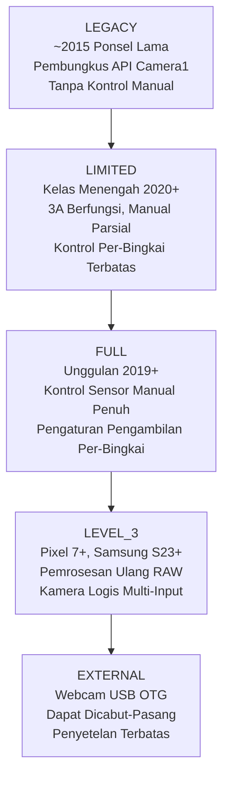
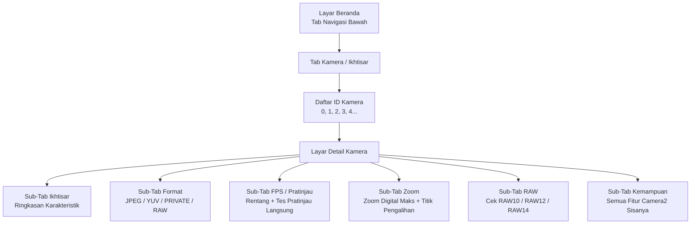

# Bab 4: Jelajahi Ponsel Anda Sendiri

Inilah saat di mana aplikasi Anda menjadi penting. Bab 2 dan 3 memberi Anda pemahaman teoretis tentang perangkat keras kamera dan fitur fotografi komputasional modern. Bab ini bersifat praktis dan spesifik untuk perangkat. Anda akan menginstal aplikasi pendamping **Android Camera Parameters** di ponsel Anda sendiri, menjalankannya, dan secara sistematis memeriksa apa yang dapat dan tidak dapat dilakukan oleh perangkat keras Anda — sambil mencatat jawabannya.

Informasi yang Anda temukan di bab ini bukanlah trivia akademik. API Camera2 mengekspos kemampuan pada basis per-perangkat, per-kamera. Fitur yang berfungsi sempurna di Pixel 10 pribadi Anda mungkin gagal secara diam-diam (atau turun menjadi tidak berfungsi, atau lebih buruk lagi, mogok) pada Samsung seri A kelas menengah tahun 2023 karena HAL perangkat tersebut tidak mengimplementasikan kemampuan yang diperlukan. Sebelum Anda menulis satu baris kode API Camera2 di Bagian II seri ini, Anda harus tahu kemampuan perangkat pengujian Anda sendiri.

Pada akhir bab ini, Anda akan telah mencatat, untuk ponsel spesifik Anda: daftar lengkap ID Kamera dengan arah hadap dan tingkat perangkat kerasnya; format output mana yang didukung setiap kamera; resolusi JPEG maksimum; rentang FPS gerak lambat tertinggi; zoom digital maksimum dan ambang pengalihan zoom kamera fisik; serta apakah kamera utama Anda mendukung output RAW.

## Menginstal Aplikasi Android Camera Parameters

Tersedia dua opsi instalasi. Pilih mana yang Anda sukai.

### Opsi A — Bangun dari Sumber (Source)

Jika Anda adalah pengembang Android dan sudah menginstal Android Studio, opsi ini memberi Anda kemampuan untuk menelusuri kode sumber aplikasi pendamping (lihat bagian akhir bab ini) dan bahkan memodifikasinya untuk memeriksa karakteristik Camera2 tambahan yang menarik bagi Anda.

1. Clone repositori GitHub:
   `https://github.com/zoozooll/AndroidCameraParameters`
2. Buka proyek di Android Studio Iguana (2023.2.1) atau yang lebih baru. Sinkronisasi Gradle akan selesai secara otomatis; proyek ini menargetkan Android SDK 34 (Android 14) dengan `minSdkVersion` 21 (Android 5.0 Lollipop), sehingga akan berjalan pada hampir semua ponsel yang mungkin Anda miliki.
3. Aktifkan USB Debugging di ponsel Anda. Buka **Pengaturan → Tentang Ponsel → Nomor Bentukan** dan ketuk entri Nomor Bentukan sebanyak 7 kali. Sebuah toast akan muncul bertuliskan "Anda sekarang adalah seorang pengembang." Kembali ke layar Pengaturan utama, masuk ke **Opsi Pengembang**, dan aktifkan **USB Debugging**.
4. Hubungkan ponsel Anda ke komputer melalui kabel USB-C. Di ponsel, terima perintah "Izinkan debugging USB dari komputer ini?" dan centang "Selalu izinkan dari komputer ini" untuk menghindari dialog di masa mendatang.
5. Pilih Konfigurasi Jalankan **app** dari dropdown di bagian atas Android Studio (Konfigurasi Jalankan default biasanya bernama `app`). Pastikan ponsel Anda yang terhubung muncul sebagai perangkat target di dropdown perangkat.
6. Klik tombol **Jalankan** hijau (ikon putar segitiga) atau tekan **Shift + F10**. Android Studio akan mengompilasi aplikasi, menginstal APK ke ponsel Anda melalui ADB, dan meluncurkannya secara otomatis.

### Opsi B — Instal dari Google Play

Jika Anda hanya ingin menjalankan aplikasi tanpa mengompilasinya, atau jika Anda ingin menguji perilakunya pada beberapa perangkat pengguna akhir tanpa mengonfigurasi masing-masing untuk ADB, gunakan build Play Store.

Buka Google Play Store di ponsel Android Anda dan buka:

`https://play.google.com/store/apps/details?id=com.minininja.cameraparams`

Ketuk **Instal**. Aplikasi ini gratis dan tidak mengandung iklan, tidak ada pembelian dalam aplikasi, dan tidak ada pelacak. Aplikasi ini hanya memerlukan izin `CAMERA` (untuk menanyakan karakteristik kamera dan membuka permukaan pratinjau) dan izin opsional `RECORD_AUDIO` (tidak pernah digunakan dalam build saat ini, tetapi dipesan untuk aktivitas pengujian perekaman video di masa mendatang). Izin `ACCESS_FINE_LOCATION` bersifat opsional dan hanya diminta jika Anda ingin menandai tangkapan sampel dengan metadata GPS di tab pratinjau.

Luncurkan aplikasi setelah instalasi selesai. Pada peluncuran pertama, berikan izin **Kamera** saat dialog izin sistem muncul. Aplikasi tidak akan berfungsi tanpa izin ini, karena model keamanan Android memerlukan pemberian izin runtime bahkan untuk *menanyakan* karakteristik kamera — Anda bahkan tidak dapat menghitung ID Kamera tanpa izin `CAMERA` diberikan.

## ID Kamera

Lihat layar beranda aplikasi. Tab pertama (dan default) di bagian bawah berlabel **Kamera** (terkadang disebut **Ikhtisar** tergantung pada varian build yang Anda jalankan). Header di bagian atas tab ini bertuliskan **Semua ID Kamera**.

Setiap kamera individu pada perangkat Android — setiap kamera belakang, kamera depan, perangkat penggabungan multi-kamera logis apa pun, dan webcam USB OTG eksternal apa pun — diberi pengenal string unik yang disebut **ID Kamera**. ID Kamera hampir selalu berupa integer desimal sederhana: `"0"`, `"1"`, `"2"`, `"3"`, dan terkadang `"4"`, `"5"` pada perangkat dengan banyak kamera. Pada perangkat langka (beberapa webcam eksternal, dan kamera palsu emulator) Anda mungkin melihat ID Kamera seperti `"camera@0"` atau `"0@external"`, tetapi integer biasa adalah format yang paling umum.

Setiap baris dalam daftar Semua ID Kamera menunjukkan tiga informasi, dari kiri ke kanan:

1. Nomor ID Kamera itu sendiri, ditampilkan sebagai chip tebal besar.
2. Arah **LENS_FACING**: salah satu dari `BACK` (kamera menghadap ke belakang, menjauhi layar), `FRONT` (kamera selfie, menghadap pengguna), atau `EXTERNAL` (webcam USB / kamera OTG).
3. **Tingkat Perangkat Keras** dari kamera tersebut: chip berwarna yang menunjukkan `LEGACY`, `LIMITED`, `FULL`, `LEVEL_3`, atau `EXTERNAL`. Ini memetakan langsung ke karakteristik `INFO_SUPPORTED_HARDWARE_LEVEL` API Camera2 yang dijelaskan dalam Bab 1 seri ini.

Sebagai contoh nyata, Galaxy S26 Ultra biasanya melaporkan **5 ID Kamera**:

- **ID 0**: BACK (kamera lebar / utama 24mm belakang), Tingkat Perangkat Keras = **FULL**
- **ID 1**: FRONT (kamera selfie), Tingkat Perangkat Keras = **LIMITED**
- **ID 2**: BACK (kamera ultra-lebar 0,5× belakang), Tingkat Perangkat Keras = **FULL**
- **ID 3**: BACK (kamera telefoto periskop 5× belakang), Tingkat Perangkat Keras = **FULL**
- **ID 4**: BACK (ID multi-kamera logis yang mewakili kombinasi gabungan dari ID 0 + 2 + 3, dikelola oleh HAL untuk zoom yang mulus), Tingkat Perangkat Keras = **FULL**

Ponsel kelas menengah (misalnya, Samsung A54 5G) mungkin hanya melaporkan 3 ID Kamera: lebar belakang, ultra-lebar belakang, dan depan. Ponsel anggaran era 2016 mungkin hanya melaporkan 2: belakang dan depan.

**Tugas untuk perangkat Anda:** Tuliskan daftar lengkap ID Kamera yang dilaporkan ponsel Anda. Untuk setiap ID, catat LENS_FACING (Belakang / Depan / Eksternal) dan label/warna chip Tingkat Perangkat Kerasnya. Hitung jumlah total kamera. Jika Anda melihat ID Kamera yang tujuannya tidak jelas (misalnya, ID tambahan yang menghadap ke belakang yang tidak sesuai dengan tonjolan lensa yang terlihat di bagian belakang ponsel), ingatlah hal itu — itu sering kali adalah sensor kedalaman ToF, kamera makro, atau perangkat penggabungan multi-kamera logis.

## Tingkat Perangkat Keras

Bab 1 seri ini memperkenalkan lima Tingkat Perangkat Keras Camera2, diurutkan dari yang paling tidak mampu hingga yang paling mampu: **LEGACY → LIMITED → FULL → LEVEL_3 → EXTERNAL**. Bagian ini menyegarkan kembali hierarki tersebut dan kemudian meminta Anda untuk memeriksa tingkat setiap kamera menggunakan aplikasi.

Setiap tingkat menambahkan kemampuan baru dan jaminan performa yang lebih ketat:

- **LEGACY**: API Camera2 diimplementasikan sebagai lapisan tipis di atas API `android.hardware.Camera` (Camera1) yang sudah dihentikan. Hampir tidak ada yang berfungsi secara andal — tidak ada eksposur manual, tidak ada kontrol per-bingkai, tidak ada dukungan RAW. Anda dapat mengabaikan perangkat LEGACY dengan aman di tahun 2026; pada dasarnya tidak ada ponsel yang aktif digunakan yang masih melaporkan tingkat ini.
- **LIMITED**: Tingkat Perangkat Keras yang paling umum untuk ponsel kelas menengah dan untuk kamera depan di semua tingkatan ponsel. Algoritma 3A (Auto-Exposure, Auto-Focus, Auto-White-Balance) berjalan dengan benar, output YUV dan JPEG dasar berfungsi, tetapi sebagian besar kontrol sensor manual tidak tersedia (tidak ada kecepatan rana manual di bawah batas AE, tidak ada kontrol penguatan manual, tidak ada pembaruan pengaturan pengambilan per-bingkai yang lebih cepat dari latensi 3–5 bingkai).
- **FULL**: Tingkat standar emas untuk ponsel unggulan. Setiap fitur API Camera2 dijamin berfungsi: kontrol manual penuh atas waktu eksposur sensor dan penguatan analog per bingkai individu, frame rate dijamin akan dipatuhi, pengambilan gambar burst pada 30+ fps dengan pengaturan berbeda per bingkai, pemrosesan ulang YUV, output RAW DNG dasar. Jika kamera belakang utama di ponsel Anda melaporkan FULL, Anda dapat mengimplementasikan setiap fitur dalam seri tutorial ini.
- **LEVEL_3**: Tingkat tertinggi, diperkenalkan dengan keluarga Pixel 7 dan Samsung S23 pada tahun 2022/2023. Menambahkan stream input pemrosesan ulang RAW yang dijamin (Anda dapat memasukkan kembali DNG yang ditangkap sebelumnya ke ISP dan menjalankan kembali pipeline dengan pemetaan nada atau matriks warna yang berbeda), stream output YUV multi-resolusi, dan dukungan penggabungan multi-kamera logis yang dijamin.
- **EXTERNAL**: Untuk webcam USB OTG dan dongle pengambilan HDMI yang dicolokkan melalui USB-C. Permukaan API-nya identik tetapi tidak ada data kalibrasi pabrik (tidak ada peta bayangan lensa yang disimpan di OTP, tidak ada matriks koreksi warna per modul), sehingga kualitas kamera EXTERNAL tidak menentu.

**Cara memeriksa di aplikasi:** Ketuk chip **Tingkat Perangkat Keras** di samping ID Kamera mana pun dalam daftar. Dialog bottom-sheet akan muncul menampilkan deskripsi `INFO_SUPPORTED_HARDWARE_LEVEL` lengkap untuk kamera tersebut, bersama dengan daftar poin fitur utama mana yang dijamin (atau tidak dijamin) pada tingkat tersebut.

**Tugas untuk perangkat Anda:** Untuk kamera belakang utama Anda (biasanya ID 0), konfirmasikan Tingkat Perangkat Keras yang dilaporkannya. Untuk kamera depan Anda, konfirmasikan tingkatnya. Kemudian ajukan pertanyaan ini kepada diri sendiri dan pikirkan jawabannya sebelum membaca lebih lanjut: **Mengapa kamera depan hampir secara universal melaporkan LIMITED alih-alih FULL?**

Jawabannya adalah karena kamera depan biasanya adalah sensor yang lebih murah dan lebih sederhana. Algoritma 3A berjalan dengan andal pada kamera tersebut (bagaimanapun juga, selfie membutuhkan auto-exposure dan auto-white-balance untuk menghasilkan output yang dapat diterima), tetapi kontrol sensor manual kurang menjadi prioritas produk untuk selfie. Tidak ada yang membayar mahal untuk kecepatan rana manual 1/1000 detik pada kamera selfie 13MP mereka. Oleh karena itu, vendor HAL mengoptimalkan implementasi tingkat LIMITED mereka untuk kasus penggunaan selfie dan tidak pernah mengimplementasikan pengujian dan validasi tambahan yang diperlukan untuk lulus pengujian CTS (Compatibility Test Suite) Camera2 tingkat FULL.

## Kamera yang Tersedia: Arah Hadap

Android mendefinisikan tiga nilai yang mungkin untuk karakteristik kamera `LENS_FACING`. Aplikasi menyediakan bilah pengalih filter di bagian atas tab Kamera untuk beralih di antara mereka: **Semua · Belakang · Depan · Eksternal**.

- **BACK**: Kamera di bagian belakang ponsel, mengarah menjauhi layar. Setiap sensor ultra-lebar, lebar, telefoto, periskop, makro, atau ToF belakang melaporkan `LENS_FACING_BACK`. Ini adalah kamera yang akan digunakan aplikasi Anda 90% dari waktu.
- **FRONT**: Kamera selfie, mengarah ke pengguna saat layar menghadap mereka. Perhatikan bahwa gambar pratinjau dari kamera depan biasanya dicerminkan secara horizontal (dibalik dari kiri ke kanan) oleh aplikasi kamera default agar sesuai dengan apa yang dilihat pengguna di cermin, tetapi data piksel aktual yang ditulis ke file JPEG tidak dicerminkan kecuali aplikasi Anda secara eksplisit melakukannya.
- **EXTERNAL**: Webcam USB OTG, endoskop USB, kartu pengambilan HDMI USB, atau perangkat input video pluggable panas lainnya yang terhubung melalui USB-C. Salah satu fitur API Camera2 yang paling jarang diketahui adalah bahwa kamera EXTERNAL diekspos melalui *jalur kode yang sama persis* dengan kamera internal. Aplikasi Camera2 yang ditulis dengan baik akan menghitung dan menggunakan webcam USB secara otomatis tanpa kode khusus USB, selama port USB-C ponsel mendukung mode host gadget USB Video Class (UVC).

**Tugas untuk perangkat Anda:** Gunakan pengalih filter untuk beralih antara Belakang, Depan, dan Eksternal. Hitung berapa banyak kamera yang masuk ke dalam setiap kategori. Apakah ponsel Anda mencantumkan kamera EXTERNAL saat ini? Hampir pasti tidak — kecuali Anda sedang mencolokkan webcam USB. Jika Anda kebetulan memiliki webcam USB atau endoskop USB, colokkan ke ponsel sekarang melalui adaptor USB-C OTG dan ketuk tombol **Segarkan** di menu pojok kanan atas aplikasi. Anda akan melihat ID Kamera baru muncul dengan LENS_FACING = EXTERNAL. Buka tab Pratinjau untuk kamera eksternal tersebut — jika semuanya berfungsi, Anda akan melihat pratinjau langsung dari webcam, menggunakan jalur kode API Camera2 yang sama persis dengan yang membuka kamera belakang internal 30 detik sebelumnya.

## Format Output yang Didukung

Setiap perangkat kamera Camera2 mengiklankan daftar **format output** yang didukung dan, untuk setiap format, daftar pasangan resolusi/ukuran yang didukung. API Camera2 akan menolak permintaan pengambilan gambar apa pun yang mencoba menargetkan kombinasi format/ukuran yang tidak diiklankan oleh kamera.

Aplikasi mengekspos informasi ini di layar detail kamera. Untuk mencapainya, ketuk pada baris ID Kamera mana pun di tab Kamera. Anda akan dibawa ke layar detail dengan beberapa sub-tab yang dapat digeser: **Ikhtisar · Format · FPS · Zoom · RAW · Kemampuan**. Geser (atau ketuk bilah tab) ke tab **Format**.

Ada lusinan konstanta `ImageFormat` yang mungkin di SDK Android, tetapi **5 format** ini mencakup 99% penggunaan aplikasi Camera2 di dunia nyata. Aplikasi mencantumkannya di bagian atas tab Format dengan deskripsi bahasa yang jelas:

1. **JPEG**: Foto standar yang diproses yang Anda kirim melalui email, posting ke media sosial, atau bagikan melalui perpesanan. Warna YCbCr 4:2:0 8-bit, diproses ISP (semua 8 tahap dari Bab 2 diterapkan), dikompresi DCT yang lossy. Ukuran file kecil. Ini adalah output pengambilan foto diam default dan paling umum.
2. **YUV_420_888**: Format universal yang tidak terkompresi untuk pemrosesan di perangkat. Bidang 8-bit Y (luminans) ditambah bidang 8-bit Cb dan Cr (chroma), di-subsample 2:1 secara horizontal. Digunakan untuk deteksi wajah, pemindaian kode QR, pemindaian barcode, inferensi pembelajaran mesin (TensorFlow Lite, PyTorch Mobile), pemrosesan gambar khusus sebelum dikodekan ulang ke JPEG, dan sebagai input ke encoder video MediaCodec untuk perekaman video.
3. **PRIVATE**: Format tanpa salinan (zero-copy) buram yang digunakan secara eksklusif untuk pratinjau kecepatan tinggi ke tampilan. Tata letak piksel aktual bersifat spesifik vendor dan tersembunyi dari aplikasi (karena itu disebut "private"). Surface PRIVATE (biasanya `SurfaceView`, `TextureView`, atau `ImageReader` dengan flag penggunaan `PRIV`) melewati semua salinan yang dapat diakses CPU dan langsung dari output ISP ke kompositir tampilan. Ini adalah satu-satunya format yang menjamin pratinjau resolusi penuh 60 fps atau 120 fps pada ponsel unggulan modern.
4. **RAW_SENSOR**: Data Bayer-mosaik yang tidak diproses langsung dari sensor, sebelum tahap ISP dijalankan. Kedalaman bit bervariasi menurut sensor: RAW10 (10 bit per sampel), RAW12 (12 bit), atau RAW14 (14 bit). Ditulis ke file DNG (Digital Negative) untuk pasca-produksi desktop di Adobe Lightroom, Capture One, atau Darktable. Hanya kamera pada Tingkat Perangkat Keras FULL atau lebih tinggi yang mendukung output RAW; kamera LIMITED dan LEGACY tidak pernah mendukungnya.
5. **JPEG_R**: Format Ultra HDR, diperkenalkan di Android 14. Gambar utama JPEG 8-bit standar (kompatibel mundur dengan setiap penampil) ditambah peta penguatan (gain map) 10-bit yang tertanam yang dapat digunakan oleh penampil yang mendukung HDR (Galeri Sistem Android 14, Chrome 120+, Adobe Lightroom 7+, Apple iOS 18 Photos) untuk merekonstruksi rentang luminans HDR 10-bit penuh pada layar HDR10 atau Dolby Vision. Hanya ponsel unggulan tahun 2023+ yang mendukung output JPEG_R.

**Tugas untuk perangkat Anda:** Ketuk pada kamera belakang utama Anda (ID 0) di aplikasi, geser ke tab **Format**. Aplikasi menampilkan setiap format output yang didukung oleh kamera tersebut, dan di bawah setiap format, daftar setiap resolusi yang didukung diurutkan dari yang terbesar (atas) ke yang terkecil (bawah). Tuliskan:

- Manakah dari 5 format yang tercantum di atas (JPEG, YUV_420_888, PRIVATE, RAW_SENSOR, JPEG_R) yang ada untuk kamera utama Anda?
- Berapa **resolusi JPEG maksimum**? Ini hampir selalu mendekati (tetapi belum tentu sama persis dengan) dimensi piksel array aktif sensor. Sensor 48MP mungkin mencantumkan 8000×6000 (48MP penuh), 4000×3000 (12MP binned), 1920×1080 (2MP), dan 1280×720 (1MP) sebagai ukuran JPEG.
- Apakah RAW_SENSOR ada? Jika ya, perhatikan bahwa ponsel Anda mendukung pengambilan RAW DNG; kita akan menggunakan kemampuan ini di Bab 18.
- Apakah JPEG_R (Ultra HDR) ada? Ini memberi tahu Anda apakah ISP perangkat Anda mampu mengeluarkan foto diam HDR peta penguatan.

Ulangi latihan ini untuk kamera depan Anda dan (jika ada) kamera ultra-lebar dan telefoto belakang Anda.

## Rentang FPS (Frames Per Second)

Geser ke tab **FPS / Pratinjau** di layar detail kamera. API Camera2 tidak melaporkan "FPS maksimum" kamera sebagai satu angka tunggal. Sebaliknya, setiap kamera melaporkan daftar **rentang FPS**, masing-masing ditulis sebagai `[minimum_fps, maximum_fps]`. HAL kamera menjamin bahwa, jika aplikasi Anda mengonfigurasi sesi dengan rentang FPS tersebut, algoritma auto-exposure sensor akan memilih waktu eksposur yang menjaga frame rate aktual di antara kedua batas tersebut.

Entri tipis yang akan Anda lihat pada ponsel modern:

- `[15, 30]`: Pratinjau adaptif normal. Algoritma AE bebas untuk menurunkan frame rate ke 15 fps dalam pemandangan yang sangat gelap saat waktu eksposur menjadi panjang. Ini adalah default untuk hampir semua kasus penggunaan pratinjau kamera diam.
- `[30, 30]`: 30 fps tetap. AE tidak akan pernah melebihi waktu eksposur yang lebih lama dari 1/30 detik; jika pemandangan terlalu gelap, penguatan analog akan ditingkatkan. Digunakan untuk perekaman video 30 fps standar.
- `[60, 60]`: 60 fps tetap. Pratinjau halus untuk kasus penggunaan kamera gaming atau perekaman video 60 fps. Membutuhkan sensor yang memiliki pembacaan bergulir yang cukup cepat untuk mempertahankan 60 bingkai penuh per detik.
- `[120, 120]`: 120 fps tetap untuk pengambilan video gerak lambat 4×. Biasanya hanya tersedia pada resolusi rendah (1080p atau lebih rendah).
- `[240, 240]`: 240 fps tetap untuk video gerak lambat 8×. Hampir selalu hanya tersedia pada resolusi 720p.
- `[960, 960]`: 960 fps tetap untuk gerak lambat ultra 32×. Sangat langka; hanya segelintir ponsel unggulan Sony Xperia dan Samsung Galaxy tingkat atas yang mendukung ini, dan hanya untuk burst pra-rekam yang sangat singkat (0,2–0,3 detik) pada 720p.

Aplikasi menampilkan setiap rentang FPS yang didukung dalam daftar yang dapat digulir. Di bawah daftar adalah kartu tes pratinjau: ketuk **Mulai Tes Pratinjau 60fps** dan aplikasi akan membuka stream pratinjau 60fps tetap dan menampilkan penghitung FPS yang berjalan di sudut sehingga Anda dapat memverifikasi bahwa 60fps benar-benar dapat dicapai pada perangkat Anda.

**Tugas untuk perangkat Anda:** Untuk kamera belakang utama Anda, tuliskan daftar lengkap rentang FPS yang didukung. Jawab pertanyaan-pertanyaan ini:

- Apakah `[60, 60]` ada? Ponsel Anda mendukung pratinjau 60fps yang halus.
- Apakah `[120, 120]` ada? Ponsel Anda mendukung gerak lambat 4×.
- Apakah `[240, 240]` ada? Ponsel Anda mendukung gerak lambat 8×.
- Apakah `[960, 960]` ada? Jika ya, ponsel Anda adalah unggulan tingkat atas — nikmati gerak lambat ultra-nya!

Sekarang bandingkan daftar tersebut untuk kamera depan Anda. Daftar FPS kamera depan hampir selalu lebih pendek: jarang memiliki entri 240fps atau 960fps, dan terkadang tidak memiliki 60fps juga.

## Rentang Zoom dan Titik Pengalihan Kamera

Geser ke tab **Zoom** di layar detail kamera. Tab ini mengekspos kemampuan zoom dari kamera tersebut.

Angka pertama yang akan Anda lihat berlabel **SCALER_AVAILABLE_MAX_DIGITAL_ZOOM**. Ini adalah nilai floating-point seperti `10.0` atau `20.0` atau `100.0`, yang mewakili rasio zoom *digital* maksimum yang didukung HAL untuk kamera ini. Nilai 10,0 berarti Anda dapat memotong bagian pusat 1/10 dari piksel sensor (secara linear — 1/10 lebar dan 1/10 tinggi = 1% dari total jumlah piksel) dan tetap mendapatkan stream output yang valid. Perhatikan bahwa zoom digital di atas ~2× menghasilkan output yang terlihat lembut dan berpiksel; pemasaran "100× Space Zoom" pada ponsel unggulan Samsung adalah 10× optik (periskop) × 10× digital, dan pada 100× gambar tersebut pada dasarnya hanyalah 1% piksel sensor yang ditingkatkan skalanya dengan penajaman AI.

Untuk **perangkat multi-kamera logis** (misalnya, Galaxy S26 Ultra ID Kamera 4 yang menggabungkan kamera lebar, ultra-lebar, dan telefoto periskop), tab Zoom juga menampilkan diagram **rasio zoom optik** dan titik pengalihan kamera yang dikelola HAL. Berikut adalah contoh perwakilan dari Galaxy S26 Ultra:

- **0,5×** : Kamera aktif = Ultra-Lebar (ID 2). Di bawah 0,7×, output-nya 100% sensor ultra-lebar.
- **0,7× → 0,9×** : Zona penggabungan. HAL menangkap kamera ultra-lebar dan lebar secara bersamaan, menyelaraskannya, dan melakukan cross-fade pada output-nya. Pengguna tidak melihat adanya lompatan.
- **1,0× (default)** : Kamera aktif = Lebar / Utama (ID 0). Ini adalah kamera yang digunakan untuk 80% foto sehari-hari.
- **1,1× → 2,9×** : Potongan digital dari sensor lebar. Kualitas berangsur menurun seiring meningkatnya zoom.
- **2,9× → 3,1×** : Zona penggabungan. HAL melakukan cross-fade dari lebar yang dipotong secara digital ke sensor telefoto periskop 3× asli.
- **3,0×** : Kamera aktif = Telefoto 3× (jika ada), atau awal potongan periskop.
- **5,0× → 9,9×** : Potongan digital dari sensor periskop 5× (ID 3).
- **10,0×** : Output periskop 10× asli (jika periskop mendukungnya).
- **10,1× → 30,0×** : Potongan digital dari output periskop 10×. Pada 30× Anda melihat 1/900 dari area sensor asli yang ditingkatkan skalanya — pemasaran yang mengesankan, tetapi secara fotografi tidak berguna untuk sebagian besar tujuan.

Aplikasi memiliki tes interaktif untuk ini. Kembali ke tab **Pratinjau** di layar detail kamera. Anda akan melihat pratinjau kamera langsung dan slider rasio zoom di bagian bawah layar.

**Tugas untuk perangkat Anda:** Lakukan gerakan pinch-zoom yang lambat dan stabil pada permukaan Pratinjau, atau seret slider zoom dengan lancar dari posisi minimum (kiri) ke maksimum (kanan). Perhatikan label angka rasio zoom. Saat Anda melewati ambang batas tertentu (0,5×, 1,0×, 3,0×, 5,0×, 10,0×), Anda akan melihat gambar pratinjau sedikit "melompat" dalam bidang pandang, ketajaman, dan terkadang nada warna — lompatan tersebut adalah HAL yang mengalihkan kamera fisik aktif di balik perangkat multi-kamera logis. Tuliskan titik pengalihan zoom yang Anda amati. Ambang batas spesifik tersebut adalah rasio di mana Anda, sebagai pengembang API Camera2, ingin mengalihkan permintaan pengambilan gambar Anda di antara ID kamera fisik individu jika Anda menginginkan kualitas gambar maksimum daripada pemotongan digital yang dikelola HAL.

## Dukungan RAW

Kembali ke tab **Format**. Di pojok kanan atas bilah tab ada pengalih filter: **Semua / Diproses / RAW**. Ketuk **RAW** untuk menyaring daftar format hanya ke format RAW.

Jika RAW_SENSOR didukung untuk kamera ini, aplikasi akan mencantumkan semua varian RAW yang tersedia. Kedalaman bit RAW paling umum di Android pada tahun 2026:

- **RAW10**: 10 bit per sampel. Paling umum pada ponsel kelas menengah dan pada kamera ultra-lebar / telefoto dari ponsel unggulan. 1.024 level berbeda per saluran Bayer.
- **RAW12**: 12 bit per sampel. Default untuk kamera lebar utama pada ponsel unggulan. 4.096 level per saluran. Ruang pengeditan yang sangat baik.
- **RAW14**: 14 bit per sampel. Sangat langka; hanya pada ponsel kelas profesional seperti Sony Xperia Pro-I atau sensor 1 inci Xiaomi 13 Ultra. 16.384 level per saluran. Menyamai latitudo pengeditan banyak DSLR APS-C.
- **RAW_SENSOR**: Token generik yang memetakan ke kedalaman bit RAW default perangkat. Anda selalu dapat meminta format `RAW_SENSOR` dan HAL akan mengganti varian kedalaman bit yang sesuai untuk Anda.

File DNG yang dikeluarkan dari stream `RAW_SENSOR` juga menyematkan data kalibrasi pabrik per modul: pola array filter warna, matriks warna yang memetakan RGB asli sensor ke XYZ iluminan D65, titik warna netral, tingkat hitam per saluran, dan tingkat putih per saluran. Semua metadata ini diperlukan oleh editor RAW desktop untuk menafsirkan data mosaik Bayer yang jika tidak akan tidak dapat ditafsirkan.

**Tugas untuk perangkat Anda:** Apakah RAW_SENSOR ada untuk kamera belakang utama Anda? Jika ya, varian kedalaman bit mana yang terdaftar? Tuliskan jawabannya. Di Bab 18 seri ini, Anda akan belajar cara membuka stream output RAW, menangkap file DNG, dan menulisnya dengan EXIF dan metadata yang tepat ke penyimpanan aplikasi Anda. Jika RAW tidak didukung (umum untuk kamera depan dan untuk perangkat LIMITED kelas menengah), maka pengambilan RAW di aplikasi Camera2 Anda sendiri tidak akan mungkin dilakukan pada kamera tersebut, dan Anda harus merancang aplikasi Anda untuk menyembunyikan opsi UI "Ambil RAW" secara halus saat kemampuan tersebut tidak ada.

## Kode Sumber (Source Code)

Aplikasi pendamping **Android Camera Parameters** 100% open source. Repositori GitHub-nya ada di:

`https://github.com/zoozooll/AndroidCameraParameters`

Jika Anda mengikuti Opsi A dan membangun aplikasi dari sumber, Anda sudah memiliki kodenya di mesin Anda. Jika Anda menginstal dari Google Play, Anda dapat melakukan clone repo kapan saja untuk melihat bagaimana aplikasi menanyakan setiap nilai yang baru saja Anda periksa. Telusuri kodenya dan Anda akan menemukan:

- Bagaimana aplikasi menggunakan `CameraManager.getCameraIdList()` untuk menghitung semua ID Kamera.
- Bagaimana aplikasi membaca `CameraCharacteristics.LENS_FACING` dan `INFO_SUPPORTED_HARDWARE_LEVEL` untuk mengisi chip pada tab Kamera utama.
- Bagaimana aplikasi menanyakan `SCALER_STREAM_CONFIGURATION_MAP` untuk menghitung setiap format dan resolusi yang didukung, dan bagaimana ia memfilter daftar yang dihasilkan untuk tab Format dan RAW.
- Bagaimana aplikasi membaca `CONTROL_AE_AVAILABLE_TARGET_FPS_RANGES` untuk membangun daftar rentang FPS.
- Bagaimana aplikasi menanyakan `SCALER_AVAILABLE_MAX_DIGITAL_ZOOM` dan `SCALER_AVAILABLE_ZOOM_RATIOS` untuk membangun diagram titik pengalihan zoom dan slider zoom pratinjau interaktif.

Setiap nilai yang ditampilkan aplikasi dibaca dari peta `CameraCharacteristics` yang sama yang akan ditanyakan oleh kode API Camera2 Anda sendiri mulai dari Bab 5 dan seterusnya. Aplikasi pendamping ini, pada dasarnya, adalah referensi implementasi visual untuk beberapa bab pertama dari Bagian II seri tutorial ini.

## Ringkasan

Dalam bab praktis ini, Anda menginstal aplikasi pendamping Android Camera Parameters di ponsel Android Anda sendiri (baik dengan mengompilasi dari sumber GitHub `https://github.com/zoozooll/AndroidCameraParameters` atau dengan menginstal dari Google Play di `https://play.google.com/store/apps/details?id=com.minininja.cameraparams`). Anda menghitung setiap ID Kamera pada perangkat Anda dan mencatat masing-masing LENS_FACING (Belakang / Depan / Eksternal) dan Tingkat Perangkat Kerasnya (LEGACY → LIMITED → FULL → LEVEL_3 → EXTERNAL), dan Anda mempelajari mengapa kamera depan hampir selalu melaporkan LIMITED alih-alih FULL. Anda menggunakan filter hadap untuk melihat rincian kamera Belakang vs Depan vs Eksternal, dan (jika Anda memiliki webcam USB) Anda memverifikasi bahwa API Camera2 menghitung kamera USB OTG melalui jalur kode yang sama persis dengan kamera internal. Anda memeriksa format output yang didukung setiap perangkat kamera (JPEG, YUV_420_888, PRIVATE, RAW_SENSOR, JPEG_R Ultra HDR) dan mencatat resolusi JPEG maksimum serta apakah RAW dan Ultra HDR didukung. Anda menghitung rentang FPS untuk setiap kamera dan mengetahui kecepatan gerak lambat mana yang dapat ditangkap ponsel Anda. Anda menjelajahi slider zoom dan mengidentifikasi titik pengalihan yang dikelola HAL di mana kamera fisik aktif berubah selama pinch-zoom. Terakhir, Anda mengonfirmasi apakah kamera utama Anda mendukung output RAW_SENSOR dan pada kedalaman bit berapa, dan Anda diundang untuk menelusuri kode sumber aplikasi pendamping untuk melihat persis bagaimana masing-masing nilai ini dibaca dari API Camera2.

## Apa Selanjutnya

Bagian I dari seri ini sekarang sudah lengkap. Anda memiliki dasar perangkat keras (Bab 2), kosakata fitur fotografi komputasional (Bab 3), dan peta kemampuan spesifik perangkat untuk ponsel Anda sendiri (Bab 4). Bagian II dimulai di Bab 5 dengan kode API Camera2 pertama Anda: membuka `CameraManager`, menghitung `CameraCharacteristics` secara terprogram, membuka `CameraDevice`, membuat `CaptureSession`, dan menembakkan permintaan pratinjau berulang pertama Anda ke `TextureView` — pratinjau kamera langsung di layar, ditulis dari nol dalam 100 baris Kotlin.
