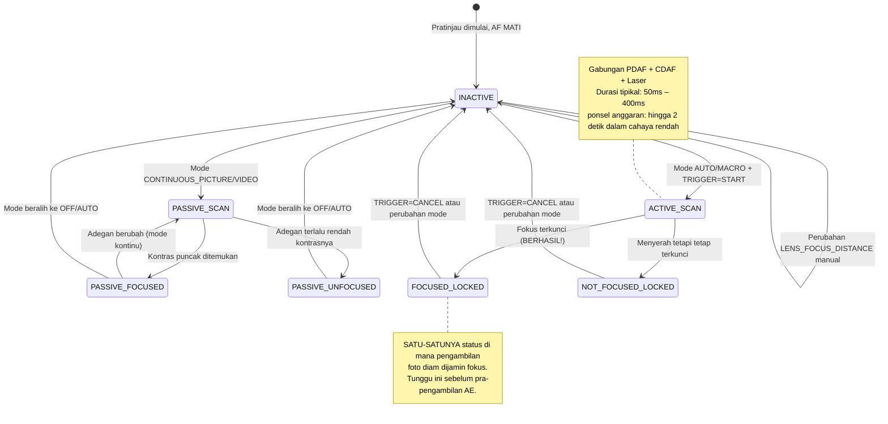

# Bab 15: Fokus

Eksposur mengontrol kecerahan. **Fokus mengontrol apa yang tajam.** Foto dengan eksposur sempurna namun dengan fokus yang lembut adalah foto yang gagal. Dalam bab ini, Anda akan mempelajari cara kerja sistem fokus smartphone, cara menggerakkan Auto Focus (AF) secara andal via Camera2, dan cara mengimplementasikan slider fokus manual yang sangat halus menggunakan `LENS_FOCUS_DISTANCE`.

[Aplikasi Android Camera Parameters](https://github.com/zoozooll/AndroidCameraParameters) mendemonstrasikan semua ini di panel Fokusnya — Anda dapat melihat transisi mesin status AF secara langsung dan menyeret slider fokus manual untuk melihat lensa bergerak dari tak terhingga ke jarak fokus minimum.

---

## Auto Focus (AF) pada Smartphone Modern

Sebelum menyelami spesifikasi API, mari kita pahami tiga mekanisme fokus fisik yang digunakan smartphone.

### 1. Contrast-Detect AF (CDAF) — Pemindaian Pasif

Teknik perangkat lunak: menganalisis bingkai gambar, mencari kontras tepi maksimum (tepi tajam = frekuensi spasial tertinggi), dan menggerakkan lensa sampai kontras puncak ditemukan.

- **Kelebihan:** Berfungsi pada perangkat keras kamera apa pun (tidak perlu piksel khusus)
- **Kekurangan:** Lambat. Lensa harus *berburu* bolak-balik di seluruh rentang fokus. Label teks adegan seperti "AF SCANNING" dalam peta status Camera2 memetakan ke hal ini.

### 2. Phase-Detect AF (PDAF) — Pemindaian Aktif

Fotodioda khusus pada sensor dibagi menjadi dua bagian. Perbedaan fase antara bagian kiri/kanan secara langsung mengukur *seberapa jauh dan ke arah mana* lensa harus bergerak — tidak perlu berburu. Ponsel unggulan saat ini menggunakan Dual-Pixel PDAF di mana *setiap* piksel melakukan deteksi fase.

- **Kelebihan:** Sangat cepat (penguncian < 100ms dalam cahaya yang baik); berfungsi andal dalam video
- **Kekurangan:** Kesulitan dalam cahaya rendah (tidak cukup foton untuk menghitung fase secara andal), dan memiliki batas jarak fokus minimum

### 3. Laser AF / ToF AF (Aktif) — Range Finder

Modul perangkat keras khusus menembakkan pulsa laser inframerah, mencatat waktu pantulannya, dan secara langsung melaporkan jarak subjek ke ISP. Sangat umum pada ponsel kelas menengah hingga premium.

- **Kelebihan:** Penguncian sangat cepat pada target apa pun, bahkan dalam kegelapan murni (jika target memantulkan IR)
- **Kekurangan:** Rentang efektif terbatas (~50cm–5m maks), gagal pada kaca atau objek transparan IR

Ponsel sungguhan menggabungkan **ketiganya**: PDAF untuk penguncian kasar yang cepat, CDAF untuk penyetelan halus, dan Laser AF untuk adegan cahaya rendah atau jarak dekat. Camera2 mengekspos pipeline terpadu ini sebagai satu mesin status abstrak.

---

## Mode AF: CONTROL_AF_MODE

Camera2 mendefinisikan mode AF ini dalam `CameraMetadata`:

| Mode (CONTROL_AF_MODE_*) | Perilaku | Kasus Penggunaan |
|-------------------------|----------|----------|
| `OFF` | Tidak ada AF sama sekali. Anda mengatur `LENS_FOCUS_DISTANCE` secara manual. | Fokus manual, focus stacking, astrofotografi (penguncian tak terhingga) |
| `AUTO` | AF satu kali (one-shot). Tidak melakukan apa-apa sampai Anda mengirim `CONTROL_AF_TRIGGER = START`, lalu memindai sekali dan mengunci. | Fotografi diam klasik point-and-shoot |
| `MACRO` | Sama seperti AUTO tetapi condong ke arah deteksi subjek dekat. | Jarak dekat, pemindaian dokumen, "mode makanan" |
| `CONTINUOUS_PICTURE` | Terus-menerus memfokuskan ulang, tetapi **menjeda pemfokusan ulang saat Anda memicu pengambilan foto diam** untuk menghindari pergeseran fokus selama pemotretan. | Default fotografi diam |
| `CONTINUOUS_VIDEO` | Terus-menerus memfokuskan ulang — tidak pernah menjeda. Mungkin berburu secara terlihat tetapi menjaga video tetap fokus. | Perekaman video, obrolan video |
| `EDOF` | Extended Depth of Field: fokus dalam yang disimulasikan perangkat lunak/firmware. Tidak ada gerakan lensa fisik. | Perangkat anggaran tanpa aktuator lensa yang bergerak |

**Dua catatan kritis:**

1. Perangkat `EDOF` (ponsel murah, kamera selfie) memiliki bidang fokus yang *tetap*. Anda tidak akan pernah mendapatkan `FOCUSED_LOCKED` dari mereka — yang terbaik yang Anda dapatkan adalah `PASSIVE_SCAN` → `PASSIVE_FOCUSED` → `INACTIVE`. [Aplikasi Android Camera Parameters](https://play.google.com/store/apps/details?id=com.minininja.cameraparams) secara eksplisit menunjukkan "Fixed Focus" untuk kamera ini.

2. Mode `CONTINUOUS_*` kembali ke `INACTIVE` setelah idle, alih-alih tetap terkunci. Jangan mengharapkan `FOCUSED_LOCKED` dalam mode kontinu — itu hanya untuk `AUTO`/`MACRO` + pemicu eksplisit.

---

## Mesin Status AF

Camera2 melaporkan status AF melalui `CaptureResult.CONTROL_AF_STATE`. Memahami status-status ini adalah *penentu utama* untuk urutan pengambilan foto diam yang andal.



Tabel referensi status:

| CONTROL_AF_STATE | Arti | Tindakan Selanjutnya |
|------------------|---------|-------------|
| `INACTIVE` (0) | AF mati, idle, atau mode kontinu sedang tidak memindai | Jika dalam mode AUTO: kirim TRIGGER_START |
| `PASSIVE_SCAN` (1) | Mode kontinu sedang memindai secara pasif | Tunggu; jangan picu pengambilan foto diam dulu |
| `PASSIVE_FOCUSED` (2) | Kontinu menemukan fokus, tetapi TIDAK terkunci (dapat bergeser) | Aman untuk memicu pengambilan foto dalam CONTINUOUS_PICTURE (ia akan mengunci) |
| `ACTIVE_SCAN` (3) | Pemicu eksplisit memulai pemindaian | Tunggu saja... |
| `NOT_FOCUSED_LOCKED` (4) | Gagal menemukan fokus, tetapi lensa tetap terkunci | Perintah peringatan pengguna; opsional coba lagi atau tetap ambil |
| `FOCUSED_LOCKED` (5) | **BERHASIL.** Fokus ditemukan dan terkunci secara perangkat keras. | Lanjutkan segera ke pemicu pra-pengambilan AE |
| `PASSIVE_UNFOCUSED` (6) | Kontinu tidak dapat mengunci, masih memindai | Tingkatkan pencahayaan atau target yang berbeda |

**Aturan yang tidak bisa ditawar untuk fotografi diam:** *Jangan pernah* mengirimkan pengambilan foto diam (terutama dengan lampu kilat!) sampai Anda melihat `FOCUSED_LOCKED`. Lewati langkah ini, dan Anda akan merilis aplikasi yang sesekali menghasilkan foto yang lembut (kurang tajam).

---

## Jarak Fokus: Dioptri, Bukan Meter

Inilah "jebakan" kedua yang sering dialami pengembang Camera2 (setelah kejutan rana-dalam-nanodetik):

**`LENS_FOCUS_DISTANCE` menggunakan dioptri (D), bukan meter.** Dioptri adalah *kebalikan matematis* dari jarak fokus:

```
Jarak Fokus (meter) = 1.0 / Dioptri
Dioptri = 1.0 / Jarak Fokus (meter)
```

| Dioptri (LENS_FOCUS_DISTANCE) | Jarak Fokus Fisik |
|--------------------------------|-------------------------|
| **0.0** | **Tak terhingga** (∞) — bintang, gunung yang jauh |
| 0.1 | 10 meter |
| 0.25 | 4 meter |
| 0.5 | 2 meter |
| 1.0 | 1 meter |
| 2.0 | 0,5 meter (50 cm) |
| 5.0 | 0,2 meter (20 cm) |
| 10.0 | 0,1 meter (10 cm) |
| 20.0 | 0,05 meter (5 cm) |

Mengapa dioptri? Karena aktuator lensa bergerak secara linear dengan *kekuatan optik*, bukan jarak fisik. Pemindaian fokus dari 0.0D → 20.0D berhubungan dengan gerakan lensa yang seragam, sedangkan pemindaian "meter" dari 10m → 5cm akan sangat tidak linear.

### Kueri Jarak Fokus Minimum

Setiap lensa memiliki jarak fokus terdekat (Anda tidak dapat memfokuskan objek yang menempel pada kaca secara fisik). Kueri jarak tersebut:

```kotlin
// Nilai dioptri maksimum yang berguna untuk lensa ini
val maxDiopters = characteristics.get(
    CameraCharacteristics.LENS_INFO_MINIMUM_FOCUS_DISTANCE
) ?: 0.0f // 0.0f = lensa EDOF fokus tetap (tidak ada kontrol fokus sama sekali!)

if (maxDiopters == 0.0f) {
    Log.w("Focus", "Ini adalah lensa fokus tetap. AF Manual dinonaktifkan.")
} else {
    // Rentang dioptri yang valid adalah [0.0f .. maxDiopters]
    Log.d("Focus", "Rentang fokus: 0.0D (inf) → $maxDiopters D (${1/maxDiopters}m dekat)")
}
```

Nilai tipikal:
- Kamera belakang ponsel anggaran: ~10D (jarak fokus minimum 10 cm)
- Kamera lebar ponsel unggulan: ~15–25D (minimum 4–7 cm)
- Kamera makro: ~30–50D (minimum 2–3 cm)
- Kamera selfie depan: Seringkali 0.0D (fokus tetap, EDOF)

### Jarak Hiperfokal (Konsep)

Fotografer lanskap menyukai ini: atur fokus ke **jarak hiperfokal**, dan segala sesuatu dari setengah jarak tersebut hingga tak terhingga akan "tajam secara memadai." Pada ponsel dengan bukaan f/1.8 dan lensa lebar standar, hiperfokal kira-kira adalah 0,5–1,0 meter.

**Aturan praktis untuk smartphone:** Mengatur `LENS_FOCUS_DISTANCE = 2.0D` (jarak fokus 50 cm) mendekati hiperfokal pada sebagian besar lensa ponsel sudut lebar. Bagus untuk fotografi lanskap dan jalanan di mana Anda tidak ingin menunggu AF.

```kotlin
// Preset hiperfokal perkiraan "semua tajam"
const val HYPERFOCAL_DIOPTERS_APPROX = 2.0f

fun setHyperfocal(builder: CaptureRequest.Builder, characteristics: CameraCharacteristics) {
    val maxD = characteristics.get(
        CameraCharacteristics.LENS_INFO_MINIMUM_FOCUS_DISTANCE
    ) ?: 0.0f
    val diopters = min(HYPERFOCAL_DIOPTERS_APPROX, maxD.takeIf { it > 0 } ?: 0.0f)
    builder.set(CaptureRequest.CONTROL_AF_MODE, CameraMetadata.CONTROL_AF_MODE_OFF)
    builder.set(CaptureRequest.LENS_FOCUS_DISTANCE, diopters)
}
```

Ingin menghitung hiperfokal tepat untuk lensa persis Anda? Anda juga akan memerlukan `LENS_INFO_AVAILABLE_FOCAL_LENGTHS` (panjang fokus dalam mm) dan pitch piksel fisik sensor. Untuk 95% kasus penggunaan smartphone, 2.0D sudah cukup dekat.

---

## Contoh Lengkap 1: Pemicu AF dan Ambil Foto Satu Kali

Ini adalah alur dasar fotografi diam untuk mode `AUTO` / `MACRO`. Ini juga merupakan urutan tepat yang akan digunakan kembali oleh orkestrasi 3A di Bab 17.

**Tujuan:** Pengguna mengetuk "Ambil Foto" → arahkan AF ke fokus terkunci → setelah terkunci, kirimkan pengambilan foto diam.

```kotlin
class AutoFocusCaptureHelper(
    private val characteristics: CameraCharacteristics,
    private val captureSession: CameraCaptureSession,
    private val previewSurface: Surface,
    private val jpegReaderSurface: Surface
) {
    private var afTriggered = false
    private var capturePlanned = false

    fun triggerAutoFocusAndCapture(onCaptureComplete: () -> Unit) {
        // ---- LANGKAH 1: Bangun permintaan berulang dengan pemicu AF eksplisit ----
        val triggerRequest = captureSession.device.createCaptureRequest(
            CameraDevice.TEMPLATE_PREVIEW
        ).apply {
            addTarget(previewSurface)

            // Gunakan mode AUTO untuk menjamin status LOCKED di akhir
            set(CaptureRequest.CONTROL_AF_MODE,
                CameraMetadata.CONTROL_AF_MODE_AUTO)

            // Tembakkan pemicu AF satu kali SEKARANG
            set(CaptureRequest.CONTROL_AF_TRIGGER,
                CameraMetadata.CONTROL_AF_TRIGGER_START)
        }

        afTriggered = true
        capturePlanned = true

        // ---- LANGKAH 2: Berlangganan ke callback pelacakan status kita ----
        captureSession.setRepeatingRequest(
            triggerRequest.build(),
            object : CameraCaptureSession.CaptureCallback() {
                override fun onCaptureCompleted(
                    session: CameraCaptureSession,
                    request: CaptureRequest,
                    result: TotalCaptureResult
                ) {
                    val afState = result.get(CaptureResult.CONTROL_AF_STATE)
                        ?: return
                    Log.d("AF", "Status AF: $afState")

                    when (afState) {
                        // --- JALUR BERHASIL ---
                        CaptureResult.CONTROL_AF_STATE_FOCUSED_LOCKED -> {
                            if (capturePlanned) {
                                capturePlanned = false
                                submitStillCapture()
                                onCaptureComplete()
                            }
                        }
                        // --- JALUR GAGAL: tidak bisa mengunci, tapi kita akan tetap mencoba ---
                        CaptureResult.CONTROL_AF_STATE_NOT_FOCUSED_LOCKED -> {
                            Log.w("AF", "AF tidak bisa mengunci — tetap mengambil foto (mungkin blur?)")
                            if (capturePlanned) {
                                capturePlanned = false
                                submitStillCapture()
                                onCaptureComplete()
                            }
                        }
                        // --- MASIH MEMINDAI: abaikan ---
                        CaptureResult.CONTROL_AF_STATE_ACTIVE_SCAN,
                        CaptureResult.CONTROL_AF_STATE_PASSIVE_SCAN -> {
                            // Masih bekerja, jangan lakukan apa pun dulu
                        }
                    }
                }
            },
            null // Handler pada thread saat ini
        )
    }

    private fun submitStillCapture() {
        val stillRequest = captureSession.device.createCaptureRequest(
            CameraDevice.TEMPLATE_STILL_CAPTURE
        ).apply {
            addTarget(previewSurface)
            addTarget(jpegReaderSurface)

            // Jaga AF tetap terkunci untuk foto ini — jangan lepaskan pemicu dulu
            set(CaptureRequest.CONTROL_AF_MODE,
                CameraMetadata.CONTROL_AF_MODE_AUTO)
            // Biarkan AF_TRIGGER apa adanya (START tetap sampai kita membatalkan secara eksplisit)

            set(CaptureRequest.JPEG_QUALITY, 95)
        }

        captureSession.capture(
            stillRequest.build(),
            object : CameraCaptureSession.CaptureCallback() {
                override fun onCaptureCompleted(
                    session: CameraCaptureSession,
                    request: CaptureRequest,
                    result: TotalCaptureResult
                ) {
                    // Foto diambil — sekarang lepaskan kunci AF, kembali ke kontinu
                    resetFocusToContinuous()
                }
            },
            null
        )
    }

    private fun resetFocusToContinuous() {
        val resumePreview = captureSession.device.createCaptureRequest(
            CameraDevice.TEMPLATE_PREVIEW
        ).apply {
            addTarget(previewSurface)
            set(CaptureRequest.CONTROL_AF_MODE,
                CameraMetadata.CONTROL_AF_MODE_CONTINUOUS_PICTURE)
            set(CaptureRequest.CONTROL_AF_TRIGGER,
                CameraMetadata.CONTROL_AF_TRIGGER_CANCEL)
        }
        afTriggered = false
        captureSession.setRepeatingRequest(resumePreview.build(), null, null)
    }
}
```

**Detail kritis:** Anda membatalkan pemicu *setelah* pengambilan foto diam selesai — bukan sebelumnya. Batalkan terlalu dini, dan lensa akan terlepas kuncinya selama pemotretan, menghasilkan foto yang lembut.

**Pengaman waktu habis (tidak ditampilkan):** Aplikasi sungguhan menambahkan waktu habis 2–3 detik pada pemindaian AF. Jika `ACTIVE_SCAN` berjalan selama 3 detik dan tidak pernah mencapai `FOCUSED_LOCKED`, batalkan dan tampilkan petunjuk pengguna "Ketuk untuk fokus pada area kontras tinggi."

---

## Contoh Lengkap 2: Slider SeekBar Fokus Manual

Ini adalah fitur Fokus Manual yang dihadapi pengguna yang Anda lihat di aplikasi kamera pro. Sebuah SeekBar memetakan rentang fokus fisik 0.0D → maxD dengan mulus.

### Layout (res/layout/fragment_manual_focus.xml)

```xml
<LinearLayout
    xmlns:android="http://schemas.android.com/apk/res/android"
    android:layout_width="match_parent"
    android:layout_height="wrap_content"
    android:orientation="vertical"
    android:padding="16dp">

    <TextView
        android:id="@+id/tvFocusLabel"
        android:layout_width="match_parent"
        android:layout_height="wrap_content"
        android:text="Fokus: ∞ (tak terhingga)"
        android:textSize="14sp"/>

    <SeekBar
        android:id="@+id/seekFocus"
        android:layout_width="match_parent"
        android:layout_height="wrap_content"
        android:max="1000"/>
</LinearLayout>
```

### Kotlin: Fragment / Activity Wiring

```kotlin
class ManualFocusController(
    private val seekBar: SeekBar,
    private val labelView: TextView,
    private val characteristics: CameraCharacteristics,
    private val captureSessionProvider: () -> CameraCaptureSession?,
    private val previewSurface: Surface
) {
    // Slider menggunakan 1000 langkah integer untuk presisi sub-dioptri
    private val sliderSteps = 1000
    private val maxDiopters = characteristics.get(
        CameraCharacteristics.LENS_INFO_MINIMUM_FOCUS_DISTANCE
    ) ?: 0.0f

    private var currentDiopters = 0.0f

    init {
        if (maxDiopters == 0.0f) {
            seekBar.isEnabled = false
            labelView.text = "Fokus Tetap (Tidak ada AF manual)"
        } else {
            bindSeekBar()
            applyFocus(0.0f) // Mulai pada tak terhingga
        }
    }

    private fun bindSeekBar() {
        // Konversi slider int [0..1000] ↔ dioptri [0.0 .. maxDiopters]
        seekBar.setOnSeekBarChangeListener(object : SeekBar.OnSeekBarChangeListener {
            private var lastUpdate = 0L

            override fun onProgressChanged(seekBar: SeekBar, progress: Int, fromUser: Boolean) {
                if (!fromUser) return

                // Batasi ke ~30fps (33ms) — menghindari membebani HAL dengan permintaan
                val now = SystemClock.elapsedRealtime()
                if (now - lastUpdate < 33L) return
                lastUpdate = now

                val diopters = progress.toFloat() / sliderSteps.toFloat() * maxDiopters
                applyFocus(diopters)
            }
            override fun onStartTrackingTouch(seekBar: SeekBar) {
                // Segera beralih ke mode AF manual penuh saat pengguna mulai menyeret
                switchToManualMode()
            }
            override fun onStopTrackingTouch(seekBar: SeekBar) {
                // Terapkan nilai tepat akhir untuk menghapus kesalahan pembatasan (throttle)
                val diopters = seekBar.progress.toFloat() / sliderSteps.toFloat() * maxDiopters
                applyFocus(diopters, force = true)
            }
        })
    }

    private fun switchToManualMode() {
        // CONTROL_AF_MODE_OFF menonaktifkan penggerak otomatis motor AF
        val session = captureSessionProvider() ?: return
        val request = session.device.createCaptureRequest(
            CameraDevice.TEMPLATE_PREVIEW
        ).apply {
            addTarget(previewSurface)
            set(CaptureRequest.CONTROL_AF_MODE, CameraMetadata.CONTROL_AF_MODE_OFF)
            set(CaptureRequest.CONTROL_MODE, CameraMetadata.CONTROL_MODE_USE_SCENE_MODE)
        }
        session.setRepeatingRequest(request.build(), null, null)
    }

    fun applyFocus(diopters: Float, force: Boolean = false) {
        currentDiopters = diopters.coerceIn(0.0f, maxDiopters)

        // Perbarui label: tunjukkan "∞" untuk < 0.1D, "X.Y m" untuk lainnya
        labelView.text = when {
            currentDiopters < 0.1f -> "Fokus: ∞ (tak terhingga)"
            else -> {
                val meters = 1.0f / currentDiopters
                String.format("Fokus: %.1f D  (%.2f m)", currentDiopters, meters)
            }
        }

        // Bangun dan kirimkan permintaan berulang dengan jarak fokus baru
        val session = captureSessionProvider() ?: return
        val request = session.device.createCaptureRequest(
            CameraDevice.TEMPLATE_PREVIEW
        ).apply {
            addTarget(previewSurface)
            set(CaptureRequest.CONTROL_AF_MODE, CameraMetadata.CONTROL_AF_MODE_OFF)
            set(CaptureRequest.LENS_FOCUS_DISTANCE, currentDiopters)
        }

        // Gunakan setRepeatingRequest agar setiap bingkai pratinjau mematuhi fokus baru
        session.setRepeatingRequest(request.build(), null, null)
    }

    // --- Pembantu preset ---
    fun setInfinity() { seekBar.progress = 0; applyFocus(0.0f, true) }
    fun setHyperfocalApprox() {
        val d = min(2.0f, maxDiopters)
        seekBar.progress = (d / maxDiopters * sliderSteps).toInt()
        switchToManualMode()
        applyFocus(d, true)
    }
    fun setNearest() { seekBar.progress = sliderSteps; applyFocus(maxDiopters, true) }
}
```

**Detail implementasi utama:**

1. **Pembatasan (Throttle).** SeekBar memicu `onProgressChanged` hingga 200Hz. Mengirimkan `setRepeatingRequest` pada setiap peristiwa akan membanjiri HAL dengan pekerjaan, menyebabkan lag. Pembatasan 33ms membatasi pembaruan ke ~30fps — sudah sangat halus untuk kecepatan fisik motor lensa.

2. **Beralih ke CONTROL_AF_MODE_OFF lebih awal.** Jika Anda berada dalam `CONTINUOUS_PICTURE` dan mengatur `LENS_FOCUS_DISTANCE` tanpa menonaktifkan AF, algoritma AF akan *melawan Anda* — mengembalikan fokus ke apa yang dianggapnya benar satu bingkai kemudian. Peralihan harus terjadi terlebih dahulu, di `onStartTrackingTouch`.

3. **Perbarui via `setRepeatingRequest`**, bukan `capture()` sekali jalan. Fokus manual perlu bertahan pada *setiap* bingkai pratinjau sampai pengguna menggerakkan slider lagi.

4. **Terapkan paksa saat dilepas.** Pembatasan melewatkan posisi perantara; saat pengguna mengangkat jari mereka, terapkan nilai slider akhir yang tepat.

---

## Wilayah Fokus (Ketuk-untuk-Fokus)

Aplikasi kamera modern memungkinkan Anda *mengetuk jendela bidik (viewfinder)* untuk memilih target fokus. Camera2 mengimplementasikan ini via `CONTROL_AF_REGIONS` — daftar persegi panjang (dalam ruang koordinat array aktif) dengan bobot.

```kotlin
// Konversi ketukan (x,y) Jendela Bidik menjadi wilayah koordinat Sensor CameraCharacteristics
fun createTapFocusRegion(viewfinderWidth: Int, viewfinderHeight: Int,
                         tapX: Float, tapY: Float,
                         characteristics: CameraCharacteristics): MeteringRectangle {
    val activeArray = characteristics.get(
        CameraCharacteristics.SENSOR_INFO_ACTIVE_ARRAY_SIZE
    )!!
    // Normalisasi ketukan [0..1] di setiap sumbu
    val nx = tapX / viewfinderWidth.toFloat()
    val ny = tapY / viewfinderHeight.toFloat()
    // Petakan ke array aktif sensor, buat wilayah 200×200 yang berpusat pada ketukan
    val cx = (nx * activeArray.width()).toInt()
    val cy = (ny * activeArray.height()).toInt()
    val rSize = 200
    return MeteringRectangle(
        max(0, cx - rSize/2), max(0, cy - rSize/2),
        rSize, rSize,
        MeteringRectangle.METERING_WEIGHT_MAX
    )
}

// Lampirkan wilayah ke builder permintaan
fun applyTapFocus(builder: CaptureRequest.Builder, region: MeteringRectangle) {
    builder.set(CaptureRequest.CONTROL_AF_REGIONS, arrayOf(region))
    builder.set(CaptureRequest.CONTROL_AE_REGIONS, arrayOf(region)) // Hubungkan spot AE juga!
    builder.set(CaptureRequest.CONTROL_AF_TRIGGER,
        CameraMetadata.CONTROL_AF_TRIGGER_CANCEL) // Batalkan penguncian sebelumnya
    builder.set(CaptureRequest.CONTROL_AF_TRIGGER,
        CameraMetadata.CONTROL_AF_TRIGGER_START)  // Picu pemindaian pada wilayah baru
}
```

**Tip pro:** Selalu hubungkan `CONTROL_AE_REGIONS` agar cocok dengan `CONTROL_AF_REGIONS`. Pengguna mengetuk wajah karena mereka ingin wajah tersebut *sekaligus* fokus *dan* terekspos dengan benar — bukan fokus pada wajah tetapi metering berdasarkan langit cerah di belakangnya.

---

## Pemecahan Masalah Masalah Fokus

| Gejala | Akar Masalah | Perbaikan |
|---------|-----------|-----|
| Status AF tidak pernah melewati ACTIVE_SCAN | Adegan kontras rendah (dinding putih, langit biru murni) atau kegagalan perangkat keras | Berikan batas waktu setelah ~3 detik; beri tahu pengguna; kembali ke preset hiperfokal |
| Slider fokus manual tidak melakukan apa-apa | Lupa menyetel `CONTROL_AF_MODE = OFF` → AF sedang melawan Anda | Panggil `switchToManualMode()` di onStartTrackingTouch |
| Foto diam tampak blur meskipun FOCUSED_LOCKED | Membatalkan pemicu AF *sebelum* pengambilan foto diam selesai | Batalkan hanya di `onCaptureCompleted` dari permintaan *diam* |
| Kamera depan mengabaikan perintah fokus | Lensa fokus tetap EDOF (`MINIMUM_FOCUS_DISTANCE == 0`) | Degradasi halus: nonaktifkan UI fokus untuk kamera tersebut |
| AF Video sering "berburu" | Menggunakan `CONTINUOUS_PICTURE` alih-alih `CONTINUOUS_VIDEO` untuk perekaman video | Beralih mode ke CONTINUOUS_VIDEO saat MediaRecorder dimulai |

---

## Ringkasan

Fokus di Camera2 adalah mesin status yang harus Anda gerakkan secara eksplisit, bukan pengaturan "atur dan lupakan":

- **Perangkat Keras AF:** Smartphone menggabungkan Contrast-Detect AF, Phase-Detect AF (Dual-Pixel), dan Laser AF untuk penguncian yang cepat dan andal.
- **Mode:** `AUTO` (satu kali, mengunci), `CONTINUOUS_PICTURE` (memfokuskan ulang, jeda untuk foto diam), `CONTINUOUS_VIDEO` (selalu memfokuskan ulang), `MACRO`, `OFF` (manual). Lensa EDOF tidak memiliki fokus yang dapat digerakkan.
- **Status:** Tunggu `FOCUSED_LOCKED` (bukan hanya `PASSIVE_FOCUSED`) sebelum pengambilan foto diam yang berharga.
- **Dioptri:** `LENS_FOCUS_DISTANCE` menggunakan kebalikan jarak (0.0D = ∞, 10D = 10 cm). Rentang adalah `[0.0 .. LENS_INFO_MINIMUM_FOCUS_DISTANCE]`.
- **Pengambilan foto AF satu kali:** `TRIGGER = START` → tunggu `FOCUSED_LOCKED` → kirim foto diam → kemudian `CANCEL`.
- **Slider fokus manual:** SeekBar dengan 1000 langkah, dibatasi ke 30fps; beralih mode ke `AF_MODE_OFF` terlebih dahulu agar algoritma otomatis tidak melawan pengaturan manual Anda.
- **Ketuk-untuk-Fokus menggunakan `CONTROL_AF_REGIONS`** dalam koordinat array aktif sensor. Pasangkan dengan `AE_REGIONS` untuk hasil pro.

## Apa Selanjutnya

Kecerahan ✓ Ketajaman ✓. Sekarang mari kita perbaiki **warna**. Di **Bab 16: Keseimbangan Putih & Warna**, kita membahas:

- Auto White Balance (AWB) dan 7 preset (Pijar → Teduh)
- Koreksi warna manual dengan `COLOR_CORRECTION_GAINS` (4-saluran R/G/B/G) dan `COLOR_CORRECTION_TRANSFORM` (matriks RGB 3×3)
- Konsep suhu warna (lilin 2000K → teduh 10000K) dan bagaimana ia memetakan ke white balance
- Kode kerja untuk preset "tampilan matahari terbenam" nada hangat dan mode AWB off manual penuh

Warna adalah kaki terakhir dari trilogi kontrol manual.
