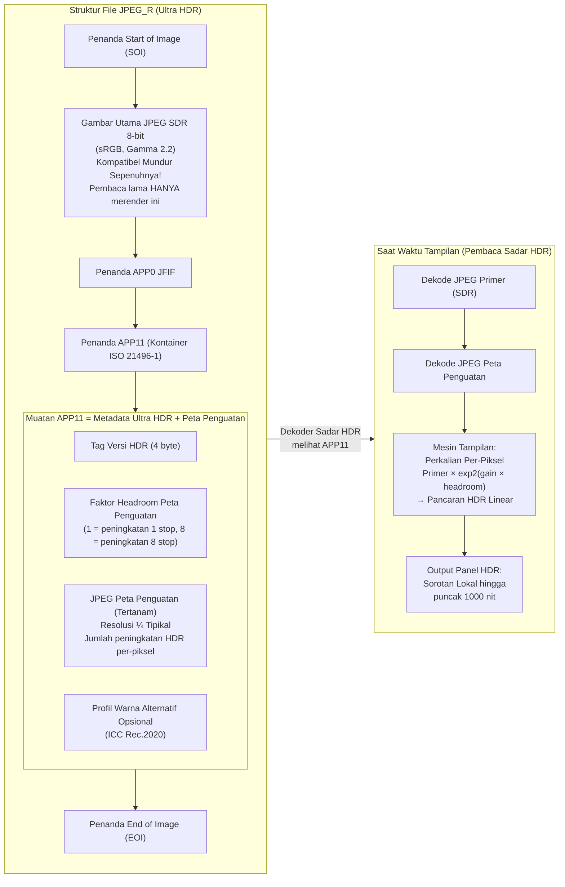

# Bab 21: HDR & Ultra HDR

Fotografi Standard Dynamic Range (SDR) — sRGB 8-bit-per-saluran yang dikodekan dengan kurva gamma 2.2 dan di-master untuk layar 100-nit — dirancang untuk CRT tahun 1990-an. Sensor smartphone modern menangkap **10–14 stop rentang dinamis (dynamic range)** (kontras adegan 1024:1 hingga 16384:1), tetapi JPEG SDR 8-bit hanya dapat merender ~6 stop sebelum sorotan (highlights) terbakar atau bayangan (shadows) hancur menjadi noise. Format **High Dynamic Range (HDR)** memecahkan masalah ini dengan menyimpan pancaran adegan dalam 10+ bit per saluran, menggunakan fungsi transfer yang seragam secara persepsi atau yang dirujuk ke adegan, dan menargetkan luminositas tampilan puncak 1.000–10.000 nit, bukan 100.

Bab ini mencakup tiga standar HDR yang berfungsi di Android Camera2:
- **HDR10** (10-bit, ST.2084 PQ, Rec.2020, metadata statis) untuk video
- **HLG (Hybrid Log-Gamma)** (10-bit, kompatibel mundur dengan SDR, ARIB STD-B67) untuk siaran dan video
- **JPEG_R / Ultra HDR** (Android 14 API 34+, ISO 21496-1) — format foto diam revolusioner yang menyematkan "peta penguatan" (gain map) sekunder di dalam JPEG SDR 8-bit standar sehingga pembaca lama melihat foto normal, sementara layar HDR meningkatkan sorotan secara lokal hingga 8 stop

Ketiganya didokumentasikan dalam bagian *Ultra HDR / JPEG_R* dan *Dynamic Range* dari dokumen penelitian proyek, yang juga menentukan mandat Android CDD (Compatibility Definition Document) Performance Class 15 bahwa semua perangkat unggulan tahun 2024+ harus mengekspos JPEG_R sebagai format output pada ukuran foto diam maksimum. Anda dapat memverifikasi dukungan HDR10, HLG, dan JPEG_R per ID kamera di aplikasi [Android Camera Parameters](https://github.com/zoozooll/AndroidCameraParameters) di [Play Store](https://play.google.com/store/apps/details?id=com.zoozooll.cameraparameters), yang menghitung setiap kunci `DynamicRangeProfiles` dan melaporkan apakah `ImageFormat.JPEG_R` muncul di `getOutputSizes()`.

## Dasar-dasar Rentang Dinamis: Mengapa 8 Bit Tidak Cukup

Sebelum mendalami format tertentu, definisikan apa arti "rentang dinamis" untuk tampilan vs pengambilan:

| Metrik | SDR (sRGB/BT.709) | HDR10 (BT.2100) | Penglihatan Manusia |
|--------|-------------------|------------------|--------------|
| **Kedalaman bit** | 8 bit / saluran (256 level) | 10 bit / saluran (1024 level) | ~4,8 bit perseptual, tetapi logaritmik |
| **Luminans puncak** | 100 nit (cd/m²) | 1.000+ nit puncak (tergantung konten) | ~20.000 nit (matahari+langit) hingga ~0,001 nit (ruangan gelap) |
| **Fungsi transfer** | Gamma 2.2 atau sRGB sepotong-sepotong | ST.2084 Perceptual Quantizer (PQ) | Respons logaritmik (hukum Weber-Fechner) |
| **Gamut warna** | sRGB / BT.709 (~35% dari yang terlihat) | Rec.2020 (~75% dari yang terlihat) | Spektrum penuh yang terlihat |
| **Rasio kontras (berguna)** | ~6 stop (64:1) | ~10 stop (1024:1) minimum | ~14 stop (16384:1) dalam satu adegan |

Kurva gamma yang digunakan oleh SDR direkayasa agar cocok dengan non-linearitas pistol elektron CRT tahun 1990-an, bukan sistem visual manusia. Kurva PQ (Perceptual Quantizer) yang digunakan oleh HDR10 distandarisasi pada tahun 2014 oleh Dolby dan BBC di bawah ST.2084, dan secara matematis cocok dengan model Barten sensitivitas kontras manusia — sehingga masing-masing dari 1.024 nilai kode dalam PQ 10-bit mewakili perbedaan yang baru saja terlihat (just-noticeable difference / JND) dalam kecerahan di seluruh rentang 0–10.000 nit penuh.

```mermaid
flowchart TD
    subgraph SDRpath["Jalur Pengambilan SDR 8-bit → Pipeline Tampilan"]
        S1["Sensor Linear<br/>RAW 14-bit"] --> S2["Kurva Gamma 2.2<br/>(Menghancurkan Detail Bayangan)"]
        S2 --> S3["Kuantisasi 8-bit<br/>(Hanya 22 kode untuk<br/>luminans 0–10%)"]
        S3 --> S4["Pemotongan Gamut sRGB<br/>(25% warna hilang)"]
        S4 --> S5["Puncak 100 nit<br/>(Langit/Matahari Terpotong Putih)"]
    end

    subgraph HDRpath["Jalur Pengambilan HDR10 10-bit → Pipeline Tampilan"]
        H1["Sensor Linear<br/>RAW 14-bit"] --> H2["Kurva ST.2084 PQ<br/>(Cocok dengan model JND)"]
        H2 --> H3["Kuantisasi 10-bit<br/>(140 kode untuk<br/>luminans 0–10%)"]
        H3 --> H4["Gamut Rec.2020<br/>(75% warna yang terlihat)"]
        H4 --> H5["Puncak 1000+ nit<br/>(Detail Langit Terjaga)"]
    end

    style SDRpath fill:#ffeded,stroke:#b91c1c
    style HDRpath fill:#e8fff0,stroke:#15803d
```



Diagram Mermaid di atas menguantifikasi dua perbedaan terpenting: SDR hanya menggunakan ~22 kode 8-bit untuk 10% bawah luminans (menyebabkan banding bayangan saat ditarik ke atas), sementara PQ mengalokasikan 140 kode 10-bit untuk rentang yang sama. Keseragaman perseptual kurva PQ adalah alasan mengapa HDR 10-bit terlihat lebih halus daripada SDR 8-bit bahkan ketika di-down-sample ke 100 nit pada layar SDR.

## Video HDR10: PQ 10-bit + Rec.2020 + Metadata Statis

HDR10 adalah format video HDR dasar — setiap smartphone tahun 2021+ dengan layar OLED mendukung pemutaran HDR10, dan setiap SoC Snapdragon 865+ / Exynos 2100+ mendukung perekaman HDR10 melalui Camera2. Format tersebut menentukan:

- Pengkodean **Profil HEVC Main10** (H.265) dengan sampel 10-bit
- Fungsi transfer **ST.2084 PQ** sebagai pengganti gamma
- Primari warna **Rec.2020 (BT.2100)** (wide-gamut)
- **Metadata statis** (SMPTE ST 2086 / CTA-861.3) dalam pesan SEI HEVC:
  - `max_content_light_level` (MaxCLL): luminans puncak dari satu piksel tunggal, dalam nit
  - `max_frame_average_light_level` (MaxFALL): luminans rata-rata dari bingkai paling terang
  - `display_primaries` dan `white_point`: volume warna layar mastering
  - `max_luminance` / `min_luminance`: puncak dan tingkat hitam layar mastering

Metadata statis berarti tepat satu set nilai berlaku untuk seluruh durasi video. Varian metadata dinamis (HDR10+, alternatif Samsung untuk Dolby Vision) tidak diekspos melalui Camera2 standar — ia memerlukan ekstensi vendor — tetapi metadata statis HDR10 didukung secara universal via `DynamicRangeProfiles`.

### Kueri Dukungan HDR10 dan HLG via DynamicRangeProfiles

Android 13 (API 33) memperkenalkan `CameraCharacteristics.REQUEST_AVAILABLE_DYNAMIC_RANGE_PROFILES` sebagai alternatif terstruktur untuk memeriksa dukungan format 10-bit secara manual di `StreamConfigurationMap`. Setiap surface output memiliki profil yang dipilih pada saat pembuatan sesi:

```kotlin
import android.hardware.camera2.CameraCharacteristics
import android.hardware.camera2.params.DynamicRangeProfiles
import android.util.Size

data class HdrVideoProfile(
    val profile: Long, // DynamicRangeProfiles.HDR10, HLG10, dll.
    val supportedSizes: List<Size>,
    val standardSizesFallbacks: List<Size>
)

fun enumerateHdrProfiles(
    characteristics: CameraCharacteristics
): List<HdrVideoProfile> {
    val profiles: DynamicRangeProfiles? =
        characteristics.get(
            CameraCharacteristics.REQUEST_AVAILABLE_DYNAMIC_RANGE_PROFILES
        ) ?: return emptyList()

    val configMap = characteristics.get(
        CameraCharacteristics.SCALER_STREAM_CONFIGURATION_MAP
    ) ?: return emptyList()

    return listOf(
        DynamicRangeProfiles.HDR10,
        DynamicRangeProfiles.HLG,
        DynamicRangeProfiles.HDR10_PLUS, // Seringkali null pada perangkat non-Samsung
        DynamicRangeProfiles.DOLBY_VISION_10B_HDR_OEM // Butuh lisensi Dolby
    ).mapNotNull { profile ->
        if (!profiles.isProfileSupported(profile)) return@mapNotNull null

        val hdrSizes = profiles.getProfileSupportedSizes(profile)
            ?.toList() ?: emptyList()
        val sdrFallbackSizes = configMap.getOutputSizes(
            android.graphics.ImageFormat.PRIVATE
        )?.toList() ?: emptyList()

        HdrVideoProfile(profile, hdrSizes, sdrFallbackSizes)
    }
}
```

Metode `DynamicRangeProfiles.getProfileSupportedSizes(profile)` mengembalikan *irisan* antara ukuran yang mampu 10-bit dan dukungan pipeline HDR ISP. Jika `Size(3840, 2160)` (4K UHD) tidak muncul di `getProfileSupportedSizes(HDR10)`, maka meskipun 4K SDR didukung, HAL tidak memiliki throughput ISP yang cukup untuk pengkodean HDR10 4K (biasanya batas 600-Mpixel/detik pada seri Snapdragon 8). Aplikasi Android Camera Parameters merender tabel irisan ini di tab HDR sehingga Anda dapat memverifikasi sebelum menulis kode sesi.

### Menyetel HDR10 pada OutputConfiguration untuk Perekaman

Profil rentang dinamis harus disetel **sebelum sesi dibuat** melalui `OutputConfiguration.setDynamicRangeProfile()`. Mengubah profil di tengah sesi memerlukan pembongkaran dan pembuatan ulang sesi.

```kotlin
import android.hardware.camera2.params.DynamicRangeProfiles
import android.hardware.camera2.params.OutputConfiguration
import android.media.MediaCodec
import android.media.MediaCodecInfo
import android.view.Surface

fun createHdr10VideoOutput(
    encoderSurface: Surface,
    previewSurface: Surface
): Pair<OutputConfiguration, OutputConfiguration> {
    val encodeOutConfig = OutputConfiguration(encoderSurface).apply {
        setDynamicRangeProfile(DynamicRangeProfiles.HDR10)
    }
    val previewOutConfig = OutputConfiguration(previewSurface).apply {
        setDynamicRangeProfile(DynamicRangeProfiles.HDR10)
    }
    return Pair(encodeOutConfig, previewOutConfig)
}

fun configureHdr10MediaCodec(width: Int, height: Int): MediaCodec {
    val codec = MediaCodec.createEncoderByType("video/hevc")
    val format = android.media.MediaFormat.createVideoFormat(
        "video/hevc", width, height
    ).apply {
        setInteger(MediaFormat.KEY_COLOR_FORMAT,
            MediaCodecInfo.CodecCapabilities.COLOR_FormatSurface)
        setInteger(MediaFormat.KEY_BIT_RATE, 80_000_000) // 80 Mbps untuk HDR10 4K
        setInteger(MediaFormat.KEY_FRAME_RATE, 30)
        setInteger(MediaFormat.KEY_I_FRAME_INTERVAL, 1)
        setInteger(MediaFormat.KEY_PROFILE,
            MediaCodecInfo.CodecProfileLevel.HEVCProfileMain10)
        setInteger(MediaFormat.KEY_COLOR_STANDARD,
            MediaFormat.COLOR_STANDARD_BT2020)
        setInteger(MediaFormat.KEY_COLOR_TRANSFER,
            MediaFormat.COLOR_TRANSFER_ST2084) // ST.2084 PQ
        setInteger(MediaFormat.KEY_COLOR_RANGE,
            MediaFormat.COLOR_RANGE_LIMITED)
        setFeatureEnabled(MediaCodecInfo.CodecCapabilities.FEATURE_HdrEditing, true)
    }
    codec.configure(format, null, null, MediaCodec.CONFIGURE_FLAG_ENCODE)
    return codec
}
```

Tiga kunci `COLOR_*` (`BT2020`, `ST2084`, `LIMITED`) dikombinasikan dengan `HEVCProfileMain10` menciptakan aliran HDR10 yang tepat secara bit. Jika Anda mengabaikan `KEY_COLOR_TRANSFER` atau menyetelnya ke nilai yang salah (misalnya `COLOR_TRANSFER_GAMMA_2_2`), YouTube dan pemutar lainnya akan menafsirkan aliran 10-bit sebagai SDR dan memutarnya dengan warna yang pudar atau terlalu jenuh.

## HLG (Hybrid Log-Gamma): HDR Siaran yang Kompatibel Mundur dengan SDR

HLG (distandarisasi sebagai ARIB STD-B67 oleh BBC dan NHK pada tahun 2015) dirancang untuk televisi langsung, di mana Anda tidak dapat mengetahui sebelumnya apakah penonton memiliki layar HDR atau SDR. Inovasi HLG adalah **fungsi transfer hibrida sepotong-sepotong**:
- Bagian bawah 50% dari rentang kode adalah kurva gamma standar (cocok persis dengan SDR)
- Bagian atas 50% adalah kurva logaritmik (menyimpan detail sorotan HDR)

Ini berarti video HLG yang diputar di layar SDR terlihat identik dengan video gamma 2.2 SDR yang disetel dengan benar, sementara layar HDR "membuka kunci" bagian atas logaritmik dan merender sorotan hingga 1.000 nit tanpa sinyal metadata apa pun. Tidak diperlukan pemetaan nada SDR→HDR yang eksplisit.

Untuk penggunaan video, HLG berbeda dari HDR10 dalam tiga hal yang relevan dengan Camera2:
1. **Tidak memerlukan metadata statis** — HLG merujuk ke adegan, sehingga tampilan menurunkan kecerahan puncak dari sinyal itu sendiri. Ini menyederhanakan konfigurasi MediaCodec (tidak ada penyisipan SEI untuk MaxCLL/MaxFALL).
2. **Konstanta transfer warna yang berbeda** — gunakan `MediaFormat.COLOR_TRANSFER_HLG`, bukan `ST2084`.
3. **Pemeriksaan `DynamicRangeProfiles.HLG`**, bukan `HDR10`.

Semua penggunaan API lainnya (OutputConfiguration.setDynamicRangeProfile, pembuatan sesi, CaptureRequest) identik dengan HDR10. Dokumen penelitian mencatat bahwa HLG adalah format pilihan untuk video buatan pengguna yang dibagikan ke platform sosial, karena ia merender dengan benar pada layar SDR maupun HDR tanpa artefak pemetaan nada.

## JPEG_R (Ultra HDR): SDR ISO 21496-1 + Peta Penguatan Tertanam

Kemajuan terbesar dalam fotografi HDR seluler sejak pengambilan gambar HDR multi-bingkai adalah **JPEG_R**, diperkenalkan di Android 14 (API 34) dan dikodifikasikan sebagai standar internasional **ISO 21496-1**. Format ini kompatibel mundur berdasarkan konstruksinya:

> File JPEG_R adalah JPEG SDR 8-bit standar dengan **JPEG sekunder yang lebih kecil ("peta penguatan" atau gain map)** yang disematkan dalam segmen penanda `APP11` menggunakan format kontainer ISO 21496-1. Dekoder JPEG lama mengabaikan penanda APP yang tidak dikenal dan hanya merender primer 8-bit. Dekoder yang sadar HDR membaca primer dan peta penguatan, dan merekonstruksi pancaran adegan HDR linear asli dengan mengalikan nilai piksel primer dengan exp2(piksel_peta_penguatan × faktor_headroom) secara per-piksel.

"Peningkatan per-piksel" inilah yang membuat Ultra HDR menjadi HDR *secara lokal* (tidak seperti metadata statis HDR10, yang menerapkan satu nilai puncak secara global). Peta penguatan ISO 21496-1 pada resolusi ¼ (tipikal) dapat menyandikan hingga **8 stop headroom sorotan lokal** — cukup untuk memulihkan detail awan saat matahari terbenam sambil menjaga nada tengah pada luminans SDR alami.

Mandat Android CDD Performance Class 15:
- Semua perangkat yang mengiklankan CDD PC-15 (unggulan 2024+ sesuai tabel spek CDD) **WAJIB** mendukung output `ImageFormat.JPEG_R` pada ukuran pengambilan foto diam maksimum.
- Ukuran pengambilan foto diam maksimum untuk JPEG_R harus ≥ ukuran YUV maksimum untuk ID kamera tersebut.

Bagian *Ultra HDR / JPEG_R* dari dokumen penelitian berisi rincian tata letak penanda APP11 tingkat byte yang lengkap, tetapi untuk API Camera2 Anda hanya perlu memperlakukan `ImageFormat.JPEG_R` sebagai buffer output buram tunggal — HAL merakit primer + peta penguatan secara internal.



Detail kritis dalam diagram Mermaid: JPEG PRIMER adalah foto SDR 8-bit yang sepenuhnya valid, sehingga bahkan pustaka JPEG era 2010-an pun dapat merender gambar yang terlihat benar. Data HDR bersifat *tambahan*, tidak menggantikan file primer — inilah sebabnya file JPEG_R bekerja mulus dengan setiap platform berbagi foto yang ada (Instagram, Google Photos, Pesan) yang belum memiliki dekoder Ultra HDR.

### Kueri Dukungan JPEG_R dan Mengambil Foto Diam Ultra HDR

Mengambil foto diam Ultra HDR secara fungsional identik dengan mengambil JPEG standar, dengan dua perbedaan:
1. Kueri `ImageFormat.JPEG_R` di `StreamConfigurationMap.getOutputSizes()`, bukan `ImageFormat.JPEG`
2. Jika Anda menggunakan `DynamicRangeProfiles` (direkomendasikan), setel profil output JPEG_R ke `DynamicRangeProfiles.JPEG_R`

```kotlin
import android.graphics.ImageFormat
import android.hardware.camera2.CameraCharacteristics
import android.hardware.camera2.CameraDevice
import android.hardware.camera2.CaptureRequest
import android.hardware.camera2.params.DynamicRangeProfiles
import android.hardware.camera2.params.OutputConfiguration
import android.media.ImageReader
import android.util.Size

var jpegRImageReader: ImageReader? = null

fun queryJpegRSupport(
    characteristics: CameraCharacteristics
): Pair<Boolean, Size?> {
    val caps = characteristics.get(
        CameraCharacteristics.REQUEST_AVAILABLE_CAPABILITIES
    ) ?: intArrayOf()
    val supportsDynamicRange = caps.contains(
        CameraCharacteristics.REQUEST_AVAILABLE_CAPABILITIES_DYNAMIC_RANGE_TEN_BIT
    )
    val drProfiles = characteristics.get(
        CameraCharacteristics.REQUEST_AVAILABLE_DYNAMIC_RANGE_PROFILES
    )
    val supportsJpegRProfile =
        drProfiles?.isProfileSupported(DynamicRangeProfiles.JPEG_R) == true

    val configMap = characteristics.get(
        CameraCharacteristics.SCALER_STREAM_CONFIGURATION_MAP
    ) ?: return Pair(false, null)

    val jpegRSizes = configMap.getOutputSizes(ImageFormat.JPEG_R)
        ?: emptyArray()
    val maxJpegR = jpegRSizes.maxByOrNull { it.width * it.height }

    return Pair(
        supportsDynamicRange && supportsJpegRProfile && jpegRSizes.isNotEmpty(),
        maxJpegR
    )
}

fun setupJpegRCapture(
    cameraDevice: CameraDevice,
    maxJpegRSize: Size,
    previewSurface: Surface
) {
    jpegRImageReader = ImageReader.newInstance(
        maxJpegRSize.width, maxJpegRSize.height,
        ImageFormat.JPEG_R, 2
    )

    val jpegROutput = OutputConfiguration(
        jpegRImageReader!!.surface
    ).apply {
        setDynamicRangeProfile(DynamicRangeProfiles.JPEG_R)
    }
    val previewOutput = OutputConfiguration(previewSurface)

    val outputs = listOf(previewOutput, jpegROutput)
    val sessionConfig = android.hardware.camera2.params.SessionConfiguration(
        android.hardware.camera2.params.SessionConfiguration.SESSION_REGULAR,
        outputs,
        { r -> backgroundHandler.post(r) },
        object : android.hardware.camera2.CameraCaptureSession.StateCallback() {
            override fun onConfigured(
                session: android.hardware.camera2.CameraCaptureSession
            ) {
                val stillBuilder = cameraDevice.createCaptureRequest(
                    CameraDevice.TEMPLATE_STILL_CAPTURE
                ).apply {
                    addTarget(previewSurface)
                    addTarget(jpegRImageReader!!.surface)
                    set(CaptureRequest.CONTROL_MODE,
                        CaptureRequest.CONTROL_MODE_USE_SCENE_MODE)
                    set(CaptureRequest.CONTROL_SCENE_MODE,
                        CaptureRequest.CONTROL_SCENE_MODE_HDR)
                    // Picu pipeline bracketing HDR multi-bingkai dan penggabungan HAL sebelum pengkodean JPEG_R
                }

                session.capture(stillBuilder.build(),
                    JpegRCaptureCallback(), backgroundHandler)
            }
            override fun onConfigureFailed(
                s: android.hardware.camera2.CameraCaptureSession
            ) = Log.e(TAG, "Sesi JPEG_R gagal")
        }
    )
    cameraDevice.createCaptureSession(sessionConfig)
}
```

Menyetel `CONTROL_SCENE_MODE_HDR` bersamaan dengan `TEMPLATE_STILL_CAPTURE` memicu pipeline bracketing HDR multi-bingkai dan penggabungan milik HAL — biasanya 3 bingkai pada -2 / 0 / +2 EV, diselaraskan dan digabungkan sebelum dipecah menjadi primer SDR + peta penguatan 8-stop untuk pengkodean ISO 21496-1. Mengabaikan mode adegan tetap menghasilkan file JPEG_R yang valid, tetapi headroom peta penguatan akan terbatas pada DR asli sensor (~10 stop), bukan DR penggabungan komputasional (~14–16 stop).

### Menerima dan Menyimpan Gambar JPEG_R

`OnImageAvailableListener` untuk JPEG_R identik secara byte dengan listener JPEG — HAL telah menggabungkan primer + peta penguatan APP11 menjadi satu buffer tunggal:

```kotlin
import java.io.File
import java.io.FileOutputStream

inner class JpegRCaptureCallback : ImageReader.OnImageAvailableListener {
    override fun onImageAvailable(reader: ImageReader) {
        reader.acquireLatestImage()?.use { image ->
            val buffer = image.planes[0].buffer
            val jpegRBytes = ByteArray(buffer.remaining())
            buffer.get(jpegRBytes)

            val outFile = File(getExternalFilesDir(null),
                "ULTRA_HDR_${System.currentTimeMillis()}.jpg")
            FileOutputStream(outFile).use { it.write(jpegRBytes) }
        }
    }
}
```

Menyimpan sebagai `.jpg` (bukan ekstensi kustom) sangat penting untuk kompatibilitas — penampil foto lama melihat ekstensi file sebelum memeriksa konten file, dan ekstensi `.jpg` menjamin mereka akan mencoba mendekode primer SDR standar sebelum mereka melihat penanda APP11.

## Ringkasan Perbandingan Format HDR

| Kriteria | HDR10 (Video) | HLG (Video) | JPEG_R / Ultra HDR (Foto Diam) |
|-----------|---------------|-------------|-----------------------------|
| **Kedalaman bit** | HEVC Main10 10-bit | HEVC Main10 10-bit | primer 8-bit + peta penguatan 8-bit → setara bersih ~12 bit |
| **Nit puncak (konten)** | 1.000–10.000 (metadata statis) | Tipikal 1.000 nit (dirujuk ke adegan) | ~2.000 nit (8 stop × headroom 8-bit per ISO 21496-1) |
| **Kompatibel mundur** | Tidak — pemutaran SDR terlihat pudar tanpa pemetaan nada | **Ya** — layar SDR merender bagian gamma dengan sempurna | **Ya** — pembaca lama hanya merender primer SDR 8-bit |
| **Jenis rentang dinamis** | Global (metadata statis per video) | Global (dirujuk ke adegan, tanpa metadata) | **Lokal (peta penguatan per piksel)** — dapat meningkatkan awan tanpa membuat kulit terlihat pudar |
| **Titik masuk API Camera2** | `DynamicRangeProfiles.HDR10` + `MediaFormat.COLOR_TRANSFER_ST2084` | `DynamicRangeProfiles.HLG` + `MediaFormat.COLOR_TRANSFER_HLG` | `ImageFormat.JPEG_R` + `DynamicRangeProfiles.JPEG_R` |
| **Versi Android** | API 33+ (DynamicRangeProfiles) | API 33+ | API 34+ (Android 14), mandat CDD PC-15 |
| **Kasus penggunaan** | Video HDR sinematik untuk YouTube/Netflix | Siaran langsung, video sosial UGC | Fotografi HDR yang kompatibel mundur dengan setiap platform foto di bumi |

## Ringkasan

Bab ini membahas tiga teknologi HDR yang berfungsi dalam Android Camera2:

- **Dasar-dasar Rentang Dinamis**: Gamma 8-bit dan puncak 100-nit milik SDR tidak dapat mewakili 14 stop yang ditangkap oleh sensor modern. PQ (HDR10) dan HLG menggunakan kurva 10-bit yang dioptimalkan secara persepsi agar sesuai dengan DR sensor penuh.
- **Video HDR10** menggunakan `DynamicRangeProfiles.HDR10` pada OutputConfiguration, pengkodean HEVC Main10 dengan `COLOR_TRANSFER_ST2084` (PQ), primari `COLOR_STANDARD_BT2020`, dan metadata statis SMPTE ST 2086.
- **Video HLG** menggunakan `DynamicRangeProfiles.HLG`, `COLOR_TRANSFER_HLG`, dan tanpa metadata statis. Ia kompatibel mundur dengan SDR secara desain, menjadikannya ideal untuk siaran dan video buatan pengguna.
- **JPEG_R / Ultra HDR** (API 34+, ISO 21496-1, mandat CDD PC-15) menyematkan peta penguatan per piksel dalam penanda APP11 dari JPEG SDR 8-bit standar. Dekoder lama merender gambar primer; dekoder HDR menerapkan peta penguatan untuk mendapatkan hingga 8 stop headroom sorotan lokal.
- Dua diagram Mermaid (pipeline SDR vs HDR, struktur file JPEG_R) memvisualisasikan jalur pengkodean dan perenderan.

## Apa Selanjutnya

Dalam **Bab 22: Ekstensi Kamera**, kita melangkah ke luar `CameraCaptureSession` standar ke dunia fotografi komputasional yang dipercepat OEM via `CameraExtensionSession`. Anda akan belajar menanyakan `CameraExtensionCharacteristics.getSupportedExtensions()` untuk Malam (penggabungan eksposur panjang multi-bingkai), Bokeh (blur latar belakang hasil inferensi kedalaman / mode potret), HDR (penggabungan multi-eksposur), Retouch Wajah (penghalusan kulit ML), dan Otomatis (ekstensi yang dipilih HAL). Bab ini menyertakan contoh pengambilan foto potret lengkap menggunakan EXTENSION_BOKEH, menjelaskan `getEstimatedCaptureLatencyRangeMillis()` untuk spinner progres UI, dan menggunakan diagram Mermaid untuk membedakan pipeline sesi standar dengan pipeline Sesi Ekstensi yang mengalihkan pekerjaan ML dan penggabungan ke DSP vendor.

Verifikasi Ekstensi Kamera mana yang didukung perangkat Anda per ID kamera di [aplikasi Android Camera Parameters](https://play.google.com/store/apps/details?id=com.zoozooll.cameraparameters) — tab Ekstensi menghitung setiap konstanta `Extension` dan ukuran pengambilan yang didukungnya. Laporan perangkat baru yang dikirim ke [proyek GitHub](https://github.com/zoozooll/AndroidCameraParameters) membantu membangun basis data publik tentang dukungan ekstensi OEM.
