# Bab 19: Video Kecepatan Tinggi

Video gerak lambat menangkap momen yang tidak dapat ditangkap oleh mata manusia: tetesan air yang terlepas dari keran pada 120 fps (4× lambat), kepakan sayap burung kolibri pada 240 fps (8× lambat), atau balon yang meletus pada 960 fps (32× lambat pada beberapa ponsel unggulan Samsung). Mengimplementasikan pengambilan gambar dengan frame rate tinggi di Android Camera2 bukan sekadar masalah menyetel `SENSOR_FRAME_DURATION` ke angka kecil — Anda harus menggunakan jenis sesi khusus yang disebut **`CameraConstrainedHighSpeedCaptureSession`**, mengirimkan burst bingkai yang telah divalidasi sebelumnya melalui **`createHighSpeedRequestList`**, dan membatasi ukuran/resolusi output Anda ke daftar konfigurasi "disetujui kecepatan tinggi" khusus perangkat yang dikembalikan oleh **`SCALER_STREAM_CONFIGURATION_MAP.getHighSpeedVideoSizes`**.

Bab ini merujuk langsung pada bagian *High-Speed Sessions* dari dokumen penelitian proyek, yang melakukan benchmark biaya CPU dari pengiriman 240 CaptureRequest individu per detik (sangat berat — hingga 70% penggunaan CPU pada Snapdragon 8 Gen 2, dibandingkan < 5% dengan daftar burst terbatas) dan menghitung batasan tepat yang diterapkan HAL pada jumlah output, rentang FPS, dan jenis template. Anda dapat mencari rentang FPS mana yang didukung perangkat Anda untuk setiap ID kamera di aplikasi [Android Camera Parameters](https://github.com/zoozooll/AndroidCameraParameters) — juga tersedia di [Google Play Store](https://play.google.com/store/apps/details?id=com.zoozooll.cameraparameters) — yang mengekspos output mentah dari `getHighSpeedVideoSizes()` dan `getHighSpeedVideoFpsRangesFor()` di panel Konfigurasi Stream-nya.

## Mengapa Sesi Standar Tidak Akan Berhasil pada 240 FPS

Sebelum menyelami API kecepatan tinggi khusus, pahami apa yang membuat pengambilan gambar 240 fps secara fundamental berbeda dari 30 fps:

- **Throughput**: Sebuah bingkai 1080p pada YUV_420_888 8-bit adalah ~3,0 MB. Pada 240 fps ini berarti **720 MB/s** data piksel yang mengalir melalui memori — 8× beban 30 fps, dan cukup untuk menjenuhkan tautan MIPI D-PHY v1.2 pada bandwidth penuh.
- **Anggaran latensi**: Satu interval bingkai pada 240 fps adalah **4,167 ms**. Jika layanan kamera Android menghabiskan > 2 ms hanya untuk menyusun paket CaptureRequest dari userspace ke HAL, Anda sudah menghabiskan 50% anggaran sebelum sensor mulai mengekspos.
- **Toleransi jitter**: Panggilan `capture()` / `setRepeatingRequest()` individu melewati jembatan Framework → CameraService → HAL via binder IPC, yang memperkenalkan jitter ±1 ms di bawah beban. Pada 240 fps, bahkan jitter ±1 ms menyebabkan ketidakkonsistenan durasi bingkai yang terlihat dan pergeseran sinkronisasi A/V.
- **Overhead CPU**: Setiap `CaptureRequest` memerlukan konstruksi objek, penyusunan paket, transaksi binder, dan validasi sisi HAL. Melakukan hal ini 240×/detik di userspace diukur oleh tim penelitian sebesar **68–74% penggunaan CPU berkelanjutan pada Snapdragon 8 Gen 2** (Cortex-X3 + A715), yang akan membunuh kehalusan pratinjau, menguras baterai dalam 20 menit, dan menghentikan paksa Thermal HAL jauh sebelum Anda merekam klip yang dapat digunakan.

**Constrained High-Speed Capture Session** memecahkan semua masalah ini dengan memadatkan N CaptureRequest individu menjadi **satu daftar burst yang telah divalidasi sebelumnya yang dikonsumsi langsung oleh penjadwal perangkat keras HAL**, melewati overhead binder per-bingkai sepenuhnya.

```mermaid
flowchart TD
    subgraph Standard["Sesi CaptureSession Standar (30/60 FPS)"]
        S1["Aplikasi Membangun CaptureRequest<br/>per bingkai melalui Builder"] --> S2["Binder IPC ke CameraService<br/>(1 panggilan per bingkai)"]
        S2 --> S3["CameraService Memvalidasi +<br/>Mengirim ke HAL"]
        S3 --> S4["HAL Menjadwalkan Bingkai<br/>pada Pipeline ISP Sensor"]
        S4 --> S5["Output Bingkai<br/>→ Surface / MediaCodec"]
    end

    subgraph HighSpeed["Sesi CameraConstrainedHighSpeedCaptureSession (120/240 FPS)"]
        H1["Aplikasi Memanggil createHighSpeedRequestList()<br/>SATU KALI — membangun daftar burst"] --> H2["HAL Memvalidasi Awal SEMUA Bingkai<br/>dalam Daftar Burst (waktu, ukuran, FPS)"]
        H2 --> H3["Daftar Burst Dimasukkan ke dalam<br/>Penjadwal Perangkat Keras HAL"]
        H3 --> H4["Penjadwal Menggerakkan Sensor + ISP<br/>Secara Langsung — Tanpa Binder Per-Bingkai"]
        H4 --> H5["Output 240 Bingkai/detik<br/>→ Encoder Video MediaCodec"]
    end
```



Diagram tersebut memperjelas perbedaan arsitektur: jalur standar memiliki aliran binder IPC untuk setiap bingkai, sementara jalur kecepatan tinggi membangun dan memvalidasi jadwal sekali, lalu membiarkan sequencer perangkat keras khusus milik HAL mengirimkan bingkai tanpa gangguan.

## Rentang FPS yang Didukung dan Faktor Gerak Lambat

API Android Camera2 tidak mengekspos "gerak lambat" sebagai sebuah fitur — ia mengekspos pasangan **`FpsRange`** `[min, max]` di mana min == max untuk pengambilan gambar FPS tetap. Faktor pemutaran gerak lambat diturunkan dengan membagi FPS pengambilan dengan FPS pemutaran (yang hampir selalu 30 fps untuk video konsumen):

| FPS Pengambilan | `FpsRange` Tetap | Pemutaran @ 30 fps → Faktor Gerak Lambat | Resolusi Minimum Tipikal | Tingkat Perangkat Tipikal |
|-------------|------------------|----------------------------------------|----------------------------|---------------------|
| 120 | `[120, 120]` | 120 ÷ 30 = **4× lebih lambat** | 1280×720 (720p) | Kelas menengah ke atas |
| 240 | `[240, 240]` | 240 ÷ 30 = **8× lebih lambat** | 1280×720 atau 1920×1080 | Unggulan (Snapdragon seri 8, Exynos 2xxx) |
| 480 | `[480, 480]` | 480 ÷ 30 = **16× lebih lambat** | 720p (biasanya dipotong) | Ponsel gaming (Black Shark, ROG Phone, RedMagic) |
| 960 | `[960, 960]` | 960 ÷ 30 = **32× lebih lambat** | 720p (buffer DRAM, burst singkat &lt;0,5 dtk) | Samsung Galaxy S/Ultra, Sony Xperia seri 1 |

Yang terpenting, **mode 960 fps dan 480 fps biasanya adalah mode "super-slow-motion" yang memerlukan buffering DRAM pada sensor** dan hanya menangkap rekaman selama ~0,33–0,5 detik sebelum mengisi buffer — mode ini TIDAK diekspos melalui `CameraConstrainedHighSpeedCaptureSession` (sesi standar tidak dapat mengimbanginya), dan sebaliknya ditangani oleh ekstensi khusus vendor atau melalui ExtensionsManager CameraX pada perangkat yang masuk daftar putih OEM. Bab ini berfokus pada 120 fps dan 240 fps, yang merupakan dua rentang yang didukung secara universal oleh API constrained-high-speed Camera2 standar.

## Kueri Ukuran Kecepatan Tinggi dan Rentang FPS

Cara yang benar untuk menghitung konfigurasi kecepatan tinggi yang didukung adalah **BUKAN** `getOutputSizes()` — ukuran output reguler sering kali menyertakan 1080p, tetapi HAL mungkin menolak 1080p pada 240 fps karena batas bandwidth MIPI. Anda harus memanggil dua metode khusus pada `StreamConfigurationMap`:

```kotlin
import android.hardware.camera2.CameraCharacteristics
import android.hardware.camera2.params.StreamConfigurationMap
import android.util.Range
import android.util.Size

data class HighSpeedProfile(
    val size: Size,
    val fpsRanges: List<Range<Int>>
)

fun queryHighSpeedProfiles(
    characteristics: CameraCharacteristics
): List<HighSpeedProfile> {
    val configMap: StreamConfigurationMap? =
        characteristics.get(CameraCharacteristics.SCALER_STREAM_CONFIGURATION_MAP)
            ?: return emptyList()

    val highSpeedSizes: Array<Size> =
        configMap.highSpeedVideoSizes ?: return emptyList()

    return highSpeedSizes.map { size ->
        val fpsRangesForSize =
            configMap.getHighSpeedVideoFpsRangesFor(size)?.toList()
                ?: emptyList()
        HighSpeedProfile(size, fpsRangesForSize)
    }
}
```

Properti `highSpeedVideoSizes` adalah daftar yang otoritatif. Jika ukuran 1080p tidak muncul di sini, maka mencoba membuat sesi kecepatan tinggi terbatas pada 1080p akan melempar `IllegalArgumentException` bahkan jika `getOutputSizes(PRAGMA)` mencantumkannya. Dokumen penelitian mencatat bahwa ponsel unggulan 2021–2024 secara universal mendukung `Size(1920, 1080)` dengan `[120,120]` dan `[240,240]`, sementara perangkat kelas menengah hanya mendukung `Size(1280, 720)` dengan `[120,120]`.

Aplikasi Android Camera Parameters merender output tepat dari `highSpeedVideoSizes` dan `getHighSpeedVideoFpsRangesFor()` di tab Konfigurasi Stream → Kecepatan Tinggi, sehingga Anda dapat mengonfirmasi output kode Anda terhadap enumerator yang telah terbukti.

## Batasan yang Ditegakkan oleh HAL

Bagian *High-Speed Sessions* dari dokumen penelitian proyek mencantumkan batasan input/output tepat yang akan divalidasi oleh `createCaptureSession` sebelum `CameraConstrainedHighSpeedCaptureSession` dibuat. Langgar salah satu batasan dan Anda akan menerima callback `onConfigureFailed()` tanpa penjelasan:

| ID Batasan | Persyaratan |
|---------------|-------------|
| **HS-1** | Jumlah surface output harus ≤ 2. Kombo tipikal: `surface input MediaCodec` + `pratinjau SurfaceView`. Menambahkan surface ke-3 (misalnya `ImageReader` untuk foto diam) TIDAK diperbolehkan. |
| **HS-2** | Semua surface output HARUS memiliki ukuran yang terdaftar di `highSpeedVideoSizes` (ukuran yang sama untuk kedua surface, atau satu ukuran dari daftar per surface). |
| **HS-3** | Rentang FPS di setiap CaptureRequest dalam burst HARUS berasal dari `getHighSpeedVideoFpsRangesFor(size)` untuk ukuran yang dipilih. FPS adaptif `[30,120]` TIDAK diperbolehkan — nilai min harus sama dengan maks untuk FPS tetap. |
| **HS-4** | Hanya template `TEMPLATE_RECORD` dan `TEMPLATE_PREVIEW` yang diizinkan. `TEMPLATE_STILL_CAPTURE`, `TEMPLATE_MANUAL`, dan `TEMPLATE_VIDEO_SNAPSHOT` ditolak oleh `createHighSpeedRequestList`. |
| **HS-5** | Panjang burst dari `createHighSpeedRequestList()` harus ≥ 2 bingkai. Penjadwal HAL memerlukan setidaknya satu interval bingkai lengkap untuk memuat waktu sebelumnya. |
| **HS-6** | Format output dibatasi pada `PRIVATE` (SurfaceView / surface MediaCodec) atau `YUV_420_888` (ImageReader untuk pemrosesan di perangkat). `JPEG`, `RAW_SENSOR`, dan `HEIC` tidak diizinkan. |
| **HS-7** | `CONTROL_AE_TARGET_FPS_RANGE` dikunci ke nilai FPS burst setelah sesi aktif. Mencoba mengubahnya dalam burst berikutnya akan menyebabkan burst tersebut dibuang secara diam-diam. |

Batasan **HS-1** adalah yang paling sering dilanggar dalam praktiknya — pengembang mencoba memasang ImageReader untuk analisis YUV per-bingkai bersama dengan pengkodean MediaCodec, dan HAL secara diam-diam menolak konfigurasi tersebut. Jika Anda memerlukan pratinjau simultan + enkode + pemrosesan per-bingkai pada 240 fps, gunakan surface output MediaCodec **dan** baca kembali bingkai YUV dari ByteBuffer output encoder via `MediaCodec.dequeueOutputBuffer()` dengan pemfilteran `BUFFER_FLAG_KEY_FRAME` — jangan pernah memasang dua output YUV independen.

## Menyiapkan Sesi Kecepatan Tinggi Terbatas dan Perekaman

### Langkah 1: Bangun MediaRecorder / Encoder MediaCodec

Untuk kesederhanaan, kode di bawah ini menggunakan `MediaRecorder` (yang menangani muxing audio secara internal). Untuk pengkodean HEVC atau streaming latensi rendah, Anda akan menggunakan `MediaCodec.createEncoderByType("video/hevc")` secara langsung, tetapi Surface yang mengisi keduanya identik.

```kotlin
import android.hardware.camera2.CameraDevice
import android.hardware.camera2.CameraConstrainedHighSpeedCaptureSession
import android.hardware.camera2.CaptureRequest
import android.media.MediaRecorder
import android.util.Size
import android.view.SurfaceView
import java.io.File

lateinit var cameraDevice: CameraDevice
lateinit var mediaRecorder: MediaRecorder
lateinit var recordingSurface: Surface
lateinit var previewSurface: Surface
var chosenHighSpeedSize: Size = Size(1920, 1080)
var chosenFpsRange: Range<Int> = Range(240, 240)

fun setupMediaRecorder(outputFile: File,
                       size: Size,
                       fps: Int) {
    mediaRecorder = MediaRecorder().apply {
        setAudioSource(MediaRecorder.AudioSource.MIC)
        setVideoSource(MediaRecorder.VideoSource.SURFACE)
        setOutputFormat(MediaRecorder.OutputFormat.MPEG_4)
        setOutputFile(outputFile.absolutePath)

        setVideoEncodingBitRate(40_000_000) // 40 Mbps untuk 1080p 240fps
        setVideoFrameRate(fps)
        setVideoSize(size.width, size.height)
        setVideoEncoder(MediaRecorder.VideoEncoder.HEVC) // H.265 untuk ukuran lebih baik

        setAudioEncodingBitRate(192_000)
        setAudioSamplingRate(48_000)
        setAudioChannels(2)
        setAudioEncoder(MediaRecorder.AudioEncoder.AAC)

        setCaptureRate(fps.toDouble()) // INILAH YANG MEMICU GERAK LAMBAT
        // ^ Menangkap pada fps variabel, tetapi pemutaran di metadata MP4 = 30 fps
        //   menghasilkan gerak lambat (fps / 30)×

        prepare()
    }
    recordingSurface = mediaRecorder.surface
}
```

Baris kritis yang benar-benar menciptakan gerak lambat (bukan sekadar pemutaran frame rate tinggi) adalah **`setCaptureRate(fps.toDouble())`**. Ini menulis kotak `tkhd` MP4 dengan skala waktu pemutaran 30 fps dan durasi per-bingkai yang sama dengan `1/fps` detik pada saat pengambilan. Sebagian besar pemutar video (YouTube, Instagram, Google Photos, ExoPlayer) mematuhi metadata laju pengambilan dan memutar klip pada 30 fps, memberikan perlambatan 4× (120÷30) atau 8× (240÷30) yang diharapkan pengguna.

### Langkah 2: Buat CameraConstrainedHighSpeedCaptureSession

Nama konstruktor sesi adalah sinyal yang jelas: alih-alih `createCaptureSession`, Anda memanggil **`createConstrainedHighSpeedCaptureSession`** dan memberikan daftar output yang terbatas pada aturan batasan (≤ 2 surface, keduanya dari highSpeedVideoSizes).

```kotlin
import android.hardware.camera2.CameraCaptureSession
import android.os.Handler
import android.view.Surface

fun createHighSpeedSession(
    previewSurfaceView: SurfaceView,
    backgroundHandler: Handler
) {
    previewSurface = previewSurfaceView.holder.surface

    val outputSurfaces = listOf(previewSurface, recordingSurface)

    cameraDevice.createConstrainedHighSpeedCaptureSession(
        outputSurfaces,
        object : CameraCaptureSession.StateCallback() {
            override fun onConfigured(session: CameraCaptureSession) {
                val highSpeedSession =
                    session as CameraConstrainedHighSpeedCaptureSession

                val recordBuilder = cameraDevice.createCaptureRequest(
                    CameraDevice.TEMPLATE_RECORD
                ).apply {
                    addTarget(previewSurface)
                    addTarget(recordingSurface)
                    set(
                        CaptureRequest.CONTROL_AE_TARGET_FPS_RANGE,
                        chosenFpsRange
                    )
                    set(
                        CaptureRequest.CONTROL_MODE,
                        CaptureRequest.CONTROL_MODE_AUTO
                    )
                }

                val highSpeedRequestList =
                    highSpeedSession.createHighSpeedRequestList(
                        recordBuilder.build()
                    )

                highSpeedSession.setRepeatingBurst(
                    highSpeedRequestList,
                    null, // Lewati callback per-bingkai pada 240fps!
                    backgroundHandler
                )

                // Sekarang jalankan MediaRecorder saat pengguna mengetuk tombol REKAM
                mediaRecorder.start()
            }

            override fun onConfigureFailed(session: CameraCaptureSession) {
                Log.e(TAG, "Konfigurasi sesi kecepatan tinggi GAGAL. " +
                      "Periksa apakah batasan HS-1..HS-7 terpenuhi.")
            }
        },
        backgroundHandler
    )
}
```

Setiap baris di sini disengaja dan langsung memetakan ke batasan dokumen penelitian:
- **`TEMPLATE_RECORD`** → memenuhi batasan HS-4.
- **`CONTROL_AE_TARGET_FPS_RANGE = [240,240]`** → memenuhi batasan HS-3.
- **Tepat 2 surface output** (pratinjau + rekaman) → memenuhi batasan HS-1.
- **`createHighSpeedRequestList(recordBuilder.build())`** → membuat daftar burst panjang minimum (2 bingkai) yang divalidasi awal yang dikonsumsi langsung oleh penjadwal HAL.
- **CaptureCallback per-bingkai adalah `null`** → optimalisasi performa lainnya. Mengaktifkan callback per-bingkai pada 240 fps menyebabkan banjir binder IPC sebesar ~2 MB/s paket CaptureResult, yang terukur dalam pelambatan CPU Thermal HAL. Hanya aktifkan callback untuk jendela debugging singkat, jangan pernah dalam rekaman produksi.

## Arsitektur: Pipeline Normal vs Pipeline Kecepatan Tinggi (Mermaid Mendetail)

```mermaid
flowchart LR
    subgraph NormalPipeline["Pipeline Perekaman Normal 30/60 FPS"]
        NP1[Pembacaan Sensor 30fps] --> NP2[Pipeline ISP Lengkap:<br/>Demosaic + NR + Warna + Nada]
        NP2 --> NP3[Antrean Framework<br/>setiap CaptureRequest via Binder]
        NP3 --> NP4[Blok Encoder<br/>JPEG/HEVC Perangkat Keras]
        NP4 --> NP5[Penulis File /<br/>Streamer Jaringan]
    end

    subgraph HSPipeline["Pipeline Kecepatan Tinggi Terbatas 240 FPS"]
        HP1[Pembacaan Sensor 240fps<br/>via MIPI D-PHY High-Speed Mode] --> HP2[ISP Minimal / Cepat:<br/>Binning + Pengurangan Noise Ringan<br/>(Tanpa Pemetaan Nada Berat)]
        HP2 --> HP3["Penjadwal Perangkat Keras HAL<br/>Daftar Burst (validasi awal)<br/>← TANPA binder per-bingkai"]
        HP3 --> HP4["Encoder HEVC/H.264 Khusus<br/>(Mode Throughput Tinggi)"]
        HP4 --> HP5[MediaRecorder Menggabungkan<br/>Audio + Kontainer MP4]
    end

    style HSPipeline fill:#fff4dd,stroke:#c58111
    style NormalPipeline fill:#e5f3ff,stroke:#2563eb
```

ISP kecepatan tinggi (blok HP2) sengaja dibuat **ringan**: sebagian besar ponsel unggulan menurunkan resolusi demosaic dengan binning 2×, melewatkan pengurangan noise temporal multi-bingkai (hanya spasial bingkai tunggal), dan menerapkan kurva nada linear alih-alih gamma non-linear standar, semuanya agar tetap berada dalam anggaran 4,167 ms/bingkai. Inilah sebabnya video 240 fps terlihat lebih lembut dan lebih ber-noise daripada video 30 fps pada resolusi yang sama — ini bukan imajinasi Anda, ini adalah pertukaran ISP yang disengaja yang diwajibkan oleh fisika.

## Benchmark Overhead CPU dari Dokumen Penelitian

Bagian *High-Speed Sessions* dari dokumen penelitian proyek berisi pengukuran empiris berikut pada Snapdragon 8 Gen 2 (Xiaomi 13) pada resolusi 1920×1080:

| Konfigurasi | Penggunaan CPU (Core Besar) | Penggunaan CPU (Core Kecil) | Waktu Throttle Thermal | Bingkai Terbuang/10 mnt |
|---------------|----------------------|--------------------------|-----------------------|----------------------|
| **Sesi Standar, 60 fps, repeatingRequest** | 8% | 12% | > 30 mnt | 0 |
| **Sesi Standar, 120 fps, repeatingRequest** | 34% | 41% | ~11 mnt | 218 bingkai |
| **Sesi Standar, 240 fps, repeatingRequest** | **68–74%** | **59–62%** | **~3,5 mnt** | **4.890 bingkai** |
| **Sesi HS Terbatas, 120 fps, repeatingBurst** | **< 3%** | **< 5%** | **> 30 mnt** | **0** |
| **Sesi HS Terbatas, 240 fps, repeatingBurst** | **< 5%** | **< 7%** | **> 30 mnt** | **2 bingkai** |

Angka-angka tersebut berbicara sendiri. Daftar burst terbatas pada 240 fps menggunakan **~8× lebih sedikit CPU** daripada pendekatan sesi standar, tidak pernah melakukan throttle, dan hanya membuang 2 bingkai selama 10 menit (karena interupsi thermal tunggal). Inilah sebabnya `CameraConstrainedHighSpeedCaptureSession` adalah **satu-satunya jalur yang didukung untuk perekaman kecepatan tinggi** — pendekatan lain apa pun secara teknis fungsional tetapi secara praktis tidak dapat digunakan karena masalah thermal, baterai, dan bingkai yang terbuang.

## Menghentikan Perekaman dan Melepaskan Sumber Daya

Urutan penghentian untuk sesi kecepatan tinggi bersifat sensitif terhadap urutan: hentikan MediaRecorder **sebelum** membatalkan burst berulang, karena menghentikan burst terlebih dahulu akan mengosongkan surface input encoder dan dapat membuang keyframe terakhir yang diperlukan untuk atom `moov` MP4.

```kotlin
import android.hardware.camera2.CameraConstrainedHighSpeedCaptureSession

fun stopHighSpeedRecording(
    highSpeedSession: CameraConstrainedHighSpeedCaptureSession
) {
    try {
        // 1. HENTIKAN MEDIARECORDER TERLEBIH DAHULU
        mediaRecorder.stop()
        mediaRecorder.reset()
    } catch (e: RuntimeException) {
        // Tidak ada bingkai valid yang direkam — tidak ada atom MP4 yang ditulis; abaikan
    }

    // 2. Batalkan burst berulang
    highSpeedSession.stopRepeating()

    // 3. Batalkan setiap pengambilan gambar yang tertunda
    highSpeedSession.abortCaptures()

    // 4. Tutup sesi
    highSpeedSession.close()

    // 5. Lepaskan MediaRecorder TERAKHIR
    mediaRecorder.release()
}
```

## Ringkasan

Bab ini membahas implementasi lengkap perekaman gerak lambat 120 fps dan 240 fps melalui jalur constrained high-speed Android Camera2:

- **CameraConstrainedHighSpeedCaptureSession** adalah satu-satunya API yang didukung untuk frame rate tinggi, karena CaptureRequest per-bingkai individu via binder menyebabkan overhead CPU yang melarang (68%+ pada 240 fps, thermal throttling dalam 3,5 menit per benchmark penelitian).
- **`getHighSpeedVideoSizes()` + `getHighSpeedVideoFpsRangesFor(size)`** adalah enumerator yang otoritatif — hasil `getOutputSizes()` biasa mungkin ditolak oleh HAL.
- **Faktor gerak lambat** = fps pengambilan ÷ pemutaran 30 fps: 120 fps → 4× lambat, 240 fps → 8× lambat. Gunakan `MediaRecorder.setCaptureRate(fps)` untuk menyematkan metadata pemutaran gerak lambat yang benar dalam kontainer MP4.
- **`createHighSpeedRequestList(builder.build())`** bersifat wajib. Ini memvalidasi awal setiap bingkai dalam daftar burst dan memasukkannya langsung ke penjadwal perangkat keras HAL, menghilangkan IPC binder per-bingkai.
- **7 batasan HAL (HS-1 hingga HS-7)** ditegakkan secara ketat. Kegagalan paling umum: > 2 surface output.
- **Diagram arsitektur Mermaid** menunjukkan ISP ringan/cepat yang digunakan pada 240 fps (binning, NR ringan) dibandingkan ISP lengkap dalam pipeline 30 fps.

## Apa Selanjutnya

Dalam **Bab 20: Multi-Kamera**, kita memasuki dunia kamera logis Android 9+ — perangkat virtual yang mengelompokkan beberapa kamera fisik yang menghadap ke arah yang sama (ultra-lebar, lebar, telefoto) dan membiarkan HAL mengganti lensa secara transparan pada ambang batas zoom. Anda akan belajar mengambil `getPhysicalCameraIds()`, membedakan antara sinkronisasi sensor APPROXIMATE vs CALIBRATED, dan menggunakan **`OutputConfiguration.setPhysicalCameraId()`** untuk menangkap bingkai dari sensor fisik lebar DAN telefoto secara bersamaan dalam satu CaptureRequest untuk pencocokan disparitas fotografi komputasional.

Periksa aplikasi [Android Camera Parameters](https://play.google.com/store/apps/details?id=com.zoozooll.cameraparameters) untuk melihat apakah perangkat Anda melaporkan `REQUEST_AVAILABLE_CAPABILITIES_LOGICAL_MULTI_CAMERA` dan telusuri daftar lengkap ID kamera fisik per perangkat logis dalam repositori [GitHub](https://github.com/zoozooll/AndroidCameraParameters) sumber terbuka — kontribusi laporan perangkat baru selalu disambut baik.
