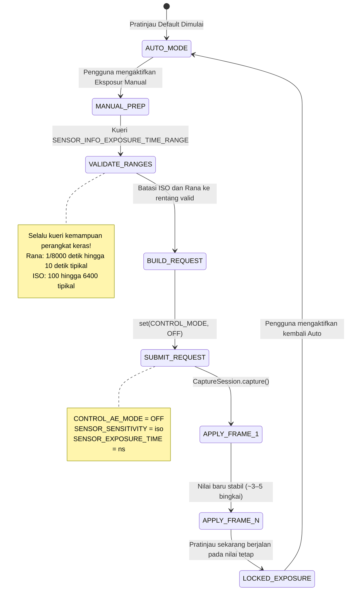

# Bab 14: Eksposur Manual di Camera2

Berbekal teori fotografi dari Bab 13, saatnya menerjemahkan konsep menjadi kode. Dalam bab ini, Anda akan mempelajari cara **mengambil alih sepenuhnya** sistem auto-exposure (AE) kamera dan menyetel ISO serta kecepatan rana secara manual dengan API Camera2.

[Aplikasi Android Camera Parameters](https://github.com/zoozooll/AndroidCameraParameters) mendemonstrasikan setiap teknik dalam bab ini — Anda dapat mengikuti secara langsung dengan beralih ke mode Manual di aplikasi dan menyesuaikan slider ISO serta Rana untuk melihat hasil real-time.

---

## Sakelar Besar: Dari AUTO → MANUAL

Secara default, setiap `CaptureRequest` yang Anda kirimkan berjalan di bawah pipeline otomatis 3A bawaan kamera (Auto Exposure, Auto Focus, Auto White Balance). Untuk beralih ke manual, Anda harus **menonaktifkannya secara eksplisit**.

Ada dua tingkat pengesampingan (override):

| Tingkat | Pengaturan | Apa yang Terjadi |
|-------|---------|-------------|
| 1. Nonaktifkan AE saja | `CONTROL_AE_MODE = OFF` | ISO + rana menjadi manual; AF dan AWB tetap berjalan otomatis |
| 2. Nonaktifkan seluruh 3A | `CONTROL_MODE = OFF` | **Semua** algoritma 3A berhenti; setiap parameter 3A harus disetel secara manual |

Untuk eksposur manual yang andal, setel **keduanya**. Menonaktifkan `CONTROL_AE_MODE` saja pada beberapa perangkat masih menyisakan pemrosesan pasca OEM yang "membantu" di balik layar. Menyetel `CONTROL_MODE = OFF` adalah jalur yang paling bersih dan paling dapat diprediksi.



**Latensi transisi:** Saat Anda mengirimkan permintaan pengambilan gambar manual, nilai ISO/rana baru tidak muncul pada bingkai *berikutnya*. Sensor CMOS memiliki latensi pipeline — bingkai *saat ini* sudah diekspos dengan pengaturan lama. Harapkan **3–5 bingkai transisi** sebelum nilai stabil. [Aplikasi Android Camera Parameters](https://play.google.com/store/apps/details?id=com.minininja.cameraparams) secara eksplisit menunggu `CaptureResult` untuk mengonfirmasi nilai yang diminta cocok dengan nilai yang diterapkan sebelum melaporkan "terkunci."

---

## Kontrol Manual dalam API Camera2

### SENSOR_SENSITIVITY (ISO)

Camera2 mengekspresikan ISO sebagai `CaptureRequest.SENSOR_SENSITIVITY` — sebuah integer yang secara langsung memetakan ke skala aritmatika ISO. Pada sebagian besar perangkat, ini adalah pemetaan 1:1:

| ISO Fotografer | nilai SENSOR_SENSITIVITY |
|-------------------|--------------------------|
| 100 | 100 |
| 400 | 400 |
| 3200 | 3200 |
| 6400 | 6400 |

**Selalu kueri rentang yang valid.** Jangan lakukan hardcode pada nilai:

```kotlin
val sensorSensitivityRange = characteristics.get(
    CameraCharacteristics.SENSOR_INFO_SENSITIVITY_RANGE
)
val minIso = sensorSensitivityRange?.lower ?: 100
val maxIso = sensorSensitivityRange?.upper ?: 6400
```

Beberapa ponsel ultra-premium melaporkan rentang seperti 50–12800, sementara perangkat anggaran mungkin mengunci Anda pada 100–3200. Nilai di luar rentang akan dibatasi (clamped) oleh HAL — yang menggagalkan tujuan kontrol manual Anda.

### SENSOR_EXPOSURE_TIME (Rana dalam Nanodetik)

Inilah "jebakan" pertama yang dialami setiap pengembang Camera2 baru: **kecepatan rana disimpan sebagai nanodetik (ns), bukan detik.** Manusia berpikir dalam 1/60 detik; HAL berpikir dalam 16.666.666 ns.

Mengonversi di antaranya adalah aritmatika sederhana:

```kotlin
// Detik → Nanodetik (kalikan dengan 1.000.000.000)
fun secondsToNs(seconds: Double): Long = (seconds * 1_000_000_000.0).toLong()

// Nanodetik → Detik untuk tampilan pengguna
fun nsToSeconds(ns: Long): Double = ns.toDouble() / 1_000_000_000.0

// Pemformat string yang ramah manusia (misalnya, "1/60 detik" atau "2.5 detik")
fun formatShutter(ns: Long): String {
    val seconds = nsToSeconds(ns)
    return when {
        seconds >= 1.0 -> String.format("%.1fs", seconds)
        else -> {
            val fraction = (1.0 / seconds).toInt()
            "1/${fraction}s"
        }
    }
}
```

**Konversi umum untuk referensi:**

| Rana Manusia | Nanodetik (ns) |
|--------------|-------------------|
| 1/8000 detik | 125.000 |
| 1/1000 detik | 1.000.000 |
| 1/500 detik | 2.000.000 |
| 1/120 detik (aturan 180° 24fps) | 8.333.333 |
| 1/60 detik | 16.666.666 |
| 1/30 detik | 33.333.333 |
| 1/15 detik | 66.666.666 |
| 1 detik | 1.000.000.000 |
| 2 detik | 2.000.000.000 |
| 10 detik | 10.000.000.000 |
| 30 detik | 30.000.000.000 |

**Sekali lagi, kueri rentang perangkat keras:**

```kotlin
val exposureTimeRange = characteristics.get(
    CameraCharacteristics.SENSOR_INFO_EXPOSURE_TIME_RANGE
)
val minShutterNs = exposureTimeRange?.lower ?: 1_000_000L   // batas bawah 1/1000 detik
val maxShutterNs = exposureTimeRange?.upper ?: 10_000_000_000L  // batas atas 10 detik
```

Pada perangkat yang mendukung eksposur sangat panjang (misalnya, beberapa model Sony Xperia dan Google Pixel), `SENSOR_INFO_EXPOSURE_TIME_RANGE.upper` dapat melebihi 30.000.000.000 ns (30 detik). Hormati batas ini — permintaan di luar maksimum akan dibatasi secara diam-diam.

---

## ⚠️ Kritis: Penurunan Kualitas Mode Manual

**Ini adalah peringatan terpenting dalam bab ini.** Jangan dilewatkan.

Saat Anda menyetel `CONTROL_MODE = OFF` (pengesampingan manual penuh), Anda tidak hanya menonaktifkan *algoritma* AE/AF/AWB — pada hampir semua perangkat Android, Anda juga **menonaktifkan pemrosesan pasca komputasional milik OEM** yang biasanya berjalan di dalam pipeline 3A.

Secara khusus, penelitian dan analisis HAL3 mengungkapkan bahwa menonaktifkan 3A biasanya mematikan:

| Langkah Pemrosesan | Mode AUTO | Mode MANUAL (CONTROL_MODE = OFF) |
|-----------------|-----------|-----------------------------------|
| Pengurangan noise multi-bingkai | ✓ Aktif — output noise berkurang | ✗ MATI — noise sensor mentah terlihat |
| Pemetaan nada adaptif / penggabungan HDR | ✓ Aktif — sorotan + bayangan dipulihkan | ✗ MATI — hanya kurva bingkai tunggal |
| Peningkatan kontras lokal (MiraVision, dll.) | ✓ Bervariasi berdasarkan adegan | ✗ Kurva generik datar |
| Metering wajah / deteksi adegan | ✓ Memprioritaskan eksposur pada wajah | ✗ Diabaikan |
| Koreksi bayangan lensa / vinyet | ✓ Dikalibrasi per lensa | ✗ Seringkali berkurang atau mati |

**Hasilnya:** Foto mode manual pada ISO 3200 dan 1/15 detik akan terlihat *jauh lebih buruk* (lebih banyak noise, kontras lebih datar) daripada adegan yang sama yang ditangkap dalam mode AUTO dengan ISO dan rana yang *identik* dengan yang dipilih HAL.

**Apa yang dapat Anda lakukan?** Dua opsi realistis:

1. **Lakukan pemrosesan pasca sendiri.** Karena Anda telah menonaktifkan pemrosesan OEM, Anda dapat menerapkan pengurangan noise Anda sendiri (misalnya, filter bilateral OpenCV, denoiser MediaPipe, atau CNN yang dilatih secara khusus) dalam pipeline pemrosesan Anda. Pengambilan gambar RAW (lihat bab-bab selanjutnya) + pengembangan RAW kustom memberikan kontrol artistik maksimum.

2. **Gunakan pengesampingan AE manual alih-alih CONTROL_MODE = OFF.** Jika Anda hanya perlu *mengunci* nilai tertentu sambil tetap mengaktifkan pemrosesan OEM, coba setel `CONTROL_AE_MODE = ON` tetapi kunci `SENSOR_SENSITIVITY` dan `SENSOR_EXPOSURE_TIME` berdasarkan permintaan demi permintaan. Dukungan untuk mode campuran ini tergantung pada perangkat — uji secara menyeluruh.

[Aplikasi Android Camera Parameters](https://github.com/zoozooll/AndroidCameraParameters) memiliki sakelar di panel Manual yang beralih di antara kedua pendekatan tersebut dan memungkinkan Anda membandingkan perbedaan kualitasnya secara visual.

---

## Contoh Lengkap 1: Eksposur Terkunci untuk Timelapse

Kasus penggunaan klasik untuk eksposur manual adalah **fotografi timelapse**. Dalam mode AUTO, kamera secara halus menyesuaikan eksposur dari bingkai ke bingkai saat awan bergerak atau cahaya berubah. Video yang dihasilkan akan berkedip (flicker) dengan parah. Mengunci ISO + rana menghilangkan hal ini.

**Tujuan:** ISO 100, 1/60 detik (16.666.666 ns) — terkunci untuk setiap bingkai.

```kotlin
class TimelapseManualExposure(
    private val characteristics: CameraCharacteristics,
    private val captureSession: CameraCaptureSession,
    private val imageReaderSurface: Surface,
    private val previewSurface: Surface
) {
    companion object {
        private const val TARGET_ISO = 100
        private const val TARGET_SHUTTER_NS = 16_666_666L // 1/60 detik
    }

    fun captureTimelapseFrame(frameCallback: ImageReader.OnImageAvailableListener) {
        try {
            // ---- LANGKAH 1: Validasi nilai yang diminta ada dalam rentang perangkat keras ----
            val isoRange = characteristics.get(
                CameraCharacteristics.SENSOR_INFO_SENSITIVITY_RANGE
            )
            val shutterRange = characteristics.get(
                CameraCharacteristics.SENSOR_INFO_EXPOSURE_TIME_RANGE
            )

            val clampedIso = isoRange?.let {
                TARGET_ISO.coerceIn(it.lower, it.upper)
            } ?: TARGET_ISO

            val clampedShutter = shutterRange?.let {
                TARGET_SHUTTER_NS.coerceIn(it.lower, it.upper)
            } ?: TARGET_SHUTTER_NS

            // ---- LANGKAH 2: Bangun CaptureRequest dengan eksposur manual ----
            val requestBuilder = captureSession.device.createCaptureRequest(
                CameraDevice.TEMPLATE_STILL_CAPTURE
            ).apply {
                addTarget(previewSurface)
                addTarget(imageReaderSurface)

                // --- BARIS KUNCI: Nonaktifkan 3A dan kunci nilai ---
                set(CaptureRequest.CONTROL_MODE, CameraMetadata.CONTROL_MODE_OFF)
                set(CaptureRequest.CONTROL_AE_MODE, CameraMetadata.CONTROL_AE_MODE_OFF)
                set(CaptureRequest.SENSOR_SENSITIVITY, clampedIso)
                set(CaptureRequest.SENSOR_EXPOSURE_TIME, clampedShutter)

                // Opsional: Kunci AWB ke Siang Hari untuk warna yang konsisten juga
                set(CaptureRequest.CONTROL_AWB_MODE, CameraMetadata.CONTROL_AWB_MODE_DAYLIGHT)

                // Kualitas JPEG foto diam
                set(CaptureRequest.JPEG_QUALITY, 95)
            }

            // ---- LANGKAH 3: Kirim pengambilan foto diam ----
            captureSession.capture(
                requestBuilder.build(),
                object : CameraCaptureSession.CaptureCallback() {
                    override fun onCaptureCompleted(
                        session: CameraCaptureSession,
                        request: CaptureRequest,
                        result: TotalCaptureResult
                    ) {
                        // Verifikasi HAL benar-benar menerapkan nilai kita (mungkin dibatasi!)
                        val appliedIso = result.get(CaptureResult.SENSOR_SENSITIVITY)
                        val appliedShutter = result.get(CaptureResult.SENSOR_EXPOSURE_TIME)
                        Log.d("Timelapse", "Diterapkan: ISO=$appliedIso, Rana=${formatShutter(appliedShutter!!)}")
                    }
                },
                null // Jalankan pada Handler thread saat ini
            )

        } catch (e: CameraAccessException) {
            Log.e("Timelapse", "Pengambilan manual gagal", e)
        }
    }
}
```

**Poin-poin utama:**

- Selalu gunakan `coerceIn()` terhadap rentang perangkat keras. Jika ISO minimum ponsel anggaran adalah 120, permintaan Anda untuk 100 secara diam-diam menjadi 120. `onCaptureCompleted()` mengonfirmasi apa yang *sebenarnya* diterapkan.
- Untuk timelapse, kirimkan permintaan ini setiap N detik (misalnya, setiap 5 detik untuk percepatan 300× pada output 30fps).
- Mengunci `CONTROL_AWB_MODE_DAYLIGHT` bersifat opsional tetapi direkomendasikan untuk timelapse — jika tidak, AWB mungkin masih secara halus menggeser white balance antar bingkai bahkan ketika eksposur dikunci.

---

## Contoh Lengkap 2: Eksposur Panjang untuk Fotografi Malam

**Tujuan:** ISO 3200, 2 detik (2.000.000.000 ns) — jejak air yang halus, langit malam yang cerah.

**Persyaratan perangkat keras kritis:** Perangkat harus mendukung `SENSOR_INFO_EXPOSURE_TIME_RANGE.upper >= 2.000.000.000 ns`. Banyak ponsel kelas menengah mentok pada ~1/8 detik hingga 1 detik.

```kotlin
class NightLongExposure(
    private val characteristics: CameraCharacteristics,
    private val captureSession: CameraCaptureSession,
    private val previewSurface: Surface,
    private val jpegReaderSurface: Surface,
    private val rawReaderSurface: Surface? // Opsional pengambilan RAW
) {
    fun shootLongExposure(onPhotoSaved: (path: String) -> Unit) {
        val shutterNs = 2_000_000_000L  // 2 detik
        val targetIso = 3200

        // --- Validasi apakah perangkat keras sanggup melakukannya ---
        val shutterRange = characteristics.get(
            CameraCharacteristics.SENSOR_INFO_EXPOSURE_TIME_RANGE
        )
        if (shutterRange == null || shutterRange.upper < shutterNs) {
            throw UnsupportedOperationException(
                "Perangkat tidak mendukung eksposur 2 detik. Maks = " +
                "${shutterRange?.upper?.let { nsToSeconds(it) } ?: "tidak diketahui"} detik"
            )
        }

        val requestBuilder = captureSession.device.createCaptureRequest(
            CameraDevice.TEMPLATE_STILL_CAPTURE
        ).apply {
            addTarget(previewSurface)
            addTarget(jpegReaderSurface)
            // Jika Anda telah mengonfigurasi OutputConfiguration yang mampu RAW sebelumnya:
            rawReaderSurface?.let { addTarget(it) }

            // Pengesampingan eksposur manual
            set(CaptureRequest.CONTROL_MODE, CameraMetadata.CONTROL_MODE_OFF)
            set(CaptureRequest.CONTROL_AE_MODE, CameraMetadata.CONTROL_AE_MODE_OFF)
            set(CaptureRequest.SENSOR_SENSITIVITY, targetIso)
            set(CaptureRequest.SENSOR_EXPOSURE_TIME, shutterNs)

            // --- Kritis untuk eksposur panjang ---
            // Nonaktifkan stabilisasi video optik/digital (keduanya berkonflik > 1 detik)
            set(CaptureRequest.LENS_OPTICAL_STABILIZATION_MODE,
                CameraMetadata.LENS_OPTICAL_STABILIZATION_MODE_OFF)
            // Tidak ada lampu kilat untuk bidikan eksposur panjang
            set(CaptureRequest.CONTROL_AE_MODE, CameraMetadata.CONTROL_AE_MODE_OFF)
        }

        captureSession.capture(
            requestBuilder.build(),
            object : CameraCaptureSession.CaptureCallback() {
                override fun onCaptureStarted(
                    session: CameraCaptureSession,
                    request: CaptureRequest,
                    timestamp: Long
                ) {
                    super.onCaptureStarted(session, request, timestamp)
                    // Beri tahu UI: "Eksposur dimulai — tahan posisi dengan sangat stabil selama 2 detik"
                    Log.d("LongExposure", "Eksposur dimulai pada $timestamp")
                }

                override fun onCaptureCompleted(
                    session: CameraCaptureSession,
                    request: CaptureRequest,
                    result: TotalCaptureResult
                ) {
                    // OnImageAvailableListener ImageReader dipicu secara terpisah untuk menyimpan JPEG
                    Log.d("LongExposure", "Pengambilan eksposur panjang selesai")
                }
            },
            null
        )
    }
}
```

**Tips eksposur panjang:**

1. **Matikan OIS.** Stabilisasi gambar optik pada sebagian besar lensa mencoba mengompensasi goyangan kamera *selama* eksposur. Untuk eksposur > 0,5 detik, aktuator OIS dapat jenuh dan menyebabkan pergeseran yang terlihat. Nonaktifkan dan gunakan tripod.

2. **Bersiaplah untuk pembekuan.** Kamera tidak akan mengeluarkan bingkai pratinjau saat eksposur 2 detik sedang berjalan. UI Anda harus menunjukkan indikator "MENGEKSPOS…" yang eksplisit.

3. **RAW lebih baik.** ISO tinggi (3200) + eksposur panjang menghasilkan noise termal (sensor memanas). Simpan bingkai RAW dan gunakan pengembang RAW desktop dengan perataan bingkai — atau terapkan eksposur panjang multi-bingkai Anda sendiri dengan merata-ratakan 8 bingkai × 0,25 detik alih-alih 1 bingkai × 2 detik (mengurangi noise termal secara dramatis).

---

## Contoh Lengkap 3: Bracketing Eksposur 3 Bidikan

**Tujuan:** ISO yang sama, 3 eksposur berbeda pada −1 EV, 0 EV, +1 EV. Pengguna nantinya menggabungkannya menjadi foto HDR.

Dari Bab 13, kita tahu setiap langkah EV menggandakan/mengurangi separuh cahaya. Pada ISO tetap, setiap langkah EV = mengalikan/membagi kecepatan rana dengan 2.

```kotlin
class ExposureBracketing(
    private val characteristics: CameraCharacteristics,
    private val captureSession: CameraCaptureSession,
    private val previewSurface: Surface,
    private val jpegReaderSurface: Surface
) {
    data class BracketFrame(
        val label: String,
        val evShift: Double,  // -1.0, 0.0, +1.0
        val shutterNs: Long,
        val iso: Int
    )

    fun captureBracketSeries(baseIso: Int, baseShutterNs: Long) {
        val isoRange = characteristics.get(
            CameraCharacteristics.SENSOR_INFO_SENSITIVITY_RANGE
        )
        val shutterRange = characteristics.get(
            CameraCharacteristics.SENSOR_INFO_EXPOSURE_TIME_RANGE
        )

        // Bangun rencana bracketing: kalikan rana dengan 2^(evStep)
        val frames = listOf(-1.0, 0.0, +1.0).map { ev ->
            val multiplier = Math.pow(2.0, ev)
            val rawShutter = (baseShutterNs.toDouble() * multiplier).toLong()
            val clampedShutter = shutterRange?.let {
                rawShutter.coerceIn(it.lower, it.upper)
            } ?: rawShutter
            val clampedIso = isoRange?.let {
                baseIso.coerceIn(it.lower, it.upper)
            } ?: baseIso
            BracketFrame("EV${if (ev > 0) "+" else ""}${ev.toInt()}", ev, clampedShutter, clampedIso)
        }

        Log.d("Bracket", "Rencana: ${frames.map { "${it.label} ISO${it.iso} ${formatShutter(it.shutterNs)}" }}")

        // Kirim setiap bingkai sebagai burst menggunakan captureBurst() untuk atomisitas
        val requestList = frames.map { frame ->
            captureSession.device.createCaptureRequest(
                CameraDevice.TEMPLATE_STILL_CAPTURE
            ).apply {
                addTarget(previewSurface)
                addTarget(jpegReaderSurface)

                set(CaptureRequest.CONTROL_MODE, CameraMetadata.CONTROL_MODE_OFF)
                set(CaptureRequest.CONTROL_AE_MODE, CameraMetadata.CONTROL_AE_MODE_OFF)
                set(CaptureRequest.SENSOR_SENSITIVITY, frame.iso)
                set(CaptureRequest.SENSOR_EXPOSURE_TIME, frame.shutterNs)

                // Tandai setiap permintaan sehingga kita dapat mengurutkan bingkai di callback
                setTag(frame.label)
            }.build()
        }

        captureSession.captureBurst(
            requestList,
            object : CameraCaptureSession.CaptureCallback() {
                override fun onCaptureCompleted(
                    session: CameraCaptureSession,
                    request: CaptureRequest,
                    result: TotalCaptureResult
                ) {
                    val tag = request.tag as? String ?: "?"
                    Log.d("Bracket", "$tag selesai — siap untuk penggabungan HDR")
                }
            },
            null
        )
    }
}
```

**Mengapa `captureBurst()` alih-alih tiga panggilan `capture()` terpisah?** `captureBurst()` mengirimkan seluruh daftar secara atomik. HAL menjamin tidak ada bingkai pratinjau lain yang menyela, dan status fokus/white-balance tidak akan bergeser antar bingkai.

**Ingin 5 atau 7 bracket?** Cukup ganti `listOf(-2.0, -1.0, 0.0, +1.0, +2.0)` — matematikanya berskala. Banyak aplikasi HDR profesional memotret 9 bracket untuk adegan dengan rentang dinamis ekstrem.

**Langkah penggabungan:** Setelah Anda memiliki tiga bingkai JPEG (atau RAW), Anda dapat menggabungkannya menggunakan:
- Pipeline HDR bawaan Android via `CameraExtensionSession` (lihat bab HDR)
- Pustaka pihak ketiga seperti `createMergeDebevec()` / `createMergeRobertson()` milik OpenCV untuk penggabungan eksposur yang sebenarnya
- Pustaka HDR Photo Sphere milik Google

---

## Pemecahan Masalah Kegagalan Umum

| Masalah | Penyebab Kemungkinan | Perbaikan |
|---------|-------------|-----|
| Nilai manual tampak diabaikan, masih terlihat otomatis | `CONTROL_MODE` tidak disetel ke OFF, atau nilai dibatasi | Setel CONTROL_MODE dan CONTROL_AE_MODE ke OFF; verifikasi nilai yang diterapkan di `onCaptureCompleted()` |
| Permintaan eksposur panjang 2 detik segera error | Perangkat tidak sanggup eksposur 2 detik | Periksa `SENSOR_INFO_EXPOSURE_TIME_RANGE.upper`; kurangi waktu eksposur atau gunakan peningkatan ISO sebagai gantinya |
| Pratinjau tersendat atau lag saat beralih manual | Terlalu banyak panggilan `setRepeatingRequest()` | Gunakan listener slider yang dibatasi (setiap 30–50 ms); hanya perbarui permintaan berulang, bukan pengambilan foto diam |
| Foto eksposur panjang semuanya hitam pada ISO 100 2 detik | Adegan sebenarnya butuh lebih banyak cahaya pada ISO 100 | Tingkatkan ISO atau perpanjang rana; 2 detik ISO 100 = garis dasar EV 0, bukan "terang malam" |
| Foto manual lebih ber-noise daripada Auto pada ISO yang sama | Pengurangan noise OEM dinonaktifkan oleh CONTROL_MODE = OFF | Perilaku yang diharapkan! Lihat bagian "Penurunan Kualitas Mode Manual". Lakukan pemrosesan pasca, atau gunakan manual parsial via AE_LOCK |

---

## Ringkasan

Anda sekarang memiliki alat untuk merebut kendali penuh atas eksposur dari Camera2 HAL:

- **Nonaktifkan pipeline 3A** dengan `CONTROL_MODE = OFF` + `CONTROL_AE_MODE = OFF` untuk kendali manual sepenuhnya
- **Petakan ISO → `SENSOR_SENSITIVITY`** (pemetaan 1:1 pada sebagian besar perangkat keras; selalu kueri rentangnya)
- **Petakan detik ↔ nanodetik** untuk `SENSOR_EXPOSURE_TIME` dengan konversi sederhana 10⁹
- **Kunci timelapse:** ISO 100 + 1/60 detik tetap yang diulang untuk setiap bingkai = nol kedipan
- **Eksposur panjang malam:** ISO 3200 + 2 detik dengan OIS dinonaktifkan = adegan malam halus yang cerah (pada perangkat keras yang didukung)
- **Bracketing eksposur:** ISO yang sama, rana ×0,5 / ×1 / ×2 via `captureBurst()` = input HDR yang siap digabung
- **⚠️ Pertukaran kualitas manual:** Menonaktifkan 3A mematikan pengurangan noise dan pemetaan nada OEM — foto manual seringkali terlihat *lebih buruk* pada ISO yang identik dibandingkan Auto. Rencanakan untuk pemrosesan pasca.

## Apa Selanjutnya

Eksposur mengontrol *kecerahan*. **Fokus mengontrol ketajaman.** Dalam **Bab 15: Fokus**, kita membahas:

- Status dan mode Auto Focus (AF) — bagaimana pemindaian pasif bekerja, perbedaan antara foto diam kontinu vs. video
- Fokus manual dengan `LENS_FOCUS_DISTANCE` dalam dioptri (0.0 = tak terhingga, 10D = 0.1m)
- Kode Kotlin untuk urutan pemicu-dan-ambil AF satu kali, dan slider SeekBar fokus manual
- Mesin status AF — kapan `CONTROL_AF_STATE_FOCUSED_LOCKED` benar-benar dipicu, dan cara menunggunya

Kekaburan berhenti di sini.
