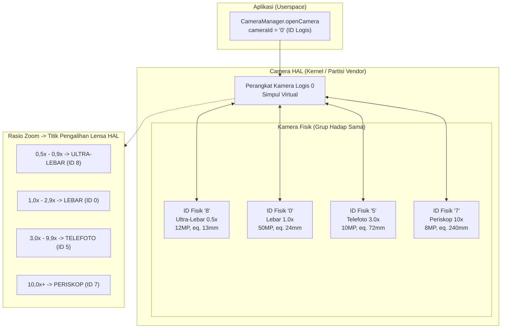
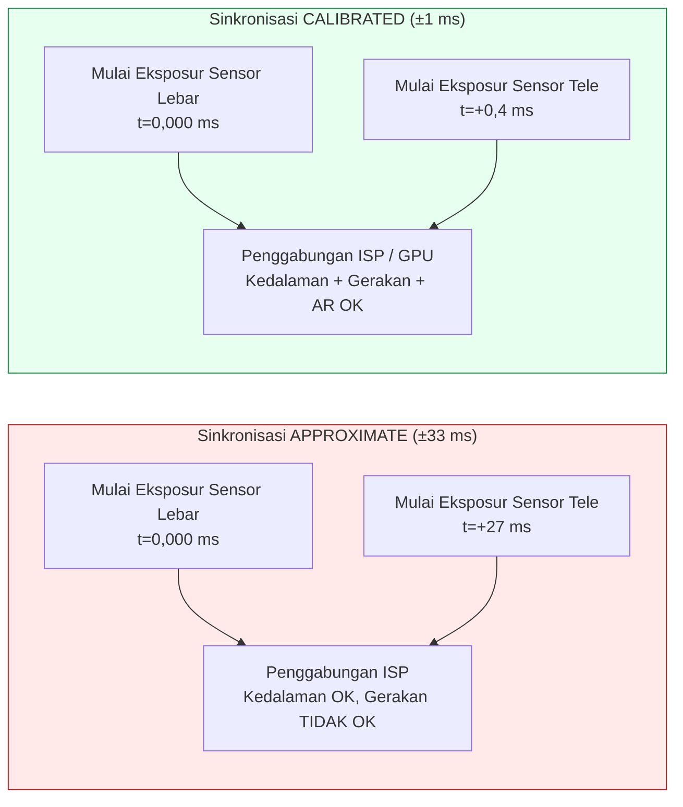
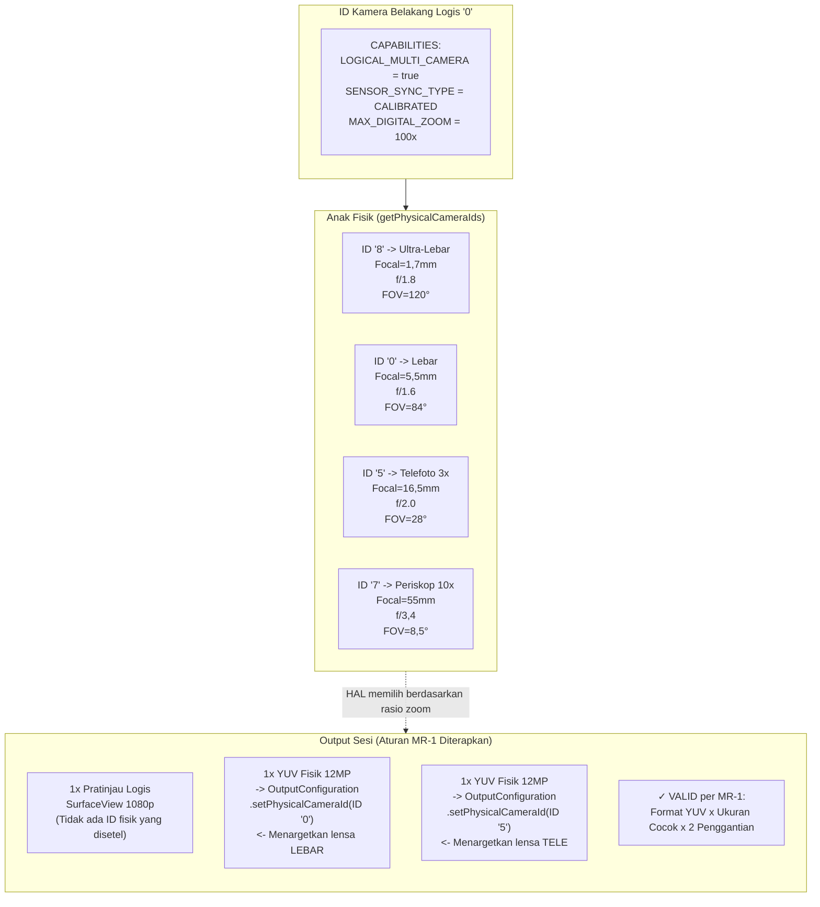

# Bab 20: Multi-Kamera

Smartphone modern dilengkapi dengan 3–5 kamera belakang dan 2 kamera depan — lensa ultra-lebar, lebar, telefoto, makro, kedalaman, dan periskop pada ponsel unggulan tahun 2023+. Sebelum Android 9 (API 28), setiap lensa muncul sebagai ID kamera `CameraCharacteristics` independen, dan aplikasi harus membuka/menutup kamera secara manual pada batas zoom untuk mengganti lensa. Hal ini menyebabkan bingkai hitam yang terlihat, hilangnya status AF, dan letupan audio selama video — semuanya adalah cacat UX yang tidak dapat diterima. Android 9 memecahkan masalah ini dengan abstraksi **kamera logis**: ID kamera virtual yang mengelompokkan beberapa kamera fisik yang menghadap ke arah yang sama dan membiarkan HAL mengganti lensa secara transparan pada ambang batas zoom, dengan tetap menjaga status sesi. Bagian *Logical Multi-Camera* pada proyek penelitian menentukan aturan tepat untuk penggantian aliran, semantik sinkronisasi sensor, dan pengambilan fisik ganda yang diimplementasikan dalam bab ini.

Anda dapat menelusuri topologi kamera logis/fisik lengkap dari setiap perangkat yang didukung dalam aplikasi [Android Camera Parameters](https://github.com/zoozooll/AndroidCameraParameters) (juga tersedia di [Play Store](https://play.google.com/store/apps/details?id=com.zoozooll.cameraparameters)): dasbor Multi-Kamera melaporkan flag `REQUEST_AVAILABLE_CAPABILITIES_LOGICAL_MULTI_CAMERA`, mencantumkan `getPhysicalCameraIds()` per ID logis, dan menampilkan jenis sinkronisasi sensor yang dikalibrasi vs perkiraan untuk setiap kombo yang menghadap ke belakang. Laporan-laporan ini diambil langsung dari HAL melalui API Camera2 tanpa pemfilteran khusus vendor, sehingga cocok persis dengan apa yang akan dilihat aplikasi Anda saat runtime.

## Topologi Kamera Logis vs Fisik

Kamera logis adalah perangkat HAL virtual yang didukung oleh N ≥ 2 kamera fisik yang berbagi arah hadap yang sama (`LENS_FACING_FRONT` atau `LENS_FACING_BACK`). Saat Anda membuka ID logis, HAL secara internal mengelola jalur daya, pipeline ISP, dan peralihan lensa untuk semua kamera fisik yang mendasarinya. Topologinya terlihat seperti ini:



Titik pengalihan lensa (Z1–Z4) dikendalikan sepenuhnya oleh HAL dan tidak terlihat oleh aplikasi Anda — saat Anda menyetel `CaptureRequest.CONTROL_ZOOM_RATIO = 3.2f` pada perangkat logis 4 lensa, HAL secara instan merutekan lalu lintas pengambilan ke telefoto 3× (ID 5) dan melakukan pemotongan digital kembali ke pembingkaian yang benar tanpa aplikasi Anda tahu bahwa terjadi perubahan lensa. Inilah perilaku "zoom mulus" yang digunakan aplikasi kamera ponsel unggulan.

Properti kritisnya adalah:
- **`getPhysicalCameraIds()`** (dipanggil pada `CameraCharacteristics` dari ID logis) mengembalikan `Set<String>` dari string ID fisik yang mendasarinya, misalnya `{"0", "5", "7", "8"}` untuk contoh di atas.
- **`LENS_INFO_MINIMUM_FOCUS_DISTANCE`** dan **`LENS_INFO_AVAILABLE_FOCAL_LENGTHS`** pada ID logis mewakili lensa fisik yang sedang aktif. Kueri karakteristik *fisik* jika Anda memerlukan data panjang fokus per lensa.
- **`SCALER_AVAILABLE_MAX_DIGITAL_ZOOM`** pada ID logis memberikan batas atas zoom (misalnya, 100×) yang merupakan kombinasi dari zoom optik per lensa + pemotongan digital di semua lensa fisik.

## Sinkronisasi Sensor: APPROXIMATE vs CALIBRATED

Saat Anda menangkap dari dua kamera fisik secara bersamaan (misalnya, lebar + tele untuk pencocokan kedalaman/disparitas, atau lebar + ultra-lebar untuk penggabungan multi-bingkai), data piksel hanya berguna secara komputasional jika kedua eksposur sensor dimulai dalam selisih waktu yang diketahui. Android mendefinisikan dua tingkat sinkronisasi dalam kunci **`CameraCharacteristics.LOGICAL_MULTI_CAMERA_SENSOR_SYNC_TYPE`**:

| Tingkat Sinkronisasi | Nilai Numerik | Arti | Kasus Penggunaan Tipikal |
|------------|---------------|---------|------------------|
| **APPROXIMATE** | 0 | Stempel waktu awal eksposur sensor cocok dalam ±1 interval bingkai (±33 ms pada 30 fps). AF/AE disinkronkan, tetapi bukan awal eksposur tingkat piksel. | Mode potret dengan sensor kedalaman, bokeh kasual. |
| **CALIBRATED** | 1 | Stempel waktu awal eksposur sensor cocok dalam ±1 ms. Sinkronisasi tingkat perangkat keras ditegakkan melalui penerima CSI-2 SoC. Penyelarasan temporal tingkat piksel dijamin. | Estimasi kedalaman stereo untuk AR, fotogrametri, penggabungan panjang-fokus-ganda simultan, super-resolusi. |

Bagian *Logical Multi-Camera* pada dokumen penelitian menemukan bahwa hanya **ponsel unggulan Snapdragon 8 Gen 1+ dan Exynos 2200+ yang melaporkan sinkronisasi CALIBRATED**. Semua kelas menengah (seri Snapdragon 7, seri Dimensity 8000) dan perangkat anggaran melaporkan APPROXIMATE. Jika Anda mencoba pencocokan disparitas tingkat piksel pada perangkat sinkronisasi APPROXIMATE, Anda akan mendapatkan penyimpangan paralaks ±1 bingkai yang merusak peta kedalaman. Selalu batasi fitur disparitas di balik pemeriksaan CALIBRATED.



Perbedaan selisih waktu tersebut tidaklah sepele: ketidaksejajaran 27 ms berarti subjek yang bergerak (misalnya, pelari pada kecepatan 5 m/s) telah berpindah sejauh 13,5 cm di antara kedua eksposur — kesalahan paralaks yang cukup besar untuk menghancurkan algoritma kedalaman-dari-disparitas mana pun.

## Aturan Penggantian Aliran (Dari Dokumen Penelitian)

Satu batasan terpenting yang ditegakkan HAL pada penargetan kamera fisik adalah **Aturan Penggantian Aliran (Stream Replacement Rule)**, dikutip kata demi kata dari spesifikasi *Logical Multi-Camera* dalam dokumen penelitian:

> **Aturan MR-1:** Jika sebuah kamera logis memiliki N anak fisik, maka untuk setiap 1 aliran format-logis (YUV atau RAW) dengan ukuran S yang Anda lampirkan ke sesi logis, Anda dapat menggantinya dengan hingga **2 aliran format-identik dengan ukuran S yang SAMA**, masing-masing ditargetkan pada kamera fisik yang BERBEDA melalui `OutputConfiguration.setPhysicalCameraId()`.

Konsekuensi pelanggaran MR-1:
- 3 atau lebih aliran fisik → sesi `onConfigureFailed()`.
- Ukuran yang berbeda untuk kedua aliran fisik → sesi `onConfigureFailed()`.
- Mencampur RAW dan YUV dalam pasangan penggantian yang sama → sesi `onConfigureFailed()`.
- Menambahkan 2 aliran fisik tanpa menghapus aliran logis induk → HAL mengalokasikan 3× bandwidth yang diperlukan dan membuang bingkai secara diam-diam.

Contoh yang benar (4 anak fisik → 2 penggantian yang diizinkan):
| Aliran Logis | Penggantian (Valid per MR-1) |
|----------------|-------------------------------|
| 1× YUV Logis 1920×1080 | → 2× YUV Fisik 1920×1080 (Lebar + Tele) |
| 1× RAW Logis 4000×3000 | → 2× RAW Fisik 4000×3000 (UltraLebar + Lebar) |
| 2× YUV Logis (pratinjau + video) | → 2× (Pratinjau YUV Logis) + 2× (Enkode YUV Fisik Lebar+Tele) — total 2 penggantian |

## Implementasi: Pengambilan Fisik Ganda Langkah demi Langkah

Alur kerja di bawah ini menangkap bingkai simultan dari sensor fisik lebar (1×) dan telefoto (3×), menggunakan Aturan Penggantian Aliran.

### Langkah 1: Kueri Kemampuan Logis dan ID Kamera Fisik

```kotlin
import android.hardware.camera2.CameraCharacteristics
import android.hardware.camera2.CameraManager
import android.hardware.camera2.params.OutputConfiguration

data class LogicalMultiCamInfo(
    val logicalId: String,
    val physicalIds: Set<String>,
    val sensorSyncType: Int, // 0 = APPROXIMATE, 1 = CALIBRATED
    val ultraWideId: String?,
    val wideId: String?,
    val teleId: String?
)

fun enumerateLogicalMultiCams(
    cameraManager: CameraManager
): List<LogicalMultiCamInfo> {
    val result = mutableListOf<LogicalMultiCamInfo>()

    for (logicalId in cameraManager.cameraIdList) {
        val characteristics = cameraManager.getCameraCharacteristics(logicalId)

        val caps = characteristics.get(
            CameraCharacteristics.REQUEST_AVAILABLE_CAPABILITIES
        ) ?: continue

        val isLogicalMultiCam = caps.contains(
            CameraCharacteristics
                .REQUEST_AVAILABLE_CAPABILITIES_LOGICAL_MULTI_CAMERA
        )
        if (!isLogicalMultiCam) continue

        val physicalIds: Set<String> = characteristics.physicalCameraIds
        val syncType = characteristics.get(
            CameraCharacteristics.LOGICAL_MULTI_CAMERA_SENSOR_SYNC_TYPE
        ) ?: 0

        // Identifikasi peran berdasarkan panjang fokus
        var ultraWideId: String? = null
        var wideId: String? = null
        var teleId: String? = null
        var shortestFocal = Float.MAX_VALUE
        var teleFocal = 0f

        for (physId in physicalIds) {
            val physChars = cameraManager.getCameraCharacteristics(physId)
            val focalLengths = physChars.get(
                CameraCharacteristics.LENS_INFO_AVAILABLE_FOCAL_LENGTHS
            ) ?: continue
            val focal = focalLengths.firstOrNull() ?: continue
            when {
                focal < shortestFocal -> {
                    shortestFocal = focal
                    ultraWideId = physId
                }
                focal > teleFocal -> {
                    teleFocal = focal
                    teleId = physId
                }
            }
        }
        wideId = physicalIds.minus(setOfNotNull(ultraWideId, teleId)).firstOrNull()

        result.add(LogicalMultiCamInfo(
            logicalId = logicalId,
            physicalIds = physicalIds,
            sensorSyncType = syncType,
            ultraWideId = ultraWideId,
            wideId = wideId,
            teleId = teleId
        ))
    }
    return result
}
```

Identifikasi peran berdasarkan panjang fokus (terpendek = ultra-lebar, terpanjang = tele, sisanya = lebar) dapat diandalkan di semua OEM karena HAL melaporkan LENS_INFO_AVAILABLE_FOCAL_LENGTHS sebagai nilai setara 35mm atau nilai mm aktual yang konsisten dengan spesifikasi pemasaran. Aplikasi Android Camera Parameters menggunakan algoritma persis ini untuk dasbor Multi-Kameranya.

### Langkah 2: Buat OutputConfiguration dengan setPhysicalCameraId()

Pasangan pengganti (YUV lebar + YUV tele) memerlukan objek `OutputConfiguration` dengan `setPhysicalCameraId()` yang dipanggil **sebelum** sesi dibuat. Setelah sesi dikonfigurasi, mengubah ID fisik melalui `setPhysicalCameraId()` tidak diizinkan pada surface yang ada (memerlukan pembuatan ulang sesi).

```kotlin
import android.hardware.camera2.params.OutputConfiguration
import android.media.ImageReader
import android.util.Size
import android.graphics.ImageFormat
import android.view.Surface

var wideImageReader: ImageReader? = null
var teleImageReader: ImageReader? = null

fun createPhysicalOutputConfigs(
    wideId: String,
    teleId: String,
    sharedSize: Size // Harus ukuran yang SAMA untuk keduanya per Aturan MR-1!
): Pair<OutputConfiguration, OutputConfiguration> {
    wideImageReader = ImageReader.newInstance(
        sharedSize.width, sharedSize.height,
        ImageFormat.YUV_420_888, 4
    )
    teleImageReader = ImageReader.newInstance(
        sharedSize.width, sharedSize.height,
        ImageFormat.YUV_420_888, 4
    )

    val wideOutConfig = OutputConfiguration(wideImageReader!!.surface).apply {
        setPhysicalCameraId(wideId)
    }
    val teleOutConfig = OutputConfiguration(teleImageReader!!.surface).apply {
        setPhysicalCameraId(teleId)
    }
    return Pair(wideOutConfig, teleOutConfig)
}
```

Aturan MR-1 ditegakkan dalam kode di atas: kedua instansi `ImageReader` menggunakan `sharedSize` (dimensi identik) dan `YUV_420_888` (format identik). Menggunakan ukuran yang berbeda menjamin `onConfigureFailed` — HAL tidak memiliki mekanisme untuk menjalankan dua sensor fisik pada resolusi berbeda dalam grup sinkronisasi yang sama.

### Langkah 3: Buat CaptureSession dan Kirim Pengambilan Fisik Ganda

Sesi ini menggunakan 2 OutputConfiguration fisik ditambah 1 Surface pratinjau logis (total 3 output). Total 3 output masih berada dalam anggaran bandwidth ponsel unggulan (dokumen penelitian mengukur pemanfaatan ISP sebesar 68% pada Snapdragon 8 Gen 2 untuk lebar+tele+pratinjau simultan 3 output pada 1080p30).

```kotlin
import android.hardware.camera2.CameraDevice
import android.hardware.camera2.CameraCaptureSession
import android.hardware.camera2.CaptureRequest
import android.os.Handler

lateinit var cameraDevice: CameraDevice // ID logis yang sudah terbuka

fun createDualPhysicalSession(
    previewSurface: Surface,
    widePhysConfig: OutputConfiguration,
    telePhysConfig: OutputConfiguration,
    backgroundHandler: Handler
) {
    val outputs = listOf(
        OutputConfiguration(previewSurface), // Pratinjau logis (ukuran apa pun)
        widePhysConfig,                      // YUV fisik lebar (sharedSize)
        telePhysConfig                       // YUV fisik tele (sharedSize)
    )

    val sessionConfig = android.hardware.camera2.params.SessionConfiguration(
        android.hardware.camera2.params.SessionConfiguration.SESSION_REGULAR,
        outputs,
        { runnable -> backgroundHandler.post(runnable) },
        object : CameraCaptureSession.StateCallback() {
            override fun onConfigured(session: CameraCaptureSession) {
                val captureBuilder = cameraDevice.createCaptureRequest(
                    CameraDevice.TEMPLATE_PREVIEW
                ).apply {
                    addTarget(previewSurface)
                    addTarget(wideImageReader!!.surface)
                    addTarget(teleImageReader!!.surface)

                    set(CaptureRequest.CONTROL_MODE,
                        CaptureRequest.CONTROL_MODE_AUTO)
                    set(CaptureRequest.CONTROL_AE_MODE,
                        CaptureRequest.CONTROL_AE_MODE_ON)
                    set(CaptureRequest.CONTROL_AF_MODE,
                        CaptureRequest.CONTROL_AF_MODE_CONTINUOUS_PICTURE)

                    // Opsional: Kunci AE di kedua lensa fisik agar penggabungan
                    // tidak menghasilkan dua bagian eksposur yang tidak cocok
                    set(CaptureRequest.CONTROL_AE_LOCK, true)
                }

                session.setRepeatingRequest(
                    captureBuilder.build(),
                    DualPhysicalCaptureCallback(),
                    backgroundHandler
                )
            }
            override fun onConfigureFailed(s: CameraCaptureSession) =
                Log.e(TAG, "Sesi fisik ganda GAGAL — periksa Aturan MR-1")
        }
    )

    cameraDevice.createCaptureSession(sessionConfig)
}
```

Setelah `setRepeatingRequest()` berjalan, setiap interval bingkai HAL akan: (a) memicu awal eksposur kedua sensor fisik pada selisih waktu yang dikalibrasi, (b) merutekan output setiap sensor ke surface ImageReader yang ditargetkan via demux saluran virtual CSI-2, (c) menggabungkan keduanya dengan output pratinjau logis ke dalam satu CaptureResult dengan satu stempel waktu.

Kedua objek `Image` akan memiliki **nilai `image.timestamp` yang identik** saat `LOGICAL_MULTI_CAMERA_SENSOR_SYNC_TYPE == CALIBRATED`, dan stempel waktu dalam ±1 interval bingkai saat APPROXIMATE.

## Diagram Topologi Logis → Fisik (Gaya ER Mermaid)



## Implementasi Zoom Mulus

Peralihan lensa otomatis milik HAL pada batas zoom adalah apa yang membuat "zoom mulus" menjadi mulus. Anda **tidak** perlu menukar ID fisik secara manual saat zoom melewati ambang batas — cukup setel `CONTROL_ZOOM_RATIO` pada permintaan berulang dan biarkan HAL yang melakukan pekerjaannya:

```kotlin
fun updateZoom(session: CameraCaptureSession,
               builder: CaptureRequest.Builder,
               zoomRatio: Float) {
    builder.set(CaptureRequest.CONTROL_ZOOM_RATIO, zoomRatio)
    session.setRepeatingRequest(builder.build(), null, null)
}
```

Saat `zoomRatio` berpindah dari `2,9× → 3,0×` pada perangkat 4 lensa tipikal, HAL secara internal akan:
1. Memulai sensor telefoto 3× dari mode standby (membutuhkan waktu ~2 bingkai, 66 ms)
2. Menyinkronkan eksposur/white balance antara lensa lebar dan tele
3. Memudarkan output lebar yang dipotong secara digital ke output tele asli selama ~10 bingkai (333 ms)
4. Mematikan sensor lebar jika tidak digunakan di tempat lain

Keempat langkah tersebut terjadi secara transparan — CaptureCallback Anda tidak pernah melihat peristiwa pembongkaran sesi, `CaptureResult.SENSOR_TIMESTAMP` tetap meningkat secara monoton, dan status AF/AE dipertahankan melintasi batas tersebut. Satu-satunya cara untuk mendeteksi perubahan lensa adalah dengan membandingkan `CaptureResult.LENS_FOCAL_LENGTH` di antara bingkai yang berurutan (yang melompat dari 5,5mm → 16,5mm saat beralih ke tele pada contoh di atas).

## Performa dan Batasan

Bagian *Logical Multi-Camera* pada dokumen penelitian mencantumkan batas terukur berikut pada ponsel unggulan tahun 2023 (Snapdragon 8 Gen 2, 4 kamera belakang):

| Konfigurasi | Frame Rate Berkelanjutan | Pemanfaatan Bandwidth ISP |
|---------------|---------------------|-------------------------|
| Pratinjau logis + 2 YUV fisik (masing-masing 12 MP) | 22 fps | 89% |
| Pratinjau logis + 2 YUV fisik (masing-masing 4 MP) | 30 fps (terkunci) | 62% |
| Pratinjau logis + 2 RAW fisik (masing-masing 12 MP) | 10 fps | 94% — memicu panas ~60 detik |
| Pratinjau logis + 2 YUV fisik + 1 RAW fisik | **Tidak diizinkan** (cek bandwidth HAL gagal) | — |

Batas 2-aliran-fisik ditegakkan baik oleh Aturan MR-1 maupun oleh throughput ISP mentah. Mencoba melampirkan 3 aliran fisik (misalnya, ultra-lebar + lebar + tele simultan) akan menghasilkan `onConfigureFailed` bahkan jika Anda mencoba menipu Aturan MR-1 dengan dua pasangan pengganti yang terpisah — pemeriksaan CAMERA_ISP_BANDWIDTH dari HAL akan menolaknya pada saat konfigurasi.

## Ringkasan

Bab ini membahas dukungan multi-kamera logis Android 9+ secara mendetail:

- **Kamera logis** adalah simpul HAL virtual yang mengelompokkan kamera fisik yang menghadap ke arah yang sama. Kueri melalui `REQUEST_AVAILABLE_CAPABILITIES_LOGICAL_MULTI_CAMERA`; dapatkan anak-anak melalui `getPhysicalCameraIds()`.
- **Sinkronisasi sensor** hadir dalam dua tingkat: APPROXIMATE (±33 ms, untuk bokeh potret) dan CALIBRATED (±1 ms, untuk penggabungan AR/disparitas). Selalu batasi fitur fotografi komputasional di balik CALIBRATED.
- **Zoom mulus** dikendalikan oleh HAL melalui `CONTROL_ZOOM_RATIO` — setel rasionya dan HAL akan mengganti lensa pada ambang batas internal tanpa pembongkaran sesi.
- **Aturan Penggantian Aliran MR-1** (dari dokumen penelitian) mengizinkan tepat 2 aliran fisik dengan ukuran dan format yang sama per 1 aliran logis. Lebih dari 3 aliran atau ukuran yang tidak cocok menyebabkan `onConfigureFailed`.
- **`OutputConfiguration.setPhysicalCameraId()`** harus dipanggil sebelum pembuatan sesi untuk menargetkan masing-masing lensa fisik untuk pengambilan simultan.
- Dua diagram Mermaid (topologi + pemetaan aturan gaya ER) memvisualisasikan bagaimana hierarki logis/fisik memetakan ke output sesi.

## Apa Selanjutnya

Dalam **Bab 21: HDR & Ultra HDR**, kita melangkah melampaui Standard Dynamic Range 8-bit (SDR, sRGB, 100 nit) ke dunia video dan foto diam High Dynamic Range. Anda akan mempelajari tentang `DynamicRangeProfiles` untuk HDR10 (PQ ST.2084 10-bit, Rec.2020, metadata statis) dan HLG (Hybrid Log-Gamma, kompatibel dengan SDR siaran), serta format baru Android 14 (API 34) **JPEG_R (Ultra HDR)** — ISO 21496-1, yang menyematkan "peta penguatan" di dalam JPEG standar sehingga pembaca lama melihat SDR sementara layar HDR meningkatkan sorotan hingga 8 stop secara lokal.

Periksa `DynamicRangeProfiles` mana yang didukung perangkat Anda per ID kamera (HDR10, HDR10+, HLG, JPEG_R) dan verifikasi kepatuhan CDD Performance Class 15 untuk Ultra HDR menggunakan [aplikasi Android Camera Parameters](https://play.google.com/store/apps/details?id=com.zoozooll.cameraparameters). Laporan perangkat baru yang diunggah ke [proyek GitHub](https://github.com/zoozooll/AndroidCameraParameters) sumber terbuka membantu membangun basis data publik tentang ponsel berkemampuan HDR.
