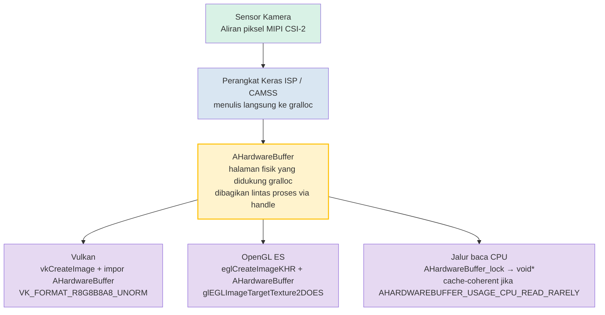

# Bab 25: Pengembangan Kamera Native

## Ringkasan

Bab 1–24 beroperasi dalam kode terkelola: Kotlin atau Java yang berjalan di atas ART, menyeberangi batas IPC Binder untuk setiap `CaptureRequest`, dan mengalokasikan salinan `ByteBuffer` dari bingkai atau menerima overhead dari streaming tekstur yang dimediasi `SurfaceTexture`. Untuk aplikasi kamera sosial, ini sudah lebih dari cukup. Untuk mesin AR, pipeline visi komputer real-time, kamera belakang mobil, atau mesin 3D dengan anggaran 16ms per bingkai — ini tidak cukup.

Pengembangan kamera native memindahkan seluruh loop buka/konfigurasi/pengambilan kamera ke dalam C/C++ menggunakan header `<camera/NdkCameraManager.h>` dan `<android/hardware_buffer.h>` milik NDK. Keuntungan langsungnya adalah nol overhead JNI pada jalur kritis dan, yang terpenting, kemampuan untuk membungkus objek `AHardwareBuffer` yang dialokasikan gralloc secara langsung sebagai target `VkImage` Vulkan atau `EGLImage` OpenGL tanpa satu byte pun penyalinan memori antara output sensor dan pengambilan sampel tekstur GPU.

**Android Camera Parameters** membantu Anda memvalidasi bahwa perangkat target Anda mengekspos jaminan `INFO_SUPPORTED_HARDWARE_LEVEL_FULL` atau `LEVEL_3` yang diperlukan untuk operasi native tingkat rendah yang dapat diprediksi. Instal dari [Google Play](https://play.google.com/store/apps/details?id=com.minininja.cameraparams) atau periksa sumbernya di [github.com/zoozooll/AndroidCameraParameters](https://github.com/zoozooll/AndroidCameraParameters).

---

## Mengapa Memilih Native?

Sebelum menyelami C++, mari kita perjelas apa yang didapat dari native dan kapan ia membenarkan kompleksitasnya.

### Alasan Memilih Native

1. **Nol overhead JNI pada jalur kritis.** Pipeline 60fps memiliki 16,67ms per bingkai. Sebuah JNI `CallVoidMethod` tunggal yang melintasi batas ART/C adalah ~0,5–2µs menurut mikrobenchmark, tetapi biaya sebenarnya adalah panggilan *per bingkai*, handoff thread, pembukuan referensi lokal JNI, dan tekanan GC dari proxy `Image` yang terkelola. Kalikan dengan empat kamera yang mengisi sesi AR secara simultan dan Anda menghabiskan satu milidetik anggaran hanya untuk melintasi batas bahasa. Native menghilangkan hal ini.

2. **Kepemilikan memori langsung dengan `AHardwareBuffer`.** Dalam kode terkelola, `Image.getPlanes()[0].getBuffer()` mengembalikan `ByteBuffer` yang merupakan *tampilan* pada memori gralloc; membacanya memaksa pembatalan cache-CPU dan sering kali salinan internal untuk format seperti `PRIVATE`. Dalam kode native, `AHardwareBuffer` adalah handle gralloc itu sendiri, dan GPU dapat menghubungkannya sebagai memori tekstur di tempat.

3. **Integrasi mesin AR/3D.** Unity, Unreal, Ogre, dan mesin buatan sendiri ditulis dalam C++ untuk alasan yang baik. Menjalankan kamera *di dalam* kode C++ loop perenderan menghilangkan kerumitan tiga proses "ART + JNI + thread render".

4. **Migrasi EVS (External View System) Otomotif.** Sebelum Android 10, kamera belakang otomotif menggunakan tumpukan `EVS` lama dengan HAL-nya sendiri. Migrasi OEM 2020–2024 menyatukan EVS ke API NDK Camera2 standar, memesan `AID_AUTOMOTIVE_EVS_UID = 1071` untuk akses perangkat keras awal saat booting *sebelum* `system_server` CameraService dijalankan. Jika kode Anda menargetkan otomotif, native tidak dapat ditawar lagi.

### Alasan Menghindari Native

- Debugging lebih sulit. Crash dalam callback `ACameraDevice` menghasilkan jejak tombstone, bukan stack trace Kotlin yang bagus.
- Manajemen siklus hidup sepenuhnya manual. `ACameraManager` *tidak* sadar siklus hidup; lupa memanggil `ACameraCaptureSession_stopRepeating()` + `ACameraDevice_close()` saat surface dihancurkan akan membocorkan sumber daya kamera dan dapat memblokir aplikasi lain sampai reboot.
- Lebih sedikit solusi khusus perangkat. Database keunikan (quirk) CameraX tidak ada di dunia NDK; Anda mewarisi perilaku raw HAL persis seperti yang dikirimkan.
- Tidak ada `DngCreator`, tidak ada pembantu `ExifInterface`, tidak ada pengakses kenyamanan `CameraCharacteristics` — Anda mengurai tag metadata sendiri via `ACameraMetadata_getConstEntry`.

Keputusannya sederhana: jika Anda tidak dapat memenuhi anggaran bingkai dalam kode terkelola, atau Anda membutuhkan akses kamera tingkat booting kelas EVS, gunakan native. Jika tidak, tetaplah pada kode terkelola.

---

## ACameraManager: Padanan NDK untuk Java CameraManager

Permukaan API kamera NDK dalam `<camera/NdkCameraManager.h>`, `<camera/NdkCameraDevice.h>`, dan `<camera/NdkCaptureRequest.h>` memetakan hampir satu-ke-satu ke API Java yang Anda kenal. Setiap kelas Java memiliki struct native dan sekumpulan fungsi bebas:

| Java                          | Handle NDK / Prefiks Fungsi                          |
|-------------------------------|-------------------------------------------------------|
| `CameraManager`               | `ACameraManager` · `ACameraManager_*`                 |
| `CameraCharacteristics`       | `ACameraMetadata` · `ACameraMetadata_*`               |
| `CameraDevice`                | `ACameraDevice` · `ACameraDevice_*`                   |
| `CaptureRequest.Builder`      | `ACaptureRequest` · `ACaptureRequest_setEntry_*`      |
| `CameraCaptureSession`        | `ACameraCaptureSession` · `ACameraCaptureSession_*`   |
| `TotalCaptureResult`          | `ACameraCaptureResult` · `ACaptureResult`             |
| `ImageReader`                 | `AImageReader` (dari `<media/NdkImageReader.h>`)      |

Siklus hidupnya identik: enumerasi kamera → baca karakteristik → buka → buat surface output → buat sesi → setel permintaan berulang → bongkar dalam urutan terbalik.

### Contoh 1: Menghitung Kamera, Membaca Karakteristik, Membuka Perangkat (C++)

```cpp
#include <camera/NdkCameraManager.h>
#include <camera/NdkCameraDevice.h>
#include <camera/NdkCameraMetadata.h>
#include <android/log.h>

#define LOG_TAG "NativeCam"
#define LOGI(...) __android_log_print(ANDROID_LOG_INFO, LOG_TAG, __VA_ARGS__)
#define LOGE(...) __android_log_print(ANDROID_LOG_ERROR, LOG_TAG, __VA_ARGS__)

static ACameraManager* g_cameraManager = nullptr;
static ACameraDevice* g_cameraDevice = nullptr;

void onDeviceDisconnected(void* ctx, ACameraDevice* dev) {
    LOGI("Perangkat kamera terputus");
}

void onDeviceError(void* ctx, ACameraDevice* dev, int err) {
    LOGE("Kesalahan perangkat kamera: %d", err);
}

static ACameraDevice_stateCallbacks g_deviceCallbacks = {
    .context = nullptr,
    .onDisconnected = onDeviceDisconnected,
    .onError = onDeviceError,
};

bool enumerateAndOpenBackCamera() {
    g_cameraManager = ACameraManager_create();
    if (!g_cameraManager) {
        LOGE("Gagal membuat ACameraManager");
        return false;
    }

    ACameraIdList* cameraIdList = nullptr;
    camera_status_t status = ACameraManager_getCameraIdList(
        g_cameraManager, &cameraIdList);
    if (status != ACAMERA_OK) {
        LOGE("getCameraIdList gagal: %d", status);
        return false;
    }

    const char* chosenId = nullptr;

    for (int i = 0; i < cameraIdList->numCameras; ++i) {
        const char* id = cameraIdList->cameraIds[i];
        ACameraMetadata* chars = nullptr;
        status = ACameraManager_getCameraCharacteristics(
            g_cameraManager, id, &chars);
        if (status != ACAMERA_OK) continue;

        ACameraMetadata_const_entry lensFacingEntry{};
        status = ACameraMetadata_getConstEntry(
            chars,
            ACAMERA_LENS_FACING,
            &lensFacingEntry);

        uint8_t facing = 0;
        if (status == ACAMERA_OK && lensFacingEntry.count > 0) {
            facing = lensFacingEntry.data.u8[0];
        }

        if (facing == ACAMERA_LENS_FACING_BACK) {
            chosenId = id;
            // Juga kueri tingkat perangkat keras untuk pemeriksaan kemampuan:
            ACameraMetadata_const_entry hwEntry{};
            if (ACameraMetadata_getConstEntry(
                    chars, ACAMERA_INFO_SUPPORTED_HARDWARE_LEVEL,
                    &hwEntry) == ACAMERA_OK && hwEntry.count > 0) {
                LOGI("Kamera belakang %s tingkat hw = %d (harapan %d=FULL %d=LEVEL3)",
                     id, hwEntry.data.u8[0],
                     (int)ACAMERA_INFO_SUPPORTED_HARDWARE_LEVEL_FULL,
                     (int)ACAMERA_INFO_SUPPORTED_HARDWARE_LEVEL_3);
            }
            ACameraMetadata_free(chars);
            break;
        }
        ACameraMetadata_free(chars);
    }

    ACameraManager_deleteCameraIdList(cameraIdList);

    if (!chosenId) {
        LOGE("Tidak ada kamera belakang yang ditemukan");
        return false;
    }

    status = ACameraManager_openCamera(
        g_cameraManager, chosenId,
        &g_deviceCallbacks,
        &g_cameraDevice);

    if (status != ACAMERA_OK) {
        LOGE("openCamera gagal: %d", status);
        return false;
    }

    LOGI("Berhasil membuka kamera %s", chosenId);
    return true;
}
```

Perhatikan ketiadaan eksepsi. Setiap fungsi mengembalikan `camera_status_t`, dan Anda *harus* memeriksa setiap pengembalian. `ACAMERA_OK = 0`; nilai non-nol apa pun adalah kode kegagalan spesifik (`ACAMERA_ERROR_CAMERA_IN_USE`, `ACAMERA_ERROR_CAMERA_DISCONNECTED`, dll.). Tidak ada `CameraAccessException` yang bisa ditangkap — jika Anda mengabaikan pengembalian, fungsi tersebut secara diam-diam membiarkan pointer output sebagai `nullptr` dan Anda akan crash tiga baris kemudian.

### Membuat Sesi Pengambilan Gambar dan Menyetel Permintaan Berulang

Setelah perangkat terbuka, polanya mencerminkan pembuatan sesi Java. Buat `ACameraOutputTarget` per surface, kemas mereka ke dalam `ACaptureSessionOutputContainer`, lalu panggil `ACameraDevice_createCaptureSession()`. Untuk permintaan berulang, bangun `ACaptureRequest` dari sebuah template, tambahkan target output Anda, dan panggil `ACameraCaptureSession_setRepeatingRequest()`. Struct callback (`ACameraCaptureSession_stateCallbacks`, `ACameraCaptureSession_captureCallbacks`) didaftarkan pada saat pembuatan sesi, sama persis dengan padanan Java mereka.

---

## AHardwareBuffer: Jalur Kritis Tanpa Salinan (Zero-Copy)

Inilah alasan sebenarnya untuk menggunakan native. `AHardwareBuffer` (didefinisikan dalam `<android/hardware_buffer.h>`) adalah handle NDK untuk memori yang dialokasikan gralloc — memori yang persis sama dengan tempat HAL kamera menulis piksel sensor. Saat Anda memberikan surface yang didukung `AHardwareBuffer` ke `ACameraDevice_createCaptureSession` dan kemudian mengimpor `AHardwareBuffer` yang sama tersebut ke Vulkan atau OpenGL, Anda mendapatkan zero-copy yang sebenarnya:



Simpul `AHardwareBuffer` adalah kuncinya: ia adalah alokasi tunggal yang dibagikan oleh endpoint tulis HAL kamera, sampler tekstur GPU, dan opsional CPU. Tanpa memcpy, tanpa unggahan `glTexImage2D`, tanpa `ByteBuffer.wrap()` — tekstur GPU secara harfiah menunjuk ke halaman DRAM fisik yang baru saja ditulis oleh kamera.

Untuk pipeline AR 60fps pada aliran 4K, ini adalah penghematan bandwidth ~200ms per detik (4K × 60fps × 4 byte = ~4,7 GB/detik yang dihemat) dan perbedaan antara pengalaman yang mulus dan kekacauan yang tersendat.

### Contoh 2: AHardwareBuffer ke VkImage Vulkan, Langkah demi Langkah (C++)

```cpp
#include <android/hardware_buffer.h>
#include <vulkan/vulkan.h>
#include <vulkan/vulkan_android.h>

VkImage createVkImageFromAHardwareBuffer(
    VkDevice device,
    AHardwareBuffer* aBuffer,
    VkFormat format,
    uint32_t width,
    uint32_t height) {

    // Langkah 1: Isi AndroidHardwareBufferProperties2KHR
    VkAndroidHardwareBufferPropertiesANDROID ahbProps{};
    ahbProps.sType = VK_STRUCTURE_TYPE_ANDROID_HARDWARE_BUFFER_PROPERTIES_ANDROID;
    VkResult res = vkGetAndroidHardwareBufferPropertiesANDROID(
        device, aBuffer, &ahbProps);
    if (res != VK_SUCCESS) {
        LOGE("vkGetAndroidHardwareBufferPropertiesANDROID gagal: %d", res);
        return VK_NULL_HANDLE;
    }

    // Langkah 2: Jelaskan impor gambar (bukan alokasi)
    VkExternalMemoryImageCreateInfo externalInfo{};
    externalInfo.sType = VK_STRUCTURE_TYPE_EXTERNAL_MEMORY_IMAGE_CREATE_INFO;
    externalInfo.handleTypes =
        VK_EXTERNAL_MEMORY_HANDLE_TYPE_ANDROID_HARDWARE_BUFFER_BIT_ANDROID;

    VkImageCreateInfo imgInfo{};
    imgInfo.sType = VK_STRUCTURE_TYPE_IMAGE_CREATE_INFO;
    imgInfo.pNext = &externalInfo;
    imgInfo.imageType = VK_IMAGE_TYPE_2D;
    imgInfo.format = format;             // misalnya VK_FORMAT_R8G8B8A8_UNORM
    imgInfo.extent = { width, height, 1 };
    imgInfo.mipLevels = 1;
    imgInfo.arrayLayers = 1;
    imgInfo.samples = VK_SAMPLE_COUNT_1_BIT;
    imgInfo.tiling = VK_IMAGE_TILING_OPTIMAL;
    imgInfo.usage = VK_IMAGE_USAGE_SAMPLED_BIT |
                    VK_IMAGE_USAGE_TRANSFER_DST_BIT;
    imgInfo.sharingMode = VK_SHARING_MODE_EXCLUSIVE;
    imgInfo.initialLayout = VK_IMAGE_LAYOUT_UNDEFINED;

    VkImage image = VK_NULL_HANDLE;
    res = vkCreateImage(device, &imgInfo, nullptr, &image);
    if (res != VK_SUCCESS) {
        LOGE("vkCreateImage gagal: %d", res);
        return VK_NULL_HANDLE;
    }

    // Langkah 3: Alokasikan VkDeviceMemory yang mengimpor AHB, bukan alokasi baru
    VkMemoryRequirements memReqs{};
    vkGetImageMemoryRequirements(device, image, &memReqs);

    VkImportAndroidHardwareBufferInfoANDROID importInfo{};
    importInfo.sType =
        VK_STRUCTURE_TYPE_IMPORT_ANDROID_HARDWARE_BUFFER_INFO_ANDROID;
    importInfo.buffer = aBuffer;

    VkMemoryDedicatedAllocateInfo dedicatedInfo{};
    dedicatedInfo.sType = VK_STRUCTURE_TYPE_MEMORY_DEDICATED_ALLOCATE_INFO;
    dedicatedInfo.pNext = &importInfo;
    dedicatedInfo.image = image;

    VkMemoryAllocateInfo allocInfo{};
    allocInfo.sType = VK_STRUCTURE_TYPE_MEMORY_ALLOCATE_INFO;
    allocInfo.pNext = &dedicatedInfo;
    allocInfo.allocationSize = memReqs.size;
    allocInfo.memoryTypeIndex = ahbProps.memoryTypeBits
        // memoryTypeIndex harus dipilih dari irisan memReqs.memoryTypeBits
        // DAN ahbProps.memoryTypeBits. Dihilangkan demi singkatnya kode.
        ;

    VkDeviceMemory mem = VK_NULL_HANDLE;
    res = vkAllocateMemory(device, &allocInfo, nullptr, &mem);
    if (res != VK_SUCCESS) {
        LOGE("impor vkAllocateMemory gagal: %d", res);
        vkDestroyImage(device, image, nullptr);
        return VK_NULL_HANDLE;
    }

    // Langkah 4: Hubungkan memori yang diimpor ke VkImage
    vkBindImageMemory(device, image, mem, 0);

    // Langkah 5: Transisi ke tata letak SHADER_READ_ONLY_OPTIMAL via command buffer
    // (dihilangkan — penghalang memori gambar standar untuk VK_IMAGE_LAYOUT_UNDEFINED
    // → VK_IMAGE_LAYOUT_SHADER_READ_ONLY_OPTIMAL)

    LOGI("Berhasil mengimpor AHardwareBuffer sebagai VkImage %p", image);
    return image;
}
```

Lompatan konseptual yang menjebak kebanyakan pendatang baru adalah Langkah 3: `vkAllocateMemory` dengan `VK_STRUCTURE_TYPE_IMPORT_ANDROID_HARDWARE_BUFFER_INFO_ANDROID` **tidak** melakukan alokasi. Ia mendaftarkan `AHardwareBuffer` yang sudah ada sebagai objek `VkDeviceMemory`. Byte-byte tersebut sudah dialokasikan oleh gralloc saat produser kamera membuat surface; Vulkan hanya mengadopsinya ke dalam model memorinya.

Jalur OpenGL ES bersifat analog tetapi lebih pendek: `eglCreateImageKHR(..., EGL_NATIVE_BUFFER_ANDROID, aBuffer, ...)` → `glEGLImageTargetTexture2DOES(GL_TEXTURE_2D, eglImage)`. Satu panggilan dan Anda sudah melakukan pengambilan sampel.

---

## Ringkasan Interop OpenGL dan Vulkan

Kedua jalur tersebut berfungsi. Mana yang harus dipilih:

| Faktor                | OpenGL ES 3.x + EGLImage                    | Vulkan 1.1+ + impor AHB                      |
|-----------------------|----------------------------------------------|----------------------------------------------|
| Kesederhanaan         | Penyiapan lebih pendek, lebih sedikit upacara | Lebih banyak boilerplate, sinkronisasi eksplisit |
| Sinkronisasi          | Implisit; driver memasukkan penghalang        | Eksplisit; Anda menulis penghalang pipeline + semaphore |
| Multi-antrean/thread  | Terikat pada EGLContext tunggal per thread     | Transfer multi-antrean kelas satu            |
| Sertifikasi Otomotif/AR| Disertifikasi pada sebagian besar target EVS | Semakin dibutuhkan untuk runtime AR baru     |

Jika Anda berintegrasi dengan mesin yang sudah ada, mesin tersebutlah yang memilih untuk Anda. Jika Anda memulai dari awal dan menginginkan performa maksimal, Vulkan adalah masa depan. Jika Anda ingin kode minimal, OpenGL ES via EGLImage tetap menjadi pilihan pragmatis dan dikirimkan pada setiap perangkat dengan kamera.

---

## Konteks EVS Otomotif: Migrasi ke Camera2 NDK

Sebagai kelengkapan, catatan singkat tentang jalur migrasi otomotif yang direferensikan dalam catatan penelitian. Melalui Android 9, kamera belakang mobil menggunakan HAL `EVS` terpisah (`android.hardware.automotive.evs@1.0`), dengan enumerasi dan pipeline streaming sendiri. Mulai di Android 10 dan diwajibkan di Android 12+ untuk sistem IVI baru, manajer EVS diimplementasikan kembali *di atas HAL3 kamera standar + tumpukan kamera NDK*, dengan UID cadangan baru `AID_AUTOMOTIVE_EVS_UID = 1071` yang menerima akses grup izin `CAMERA` sedini `early-boot` — sebelum `CameraService` milik `system_server` bahkan diinisialisasi.

Secara praktis, jika Anda menulis kode kamera belakang untuk mobil:
1. Proses Anda berjalan sebagai UID 1071.
2. Anda menggunakan *persis* API native dalam bab ini (`ACameraManager_openCamera`, `AImageReader`, `AHardwareBuffer` → impor Vulkan).
3. Anda harus dapat membuka, mengonfigurasi, dan mengeluarkan bingkai dalam waktu kurang dari 2 detik sejak booting dingin (persyaratan FMVSS 111). Itulah mengapa tumpukan EVS memerlukan native — setiap md peluncuran ART adalah md yang tidak Anda miliki.

Migrasi EVS → Camera2 NDK adalah salah satu refaktor internal terbesar dari ekosistem kamera Android dalam lima tahun terakhir, dan itulah sebabnya API kamera NDK menerima investasi besar dari Android 10 dan seterusnya. Jika Anda membaca bab ini untuk mengirimkan produk kamera dalam mobil, Anda menggunakan persis jalur kode yang diwajibkan oleh pengujian kepatuhan otomotif Google.

---

## Contoh 3 (Rintisan Jembatan JNI Kotlin)

Sebagai kelengkapan, titik masuk JNI Kotlin minimal yang memanggil kode C++ di atas:

```kotlin
// NativeBridge.kt
class NativeBridge {

    external fun enumerateAndOpenBackCameraNative(): Boolean

    companion object {
        init {
            System.loadLibrary("native_camera")
        }
    }
}
```

```cpp
// ekspor JNI native_camera.cpp
extern "C" JNIEXPORT jboolean JNICALL
Java_com_example_NativeBridge_enumerateAndOpenBackCameraNative(
    JNIEnv* /*env*/, jobject /*thiz*/) {
    return static_cast<jboolean>(enumerateAndOpenBackCamera() ? JNI_TRUE : JNI_FALSE);
}
```

Dan dalam `build.gradle`:

```kotlin
android {
    defaultConfig {
        ndk { abiFilters += listOf("arm64-v8a", "armeabi-v7a", "x86_64") }
    }
    externalNativeBuild {
        cmake { path = file("src/main/cpp/CMakeLists.txt") }
    }
}
```

Dengan `CMakeLists.txt` terkait yang menghubungkan `-lcamera2ndk`, `-lmediandk`, `-landroid`, dan `-lvulkan`.

---

## Ringkasan

Pengembangan kamera native menukar ergonomi kode terkelola dengan performa maksimum dan kepemilikan perangkat keras langsung. `ACameraManager` dan struct pendampingnya mencerminkan API Camera2 Java satu-ke-satu, hanya dengan pengembalian kesalahan gaya C dan siklus hidup manual. Keuntungan nyata adalah `AHardwareBuffer` — handle gralloc yang memungkinkan Anda menyalurkan output HAL kamera secara langsung ke tekstur `VkImage` Vulkan atau `EGLImage` OpenGL tanpa penyalinan memori, menghemat bandwidth DRAM sebesar gigabyte per detik dalam pipeline AR 60fps. Untuk otomotif, migrasi EVS-ke-NDK membuat native tidak dapat ditawar karena persyaratan bingkai-booting 2 detik dan akses perangkat keras awal `AID_AUTOMOTIVE_EVS_UID`. Gunakan **Android Camera Parameters** untuk memvalidasi bahwa perangkat target Anda memiliki `INFO_SUPPORTED_HARDWARE_LEVEL_FULL` atau lebih baik sebelum berkomitmen pada implementasi native.

## Apa Selanjutnya

Baik dalam Kotlin atau C++, Camera2 adalah API yang secara inheren asinkron: `StateCallback`, `CaptureCallback`, `AvailabilityCallback`, semuanya dipicu pada thread latar belakang. Bab 26 menjinakkan kekacauan ini dengan coroutine Kotlin dan Flow, mengubah callback hell yang Anda tulis di bab-bab awal menjadi pipeline reaktif yang bersih dan linear.
