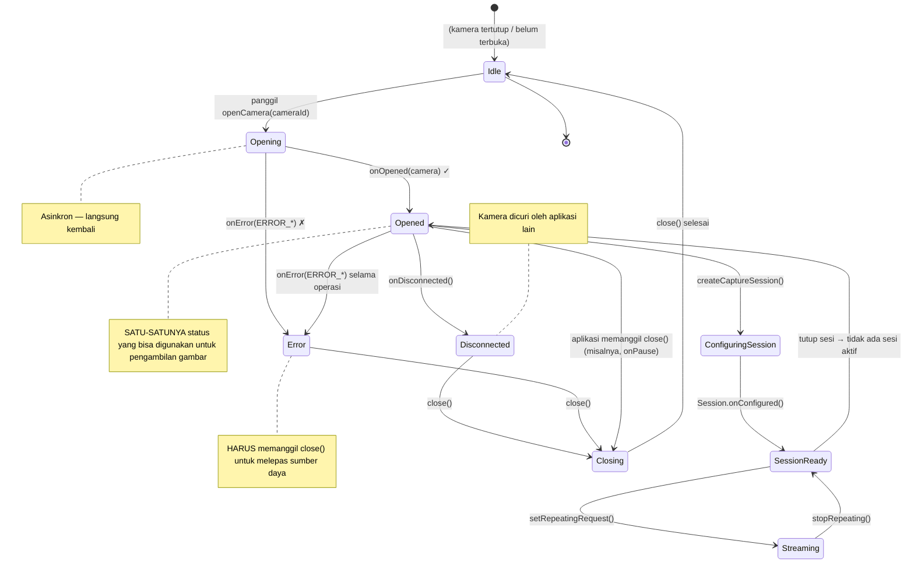

Anda telah menghitung semua kamera pada perangkat (Bab 6), dan Anda telah mengidentifikasi satu yang ingin Anda gunakan — biasanya kamera yang menghadap ke belakang dengan tingkat perangkat keras tertinggi. Langkah selanjutnya adalah **membuka** kamera tersebut: membangun koneksi tingkat rendah yang aktif ke perangkat keras kamera sehingga Anda dapat mengonfigurasi sesi pengambilan gambar dan mengirimkan permintaan. Membuka kamera adalah titik di mana aplikasi Anda beralih dari pengamat pasif metadata kamera menjadi pengontrol aktif perangkat keras yang sebenarnya.

Jika Anda ingin melihat kode siklus hidup buka/tutup kamera tingkat produksi, pelajari aplikasi **Android Camera Parameters** di [GitHub](https://github.com/zoozooll/AndroidCameraParameters). Kelas `Camera2Controller`-nya merangkum seluruh manajemen siklus hidup `CameraDevice`, termasuk pemulihan kesalahan, logika coba lagi, dan pembersihan sinkron. Versi [Google Play](https://play.google.com/store/apps/details?id=com.minininja.cameraparams) dari aplikasi tersebut telah diinstal pada ribuan perangkat di ratusan OEM yang berbeda, sehingga kasus tepi yang ditanganinya telah teruji di dunia nyata.

## Apa Itu CameraDevice?

`CameraDevice` adalah kelas Camera2 yang mewakili **koneksi aktif dan terbuka ke kamera fisik (atau logis) tertentu pada perangkat**. Sebelum kamera dibuka, Anda hanya dapat membaca karakteristiknya; setelah dibuka, Anda dapat:
- Membuat `CameraCaptureSession` (Bab 8)
- Mengirimkan `CaptureRequest` (Bab 8 dan 9)
- Membaca metadata `CaptureResult` dinamis saat bingkai tiba
- Mengosongkan permintaan yang tertunda, membatalkan pengambilan gambar, dan menutup perangkat

Sebuah `CameraDevice` memiliki dua properti kritis:

1. **Ini adalah sumber daya pengguna tunggal.** Hanya satu aplikasi (dan di dalam aplikasi Anda, hanya satu instansi `CameraDevice`) yang dapat memegang kamera tertentu yang terbuka pada satu waktu. Jika aplikasi dengan prioritas lebih tinggi (seperti panggilan telepon masuk dengan video) membutuhkan kamera, aplikasi Anda akan diputus koneksinya secara paksa.
2. **Ini memiliki siklus hidup yang ketat dan digerakkan oleh callback.** Anda tidak dapat membuat `CameraDevice` baru dengan konstruktor. Satu-satunya cara untuk mendapatkannya adalah melalui `CameraManager.openCamera()`, yang memberikan instansi tersebut secara asinkron melalui `StateCallback`. Anda harus mematuhi setiap callback transisi status.

Hubungan antara `CameraManager`, ID kamera, dan `CameraDevice` yang dihasilkan adalah:

```
CameraManager.openCamera("0", callback, handler)
    │
    ├── Panggilan asinkron → langsung kembali
    │
    └───── Pada thread latar belakang (via Handler) ────→ StateCallback.onOpened(cameraDevice)
                                                          │
                                                          ▼
                                                  Sekarang Anda dapat menggunakan cameraDevice untuk:
                                                  • createCaptureSession(...)
                                                  • createCaptureRequest(...)
```

## StateCallback: Mesin Siklus Hidup CameraDevice

`CameraDevice.StateCallback` adalah kelas abstrak dengan tiga metode yang **harus** Anda implementasikan. Setiap kamera yang terbuka pada akhirnya akan memicu setidaknya salah satu dari callback ini (baik `onOpened` yang kemudian diikuti oleh `onDisconnected`/`onError`, atau langsung `onError` jika pembukaan gagal). Kamera tidak dapat digunakan untuk pengambilan gambar sampai `onOpened` dipicu.

### Tiga Metode StateCallback

| Metode | Dipanggil Saat | Apa yang Harus Dilakukan |
|---|---|---|
| `onOpened(camera: CameraDevice)` | Kamera telah berhasil dibuka dan siap digunakan. | Simpan referensi `camera` dalam sebuah properti. Lanjutkan untuk mengonfigurasi sesi pengambilan gambar (Bab 8). Lepaskan izin Semaphore jika Anda memperolehnya. |
| `onDisconnected(camera: CameraDevice)` | Kamera diambil dari aplikasi Anda (misalnya, aplikasi lain dengan prioritas lebih tinggi membukanya, pengguna beralih ke aplikasi latar depan yang membutuhkan kamera, atau kebijakan perangkat menonaktifkannya). | Panggil `camera.close()` segera. Buat referensi yang Anda simpan menjadi null. Kamera tidak dapat dibuka kembali sampai aplikasi Anda kembali ke latar depan (pada titik mana `onResume` akan mencoba lagi). |
| `onError(camera: CameraDevice, error: Int)` | Terjadi kesalahan fatal selama pembukaan atau saat kamera aktif. Parameter `error` adalah salah satu konstanta `ERROR_*` yang dijelaskan di bawah ini. | Panggil `camera.close()`. Buat referensi menjadi null. Tergantung pada kode kesalahannya, tampilkan kesalahan kepada pengguna atau coba lagi dengan exponential backoff. Selalu lepaskan Semaphore. |

### Kode Kesalahan `onError`

Integer `error` dalam `onError` memetakan ke lima konstanta (didefinisikan dalam `CameraDevice.StateCallback`):

| Konstanta | Nilai | Arti | Pemulihan |
|---|---|---|---|
| `ERROR_CAMERA_IN_USE` | `1` | Kamera sudah dibuka oleh aplikasi lain atau oleh layanan kamera sistem. | Tidak dapat pulih secara otomatis; tunggu `onResume` saat pengguna kembali ke aplikasi Anda dan coba lagi. |
| `ERROR_MAX_CAMERAS_IN_USE` | `2` | Perangkat memiliki batas jumlah kamera yang dapat dibuka secara bersamaan; Anda telah melampauinya dengan mencoba membuka kamera ini (umum terjadi pada ponsel unggulan multi-kamera). | Tutup beberapa `CameraDevice` terbuka lainnya yang mungkin Anda pegang, lalu coba lagi. Pada perangkat dengan batas perangkat keras, biasanya hanya 2–3 kamera yang dapat dibuka sekaligus. |
| `ERROR_CAMERA_DISABLED` | `3` | Kebijakan perangkat (MDM, kontrol orang tua, mode kios) telah menonaktifkan semua kamera. | Tampilkan pesan kesalahan permanen kepada pengguna. Mencoba lagi tidak akan membantu sampai kebijakan berubah. |
| `ERROR_CAMERA_DEVICE` | `4` | Perangkat keras/firmware kamera mengalami kesalahan yang tidak dapat dipulihkan. | Tutup perangkat. Beri tahu pengguna. Mencoba lagi mungkin membantu pada beberapa perangkat (untuk gangguan firmware sementara), jadi satu atau dua upaya coba lagi dengan backoff adalah wajar. |
| `ERROR_CAMERA_SERVICE` | `5` | Layanan kamera di seluruh sistem itu sendiri telah crash. Ini adalah kegagalan tingkat platform, bukan kesalahan aplikasi Anda. | Tutup dan buat semuanya menjadi null. Biasanya layanan kamera akan dimulai ulang secara otomatis dalam beberapa detik; Anda dapat mencoba lagi setelah jeda atau menunggu `onResume` berikutnya. |

Diagram status di bawah ini merangkum setiap transisi valid dari `CameraDevice` sejak Anda memanggil `openCamera()` hingga saat Anda (atau sistem) menutupnya:



Poin penting dari diagram status:

1. **Opened adalah satu-satunya status operasional.** Sebelum `onOpened` dipicu dan setelah terjadi kesalahan/pemutusan, referensi `CameraDevice` harus dianggap tidak dapat digunakan.
2. **Tutup di setiap status terminal.** Terlepas dari apakah Anda mendapatkan `onError`, `onDisconnected`, atau baru saja memutuskan untuk menutup secara proaktif di `onPause`, **selalu panggil `close()`**. Gagal menutup kamera menyebabkan kebocoran yang mencegah aplikasi **apa pun** (termasuk milik Anda) untuk membukanya kembali sampai proses mati atau layanan sistem dimulai ulang.
3. **onError bersifat terminal.** Setelah `onError`, instansi `CameraDevice` tersebut sudah mati. Jangan mencoba memulihkannya; tutup, lalu coba panggil `openCamera()` yang baru jika Anda merasa kesalahannya bersifat sementara.

## Integrasi Siklus Hidup dengan Activity onPause/onResume

Siklus hidup Activity Android secara intrinsik terkait dengan siklus hidup `CameraDevice`. Perangkat keras kamera adalah sumber daya bersama yang haus daya; sistem secara agresif mematikan aplikasi yang memegang kamera saat berada di latar belakang. Aturan kanoniknya adalah:

### Kapan Membuka Kamera (onResume)

Di `onResume` (setelah memulai thread latar belakang, seperti yang kita tetapkan di Bab 5):
1. Verifikasi izin masih diberikan (pengguna bisa saja mencabutnya di Pengaturan saat aplikasi berada di latar belakang).
2. Jika `CameraDevice` sudah terbuka, Anda sudah oke.
3. Jika tidak ada `CameraDevice` yang terbuka, panggil `openCamera()` dengan ID yang Anda pilih di Bab 6.

### Kapan Menutup Kamera (onPause)

Di `onPause` (sebelum menghentikan thread latar belakang):
1. Jika permintaan berulang aktif (pratinjau sedang berjalan — Bab 8), hentikan dengan `cameraCaptureSession.stopRepeating()`.
2. Jika ada sesi pengambilan gambar yang terbuka, tutup dengan `cameraCaptureSession.close()`.
3. Tutup `CameraDevice` itu sendiri dengan `cameraDevice.close()`.
4. Buat ketiga referensi tersebut (sesi, perangkat, dan builder permintaan yang tertunda) menjadi null.
5. Kemudian (dan hanya setelah itu) hentikan thread latar belakang.

Jika Anda membalik urutan ini (misalnya, menghentikan thread **sebelum** menutup kamera), callback yang perlu dijalankan oleh `close()` tidak akan memiliki tempat untuk dieksekusi, dan Anda akan mendapatkan deadlock, ANR, atau peringatan `Handler ... sending message to a Handler on a dead thread` di Logcat.

## Kontrol Konkurensi dengan Semaphore

Ada kondisi balapan (race condition) halus yang sering menjebak bahkan pengembang Camera2 yang berpengalaman: **bagaimana jika pengguna dengan cepat berpindah antar aplikasi, menyebabkan `openCamera()` dipanggil lagi sebelum callback asinkron dari pembukaan sebelumnya dipicu?**

Anda berakhir dengan dua upaya pembukaan konkuren untuk kamera yang sama. Layanan kamera sistem mungkin melayani satu dan menolak yang lain dengan `ERROR_CAMERA_IN_USE`, atau mungkin memutuskan yang pertama di tengah pembukaan — apa pun itu, kode callback Anda harus berurusan dengan referensi basi dan bug double-close.

Solusinya adalah **`Semaphore`** yang diinisialisasi dengan 1 izin (kunci biner / mutex):

- Sebelum memanggil `openCamera()`, ambil izinnya. Jika pengambilan mencapai batas waktu (timeout), lewati upaya pembukaan ini (pembukaan sebelumnya masih dalam proses).
- Di **setiap callback terminal** (`onOpened`, `onDisconnected`, `onError`), lepaskan izinnya.
- Di `onPause`, setelah menutup kamera, lepaskan izin sekali lagi secara defensif jika izin tersebut sedang dipegang.

`Semaphore.tryAcquire(timeout, unit)` adalah metode yang tepat: ia memblokir selama maksimal `timeout` milidetik, lalu mengembalikan `false` jika izin tidak dapat diperoleh. Jangan pernah menggunakan `acquire()` yang memblokir tanpa timeout pada thread utama — itu dapat menyebabkan ANR.

## Menangani CameraAccessException

`CameraManager.openCamera()` melempar `CameraAccessException`. Berbeda dengan kode kesalahan yang dikirimkan melalui `StateCallback.onError` (yang merupakan kesalahan setelah pembukaan), pengecualian ini terjadi **selama upaya pembukaan itu sendiri** sebelum objek `CameraDevice` ada. Empat kode alasan yang paling umum:

| Alasan (dari `e.reason`) | Arti |
|---|---|
| `CAMERA_IN_USE` (`4`) | Sama dengan versi callback — aplikasi lain sedang memegang kamera. |
| `MAX_CAMERAS_IN_USE` (`5`) | Batas kamera perangkat keras tercapai. |
| `CAMERA_DISABLED` (`1`) | Dinonaktifkan oleh kebijakan (MDM / profil kerja). |
| `CAMERA_ERROR` (`3`) | Kegagalan perangkat keras umum selama pembukaan. |

Selalu bungkus `openCamera()` dalam try/catch untuk `CameraAccessException` dan juga `IllegalArgumentException` (jika ID kamera menjadi tidak valid antara enumerasi Bab 6 dan sekarang — misalnya, kamera USB eksternal dicabut).

## Kode Kotlin Lengkap: Membuka Kamera

Berikut adalah kode `MainActivity` lengkap yang mengintegrasikan semua hal dari bab ini. Kita memperluas basis kode Bab 6 dengan metode `openCamera()`, `StateCallback` lengkap, kontrol konkurensi berbasis `Semaphore`, integrasi siklus hidup Activity, dan penanganan kesalahan yang menyeluruh.

```kotlin
package com.example.camera2tutorial

import android.Manifest
import android.content.Context
import android.content.pm.PackageManager
import android.hardware.camera2.CameraAccessException
import android.hardware.camera2.CameraCharacteristics
import android.hardware.camera2.CameraDevice
import android.hardware.camera2.CameraManager
import android.hardware.camera2.CameraMetadata
import android.os.Bundle
import android.os.Handler
import android.os.HandlerThread
import android.util.Log
import android.widget.Toast
import androidx.appcompat.app.AppCompatActivity
import androidx.core.app.ActivityCompat
import androidx.core.content.ContextCompat
import java.util.concurrent.Semaphore
import java.util.concurrent.TimeUnit

class MainActivity : AppCompatActivity() {

    private lateinit var backgroundThread: HandlerThread
    private lateinit var backgroundHandler: Handler
    private lateinit var cameraManager: CameraManager

    // Mencegah beberapa pembukaan kamera secara bersamaan
    private val cameraOpenCloseLock = Semaphore(1)

    // Perangkat kamera yang aktif terbuka (nullable)
    private var cameraDevice: CameraDevice? = null

    // ID kamera terpilih (dari langkah penemuan Bab 6)
    private var selectedCameraId: String? = null

    override fun onCreate(savedInstanceState: Bundle?) {
        super.onCreate(savedInstanceState)
        setContentView(R.layout.activity_main)

        if (allPermissionsGranted()) {
            initializeCameraManager()
        } else {
            ActivityCompat.requestPermissions(
                this,
                REQUIRED_PERMISSIONS,
                REQUEST_CODE_PERMISSIONS
            )
        }
    }

    override fun onResume() {
        super.onResume()
        startBackgroundThread()

        if (allPermissionsGranted()) {
            if (!this::cameraManager.isInitialized) {
                initializeCameraManager()
            }
            // Izin OK tapi kamera belum terbuka → buka sekarang
            if (cameraDevice == null && selectedCameraId != null) {
                openCamera(selectedCameraId!!)
            }
        } else {
            // Pengguna mencabut izin saat aplikasi berada di latar belakang
            ActivityCompat.requestPermissions(
                this,
                REQUIRED_PERMISSIONS,
                REQUEST_CODE_PERMISSIONS
            )
        }
    }

    override fun onPause() {
        closeCamera()
        stopBackgroundThread()
        super.onPause()
    }

    private fun startBackgroundThread() {
        backgroundThread = HandlerThread("Camera2Background").apply { start() }
        backgroundHandler = Handler(backgroundThread.looper)
    }

    private fun stopBackgroundThread() {
        backgroundThread.quitSafely()
        try {
            backgroundThread.join(1000)
        } catch (e: InterruptedException) {
            Log.e(TAG, "Terinterupsi saat menunggu penggabungan thread latar belakang", e)
        }
    }

    private fun initializeCameraManager() {
        cameraManager = getSystemService(Context.CAMERA_SERVICE) as CameraManager
        discoverCamerasAndSelectDefault()
    }

    // ----------------- Bab 6 (diringkas): Penemuan + pemilihan -----------------
    data class CameraInfo(val id: String, val lensFacing: Int?, val hardwareLevel: Int?)

    private fun discoverCamerasAndSelectDefault() {
        val cameraIds = try { cameraManager.cameraIdList } catch (_: CameraAccessException) { emptyArray() }
        val discovered = mutableListOf<CameraInfo>()
        for (id in cameraIds) {
            val chars = try { cameraManager.getCameraCharacteristics(id) } catch (_: Exception) { continue }
            discovered += CameraInfo(
                id,
                chars.get(CameraCharacteristics.LENS_FACING),
                chars.get(CameraCharacteristics.INFO_SUPPORTED_HARDWARE_LEVEL)
            )
        }
        // Utamakan kamera belakang dengan tingkat perangkat keras tertinggi
        val backCandidates = discovered.filter { it.lensFacing == CameraCharacteristics.LENS_FACING_BACK }
            .sortedByDescending { it.hardwareLevel ?: -1 } // LEVEL_3 > FULL > LIMITED > LEGACY
        val frontCandidates = discovered.filter { it.lensFacing == CameraCharacteristics.LENS_FACING_FRONT }
            .sortedByDescending { it.hardwareLevel ?: -1 }

        selectedCameraId = (backCandidates + frontCandidates).firstOrNull()?.id
        Log.d(TAG, "Kamera terpilih untuk dibuka: ID=$selectedCameraId")

        // Pada peluncuran pertama, buka segera jika thread sudah siap
        if (selectedCameraId != null && this::backgroundHandler.isInitialized) {
            openCamera(selectedCameraId!!)
        }
    }

    // -------------------------------------------------------------------------
    // 🎯 TAMBAHAN BAB 7: openCamera() + StateCallback + closeCamera()
    // -------------------------------------------------------------------------
    private val stateCallback = object : CameraDevice.StateCallback() {

        override fun onOpened(camera: CameraDevice) {
            // Izin diperoleh di openCamera(); lepaskan sekarang karena pembukaan berhasil
            cameraOpenCloseLock.release()
            cameraDevice = camera
            Log.d(TAG, "✅ Kamera berhasil dibuka: ID=${camera.id}")
            Toast.makeText(
                this@MainActivity,
                "Kamera ${camera.id} berhasil dibuka!",
                Toast.LENGTH_SHORT
            ).show()

            // TODO Bab 8: Di sini kita akan membuat CameraCaptureSession untuk pratinjau.
            // Untuk sekarang, rayakan pembukaan yang berhasil — kita punya CameraDevice yang aktif!
        }

        override fun onDisconnected(camera: CameraDevice) {
            cameraOpenCloseLock.release()
            Log.w(TAG, "⚠️ Kamera terputus (dicuri oleh aplikasi lain): ID=${camera.id}")
            cameraDevice?.close()
            cameraDevice = null
        }

        override fun onError(camera: CameraDevice, error: Int) {
            cameraOpenCloseLock.release()
            Log.e(TAG, "❌ Kesalahan kamera pada ID=${camera.id}. Kode=$error (${errorCodeToString(error)})")

            cameraDevice?.close()
            cameraDevice = null

            // Tampilkan pesan untuk pengguna tergantung pada jenis kesalahannya
            val userMsg = when (error) {
                ERROR_CAMERA_IN_USE ->
                    "Kamera sedang digunakan oleh aplikasi lain. Tutup aplikasi kamera lain dan coba lagi."
                ERROR_MAX_CAMERAS_IN_USE ->
                    "Terlalu banyak kamera yang terbuka. Perangkat ini membatasi jumlah kamera yang dapat berjalan bersamaan."
                ERROR_CAMERA_DISABLED ->
                    "Kamera telah dinonaktifkan oleh kebijakan perangkat (kontrol orang tua, profil kerja, dll.)."
                ERROR_CAMERA_DEVICE ->
                    "Terjadi kesalahan perangkat keras kamera. Coba mulai ulang perangkat Anda jika masalah berlanjut."
                ERROR_CAMERA_SERVICE ->
                    "Layanan kamera sistem crash. Silakan coba lagi dalam beberapa saat."
                else ->
                    "Terjadi kesalahan kamera yang tidak diketahui (kode=$error)."
            }
            Toast.makeText(this@MainActivity, userMsg, Toast.LENGTH_LONG).show()
        }
    }

    private fun openCamera(cameraId: String) {
        if (ContextCompat.checkSelfPermission(this, Manifest.permission.CAMERA)
            != PackageManager.PERMISSION_GRANTED
        ) {
            Log.w(TAG, "openCamera dilewati: izin CAMERA tidak diberikan")
            return
        }

        // ----- Ambil semaphore dengan timeout (2,5 detik) agar tidak memblokir -----
        val acquired = try {
            cameraOpenCloseLock.tryAcquire(2500, TimeUnit.MILLISECONDS)
        } catch (e: InterruptedException) {
            Log.e(TAG, "Terinterupsi saat menunggu untuk mengambil kunci pembukaan kamera", e)
            false
        }
        if (!acquired) {
            Log.e(TAG, "Waktu habis menunggu kunci pembukaan kamera — proses buka/tutup lain sedang berjalan")
            Toast.makeText(this, "Kamera sedang sibuk. Silakan coba lagi.", Toast.LENGTH_SHORT).show()
            return
        }

        try {
            Log.d(TAG, "Meminta pembukaan kamera untuk ID=$cameraId")
            cameraManager.openCamera(
                cameraId,        // Kamera mana yang akan dibuka
                stateCallback,   // Callback siklus hidup (onOpened, onDisconnected, onError)
                backgroundHandler// Thread/looper tempat callback berjalan (BUKAN thread utama!)
            )
        } catch (e: CameraAccessException) {
            Log.e(TAG, "CameraAccessException selama openCamera. Alasan=${e.reason}", e)
            cameraOpenCloseLock.release() // Jangan pegang izin jika openCamera() melempar eksepsi
            val msg = when (e.reason) {
                CameraAccessException.CAMERA_IN_USE -> "Kamera sedang digunakan oleh aplikasi lain."
                CameraAccessException.MAX_CAMERAS_IN_USE -> "Terlalu banyak kamera terbuka saat ini."
                CameraAccessException.CAMERA_DISABLED -> "Kamera dinonaktifkan oleh kebijakan perangkat."
                CameraAccessException.CAMERA_ERROR -> "Kesalahan perangkat keras kamera saat pembukaan."
                else -> "CameraAccessException tidak diketahui (alasan=${e.reason})"
            }
            Toast.makeText(this, msg, Toast.LENGTH_LONG).show()
        } catch (e: IllegalArgumentException) {
            Log.e(TAG, "ID kamera tidak valid: $cameraId", e)
            cameraOpenCloseLock.release()
            Toast.makeText(this, "Kamera yang diminta sudah tidak ada.", Toast.LENGTH_LONG).show()
        } catch (e: SecurityException) {
            Log.e(TAG, "SecurityException — izin kamera dicabut di tengah panggilan?", e)
            cameraOpenCloseLock.release()
        }
    }

    private fun closeCamera() {
        try {
            // Blokir sampai kita mendapatkan izin (tutup harus selalu memenangkan balapan)
            cameraOpenCloseLock.acquire()

            // Bab 8 TODO: tutup sesi pengambilan gambar terlebih dahulu jika ada
            // captureSession?.close()
            // captureSession = null

            cameraDevice?.close()
            cameraDevice = null
            Log.d(TAG, "🔒 Kamera ditutup dan semua sumber daya dilepaskan")
        } catch (e: InterruptedException) {
            Log.e(TAG, "Terinterupsi saat menutup kamera", e)
        } finally {
            cameraOpenCloseLock.release() // Selalu lepaskan, bahkan jika tutup melempar eksepsi
        }
    }

    // -------------------------------------------------------------------------
    // Pembantu & plumbing izin
    // -------------------------------------------------------------------------
    private fun errorCodeToString(error: Int): String = when (error) {
        CameraDevice.StateCallback.ERROR_CAMERA_IN_USE -> "ERROR_CAMERA_IN_USE"
        CameraDevice.StateCallback.ERROR_MAX_CAMERAS_IN_USE -> "ERROR_MAX_CAMERAS_IN_USE"
        CameraDevice.StateCallback.ERROR_CAMERA_DISABLED -> "ERROR_CAMERA_DISABLED"
        CameraDevice.StateCallback.ERROR_CAMERA_DEVICE -> "ERROR_CAMERA_DEVICE"
        CameraDevice.StateCallback.ERROR_CAMERA_SERVICE -> "ERROR_CAMERA_SERVICE"
        else -> "UNKNOWN_ERROR"
    }

    companion object {
        private const val TAG = "Camera2Tutorial"
        private const val REQUEST_CODE_PERMISSIONS = 10
        private val REQUIRED_PERMISSIONS = arrayOf(Manifest.permission.CAMERA)
    }

    private fun allPermissionsGranted() = REQUIRED_PERMISSIONS.all {
        ContextCompat.checkSelfPermission(baseContext, it) == PackageManager.PERMISSION_GRANTED
    }

    override fun onRequestPermissionsResult(
        requestCode: Int,
        permissions: Array<out String>,
        grantResults: IntArray
    ) {
        super.onRequestPermissionsResult(requestCode, permissions, grantResults)
        if (requestCode == REQUEST_CODE_PERMISSIONS) {
            if (allPermissionsGranted()) {
                initializeCameraManager()
            } else {
                Toast.makeText(
                    this,
                    "Izin kamera diperlukan untuk menggunakan aplikasi ini.",
                    Toast.LENGTH_LONG
                ).show()
                finish()
            }
        }
    }
}
```

### Pembahasan Mendalam Logika Semaphore

Pola `Semaphore(1)` dalam kode di atas mencegah tiga kelas bug spesifik:

1. **Balapan buka ganda (onResume + onCreate keduanya memicu openCamera)**: Hanya satu dari mereka yang akan mendapatkan izin; yang lain mencapai batas waktu dan keluar dengan bersih.
2. **Balapan buka-vs-tutup (pengguna mengetuk home saat buka sedang berlangsung)**: `closeCamera()` di `onPause` memblokir pada `acquire()` (tanpa timeout — tutup selalu diizinkan untuk menunggu) sampai pembukaan yang sedang berlangsung berhasil atau mencapai batas waktu. Izin tersebut kemudian dilepaskan kembali di blok finally.
3. **Kebocoran izin yang terlupakan di jalur kesalahan**: Setiap jalur keluar dari `openCamera()` (jalur sukses melalui `onOpened`, kesalahan melalui `onError`, blok catch eksepsi) melepaskan izin tersebut. Jika ada satu jalur yang lupa, `openCamera` berikutnya akan mencapai batas waktu secara permanen — pelepasan defensif di blok finally milik `closeCamera` adalah jaring pengamannya.

### Mengapa `backgroundHandler` Diteruskan ke `openCamera`

Argumen ketiga untuk `CameraManager.openCamera()` adalah `Handler` opsional yang menentukan thread `Looper` mana yang harus mengeksekusi `StateCallback`. Meneruskan `null` berarti handler thread utama yang digunakan — yang merupakan hal yang kita peringatkan di Bab 5. Dengan meneruskan `backgroundHandler`, kita memastikan bahwa:
- `onOpened`, `onDisconnected`, dan `onError` semuanya berjalan pada thread `Camera2Background` khusus.
- Pekerjaan berat apa pun (seperti `createCaptureSession` di Bab 8) yang kita mulai dari dalam `onOpened` juga berjalan di luar thread utama, mencegah jank UI.

## Verifikasi: Apa yang Diharapkan Saat Dijalankan

Saat Anda menjalankan kode Bab 7 pada perangkat fisik:

1. **Peluncuran pertama (setelah memberikan izin)**:
   - Logcat menunjukkan `Kamera terpilih untuk dibuka: ID=0` → `Meminta pembukaan kamera untuk ID=0` → jeda singkat → `✅ Kamera berhasil dibuka: ID=0`.
   - Sebuah Toast mengonfirmasi: *"Kamera 0 berhasil dibuka!"*
   - Pada titik ini, perangkat keras kamera aktif. Jika Anda memegang ponsel, Anda mungkin merasakan modul kamera sedikit menghangat setelah beberapa detik (ia menyala tetapi belum menghasilkan bingkai).

2. **Tekan tombol Home (mengirim aplikasi ke latar belakang)**:
   - `onPause` dipicu → `🔒 Kamera ditutup dan semua sumber daya dilepaskan` di Logcat.
   - Kamera telah ditutup dengan bersih. Sistem sekarang dapat menyerahkannya ke aplikasi lain.

3. **Kembali ke aplikasi**:
   - `onResume` dipicu → thread dimulai → `openCamera` dipanggil lagi → `✅ Kamera berhasil dibuka` lagi.
   - Perjalanan pulang-pergi ini (buka → tutup → buka) harus instan dan andal. Uji 10+ kali dengan cepat untuk memastikan tidak ada ANR.

4. **Uji stres: buka aplikasi kamera lain saat aplikasi Anda berjalan**:
   - Saat aplikasi Anda menampilkan Toast "Kamera dibuka", tekan Home, luncurkan aplikasi Kamera bawaan, lalu kembali ke aplikasi Anda.
   - Saat Anda meninggalkan aplikasi Anda, `closeCamera()` berjalan dengan bersih. Jika kamera bawaan tetap terbuka saat Anda mencoba kembali ke aplikasi Anda, Anda akan melihat `onDisconnected` atau `ERROR_CAMERA_IN_USE` — ini adalah **perilaku yang benar dan diharapkan**, bukan bug. Aplikasi Anda menanganinya dengan anggun.

Build rilis aplikasi Android Camera Parameters ([Google Play](https://play.google.com/store/apps/details?id=com.minininja.cameraparams)) menyertakan tes ANR otomatis yang melakukan siklus `buka/tutup` 1.000 kali berturut-turut pada setiap keluarga perangkat utama; pola `Semaphore(1)` + `tryAcquire` yang dijelaskan di sini adalah persis apa yang lulus tes tersebut tanpa satu pun ANR atau deadlock.

## Pemecahan Masalah Kegagalan Pembukaan Umum

### `onError` dengan `ERROR_CAMERA_IN_USE` dipicu pada setiap upaya

Paling umum ini terjadi ketika:
- Anda menggunakan emulator dengan kamera AVD yang disetel ke `Webcam0` dan aplikasi desktop lain (Zoom, Teams, OBS, aplikasi Kamera bawaan) sedang menggunakan webcam laptop tersebut. Tutup semua konsumen webcam desktop dan coba lagi.
- Aplikasi Anda sendiri memiliki `CameraDevice` yang bocor dari siklus instalasi sebelumnya. Copot/instal ulang aplikasi (yang membunuh prosesnya) atau mulai ulang perangkat.
- Beberapa custom ROM memiliki bug yang diketahui di mana layanan kamera sistem memegang referensi yang bocor; hanya mulai ulang perangkat yang bisa memperbaikinya.

### `tryAcquire` mencapai batas waktu pada setiap `openCamera`

Ini berarti izin tersebut tidak pernah dilepaskan. Audit setiap jalur:
1. Apakah setiap blok `catch` di `openCamera` melepaskan izin?
2. Apakah ketiga callback (`onOpened`, `onDisconnected`, `onError`) melepaskan izin?
3. Apakah blok `finally` milik `closeCamera` melepaskan izin?

Tambahkan baris `Log.d` segera sebelum dan sesudah setiap panggilan `acquire`/`release`, dipasangkan dengan `cameraOpenCloseLock.availablePermits` untuk melihat hitungan izin. Hitungan harus selalu `1` saat kamera ditutup dan `0` saat pembukaan sedang berlangsung.

### `Handler sending message to a Handler on a dead thread` setelah onPause

Ini terjadi saat Anda memanggil `stopBackgroundThread()` **sebelum** `closeCamera()`. Dalam urutan yang benar dari kode di atas, `closeCamera()` berjalan lebih dulu (saat thread masih hidup), kemudian `stopBackgroundThread()`. Jika kode Anda membalikkan ini, tukar kembali rasionya.

## Ringkasan

Dalam bab ini, Anda mengambil langkah kritis dalam menyalakan perangkat keras kamera dan memegang objek `CameraDevice` yang aktif dan terbuka. Anda mempelajari:

1. **Apa yang Diwakili CameraDevice**: Koneksi aktif ke unit perangkat keras kamera tertentu, dengan hak eksklusif untuk mengirimkan permintaan pengambilan gambar kepadanya.
2. **StateCallback dan Ketiga Metodenya**: `onOpened` (kamera dapat digunakan), `onDisconnected` (kamera dicuri — tutup segera), `onError` (kesalahan fatal — tutup dan tampilkan pesan pengguna yang sesuai untuk masing-masing dari 5 kode kesalahan).
3. **Integrasi Siklus Hidup Activity**: Aturan kanonik kapan harus membuka (`onResume`, setelah thread dimulai, setelah pengecekan ulang izin) dan kapan harus menutup (`onPause`, sebelum thread dihentikan, tutup sesi → tutup perangkat → jadikan referensi null → hentikan thread).
4. **Kontrol Konkurensi Semaphore**: Bagaimana `Semaphore(1)` dengan `tryAcquire(2500ms)` mencegah balapan buka ganda, balapan buka-vs-tutup, dan kebocoran izin yang terlupakan; bagaimana izin dilepaskan di setiap jalur terminal (callback + catch + finally milik close).
5. **Penanganan CameraAccessException**: Empat alasan eksepsi (`CAMERA_IN_USE`, `MAX_CAMERAS_IN_USE`, `CAMERA_DISABLED`, `CAMERA_ERROR`) dan cara menyajikannya kepada pengguna dalam bahasa yang sederhana.

Trinitas `openCamera()` + `StateCallback` + `closeCamera()` adalah tulang punggung dari setiap aplikasi Camera2 produksi. Kuasai pola ini, dan bagian operasional tersulit dari Camera2 telah Anda lalui.

## Apa Selanjutnya

Sebuah `CameraDevice` yang terbuka diperlukan tetapi tidak cukup untuk melihat apa yang dilihat kamera. Untuk benar-benar merender piksel di layar, kita perlu menyalurkan bingkai ke surface tampilan. Di **Bab 8: Menampilkan Pratinjau Kamera**, Anda akan:

- Memahami konsep `Surface` sebagai antrean buffer tujuan gambar.
- Menyiapkan `TextureView` dengan `SurfaceTextureListener` untuk membuat Surface tampilan.
- Menggunakan matematika `Matrix` di `configureTransform` untuk memperbaiki aspek rasio pratinjau dan mengoreksi orientasi sensor.
- Membangun `CaptureRequest.Builder` `TEMPLATE_PREVIEW`, menambahkan `Surface` milik TextureView sebagai target, dan membuat `CameraCaptureSession`.
- Memanggil `setRepeatingRequest` di callback `onConfigured` milik sesi untuk memulai bingkai pratinjau terus-menerus.

Pada akhir Bab 8, Anda akhirnya akan melihat pratinjau kamera langsung di layar — hasil yang memuaskan untuk semua pekerjaan infrastruktur di Bab 5–7!
