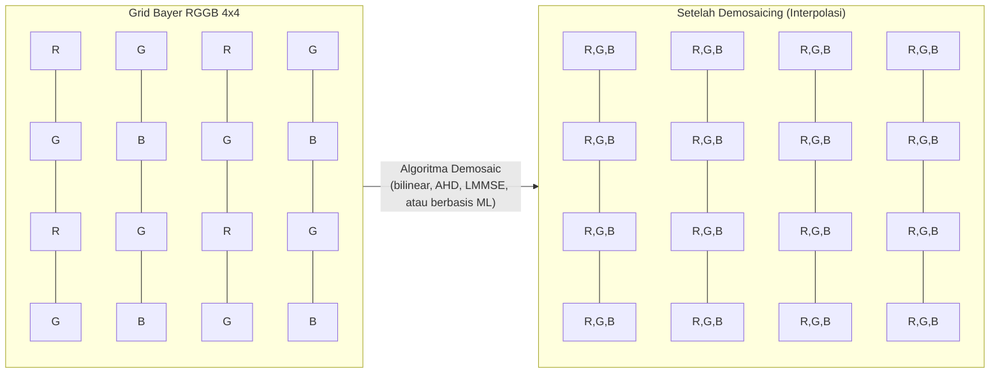
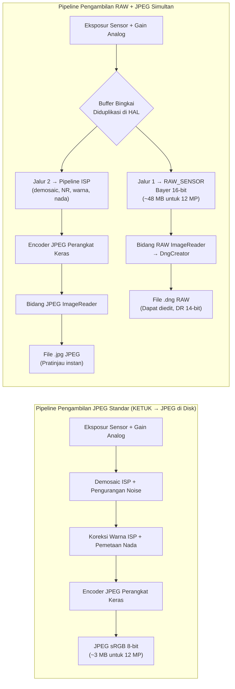

---     
sidebar_position: 18
title: "Bab 18: Fotografi RAW"
description: "Kuasai format RAW_SENSOR, pembuatan file DNG dengan DngCreator, pola Bayer, dan pengambilan RAW+JPEG secara simultan dalam API Android Camera2"
keywords: [Android Camera2, fotografi RAW, RAW_SENSOR, DngCreator, DNG, pola Bayer, RGGB, JPEG_R, metadata kamera]
---

# Bab 18: Fotografi RAW

Fotografi seluler profesional menuntut lebih dari sekadar JPEG hasil pemrosesan yang diproduksi oleh ISP (Image Signal Processor) Android secara default. Saat Anda mengambil foto JPEG, data mentah sensor telah difilter, diinterpolasi, dikoreksi warnanya, dikurangi noise-nya, dan dipetakan nadanya — menghancurkan sebagian besar ruang pengeditan (headroom) yang diandalkan oleh para fotografer. API Camera2 memberi Anda akses langsung ke format **RAW_SENSOR**: data pola Bayer 16-bit yang belum diproses langsung dari sensor, dengan nol gangguan ISP. Dikombinasikan dengan **DngCreator**, kerangka kerja Android menyediakan semua yang Anda butuhkan untuk menghasilkan file Adobe DNG (Digital Negative) standar yang dapat dibuka langsung di Lightroom, Capture One, Photoshop, dan setiap editor RAW profesional.

Bab ini dibangun berdasarkan penelitian yang didokumentasikan dalam bagian *RAW / DngCreator* dari referensi internal proyek, dan memperluasnya dengan kode praktis yang dapat Anda pasang ke dalam aplikasi Anda sendiri. Anda dapat melihat kemampuan ini dihitung untuk setiap perangkat yang didukung dalam aplikasi [Android Camera Parameters](https://github.com/zoozooll/AndroidCameraParameters) — juga tersedia di [Google Play Store](https://play.google.com/store/apps/details?id=com.zoozooll.cameraparameters) — yang melaporkan ukuran RAW maksimum, varian RAW yang tersedia (RAW10, RAW12, RAW14), dan apakah metadata DngCreator terisi penuh untuk setiap ID kamera.

## Mengapa RAW? Biaya Pemrosesan ISP

Sebelum menyelami detail API, sangat penting untuk memahami apa yang dilakukan ISP saat menghasilkan JPEG, dan mengapa melewatinya itu penting. Pipeline ISP smartphone yang khas menerapkan tahap-tahap berikut secara berurutan:

1. **Black level clamping** — mengurangi garis dasar arus gelap (dark-current) sensor
2. **Koreksi bayangan lensa (Lens shading correction)** — menghilangkan vinyet menggunakan peta gain per-piksel
3. **Demosaicing** — menginterpolasi grid Bayer 1-warna-per-piksel menjadi gambar RGB penuh
4. **Pengurangan noise** — menerapkan penyaringan spasial/temporal yang menghapus detail halus bersama dengan noise
5. **Koreksi warna** — menerapkan matriks 3×3 untuk memetakan ruang warna sensor ke sRGB
6. **Pemetaan gamma / nada (Gamma / tone mapping)** — mengompresi 14 stop linear adegan menjadi kurva 8-bit non-linear
7. **Peningkatan tepi (Edge enhancement)** — menajamkan untuk mengompensasi filter low-pass optik
8. **Kompresi JPEG** — menerapkan subsampling chroma lossy (biasanya 4:2:0) dan kuantisasi

Masalah dengan pipeline ini adalah setiap tahap bersifat **tidak dapat diubah (irreversible)** dan disetel untuk *pratinjau* konsumen, bukan *pasca-pemrosesan* profesional. Sebuah JPEG membatasi sorotan (highlights) ke rasio kontras 100:1 dan membungkus 14 bit DR sensor ke dalam 8 bit — jadi saat Anda menarik bayangan (shadows) sebanyak 2 stop di pasca-proses, Anda mendapatkan banding alih-alih detail. RAW menjaga seluruh output sensor linear, memungkinkan pemulihan bayangan/sorotan 4–6 stop dan pergeseran white-balance kustom tanpa menimbulkan artefak warna.

```mermaid
flowchart TD
    subgraph ISP["Pipeline Pemrosesan ISP (Jalur JPEG)"]
        S1[Data RAW Sensor] --> S2[Klem Tingkat Hitam]
        S2 --> S3[Koreksi Bayangan Lensa]
        S3 --> S4[Demosaic]
        S4 --> S5[Pengurangan Noise]
        S5 --> S6[Koreksi Warna]
        S6 --> S7[Pemetaan Gamma / Nada]
        S7 --> S8[Peningkatan Tepi]
        S8 --> S9[Kompresi JPEG]
        S9 --> S10["JPEG sRGB 8-bit<br/>(≈6 stop DR yang dapat digunakan)"]
    end

    subgraph RAW["Jalur RAW (Tanpa Pemrosesan ISP)"]
        R1[Data RAW Sensor] --> R2["Pola Bayer Linear 16-bit<br/>(10–14 stop DR yang dapat digunakan)"]
        R2 --> R3["DngCreator Menulis<br/>Metadata + Data Piksel"]
        R3 --> R4["File .dng<br/>Dapat Diedit di Lightroom/PS"]
    end
```



Bandingkan kedua jalur secara visual di atas: jalur JPEG memangkas data di setiap langkah, sementara jalur RAW menjaga seluruh muatan sensor. Pertukarannya adalah file RAW **tidak dapat ditampilkan secara langsung** — mereka memerlukan fase perenderan terpisah (langkah "pengembangan" di Lightroom) untuk menafsirkan grid Bayer dan mengonversinya ke ruang warna seperti sRGB atau Rec.2020.

## Array Filter Warna Bayer (Bayer Color Filter Array)

Data RAW bukanlah RGB. Setiap photosite pada sensor hanya merekam **satu warna** — merah, hijau, atau biru — karena fotodioda silikon itu sendiri buta warna dan hanya dapat mengukur jumlah foton (luminans). Untuk merekonstruksi warna, produsen menempatkan **Color Filter Array (CFA)** di atas sensor, dan grid saluran tunggal yang dihasilkan dinamai sesuai penemunya: pola Bayer.

Empat tata letak CFA umum ada pada perangkat Android, diidentifikasi oleh urutan ubin 2×2 kiri atas:

| Pola | Tata Letak Ubin | Kasus Penggunaan Tipikal |
|---------|-------------|------------------|
| **RGGB** | `R G / G B` | Kebanyakan smartphone (default Samsung, Sony Exmor RS) |
| **BGGR** | `B G / G R` | Sensor Sony IMX di beberapa perangkat Xiaomi/OnePlus |
| **GRBG** | `G R / B G` | Sensor OmniVision tertentu |
| **GBRG** | `G B / R G` | Jarang; ditemukan di beberapa perangkat kelas menengah Motorola |

Fitur paling mencolok dari grid Bayer adalah **50% piksel adalah hijau**, sementara merah dan biru masing-masing mendapatkan 25%. Ini bukan pilihan sewenang-wenang — respons luminans fotopik mata manusia memuncak pada panjang gelombang hijau (sekitar 555 nm), jadi mengalokasikan dua kali sampel ke hijau memaksimalkan ketajaman yang dirasakan dan performa noise. Saluran luminans dalam JPEG yang dihasilkan diturunkan ~60% dari photosite hijau, sehingga kepadatan sampel hijau secara langsung diterjemahkan menjadi detail yang teratasi.



Blok demosaic di atas (P11–P44) menunjukkan bagaimana setiap piksel direkonstruksi: photosite `R` menggunakan nilai tetangganya `G` dan `B` melalui interpolasi, dan sebaliknya. Interpolasi ini adalah sumber tunggal terbesar dari pelembutan gambar dalam pipeline JPEG — dan persis mengapa Anda ingin melakukannya sendiri dalam pasca-produksi, di mana demosaicing AI modern (AI Enhance dari Lightroom, Topaz DeNoise AI, dll.) dapat memberikan hasil yang lebih tajam daripada ISP perangkat keras smartphone real-time.

## Format RAW_SENSOR dan Varian Terkemas (RAW10 / RAW12 / RAW14)

Format RAW kanonik Android adalah `ImageFormat.RAW_SENSOR`, yang dihitung sebagai buffer 16-bit-per-piksel yang disimpan dalam `Plane` yang dikembalikan oleh `Image.getPlanes()`. Namun, kedalaman bit *efektif* tergantung pada perangkat dan dilaporkan melalui `CameraCharacteristics.SENSOR_INFO_BIT_DEPTH` — bit-bit atas di luar resolusi ADC sensor yang sebenarnya diisi dengan nol (zero-padded).

Kebanyakan smartphone kontemporer menggunakan salah satu dari tiga varian raw terkemas, yang diekspos melalui `StreamConfigurationMap.getOutputSizes()` dengan konstanta format khusus:

| Konstanta Format | Bit/sampel | Tata Letak Penyimpanan | Generasi Sensor Tipikal |
|-----------------|-------------|----------------|---------------------------|
| `RAW10`         | 10          | Terkemas: 4 sampel per 5 byte (rata kiri MSB) | Sensor kelas menengah 2019–2022 (misalnya IMX586, IMX682) |
| `RAW12`         | 12          | Terkemas: 2 sampel per 3 byte | Unggulan 2021–2024 (misalnya IMX800, IMX989 tipe 1 inci) |
| `RAW14`         | 14          | 16-bit dengan padding (rata kiri MSB) | Tingkat profesional / sensor 1 inci+ (IMX989 dengan DOL-HDR) |

Format terkemas adalah alasan mengapa Anda **harus menggunakan `Buffer.getByte()` / `Buffer.getShort()` dengan kesadaran akan stride piksel**, daripada memperlakukan buffer RAW sebagai array short[] datar — sampel RAW10 dan RAW12 melewati batas byte dan membutuhkan pergeseran bit untuk diekstrak. `DngCreator` menangani semua pengemasan/pembongkaran ini secara transparan jika Anda memberikan objek `Image` secara langsung, yang merupakan pendekatan yang direkomendasikan.

## DNG: Standar Negatif Digital Adobe 1.4

Mengapa menulis file `.dng` daripada format milik vendor seperti `.arw` (Sony) atau `.cr3` (Canon)? Karena **DNG adalah satu-satunya format RAW universal**, diterbitkan sebagai ISO 12234-2 dan diterima oleh setiap toolchain foto profesional. DNG v1.4 (versi yang ditargetkan Android) menetapkan:

- Kontainer yang kompatibel dengan TIFF/EP (struktur IFD little-endian)
- Tag TIFF wajib untuk pola CFA, tingkat hitam, dan matriks warna
- Opsional `ColorMatrix2` / `CalibrationIlluminant2` untuk profil iluminan ganda
- Opsional peta bayangan lensa (tag 0xC618) untuk koreksi flat-field per-piksel
- Opsional IFD "makernotes" untuk data kalibrasi khusus OEM

Tanpa metadata ini, buffer RAW hanyalah grid angka tanpa label — tidak ada editor RAW yang dapat merendernya dengan benar. Kelas `DngCreator` dalam paket `android.hardware.camera2` Android dibuat khusus untuk mengisi **semua metadata DNG 1.4 yang diperlukan secara otomatis** dari `CameraCharacteristics` dan `CaptureResult`, yang berarti aplikasi Anda tidak perlu menyertakan data kalibrasi sensor untuk setiap perangkat.

Bidang metadata spesifik yang ditulis oleh `DngCreator` meliputi:

| Tag DNG | Sumber | Tujuan |
|---------|--------|---------|
| **BlackLevel** (SENSOR_BLACK_LEVEL_PATTERN) | `CameraCharacteristics` | Garis dasar arus gelap per-saluran 4 elemen |
| **ColorMatrix1 / ColorMatrix2** (SENSOR_COLOR_TRANSFORM1 / 2) | `CameraCharacteristics` | Matriks 3×3 yang memetakan RGB sensor → XYZ pada Iluminan A (D65) |
| **CalibrationIlluminant1 / 2** | `CameraCharacteristics` | Enum iluminan standar (17 = Standar A, 21 = D65) |
| **ForwardMatrix1 / ForwardMatrix2** (SENSOR_FORWARD_MATRIX1 / 2) | `CameraCharacteristics` | Transformasi balik XYZ → RGB sensor |
| **NeutralColorPoint** (SENSOR_NEUTRAL_COLOR_POINT) | `CameraCharacteristics` | Rasio white-balance asli (r/g, b/g) |
| **LensShadingMap** (STATISTICS_LENS_SHADING_MAP) | `CaptureResult` | Grid gain per-saluran 4 saluran untuk penghilangan vinyet |
| **CFA Pattern 2** | `CameraCharacteristics.SENSOR_INFO_COLOR_FILTER_ARRANGEMENT` | Pengkodean ubin Bayer |
| **BaselineExposure** | `SENSOR_REFERENCE_ILLUMINANT1` | Offset eksposur default untuk diterapkan selama perenderan |

Daftar ini diambil langsung dari spesifikasi *RAW / DngCreator* dalam dokumen penelitian proyek. Jika salah satu dari bidang ini dilaporkan sebagai `null` oleh API Camera2, `DngCreator` akan tetap menghasilkan DNG yang valid tetapi file yang dihasilkan mungkin memerlukan kalibrasi manual di pasca-proses. Anda dapat memeriksa bidang mana yang terisi untuk setiap ID kamera menggunakan aplikasi Android Camera Parameters.

## Menyiapkan Pengambilan RAW + JPEG Secara Simultan

Alur kerja yang benar untuk pengambilan RAW menggunakan **beberapa target output dalam satu `CaptureRequest`** — ini menjamin buffer RAW dan JPEG berasal dari *bingkai yang persis sama* (stempel waktu identik, eksposur sensor identik), yang sangat penting untuk alur kerja cadangan RAW+JPEG yang diharapkan oleh sebagian besar fotografer. Mencoba dua pengambilan berurutan akan menimbulkan variabilitas antar-bingkai dalam eksposur, AF, dan AWB.

### Langkah 1: Kueri Kemampuan dan Ukuran RAW Maksimum

```kotlin
import android.hardware.camera2.CameraCharacteristics
import android.hardware.camera2.params.StreamConfigurationMap
import android.util.Size
import android.graphics.ImageFormat

fun getRawCapabilities(cameraId: String,
                       characteristics: CameraCharacteristics): Pair<Boolean, Size?> {
    val caps = characteristics.get(
        CameraCharacteristics.REQUEST_AVAILABLE_CAPABILITIES
    ) ?: intArrayOf()
    val supportsRaw = caps.contains(
        CameraCharacteristics.REQUEST_AVAILABLE_CAPABILITIES_RAW
    )
    if (!supportsRaw) return Pair(false, null)

    val configMap: StreamConfigurationMap? =
        characteristics.get(CameraCharacteristics.SCALER_STREAM_CONFIGURATION_MAP)

    val rawSizes = configMap?.getOutputSizes(ImageFormat.RAW_SENSOR)
        ?: emptyArray()
    val maxRawSize = rawSizes.maxByOrNull { it.width * it.height }

    return Pair(true, maxRawSize)
}
```

`REQUEST_AVAILABLE_CAPABILITIES_RAW` adalah gerbang wajib — jika tidak disetel, HAL akan menolak output RAW_SENSOR apa pun, dan mencoba membuat `ImageReader` dengan format tersebut akan melempar `IllegalArgumentException`. Aplikasi Android Camera Parameters mencantumkan kemampuan ini per ID kamera pada dasbor utamanya.

### Langkah 2: Buat ImageReader Ganda (RAW + JPEG)

```kotlin
import android.media.ImageReader
import android.graphics.ImageFormat

private var rawImageReader: ImageReader? = null
private var jpegImageReader: ImageReader? = null

fun setupDualImageReaders(rawSize: Size, jpegSize: Size) {
    rawImageReader = ImageReader.newInstance(
        rawSize.width,
        rawSize.height,
        ImageFormat.RAW_SENSOR,
        5 // Kedalaman buffer perolehan: >= 2, 5 memungkinkan ruang untuk pengambilan burst
    ).apply {
        setOnImageAvailableListener(
            OnRawImageAvailableListener(),
            backgroundHandler
        )
    }

    jpegImageReader = ImageReader.newInstance(
        jpegSize.width,
        jpegSize.height,
        ImageFormat.JPEG,
        2
    ).apply {
        setOnImageAvailableListener(
            OnJpegImageAvailableListener(),
            backgroundHandler
        )
    }
}
```

Kedalaman buffer `maxImages` RAW harus lebih besar (5) karena buffer RAW memiliki bandwidth 2–4× JPEG, dan HAL dapat mengirimkan 2–3 bingkai sebelum penulis disk menyusul. Kehabisan ruang buffer RAW menyebabkan pembuangan bingkai secara diam-diam tanpa callback kesalahan.

### Langkah 3: Buat CaptureSession dengan Kedua Surface dan Kirim Pengambilan Multi-Target

```kotlin
import android.hardware.camera2.CameraDevice
import android.hardware.camera2.CaptureRequest
import android.view.Surface

lateinit var cameraDevice: CameraDevice

fun createCaptureSessionAndCapture(
    rawSurface: Surface,
    jpegSurface: Surface,
    previewSurface: Surface
) {
    val outputSurfaces = listOf(previewSurface, rawSurface, jpegSurface)

    cameraDevice.createCaptureSession(
        outputSurfaces,
        object : CameraCaptureSession.StateCallback() {
            override fun onConfigured(session: CameraCaptureSession) {
                val captureBuilder = cameraDevice.createCaptureRequest(
                    CameraDevice.TEMPLATE_STILL_CAPTURE
                ).apply {
                    addTarget(previewSurface)
                    addTarget(rawSurface)
                    addTarget(jpegSurface)

                    set(CaptureRequest.CONTROL_AF_MODE,
                        CaptureRequest.CONTROL_AF_MODE_CONTINUOUS_PICTURE)
                    set(CaptureRequest.CONTROL_AE_MODE,
                        CaptureRequest.CONTROL_AE_MODE_ON)
                    set(CaptureRequest.CONTROL_AWB_MODE,
                        CaptureRequest.CONTROL_AWB_MODE_OFF) // Kunci WB di RAW!
                }

                session.capture(
                    captureBuilder.build(),
                    RawCaptureCallback(),
                    backgroundHandler
                )
            }
            override fun onConfigureFailed(session: CameraCaptureSession) = Unit
        },
        backgroundHandler
    )
}
```

Tiga detail di sini tidak dapat ditawar:

1. **AWB harus dikunci (`CONTROL_AWB_MODE_OFF`) untuk pengambilan RAW.** Jika AWB dibiarkan menyala, HAL akan menerapkan tanjakan gain RGB di tengah burst, artinya setiap bingkai RAW memiliki white balance asli yang berbeda — yang merusak kemampuan editor RAW untuk menerapkan profil yang seragam. Gunakan `CaptureResult.SENSOR_NEUTRAL_COLOR_POINT` untuk mendapatkan WB yang benar di pasca-proses sebagai gantinya.

2. **Gunakan `TEMPLATE_STILL_CAPTURE`** sebagai template dasar. Ini mengonfigurasi sensor untuk mode pembacaan kualitas tertinggi dan menonaktifkan pengurangan noise khusus pratinjau yang mungkin dimasukkan oleh HAL.

3. **Ketiga target (pratinjau, RAW, JPEG) berada dalam satu `CaptureRequest`.** HAL menjamin pengiriman yang bertepatan waktu.

### Langkah 4: Gunakan DngCreator untuk Menulis File DNG

Callback `OnImageAvailableListener` menerima objek `Image` yang data piksel RAW-nya sudah dapat diakses. Berikan `Image` *dan* `CaptureResult` yang cocok ke `DngCreator`, bersama dengan `CameraCharacteristics` asli yang digunakan untuk membuka kamera — kombinasi ini diperlukan untuk mengisi semua metadata DNG 1.4 dengan benar.

```kotlin
import android.hardware.camera2.CameraCharacteristics
import android.hardware.camera2.CaptureResult
import android.hardware.camera2.DngCreator
import android.media.Image
import java.io.File
import java.io.FileOutputStream
import java.io.IOException

inner class OnRawImageAvailableListener : ImageReader.OnImageAvailableListener {
    private val pendingDngWrites =
        HashMap<Long, CaptureResult>() // timestamp → CaptureResult

    fun registerCaptureResult(timestamp: Long, result: CaptureResult) {
        pendingDngWrites[timestamp] = result
    }

    override fun onImageAvailable(reader: ImageReader) {
        var image: Image? = null
        try {
            image = reader.acquireLatestImage() ?: return
            val timestamp = image.timestamp

            val captureResult = pendingDngWrites.remove(timestamp) ?: return
            val characteristics = latestCameraCharacteristics ?: return

            val dngFile = File(
                getExternalFilesDir(null),
                "RAW_${System.currentTimeMillis()}.dng"
            )

            FileOutputStream(dngFile).use { fos ->
                val dngCreator = DngCreator(characteristics, captureResult)
                dngCreator.writeByteBuffer(
                    fos,
                    image.width,
                    image.height,
                    image.planes[0].buffer,
                    0 // padding, selalu 0 untuk RAW_SENSOR
                )
            }

        } catch (e: IOException) {
            Log.e(TAG, "Gagal menulis file DNG", e)
        } catch (e: IllegalStateException) {
            Log.e(TAG, "DngCreator menolak metadata (bidang wajib hilang)", e)
        } finally {
            image?.close() // KRITIS: JANGAN PERNAH bocorkan referensi Image
        }
    }
}
```

Konstruktor `DngCreator` menerima tepat dua argumen:
- **`CameraCharacteristics`** — bidang statis per-kamera (tingkat hitam, matriks warna, pola CFA, titik warna netral, iluminan 1&2)
- **`CaptureResult`** — bidang dinamis per-bingkai (eksposur sensor, ISO, peta bayangan lensa, posisi lensa AF)

Jika salah satunya `null` atau jika bidang metadata wajib hilang (misalnya beberapa perangkat anggaran melaporkan `null` untuk `SENSOR_COLOR_TRANSFORM1`), konstruktor akan melempar `IllegalArgumentException` pada saat konstruksi (bukan pada `writeByteBuffer`). Inilah sebabnya aplikasi Android Camera Parameters secara eksplisit melaporkan setiap bidang yang relevan dengan DNG: pengembang dapat memfilter perangkat terlebih dahulu untuk menghindari crash pada perangkat dengan implementasi HAL yang tidak lengkap.

Peta timestamp `pendingDngWrites` memecahkan masalah konkurensi nyata: `CaptureResult.CaptureCallback.onCaptureCompleted()` dipicu **sebelum atau sesudah** `OnImageAvailableListener.onImageAvailable()` (tergantung HAL). Mencocokkan berdasarkan `image.timestamp` == `CaptureResult.SENSOR_TIMESTAMP` menjamin metadata yang tepat dipasangkan dengan buffer piksel yang tepat.

## Perbandingan Pipeline Pemrosesan (Mermaid Mendetail)



Wawasan utama dari diagram ini adalah simpul duplikasi bingkai **G**: HAL membaca satu bingkai dari sensor, lalu merutekan salinan yang tidak dimodifikasi ke output RAW sambil memasukkan salinan yang *sama* ke dalam ISP untuk pengkodean JPEG. Ini menjamin paritas bingkai tanpa menggandakan bandwidth pembacaan sensor.

## Pertimbangan Performa dan Batas Praktis

Menulis file DNG 12–48 MB ke penyimpanan flash membutuhkan waktu yang terukur:
- Penyimpanan UFS 3.1: tulis sekuensial ~250 MB/s → DNG 12 MP (~48 MB) butuh ~190 ms
- Penyimpanan eMMC 5.1: tulis sekuensial ~120 MB/s → file yang sama butuh ~400 ms

Ini berarti Anda **tidak boleh memblokir thread UI pada penulisan DNG** — selalu jalankan `writeByteBuffer` pada thread latar belakang/Handler, dan selalu tutup `Image` dalam blok `finally` untuk menghindari kehabisan buffer HAL.

Batasan penting lainnya: tidak semua perangkat mendukung RAW + JPEG dalam sesi yang sama bahkan jika `CAPABILITIES_RAW` disetel. Cara yang benar untuk memverifikasi adalah `StreamConfigurationMap.isOutputSupportedFor(surfaceList)` dengan kedua surface dalam daftar. Jika ini mengembalikan `false`, gunakan sesi khusus RAW.

## Ringkasan

Bab ini membahas alur kerja fotografi RAW ujung-ke-ujung lengkap dalam Android Camera2:

- **Format RAW_SENSOR** memberikan grid Bayer 16-bit yang belum diproses dari sensor, melewati setiap tahap pemrosesan ISP.
- **Pola Bayer** (RGGB, BGGR, GRBG, GBRG) mengalokasikan 50% photosite untuk hijau guna pengambilan sampel luminans yang dioptimalkan untuk penglihatan manusia.
- **Varian terkemas** — RAW10, RAW12, RAW14 — menyimpan sampel pada kedalaman bit ADC asli; DngCreator membongkarnya secara transparan.
- **DNG v1.4** adalah kontainer RAW universal. `DngCreator(characteristics, result).writeByteBuffer(...)` mengisi semua metadata wajib: tingkat hitam, matriks warna, peta bayangan lensa, titik warna netral, dan iluminan kalibrasi 1 & 2.
- **CaptureRequest multi-target** merutekan bingkai yang sama ke ImageReader RAW dan JPEG, menjamin paritas bingkai untuk alur kerja RAW+JPEG.
- **Pencocokan stempel waktu (timestamp matching)** antara `CaptureResult` dan `Image` diperlukan karena callback dipicu dalam urutan yang bergantung pada HAL.

## Apa Selanjutnya

Dalam bab berikutnya, kita beralih dari fotografi diam ke video dengan **Bab 19: Video Kecepatan Tinggi**, di mana kita menggunakan `CameraConstrainedHighSpeedCaptureSession` untuk mencapai pengambilan gambar 120 fps (gerak lambat 4×) dan 240 fps (gerak lambat 8×). Anda akan mempelajari mengapa sesi kecepatan tinggi memerlukan `createHighSpeedRequestList` alih-alih CaptureRequest individu, dan bagaimana pipeline kecepatan tinggi khusus milik HAL melewati jalur pratinjau normal untuk memberikan frame rate yang jika tidak akan membebani CPU.

Anda dapat memvalidasi kemampuan RAW perangkat Anda, ukuran RAW maksimum, dan kelengkapan metadata DngCreator dengan menginstal aplikasi [Android Camera Parameters](https://play.google.com/store/apps/details?id=com.zoozooll.cameraparameters) — dan berkontribusi laporan perangkat ke repositori [GitHub](https://github.com/zoozooll/AndroidCameraParameters) sumber terbuka untuk membantu pengembang lain mengetahui perangkat mana yang mendukung alur kerja RAW profesional.
