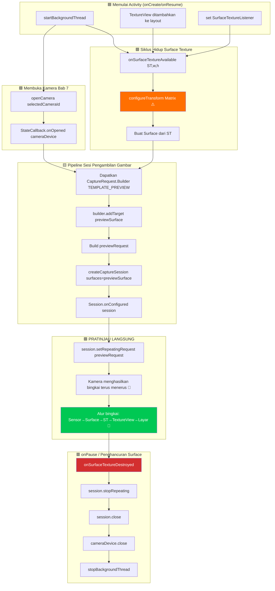

Ini adalah bab yang Anda tunggu-tunggu. Setelah tiga bab membangun kerangka kerja (izin, threading, CameraManager, enumerasi, siklus hidup buka/tutup), Anda akhirnya akan **melihat output kamera dirender secara langsung pada layar perangkat Android**. Pratinjau adalah jiwa dari aplikasi kamera — inilah yang dilihat pengguna untuk membingkai bidikan, memeriksa fokus, dan memverifikasi eksposur sebelum mengetuk rana. Melakukannya dengan benar membuat perbedaan antara aplikasi yang patah-patah, tidak dapat digunakan dan pengalaman kamera yang halus dan responsif.

Untuk referensi implementasi pratinjau yang menangani kasus tepi di ratusan perangkat, lihat layar pratinjau di aplikasi **Android Camera Parameters** ([GitHub](https://github.com/zoozooll/AndroidCameraParameters) / [Google Play](https://play.google.com/store/apps/details?id=com.minininja.cameraparams)). Pipeline pratinjaunya mencakup transformasi sadar orientasi, surface output multi-resolusi, dan pembatasan (throttling) frame rate yang halus — semuanya dibangun di atas komponen fundamental yang sama yang kita bahas di sini.

## Pipeline Pratinjau: Ikhtisar Komponen

Sebelum kita menyelami kode, mari kita petakan perjalanan konseptual dari satu bingkai pratinjau dari sensor kamera ke tampilan ponsel. Setiap bingkai melewati lima lapisan:

```
Sensor Kamera → Pipeline CameraDevice → Surface (BufferQueue) → SurfaceTexture → TextureView → Tampilan
```

Setiap lapisan memainkan peran spesifik yang tidak dapat digantikan. Melewatkan atau memotong kompas pada salah satu darinya akan menghasilkan layar hitam, aspek rasio yang terdistorsi, atau tearing. Mari kita definisikan setiap komponen:

### 1. Surface — Buffer Tujuan Gambar

Sebuah `Surface` adalah konsep generik API Camera2 tentang **tujuan untuk bingkai gambar yang diproses**. Di balik layar, sebuah Surface membungkus `BufferQueue` Android: sebuah buffer melingkar dari buffer grafis (biasanya sedalam 3–5 buffer) yang dikelola oleh kompositir sistem (SurfaceFlinger). Ketika Camera2 "merender bingkai" ke Surface, ia mengeluarkan (dequeue) buffer kosong dari antrean, mengisinya dengan data piksel, dan memasukkannya kembali (enqueue) untuk digunakan oleh konsumen.

Apa pun yang dapat mengonsumsi buffer grafis dapat mengekspos `Surface`. Konsumen yang paling umum adalah:
- **SurfaceTexture** → mengisi `TextureView` (untuk pratinjau di layar — bab ini)
- **Surface dari MediaRecorder/MediaCodec** → pengkodean video (tidak dibahas dalam seri ini)
- **Surface ImageReader** → objek `Image` yang dapat diakses CPU untuk pengambilan JPEG/RAW (Bab 9)

### 2. SurfaceTexture — Jembatan GPU-ke-GPU

`SurfaceTexture` adalah kelas ajaib yang mengubah aliran mentah bingkai kamera menjadi tekstur yang dapat diambil sampelnya dan dirender oleh GPU. Ini adalah ujung konsumen dari BufferQueue milik Surface, tetapi alih-alih menyerahkan buffer ke CPU, ia mengubahnya menjadi tekstur OpenGL ES `GL_TEXTURE_EXTERNAL_OES`. Hal ini memungkinkan `TextureView` untuk menyatukan (composite) bingkai kamera ke hierarki tampilan menggunakan perenderan GPU standar — tidak diperlukan salinan CPU, sehingga pratinjau 60+ FPS mudah dicapai.

Anda mendapatkan `Surface` untuk `SurfaceTexture` dengan:
```kotlin
val surface = Surface(surfaceTexture)
```

### 3. TextureView — Jendela di Layar

`TextureView` adalah subclass `View` yang dapat menampilkan konten dari `SurfaceTexture`. Ini adalah penerus modern dari `SurfaceView` yang lebih lama, dan pilihan yang direkomendasikan untuk pratinjau Camera2 karena tiga alasan:
- Ia berperilaku seperti View normal (dapat dianimasikan, ditransformasikan, di-alpha-blend, ditempatkan dalam wadah yang dapat digulir).
- Ia tidak memaksa Activity untuk menggunakan jendela transparan (tidak seperti SurfaceView, yang membuat "lubang" pada hierarki tampilan).
- `SurfaceTextureListener`-nya memberi kita callback siklus hidup yang tepat untuk kapan surface dibuat, dihancurkan, atau diubah ukurannya.

Untuk mendapatkan akses berbasis callback ke SurfaceTexture yang mendasarinya, `TextureView` mengekspos `setSurfaceTextureListener()` dengan empat callback:
- `onSurfaceTextureAvailable(surfaceTexture, width, height)` — surface siap menerima bingkai (dipicu sekali saat view disusun).
- `onSurfaceTextureSizeChanged(surfaceTexture, width, height)` — ukuran surface berubah (misalnya, perangkat diputar).
- `onSurfaceTextureDestroyed(surfaceTexture)` — akan segera dihancurkan; kita harus menghentikan pratinjau sebelum ini kembali.
- `onSurfaceTextureUpdated(surfaceTexture)` — dipicu untuk **setiap bingkai baru** (dapat digunakan untuk menggerakkan overlay pelacakan wajah, dll.).

### 4. CameraCaptureSession — Pipeline yang Dikonfigurasi

Sebelum `CameraDevice` dapat menghasilkan bingkai apa pun, Anda harus membuat `CameraCaptureSession`. Sesi adalah **konfigurasi dari semua Surface output yang akan ditulis oleh pipeline kamera**. Anda dapat menganggapnya sebagai "penghubung pipa" ISP (Image Signal Processor) kamera untuk merutekan outputnya ke satu atau lebih wastafel (sinks). Untuk pratinjau saja, sesi memiliki satu Surface (milik TextureView). Saat kita menambahkan pengambilan foto di Bab 9, sesi akan memiliki dua Surface: pratinjau + `ImageReader`.

Aturan utama:
- Sesi dibuat dengan `CameraDevice.createCaptureSession(outputSurfaces, stateCallback, handler)`.
- Sesi hanya dapat digunakan **setelah** `StateCallback.onConfigured(session)` dipicu.
- Sebuah `CameraDevice` hanya dapat memiliki **satu sesi aktif pada satu waktu**. Membuat sesi baru akan menutup sesi sebelumnya.
- Sesi memiliki *semua* output selama masa pakainya; menambahkan surface baru (misalnya, tiba-tiba memutuskan untuk merekam video) memerlukan pembongkaran sesi lama dan pembuatan sesi baru dengan semua surface (pratinjau + perekam).

### 5. Permintaan Pengambilan Gambar Berulang (TEMPLATE_PREVIEW)

Setelah sesi dikonfigurasi, bagaimana pratinjau berkelanjutan terjadi? Camera2 adalah API berbasis permintaan — setiap bingkai adalah `CaptureRequest` yang dikirimkan ke sesi. Untuk pratinjau, kita mengirimkan **satu permintaan dan menandainya sebagai berulang**: perangkat keras kamera akan menjalankan kembali permintaan yang sama (dengan pengaturan sensor, target, dan status 3A yang sama) secara terus-menerus, menghasilkan bingkai secepat yang dimungkinkan oleh pipeline (biasanya 30–120 FPS).

Permintaan berulang dikirimkan dengan:
```kotlin
session.setRepeatingRequest(previewRequest, captureCallback, backgroundHandler)
```

Template untuk pratinjau adalah `CameraDevice.TEMPLATE_PREVIEW`. Camera2 menyediakan beberapa template bawaan yang mengonfigurasi ratusan parameter tingkat rendah (eksposur, rentang frame rate, mode 3A, pengurangan noise, dll.) secara tepat untuk kasus penggunaan tersebut. Untuk pratinjau, `TEMPLATE_PREVIEW` mengoptimalkan **latensi rendah dan frame rate yang mulus**, meskipun itu berarti rentang dinamis sensor sedikit berkurang dibandingkan dengan `TEMPLATE_STILL_CAPTURE` (digunakan di Bab 9 untuk foto).

## Diagram Alur Pratinjau Ujung-ke-Ujung

Diagram alur di bawah ini menunjukkan bagaimana semua komponen ini terhubung. Ikuti dengan seksama saat membaca kode — setiap blok berhubungan dengan panggilan fungsi yang sebenarnya.



Blok yang disorot oranye (`configureTransform`) dan blok yang disorot hijau (PRATINJAU LANGSUNG) adalah dua langkah yang paling kritis. Lewati `configureTransform`, dan pratinjau Anda akan meregang, berputar, atau gepeng. Hubungkan semuanya dengan benar tetapi gagal memanggil `setRepeatingRequest`, dan layar akan tetap hitam tanpa ada log kesalahan yang dicatat.

## Langkah 1: Tambahkan TextureView ke Layout XML

Pertama, buat atau perbarui `app/src/main/res/layout/activity_main.xml` untuk menyertakan `TextureView` layar penuh. Kita juga akan menambahkan overlay `TextView` sebagai indikator status sehingga kita dapat melihat ukuran pratinjau.

```xml
<?xml version="1.0" encoding="utf-8"?>
<FrameLayout xmlns:android="http://schemas.android.com/apk/res/android"
    xmlns:tools="http://schemas.android.com/tools"
    android:layout_width="match_parent"
    android:layout_height="match_parent">

    <TextureView
        android:id="@+id/textureView"
        android:layout_width="match_parent"
        android:layout_height="match_parent"
        android:layout_gravity="center" />

    <TextView
        android:id="@+id/statusTextView"
        android:layout_width="wrap_content"
        android:layout_height="wrap_content"
        android:layout_gravity="top|center_horizontal"
        android:layout_marginTop="16dp"
        android:background="#80000000"
        android:padding="8dp"
        android:textColor="#FFFFFFFF"
        android:textSize="12sp"
        tools:text="Menginisialisasi kamera..." />

</FrameLayout>
```

Mengapa `FrameLayout` sebagai root? Karena pratinjau adalah lapisan layar penuh, dan `FrameLayout` menumpuk anak-anaknya dengan urutan-Z (anak yang muncul kemudian digambar di atas). Nanti kita akan menambahkan overlay tombol rana. `TextureView` menggunakan `match_parent` pada kedua dimensi — tetapi jangan khawatir, kita akan menggunakan `configureTransform` di bawah ini untuk melakukan letterbox dengan benar, sehingga pikselnya sendiri tidak pernah meregang meskipun view memenuhi layar.

## Langkah 2: configureTransform — Rahasia Aspek Rasio Pratinjau yang Benar

Jika Anda tidak melakukan apa-apa dan hanya menyalurkan bingkai ke TextureView layar penuh, pratinjau akan **meregang**. Mengapa? Karena sensor kamera memiliki aspek rasio tetap (hampir selalu 4:3 untuk pengambilan foto diam, terkadang 16:9 untuk mode video), dan tampilan ponsel memiliki aspek rasio yang berbeda (seringkali ~20:9 pada ponsel unggulan modern). Jika kamera mengeluarkan bingkai pratinjau 4032×3024 (4:3) dan TextureView meregangkannya menjadi 1080×2400 (20:9), wajah orang akan tampak kurus dan tinggi.

Solusinya adalah **`configureTransform(viewWidth: Int, viewHeight: Int)`**: sebuah metode yang menghitung `Matrix` (rotasi + penskalaan center-crop) dan menerapkannya pada TextureView. Matriks tersebut melakukan tiga hal:
1. **Memutar** gambar sesuai jumlah derajat putaran perangkat relatif terhadap orientasi alami sensor kamera.
2. **Menskalakan** gambar sehingga memenuhi TextureView sepenuhnya dengan tetap mempertahankan aspek rasio (gaya center-crop, atau letterbox dengan bilah hitam jika Anda lebih suka).
3. **Memusatkan kembali** gambar yang telah diskalakan/diputar sehingga berada di tengah view.

Ini adalah fungsi yang paling banyak disalin dari sampel resmi Android Camera2 — setiap pengembang membutuhkannya, dan mudah untuk salah melakukannya. Berikut adalah versi kanoniknya:

```kotlin
/**
 * Mengonfigurasi transformasi Matrix yang diperlukan ke `textureView`.
 * Metode ini harus dipanggil setelah ukuran pratinjau kamera ditentukan
 * dan juga ukuran `textureView` sudah tetap.
 *
 * @param viewWidth  Lebar dari `textureView`
 * @param viewHeight Tinggi dari `textureView`
 * @param previewSize Ukuran pratinjau yang dipilih kamera (lebar, tinggi)
 * @param sensorOrientationDegrees Karakteristik SENSOR_ORIENTATION dari kamera
 * @param deviceDisplayRotationDegrees Rotasi tampilan (0/90/180/270) relatif terhadap alami
 */
private fun configureTransform(
    viewWidth: Int,
    viewHeight: Int,
    previewSize: android.util.Size,
    sensorOrientationDegrees: Int,
    deviceDisplayRotationDegrees: Int
) {
    val rotation = when (deviceDisplayRotationDegrees) {
        android.view.Surface.ROTATION_0 -> 0
        android.view.Surface.ROTATION_90 -> 90
        android.view.Surface.ROTATION_180 -> 180
        android.view.Surface.ROTATION_270 -> 270
        else -> return
    }

    val matrix = android.graphics.Matrix()
    val viewRect = android.graphics.RectF(0f, 0f, viewWidth.toFloat(), viewHeight.toFloat())
    val bufferRect = android.graphics.RectF(
        0f,
        0f,
        previewSize.height.toFloat(),
        previewSize.width.toFloat()
    )
    val centerX = viewRect.centerX()
    val centerY = viewRect.centerY()

    // Langkah 1: Perhitungkan rotasi perangkat relatif terhadap orientasi sensor
    if (Surface.ROTATION_90 == rotation || Surface.ROTATION_270 == rotation) {
        bufferRect.offset(centerX - bufferRect.centerX(), centerY - bufferRect.centerY())
        matrix.setRectToRect(viewRect, bufferRect, android.graphics.Matrix.ScaleToFit.FILL)
        val scale = maxOf(
            viewHeight.toFloat() / previewSize.height,
            viewWidth.toFloat() / previewSize.width
        )
        matrix.postScale(scale, scale, centerX, centerY)
        matrix.postRotate(
            (90 * (rotation - 2)).toFloat(),
            centerX,
            centerY
        )
    } else if (Surface.ROTATION_180 == rotation) {
        matrix.postRotate(180f, centerX, centerY)
    }

    // Langkah 2: Juga perhitungkan bagaimana sensor dipasang relatif terhadap perangkat
    val relativeRotation = (sensorOrientationDegrees - rotation + 360) % 360
    if (relativeRotation != 0) {
        matrix.postRotate(relativeRotation.toFloat(), centerX, centerY)
    }

    textureView.setTransform(matrix)
}
```

Detail penting: `previewSize` adalah ukuran output kamera, dilaporkan sebagai (lebar, tinggi) dalam **orientasi sensor**. Dimensi TextureView ada dalam **orientasi tampilan**. Trik RectF dengan menukar lebar/tinggi (`bufferRect` menggunakan `previewSize.height` untuk lebar dan sebaliknya) memperhitungkan pertukaran koordinat sensor vs tampilan ini.

Anda akan membutuhkan dua keping informasi CameraCharacteristics untuk memanggil ini:
- `SENSOR_ORIENTATION` — berapa derajat sensor diputar relatif terhadap orientasi alami perangkat. Untuk kamera belakang, ini hampir selalu 90°. Untuk kamera depan, biasanya 270° (sehingga gambar dicerminkan dengan benar). Baca ini sekali per kamera pada fase penemuan.
- Rotasi tampilan — dari `(getSystemService(Context.WINDOW_SERVICE) as WindowManager).defaultDisplay.rotation` (pada API yang lebih baru gunakan `display?.rotation`).

## Langkah 3: Pilih Ukuran Pratinjau dari SCALER_STREAM_CONFIGURATION_MAP

Sebelum kita dapat menulis `configureTransform` atau membuat sesi, kita perlu tahu ukuran pratinjau apa yang dapat dikeluarkan oleh kamera. Untuk setiap kamera, `CameraCharacteristics.SCALER_STREAM_CONFIGURATION_MAP` mengembalikan `StreamConfigurationMap` yang berisi semua pasangan (format, ukuran) yang valid yang dapat dihasilkan kamera. Untuk pratinjau pada `SurfaceTexture`, kita menanyakan ukuran output terhadap kelas `SurfaceTexture::class.java`:

```kotlin
private fun chooseOptimalPreviewSize(
    characteristics: CameraCharacteristics,
    maxWidth: Int,
    maxHeight: Int,
    targetAspectRatio: Double
): android.util.Size {
    val map = characteristics.get(CameraCharacteristics.SCALER_STREAM_CONFIGURATION_MAP)
        ?: throw IllegalStateException("Peta konfigurasi stream tidak tersedia")

    // Semua ukuran yang didukung untuk output SurfaceTexture (kelas pratinjau)
    val choices = map.getOutputSizes(SurfaceTexture::class.java).toList()

    // Utamakan ukuran yang cocok dengan aspek rasio, lalu yang muat dalam dimensi maks,
    // kemudian pilih yang terbesar (kualitas terbaik) di antara sisanya.
    val acceptable = choices.filter {
        it.width <= maxWidth
            && it.height <= maxHeight
            && Math.abs(it.width.toDouble() / it.height - targetAspectRatio) < 0.02
    }

    val chosen = acceptable.ifEmpty { choices }
        .maxByOrNull { it.width * it.height }!!

    Log.d(TAG, "Ukuran pratinjau terpilih: ${chosen.width}x${chosen.height} " +
        "(dari ${choices.size} opsi, batasMaks=${maxWidth}x${maxHeight})")
    return chosen
}
```

Parameter default yang masuk akal: `maxWidth = 1920`, `maxHeight = 1080`, `targetAspectRatio = textureView.width.toDouble() / textureView.height`. Surface pratinjau tidak perlu 4K — 1080p sudah cukup untuk membingkai bidikan pada layar ponsel, menggunakan lebih sedikit daya, dan menjaga latensi pipeline tetap rendah.

## Langkah 4: Kode Lengkap Bab 8 — Pratinjau Langsung

Berikut adalah `MainActivity.kt` lengkap yang mengintegrasikan setiap bagian dari bab ini: layout berbasis `TextureView`, `SurfaceTextureListener`, pemilihan ukuran, `configureTransform`, pembuatan `CameraCaptureSession`, dan yang terpenting `setRepeatingRequest(TEMPLATE_PREVIEW)`.

```kotlin
package com.example.camera2tutorial

import android.Manifest
import android.content.Context
import android.content.pm.PackageManager
import android.graphics.Matrix
import android.graphics.RectF
import android.graphics.SurfaceTexture
import android.hardware.camera2.CameraAccessException
import android.hardware.camera2.CameraCharacteristics
import android.hardware.camera2.CameraCaptureSession
import android.hardware.camera2.CameraDevice
import android.hardware.camera2.CameraManager
import android.hardware.camera2.CaptureRequest
import android.hardware.camera2.params.StreamConfigurationMap
import android.os.Bundle
import android.os.Handler
import android.os.HandlerThread
import android.util.Log
import android.util.Size
import android.view.Surface
import android.view.TextureView
import android.view.WindowManager
import android.widget.TextView
import android.widget.Toast
import androidx.appcompat.app.AppCompatActivity
import androidx.core.app.ActivityCompat
import androidx.core.content.ContextCompat
import java.util.Collections
import java.util.concurrent.Semaphore
import java.util.concurrent.TimeUnit
import kotlin.math.max
import kotlin.math.min

class MainActivity : AppCompatActivity() {

    // UI
    private lateinit var textureView: TextureView
    private lateinit var statusTextView: TextView

    // Threading
    private lateinit var backgroundThread: HandlerThread
    private lateinit var backgroundHandler: Handler

    // Kamera
    private lateinit var cameraManager: CameraManager
    private var cameraDevice: CameraDevice? = null
    private var captureSession: CameraCaptureSession? = null
    private var previewRequestBuilder: CaptureRequest.Builder? = null
    private var previewRequest: CaptureRequest? = null
    private var selectedCameraId: String? = null
    private var sensorOrientation = 0
    private lateinit var previewSize: Size

    private val cameraOpenCloseLock = Semaphore(1)

    // ------------------------- Siklus Hidup -------------------------
    override fun onCreate(savedInstanceState: Bundle?) {
        super.onCreate(savedInstanceState)
        setContentView(R.layout.activity_main)

        textureView = findViewById(R.id.textureView)
        statusTextView = findViewById(R.id.statusTextView)
        statusTextView.text = "Menunggu layout TextureView..."

        if (allPermissionsGranted()) {
            initializeCameraManager()
        } else {
            ActivityCompat.requestPermissions(
                this, REQUIRED_PERMISSIONS, REQUEST_CODE_PERMISSIONS
            )
        }
    }

    override fun onResume() {
        super.onResume()
        startBackgroundThread()

        if (allPermissionsGranted()) {
            if (!this::cameraManager.isInitialized) initializeCameraManager()
            // Jika texture view sudah tersedia, buka kamera dan buat sesi sekarang
            if (textureView.isAvailable) {
                openCameraAndStartPreview(textureView.width, textureView.height)
            }
        } else {
            ActivityCompat.requestPermissions(
                this, REQUIRED_PERMISSIONS, REQUEST_CODE_PERMISSIONS
            )
        }
    }

    override fun onPause() {
        closeCameraAndPreview()
        stopBackgroundThread()
        super.onPause()
    }

    private fun startBackgroundThread() {
        backgroundThread = HandlerThread("Camera2Background").apply { start() }
        backgroundHandler = Handler(backgroundThread.looper)
    }

    private fun stopBackgroundThread() {
        backgroundThread.quitSafely()
        try { backgroundThread.join(1000) } catch (_: InterruptedException) {}
    }

    // ------------------------- Bab 6 diringkas: Penemuan -------------------------
    data class CameraInfo(val id: String, val facing: Int?, val hwLevel: Int?, val chars: CameraCharacteristics)

    private fun initializeCameraManager() {
        cameraManager = getSystemService(Context.CAMERA_SERVICE) as CameraManager
        val discovered = mutableListOf<CameraInfo>()
        for (id in cameraManager.cameraIdList) {
            val chars = try { cameraManager.getCameraCharacteristics(id) } catch (_: Exception) { continue }
            discovered += CameraInfo(
                id,
                chars.get(CameraCharacteristics.LENS_FACING),
                chars.get(CameraCharacteristics.INFO_SUPPORTED_HARDWARE_LEVEL),
                chars
            )
        }
        val chosen = discovered
            .sortedWith(
                compareByDescending<CameraInfo> { it.facing == CameraCharacteristics.LENS_FACING_BACK }
                    .thenByDescending { it.hwLevel ?: -1 }
            )
            .first()
        selectedCameraId = chosen.id
        sensorOrientation = chosen.chars.get(CameraCharacteristics.SENSOR_ORIENTATION) ?: 90

        Log.d(TAG, "Kamera terpilih id=$selectedCameraId, sensorOrientation=$sensorOrientation°")

        // Hubungkan listener SurfaceTexture — ini akan memicu dimulainya pratinjau yang sebenarnya
        textureView.surfaceTextureListener = object : TextureView.SurfaceTextureListener {
            override fun onSurfaceTextureAvailable(st: SurfaceTexture, width: Int, height: Int) {
                Log.d(TAG, "✅ SurfaceTexture tersedia: ${width}x$height")
                statusTextView.text = "SurfaceTexture siap — membuka kamera..."
                openCameraAndStartPreview(width, height)
            }
            override fun onSurfaceTextureSizeChanged(st: SurfaceTexture, w: Int, h: Int) {
                if (this@MainActivity::previewSize.isInitialized) {
                    configureTransform(w, h)
                }
            }
            override fun onSurfaceTextureDestroyed(st: SurfaceTexture): Boolean {
                Log.d(TAG, "⛔ SurfaceTexture dihancurkan")
                return true
            }
            override fun onSurfaceTextureUpdated(st: SurfaceTexture) {
                // Dipanggil pada SETIAP bingkai. Pastikan pekerjaan di sini <1ms. Hitung bingkai untuk FPS jika diinginkan.
            }
        }
    }

    // ------------------------- Bab 7 diringkas: openCamera -------------------------
    private val deviceStateCallback = object : CameraDevice.StateCallback() {
        override fun onOpened(camera: CameraDevice) {
            cameraOpenCloseLock.release()
            cameraDevice = camera
            Log.d(TAG, "✅ Kamera ${camera.id} terbuka → membuat sesi pengambilan gambar")
            statusTextView.text = "Kamera terbuka — membuat sesi pengambilan gambar..."

            // ⬇️ Bab 8: Dengan kamera terbuka DAN SurfaceTexture tersedia,
            // kita sekarang membuat sesi pengambilan gambar
            createCaptureSession()
        }
        override fun onDisconnected(camera: CameraDevice) {
            cameraOpenCloseLock.release()
            cameraDevice?.close()
            cameraDevice = null
            Log.w(TAG, "Kamera ${camera.id} terputus")
        }
        override fun onError(camera: CameraDevice, error: Int) {
            cameraOpenCloseLock.release()
            cameraDevice?.close()
            cameraDevice = null
            val msg = when (error) {
                ERROR_CAMERA_IN_USE -> "Kamera sedang digunakan oleh aplikasi lain"
                else -> "Kesalahan kamera $error"
            }
            Toast.makeText(this@MainActivity, msg, Toast.LENGTH_LONG).show()
        }
    }

    // ------------------------- 🎯 BAB 8: Pipeline Pratinjau -------------------------
    private fun openCameraAndStartPreview(viewWidth: Int, viewHeight: Int) {
        val camId = selectedCameraId ?: return
        if (ContextCompat.checkSelfPermission(this, Manifest.permission.CAMERA)
            != PackageManager.PERMISSION_GRANTED) return
        if (!cameraOpenCloseLock.tryAcquire(2500, TimeUnit.MILLISECONDS)) {
            Toast.makeText(this, "Waktu tunggu kunci kamera habis", Toast.LENGTH_SHORT).show()
            return
        }

        // 1) Tentukan ukuran pratinjau SEBELUM membuka sesi
        val chars = cameraManager.getCameraCharacteristics(camId)
        previewSize = chooseOptimalPreviewSize(chars, viewWidth, viewHeight)

        // 2) Terapkan transformasi koreksi aspek ke TextureView
        configureTransform(viewWidth, viewHeight)

        // 3) Konfigurasi ukuran buffer SurfaceTexture agar COCOK dengan ukuran pratinjau yang dipilih
        textureView.surfaceTexture!!.setDefaultBufferSize(previewSize.width, previewSize.height)

        statusTextView.text = "Ukuran pratinjau: ${previewSize.width}×${previewSize.height}"

        // 4) Buka kamera — pembuatan sesi berlanjut di onOpened → createCaptureSession()
        try {
            cameraManager.openCamera(camId, deviceStateCallback, backgroundHandler)
        } catch (e: CameraAccessException) {
            cameraOpenCloseLock.release()
            Toast.makeText(this, "Gagal membuka kamera: ${e.reason}", Toast.LENGTH_LONG).show()
        }
    }

    /**
     * Membuat CameraCaptureSession yang surface output tunggalnya adalah surface pratinjau TextureView.
     * Kemudian bangun permintaan TEMPLATE_PREVIEW dan mulai pengulangan.
     */
    private fun createCaptureSession() {
        val camera = cameraDevice ?: return
        val texture = textureView.surfaceTexture ?: return

        val previewSurface = Surface(texture)
        val outputSurfaces = Collections.singletonList(previewSurface)

        try {
            // Bangun CaptureRequest.Builder TEMPLATE_PREVIEW sekali
            previewRequestBuilder =
                camera.createCaptureRequest(CameraDevice.TEMPLATE_PREVIEW).apply {
                    addTarget(previewSurface)
                }

            // Buat sesi pengambilan gambar
            camera.createCaptureSession(
                outputSurfaces,
                object : CameraCaptureSession.StateCallback() {
                    override fun onConfigured(session: CameraCaptureSession) {
                        captureSession = session
                        previewRequest = previewRequestBuilder!!.build()
                        Log.d(TAG, "✅ CaptureSession dikonfigurasi → memulai pratinjau berulang")
                        statusTextView.text = "🎥 PRATINJAU LANGSUNG: ${previewSize.width}×${previewSize.height}"

                        // ⭐ INILAH BARIS AJAIB YANG MEMULAI PRATINJAU:
                        session.setRepeatingRequest(
                            previewRequest!!,
                            null,  // CaptureCallback bernilai null untuk pratinjau — kita tidak butuh metadata per-bingkai
                            backgroundHandler
                        )
                    }

                    override fun onConfigureFailed(session: CameraCaptureSession) {
                        Log.e(TAG, "❌ Konfigurasi CaptureSession GAGAL")
                        Toast.makeText(
                            this@MainActivity,
                            "Sesi pengambilan gambar gagal — pratinjau tidak tersedia",
                            Toast.LENGTH_LONG
                        ).show()
                    }

                    override fun onClosed(session: CameraCaptureSession) {
                        // Opsional: hook pembersihan simetris
                        if (captureSession === session) captureSession = null
                    }
                },
                backgroundHandler
            )
        } catch (e: CameraAccessException) {
            Log.e(TAG, "createCaptureSession melempar CameraAccessException", e)
        } catch (e: IllegalStateException) {
            Log.e(TAG, "Kamera ditutup saat membuat sesi", e)
        }
    }

    /**
     * Pilih ukuran pratinjau terbesar yang cocok dengan aspek rasio view
     * dan muat dalam dimensi maksimum yang diberikan.
     */
    private fun chooseOptimalPreviewSize(
        characteristics: CameraCharacteristics,
        viewWidth: Int,
        viewHeight: Int
    ): Size {
        val map: StreamConfigurationMap =
            characteristics.get(CameraCharacteristics.SCALER_STREAM_CONFIGURATION_MAP)
                ?: throw IllegalStateException("StreamConfigurationMap tidak tersedia")

        val viewAspect = max(viewWidth, viewHeight).toDouble() / min(viewWidth, viewHeight)
        val choices = map.getOutputSizes(SurfaceTexture::class.java).toList()

        // Batas atas yang masuk akal untuk pratinjau — tidak perlu aliran pratinjau 4K
        val maxPreviewPixels = 1920 * 1080

        val aspectMatches = choices.filter {
            val szAspect = max(it.width, it.height).toDouble() / min(it.width, it.height)
            kotlin.math.abs(szAspect - viewAspect) < 0.02
                && (it.width * it.height) <= maxPreviewPixels * 2
        }

        val final = aspectMatches.ifEmpty { choices }
            .sortedByDescending { it.width * it.height }
            .first()

        Log.d(TAG, "Pilihan ukuran pratinjau: ${final.width}×${final.height} " +
            "(dari ${choices.size} opsi, targetAspect=%.2f)".format(viewAspect))
        return final
    }

    /**
     * Menerapkan Matrix ke TextureView sehingga piksel pratinjau dirender pada aspek rasio yang benar
     * (tidak meregang) dan orientasi yang benar (tidak berputar).
     */
    private fun configureTransform(viewWidth: Int, viewHeight: Int) {
        if (!this::previewSize.isInitialized) return
        val rotation = (getSystemService(Context.WINDOW_SERVICE) as WindowManager)
            .defaultDisplay.rotation
        val matrix = Matrix()
        val viewRect = RectF(0f, 0f, viewWidth.toFloat(), viewHeight.toFloat())
        val bufferRect = RectF(
            0f, 0f,
            previewSize.height.toFloat(),
            previewSize.width.toFloat()
        )
        val cx = viewRect.centerX()
        val cy = viewRect.centerY()
        bufferRect.offset(cx - bufferRect.centerX(), cy - bufferRect.centerY())
        matrix.setRectToRect(viewRect, bufferRect, Matrix.ScaleToFit.FILL)
        val scale = max(
            viewHeight.toFloat() / previewSize.height,
            viewWidth.toFloat() / previewSize.width
        )
        matrix.postScale(scale, scale, cx, cy)
        val rotationDegrees = when (rotation) {
            Surface.ROTATION_0 -> sensorOrientation
            Surface.ROTATION_90 -> 0
            Surface.ROTATION_180 -> 360 - sensorOrientation
            Surface.ROTATION_270 -> 180
            else -> 0
        }
        matrix.postRotate(rotationDegrees.toFloat(), cx, cy)
        textureView.setTransform(matrix)
        Log.d(TAG, "configureTransform diterapkan (rotation=$rotationDegrees°, scale=%.2f)".format(scale))
    }

    // ------------------------- Pembongkaran (Teardown) -------------------------
    private fun closeCameraAndPreview() {
        try {
            cameraOpenCloseLock.acquire()

            captureSession?.apply {
                try {
                    stopRepeating()
                    abortCaptures()
                } catch (_: CameraAccessException) {}
                close()
            }
            captureSession = null

            cameraDevice?.close()
            cameraDevice = null

            Log.d(TAG, "🔒 Pratinjau & kamera dibongkar sepenuhnya")
        } catch (_: InterruptedException) {
        } finally {
            cameraOpenCloseLock.release()
        }
    }

    // ------------------------- Boilerplate -------------------------
    companion object {
        private const val TAG = "Camera2Tutorial"
        private const val REQUEST_CODE_PERMISSIONS = 10
        private val REQUIRED_PERMISSIONS = arrayOf(Manifest.permission.CAMERA)
    }

    private fun allPermissionsGranted() = REQUIRED_PERMISSIONS.all {
        ContextCompat.checkSelfPermission(baseContext, it) == PackageManager.PERMISSION_GRANTED
    }

    override fun onRequestPermissionsResult(
        requestCode: Int, permissions: Array<out String>, grantResults: IntArray
    ) {
        super.onRequestPermissionsResult(requestCode, permissions, grantResults)
        if (requestCode == REQUEST_CODE_PERMISSIONS) {
            if (allPermissionsGranted()) {
                initializeCameraManager()
            } else {
                Toast.makeText(this, "Izin kamera diperlukan", Toast.LENGTH_LONG).show()
                finish()
            }
        }
    }
}
```

### 5 Baris yang Benar-benar Memulai Pratinjau

Dari 350+ baris infrastruktur, **hanya lima pernyataan berurutan** dalam kode di atas yang bertanggung jawab untuk benar-benar menampilkan bingkai di layar:

```kotlin
// Baris A: Bangun permintaan TEMPLATE_PREVIEW yang menargetkan Surface pratinjau
previewRequestBuilder = camera.createCaptureRequest(CameraDevice.TEMPLATE_PREVIEW).apply {
    addTarget(previewSurface)
}

// Baris B: Buat sesi pengambilan gambar dengan surface pratinjau sebagai outputnya
camera.createCaptureSession(outputSurfaces, object : CameraCaptureSession.StateCallback() {
    override fun onConfigured(session: CameraCaptureSession) {
        // Baris C: Bangun CaptureRequest yang tidak dapat diubah dari builder
        previewRequest = previewRequestBuilder!!.build()
        // Baris D: ⭐ Mulai aliran bingkai pratinjau berulang yang terus-menerus
        session.setRepeatingRequest(previewRequest!!, null, backgroundHandler)
    }
}, backgroundHandler)
```

Lewati `addTarget(previewSurface)` dan sesi tidak akan tahu ke mana harus mengirim bingkai, yang mengakibatkan layar hitam. Lewati `setRepeatingRequest` dan kamera menunggu pengambilan gambar yang tidak pernah datang — juga hitam. Salah memilih template builder (`TEMPLATE_STILL_CAPTURE` alih-alih `TEMPLATE_PREVIEW`) dan bingkai pratinjau akan datang pada 5 FPS. Kelima baris tersebut (ditambah `configureTransform` untuk aspek rasio) harus benar.

## Verifikasi: Seperti Apa Keberhasilan Itu

Saat Anda menjalankan aplikasi Bab 8 pada perangkat fisik, Anda harus mengamati perilaku berikut sebagai serangkaian titik pemeriksaan:

1. **Splash (0 detik)**: Status menunjukkan *"Menunggu layout TextureView..."* — view sedang di-inflate.
2. **SurfaceTexture siap (~0,1 detik)**: Status diperbarui menjadi *"SurfaceTexture siap — membuka kamera..."*. Callback `onSurfaceTextureAvailable` dipicu.
3. **Kamera terbuka (~0,5 detik)**: Status berubah menjadi *"Kamera terbuka — membuat sesi pengambilan gambar..."*. Logcat menunjukkan baris pemilihan `previewSize` dan baris `configureTransform diterapkan`.
4. **Sesi dikonfigurasi (~0,7 detik)**: Status berubah menjadi **🎥 PRATINJAU LANGSUNG: 1920×1080** dan **Anda melihat gambar kamera di layar**! Gambar tersebut mulus (30–60 FPS), orientasinya benar, dan aspek rasionya tampak alami (wajah tidak lonjong).
5. **Tekan Beranda / pindahkan aplikasi ke latar belakang**: Logcat menunjukkan `🔒 Pratinjau & kamera dibongkar sepenuhnya`. Saat Anda kembali, pratinjau dilanjutkan secara instan.
6. **Putar perangkat ke lanskap**: `onSurfaceTextureSizeChanged` dipicu, `configureTransform` dijalankan kembali dengan dimensi baru, dan pratinjau memusatkan dirinya kembali dengan benar di lanskap tanpa gangguan.

Jika Anda tidak melihat gambar pratinjau, periksa secara sistematis lima baris awal di atas dan verifikasi bahwa `setDefaultBufferSize` dipanggil pada `SurfaceTexture` sebelum membuat sesi. Langkah ini (`textureView.surfaceTexture!!.setDefaultBufferSize(previewSize.width, previewSize.height)`) adalah **titik kegagalan diam-diam**: jika terlewatkan, beberapa perangkat akan memberikan bingkai hitam tanpa pesan kesalahan apa pun.

## Pemecahan Masalah Masalah Pratinjau

### Layar hitam, tidak ada kesalahan di Logcat

Ini adalah bug Bab 8 yang paling umum dan paling membuat frustrasi. Periksa sesuai urutan:

1. **Apakah `setDefaultBufferSize` dipanggil?** Harus dipanggil dengan `previewSize.width/height` yang SAMA dengan yang digunakan sesi SEBELUM sesi dibuat.
2. **Apakah `addTarget(previewSurface)` dijalankan?** Catat daftar target pada `previewRequestBuilder` tepat sebelum `.build()`.
3. **Apakah `setRepeatingRequest` benar-benar dipicu?** Tambahkan `CaptureCallback` (ganti `null` dengan callback yang mencatat `onCaptureStarted`) dan lihat apakah bingkai sedang dihasilkan. Jika `onCaptureStarted` tidak pernah dipicu, sesi tidak pernah aktif — telusuri kembali ke `onConfigured` vs `onConfigureFailed`.
4. **Apakah `hardwareAccelerated="true"` diatur pada Activity?** (Persyaratan Bab 2.) Jika tidak, TextureView secara diam-diam tidak merender.

### Pratinjau terbalik atau berputar 90°

Fungsi `configureTransform` Anda salah. Tambahkan log debug ke `rotationDegrees` di dalam `configureTransform` dan bandingkan dengan `sensorOrientation`. Bug yang umum: menerapkan rotasi sensor dan rotasi perangkat dalam urutan yang salah. Untuk jajaran Pixel, sensor belakang adalah 90° dari alami; pada beberapa perangkat Samsung mereka adalah 270°. Selalu baca `SENSOR_ORIENTATION` alih-alih melakukan hardcode.

### Pratinjau tampak meregang (wajah kurus tinggi atau wajah lebar pendek)

Ini berarti `configureTransform` dijalankan tetapi tidak diskalakan dengan benar. Catat `viewAspect`, aspek `previewSize` final yang dipilih, dan variabel `scale`. Skala harus >1,0 (center-crop) atau &lt;1,0 (letterbox dengan bilah). Jika skala tepat 1,0 dan aspek rasio tidak cocok, Anda sedang meregangkan piksel untuk memenuhi view.

### Pratinjau berjalan pada frame rate rendah (terasa seperti 5–10 FPS)

Periksa dua hal:
1. **Template yang digunakan**: `TEMPLATE_STILL_CAPTURE` berjalan pada frame rate pengambilan foto diam (rendah). Anda harus menggunakan `TEMPLATE_PREVIEW`.
2. **Ukuran pratinjau**: Apakah `chooseOptimalPreviewSize` memilih pratinjau 4K (3840×2160)? Itu adalah ~8× piksel dari 1080p dan akan membunuh frame rate pada perangkat anggaran. Tambahkan batas `maxPreviewPixels` seperti yang terlihat pada kode di atas.

## Ringkasan

Bab ini adalah hasil jerih payah dari semua pekerjaan infrastruktur. Anda sekarang memiliki aplikasi pratinjau kamera yang berfungsi. Anda mempelajari:

1. **Lima Komponen Pipeline Pratinjau**: `Surface` (antrean buffer), `SurfaceTexture` (konversi tekstur GPU), `TextureView` (tampilan di layar), `CameraCaptureSession` (penghubung semua output), dan `CaptureRequest` `TEMPLATE_PREVIEW` berulang (pembangkitan bingkai terus-menerus).
2. **TextureView + SurfaceTextureListener**: Cara menyiapkan TextureView layar penuh melalui layout XML, menghubungkan `onSurfaceTextureAvailable` untuk mengetahui kapan surface GPU siap, dan memasang `onSurfaceTextureSizeChanged` untuk perubahan ukuran/re-orientasi saat runtime.
3. **Pemilihan Ukuran Pratinjau**: Cara membaca `SCALER_STREAM_CONFIGURATION_MAP`, menanyakan `getOutputSizes(SurfaceTexture::class.java)`, dan memilih ukuran terbesar yang cocok dengan aspek rasio view dengan batas 1080p untuk menjaga latensi dan daya tetap rendah.
4. **configureTransform**: Matriks koreksi aspek rasio kanonik yang memutar bingkai pratinjau agar cocok dengan orientasi perangkat dan menskalakannya secara center-crop sehingga tidak terjadi peregangan. Mengapa lebar/tinggi ditukar antara buffer Rect dan view Rect.
5. **CameraCaptureSession + setRepeatingRequest**: Membangun builder permintaan `TEMPLATE_PREVIEW`, `addTarget(previewSurface)`, membuat sesi, dan di `onConfigured` memanggil `session.setRepeatingRequest()` — satu baris tunggal yang sebenarnya memulai aliran bingkai.

Aplikasi Android Camera Parameters di [Google Play](https://play.google.com/store/apps/details?id=com.minininja.cameraparams) menggunakan turunan langsung dari pipeline pratinjau yang persis sama ini. Sistem overlay-nya (menampilkan status 3A per-bingkai, ISO, waktu eksposur, posisi lensa) dibangun di atas parameter CaptureCallback yang Anda teruskan sebagai `null` — bingkai pratinjau terus mengalir, dan kita mengintip metadata tanpa mengganggu aliran.

## Apa Selanjutnya

Pratinjau langsung adalah demo yang memukau, tetapi itu bukan **aplikasi** kamera sampai Anda dapat mengambil dan menyimpan foto. Di **Bab 9: Mengambil Foto**, kita akan:

1. Memperkenalkan `ImageReader` dengan format JPEG, wastafel yang dapat diakses CPU untuk bingkai diam berkualitas tinggi.
2. Mempelajari cara mengatur kualitas kompresi JPEG dan mengelola kedalaman antrean buffer `maxImages`.
3. Menjalani alur pemicu AE (auto-exposure) pra-pengambilan: stop berulang → mulai pemicu AE pra-pengambilan → tunggu AE memusat → ambil foto diam → simpan byte → buka kunci AE → lanjutkan berulang.
4. Mengimplementasikan penyimpanan foto yang kompatibel dengan Scoped Storage melalui `MediaStore` pada Android 10+, dan `FileOutputStream` langsung pada versi lama, selalu ingat untuk melakukan `.close()` pada `Image` untuk menghindari kehabisan buffer.
5. Menambahkan rantai `CaptureCallback` dengan pelacakan status per pengambilan sehingga penungguan pra-pengambilan sudah benar.

Pada akhir Bab 9, proyek tutorial Anda akan menjadi **aplikasi kamera sungguhan yang dapat digunakan**: ketuk tombol, dengar suara rana, dan temukan foto JPEG Anda di folder Pictures perangkat. Anda kemudian dapat membandingkan kualitas output secara berdampingan dengan aplikasi Android Camera Parameters ([GitHub](https://github.com/zoozooll/AndroidCameraParameters)) untuk melihat perbedaan yang dihasilkan oleh kontrol manual!
