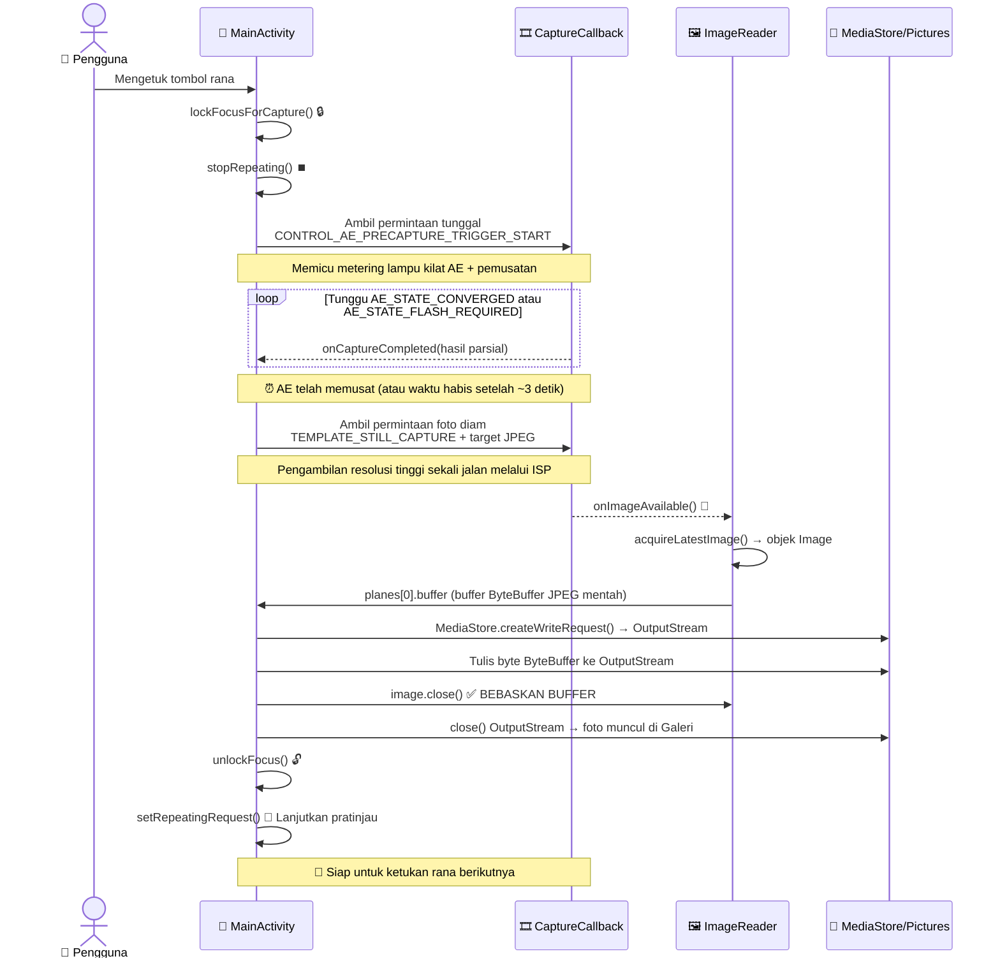

Selamat telah mencapai bab terakhir dari Bagian II! Jika Anda telah mengikuti sejak Bab 5, aplikasi Anda sekarang memiliki: penanganan izin, thread latar belakang khusus, enumerasi kamera dengan `CameraCharacteristics`, manajemen siklus hidup buka/tutup yang kuat melalui `Semaphore`, dan pratinjau langsung dengan orientasi yang benar yang dirender melalui `TextureView`. Apa yang kurang? **Kemampuan untuk mengetuk tombol dan menyimpan foto**. Itulah yang diberikan oleh bab ini.

Pada akhir bab ini, proyek tutorial Anda akan menjadi aplikasi kamera yang benar-benar dapat digunakan: ketuk rana, aplikasi membekukan pratinjau sebentar (sebagaimana mestinya, untuk mengosongkan pipeline), gambar diam ditangkap dengan pemusatan auto-exposure yang tepat, gambar tersebut disimpan ke direktori Pictures bersama di perangkat dengan metadata orientasi EXIF yang benar, dan pratinjau dilanjutkan secara otomatis. Anda kemudian dapat membuka foto di Google Photos atau aplikasi Android Camera Parameters ([GitHub](https://github.com/zoozooll/AndroidCameraParameters), [Google Play](https://play.google.com/store/apps/details?id=com.minininja.cameraparams)) untuk memeriksa data EXIF, resolusi, dan kualitasnya.

Mode pengambilan manual pada aplikasi Android Camera Parameters menggunakan versi pipeline yang lebih canggih daripada yang kita bangun di bab ini: ia menjalankan pengambilan burst multi-bingkai dengan ISO kustom per-bingkai, waktu eksposur, dan posisi lensa — tetapi semuanya dibangun di atas fundamental `ImageReader` + `CaptureCallback` yang sama yang akan Anda pelajari di sini.

## Mengapa Mengambil Foto Lebih Kompleks Daripada Pratinjau

Sekilas, "ambil saja satu bingkai" terdengar mudah — kita sudah memiliki 60 bingkai pratinjau per detik yang mengalir melalui sesi, mengapa kita tidak bisa mengambil satu? Jawabannya adalah bingkai pratinjau dan bingkai foto diam adalah output yang berbeda secara fundamental:

1. **Perbedaan resolusi**: Pratinjau adalah ~1–2 MP (1080p). Foto diam harus menggunakan resolusi **maksimum** sensor (seringkali 50+ MP pada ponsel unggulan modern). Anda tentu tidak ingin foto 2 MP saat ponsel Anda bisa memberikan 50 MP.
2. **Perbedaan eksposur**: `TEMPLATE_PREVIEW` mengoptimalkan frame rate dengan latensi rendah. `TEMPLATE_STILL_CAPTURE` mengoptimalkan rentang dinamis, pengurangan noise, dan akurasi warna — bingkai diam membutuhkan pemrosesan ISP kualitas tertinggi yang dapat diberikan oleh pipeline.
3. **Pemusatan 3A**: Sebelum mengambil foto, algoritma Auto-Exposure (AE) kamera perlu diberi tahu "kita akan mengambil foto diam — kunci adegan saat ini, pusatkan eksposur, keseimbangan putih, dan fokus, serta nyalakan lampu kilat jika perlu." Ini adalah urutan **pemicu pra-pengambilan (precapture trigger)**. Melewatkannya akan menghasilkan foto yang kelebihan/kekurangan eksposur relatif terhadap apa yang ditampilkan pratinjau.
4. **Penyimpanan dan Scoped Storage**: Bingkai pratinjau tidak pernah disimpan secara permanen. Bingkai foto harus ditulis ke penyimpanan sebagai file JPEG yang valid, diindeks oleh MediaStore agar aplikasi galeri dapat melihatnya, dan pada Android 10+ ini harus menggunakan API Scoped Storage (tidak boleh menulis file sembarangan ke `/sdcard/DCIM/`).

Pengambilan foto diam adalah **mesin status asinkron multi-tahap**, bukan satu panggilan tunggal. Diagram urutan di bawah ini menunjukkan urutan dan waktu tepat yang harus Anda implementasikan. Jangan lewatkan langkah apa pun.



Waktu pemicu pra-pengambilan sangat penting: ia harus dikirim SEBELUM pengambilan foto diam, dan Anda harus menunggu AE memusat (atau mencapai batas waktu habis) sebelum menembakkan foto diam tersebut. Jika Anda melewatkan penungguan ini, foto akan menggunakan pengaturan eksposur pratinjau, yang mungkin disetel untuk frame rate tinggi daripada kualitas foto.

## Memperkenalkan ImageReader: Wastafel Bingkai yang Dapat Diakses CPU

Di Bab 8 kita menyalurkan bingkai pratinjau ke `SurfaceTexture` (wastafel GPU). Untuk pengambilan foto diam, kita membutuhkan wastafel yang dapat diakses CPU agar kita dapat menulis byte JPEG ke penyimpanan. Wastafel itu adalah `ImageReader`.

`ImageReader` dikonstruksi dengan:
```kotlin
val imageReader = ImageReader.newInstance(
    width,           // Lebar piksel bingkai diam (ukuran diam maks dari karakteristik)
    height,          // Tinggi piksel bingkai diam
    ImageFormat.JPEG,// Format — JPEG untuk foto, RAW_SENSOR untuk RAW DNG, YUV_420_888 untuk pemrosesan
    maxImages        // Berapa banyak buffer yang akan dialokasikan dalam antrean (biasanya 2–5)
)
```

Penjelasan empat parameternya:

1. **width/height**: Gunakan ukuran JPEG maksimum kamera dari `SCALER_STREAM_CONFIGURATION_MAP.getOutputSizes(ImageFormat.JPEG)`. Selalu pilih ukuran terbesar untuk foto kualitas tertinggi.
2. **ImageFormat.JPEG**: Image Signal Processor (ISP) akan menjalankan pipeline pengkodean JPEG penuh (pengkodean Huffman, kuantisasi, penyematan EXIF, header JFIF) sebelum mengirimkan bingkai. `Image.planes[0].buffer` adalah **file JPEG yang lengkap dan valid** — tidak perlu pengkodean ulang; Anda dapat menulis byte tersebut langsung ke penyimpanan.
3. **maxImages**: Kedalaman `BufferQueue` internal. Buffer JPEG berukuran besar (masing-masing 5–20 MB). Atur ke **2** untuk pengambilan foto biasa (satu yang sedang diproses + satu cadangan). Mengaturnya lebih tinggi akan membuang RAM; mengaturnya ke **1** dan lupa melakukan `close()` pada Image akan menyebabkan deadlock pengambilan gambar permanen (antrean tidak akan pernah bisa mengeluarkan buffer kosong lagi).

`ImageReader` mengekspos dua permukaan API yang krusial:
- **`imageReader.surface`**: Mengembalikan sebuah `Surface` yang dapat ditambahkan sebagai target ke CaptureRequests dan disertakan dalam daftar surface output `CameraCaptureSession`.
- **`imageReader.setOnImageAvailableListener(listener, handler)`**: Mendaftarkan callback yang dipicu pada **setiap bingkai baru** yang dikirimkan ke pembaca ini. Di dalam callback ini, Anda memanggil `acquireLatestImage()` (atau `acquireNextImage()`) untuk mendapatkan objek `Image`.

### ⚠️ ATURAN KRITIS: Selalu tutup Image

Jika Anda memanggil `acquireLatestImage()` dan **tidak** memanggil `image.close()`, buffer tersebut **dihapus secara permanen dari pool**. Setelah `maxImages` buffer bocor, `OnImageAvailableListener` akan berhenti dipicu SELAMANYA (antrean tidak memiliki buffer kosong untuk mengeluarkan data, sehingga bingkai baru tidak dapat tiba). Selalu gunakan blok try/finally:

```kotlin
val image = imageReader.acquireLatestImage()
try {
    // Gunakan byte gambar di sini
} finally {
    image.close() // SELALU. Tidak ada pengecualian.
}
```

Ini adalah bug Bab 9 yang paling umum: pengambilan gambar berfungsi sekali, lalu tidak pernah berfungsi lagi sampai aplikasi dimulai ulang.

## Mesin Status AE Pra-Pengambilan

Sistem Camera2 3A (Auto-Exposure / Auto-Focus / Auto-White-Balance) adalah mesin status per-bingkai yang digerakkan oleh kunci permintaan `CONTROL_AE_PRECAPTURE_TRIGGER`. Alurnya:

1. **Hentikan pratinjau berulang**: `captureSession.stopRepeating()`. Kita tidak ingin bingkai pratinjau menyela pipeline foto diam.
2. **Tembakkan pemicu pra-pengambilan**: Bangun sebuah `CaptureRequest` tunggal yang menyetel `CONTROL_AE_PRECAPTURE_TRIGGER` ke `START`. Kirimkan dengan `captureSession.capture()` (BUKAN `setRepeatingRequest` — ini adalah perintah sekali jalan, bukan berkelanjutan).
3. **Tunggu pemusatan**: Di dalam `CaptureCallback.onCaptureCompleted()` untuk pemicu pra-pengambilan (dan bingkai-bingkai berikutnya), periksa `CaptureResult.CONTROL_AE_STATE`. Kita sedang menunggu salah satu dari:
   - `CONTROL_AE_STATE_CONVERGED` ✓ (AE sudah oke, adegan sudah terukur dengan benar)
   - `CONTROL_AE_STATE_FLASH_REQUIRED` ✓ (AE menentukan lampu kilat diperlukan, lampu kilat sekarang sudah terisi)
   - `CONTROL_AE_STATE_LOCKED` ✓ (jika pengguna mengunci AE secara manual sebelumnya)
   - Batas waktu 3000ms tercapai ✗ (katup pengaman — beberapa perangkat yang bermasalah tidak pernah memberi sinyal pemusatan).
4. **Tembakkan pengambilan foto diam**: Bangun permintaan `TEMPLATE_STILL_CAPTURE` yang menargetkan Surface milik `ImageReader`. Kirimkan dengan `captureSession.capture()`.
5. **Gambar tiba**: `OnImageAvailableListener.onImageAvailable()` dipicu → ambil byte JPEG → simpan ke penyimpanan.
6. **Buka kunci dan lanjutkan**: Bangun permintaan yang membatalkan pemicu AE (`CONTROL_AE_PRECAPTURE_TRIGGER_CANCEL`), panggil `unlockFocus()` untuk AF/AWB, lalu `setRepeatingRequest(previewRequest, ...)` untuk memulai kembali pratinjau.

Masing-masing dari 6 langkah tersebut sesuai dengan satu status dalam enum `CaptureStateMachine` yang akan kita definisikan dalam kode.

## Scoped Storage dan MediaStore (Android 10+)

Dari Android 10 (API 29) dan seterusnya, aplikasi tidak dapat lagi menulis file sembarangan ke direktori `/sdcard/Pictures` bersama menggunakan API `java.io.File` — melakukannya akan melempar `FileNotFoundException` dengan pesan "Permission denied" bahkan jika Anda memegang `WRITE_EXTERNAL_STORAGE`. Pendekatan yang benar dan tahan lama di masa depan adalah menggunakan penyedia konten `MediaStore`:

1. **Siapkan bundel `ContentValues`**: Tipe MIME (`image/jpeg`), jalur relatif (`Pictures/Camera2Tutorial/` — sistem akan membuat direktori tersebut jika diperlukan), nama tampilan (berstempel waktu).
2. **Masukkan baris tertunda (pending)**: `contentResolver.insert(MediaStore.Images.Media.EXTERNAL_CONTENT_URI, values)` mengembalikan sebuah `Uri`.
3. **Buka OutputStream ke Uri tersebut**: `contentResolver.openOutputStream(uri)` memberi Anda aliran yang didukung oleh `ParcelFileDescriptor`.
4. **Tulis byte dan tutup**: ByteBuffer JPEG dari `ImageReader` disalin langsung ke OutputStream.
5. **Jadikan file terlihat oleh aplikasi galeri**: Opsional — tambahkan `IS_PENDING=0` di nilai jika Anda menggunakan pola pending-write (kita akan menggunakan pendekatan `IS_PENDING=1`-lalu-perbarui yang lebih sederhana untuk kompatibilitas maksimum).

Pada API 28 ke bawah, kita kembali ke jalur tradisional `File(Environment.getExternalStoragePublicDirectory(Environment.DIRECTORY_PICTURES), ...)` dengan `FileOutputStream` langsung, yang masih berfungsi karena model penyimpanan lama masih berlaku.

## Kode Lengkap Bab 9 — Pengambilan Foto

Berikut adalah `MainActivity.kt` lengkap dari awal hingga akhir yang menggabungkan semua hal di atas: `ImageReader`, mesin status AE pra-pengambilan 6-status, tombol rana, penyimpanan `MediaStore`/lama, dan pembongkaran kedua surface sesi (pratinjau + jpeg). Kita juga memperbarui layout XML untuk tombol rana.

### Layout yang Diperbarui (activity_main.xml)

```xml
<?xml version="1.0" encoding="utf-8"?>
<FrameLayout xmlns:android="http://schemas.android.com/apk/res/android"
    xmlns:tools="http://schemas.android.com/tools"
    xmlns:app="http://schemas.android.com/apk/res-auto"
    android:layout_width="match_parent"
    android:layout_height="match_parent">

    <TextureView
        android:id="@+id/textureView"
        android:layout_width="match_parent"
        android:layout_height="match_parent"
        android:layout_gravity="center" />

    <TextView
        android:id="@+id/statusTextView"
        android:layout_width="wrap_content"
        android:layout_height="wrap_content"
        android:layout_gravity="top|center_horizontal"
        android:layout_marginTop="16dp"
        android:background="#80000000"
        android:padding="8dp"
        android:textColor="#FFFFFFFF"
        android:textSize="12sp"
        tools:text="Menginisialisasi..." />

    <com.google.android.material.floatingactionbutton.FloatingActionButton
        android:id="@+id/shutterButton"
        android:layout_width="wrap_content"
        android:layout_height="wrap_content"
        android:layout_gravity="bottom|center_horizontal"
        android:layout_marginBottom="48dp"
        android:contentDescription="Ambil foto"
        android:src="@android:drawable/ic_menu_camera"
        app:fabSize="normal" />

</FrameLayout>
```

Jika Anda tidak memiliki Komponen Material, ganti FAB dengan `Button` dengan `layout_gravity="bottom|center_horizontal"`.

### Activity Kotlin Lengkap

```kotlin
package com.example.camera2tutorial

import android.Manifest
import android.content.ContentValues
import android.content.Context
import android.content.pm.PackageManager
import android.graphics.ImageFormat
import android.graphics.Matrix
import android.graphics.RectF
import android.graphics.SurfaceTexture
import android.hardware.camera2.CameraAccessException
import android.hardware.camera2.CameraCharacteristics
import android.hardware.camera2.CameraCaptureSession
import android.hardware.camera2.CameraDevice
import android.hardware.camera2.CameraManager
import android.hardware.camera2.CaptureRequest
import android.hardware.camera2.CaptureResult
import android.hardware.camera2.TotalCaptureResult
import android.hardware.camera2.params.StreamConfigurationMap
import android.media.Image
import android.media.ImageReader
import android.os.Build
import android.os.Bundle
import android.os.Environment
import android.os.Handler
import android.os.HandlerThread
import android.provider.MediaStore
import android.util.Log
import android.util.Size
import android.view.Surface
import android.view.TextureView
import android.view.View
import android.view.WindowManager
import android.widget.TextView
import android.widget.Toast
import androidx.appcompat.app.AppCompatActivity
import androidx.core.app.ActivityCompat
import androidx.core.content.ContextCompat
import com.google.android.material.floatingactionbutton.FloatingActionButton
import java.io.File
import java.io.FileOutputStream
import java.io.OutputStream
import java.text.SimpleDateFormat
import java.util.Collections
import java.util.Date
import java.util.Locale
import java.util.concurrent.Semaphore
import java.util.concurrent.TimeUnit
import kotlin.math.max
import kotlin.math.min

class MainActivity : AppCompatActivity() {

    // UI
    private lateinit var textureView: TextureView
    private lateinit var statusTextView: TextView
    private lateinit var shutterButton: FloatingActionButton

    // Threading
    private lateinit var backgroundThread: HandlerThread
    private lateinit var backgroundHandler: Handler

    // Status pipeline kamera
    private lateinit var cameraManager: CameraManager
    private var cameraDevice: CameraDevice? = null
    private var captureSession: CameraCaptureSession? = null
    private var previewRequestBuilder: CaptureRequest.Builder? = null
    private var previewRequest: CaptureRequest? = null
    private var selectedCameraId: String? = null
    private var sensorOrientation = 0
    private var jpegOrientation = 0
    private lateinit var previewSize: Size
    private lateinit var jpegSize: Size

    // 🆕 Wastafel pengambilan foto diam
    private lateinit var imageReader: ImageReader

    // Konkurensi
    private val cameraOpenCloseLock = Semaphore(1)

    // 🆕 Mesin status pengambilan gambar
    private enum class CaptureState {
        IDLE,                 // Pratinjau berjalan normal
        WAITING_AE_PRECAPTURE, // Pemicu AE pra-pengambilan ditembakkan, menunggu pemusatan
        WAITING_AF_LOCK,      // (opsional) digunakan jika kita menambahkan pemicu AF juga
        WAITING_STILL_CAPTURE,// Pengambilan foto diam dikirim, menunggu ImageReader
        PICTURE_SAVED         // Foto disimpan, akan segera kembali ke IDLE
    }
    private var captureState: CaptureState = CaptureState.IDLE
    private val precaptureTimeoutHandler: Handler by lazy { Handler(mainLooper) }
    private val precaptureTimeoutRunnable = Runnable {
        if (captureState == CaptureState.WAITING_AE_PRECAPTURE) {
            Log.w(TAG, "⏰ Waktu habis AE pra-pengambilan — tetap melanjutkan pengambilan foto diam")
            captureStillPicture()
        }
    }

    // -------------------------------------------------------------------------
    // Siklus hidup + hubungkan UI
    // -------------------------------------------------------------------------
    override fun onCreate(savedInstanceState: Bundle?) {
        super.onCreate(savedInstanceState)
        setContentView(R.layout.activity_main)

        textureView = findViewById(R.id.textureView)
        statusTextView = findViewById(R.id.statusTextView)
        shutterButton = findViewById(R.id.shutterButton)
        statusTextView.text = "Menginisialisasi..."

        shutterButton.setOnClickListener { takePicture() }

        if (allPermissionsGranted()) {
            initializeCameraManager()
        } else {
            val allPerms = REQUIRED_PERMISSIONS + WRITE_EXTERNAL_IF_NEEDED
            ActivityCompat.requestPermissions(this, allPerms, REQUEST_CODE_PERMISSIONS)
        }
    }

    override fun onResume() {
        super.onResume()
        startBackgroundThread()
        if (allPermissionsGranted()) {
            if (!this::cameraManager.isInitialized) initializeCameraManager()
            if (textureView.isAvailable) openCameraAndStartSession(textureView.width, textureView.height)
        }
    }

    override fun onPause() {
        closeEverything()
        stopBackgroundThread()
        super.onPause()
    }

    private fun startBackgroundThread() {
        backgroundThread = HandlerThread("Camera2Background").apply { start() }
        backgroundHandler = Handler(backgroundThread.looper)
    }

    private fun stopBackgroundThread() {
        backgroundThread.quitSafely()
        try { backgroundThread.join(1000) } catch (_: InterruptedException) {}
    }

    // -------------------------------------------------------------------------
    // Bab 6 diringkas: penemuan kamera
    // -------------------------------------------------------------------------
    data class CamInfo(val id: String, val facing: Int?, val hw: Int?, val chars: CameraCharacteristics)

    private fun initializeCameraManager() {
        cameraManager = getSystemService(Context.CAMERA_SERVICE) as CameraManager
        val cams = mutableListOf<CamInfo>()
        for (id in cameraManager.cameraIdList) {
            val chars = try { cameraManager.getCameraCharacteristics(id) } catch (_: Exception) { continue }
            cams += CamInfo(
                id,
                chars[CameraCharacteristics.LENS_FACING],
                chars[CameraCharacteristics.INFO_SUPPORTED_HARDWARE_LEVEL],
                chars
            )
        }
        val best = cams.sortedWith(
            compareByDescending<CamInfo> { it.facing == CameraCharacteristics.LENS_FACING_BACK }
                .thenByDescending { it.hw ?: -1 }).first()
        selectedCameraId = best.id
        sensorOrientation = best.chars[CameraCharacteristics.SENSOR_ORIENTATION] ?: 90

        textureView.surfaceTextureListener = object : TextureView.SurfaceTextureListener {
            override fun onSurfaceTextureAvailable(s: SurfaceTexture, w: Int, h: Int) {
                openCameraAndStartSession(w, h)
            }
            override fun onSurfaceTextureSizeChanged(s: SurfaceTexture, w: Int, h: Int) {
                if (this@MainActivity::previewSize.isInitialized) configureTransform(w, h)
            }
            override fun onSurfaceTextureDestroyed(s: SurfaceTexture): Boolean = true
            override fun onSurfaceTextureUpdated(s: SurfaceTexture) {}
        }
    }

    // -------------------------------------------------------------------------
    // Bab 7 diringkas: openCamera
    // -------------------------------------------------------------------------
    private val deviceCallback = object : CameraDevice.StateCallback() {
        override fun onOpened(cam: CameraDevice) {
            cameraOpenCloseLock.release()
            cameraDevice = cam
            createCaptureSession()
        }
        override fun onDisconnected(cam: CameraDevice) {
            cameraOpenCloseLock.release()
            cameraDevice?.close(); cameraDevice = null
        }
        override fun onError(cam: CameraDevice, err: Int) {
            cameraOpenCloseLock.release()
            cameraDevice?.close(); cameraDevice = null
            Toast.makeText(this@MainActivity, "Kesalahan kamera $err", Toast.LENGTH_LONG).show()
        }
    }

    // -------------------------------------------------------------------------
    // Pembuatan sesi (sekarang dengan 2 surface: pratinjau + jpeg)
    // -------------------------------------------------------------------------
    private fun openCameraAndStartSession(vw: Int, vh: Int) {
        val camId = selectedCameraId ?: return
        if (checkSelfPermission(Manifest.permission.CAMERA) != PackageManager.PERMISSION_GRANTED) return
        if (!cameraOpenCloseLock.tryAcquire(2500, TimeUnit.MILLISECONDS)) {
            Toast.makeText(this, "Waktu habis kunci kamera", Toast.LENGTH_SHORT).show(); return
        }
        val chars = cameraManager.getCameraCharacteristics(camId)

        // Ukuran pratinjau
        previewSize = choosePreviewSize(chars, vw, vh)
        // 🆕 Ukuran JPEG foto diam (MAKSIMUM yang tersedia untuk kualitas terbaik)
        jpegSize = chooseMaxJpegSize(chars)

        // Tag orientasi JPEG = orientasi sensor yang diputar oleh rotasi perangkat
        jpegOrientation = computeJpegOrientation()

        // 🆕 Buat ImageReader: width=jpegW, height=jpegH, format=JPEG, 2 buffer
        imageReader = ImageReader.newInstance(
            jpegSize.width,
            jpegSize.height,
            ImageFormat.JPEG,
            2
        )
        // 🆕 Pasang listener bingkai JPEG tersedia
        imageReader.setOnImageAvailableListener(onJpegAvailableListener, backgroundHandler)

        configureTransform(vw, vh)
        textureView.surfaceTexture!!.setDefaultBufferSize(previewSize.width, previewSize.height)
        statusTextView.text = "Sesi: pratinjau ${previewSize} • JPEG ${jpegSize}"

        try { cameraManager.openCamera(camId, deviceCallback, backgroundHandler) }
        catch (e: CameraAccessException) { cameraOpenCloseLock.release() }
    }

    private fun createCaptureSession() {
        val cam = cameraDevice ?: return
        val st = textureView.surfaceTexture ?: return
        val previewSurface = Surface(st)
        val jpegSurface = imageReader.surface
        val outputs = listOf(previewSurface, jpegSurface)

        previewRequestBuilder =
            cam.createCaptureRequest(CameraDevice.TEMPLATE_PREVIEW).apply { addTarget(previewSurface) }

        cam.createCaptureSession(outputs, object : CameraCaptureSession.StateCallback() {
            override fun onConfigured(session: CameraCaptureSession) {
                captureSession = session
                previewRequest = previewRequestBuilder!!.build()
                captureState = CaptureState.IDLE
                shutterButton.isEnabled = true
                statusTextView.text = "🎥 Pratinjau — ketuk rana untuk ambil foto"
                session.setRepeatingRequest(previewRequest!!, captureCallback, backgroundHandler)
            }
            override fun onConfigureFailed(session: CameraCaptureSession) {
                Toast.makeText(this@MainActivity, "Sesi gagal", Toast.LENGTH_LONG).show()
            }
        }, backgroundHandler)
    }

    // -------------------------------------------------------------------------
    // 🆕 CaptureCallback + mesin status ambil foto
    // -------------------------------------------------------------------------
    private val captureCallback = object : CameraCaptureSession.CaptureCallback() {
        override fun onCaptureStarted(
            session: CameraCaptureSession,
            request: CaptureRequest,
            timestamp: Long,
            frameNumber: Long
        ) {}

        override fun onCaptureProgressed(
            session: CameraCaptureSession,
            request: CaptureRequest,
            partialResult: CaptureResult
        ) {
            process(partialResult)
        }

        override fun onCaptureCompleted(
            session: CameraCaptureSession,
            request: CaptureRequest,
            result: TotalCaptureResult
        ) {
            process(result)
        }

        /**
         * Dipanggil untuk setiap bingkai parsial dan yang sudah selesai.
         * Saat kita menunggu AE pra-pengambilan untuk memusat, periksa AE_STATE di sini.
         */
        private fun process(result: CaptureResult) {
            when (captureState) {
                CaptureState.WAITING_AE_PRECAPTURE -> {
                    val aeState = result[CaptureResult.CONTROL_AE_STATE]
                    Log.d(TAG, "AE_STATE = $aeState")
                    if (aeState == null) return
                    when (aeState) {
                        CaptureResult.CONTROL_AE_STATE_CONVERGED,
                        CaptureResult.CONTROL_AE_STATE_FLASH_REQUIRED,
                        CaptureResult.CONTROL_AE_STATE_LOCKED -> {
                            // ✅ AE sudah siap — batalkan waktu habis dan tembakkan pengambilan foto diam
                            precaptureTimeoutHandler.removeCallbacks(precaptureTimeoutRunnable)
                            captureStillPicture()
                        }
                        // lainnya → CONTROL_AE_STATE_PRECAPTURE / SEARCHING / INACTIVE → tetap menunggu
                    }
                }
                else -> { /* Tidak diperlukan pelacakan status di IDLE atau status lainnya */ }
            }
        }
    }

    /** Titik masuk publik klik tombol rana. */
    fun takePicture() {
        if (cameraDevice == null || captureSession == null) return
        if (captureState != CaptureState.IDLE) {
            Log.d(TAG, "⚠️ Pengambilan sedang berlangsung — mengabaikan ketukan rana duplikat")
            return
        }
        shutterButton.isEnabled = false
        statusTextView.text = "📸 Mengunci eksposur..."
        lockFocusAndFirePrecaptureTrigger()
    }

    /**
     * Langkah 1–3: Hentikan pratinjau berulang, kirim pemicu AE pra-pengambilan, mulai batas waktu 3 detik.
     * Metode captureCallback.process() memantau AE_STATE dan memanggil captureStillPicture()
     * saat sudah memusat.
     */
    private fun lockFocusAndFirePrecaptureTrigger() {
        val session = captureSession ?: return
        try {
            captureState = CaptureState.WAITING_AE_PRECAPTURE

            // Bangun permintaan yang identik dengan pratinjau tetapi dengan pemicu AE pra-pengambilan = START
            previewRequestBuilder?.apply {
                set(
                    CaptureRequest.CONTROL_AE_PRECAPTURE_TRIGGER,
                    CaptureRequest.CONTROL_AE_PRECAPTURE_TRIGGER_START
                )
            }

            // Jeda bingkai pratinjau berkelanjutan — gunakan capture() untuk menembakkan SATU bingkai pemicu
            session.stopRepeating()
            session.capture(previewRequestBuilder!!.build(), captureCallback, backgroundHandler)

            // Batas waktu katup pengaman (3 detik): beberapa perangkat tidak pernah memberi sinyal AE memusat
            precaptureTimeoutHandler.postDelayed(precaptureTimeoutRunnable, 3000)

        } catch (e: CameraAccessException) {
            Log.e(TAG, "Pemicu pra-pengambilan gagal", e)
            unlockFocusAndResumePreview()
        }
    }

    /**
     * Langkah 4: AE memusat (atau waktu habis). Tembakkan permintaan TEMPLATE_STILL_CAPTURE tunggal
     * yang menargetkan surface ImageReader → byte JPEG tiba melalui onJpegAvailableListener.
     */
    private fun captureStillPicture() {
        val cam = cameraDevice ?: return
        val session = captureSession ?: return
        captureState = CaptureState.WAITING_STILL_CAPTURE
        statusTextView.text = "📷 Menangkap foto..."

        try {
            // 🆕 Gunakan TEMPLATE_STILL_CAPTURE — pipeline ISP kualitas tertinggi
            val stillBuilder = cam.createCaptureRequest(CameraDevice.TEMPLATE_STILL_CAPTURE)
            stillBuilder.addTarget(imageReader.surface)
            stillBuilder.set(CaptureRequest.JPEG_ORIENTATION, jpegOrientation)
            stillBuilder.set(CaptureRequest.JPEG_QUALITY, 95.toByte()) // Kualitas 1–100

            val stillCallback = object : CameraCaptureSession.CaptureCallback() {
                override fun onCaptureCompleted(
                    s: CameraCaptureSession,
                    req: CaptureRequest,
                    res: TotalCaptureResult
                ) {
                    Log.d(TAG, "📨 Metadata pengambilan foto diam terkirim")
                    // Catatan: byte JPEG yang sebenarnya tiba melalui onJpegAvailableListener, bukan di sini.
                }
            }

            session.stopRepeating()
            session.capture(stillBuilder.build(), stillCallback, backgroundHandler)

        } catch (e: CameraAccessException) {
            Log.e(TAG, "Pengambilan foto diam gagal", e)
            unlockFocusAndResumePreview()
        }
    }

    /**
     * Langkah 5: Byte JPEG tersedia di ImageReader. Ambil Image terbaru, tulis byte-nya
     * ke MediaStore (atau File lama), TUTUP IMAGE, lalu lanjutkan pratinjau.
     */
    private val onJpegAvailableListener = ImageReader.OnImageAvailableListener { reader ->
        var image: Image? = null
        try {
            image = reader.acquireLatestImage()
            if (image == null) {
                Log.w(TAG, "acquireLatestImage mengembalikan null — buffer dibuang")
                return@OnImageAvailableListener
            }
            val buffer = image.planes[0].buffer
            val bytes = ByteArray(buffer.remaining())
            buffer.get(bytes)

            val savedUri = savePhotoToStorage(bytes)
            captureState = CaptureState.PICTURE_SAVED

            // Beralih ke thread utama untuk pembaruan UI / toast
            runOnUiThread {
                shutterButton.isEnabled = true
                if (savedUri != null) {
                    statusTextView.text = "✅ Berhasil Disimpan! Uri=$savedUri"
                    Toast.makeText(
                        this@MainActivity,
                        "Foto disimpan: $savedUri",
                        Toast.LENGTH_LONG
                    ).show()
                } else {
                    statusTextView.text = "❌ Gagal menyimpan"
                    Toast.makeText(
                        this@MainActivity,
                        "Gagal menyimpan foto — periksa Logcat",
                        Toast.LENGTH_LONG
                    ).show()
                }
            }
        } catch (e: Exception) {
            Log.e(TAG, "Kesalahan onJpegAvailable", e)
        } finally {
            image?.close() // ✅ SELALU TUTUP IMAGE — tidak ada pengecualian!
        }

        // Langkah 6: Lanjutkan pratinjau terlepas dari keberhasilan/kegagalan penyimpanan
        runOnUiThread { unlockFocusAndResumePreview() }
    }

    /**
     * Langkah 6: Batalkan pemicu AE pra-pengambilan, hapus kunci fokus, mulai kembali pratinjau berulang.
     */
    private fun unlockFocusAndResumePreview() {
        val session = captureSession ?: return
        try {
            previewRequestBuilder?.apply {
                set(
                    CaptureRequest.CONTROL_AF_TRIGGER,
                    CaptureRequest.CONTROL_AF_TRIGGER_CANCEL
                )
                set(
                    CaptureRequest.CONTROL_AE_PRECAPTURE_TRIGGER,
                    CaptureRequest.CONTROL_AE_PRECAPTURE_TRIGGER_CANCEL
                )
            }
            session.capture(previewRequestBuilder!!.build(), captureCallback, backgroundHandler)

            captureState = CaptureState.IDLE
            precaptureTimeoutHandler.removeCallbacks(precaptureTimeoutRunnable)
            session.setRepeatingRequest(previewRequest!!, captureCallback, backgroundHandler)

            if (statusTextView.text.startsWith("📸") ||
                statusTextView.text.startsWith("📷")) {
                statusTextView.text = "🎥 Pratinjau — ketuk rana untuk ambil foto"
            }
        } catch (e: CameraAccessException) {
            Log.e(TAG, "Gagal melanjutkan pratinjau setelah pengambilan foto diam", e)
        }
    }

    // -------------------------------------------------------------------------
    // 🆕 savePhotoToStorage: MediaStore (API 29+) + File lama (API 28+)
    // -------------------------------------------------------------------------
    private fun savePhotoToStorage(jpegBytes: ByteArray): android.net.Uri? {
        val timestamp = SimpleDateFormat("yyyyMMdd_HHmmss", Locale.US).format(Date())
        val displayName = "IMG_Camera2Tutorial_$timestamp"
        val relativeDir = "${Environment.DIRECTORY_PICTURES}/Camera2Tutorial"

        return if (Build.VERSION.SDK_INT >= Build.VERSION_CODES.Q) {
            // ✅ Scoped Storage melalui MediaStore (tidak perlu izin WRITE_EXTERNAL_STORAGE!)
            val values = ContentValues().apply {
                put(MediaStore.Images.Media.DISPLAY_NAME, "$displayName.jpg")
                put(MediaStore.Images.Media.MIME_TYPE, "image/jpeg")
                put(MediaStore.Images.Media.RELATIVE_PATH, relativeDir)
                put(MediaStore.Images.Media.IS_PENDING, 1) // Tandai sebagai tertunda saat menulis
            }
            val resolver = contentResolver
            val uri = resolver.insert(MediaStore.Images.Media.EXTERNAL_CONTENT_URI, values)
                ?: return null
            try {
                resolver.openOutputStream(uri)?.use { os -> os.write(jpegBytes) }
                // Hapus flag PENDING agar aplikasi galeri dapat melihatnya sekarang
                values.clear()
                values.put(MediaStore.Images.Media.IS_PENDING, 0)
                resolver.update(uri, values, null, null)
                Log.d(TAG, "✅ MediaStore berhasil menyimpan: $uri")
                uri
            } catch (e: Exception) {
                Log.e(TAG, "Penulisan MediaStore gagal", e)
                resolver.delete(uri, null, null) // Bersihkan file tertunda yang setengah tertulis
                null
            }
        } else {
            // 🕰️ Jalur lama: penulisan file langsung ke direktori Pictures publik
            val dir = File(Environment.getExternalStoragePublicDirectory(Environment.DIRECTORY_PICTURES), "Camera2Tutorial")
            if (!dir.exists()) dir.mkdirs()
            val file = File(dir, "$displayName.jpg")
            try {
                FileOutputStream(file).use { os -> os.write(jpegBytes) }
                // Indeks file agar aplikasi galeri segera menemukannya
                val values = ContentValues().apply {
                    put(MediaStore.Images.Media.DATA, file.absolutePath)
                    put(MediaStore.Images.Media.MIME_TYPE, "image/jpeg")
                    put(MediaStore.Images.Media.DISPLAY_NAME, displayName)
                }
                contentResolver.insert(MediaStore.Images.Media.EXTERNAL_CONTENT_URI, values)
                android.net.Uri.fromFile(file)
            } catch (e: Exception) {
                Log.e(TAG, "Penulisan file lama gagal", e)
                null
            }
        }
    }

    // -------------------------------------------------------------------------
    // Pembantu ukuran + orientasi
    // -------------------------------------------------------------------------
    private fun choosePreviewSize(chars: CameraCharacteristics, vw: Int, vh: Int): Size {
        val map = chars[CameraCharacteristics.SCALER_STREAM_CONFIGURATION_MAP]!!
        val viewAspect = max(vw, vh).toDouble() / min(vw, vh)
        val choices = map.getOutputSizes(SurfaceTexture::class.java).toList()
        val matches = choices.filter {
            val a = max(it.width, it.height).toDouble() / min(it.width, it.height)
            kotlin.math.abs(a - viewAspect) < 0.02 && (it.width * it.height) <= 1920 * 1080 * 2
        }
        return (matches.ifEmpty { choices }).maxByOrNull { it.width * it.height }!!
    }

    private fun chooseMaxJpegSize(chars: CameraCharacteristics): Size {
        val map = chars[CameraCharacteristics.SCALER_STREAM_CONFIGURATION_MAP]!!
        val choices = map.getOutputSizes(ImageFormat.JPEG).toList()
        val max = choices.maxByOrNull { it.width * it.height }!!
        Log.d(TAG, "Ukuran JPEG Maks dipilih: ${max.width}×${max.height} " +
            "(dari ${choices.size} ukuran)")
        return max
    }

    private fun computeJpegOrientation(): Int {
        val deviceRotation = (getSystemService(Context.WINDOW_SERVICE) as WindowManager)
            .defaultDisplay.rotation
        val facing = try {
            selectedCameraId?.let {
                cameraManager.getCameraCharacteristics(it)[CameraCharacteristics.LENS_FACING]
            }
        } catch (_: Exception) { CameraCharacteristics.LENS_FACING_BACK }
        val frontFacing = facing == CameraCharacteristics.LENS_FACING_FRONT

        return when (deviceRotation) {
            Surface.ROTATION_0 -> if (frontFacing) (360 - sensorOrientation) % 360 else sensorOrientation
            Surface.ROTATION_90 -> if (frontFacing) (360 - (sensorOrientation + 270) % 360) % 360 else (sensorOrientation + 270) % 360
            Surface.ROTATION_180 -> if (frontFacing) (360 - (sensorOrientation + 180) % 360) % 360 else (sensorOrientation + 180) % 360
            Surface.ROTATION_270 -> if (frontFacing) (360 - (sensorOrientation + 90) % 360) % 360 else (sensorOrientation + 90) % 360
            else -> 0
        }
    }

    private fun configureTransform(vw: Int, vh: Int) {
        val rotation = (getSystemService(Context.WINDOW_SERVICE) as WindowManager).defaultDisplay.rotation
        val matrix = Matrix()
        val vr = RectF(0f, 0f, vw.toFloat(), vh.toFloat())
        val br = RectF(0f, 0f, previewSize.height.toFloat(), previewSize.width.toFloat())
        val cx = vr.centerX(); val cy = vr.centerY()
        br.offset(cx - br.centerX(), cy - br.centerY())
        matrix.setRectToRect(vr, br, Matrix.ScaleToFit.FILL)
        val scale = max(vh.toFloat() / previewSize.height, vw.toFloat() / previewSize.width)
        matrix.postScale(scale, scale, cx, cy)
        val rot = when (rotation) {
            Surface.ROTATION_0 -> sensorOrientation
            Surface.ROTATION_90 -> 0
            Surface.ROTATION_180 -> 360 - sensorOrientation
            Surface.ROTATION_270 -> 180
            else -> 0
        }
        matrix.postRotate(rot.toFloat(), cx, cy)
        textureView.setTransform(matrix)
    }

    // -------------------------------------------------------------------------
    // Pembongkaran (Teardown)
    // -------------------------------------------------------------------------
    private fun closeEverything() {
        try {
            cameraOpenCloseLock.acquire()
            precaptureTimeoutHandler.removeCallbacks(precaptureTimeoutRunnable)
            captureSession?.apply {
                try { stopRepeating(); abortCaptures() } catch (_: CameraAccessException) {}
                close()
            }
            captureSession = null
            cameraDevice?.close(); cameraDevice = null
            if (this::imageReader.isInitialized) {
                imageReader.close() // Penting — membebaskan memori BufferQueue JPEG
            }
        } catch (_: InterruptedException) {
        } finally {
            cameraOpenCloseLock.release()
        }
    }

    // -------------------------------------------------------------------------
    // Izin boilerplate
    // -------------------------------------------------------------------------
    companion object {
        private const val TAG = "Camera2Tutorial"
        private const val REQUEST_CODE_PERMISSIONS = 10
        private val REQUIRED_PERMISSIONS = arrayOf(Manifest.permission.CAMERA)
        // WRITE_EXTERNAL_STORAGE hanya diperlukan sebelum versi Q untuk jalur simpan file lama
        private val WRITE_EXTERNAL_IF_NEEDED =
            if (Build.VERSION.SDK_INT < Build.VERSION_CODES.Q)
                arrayOf(Manifest.permission.WRITE_EXTERNAL_STORAGE)
            else
                emptyArray()
    }

    private fun allPermissionsGranted(): Boolean {
        val need = REQUIRED_PERMISSIONS + WRITE_EXTERNAL_IF_NEEDED
        return need.all { ContextCompat.checkSelfPermission(baseContext, it) == PackageManager.PERMISSION_GRANTED }
    }

    override fun onRequestPermissionsResult(
        requestCode: Int, permissions: Array<out String>, grantResults: IntArray
    ) {
        super.onRequestPermissionsResult(requestCode, permissions, grantResults)
        if (requestCode == REQUEST_CODE_PERMISSIONS) {
            if (allPermissionsGranted()) {
                initializeCameraManager()
            } else {
                Toast.makeText(this, "Izin diperlukan", Toast.LENGTH_LONG).show()
                finish()
            }
        }
    }
}
```

### Membaca Mesin Status Pengambilan Gambar

Ikuti rantai panggilan `takePicture()` → `lockFocusAndFirePrecaptureTrigger()` → (AE memusat atau waktu habis) → `captureStillPicture()` → `onJpegAvailableListener` → `unlockFocusAndResumePreview()`. Transisi setiap langkah dikawal oleh `captureState`. Ketukan duplikat akan diabaikan (pemeriksaan `if (captureState != IDLE) return` di bagian atas `takePicture()`).

Detail spesifik utama:
- **`JPEG_ORIENTATION`**: Diatur dalam permintaan pengambilan foto diam. Aplikasi galeri membaca tag orientasi EXIF dari header JPEG untuk memutar foto yang ditampilkan. Tanpa ini, foto lanskap akan tampak miring meskipun data pikselnya benar.
- **`JPEG_QUALITY = 95`**: Keseimbangan yang baik antara kualitas dan ukuran file. 100 secara teori tanpa kehilangan (lossless) tetapi menghasilkan file 2–3× lebih besar dengan keuntungan visual minimal; 80 menghasilkan artefak kompresi yang terlihat pada tekstur mendetail.
- **Pola `IS_PENDING=1 → 0` (API 29+)**: Memberi tahu MediaStore "jangan izinkan editor foto, aplikasi galeri, atau host MTP melihat file ini sampai saya selesai menulisnya." Mencegah file korup yang setengah tertulis muncul di Google Photos saat penulisan `OutputStream` sedang berlangsung. Selalu hapus flag tersebut setelah selesai.

## Verifikasi: Menjalankan Alur Pengambilan Foto

Instal dan luncurkan aplikasi Bab 9 pada perangkat Android fisik (kamera emulator memiliki mesin status AE yang aneh dan tidak representatif). Verifikasi setiap perilaku titik pemeriksaan berikut:

1. **Pratinjau berjalan seperti sebelumnya**. Status menunjukkan *🎥 Pratinjau — ketuk rana untuk ambil foto*. Tombol rana FAB terlihat dan dapat diklik.
2. **Ketuk rana**. Status berubah menjadi *📸 Mengunci eksposur...* → *📷 Menangkap foto...* → *✅ Berhasil Disimpan! Uri=content://media/external/images/media/12345*.
3. **Pratinjau membeku sejenak** (~0,3–1,0 detik) saat AE memusat dan bingkai diam diproses. Kemudian pratinjau dimulai lagi. Pembekuan singkat ini adalah perilaku yang benar dan diharapkan.
4. **Buka aplikasi Galeri / Foto di perangkat**. Buka album **Pictures → Camera2Tutorial**. Anda seharusnya melihat thumbnail dari foto yang Anda ambil. Buka foto tersebut — foto harus memiliki resolusi penuh (misalnya, 8160×6120 untuk sensor 50 MP), orientasinya benar, dan eksposurnya pas.
5. **Buka foto di penampil EXIF aplikasi Android Camera Parameters** ([Google Play](https://play.google.com/store/apps/details?id=com.minininja.cameraparams)). Periksa apakah tag orientasi EXIF cocok dengan rotasi perangkat pada saat pengambilan, kualitas JPEG = 95, dan resolusinya cocok dengan `jpegSize` yang dicatat saat memulai sesi.
6. **Ketuk rana dengan cepat 10+ kali**. Penjaga `captureState != IDLE` harus menelan ketukan duplikat selama siklus pengambilan; pada akhirnya Anda harus memiliki foto yang disimpan sebanyak siklus pengambilan yang berhasil diselesaikan.

### Referensi Output Logcat

Pengambilan gambar yang berhasil menghasilkan entri Logcat kira-kira dalam urutan ini:
```
D/Camera2Tutorial: Ukuran JPEG Maks dipilih: 8160×6120 (dari 9 ukuran)
D/Camera2Tutorial: 📸 Mengunci eksposur...
D/Camera2Tutorial: AE_STATE = CONTROL_AE_STATE_SEARCHING
D/Camera2Tutorial: AE_STATE = CONTROL_AE_STATE_SEARCHING
D/Camera2Tutorial: AE_STATE = CONTROL_AE_STATE_CONVERGED
D/Camera2Tutorial: 📷 Menangkap foto...
D/Camera2Tutorial: 📨 Metadata pengambilan foto diam terkirim
D/Camera2Tutorial: ✅ MediaStore berhasil menyimpan: content://media/external/images/media/9876
D/Camera2Tutorial: 🎥 Pratinjau — ketuk rana untuk ambil foto
```

## Pemecahan Masalah Kegagalan Pengambilan Gambar

### captureStillPicture() tidak pernah dipicu (macet di Mengunci eksposur...)

Waktu habis 3 detik pada akhirnya harus dipicu dan dilanjutkan — jika bahkan waktu habis pun tidak dipicu, `precaptureTimeoutRunnable` tidak pernah diposting. Periksa kembali apakah `lockFocusAndFirePrecaptureTrigger()` memanggil `precaptureTimeoutHandler.postDelayed(precaptureTimeoutRunnable, 3000)`. Jika waktu habis selalu dipicu tetapi `AE_STATE` tidak pernah tampak memusat (converged), Anda mungkin berada pada kamera tingkat LEGACY dengan pelaporan status AE yang rusak. Dalam hal ini, tambahkan pemeriksaan: jika tingkat perangkat keras adalah LEGACY, lewati pemicu pra-pengambilan sepenuhnya dan langsung lompat dari `takePicture()` ke `captureStillPicture()`.

### Pengambilan gambar berfungsi sekali, lalu semua pengambilan berikutnya tidak pernah menghasilkan onImageAvailable

Anda membocorkan `Image` karena lupa memanggil `image.close()`. Pool `maxImages = 2` sudah habis, sehingga tidak ada bingkai baru yang dapat dikirimkan sampai proses aplikasi dimatikan. Verifikasi blok `finally { image?.close() }` di `onJpegAvailableListener`. Sebagai bantuan debug, catat jika `imageReader.acquireLatestImage()` mengembalikan null — itulah tanda pasti adanya kebocoran buffer.

### Foto tampak miring di galeri

Nilai kembalian `computeJpegOrientation()` Anda salah. Uji dalam ke-4 orientasi perangkat (potret, lanskap kiri, lanskap terbalik, potret terbalik) pada kamera belakang dan depan. Kamera depan membutuhkan orientasi yang dibalik (dicerminkan) karena sensor `LENS_FACING_FRONT` dicerminkan menurut konvensi.

### MediaStore melempar SecurityException pada API 29+

Anda lupa menghapus `WRITE_EXTERNAL_STORAGE` dari daftar izin API 29+ DAN Anda berada di perangkat dengan `requestLegacyExternalStorage=false`. Pada API 29+, `WRITE_EXTERNAL_STORAGE` tidak memberikan **apa-apa** — hanya Uri MediaStore yang berfungsi. Pembantu `WRITE_EXTERNAL_IF_NEEDED` secara benar mengabaikan izin tersebut pada versi Q+.

## Ringkasan

Bagian II berakhir dengan nada tinggi: aplikasi tutorial Anda sekarang adalah **aplikasi kamera yang berfungsi penuh**. Anda telah mengimplementasikan:

1. **ImageReader** sebagai wastafel JPEG yang dapat diakses CPU: lebar/tinggi yang benar (ukuran JPEG maks), `ImageFormat.JPEG`, jumlah buffer `maxImages = 2`, pendaftaran `OnImageAvailableListener`, dan aturan yang tidak boleh dilanggar untuk **selalu menutup Image dalam blok finally** untuk mencegah kehabisan buffer permanen.
2. **Mesin status pengambilan gambar 6-status**: `IDLE → WAITING_AE_PRECAPTURE → (memusat/waktu habis) → WAITING_STILL_CAPTURE → PICTURE_SAVED → kembali ke IDLE`, dijaga oleh penekanan ketukan duplikat dan batas waktu katup pengaman 3 detik untuk perangkat dengan pelaporan status AE yang rusak.
3. **Alur pemicu AE pra-pengambilan**: `stopRepeating → session.capture(CONTROL_AE_PRECAPTURE_TRIGGER_START) → proses AE_STATE di CaptureCallback sampai CONVERGED/FLASH_REQUIRED/LOCKED → tembakkan pengambilan foto diam`.
4. **TEMPLATE_STILL_CAPTURE + pengaturan kualitas**: Tag EXIF `JPEG_ORIENTATION` disetel berdasarkan orientasi sensor + rotasi perangkat (kamera depan dicerminkan dengan benar), `JPEG_QUALITY = 95`.
5. **Penyimpanan foto masa depan**: Pola `MediaStore.Images.Media.EXTERNAL_CONTENT_URI` + `RELATIVE_PATH` + `IS_PENDING=1→0` untuk Scoped Storage pada Android 10+, dengan jalur cadangan `FileOutputStream` lama ke `Environment.DIRECTORY_PICTURES` pada Android 9 ke bawah, ditambah pengindeksan MediaStore segera agar aplikasi galeri langsung melihat file baru.
6. **Pembongkaran simetris**: `closeEverything()` menghentikan pengulangan, membatalkan pengambilan gambar, menutup sesi, menutup perangkat, menutup `ImageReader` (kritis untuk membebaskan 2× buffer JPEG 20 MB), semuanya di dalam bagian kritis `Semaphore(1)`.

Kode dalam bab ini membentuk dasar bagi aplikasi fotografi diam Camera2 yang serius. Aplikasi Android Camera Parameters ([GitHub](https://github.com/zoozooll/AndroidCameraParameters), [Google Play](https://play.google.com/store/apps/details?id=com.minininja.cameraparams)) memperluas mesin status ini dengan 10+ status tambahan untuk pemicu AF, penguncian AWB, pengambilan burst multi-bingkai, output RAW (DNG) di samping JPEG, dan pengesampingan ISO/waktu eksposur manual per-bingkai — tetapi setiap fitur tersebut adalah tambahan bertahap pada pola `ImageReader` + `CaptureCallback` + mesin status yang sama yang sekarang sudah Anda pahami sepenuhnya.

## Apa Selanjutnya (Melihat ke Depan ke Bagian III)

Ini mengakhiri **Bagian II: Aplikasi Camera2 Pertama Anda**. Dalam lima bab, Anda telah membangun kerangka aplikasi berkualitas produksi dengan penanganan izin, threading, enumerasi kamera, siklus hidup buka/tutup, perenderan pratinjau, dan pengambilan foto diam JPEG. Jika Anda berhenti di sini dan merilis kode ini, Anda sudah memiliki aplikasi kamera yang lebih baik daripada banyak aplikasi di Play Store.

Tetapi kekuatan sejati API Camera2 terletak pada apa yang akan datang berikutnya. **Bagian III (Bab 10–12)** menyelam jauh ke dalam bagian internal yang Anda butuhkan untuk aplikasi kamera profesional:
- **Bab 10: Ensiklopedia CameraCharacteristics** — setiap keluarga kunci (SENSOR, LENS, SCALER, STATISTICS, CONTROL, INFO, REQUEST, SYNC), apa artinya, dan cara merancang flag fitur di sekitarnya.
- **Bab 11: Pipeline Camera2 & Arsitektur HAL3** — simpul P1 vs P2 vs P3, pemrosesan ulang, dualitas kunci `CaptureRequest`/`CaptureResult`, kerangka kerja sinkronisasi, dan apa yang sebenarnya dikonfigurasi oleh `TEMPLATE_*` di balik layar.
- **Bab 12: Jenis Pengambilan Gambar, Burst, dan 3A secara Mendalam** — berulang vs pengambilan tunggal vs burst, antrean pemrosesan ulang ZSL, transisi mesin status AF/AE/AWB, kontrol manual (`LENS_FOCUS_DISTANCE`, `SENSOR_SENSITIVITY`/`SENSOR_EXPOSURE_TIME`), dan taksonomi `CONTROL_CAPTURE_INTENT`.

Sampai saat itu, silakan ambil beberapa foto dengan aplikasi Bab 9 Anda. Jelajahi adegan dengan pencahayaan campuran (jendela terang + interior gelap) dan lihat bagaimana pemicu AE pra-pengambilan menyesuaikan eksposur relatif terhadap pratinjau. Bandingkan ukuran file pada `JPEG_QUALITY = 50` vs `95` vs `100`. Ganti `chooseMaxJpegSize` dengan ukuran 4K dan perhatikan perbedaan kecepatannya. Cara terbaik untuk menginternalisasi materi ini adalah dengan melihat konsekuensi dunia nyata dari setiap parameter. Selamat telah membangun kamera Camera2 pertama Anda — Anda layak mendapatkannya.
