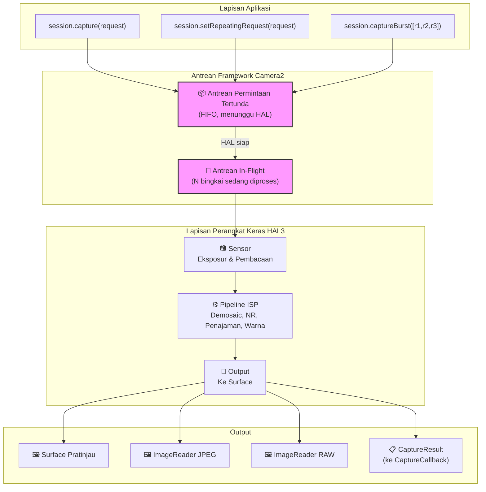
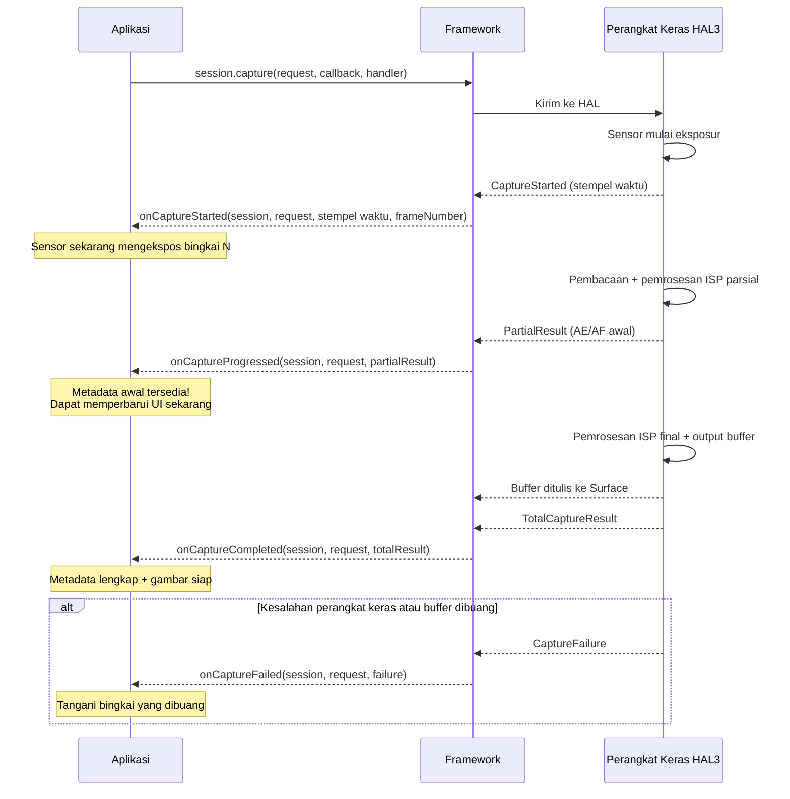
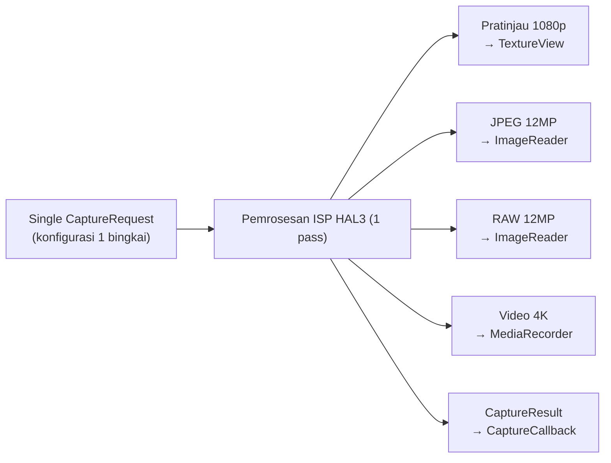
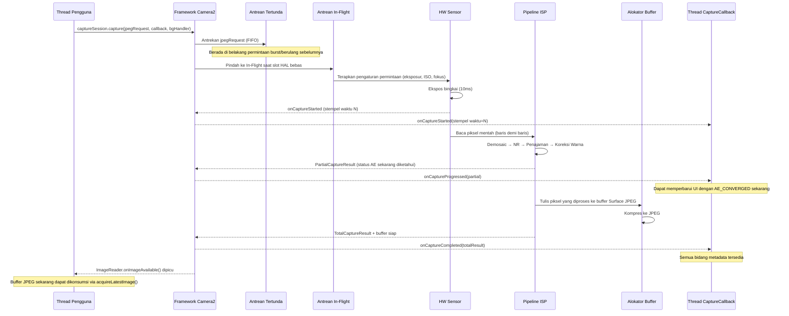

## 10.1 Dari Penggunaan ke Pemahaman

Dalam bab-bab sebelumnya dari seri ini, Anda telah *menggunakan* Camera2: Anda menampilkan pratinjau, mengambil foto, dan bekerja dengan file RAW. Sekarang saatnya memutar lensa dan melihat ke dalam — **bagaimana Camera2 sebenarnya memberikan bingkai-bingkai tersebut?**

Memahami pipeline bukan hanya sekadar akademik. Ketika Anda tahu bagaimana permintaan mengalir melalui sistem, Anda dapat:
- Mendiagnosis bingkai yang terlewat (frame drop) dalam pengambilan gambar kecepatan tinggi
- Menjelaskan mengapa perubahan pengaturan membutuhkan waktu 1-2 bingkai untuk muncul
- Mengoptimalkan pengambilan gambar burst untuk menghilangkan blackout
- Membangun model mental yang benar untuk waktu callback

Aplikasi Android Camera Parameters ([GitHub](https://github.com/zoozooll/AndroidCameraParameters), [Play Store](https://play.google.com/store/apps/details?id=com.minininja.cameraparams)) memvisualisasikan perilaku pipeline secara real-time — lihat tab **Waktu Bingkai** dan **JSON Mentah** untuk melihat konsep dari bab ini secara langsung di perangkat Anda.

## 10.2 Struktur Data Inti

Sebelum melihat pipeline itu sendiri, mari kita periksa secara mendalam dua objek yang melakukan perjalanan melaluinya: `CaptureRequest` (apa yang masuk) dan `CaptureResult` (apa yang keluar).

### CaptureRequest: Cetak Biru Bingkai yang Tidak Dapat Diubah

Sebuah `CaptureRequest` adalah **konfigurasi lengkap yang tidak dapat diubah untuk satu bingkai**. Ia menjelaskan *segalanya* yang harus dilakukan oleh sensor, lensa, dan ISP untuk satu eksposur: waktu eksposur sensor, ISO, jarak fokus lensa, mode 3A, target output, kualitas JPEG, wilayah pemotongan (crop), dan banyak lagi.

Properti utama dari `CaptureRequest`:

- **Tidak dapat diubah setelah build()** — Setelah Anda memanggil `.build()`, permintaan dibekukan. Untuk mengubah pengaturan, Anda harus membuat Builder baru.
- **Pola Builder** — Dikonstruksi melalui `CaptureRequest.Builder`, diperoleh dari `CameraDevice.createCaptureRequest(template)`.
- **Per-bingkai** — Setiap bingkai individu mendapatkan objek permintaannya sendiri. Bahkan pengambilan gambar berulang membuat (secara implisit) permintaan baru per bingkai.
- **Ditargetkan ke surface** — Setiap permintaan secara eksplisit mencantumkan surface output mana yang menerima buffer gambar yang diproses.

```kotlin
// Membangun CaptureRequest menggunakan pola Builder
val builder = cameraDevice.createCaptureRequest(CameraDevice.TEMPLATE_STILL_CAPTURE)

// Parameter tingkat sensor
builder.set(CaptureRequest.SENSOR_EXPOSURE_TIME, 10_000_000L)   // 10ms
builder.set(CaptureRequest.SENSOR_SENSITIVITY, 400)             // ISO 400
builder.set(CaptureRequest.SENSOR_FRAME_DURATION, 33_333_333L)  // maks ~30fps

// Parameter lensa
builder.set(CaptureRequest.LENS_FOCUS_DISTANCE, 0.1f)           // fokus 10cm
builder.set(CaptureRequest.LENS_APERTURE, 1.8f)                 // f/1.8

// Mode kontrol 3A
builder.set(CaptureRequest.CONTROL_AF_MODE, CaptureRequest.CONTROL_AF_MODE_OFF)
builder.set(CaptureRequest.CONTROL_AE_MODE, CaptureRequest.CONTROL_AE_MODE_OFF)
builder.set(CaptureRequest.CONTROL_AWB_MODE, CaptureRequest.CONTROL_AWB_MODE_OFF)

// Target output
builder.addTarget(previewSurface)
builder.addTarget(jpegReader.surface)

// Build — sekarang tidak dapat diubah!
val request: CaptureRequest = builder.build()

// request.set(...) akan gagal — tidak ada set() pada objek yang sudah dibangun!
```

:::note
Ketidakuplahan (immutability) sangat penting untuk kebenaran pipeline. Karena HAL membaca permintaan secara asinkron, jika Anda dapat memodifikasinya setelah pengiriman, Anda akan menciptakan kondisi balapan (race conditions) antara thread aplikasi dan thread pemrosesan perangkat keras.
:::

### CaptureResult: Laporan Metadata (Bukan Gambar!)

Sebuah `CaptureResult` adalah **output metadata** untuk bingkai yang diproses. Yang terpenting: **CaptureResult TIDAK berisi data piksel gambar**. Piksel pergi ke target `Surface` yang Anda tambahkan ke permintaan; `CaptureResult` pergi ke `CaptureCallback` Anda membawa *cerita* tentang apa yang terjadi selama pengambilan gambar.

Berikut adalah bidang paling penting dalam sebuah `CaptureResult`:

| Kunci Hasil | Tipe | Deskripsi |
|-----------|------|-------------|
| `SENSOR_EXPOSURE_TIME` | `Long` | Waktu eksposur aktual yang digunakan dalam nanodetik (mungkin berbeda dari permintaan) |
| `SENSOR_SENSITIVITY` | `Int` | Penguatan ISO aktual yang diterapkan |
| `SENSOR_TIMESTAMP` | `Long` | Stempel waktu nanodetik pada awal eksposur (dari `SystemClock.elapsedRealtimeNanos()`) |
| `CONTROL_AE_STATE` | `Int` | Status eksposur otomatis: INACTIVE, SEARCHING, CONVERGED, LOCKED, FLASH_REQUIRED |
| `CONTROL_AF_STATE` | `Int` | Status autofokus: INACTIVE, PASSIVE_SCAN, ACTIVE_SCAN, FOCUSED_LOCKED, NOT_FOCUSED_LOCKED |
| `CONTROL_AWB_STATE` | `Int` | Status keseimbangan putih otomatis |
| `LENS_FOCUS_DISTANCE` | `Float` | Jarak fokus aktual yang diatur oleh lensa |
| `SCALER_CROP_REGION` | `Rect` | Wilayah pemotongan aktual yang digunakan untuk zoom digital |
| `JPEG_GPS_LOCATION` | `Location` | Tag GPS yang ditulis ke JPEG (jika diminta) |
| `STATISTICS_FACE_DETECT_MODE` | `Int` | Mode deteksi wajah yang sebenarnya digunakan |

Bidang hasil adalah **kebenaran dasar (ground truth)** Anda. `CaptureRequest` adalah apa yang Anda *minta*; `CaptureResult` adalah apa yang *sebenarnya dilakukan* oleh perangkat keras. Pada perangkat LEGACY atau LIMITED, HAL mungkin secara diam-diam membatasi, membulatkan, atau mengesampingkan nilai yang Anda minta — hasil memungkinkan Anda mendeteksinya.

```kotlin
val captureCallback = object : CameraCaptureSession.CaptureCallback() {
    override fun onCaptureCompleted(
        session: CameraCaptureSession,
        request: CaptureRequest,
        result: TotalCaptureResult
    ) {
        val timestampNs = result.get(CaptureResult.SENSOR_TIMESTAMP)
        val exposureNs = result.get(CaptureResult.SENSOR_EXPOSURE_TIME)
        val iso = result.get(CaptureResult.SENSOR_SENSITIVITY)
        val aeState = result.get(CaptureResult.CONTROL_AE_STATE)
        val afState = result.get(CaptureResult.CONTROL_AF_STATE)
        val focusDistance = result.get(CaptureResult.LENS_FOCUS_DISTANCE)
        val cropRegion = result.get(CaptureResult.SCALER_CROP_REGION)

        val aeStateStr = when (aeState) {
            CaptureResult.CONTROL_AE_STATE_INACTIVE -> "INACTIVE"
            CaptureResult.CONTROL_AE_STATE_SEARCHING -> "SEARCHING"
            CaptureResult.CONTROL_AE_STATE_CONVERGED -> "CONVERGED"
            CaptureResult.CONTROL_AE_STATE_LOCKED -> "LOCKED"
            CaptureResult.CONTROL_AE_STATE_FLASH_REQUIRED -> "FLASH_REQUIRED"
            else -> "UNKNOWN($aeState)"
        }

        val afStateStr = when (afState) {
            CaptureResult.CONTROL_AF_STATE_INACTIVE -> "INACTIVE"
            CaptureResult.CONTROL_AF_STATE_PASSIVE_SCAN -> "PASSIVE_SCAN"
            CaptureResult.CONTROL_AF_STATE_ACTIVE_SCAN -> "ACTIVE_SCAN"
            CaptureResult.CONTROL_AF_STATE_FOCUSED_LOCKED -> "FOCUSED_LOCKED"
            CaptureResult.CONTROL_AF_STATE_NOT_FOCUSED_LOCKED -> "NOT_FOCUSED_LOCKED"
            else -> "UNKNOWN($afState)"
        }

        Log.d("Pipeline", buildString {
            append("Bingkai @${timestampNs?.let { it / 1_000_000 } ?: "?"}ms | ")
            append("Eksposur: ${exposureNs?.let { "%.2fms".format(it / 1_000_000.0) } ?: "?"} | ")
            append("ISO: $iso | ")
            append("Fokus: ${focusDistance?.let { "%.3f".format(it) } ?: "?"} dioptri | ")
            append("AE: $aeStateStr | ")
            append("AF: $afStateStr | ")
            append("Crop: ${cropRegion?.width()}x${cropRegion?.height()}")
        })
    }
}
```

:::tip
Di aplikasi Android Camera Parameters, aktifkan **Live Result Logging** di pengaturan dan perhatikan aliran metadata yang sama ini mengalir secara real-time. Anda akan melihat transisi AE_SEARCHING ke AE_CONVERGED saat eksposur stabil, dan transisi AF_SCAN ke FOCUSED_LOCKED saat Anda mengetuk untuk fokus.
:::

## 10.3 Antrean Permintaan

Camera2 menggunakan **model pipeline dua antrean** pada tingkat framework. Memahami antrean-antrean ini menjelaskan hampir setiap perilaku waktu yang Anda amati.

### Antrean Permintaan Tertunda (FIFO)

Saat Anda memanggil `session.capture()`, `session.captureBurst()`, atau `session.setRepeatingRequest()`, permintaan tersebut tidak langsung dikirim ke HAL. Sebaliknya, ia mendarat di **Antrean Permintaan Tertunda (Pending Request Queue)** — sebuah antrean FIFO (First-In, First-Out) yang dikelola oleh framework Camera2.

Anggap ini sebagai "ruang tunggu." Permintaan duduk di sini sampai HAL memiliki kapasitas untuk menerima permintaan baru untuk diproses.

Properti utama:
- **Urutan FIFO** — Permintaan diproses dalam urutan tepat saat dikirim.
- **Atomisitas Burst** — Semua bingkai dalam sebuah `captureBurst()` dimasukkan ke antrean secara berurutan dan diproses tanpa diselingi permintaan berulang.
- **Pengesampingan Prioritas (Priority override)** — Permintaan satu kali/burst melompat *ke depan* dari permintaan berulang dalam antrean (permintaan berulang dimasukkan kembali secara otomatis setelah permintaan satu kali selesai).
- **Terbatas** — Antrean memiliki kedalaman terbatas (biasanya 4-8 permintaan); luapan (overflow) memicu kesalahan.

### Antrean In-Flight

Saat HAL mengeluarkan permintaan dari Antrean Tertunda dan memulai pembacaan sensor / pemrosesan ISP, permintaan tersebut pindah ke **Antrean In-Flight**. Antrean ini berisi semua permintaan yang saat ini sedang diproses oleh perangkat keras.

Kedalaman Antrean In-Flight (`CameraCharacteristics.REQUEST_PIPELINE_MAX_DEPTH`) memberi tahu Anda berapa banyak bingkai yang dikerjakan perangkat keras secara bersamaan. Pada perangkat FULL tipikal, kedalamannya adalah 3–4 bingkai, yang artinya: saat bingkai N sedang diekspos, bingkai N-1 sedang diproses oleh ISP, bingkai N-2 sedang ditulis ke memori, dan bingkai N-3 sedang dikembalikan ke aplikasi. Inilah cara Camera2 mencapai 30+ fps meskipun setiap bingkai membutuhkan waktu ~100ms dari awal hingga akhir.



## 10.4 Callback Hasil: Siklus Hidup CaptureCallback

Hasil dikembalikan melalui `CameraCaptureSession.CaptureCallback`. HAL dapat mengembalikan hasil dalam beberapa tahap, memberi Anda akses awal ke metadata parsial sebelum bingkai penuh siap.

### Empat Metode Callback

| Metode | Kapan Dipanggil | Berisi | Kasus Penggunaan |
|--------|------------|----------|----------|
| `onCaptureStarted` | Sensor *memulai* eksposur untuk bingkai ini | Info minimal: nomor bingkai, stempel waktu | Sinkronisasi waktu yang tepat |
| `onCaptureProgressed` | ISP memproses sebagian bingkai | PartialCaptureResult — beberapa bidang metadata siap | Pembaruan status AE/AF awal |
| `onCaptureCompleted` | Bingkai penuh selesai, semua buffer dikirim | TotalCaptureResult — semua bidang | Pencatatan metadata final |
| `onCaptureFailed` | Bingkai dibuang / terjadi kesalahan | CaptureFailure — kode kesalahan, alasan | Pemulihan kesalahan |

### Hasil Parsial vs. Total

Sebuah `PartialCaptureResult` dikembalikan saat ISP telah menghitung *beberapa* bidang metadata tetapi belum menyelesaikan seluruh pipeline. Sebuah `TotalCaptureResult` dikembalikan saat semuanya selesai.



```kotlin
val fullPipelineCallback = object : CameraCaptureSession.CaptureCallback() {
    override fun onCaptureStarted(
        session: CameraCaptureSession,
        request: CaptureRequest,
        timestamp: Long,
        frameNumber: Long
    ) {
        super.onCaptureStarted(session, request, timestamp, frameNumber)
        Log.d("Pipeline", "Bingkai #$frameNumber memulai eksposur pada ${timestamp / 1_000_000}ms")
    }

    override fun onCaptureProgressed(
        session: CameraCaptureSession,
        request: CaptureRequest,
        partialResult: CaptureResult
    ) {
        super.onCaptureProgressed(session, request, partialResult)
        val aeState = partialResult.get(CaptureResult.CONTROL_AE_STATE)
        val afState = partialResult.get(CaptureResult.CONTROL_AF_STATE)
        Log.v("Pipeline", "Parsial: AE=$aeState AF=$afState")
    }

    override fun onCaptureCompleted(
        session: CameraCaptureSession,
        request: CaptureRequest,
        result: TotalCaptureResult
    ) {
        super.onCaptureCompleted(session, request, result)
        val totalFrames = result.frameNumber
        Log.d("Pipeline", "Bingkai #$totalFrames selesai sepenuhnya")
    }

    override fun onCaptureFailed(
        session: CameraCaptureSession,
        request: CaptureRequest,
        failure: CaptureFailure
    ) {
        super.onCaptureFailed(session, request, failure)
        val reason = when (failure.reason) {
            CaptureFailure.REASON_ERROR -> "Kesalahan internal"
            CaptureFailure.REASON_FLUSHED -> "Dikosongkan oleh abortCaptures()"
            else -> "Tidak diketahui (${failure.reason})"
        }
        Log.e("Pipeline", "Bingkai #${failure.frameNumber} GAGAL: $reason. Dibuang: ${failure.wasImageCaptured()}")
    }
}
```

## 10.5 Bagian Internal Pipeline: Stateless, Berurutan, Asinkron, Multi-Output

Model pipeline HAL3 yang diekspos oleh Camera2 memiliki empat properti penentu. Internalise ini dan sebagian besar perilaku "aneh" Camera2 tiba-tiba akan masuk akal.

### 1. Statelessness

Perangkat keras **tidak memiliki memori di antara permintaan**. Setiap `CaptureRequest` harus mandiri — ia mencakup *setiap pengaturan*, bukan hanya pengaturan yang Anda ubah dari bingkai sebelumnya.

Ini artinya:
- Jika Anda menyetel `SENSOR_EXPOSURE_TIME` pada bingkai N tetapi *mengabaikannya* pada bingkai N+1, ia akan kembali ke default template.
- Permintaan berulang bukanlah "kumpulan pengesampingan (overrides)" — ia dibuat ulang dan dikirim ulang secara penuh setiap bingkai oleh framework.
- Tidak ada "atur dan lupakan" pada tingkat HAL.

```kotlin
// 🔴 SALAH: Mengharapkan pengaturan bertahan
session.setRepeatingRequest(requestWithExposure10ms, callback, handler)
// Kemudian: hanya ubah pemicu AF, lupa mengatur ulang eksposur
val triggerBuilder = cameraDevice.createCaptureRequest(CameraDevice.TEMPLATE_PREVIEW)
triggerBuilder.set(CaptureRequest.CONTROL_AF_TRIGGER, CaptureRequest.CONTROL_AF_TRIGGER_START)
triggerBuilder.addTarget(previewSurface)
session.capture(triggerBuilder.build(), callback, handler)
// 🐛 Eksposur kembali ke default TEMPLATE_PREVIEW untuk bingkai satu kali ini!

// ✅ BENAR: Setiap permintaan mandiri
val triggerBuilder = cameraDevice.createCaptureRequest(CameraDevice.TEMPLATE_PREVIEW)
triggerBuilder.set(CaptureRequest.SENSOR_EXPOSURE_TIME, 10_000_000L)
triggerBuilder.set(CaptureRequest.CONTROL_AF_TRIGGER, CaptureRequest.CONTROL_AF_TRIGGER_START)
triggerBuilder.addTarget(previewSurface)
session.capture(triggerBuilder.build(), callback, handler)
```

### 2. Pemrosesan Berurutan (Sequential)

Dalam aliran kamera logis tunggal, permintaan diproses **satu per satu dalam urutan FIFO**. Tidak ada penyusunan ulang, tidak ada evaluasi permintaan paralel. Jika bingkai 50 berada di belakang bingkai 49 dalam antrean, bingkai 50 menunggu bingkai 49 selesai eksposur bahkan jika bingkai 50 akan "lebih cepat" untuk diproses.

Inilah sebabnya pengambilan gambar burst menghasilkan bingkai yang berdekatan tanpa celah: N permintaan burst dijamin untuk dieksekusi secara berurutan.

### 3. Hasil Asinkron

Thread yang mengirimkan permintaan **bukanlah** thread yang menerima hasil. Hasil dikirim pada thread `Handler` yang Anda berikan (atau pada thread binder jika Anda meneruskan `null`).

Konsekuensi praktis: **jangan pernah mengakses status bersama yang dapat berubah (shared mutable state) dari callback tanpa sinkronisasi**. Bug yang umum adalah membaca/menulis `latestExposure` dari klik tombol pengambilan gambar dan dari callback secara bersamaan.

### 4. Beberapa Output Per Permintaan

Satu permintaan → banyak output. Sebuah `CaptureRequest` tunggal dapat menargetkan 2, 3, atau bahkan 4+ target `Surface` secara bersamaan:

- **SurfaceTexture Pratinjau** (untuk tampilan)
- **ImageReader JPEG** (untuk foto diam)
- **ImageReader RAW** (untuk DNG)
- **Surface MediaRecorder** (untuk pengkodean video)
- **Surface Allocation** (untuk pemrosesan RenderScript/ML)

HAL bertanggung jawab untuk merutekan satu pembacaan sensor melalui beberapa cabang ISP untuk menghasilkan setiap format output. Anda tidak menduplikasi pengambilan gambar; Anda menyatakan target dan perangkat keras yang akan membaginya.



## 10.6 Ujung-ke-Ujung: Melacak Satu Bingkai

Mari kita lacak satu permintaan pengambilan gambar JPEG melalui seluruh pipeline untuk menyatukan semuanya:



## 10.7 Melihat Pipeline Beraksi

Aplikasi Android Camera Parameters ([GitHub](https://github.com/zoozooll/AndroidCameraParameters), [Play Store](https://play.google.com/store/apps/details?id=com.minininja.cameraparams)) menyertakan tampilan debug **Pipeline Visualizer** yang menampilkan kedalaman Antrean Tertunda saat ini, kedalaman Antrean In-Flight, dan stempel waktu per bingkai. Buka aplikasi, aktifkan **Mode Pengembang** di pengaturan, pilih kamera, dan beralih ke tab **Pipeline** untuk melihat:

- Berapa banyak permintaan yang mengantre vs. in-flight
- Latensi per bingkai dari mulai → selesai
- Jumlah hasil parsial per bingkai (berapa banyak panggilan `onCaptureProgressed` yang dipicu)
- Bingkai apa pun yang dibuang beserta alasan kegagalannya

Tab ini adalah cara terbaik tunggal untuk mengembangkan intuisi bagi konsep-konsep dalam bab ini.

## 10.8 Ringkasan

| Konsep | Poin Penting |
|---------|-------------|
| **CaptureRequest** | Cetak biru per bingkai yang tidak dapat diubah. Build melalui Builder. Berisi SEMUA pengaturan (tidak ada persistensi). |
| **CaptureResult** | Hanya metadata (tanpa piksel). Kebenaran dasar untuk apa yang *sebenarnya dilakukan* perangkat keras. Periksa status AE/AF, eksposur, crop. |
| **Antrean Tertunda** | Ruang tunggu FIFO. Burst tetap berurutan. Satu kali pengambilan melompat ke depan pengambilan berulang. |
| **Antrean In-Flight** | Permintaan yang saat ini sedang diproses. Kedalaman = kedalaman pipeline maksimal. 3-4 bingkai tipikal pada perangkat FULL. |
| **CaptureCallback** | Empat fase: mulai → berproses → selesai (atau gagal). Hasil parsial vs total. |
| **Statelessness** | Perangkat keras tidak memiliki memori. Setiap permintaan harus mencakup setiap pengaturan yang Anda pedulikan. |
| **Berurutan + Asinkron** | Urutan FIFO dijamin. Callback pada thread yang berbeda dari pengiriman. |
| **Multi-Output** | Satu permintaan → banyak Surface (pratinjau + JPEG + RAW + video sekaligus). |

## Apa Selanjutnya

Dalam [Bab 11: Jenis Pengambilan Gambar](capture-types.md), kita akan melihat tiga cara untuk mengirimkan permintaan ke pipeline ini — satu kali, burst, dan berulang — dan kapan menggunakan masing-masing. Kita juga akan menjelajahi template bawaan (`TEMPLATE_PREVIEW`, `TEMPLATE_STILL_CAPTURE`, dll.) yang mengonfigurasi default yang masuk akal untuk kasus penggunaan umum.
