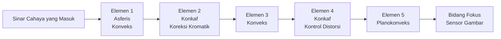
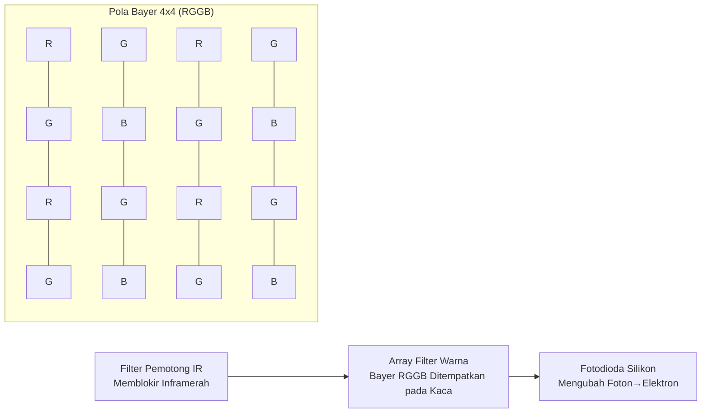
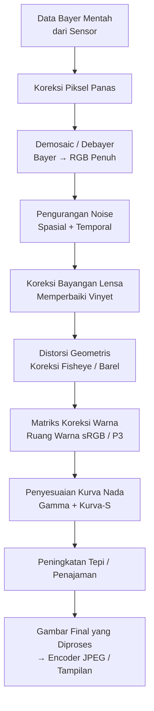
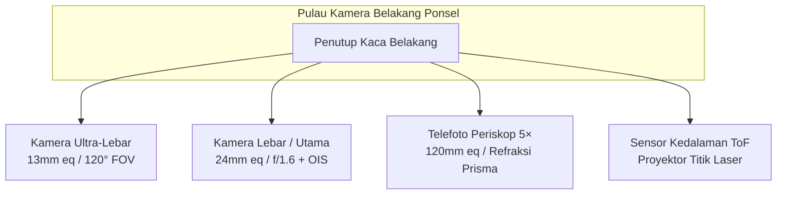
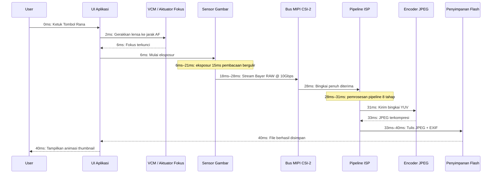

# Bab 2: Memahami Kamera Smartphone

Sebelum menulis satu baris kode API Camera2, Anda harus memahami perangkat keras fisik yang akan diperintah oleh kode Anda. Kamera smartphone bukan sekadar "lensa yang diarahkan ke sensor." Ini adalah rakitan yang terintegrasi erat, tersegel, dan dirancang dengan presisi yang berisi optik, aktuator, filter, semikonduktor, dan bus data berkecepatan tinggi. Bab ini menjelaskan setiap komponen mulai dari kaca yang pertama kali menangkap cahaya hingga chip memori flash tempat foto terakhir Anda disimpan.

Tujuan dari bab ini adalah untuk membangun model mental dari pipeline kamera sebagai sistem fisik. Ketika bab-bab selanjutnya meminta Anda untuk mengonfigurasi permintaan pengambilan gambar dengan `CONTROL_AE_TARGET_FPS_RANGE` atau `SENSOR_SENSITIVITY`, Anda akan memahami persis bagian perangkat keras mana yang dipengaruhi oleh parameter tersebut dan mengapa nilai tersebut penting.

## Modul Kamera: Rakitan Optik Tersegel

Saat Anda melihat bagian belakang ponsel unggulan modern — bayangkan Pixel 10 atau Galaxy S26 Ultra — Anda melihat pulau persegi menonjol 2 hingga 4 milimeter dari kaca belakang. Pulau itu bukanlah satu kamera tunggal. Satu pulau persegi menampung tiga modul melingkar terpisah: yang terbesar di bagian bawah adalah kamera lebar utama, yang lebih kecil di atasnya adalah telefoto periskop 3×, dan yang berukuran sedang di sebelah kiri adalah ultra-lebar 0,5×. Setiap "tonjolan" melingkar di dalam pulau itu adalah modul kamera yang lengkap dan independen.

Modul kamera adalah unit yang tersegel secara hermetis yang diproduksi di ruang bersih bebas debu. Modul ini berisi, disusun berurutan dari dunia luar ke dalam:

1. **Kaca penutup pelindung**: Jendela safir atau Gorilla Glass tahan gores yang menyegel modul dan menjaganya dari debu.
2. **Barel lensa**: Tumpukan silinder berisi 4 hingga 6 elemen lensa individu dari kaca (atau terkadang plastik asferis), yang dijaga keselarasannya dengan presisi oleh spacer plastik tipis.
3. **Voice Coil Motor (VCM)**: Aktuator elektromagnetik yang menggerakkan seluruh barel lensa maju atau mundur di sepanjang sumbu optik sejauh sepersekian milimeter untuk mencapai autofokus. Beberapa VCM premium juga dapat menggeser lensa tegak lurus terhadap sumbu untuk stabilisasi gambar optik (OIS).
4. **Filter pemotong Inframerah (IR)**: Wafer kaca tipis berlapis yang diletakkan tepat di depan sensor. Filter ini memblokir cahaya inframerah (yang sensitif bagi sensor silikon tetapi tidak bagi mata manusia) sehingga warna yang direkam sesuai dengan apa yang dirasakan manusia.
5. **Die sensor**: Chip sensor gambar CMOS silikon itu sendiri, yang terikat kabel ke substrat. Array piksel aktif menghadap ke atas menuju lensa.
6. **Flexible Printed Circuit (FPC)**: Kabel pita tipis yang dapat ditekuk yang membawa daya, ground, sinyal kontrol (I2C), dan data gambar berkecepatan tinggi (MIPI CSI-2) dari modul ke papan utama ponsel.
7. **Konektor board-to-board**: Steker kecil dengan kepadatan tinggi di ujung FPC yang masuk ke dalam soket pasangannya di PCB utama ponsel.

Seluruh rakitan — dari kaca penutup hingga konektor — biasanya setebal 5 hingga 8 milimeter untuk kamera belakang konvensional, dan sepanjang 10 hingga 14 milimeter (di dalam ponsel, berorientasi horizontal) untuk telefoto periskop. Modul-modul tersebut dikalibrasi secara individual di pabrik: keselarasan lensa, kemiringan sensor, bayangan warna, dan posisi tak terhingga autofokus semuanya diukur dan disimpan dalam memori one-time-programmable (OTP) pada modul itu sendiri. API Camera2 membaca data kalibrasi ini saat perangkat dinyalakan sehingga aplikasi Anda tidak perlu memperhitungkan variasi manufaktur antar unit.

## Lensa: Panjang Fokus, Bukaan, dan Stabilisasi

Lensa adalah komponen pertama yang ditemui cahaya. Tugasnya adalah membelokkan sinar cahaya yang masuk sehingga mereka bertemu menjadi gambar yang tajam tepat pada bidang sensor gambar.

### Panjang Fokus dan Ekivalensi Full-Frame

Panjang fokus menentukan bidang pandang (seberapa banyak pemandangan yang masuk dalam bingkai) dan pembesaran (seberapa besar subjek yang jauh terlihat). Spesifikasi kamera smartphone selalu mengiklankan **panjang fokus ekivalen full-frame**. Ini adalah konvensi yang menormalkan berbagai ukuran sensor sehingga konsumen dapat membandingkan secara adil. Sensor full-frame adalah ukuran 36mm × 24mm yang secara historis digunakan dalam kamera SLR film 35mm.

Panjang fokus ekivalen full-frame yang umum pada smartphone:

- **10–18mm (Ultra-lebar)**: Bidang pandang diagonal 100° hingga 130°. Digunakan untuk pemandangan, arsitektur, foto grup selfie, dan bidikan makro jarak dekat.
- **22–28mm (Lebar / Utama)**: Kamera "normal" default pada setiap ponsel. Bidang pandang ~75°, mirip dengan penglihatan perifer manusia tetapi lebih datar.
- **45–80mm (Telefoto, 2× hingga 3×)**: Bidang pandang sempit 30° hingga 50°. Digunakan untuk potret (proporsi wajah yang terlihat alami, distorsi perspektif yang lebih sedikit) dan zoom umum.
- **100–240mm (Telefoto periskop, 5× hingga 10×)**: Bidang pandang 10° hingga 25°. Desain periskop yang dibelokkan prisma memungkinkan panjang fokus yang panjang tanpa membuat ponsel setebal 2 sentimeter.

Berikut adalah cara cahaya merambat melalui rakitan lensa sudut lebar 5 elemen yang umum:

### Bukaan (Aperture)

Bukaan adalah ukuran lubang tempat cahaya lewat di dalam lensa. Ini digambarkan sebagai **angka-f** (atau f-stop): panjang fokus dibagi dengan diameter bukaan. **Angka-f yang lebih kecil berarti lubang yang lebih lebar, yang berarti lebih banyak cahaya** yang mencapai sensor.

- f/1.4 hingga f/1.8: Bukaan sangat lebar. Umum pada kamera utama ponsel unggulan. Sangat baik dalam cahaya rendah.
- f/2.0 hingga f/2.4: Bukaan sedang. Umum pada kamera ultra-lebar dan telefoto pada kebanyakan ponsel.
- f/2.8 hingga f/4.0: Bukaan sempit. Ditemukan pada kamera depan berbiaya lebih rendah dan beberapa modul periskop.

Bukaan biasanya tetap pada kamera smartphone. Beberapa ponsel unggulan Samsung era 2020 memiliki **mekanisme bukaan variabel** dengan diafragma ganda yang dapat beralih secara mekanis antara f/1.5 dan f/2.4. Hal ini sangat langka saat ini karena fokus berbasis VCM dan HDR komputasional multi-bingkai telah membuat bukaan variabel tidak diperlukan untuk sebagian besar kasus penggunaan.

### Stabilisasi Gambar Optik (OIS)

Saat Anda memegang ponsel, tangan Anda secara alami bergetar dalam jumlah sudut yang kecil — sekitar 0,1° hingga 0,5° pada 1/30 detik. Selama eksposur yang cukup lama, getaran ini menyebabkan seluruh gambar menjadi kabur. **Stabilisasi Gambar Optik (OIS)** memecahkan masalah ini dengan menggerakkan barel lensa secara fisik (lens-shift OIS) atau die sensor itu sendiri (sensor-shift OIS) untuk menangkal gerakan yang terdeteksi. Giroskop kecil di dalam modul kamera (atau yang digunakan bersama dari IMU utama ponsel) mengukur kecepatan sudut 1.000 hingga 8.000 kali per detik, dan aktuator OIS menggerakkan optik sesuai dengan itu. OIS biasanya dapat mengompensasi 3 hingga 5 stop getaran tangan, yang berarti eksposur yang tadinya membutuhkan 1/60 detik untuk tetap tajam sekarang dapat diambil pada 1/8 detik atau 1/4 detik dengan ketajaman yang sama.

## Sensor Gambar: Tempat Cahaya Menjadi Listrik

Sensor gambar adalah chip silikon yang berisi jutaan detektor cahaya individu yang disebut **fotodioda**, yang disusun dalam kisi persegi panjang yang presisi. Setiap sensor smartphone saat ini adalah jenis **CMOS (Complementary Metal-Oxide-Semiconductor)**.

### Ukuran Piksel dan Megapiksel

Setiap fotodioda individu + sirkuit pembacaan disebut **piksel**. Ukuran fisik setiap piksel (diukur dalam mikrometer, μm) bisa dibilang lebih penting daripada total jumlah megapiksel. Piksel yang lebih besar menangkap lebih banyak foton per unit waktu, yang berarti lebih sedikit noise shot dan performa cahaya rendah yang lebih baik.

Ukuran piksel umum pada smartphone tahun 2026:

- **0,6μm hingga 0,8μm**: Piksel sangat kecil. Digunakan dalam sensor resolusi tinggi 108MP hingga 200MP. Sensor ini sepenuhnya bergantung pada pixel binning untuk noise yang dapat diterima.
- **1,0μm hingga 1,2μm**: Ukuran sedang. Digunakan dalam sensor 48MP hingga 64MP dengan binning default 4:1 untuk output 12MP–16MP.
- **2,0μm hingga 2,4μm**: Piksel besar "unggulan". Digunakan dalam sensor khusus 12MP–16MP (Google Pixel, iPhone Pro) atau sebagai output binned dari sensor 48MP dalam mode "kualitas tinggi".

Pixel binning adalah teknik menggabungkan muatan dari piksel 2×2 (atau 3×3, atau 4×4) yang berdekatan menjadi satu "piksel super" selama pembacaan. Sensor 48MP dengan piksel individu 0,8μm, saat di-binning 4-ke-1, berperilaku seperti sensor 12MP dengan piksel efektif 1,6μm — secara dramatis meningkatkan rasio signal-to-noise. API Camera2 mengekspos mode raw resolusi penuh dan mode binned default sebagai konfigurasi stream yang terpisah.

Perhitungan jumlah megapiksel sangat sederhana: sensor 48MP memiliki array aktif sekitar 8.000 × 6.000 fotodioda = 48.000,000 sensor cahaya individu.

### Klasifikasi Ukuran Sensor

Ukuran sensor mengikuti notasi berbasis inci lama yang berasal dari tabung televisi Vidicon tahun 1950-an. Formatnya adalah "1/X inci" di mana X adalah pembaginya; X yang lebih kecil berarti sensor yang lebih besar:

- 1/3,06" hingga 1/2,55": Sensor kecil, umum untuk kamera depan dan ultra-lebar anggaran (~5MP hingga 13MP).
- 1/1,7" hingga 1/1,3": Sensor seluler besar, kamera utama ponsel unggulan (48MP, 50MP, 108MP).
- 1-inci (Tipe 1): Sangat besar untuk ponsel. Ditemukan pada Xiaomi 13 Ultra, seri Sharp Aquos R, dan Sony Xperia Pro-I. Area aktif sekitar 13,2mm × 8,8mm — mendekati ukuran beberapa kamera Micro Four Thirds.

Sensor yang lebih besar, dengan jumlah megapiksel yang sama, selalu memiliki piksel individu yang lebih besar. Itulah sebabnya ponsel "sensor satu inci" menghasilkan foto cahaya rendah yang jauh lebih baik.

### Bayer Color Filter Array (CFA)

Fotodioda silikon mentah bersifat buta warna — ia hanya mengukur intensitas foton total, bukan panjang gelombang. Untuk merekam warna, produsen menempatkan **filter warna** kecil di atas setiap piksel individu. Pola yang hampir universal adalah **Bayer RGGB filter array**: 50% piksel hijau, 25% merah, dan 25% biru, yang disusun dalam ubin 2×2 yang berulang. Mata manusia lebih sensitif terhadap cahaya hijau, sehingga penggandaan sampel hijau meningkatkan resolusi luminans yang dirasakan dan performa noise.

Setelah pembacaan, data sensor adalah mosaik dari nilai merah, hijau, dan biru yang terpisah — belum menjadi gambar berwarna penuh. Langkah yang mengisi informasi warna yang hilang untuk setiap piksel disebut **demosaicing** (atau debayering) dan ini adalah langkah komputasi besar pertama yang dilakukan di ISP.

### Rana Bergulir (Rolling Shutter) vs Rana Global (Global Shutter)

Hampir setiap sensor gambar smartphone menggunakan **rana bergulir**. Sensor tidak mengekspos atau membaca semua piksel sekaligus. Sebaliknya, ia mengekspos dan membaca array piksel baris demi baris, dari atas ke bawah, satu garis horizontal pada satu waktu. Pembacaan bergulir sensor 48MP yang khas membutuhkan waktu sekitar 15 hingga 25 milidetik untuk pengambilan bingkai penuh.

Rana bergulir menghasilkan distorsi karakteristik pada subjek yang bergerak sangat cepat: baling-baling pesawat yang berputar atau kipas langit-langit tampak bengkok atau bergelombang; bagian atas dan bawah bangunan yang dipotret dengan gerakan pan vertikal miring ke arah yang berlawanan (efek "jello" dalam video). Sebaliknya, sensor rana global mengekspos setiap piksel secara bersamaan dan membaca semuanya sekaligus setelah eksposur berakhir. Rana global digunakan dalam visi mesin, kamera aksi, dan beberapa sensor buka kunci wajah IR menghadap ke depan yang khusus, tetapi desain piksel rana global memiliki sensitivitas cahaya yang lebih rendah dan biaya yang lebih tinggi, sehingga tidak digunakan dalam kamera utama smartphone.

## ISP: Image Signal Processor

**ISP (Image Signal Processor)** adalah blok perangkat keras khusus (baik chip terpisah atau, yang lebih umum saat ini, bagian terintegrasi dari SoC utama bersama CPU dan GPU) yang tugas satu-satunya adalah mengubah data mentah, bermosaik, ber-noise, dan terdistorsi yang mengalir dari sensor menjadi gambar berwarna yang menyenangkan secara visual.

ISP menjalankan pipeline tahap pemrosesan gambar yang tetap dan terprogram secara keras pada throughput yang sangat tinggi. Sensor 48MP modern yang berjalan pada 30 bingkai per detik mengirimkan 1,44 miliar piksel per detik ke ISP. ISP harus memproses setiap piksel melalui semua tahap dalam waktu kurang dari 33 milidetik per bingkai untuk mengimbanginya.

Tahap pipeline ISP kanonik, secara berurutan, adalah:

1. **Koreksi Piksel Panas (Hot Pixel Correction)**: Piksel "macet" yang dikalibrasi pabrik (selalu terang atau selalu gelap) diganti dengan nilai interpolasi dari tetangganya.
2. **Demosaic / Debayer**: Mosaik Bayer RGGB diubah menjadi gambar RGB penuh dengan memperkirakan dua saluran warna yang hilang di setiap lokasi piksel dari piksel sekitarnya menggunakan algoritma interpolasi yang sadar tepi (edge-aware).
3. **Pengurangan Noise (Temporal + Spasial)**: Noise shot acak dan noise pembacaan sensor ditekan. Spasial NR mengaburkan wilayah datar sambil mempertahankan tepian. Temporal NR menggabungkan informasi dari bingkai video sebelumnya (jika tersedia) untuk hasil yang lebih bersih.
4. **Koreksi Bayangan Lensa (Vignetting Correction)**: Sudut-sudut gambar secara alami lebih gelap karena cahaya harus melewati lensa pada sudut yang lebih curam. ISP menerapkan peningkatan gain digital per piksel, yang lebih terang di sudut-sudut, untuk meratakan pencahayaan. Data kalibrasi untuk peningkatan ini disimpan dalam OTP modul.
5. **Koreksi Distorsi Geometris**: Lensa ultra-lebar dan fisheye menghasilkan distorsi barel (garis lurus melengkung ke luar). ISP memetakan ulang koordinat piksel menggunakan model lensa polinomial yang disimpan untuk menghasilkan gambar rektilinear di mana garis lurus benar-benar tampak lurus. Langkah ini secara inheren memotong (crop) 5–10% dari cincin piksel luar.
6. **Color Correction Matrix (CCM)**: Respons spektral RGB sensor mentah tidak cocok dengan respons trikromatik mata manusia. Perkalian matriks 3×3 mengubah RGB asli sensor menjadi ruang warna standar sRGB atau DCI-P3. Koefisien CCM disetel per modul per iluminan (cahaya siang, tungsten, fluoresen).
7. **Penyesuaian Kurva Nada (Tone Curve Adjustment)**: Kurva pemetaan nada berbentuk S non-linear diterapkan pada data RGB linear untuk mengompresi sinyal sensor rentang dinamis tinggi (high-dynamic-range) ke dalam output rentang dinamis rendah (low-dynamic-range) (biasanya sRGB 8-bit yang dikodekan gamma). Langkah inilah yang membuat gambar menjadi "menonjol" — kontras meningkat pada nada tengah (midtones), sorotan diredam, bayangan diangkat.
8. **Peningkatan Tepi / Penajaman (Edge Enhancement / Sharpening)**: Masker unsharp yang halus diterapkan untuk memulihkan detail frekuensi tinggi yang dilembutkan oleh pengurangan noise dan filter low-pass optik. Jumlah penajaman dikontrol dengan hati-hati untuk menghindari munculnya halo.

Kualitas pemrosesan ISP adalah pembeda utama antar produsen ponsel. Google, Samsung, Apple, dan Xiaomi masing-masing menyetel pipeline ISP mereka dengan prioritas artistik yang berbeda: beberapa menyukai warna alami, beberapa menyukai output yang tajam dan jenuh, beberapa menyukai pengurangan noise yang agresif vs detail yang dipertahankan. API Camera2 memberi Anda kontrol atas kekuatan tahap ISP individu (melalui kontrol tonemap dan koreksi warna Android), tetapi sebagian besar parameter tahap yang terperinci dikunci di balik API milik vendor.

## RAW vs JPEG: Dua Jalur dari Sensor ke Penyimpanan

Pipeline ISP di atas menghasilkan gambar yang diproses. Namun API Camera2 juga memungkinkan Anda untuk melewati ISP sepenuhnya dan membaca data sensor mentah secara langsung. Ini adalah perbedaan kritis antara output RAW dan JPEG.

### Format RAW

Sebuah **file RAW** (di Android ini berarti file DNG, Digital Negative) berisi persis apa yang diukur sensor sebelum pemrosesan ISP dijalankan. Ini adalah mosaik Bayer 10-bit, 12-bit, atau 14-bit per piksel — masih dalam pola RGGB asli, masih dengan vinyet, masih dengan noise, masih linear. File RAW juga berisi tag metadata yang menentukan pola array filter warna yang tepat, profil warna sensor, tingkat hitam, tingkat putih, dan model lensa.

- **Kedalaman bit**: RAW10 = 10 bit per saluran = 1.024 level. RAW12 = 4.096 level. RAW14 = 16.384 level. Bandingkan dengan JPEG 8 bit = 256 level.
- **Ukuran file**: 20–40 MB per foto 48MP. Tidak terkompresi atau terkompresi hampir tanpa kehilangan (near-lossless).
- **Kasus penggunaan**: Pengeditan pasca-produksi profesional. Ruang tambahan dari stop ekstra memungkinkan editor untuk "menyelamatkan" sorotan yang terlalu terang (sebesar 2 hingga 3 stop EV) atau mengangkat bayangan yang terlalu gelap tanpa munculnya banding.

### Format JPEG

Sebuah **file JPEG** adalah output "matang" dari ISP. Setiap satu dari 8 tahap ISP di atas telah diterapkan pada data piksel. Kemudian gambar diubah dari RGB ke ruang warna YCbCr 4:2:0 chroma-subsampled dan dikompresi dengan algoritma Discrete Cosine Transform yang lossy pada rasio kompresi sekitar 10:1 hingga 20:1.

- **Kedalaman bit**: Selalu 8 bit per saluran = 256 level per warna.
- **Ukuran file**: 2–5 MB untuk foto 12MP–48MP, tergantung pada tingkat kualitas JPEG.
- **Kasus penggunaan**: Berbagi instan, media sosial, alur kerja apa pun di mana foto dianggap "selesai" saat diambil. Penyesuaian dalam editor seluler menurunkan kualitas gambar dengan cepat karena hanya tersisa 256 level.

### Tabel Perbandingan: RAW vs JPEG

| Fitur | RAW (DNG) | JPEG |
|---------|-----------|------|
| Pemrosesan ISP yang Diterapkan | Tidak ada — semua tahap dilewati | Semua 8 tahap diterapkan dan tidak dapat dibatalkan |
| Kedalaman Warna | 10–14 bit (1.024–16.384 level) | 8 bit (256 level) |
| Keseimbangan Putih | Ditandai dalam metadata, dapat diubah sepenuhnya di pasca | Tertanam dalam piksel — hanya pengeditan kecil |
| Latitudo Eksposur | ±2 hingga 3 stop dapat dipulihkan | Maksimal ±1/2 stop sebelum banding |
| Ukuran File (48MP) | 25–40 MB | 3–6 MB |
| Ruang Warna | RGB linear asli sensor | sRGB atau Display P3 yang dikodekan gamma |
| Penajaman / Pengurangan Noise | Tidak ada — pilihan editor | Diterapkan; tidak dapat dibatalkan |
| Alur Kerja Umum | Alur kerja Adobe Lightroom / Capture One | Berbagi langsung ke Instagram / Pesan |

## Ponsel Multi-Kamera: Mengapa Tidak Satu Lensa Zoom Raksasa?

Kamera saku tradisional menggunakan satu lensa zoom dengan grup internal yang bergerak yang terus-menerus mengubah panjang fokus dari lebar ke telefoto. Mengapa smartphone tidak bisa melakukan hal yang sama? Fisika. Lensa zoom 10× yang mencakup ekivalen full-frame 24mm–240mm dengan bukaan konstan f/2.8 memerlukan jalur optik sepanjang kira-kira 5 sentimeter (2 inci). Sebuah smartphone, paling banyak, setebal 0,9 sentimeter. Matematikanya tidak cocok.

Industri smartphone memecahkan hal ini bukan dengan lensa zoom, tetapi dengan **beberapa kamera dengan panjang fokus tetap**, masing-masing dioptimalkan untuk tujuan yang berbeda, dan sistem komputasi "smooth zoom" yang memudar dari satu kamera ke kamera berikutnya pada rasio zoom tertentu.

Pulau kamera belakang ponsel unggulan tahun 2026 yang khas berisi:

1. **Ultra-Lebar (zoom 0,5×, ~13mm eq, ~120° FOV)**: Panjang fokus pendek, kedalaman bidang besar. Ideal untuk pemandangan, arsitektur, foto grup, dan makro fokus dekat saat diposisikan ulang melalui perangkat lunak.
2. **Lebar / Utama (zoom 1×, ~24mm eq, ~75° FOV)**: Default. Sensor terbesar, bukaan terlebar, OIS terbaik. Digunakan untuk 80% foto sehari-hari.
3. **Telefoto / Periskop (optik 3× hingga 10×, ~72mm hingga ~240mm eq)**: Lensa telefoto konvensional (3×) diletakkan langsung di atas sensornya. Telefoto periskop (5×, 10×) menggunakan prisma 45° di dekat tepi ponsel untuk memantulkan cahaya 90°, sehingga barel lensa berjalan secara horizontal di dalam badan ponsel, bukan secara vertikal menembus ketebalannya.
4. **Sensor Kedalaman ToF**: Proyektor titik laser inframerah dekat (atau, pada iPhone, pemindai LiDAR cahaya terstruktur) yang memancarkan 30.000+ titik IR ke pemandangan dan mengukur waktu pulang-pergi mereka untuk menghasilkan peta kedalaman per piksel. Digunakan untuk bokeh potret yang akurat, oklusi realitas tertambah (AR), dan autofokus cepat dalam cahaya rendah.

Saat Anda melakukan gerakan pinch-zoom di aplikasi kamera, HAL (Hardware Abstraction Layer) secara mulus mengalihkan kamera fisik yang aktif pada ambang batas yang ditentukan sebelumnya. Misalnya, memperbesar dari 0,5× ke 1,0× memudar dari ultra-lebar ke lebar. Pada 2,9× aplikasi masih memotong (crop) secara digital dari kamera lebar. Pada 3,0×, HAL mengalihkan sumber aktif ke kamera telefoto periskop. Di antara rasio zoom tersebut, algoritma penggabungan gambar yang canggih menggunakan kedua kamera secara bersamaan untuk mempertahankan transisi yang mulus.

## Perjalanan Lengkap: Dari Foton hingga Foto yang Tersimpan, Milidetik demi Milidetik

Berikut adalah lini masa lengkap bernomor tentang apa yang terjadi secara fisik di dalam smartphone selama satu pengambilan foto diam, mulai dari saat jari pengguna diangkat dari tombol rana virtual. Angka-angka ini mewakili ponsel unggulan tahun 2026 yang mengambil foto JPEG mode default 12MP di siang hari:

- **0 ms**: Pengguna mengetuk rana. Kerangka kerja API Camera2 menerima `CaptureRequest` dengan `TEMPLATE_STILL_CAPTURE`.
- **0–2 ms**: Algoritma 3A (Auto-Focus, Auto-Exposure, Auto-White-Balance) memusat ke nilai finalnya.
- **2–6 ms**: Voice coil motor (VCM) memberi energi pada kumparannya, menggerakkan barel lensa secara fisik sejauh 0,2mm ke jarak fokus tepat yang dihitung oleh algoritma AF.
- **6–21 ms (eksposur 15 ms)**: Reset global melepaskan muatan piksel sensor. Selama 15 milidetik, fotodioda mengumpulkan elektron yang dihasilkan foton. Rana bergulir membaca baris demi baris selama dan setelah jendela ini.
- **18–28 ms**: Sensor mengeluarkan data Bayer mentah melalui bus serial kecepatan tinggi MIPI CSI-2. Konfigurasi yang umum adalah 4 jalur data pada 2,5 Gbps per jalur = total bandwidth 10 Gbps, yang dengan nyaman menangani kedalaman bit mentah bingkai 12MP ditambah interval blanking.
- **28–31 ms**: Pipeline 8 tahap ISP memproses bingkai melalui koreksi hotpixel, demosaic, pengurangan noise, bayangan lensa, koreksi geometris, matriks warna, kurva nada, dan penajaman. Ini terjadi sepenuhnya di perangkat keras — tidak ada keterlibatan CPU pada tingkat piksel.
- **31–33 ms**: Gambar YUV yang diproses dikirim ke encoder JPEG perangkat keras, yang menerapkan kompresi DCT yang lossy pada tingkat kualitas 90–95 dan menulis header file JFIF (EXIF, thumbnail, koordinat GPS jika ditandai).
- **33–40 ms**: Blob JPEG yang sudah selesai ditulis melalui penyedia konten MediaStore ke dalam direktori file aplikasi, misalnya `/data/data/com.namapaketanda/files/DCIM/Camera/IMG_20260806_151042.jpg`. MediaScanner diberitahu, dan foto muncul di galeri sistem.

Seluruh proses memakan waktu sekitar 40 milidetik dari awal hingga akhir untuk foto diam di siang hari. Dalam cahaya rendah, waktu eksposur itu sendiri memanjang (berpotensi beberapa detik untuk pengambilan multi-bingkai Mode Malam), dan lini masa berskala secara proporsional.

## Ringkasan

Anda sekarang memiliki gambaran fisik yang lengkap tentang sistem kamera smartphone. Anda tahu bahwa setiap tonjolan kamera belakang adalah modul tersegel yang berisi barel lensa dengan beberapa elemen, aktuator autofokus VCM, filter pemotong IR, sensor CMOS dengan array filter warna Bayer RGGB, dan kabel fleksibel yang membawa data MIPI CSI-2. Anda memahami panjang fokus ekivalen, bukaan, dan OIS. Anda tahu bagaimana pipeline 8 tahap ISP mengubah mosaik Bayer mentah menjadi JPEG yang sudah jadi, dan Anda dapat membedakan RAW (asli sensor, 10–14 bit, ruang pemrosesan pasca) dari JPEG (diproses ISP, 8-bit, siap berbagi). Anda memahami mengapa ponsel modern menggunakan 3+ kamera tetap daripada lensa zoom, dan Anda telah menelusuri lini masa milidetik demi milidetik yang tepat dari satu pengambilan foto.

## Apa Selanjutnya

Dalam Bab 3, kita berpindah dari perangkat keras fisik ke apa yang mampu dihasilkan oleh perangkat keras tersebut. Kita akan menjelajahi fitur-fitur dunia nyata dari fotografi smartphone modern: bracketing multi-bingkai HDR, bokeh potret melalui stereo / ToF / ML, eksposur panjang multi-bingkai Night Sight, pengambilan video kecepatan tinggi gerak lambat, koreksi distorsi ultra-lebar, dan telefoto periskop. Anda akan mempelajari bagaimana fotografi komputasional — penggabungan optik, sensor, pemrosesan sinyal multi-bingkai, dan pembelajaran mesin pada perangkat — menciptakan citra yang tidak dapat dihasilkan oleh kombinasi lensa/sensor tunggal mana pun secara mandiri.
