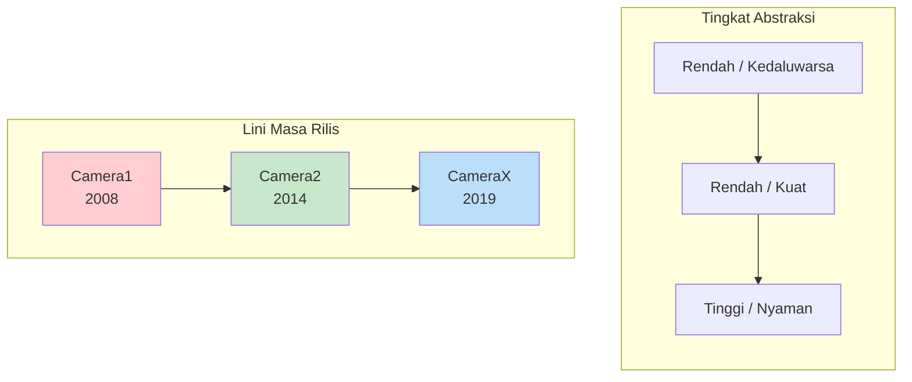
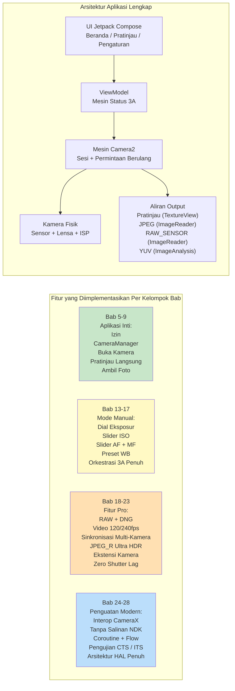

# Bab 1: Selamat Datang di Android Camera2

> **Ikhtisar Bab:** Dalam bab pembuka ini, kita melangkah mundur dan melihat gambaran besarnya. Mengapa Camera2 ada? Masalah apa yang dipecahkannya dibandingkan dengan API Kamera yang lebih lama dan pustaka CameraX yang lebih baru? Siapa yang harus menginvestasikan waktu untuk mempelajari Camera2? Dan, yang paling penting, apa yang sebenarnya akan Anda bangun pada akhir seri ini? Belum ada arsitektur mendalam, belum ada lapisan HAL, dan belum ada diagram pipeline — hanya jawaban jelas untuk pertanyaan yang diajukan setiap pengembang sebelum memulai.

***

## 1.1 Mengapa Camera2?

Keluarkan smartphone Anda.

Lihat bagian belakangnya. Anda mungkin melihat dua, tiga, atau bahkan lebih lensa kamera. Tonjolan persegi kecil itu menampung lebih banyak kekuatan optik dan silikon daripada DSLR profesional dari pertengahan tahun 2000-an.

Sekarang buka aplikasi kamera bawaan.

Ketuk rana (shutter). Seketika, foto beresolusi tinggi tersimpan di galeri Anda. Gambar tersebut kemungkinan besar terlihat bagus — warna-warna cerah, subjek yang tajam, blur latar belakang yang halus, dan bayangan yang terang bahkan dalam cahaya dalam ruangan.

Tetapi aplikasi kamera yang Anda gunakan hanya menyentuh permukaan dari apa yang dapat dilakukan oleh perangkat keras tersebut. Tersembunyi di balik tombol rana yang ramah itu adalah pipeline pencitraan yang sangat canggih: yang dapat memotret foto RAW, merekam video gerak lambat 240 fps, menggabungkan 10 bingkai untuk satu bidikan malam, atau mengontrol setiap mikron gerakan lensa secara independen.

Sebagian besar aplikasi Android pihak ketiga tidak pernah mengakses kekuatan ini. Mengapa? Karena **API kamera Android yang lama (secara retroaktif disebut Camera1) sangat terbatas**. Camera1 dirancang untuk dunia ponsel kamera tunggal dengan pengambilan foto dan video dasar. Ia tidak dapat:

- Mengontrol waktu eksposur atau ISO secara manual
- Mengambil data sensor RAW
- Merekam gerak lambat pada frame rate tinggi
- Menggunakan beberapa kamera secara bersamaan
- Mengakses metadata per-bingkai di tengah pengambilan gambar
- Melakukan fotografi burst secara andal

Dimulai di **Android 5.0 (API level 21)**, Google memperkenalkan **Camera2 (android.hardware.camera2)** untuk meruntuhkan dinding-dinding ini. Camera2 bukanlah pembaruan inkremental — ini adalah **desain ulang penuh**, dibangun dari nol untuk mengekspos kemampuan mentah silikon kamera modern kepada setiap pengembang Android.

Singkatnya: **Camera2 ada karena kamera smartphone menjadi kelas profesional, dan API lama tidak dapat mengimbanginya.**

***

## 1.2 Camera1 vs Camera2 vs CameraX

Lebih dari satu dekade pengembangan kamera Android telah menghasilkan **tiga generasi** API kamera. Sebelum Anda menulis satu baris kode pun, sangat penting untuk memahami API mana yang memecahkan masalah yang mana.

### Tiga Generasi, Tiga Filosofi

### Camera1 — `android.hardware.Camera`

API kamera asli, diperkenalkan dengan Android 1.0 dan **dihentikan (deprecated) di Android 5.0**.

- **Model:** Perintah prosedural. Anda memanggil metode seperti `startPreview()`, `takePicture()`, `setFlashMode()`.
- **Filosofi desain:** "Kamera adalah mesin status yang Anda perintah."
- **Terbaik untuk:** Aplikasi lama yang menargetkan perangkat yang sangat tua (sebelum Lollipop). Itu saja.
- **Mengapa menghindarinya:** Google tidak lagi memperbaruinya. Fitur perangkat keras baru (multi-kamera, RAW, HDR) tidak pernah di-back-port ke Camera1. Permukaan API-nya sangat kecil. Pada perangkat modern, Camera1 sebenarnya **diemulasi oleh pembungkus Camera2** secara internal, jadi Anda membayar kompleksitas Camera2 tanpa manfaat Camera2.

### Camera2 — `android.hardware.camera2.*`

Kerangka kerja tingkat rendah modern, diperkenalkan di Android 5.0 dan terus diperluas melalui setiap versi Android sejak saat itu.

- **Model:** Pipeline permintaan/tanggapan. Anda membangun objek `CaptureRequest` yang tidak dapat diubah (immutable), mengirimkannya ke `CameraCaptureSession`, dan menerima metadata `CaptureResult` + buffer gambar secara asinkron.
- **Filosofi desain:** "Kamera adalah pipeline yang dapat diprogram. Anda mengontrol setiap parameter dari setiap bingkai."
- **Terbaik untuk:** Aplikasi kamera canggih, alat fotografi manual, pipeline visi komputer, pengambilan RAW, penelitian multi-kamera, video kecepatan tinggi, dan kasus penggunaan apa pun di mana Anda memerlukan kontrol yang dekat dengan perangkat keras.
- **Mengapa menggunakannya:** Akses penuh ke setiap kemampuan yang diekspos oleh OEM HAL. Kontrol bingkai langsung. Satu-satunya jalur API untuk fitur profesional. Camera2 adalah apa yang dipanggil oleh CameraX secara internal.

### CameraX — `androidx.camera.*`

Sebuah **pustaka Jetpack** (bukan API platform) yang diperkenalkan dalam versi beta pada tahun 2019 dan distabilkan sekitar Android 11.

- **Model:** Kasus penggunaan deklaratif. Anda melakukan `bindToLifecycle()` pada sekumpulan kasus penggunaan `Preview`, `ImageCapture`, `ImageAnalysis`, atau `VideoCapture` dan pustaka yang melakukan sisanya.
- **Filosofi desain:** "Kami telah memecahkan 10.000 kasus khusus untuk Anda. Cukup beri tahu kami output apa yang Anda butuhkan."
- **Terbaik untuk:** Sebagian besar aplikasi yang membutuhkan kamera. Pemindai QR/barcode, unggahan foto, pemindaian dokumen, perekaman video sederhana — skenario apa pun di mana kenyamanan dan keandalan lebih diutamakan daripada kontrol mentah.
- **Mengapa menggunakannya:** Sadar siklus hidup (tidak ada kebocoran sumber daya), pemilihan resolusi otomatis, keunikan OEM memiliki solusi bawaan, kode yang sama persis berjalan pada ribuan model perangkat tanpa pernyataan `if`.

### Perbandingan Berdampingan

| Dimensi | Camera1 | Camera2 | CameraX |
|:---|:---|:---|:---|
| **Diperkenalkan** | Android 1.0 (2008) | Android 5.0 (2014) | Android 10 (Jetpack) |
| **Status** | Kedaluwarsa | Aktif, dipelihara | Direkomendasikan (Jetpack) |
| **Abstraksi** | Rendah (lama) | Rendah | Tinggi |
| **Kurva pembelajaran** | Mudah | Sangat curam | Sangat landai |
| **Eksposur / ISO / fokus manual** | Terbatas | Kontrol penuh | Terbatas melalui Interop |
| **Pengambilan RAW** | Tidak | Ya | Dengan solusi Interop |
| **Multi-kamera (stream fisik)** | Tidak | Ya | Tidak |
| **Video kecepatan tinggi (120+ fps)** | Tidak | Ya | Terbatas |
| **Burst / bracketing** | Tidak | Kontrol penuh | Tidak |
| **Metadata per-bingkai** | Tidak | Ya, hasil penuh + parsial | Diekspos melalui callback Interop |
| **Keamanan siklus hidup** | Manual, rawan kesalahan | Manual, rawan kesalahan | Otomatis, terikat siklus hidup |
| **Penanganan keunikan OEM** | Tidak ada | Tidak ada | Bawaan (1000+ perangkat diuji) |
| **Volume kode untuk aplikasi yang berfungsi** | Sedang | Sangat tinggi (bertele-tele) | Sangat rendah |
| **Performa** | OK (pembungkus tidak langsung) | Maksimum yang dimungkinkan | Mendekati maksimum (overhead tipis) |

***

## 1.3 Apa yang Dapat Dilakukan Camera2?

Untuk memahami kekuatan Camera2 secara konkret, bayangkan fitur yang pernah Anda lihat pada ponsel unggulan. Camera2 membuat **semua ini dapat diakses secara terprogram**:

### Pengambilan Gambar Kelas Profesional

- **Eksposur Manual Penuh:** Atur kecepatan rana dari 1/8000 detik hingga 30 detik, dan ISO dari 50 hingga 102.400. Bangun UI mode Pro yang sebenarnya.
- **Fotografi RAW:** Ekstrak **data Bayer yang belum diproses** 10-bit, 12-bit, 14-bit, atau 16-bit langsung dari sensor (tanpa demosaic, tanpa pengurangan noise, tanpa koreksi warna). Tulis file Adobe DNG menggunakan `DngCreator` bawaan untuk pengeditan Lightroom.
- **Exposure Bracketing:** Ambil 3, 5, 7, atau 9 bingkai pada nilai EV yang diatur secara tepat. Masukkan ke dalam algoritma penggabungan HDR.
- **Penguncian Timelapse:** Bekukan eksposur, fokus, dan keseimbangan putih di **ribuan bingkai** — tidak ada kedipan saat matahari bergerak atau awan lewat.

### Akses Perangkat Keras Fotografi Komputasional

- **Video Kecepatan Tinggi:** Konfigurasikan `CameraConstrainedHighSpeedCaptureSession` untuk pengambilan gambar 120 fps, 240 fps, atau bahkan 960 fps. Bangun editor gerak lambat.
- **Multi-Kamera Logis:** Akses **kedua** kamera fisik di bawah satu ID multi-kamera logis secara **bersamaan**. Ambil bingkai YUV yang disinkronkan dari lensa lebar dan telefoto untuk menghitung peta kedalaman pada perangkat.
- **Pemrosesan Ulang YUV / PRIVATE (perangkat LEVEL_3):** Pertahankan **buffer melingkar resolusi penuh di ISP**, lalu saat rana diketuk, ambil bingkai dari masa lalu dan jalankan kembali pengurangan noise dan penajaman yang berat. Inilah cara OEM mengimplementasikan **Zero Shutter Lag (ZSL)**.
- **Ultra HDR / JPEG_R (Android 14+):** Minta dan tulis file `ImageFormat.JPEG_R` yang menyimpan JPEG SDR 8-bit **ditambah** peta penguatan (gain map) HDR sekunder. Penampil lama melihat foto normal; panel HDR merender sorotan 1.000+ nit.
- **Ekstensi Kamera (Android 12+):** Delegasikan mode Malam, Bokeh (potret), HDR, dan Retouch Wajah **ke OEM HAL** — menggunakan pipeline AI multi-bingkai yang sama persis dengan yang digunakan kamera bawaan.

### Video Canggih dan Pipeline Visi

- **Output Konkuren Multi-Stream:** Jalankan Surface **pratinjau**, Surface **analisis YUV** (untuk deteksi objek ML yang berjalan pada 30 fps), dan Surface **still JPEG** dari satu permintaan pengambilan gambar — semuanya tanpa menyalin memori.
- **Presisi Waktu Lampu Kilat:** Koordinasikan secara eksplisit pengukuran pra-lampu kilat, penembakan lampu kilat utama, dan pembacaan rana bergulir (rolling-shutter) berdasarkan per-bingkai.
- **Hasil Pengambilan Gambar Parsial:** Terima metadata status AE dan jarak fokus **beberapa milidetik sebelum** buffer gambar final siap — memungkinkan responsivitas "ketuk di mana saja dan UI diperbarui secara instan".
- **Sesi Offline (API 30+):** Jika pengguna memindahkan aplikasi Anda ke latar belakang di tengah Mode Malam, serahkan penggabungan multi-bingkai yang sedang berjalan ke `CameraOfflineSession` yang terisolasi dan HAL akan menyelesaikan pemrosesan secara asinkron; aplikasi Anda akan bangun untuk mendapatkan gambar final.

### Dan Itu Baru Permulaan

Setiap versi Android baru memperluas Camera2. Android 15 (API 35) menambahkan `CameraDeviceSetup` sehingga Anda dapat menyelidiki konfigurasi sesi **tanpa menyalakan sensor sama sekali**, memangkas latensi pemeriksaan kemampuan hingga 10×. API ini hidup, berkembang, dan selalu selangkah lebih maju dari perangkat keras kamera terbaru.

***

## 1.4 Siapa yang Harus Mempelajari Camera2?

Mempelajari Camera2 dengan benar membutuhkan waktu. Permukaan API-nya sangat luas — 300+ kunci metadata, puluhan callback, beberapa jenis sesi, dan ratusan kasus khusus OEM. Anda harus menginvestasikan waktu itu jika salah satu dari hal berikut menggambarkan Anda atau proyek Anda:

### Anda Sedang Membangun Aplikasi Kamera Canggih

Aplikasi Anda menawarkan **mode Pro** dengan dial ISO/rana/fokus/WB manual. Atau ia mengambil **foto RAW** dan membiarkan pengguna mengekspornya untuk pengeditan desktop. Atau ia merekam **video gerak lambat**. Semua ini tidak mungkin (atau sangat terbatas) dengan CameraX.

### Anda Sedang Membangun Aplikasi Visi Komputer atau Penelitian

Anda membutuhkan **bingkai YUV tanpa salinan dengan latensi terendah** untuk dimasukkan ke dalam pipeline ML pada perangkat. Atau Anda memerlukan **data sensor yang terkunci bingkai** (stempel waktu gyro di `SENSOR_TIMESTAMP` harus cocok dengan gambar dalam ±1 ms untuk SLAM / odometri visual-inersia yang akurat). Atau Anda harus mengontrol **durasi rana yang tepat per bingkai** untuk cahaya terstruktur / penginderaan kedalaman.

### Anda Sedang Membangun Alat Diagnostik Kemampuan Kamera

Seperti aplikasi pendamping untuk seri ini — **Android Camera Parameters** ([GitHub](https://github.com/zoozooll/AndroidCameraParameters), [Google Play](https://play.google.com/store/apps/details?id=com.minininja.cameraparams)) — Anda perlu membuang setiap kunci `CameraCharacteristics` secara menyeluruh untuk memvisualisasikan apa yang didukung oleh setiap perangkat. CameraX sengaja menyembunyikan sebagian besar detail ini.

### Anda Sedang Men-debug Masalah CameraX atau Kamera OEM

CameraX terkadang rusak pada perangkat yang tidak umum. Saat pratinjau CameraX Anda meregang, atau model Galaxy tertentu mengembalikan bingkai hijau pada mode malam, atau Pixel 9 mogok pada `VideoCapture`, Anda **harus** turun ke Camera2 untuk mereproduksi dan mengisolasi bug tersebut.

### Anda Bekerja di Bidang Pencitraan Seluler, Tumpukan Kamera OEM, atau Pipeline Kamera Otomotif

Jika Anda menyentuh kode HAL vendor, `frameworks/av/camera`, NDK Kamera, atau migrasi EVS→Camera2 otomotif — kefasihan Camera2 adalah syarat mutlak.

### Siapa yang **Tidak** Perlu Mempelajari Camera2?

Jika persyaratan Anda adalah: *"Saya perlu membiarkan pengguna mengambil foto profil atau memindai kode QR"* — **gunakan CameraX**. Sungguh. CameraX adalah mahakarya rekayasa. Ini akan menghemat waktu berbulan-bulan untuk kompatibilitas perangkat. Camera2 adalah alat yang ampuh; gunakanlah saat Anda secara khusus membutuhkan kekuatan itu.

***

## 1.5 Apa yang Akan Anda Bangun Sepanjang Buku Ini

Teori tanpa kode adalah abstrak. Kode tanpa perkembangan adalah membingungkan.

Sepanjang buku ini Anda akan **membangun aplikasi Camera2 yang nyata dan berfungsi penuh secara progresif**. Setiap bab menambahkan fitur, dan setiap fitur dikompilasi serta berjalan pada ponsel nyata. Pada bab terakhir, Anda akan telah menyusun aplikasi lengkap ini:

### Pencapaian (Milestones)

| Rentang Bab | Apa yang Dapat Anda Lakukan Setelahnya |
|:---|:---|
| **Bab 1–4** | Anda memahami perangkat keras. Anda tahu bagaimana lensa, sensor, dan ISP berinteraksi. Anda dapat membaca lembar spesifikasi ponsel apa pun dan mengetahui fitur Camera2 mana yang didukungnya. Anda telah menginstal aplikasi pendamping Android Camera Parameters dan menjelajahi perangkat Anda sendiri. |
| **Bab 5–9** | Anda memiliki **aplikasi kamera yang berfungsi**. Aplikasi tersebut membuka kamera belakang, menampilkan pratinjau langsung di layar, dan menyimpan foto JPEG saat Anda mengetuk tombol rana. Koreksi aspek-rasio penuh, rotasi potret yang benar, dan pembersihan siklus hidup yang tepat semuanya berfungsi. |
| **Bab 10–12** | Anda memahami **mengapa** kode tersebut berfungsi seperti itu. Anda dapat melacak CaptureRequest melalui antrean tertunda, antrean sedang diproses, HAL, dan kembali lagi sebagai CaptureResult. Anda tahu cara mengaktifkan fitur berdasarkan level perangkat keras yang sebenarnya dan kemampuan yang dilaporkan. |
| **Bab 13–17** | Aplikasi Anda memiliki **Mode Pro lengkap**. Dial ISO manual, rana, jarak fokus, dan suhu warna WB. Histogram langsung / pembacaan EV. Urutan pengambilan gambar satu-kali-AF → pra-pengambilan-AE → pengambilan gambar yang meniru persis cara kamera bawaan OEM mendapatkan hasil yang sempurna. |
| **Bab 18–23** | Aplikasi Anda sekarang setara dengan **ponsel unggulan**: menyimpan RAW+JPEG secara bersamaan, merekam video gerak lambat 120 fps, dapat mengambil dua stream YUV fisik untuk kedalaman potret, menulis file Ultra HDR JPEG_R, mendelegasikan mode Bokeh dan Malam ke Ekstensi Kamera, dan mengimplementasikan pemrosesan ulang Zero-Shutter-Lag pada perangkat LEVEL_3. |
| **Bab 24–28** | Anda adalah **insinyur kamera Android senior**. Anda dapat memasukkan CameraX melalui Interop untuk 90% aplikasi sambil menggunakan Camera2 untuk 10% aplikasi yang membutuhkannya. Anda dapat membuat pipeline kamera asli NDK tanpa salinan. Anda membungkus semua callback dalam Kotlin Coroutine dan Flow untuk kode yang bersih dan dapat diuji. Anda memahami cara menulis pengujian kamera yang lulus CTS ITS. Dan Anda dapat membuat diagram tumpukan penuh Aplikasi→Framework→Binder→Native→HAL→Kernel→Perangkat Keras pada papan tulis. |
| **Bab 29 (Ensiklopedia)** | Anda memiliki **referensi meja** untuk 29 kunci `CameraCharacteristics` paling penting, masing-masing dijelaskan dengan alasan, kueri Kotlin, penunjuk Android Camera Parameters, dan jebakan OEM. Bab ini tetap terbuka saat Anda merilis kode produksi. |

Itu adalah keahlian yang sangat langka. Mari kita mulai perjalanannya.

***

## 1.6 Ringkasan

- **Camera2** adalah kerangka kerja kamera Android tingkat rendah modern, diperkenalkan di Android 5.0 untuk mengekspos kemampuan penuh dari smartphone multi-kamera yang kaya ISP saat ini.
- **Camera1** sudah kedaluwarsa; **CameraX** nyaman untuk sebagian besar kasus penggunaan tetapi menyembunyikan kekuatan yang hanya diekspos oleh Camera2. Anda memilih berdasarkan persyaratan.
- Camera2 membuka **kontrol manual, fotografi RAW, video kecepatan tinggi, multi-kamera logis, pemrosesan ulang YUV/ZSL, Ultra HDR, Ekstensi OEM**, dan **Sesi Offline**.
- Investasikan waktu di Camera2 saat Anda membangun alat foto Pro, pipeline visi/penelitian, aplikasi diagnostik, atau men-debug lapisan yang lebih dalam.
- Sepanjang buku ini Anda akan **membangun aplikasi Camera2 berfitur lengkap secara bertahap** — dari kamera satu tombol di Bab 9 hingga alat pencitraan kelas unggulan di Bab 23, diperkuat oleh pola Android modern di Bab 28.

## 1.7 Apa Selanjutnya

Sebelum menulis satu baris kode Camera2, kita perlu memahami perangkat keras yang kita perintah. Di **Bab 2: Memahami Kamera Smartphone**, Anda akan mempelajari apa yang sebenarnya dilakukan oleh setiap bagian dari modul kamera ponsel: lensa, sensor gambar, ISP, dan bagaimana cahaya mentah menjadi JPEG yang terkompresi. Pada akhirnya, Anda akan melihat mengapa label "48 MP" pada kotak hampir tidak memberi tahu Anda apa pun tentang kualitas gambar yang sebenarnya.
