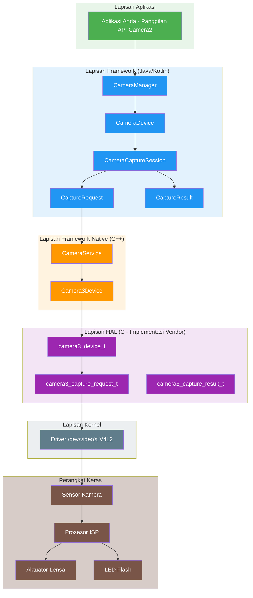
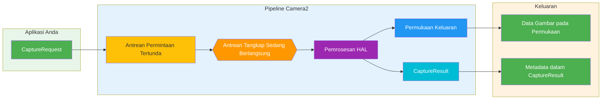
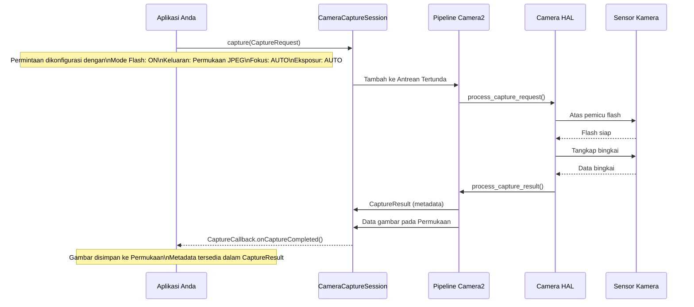
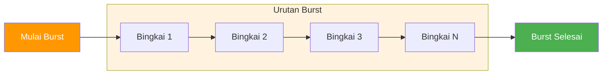
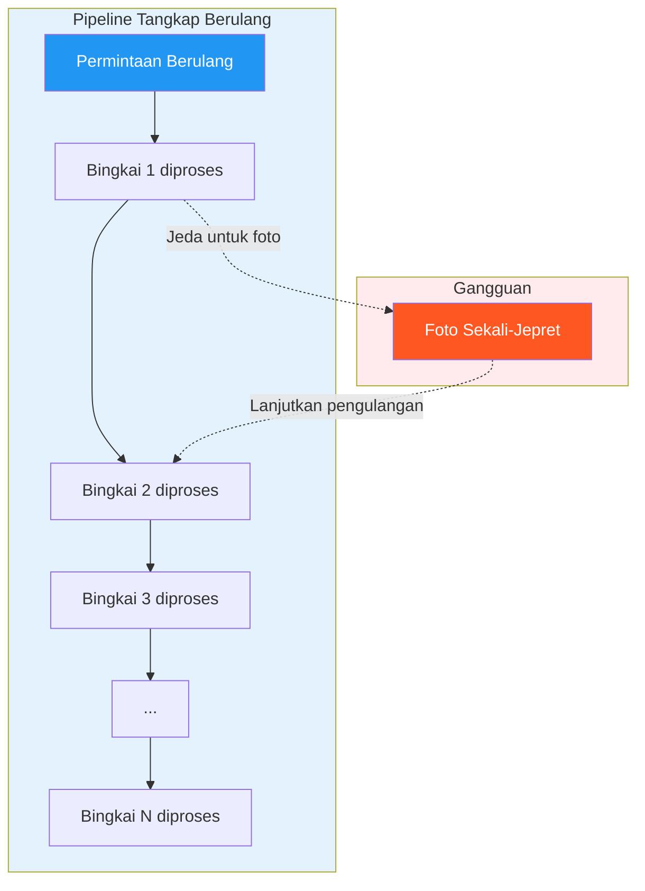
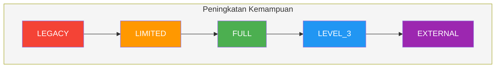
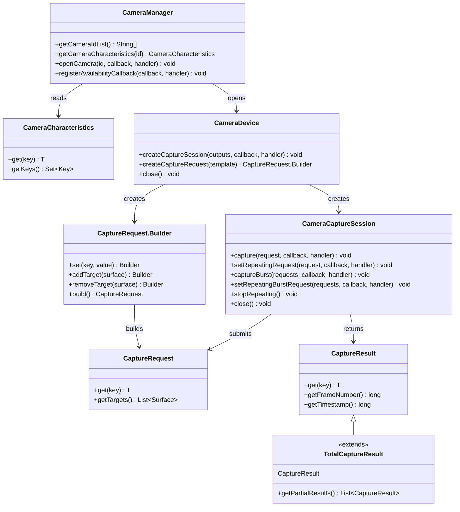
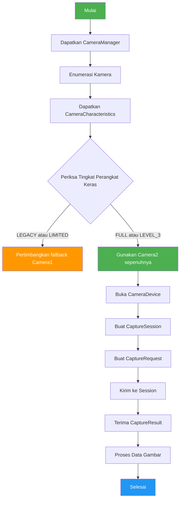
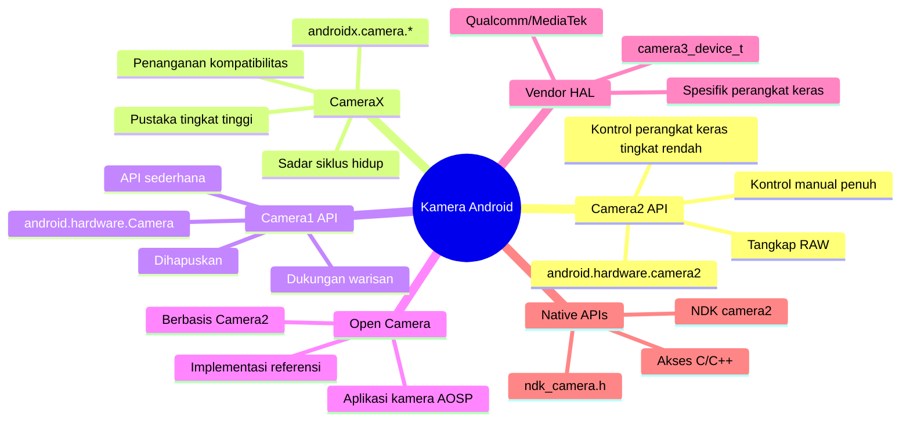

# Bab 1: Selamat Datang di Android Camera2

> **Ringkasan Bab:** Dalam bab ini, kita akan menjelajahi dunia Android Camera2 dari dasar. Anda akan memahami bukan hanya *apa* itu Camera2, tetapi *mengapa* ia diciptakan, *bagaimana* cara kerjanya, dan *di mana* posisinya dalam ekosistem kamera Android. Kita akan membahas model Pipeline, jenis tangkap, klasifikasi Tingkat Perangkat Keras, dan arsitektur lengkap dari Aplikasi hingga HAL.

---

## 1.1 Mengapa Belajar Camera2?

Hampir setiap smartphone saat ini memiliki sistem kamera yang kuat. Ponsel modern dapat:

- Menangkap foto yang terlihat profesional dengan fotografi komputasional
- Merekam video 4K dan 8K pada kecepatan bingkai tinggi
- Membuat efek potret dengan pendeteksian kedalaman
- Memotret dalam cahaya rendah ekstrem dengan mode malam
- Menangkap video gerak lambat pada 960 fps
- Menghasilkan informasi kedalaman 3D untuk aplikasi AR
- Menggabungkan beberapa kamera secara mulus

Namun saat Anda membuka aplikasi kamera default, Anda hanya melihat antarmuka sederhana: tombol rana, kontrol zoom, dan beberapa mode pemotretan.

Di balik antarmuka sederhana ini terdapat sistem yang sangat kompleks. Aplikasi kamera berkomunikasi dengan komponen perangkat keras, prosesor gambar, dan framework Android untuk menghasilkan setiap bingkai.

### Siapa yang Harus Belajar Camera2?

Sebagai pengembang Android, kita mungkin ingin membangun aplikasi yang melampaui aplikasi kamera default:

- **Aplikasi fotografi manual** dengan kontrol penuh atas eksposur, ISO, dan fokus
- **Alat pengujian kamera** untuk teknisi guna memverifikasi kemampuan perangkat
- **Aplikasi visi komputer** yang membutuhkan akses bingkai mentah
- **Aplikasi pemindaian 3D** menggunakan sensor kedalaman
- **Perekam video profesional** dengan pemilihan codec dan kontrol bitrate
- **Penganalisis kemampuan kamera** seperti [Android Camera Parameters](/)[^1^] milik kami sendiri

Jika salah satu dari skenario ini terdengar familiar, Camera2 adalah API yang perlu Anda kuasai.

---

## 1.2 Apa Itu Android Camera2?

**Android Camera2** adalah framework kamera modern yang diperkenalkan oleh Google pada **Android 5.0 (API level 21)**. Ini menggantikan API `android.hardware.Camera` asli (yang sekarang disebut **Camera1** secara retrospektif).

### Masalah yang Diselesaikan Camera2

API Kamera lama (Camera1) dirancang untuk dunia yang lebih sederhana: satu kamera, tangkap foto dasar, dan perekaman video sederhana. Namun kamera smartphone berevolusi secara dramatis:

| Era | Perangkat Khusus | API Kamera |
|-----|-----------------|------------|
| 2010-2014 | Kamera tunggal, sensor dasar | Camera1 |
| 2015-2018 | Kamera ganda, OIS, HDR | Camera2 (penggunaan terbatas) |
| 2019-2022 | Kamera tiga, kedalaman, telefoto | Camera2 (standar) |
| 2023+ | Kamera empat, periskop, LiDAR, UWB | Camera2 (esensial) |

Perangkat modern mungkin memiliki beberapa kamera belakang (lebar, ultra-lebar, telefoto, periskop), sensor kedalaman, bahkan kamera USB eksternal. Mereka mendukung fitur lanjutan seperti:

- Eksposur dan fokus manual
- Tangkap gambar RAW
- Perekaman video kecepatan tinggi
- Pemrosesan HDR
- Stabilisasi optik (OIS)
- Fusi multi-kamera

Camera2 diciptakan untuk memberi pengembang **kontrol yang dalam, tepat, dan mendetail** atas perangkat keras kamera.

---

## 1.3 Camera2 vs Camera1 vs CameraX

Sebelum mendalami Camera2, mari kita perjelas hubungan antara tiga API kamera utama.

### Camera1 (`android.hardware.Camera`)

- **Diperkenalkan:** Android 1.0 (dihapuskan pada Android 5.0)
- **Model:** Prosedural, stateful, berorientasi kamera tunggal
- **Kelebihan:** Sederhana, dipahami dengan baik, kompatibel secara luas
- **Kekurangan:** Kontrol terbatas, tidak ada dukungan RAW, tidak ada multi-kamera, tidak ada mode burst

### Camera2 (`android.hardware.camera2`)

- **Diperkenalkan:** Android 5.0 (API 21)
- **Model:** Berorientasi objek, stateless, pipeline permintaan/respons
- **Kelebihan:** Kontrol perangkat keras yang dalam, dukungan RAW, multi-kamera, video kecepatan tinggi
- **Kekurangan:** Kompleks, verbose, memerlukan pemahaman tentang internal kamera

### CameraX (`androidx.camera.*`)

- **Diperkenalkan:** Android 10 (pra-rilis), stabil di Android 11+
- **Model:** Deklaratif, sadar siklus hidup, berbasis kasus penggunaan
- **Kelebihan:** Mudah digunakan, kompatibilitas otomatis, manajemen siklus hidup
- **Kekurangan:** Kontrol lanjutan terbatas, mungkin tidak mengekspos semua fitur perangkat keras

### Tabel Perbandingan

| Dimensi | Camera1 | Camera2 | CameraX |
|---------|---------|---------|---------|
| **Level** | Tingkat rendah (dihapuskan) | Tingkat rendah (saat ini) | Tingkat tinggi (Jetpack) |
| **Kesulitan** | Mudah | Sulit | Mudah |
| **Kontrol** | Minimal | Maksimal | Sedang |
| **Dukungan RAW** | Tidak | Ya | Terbatas |
| **Multi-Kamera** | Tidak | Ya | Terbatas |
| **Mode Burst** | Tidak | Ya | Tidak |
| **Kontrol Manual** | Terbatas | Penuh | Terbatas |
| **Terbaik Untuk** | Aplikasi warisan | Aplikasi kamera lanjutan | Sebagian besar aplikasi kamera |
| **Status** | Dihapuskan | Aktif | Direkomendasikan |

### Mengapa Seri Ini Berfokus pada Camera2

Meskipun CameraX direkomendasikan untuk sebagian besar aplikasi, memahami Camera2 sangat penting karena:

1. **CameraX dibangun di atas Camera2** — CameraX menggunakan Camera2 di bawah kap mesin. Memahami Camera2 membantu Anda memahami apa yang dilakukan CameraX.
2. **Beberapa fitur hanya tersedia di Camera2** — Tangkap RAW, kontrol sensor manual, dan skenario multi-kamera lanjutan memerlukan Camera2.
3. **Debugging memerlukan pengetahuan Camera2** — Ketika aplikasi CameraX tidak berfungsi seperti yang diharapkan, Anda sering perlu memahami perilaku Camera2 yang mendasarinya untuk mendiagnosis masalah.
4. **Pemahaman Camera2 sangat mendasar** — Bahkan jika Anda menggunakan CameraX untuk aplikasi Anda, memahami Camera2 membuat Anda menjadi pengembang kamera Android yang lebih baik.

---

## 1.4 Arsitektur Camera2: Gambaran Besar

Camera2 berada di tengah tumpukan kamera Android, menjembatani kode aplikasi dengan driver perangkat keras. Memahami arsitektur ini sangat penting untuk debugging dan optimisasi.

### Arsitektur Berlapis



### Penjelasan Lapisan Arsitektur

| Lapisan | Lokasi | Bahasa | Tanggung Jawab |
|---------|--------|--------|----------------|
| **Aplikasi** | Kode aplikasi Anda | Kotlin/Java | Buat CaptureRequest, tangani CaptureResult |
| **Framework (Java)** | `android.hardware.camera2.*` | Java | API publik, mengelola sesi, mengonversi data |
| **Framework Native** | `frameworks/av/` | C++ | Binder IPC, CameraService, Camera3Device |
| **HAL** | `hardware/libhardware/` + vendor | C | Abstraksi perangkat keras, implementasi spesifik vendor |
| **Kernel** | `/dev/videoX` | C | Driver V4L2, komunikasi perangkat keras |
| **Perangkat Keras** | Modul kamera fisik | — | Sensor, ISP, lensa, flash |

### Prinsip Desain Utama: Camera2 adalah Pipeline

Konsep paling penting untuk dipahami tentang Camera2 adalah bahwa ia memodelkan operasi kamera sebagai **pipeline**. Setiap tindakan — pratinjau, tangkap foto, perekaman video — dinyatakan sebagai **Permintaan Tangkap** yang mengalir melalui pipeline dan menghasilkan **Hasil Tangkap**.

---

## 1.5 Model Pipeline Camera2

Pipeline adalah jantung desain Camera2. Ini menggantikan model stateful, satu-per-satu-waktu dari Camera1 dengan model stateless, permintaan/respons.

### Cara Kerja Pipeline



### Komponen Pipeline Dijelaskan

| Komponen | Deskripsi |
|----------|-----------|
| **CaptureRequest** | Objek konfigurasi yang menjelaskan *satu bingkai* tangkapan. Berisi semua parameter: waktu eksposur, mode fokus, flash, permukaan keluaran, dll. |
| **Antrean Permintaan Tertunda** | Antrean FIFO tempat CaptureRequest baru menunggu untuk diproses |
| **Antrean Tangkap Sedang Berlangsung** | Permintaan yang saat ini sedang diproses oleh HAL. Biasanya dibatasi hingga 1-4 permintaan tergantung perangkat |
| **Pemrosesan HAL** | Lapisan abstraksi perangkat keras memproses permintaan: mengontrol sensor, ISP, lensa, dll. |
| **Permukaan Keluaran** | Gambar ditulis ke Permukaan yang dikonfigurasi (Permukaan pratinjau, Permukaan ImageReader, dll.) |
| **CaptureResult** | Metadata tentang tangkapan: waktu eksposur aktual, status AF, cap waktu, dll. TIDAK berisi data gambar |

### Properti Pipeline Utama

1. **Permintaan stateless** — Setiap CaptureRequest berisi semua informasi yang diperlukan. Pipeline tidak memiliki memori dari permintaan sebelumnya.
2. **Pemrosesan berurutan** — Permintaan diproses dalam urutan FIFO oleh HAL.
3. **Hasil asinkron** — CaptureResult tiba melalui callback, bukan dikembalikan secara sinkron.
4. **Keluaran banyak per permintaan** — Satu CaptureRequest dapat menulis ke banyak Permukaan (misalnya, pratinjau + foto secara bersamaan).
5. **Pipeline dapat dikonfigurasi** — Anda dapat memilih template (pratinjau, tangkap diam, rekam) atau mode manual sepenuhnya.

### Contoh Konkrit: Mengambil Foto dengan Flash

Untuk memahami Pipeline, mari kita telusuri apa yang terjadi saat Anda mengambil foto dengan flash:



---

## 1.6 Jenis Tangkap: Sekali-Jepret, Burst, dan Berulang

Camera2 mendefinisikan tiga dasar Jenis Tangkap, masing-masing melayani kasus penggunaan yang berbeda. Memahami hal ini sangat penting untuk merancang aplikasi kamera dengan benar.

### Tipe 1: Tangkap Sekali-Jepret

**Sekali-Jepret** menangkap dieksekusi tepat sekali. Mereka sangat ideal untuk tindakan tunggal seperti mengambil foto atau menerapkan perubahan pengaturan satu kali.


**Kasus Penggunaan:**
- Mengambil satu foto
- Menerapkan flash sementara
- Menangkap bingkai untuk analisis
- Memicu fokus otomatis satu kali

**Panggilan API:**
```kotlin
cameraCaptureSession.capture(captureRequest, callback, handler)
```

### Tipe 2: Tangkap Burst

**Burst** menangkap dieksekusi berkali-kali secara berurutan tanpa gangguan. Setelah dimulai, tidak ada permintaan lain yang dapat disisipkan hingga burst selesai.



**Karakteristik Utama:**
- Semua bingkai dalam burst memiliki pengaturan yang identik atau sedikit berbeda secara bertahap
- Tidak ada permintaan lain yang dapat diproses selama burst
- Antrean burst terpisah dari antrean permintaan tertunda
- Prioritas lebih tinggi daripada permintaan berulang

**Kasus Penggunaan:**
- Tangkap foto berkelanjutan (mode burst)
- Bracketing (menangkap adegan yang sama pada eksposur berbeda)
- Analisis gerak (menangkap subjek yang bergerak cepat)
- Tangkap multi-bingkai berurutan untuk kompositing

**Panggilan API:**
```kotlin
cameraCaptureSession.captureBurst(burstRequests, callback, handler)
```

### Tipe 3: Tangkap Berulang

**Berulang** menangkap dieksekusi terus-menerus, membentuk dasar pratinjau langsung dan perekaman video. Ketika permintaan berulang aktif, ia menempati pipeline di antara tangkapan lainnya.



**Karakteristik Utama:**
- Hanya satu permintaan berulang yang bisa aktif pada satu waktu (menggantikan sebelumnya)
- Diganggu oleh permintaan sekali-jepret dan burst, lalu secara otomatis dilanjutkan
- Membentuk dasar pratinjau dan perekaman video
- Tidak menghasilkan CaptureResult individu untuk setiap bingkai (menggunakan hasil parsial untuk efisiensi)

**Kasus Penggunaan:**
- Pratinjau kamera langsung
- Perekaman video
- Pemantauan fokus berkelanjutan
- Analisis bingkai real-time

**Panggilan API:**
```kotlin
cameraCaptureSession.setRepeatingRequest(captureRequest, callback, handler)
// atau untuk video:
cameraCaptureSession.setRepeatingBurstRequest(burstRequests, callback, handler)
```

### Perbandingan Jenis Tangkap

| Fitur | Sekali-Jepret | Burst | Berulang |
|-------|---------------|-------|----------|
| **Eksekusi** | Sekali | Berkali-kali (berkelanjutan) | Berkelanjutan |
| **Prioritas** | Tinggi | Tertinggi | Terendah |
| **Gangguan** | Tidak dapat diganggu | Tidak dapat diganggu | Dapat diganggu |
| **Antrean** | Antrean Tertunda | Antrean Burst terpisah | Okupasi pipeline |
| **Penggunaan Khusus** | Foto, bingkai tunggal | Mode burst, bracketing | Pratinjau, video |
| **Callback Hasil** | Satu hasil per panggilan | Satu hasil per bingkai | Hasil secara berkala |

### Sistem Template Tangkap

Camera2 menyediakan template standar untuk skenario tangkap umum:

| Template | Deskripsi | Kasus Penggunaan |
|----------|-----------|------------------|
| `TEMPLATE_PREVIEW` | Dioptimalkan untuk pratinjau langsung | Pratinjau kamera |
| `TEMPLATE_STILL_CAPTURE` | Dioptimalkan untuk tangkap foto | Mengambil foto |
| `TEMPLATE_RECORD` | Dioptimalkan untuk perekaman video | Tangkap video |
| `TEMPLATE_VIDEO_SNAPSHOT` | Foto selama perekaman video | Snapshot saat merekam |
| `TEMPLATE_ZERO_SHUTTER_LAG` | Kualitas tinggi, penundaan minimal | Fotografi burst |
| `TEMPLATE_MANUAL` | Semua kontrol otomatis dinonaktifkan | Kontrol manual penuh |

Template adalah jalan pintas yang mengonfigurasi parameter umum sebelumnya. Anda kemudian dapat memodifikasi pengaturan individu dari template tersebut.

---

## 1.7 Tingkat Perangkat Keras yang Didukung

Tidak semua perangkat Android mendukung rangkaian fitur Camera2 sepenuhnya. Untuk mengatasi hal ini, Google mendefinisikan **Tingkat Perangkat Keras yang Didukung** — sistem klasifikasi yang memberi tahu pengembang apa yang diharapkan dari implementasi kamera perangkat.

### Klasifikasi Tingkat Perangkat Keras



### Deskripsi Tingkat

| Tingkat | Deskripsi | Dukungan Camera2 |
|---------|-----------|-----------------|
| **LEGACY** | Kompatibel kembali dengan Camera1. Panggilan Camera2 dikonversi ke Camera1 di bawah kap mesin. | Hanya fitur Camera1 dasar |
| **LIMITED** | Beberapa fitur Camera2 didukung. Pipeline Camera2 penuh tidak dijamin. | Fitur Camera2 parsial |
| **FULL** | Rangkaian fitur Camera2 lengkap. Pipeline penuh, kontrol manual, multi-kamera. | Semua fitur Camera2 |
| **LEVEL_3** | Semua yang ada di FULL, ditambah pemrosesan ulang YUV dan aliran keluaran tambahan. | FULL + fitur lanjutan |
| **EXTERNAL** | Mirip dengan LIMITED tetapi untuk kamera eksternal (USB, dll.). | Dukungan kamera eksternal |

### Cara Memeriksa Tingkat Perangkat Keras

Anda dapat memeriksa tingkat perangkat keras menggunakan `CameraCharacteristics`:

```kotlin
val cameraManager = getSystemService(Context.CAMERA_SERVICE) as CameraManager
val cameraId = cameraManager.cameraIdList[0]
val characteristics = cameraManager.getCameraCharacteristics(cameraId)

val hardwareLevel = characteristics.get(CameraCharacteristics.INFO_SUPPORTED_HARDWARE_LEVEL)
val levelName = when (hardwareLevel) {
    CameraCharacteristics.INFO_SUPPORTED_HARDWARE_LEVEL_LEGACY -> "LEGACY"
    CameraCharacteristics.INFO_SUPPORTED_HARDWARE_LEVEL_LIMITED -> "LIMITED"
    CameraCharacteristics.INFO_SUPPORTED_HARDWARE_LEVEL_FULL -> "FULL"
    CameraCharacteristics.INFO_SUPPORTED_HARDWARE_LEVEL_3 -> "LEVEL_3"
    CameraCharacteristics.INFO_SUPPORTED_HARDWARE_LEVEL_EXTERNAL -> "EXTERNAL"
    else -> "UNKNOWN"
}
Log.d("Camera", "Hardware Level: $levelName")
```

### Implikasi Praktis

| Tingkat | Apa Artinya bagi Aplikasi Anda |
|---------|-------------------------------|
| **LEGACY** | Camera2 mungkin berfungsi tetapi dengan batasan. Pertimbangkan Camera1 sebagai fallback. |
| **LIMITED** | Fitur Camera2 dasar berfungsi. Beberapa fitur lanjutan mungkin tidak ada. |
| **FULL** | Dukungan Camera2 lengkap. Aman untuk menggunakan semua fitur Camera2. |
| **LEVEL_3** | Dapat menggunakan pemrosesan ulang YUV dan fitur multi-aliran lanjutan. |
| **EXTERNAL** | Dapat mendukung kamera USB dan input eksternal lainnya. |

### Pemeriksaan Kemampuan saat Runtime

Di luar tingkat perangkat keras, selalu periksa kemampuan spesifik saat runtime:

```kotlin
val capabilities = characteristics.get(CameraCharacteristics.REQUEST_AVAILABLE_CAPABILITIES)
capabilities?.forEach { capability ->
    when (capability) {
        CameraMetadata.REQUEST_AVAILABLE_CAPABILITIES_BACKWARD_COMPATIBLE ->
            Log.d("Camera", "Supports backward compatible mode")
        CameraMetadata.REQUEST_AVAILABLE_CAPABILITIES_MANUAL_SENSOR ->
            Log.d("Camera", "Supports manual sensor control")
        CameraMetadata.REQUEST_AVAILABLE_CAPABILITIES_MANUAL_POST_PROCESSING ->
            Log.d("Camera", "Supports manual post-processing")
        CameraMetadata.REQUEST_AVAILABLE_CAPABILITIES_RAW ->
            Log.d("Camera", "Supports RAW capture")
        CameraMetadata.REQUEST_AVAILABLE_CAPABILITIES_PRIVATE_REPROCESSING ->
            Log.d("Camera", "Supports private reprocessing")
        CameraMetadata.REQUEST_AVAILABLE_CAPABILITIES_DEEP_OUTPUT ->
            Log.d("Camera", "Supports deep output")
    }
}
```

---

## 1.8 Gambaran Umum Kelas Inti Camera2

API Camera2 dibangun di sekitar sekelompok kelas inti yang kecil. Mari kita berkenalan dengan mereka sebelum mendalami masing-masing secara detail.

### Diagram Hubungan Kelas Inti



### Tanggung Jawab Kelas

| Kelas | Paket | Tanggung Jawab |
|-------|-------|----------------|
| `CameraManager` | `android.hardware.camera2` | Layanan sistem tingkat atas. Menghitung kamera, menyediakan akses ke CameraDevice. |
| `CameraCharacteristics` | `android.hardware.camera2` | Metadata kemampuan kamera hanya-baca. |
| `CameraDevice` | `android.hardware.camera2` | Mewakili kamera yang terhubung. Membuat sesi dan pembangun permintaan tangkap. |
| `CameraCaptureSession` | `android.hardware.camera2` | Instansi pipeline. Mengirimkan CaptureRequest, mengelola tangkap berulang. |
| `CaptureRequest` | `android.hardware.camera2` | Konfigurasi tangkap tidak dapat diubah. Semua parameter untuk satu bingkai. |
| `CaptureRequest.Builder` | `android.hardware.camera2` | Pembangun untuk membuat objek CaptureRequest. |
| `CaptureResult` | `android.hardware.camera2` | Keluaran metadata dari tangkapan yang selesai. |
| `TotalCaptureResult` | `android.hardware.camera2` | Hasil tangkap lengkap termasuk semua hasil parsial. |

### Alur Kerja Camera2



---

## 1.9 Camera2 vs Camera1: Perbandingan Mendalam

Jika Anda pernah bekerja dengan Camera1 sebelumnya, Anda akan menghargai perbedaannya. Jika belum, bagian ini akan membantu Anda memahami mengapa Camera2 adalah perancangan ulang yang mendasar.

### Perbandingan Arsitektur

| Aspek | Camera1 | Camera2 |
|-------|---------|---------|
| **Model Pemrograman** | Prosedural (imperatif) | Berorientasi objek (deklaratif) |
| **Manajemen Status** | Stateful (kamera memelihara status) | Stateless (setiap permintaan mandiri) |
| **Model Tangkap** | Perintah (takePicture(), startPreview()) | Pipeline (CaptureRequest → CaptureResult) |
| **Threading** | Sebagian besar single-threaded | Dirancang untuk penggunaan multi-threaded |
| **Penanganan Kesalahan** | Pengecualian, sulit dipulihkan | Kode kesalahan + pengecualian, lebih mendetail |
| **Metadata** | Hanya-baca setelah tangkap | Tersedia secara real-time selama tangkap |
| **Keluaran Banyak** | Tidak didukung | Satu permintaan → banyak permukaan |
| **Zero-Copy** | Tidak didukung | Didukung melalui ImageReader |

### Perbandingan API Berdampingan

#### Membuka Kamera

```kotlin
// Camera1 (API lama)
val camera = Camera.open()
camera.setPreviewDisplay(surfaceHolder)
camera.startPreview()

// Camera2 (API baru)
val cameraManager = getSystemService(Context.CAMERA_SERVICE) as CameraManager
cameraManager.openCamera(cameraId, object : CameraDevice.StateCallback() {
    override fun onOpened(camera: CameraDevice) {
        mCameraDevice = camera
        // Buat sesi dan permintaan...
    }
    override fun onDisconnected(camera: CameraDevice) { camera.close() }
    override fun onError(camera: CameraDevice, error: Int) { camera.close() }
}, handler)
```

#### Mengambil Foto

```kotlin
// Camera1 (API lama)
camera.takePicture(null, null, object : Camera.PictureCallback() {
    override fun onPictureTaken(data: ByteArray, camera: Camera) {
        // Proses data gambar
    }
})

// Camera2 (API baru)
val requestBuilder = mCameraDevice.createCaptureRequest(CameraDevice.TEMPLATE_STILL_CAPTURE)
requestBuilder.addTarget(imageReader.surface)
val captureRequest = requestBuilder.build()
mCameraCaptureSession.capture(captureRequest, object : CameraCaptureSession.CaptureCallback() {
    override fun onCaptureCompleted(session: CameraCaptureSession, 
                                    request: CaptureRequest, 
                                    result: TotalCaptureResult) {
        // Metadata dalam hasil
        val exposureTime = result.get(CaptureResult.SENSOR_EXPOSURE_TIME)
    }
}, handler)
// Data gambar tiba melalui ImageReader.OnImageAvailableListener
```

#### Perbedaan Utama dalam Praktik

| Operasi | Camera1 | Camera2 |
|---------|---------|---------|
| **Pratinjau + Foto** | Harus menghentikan pratinjau untuk mengambil foto, lalu memulai ulang | Dapat mengambil foto tanpa menghentikan pratinjau |
| **Banyak Foto** | Hanya satu foto pada satu waktu | Mode burst dengan jumlah arbitrer |
| **Eksposur Manual** | Tidak tersedia | Kontrol penuh atas waktu eksposur dan gain |
| **Fokus Manual** | Hanya mode yang telah ditentukan | Kontrol penuh atas posisi lensa |
| **Tangkap RAW** | Tidak tersedia | Didukung pada perangkat FULL+ |
| **Metadata Real-time** | Tidak tersedia | Tersedia melalui CaptureResult parsial |

### Tips Migrasi dari Camera1

Jika Anda bermigrasi dari Camera1 ke Camera2, ingat tips berikut:

1. **Pikirkan dalam hal CaptureRequest**, bukan perintah. Setiap tindakan — fokus, flash, foto — adalah CaptureRequest.
2. **Pisahkan pratinjau dari tangkap**. Pada Camera1, Anda harus menghentikan pratinjau untuk menangkap. Pada Camera2, Anda mengirimkan permintaan terpisah sementara permintaan berulang berlanjut.
3. **Gunakan handler untuk callback**. Callback Camera2 berjalan pada utas Handler. Selalu sediakan satu untuk menghindari ANR.
4. **Periksa tingkat perangkat keras terlebih dahulu**. Jika perangkat adalah LEGACY, pertimbangkan untuk menggunakan Camera1 sebagai gantinya.
5. **Gunakan template CaptureRequest** untuk operasi umum. Modifikasi dari template daripada membangun dari awal.
6. **Jangan memblokir utas utama**. Semua operasi Camera2 harus berjalan pada utas latar belakang.

---

## 1.10 Camera2 di Ekosistem Android

Camera2 tidak ada dalam isolasi. Ini adalah bagian dari ekosistem yang lebih besar dari API dan terkait kamera.

### Ekosistem API Kamera



### Kapan Menggunakan API yang Mana

| Persyaratan | API yang Direkomendasikan | Alasan |
|-------------|--------------------------|--------|
| Aplikasi foto sederhana | CameraX | Paling mudah, paling kompatibel |
| Perekaman video | CameraX | Dukungan video bawaan |
| Fotografi manual | Camera2 | Kontrol penuh atas semua parameter |
| Visi komputer | Camera2 | Akses bingkai langsung, latensi minimal |
| Fusi multi-kamera | Camera2 | Hanya API dengan dukungan multi-kamera penuh |
| Tangkap RAW | Camera2 | Hanya API dengan dukungan RAW |
| Kamera eksternal | Camera2 | Dukungan kamera eksternal (tingkat EXTERNAL) |
| Dukungan perangkat lama | Camera1 | Kompatibilitas dengan perangkat lama |

---

## 1.11 Belajar dengan Android Camera Parameters

Membaca dokumentasi itu berguna, tetapi kemampuan kamera lebih mudah dipahami saat Anda dapat melihat data nyata dari ponsel nyata. Sepanjang seri ini, kita akan menggunakan [Android Camera Parameters](/)[^2^] untuk menjelajahi informasi kamera aktual dari perangkat Anda sendiri.

Anda dapat menggunakan aplikasi untuk menemukan:

- Kamera yang tersedia (ID, arah hadap, tingkat perangkat keras)
- Resolusi dan kecepatan bingkai yang didukung
- Informasi sensor (ukuran array aktif, panjang fokus)
- Dukungan kontrol manual (rentang ISO, rentang waktu eksposur)
- Kemampuan dan format RAW
- Tingkat perangkat keras dan kemampuan yang didukung
- Dump CameraCharacteristics lengkap

Alih-alih belajar dari contoh abstrak, Anda dapat langsung menyelidiki perangkat Anda sendiri dan melihat bagaimana konsep-konsep dalam bab ini berlaku untuk perangkat keras nyata.

---

## 1.12 Poin Kunci

Selamat menyelesaikan Bab 1! Berikut adalah apa yang harus Anda ingat:

### Konsep Inti

1. **Camera2 adalah pipeline** — Setiap operasi kamera adalah CaptureRequest yang mengalir melalui pipeline dan menghasilkan CaptureResult.
2. **Jenis tangkap** — Sekali-jepret (tunggal), Burst (berkelanjutan banyak), Berulang (berkelanjutan)
3. **Tingkat Perangkat Keras** — LEGACY → LIMITED → FULL → LEVEL_3 → EXTERNAL
4. **Lapisan arsitektur** — Aplikasi → Framework → Framework Native → HAL → Kernel → Perangkat Keras

### Prinsip Praktis

1. **Selalu periksa tingkat perangkat keras** — Tidak semua perangkat mendukung fitur Camera2 sepenuhnya
2. **Periksa kemampuan saat runtime** — Jangan berasumsi fitur tersedia
3. **Gunakan template untuk operasi umum** — `TEMPLATE_PREVIEW`, `TEMPLATE_STILL_CAPTURE`, dll.
4. **Jalankan pada utas latar belakang** — Operasi Camera2 tidak boleh memblokir utas utama
5. **Pisahkan pratinjau dari tangkap** — Gunakan permintaan berulang untuk pratinjau, sekali-jepret untuk foto

### Apa Selanjutnya

Di bab berikutnya, **Memahami Kamera Smartphone**, kita akan meninggalkan Android sejenak dan menjelajahi perangkat keras kamera itu sendiri. Anda akan belajar tentang:

- Teknologi sensor kamera (CMOS vs CCD)
- Desain lensa dan panjang fokus
- Pipeline pemrosesan ISP (Image Signal Processor)
- Mengapa dua ponsel dengan jumlah megapixel serupa dapat menghasilkan foto yang sangat berbeda
- Pipeline gambar lengkap dari cahaya hingga foto akhir

Setelah Anda memahami perangkat keras, konsep Camera2 akan menjadi jauh lebih intuitif.

---

## 1.13 Ringkasan

Android Camera2 adalah framework kamera tingkat rendah yang kuat yang memberi pengembang kontrol belum pernah terjadi sebelumnya atas perangkat keras kamera. Arsitektur berbasis Pipeline, tiga jenis tangkap, dan klasifikasi Tingkat Perangkat Keras memberikan dasar yang kokoh untuk membangun aplikasi kamera lanjutan.

Dalam bab ini, kita membahas:
- ✅ Arsitektur Camera2 dan posisi ekosistem
- ✅ Model pipeline dengan alur permintaan/hasil
- ✅ Jenis tangkap: sekali-jepret, burst, berulang
- ✅ Klasifikasi Tingkat Perangkat Keras dan pemeriksaan runtime
- ✅ Gambaran umum dan hubungan kelas inti
- ✅ Perbandingan mendalam Camera1 vs Camera2

Sekarang mari kita dalami perangkat keras kamera itu sendiri di Bab 2! 🚀